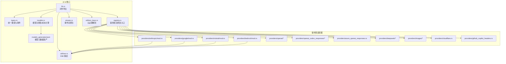
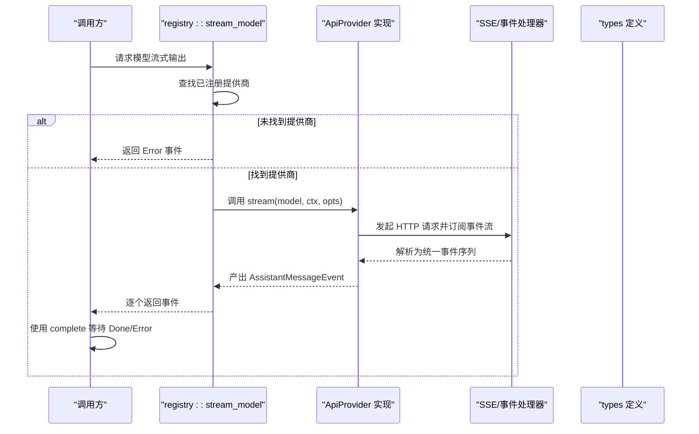
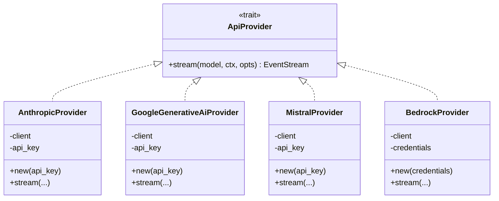
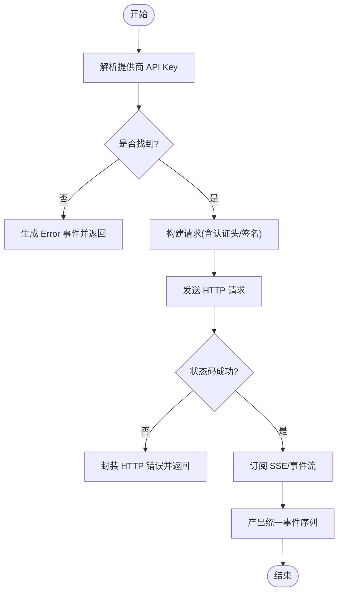
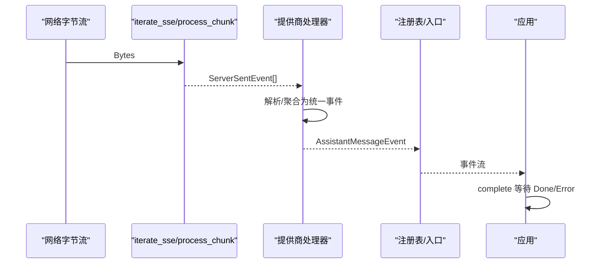
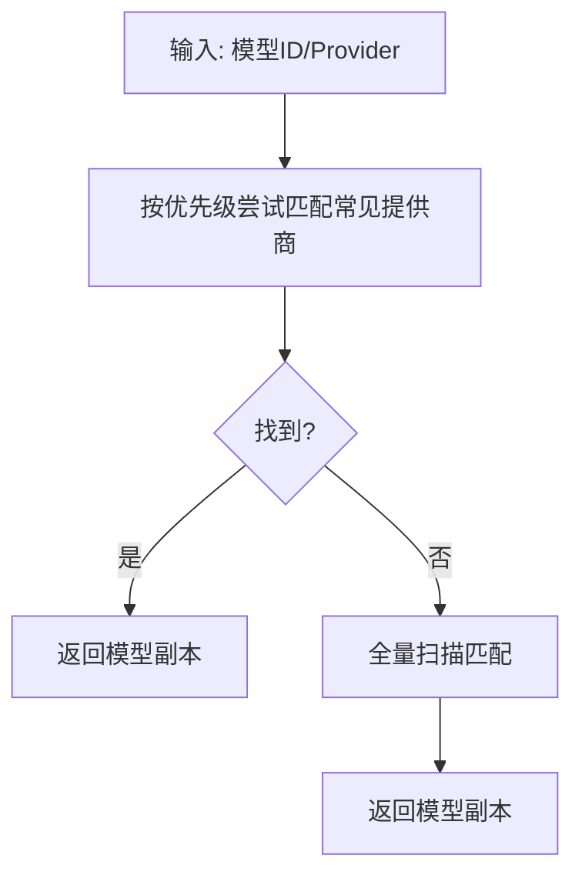
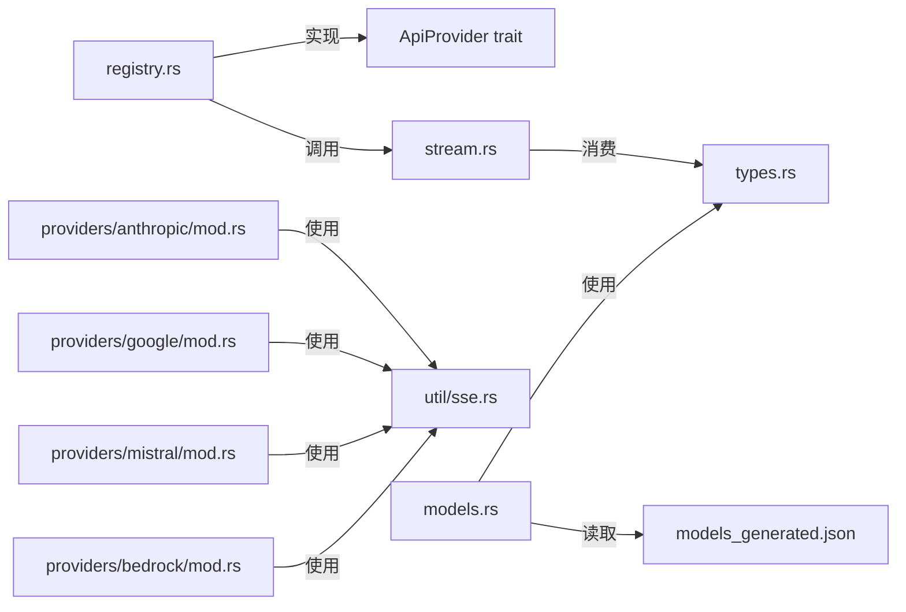

# AI 服务集成

<cite>
**本文引用的文件**
- [lib.rs](file://crates/pi-ai/src/lib.rs)
- [providers/mod.rs](file://crates/pi-ai/src/providers/mod.rs)
- [models.rs](file://crates/pi-ai/src/models.rs)
- [registry.rs](file://crates/pi-ai/src/registry.rs)
- [stream.rs](file://crates/pi-ai/src/stream.rs)
- [types.rs](file://crates/pi-ai/src/types.rs)
- [providers/anthropic/mod.rs](file://crates/pi-ai/src/providers/anthropic/mod.rs)
- [providers/google/mod.rs](file://crates/pi-ai/src/providers/google/mod.rs)
- [providers/mistral/mod.rs](file://crates/pi-ai/src/providers/mistral/mod.rs)
- [providers/bedrock/mod.rs](file://crates/pi-ai/src/providers/bedrock/mod.rs)
- [util/sse.rs](file://crates/pi-ai/src/util/sse.rs)
- [util/env_keys.rs](file://crates/pi-ai/src/util/env_keys.rs)
- [models_generated.json](file://crates/pi-ai/src/models_generated.json)
- [examples/faux_stream.rs](file://crates/pi-ai/examples/faux_stream.rs)
- [tests/model_registry.rs](file://crates/pi-ai/tests/model_registry.rs)
</cite>

## 目录
1. [简介](#简介)
2. [项目结构](#项目结构)
3. [核心组件](#核心组件)
4. [架构总览](#架构总览)
5. [详细组件分析](#详细组件分析)
6. [依赖关系分析](#依赖关系分析)
7. [性能考虑](#性能考虑)
8. [故障排查指南](#故障排查指南)
9. [结论](#结论)
10. [附录](#附录)

## 简介
本文件为 AI 服务集成层的技术文档，聚焦于多提供商抽象层的设计与实现，涵盖统一接口设计、认证管理、流式事件处理（含 SSE）、模型注册表与成本计算、以及各主流 LLM 提供商（Anthropic Claude、OpenAI、Google Gemini、Mistral AI、AWS Bedrock）的集成方式。文档同时提供可操作的集成示例、配置方法、性能优化建议与常见问题排查技巧。

## 项目结构
- 核心模块
  - providers：多提供商适配器集合，按供应商划分子模块
  - util：通用工具，如 SSE 解析、环境变量解析、HTTP 重试等
  - types：统一的数据模型与事件类型定义
  - models.rs：模型注册表与成本计算
  - registry.rs：全局提供商注册表与入口
  - stream.rs：事件流聚合与完成等待
  - lib.rs：对外公开 API 聚合导出
- 示例与测试
  - examples/faux_stream.rs：演示如何注册与消费自定义提供商流
  - tests/model_registry.rs：覆盖模型注册表与成本计算的行为测试

图表来源
- [lib.rs:1-19](file://crates/pi-ai/src/lib.rs#L1-L19)
- [providers/mod.rs:1-61](file://crates/pi-ai/src/providers/mod.rs#L1-L61)
- [models.rs:39-45](file://crates/pi-ai/src/models.rs#L39-L45)
- [registry.rs:13-26](file://crates/pi-ai/src/registry.rs#L13-L26)
- [stream.rs:5](file://crates/pi-ai/src/stream.rs#L5)
- [util/sse.rs:1-167](file://crates/pi-ai/src/util/sse.rs#L1-L167)
- [util/env_keys.rs:1-143](file://crates/pi-ai/src/util/env_keys.rs#L1-L143)
- [models_generated.json:1-200](file://crates/pi-ai/src/models_generated.json#L1-L200)

章节来源
- [lib.rs:1-19](file://crates/pi-ai/src/lib.rs#L1-L19)
- [providers/mod.rs:1-61](file://crates/pi-ai/src/providers/mod.rs#L1-L61)
- [models.rs:39-45](file://crates/pi-ai/src/models.rs#L39-L45)
- [registry.rs:13-26](file://crates/pi-ai/src/registry.rs#L13-L26)
- [stream.rs:5](file://crates/pi-ai/src/stream.rs#L5)
- [util/sse.rs:1-167](file://crates/pi-ai/src/util/sse.rs#L1-L167)
- [util/env_keys.rs:1-143](file://crates/pi-ai/src/util/env_keys.rs#L1-L143)
- [models_generated.json:1-200](file://crates/pi-ai/src/models_generated.json#L1-L200)

## 核心组件
- 统一类型与事件
  - 内容块、消息、使用量与费用、停止原因、助手消息、诊断信息、上下文、工具、模型、流选项等
  - 流事件：start/text_* / thinking_* / toolcall_* / done / error
- 模型注册表
  - 静态加载模型元数据 JSON，支持按 id/provider 列表查询、成本计算
- 注册表与入口
  - ApiProvider trait 抽象统一流式接口；全局注册表按 api 名称注册/查找；stream_model 作为顶层入口
- 流式处理
  - EventStream 类型别名；complete 辅助函数等待 Done 或 Error 事件
- 认证与环境
  - env_api_key 基于提供商映射解析 API Key；部分提供商支持外部凭据链（如 Bedrock）

章节来源
- [types.rs:9-599](file://crates/pi-ai/src/types.rs#L9-L599)
- [models.rs:5-110](file://crates/pi-ai/src/models.rs#L5-L110)
- [registry.rs:9-55](file://crates/pi-ai/src/registry.rs#L9-L55)
- [stream.rs:1-90](file://crates/pi-ai/src/stream.rs#L1-L90)
- [util/env_keys.rs:1-143](file://crates/pi-ai/src/util/env_keys.rs#L1-L143)

## 架构总览
多提供商抽象层通过统一的 ApiProvider 接口屏蔽不同供应商的差异，注册表负责路由到具体提供商实现。流式响应由各提供商内部转换为统一的 AssistantMessageEvent 序列，最终由调用方消费或通过 complete 聚合为完整消息。

图表来源
- [registry.rs:28-55](file://crates/pi-ai/src/registry.rs#L28-L55)
- [stream.rs:7-18](file://crates/pi-ai/src/stream.rs#L7-L18)
- [util/sse.rs:56-89](file://crates/pi-ai/src/util/sse.rs#L56-L89)
- [types.rs:166-242](file://crates/pi-ai/src/types.rs#L166-L242)

## 详细组件分析

### 统一接口与注册表
- ApiProvider trait
  - 定义 stream 方法，接收 Model、Context、StreamOptions，返回 EventStream
- 全局注册表
  - register/unregister/lookup；stream_model 作为顶层入口，自动注入环境 API Key 并委派给提供商
- 内置提供商注册
  - providers/mod.rs 中集中注册所有内置提供商，便于应用启动时一次性加载

图表来源
- [registry.rs:9-11](file://crates/pi-ai/src/registry.rs#L9-L11)
- [providers/anthropic/mod.rs:17-33](file://crates/pi-ai/src/providers/anthropic/mod.rs#L17-L33)
- [providers/google/mod.rs:17-33](file://crates/pi-ai/src/providers/google/mod.rs#L17-L33)
- [providers/mistral/mod.rs:17-33](file://crates/pi-ai/src/providers/mistral/mod.rs#L17-L33)
- [providers/bedrock/mod.rs:24-36](file://crates/pi-ai/src/providers/bedrock/mod.rs#L24-L36)

章节来源
- [registry.rs:9-55](file://crates/pi-ai/src/registry.rs#L9-L55)
- [providers/mod.rs:19-60](file://crates/pi-ai/src/providers/mod.rs#L19-L60)

### 认证管理机制
- 环境变量解析
  - env_api_key 根据提供商映射查找对应环境变量；对某些“自认证”提供商（如 Bedrock、Vertex）检测凭据存在性
- 各提供商的密钥注入
  - Anthropic：x-api-key + anthropic-version
  - Google：URL 查询参数 ?key=... + alt=sse
  - Mistral：Authorization: Bearer
  - Bedrock：Authorization: Bearer 或 SigV4 签名头
- 流选项覆盖
  - StreamOptions.api_key 可显式传入以覆盖环境变量

图表来源
- [util/env_keys.rs:34-46](file://crates/pi-ai/src/util/env_keys.rs#L34-L46)
- [providers/anthropic/mod.rs:36-120](file://crates/pi-ai/src/providers/anthropic/mod.rs#L36-L120)
- [providers/google/mod.rs:36-152](file://crates/pi-ai/src/providers/google/mod.rs#L36-L152)
- [providers/mistral/mod.rs:60-144](file://crates/pi-ai/src/providers/mistral/mod.rs#L60-L144)
- [providers/bedrock/mod.rs:79-211](file://crates/pi-ai/src/providers/bedrock/mod.rs#L79-L211)

章节来源
- [util/env_keys.rs:1-143](file://crates/pi-ai/src/util/env_keys.rs#L1-L143)
- [providers/anthropic/mod.rs:30-54](file://crates/pi-ai/src/providers/anthropic/mod.rs#L30-L54)
- [providers/google/mod.rs:35-65](file://crates/pi-ai/src/providers/google/mod.rs#L35-L65)
- [providers/mistral/mod.rs:60-100](file://crates/pi-ai/src/providers/mistral/mod.rs#L60-L100)
- [providers/bedrock/mod.rs:38-160](file://crates/pi-ai/src/providers/bedrock/mod.rs#L38-L160)

### 流式事件处理（SSE）
- SSE 解析
  - iterate_sse 将字节流转换为 ServerSentEvent；process_chunk 支持跨块拼接、注释行、CRLF 行尾
- 事件映射
  - 各提供商将原始事件映射为统一 AssistantMessageEvent：text/thinking/toolcall 的 start/delta/end
- 错误处理
  - HTTP 失败、超时、读取错误均转化为 Error 事件并携带 stop_reason

图表来源
- [util/sse.rs:56-89](file://crates/pi-ai/src/util/sse.rs#L56-L89)
- [providers/anthropic/mod.rs:111-119](file://crates/pi-ai/src/providers/anthropic/mod.rs#L111-L119)
- [providers/google/mod.rs:142-150](file://crates/pi-ai/src/providers/google/mod.rs#L142-L150)
- [providers/mistral/mod.rs:134-142](file://crates/pi-ai/src/providers/mistral/mod.rs#L134-L142)
- [stream.rs:7-18](file://crates/pi-ai/src/stream.rs#L7-L18)

章节来源
- [util/sse.rs:1-167](file://crates/pi-ai/src/util/sse.rs#L1-L167)
- [providers/anthropic/mod.rs:111-119](file://crates/pi-ai/src/providers/anthropic/mod.rs#L111-L119)
- [providers/google/mod.rs:142-150](file://crates/pi-ai/src/providers/google/mod.rs#L142-L150)
- [providers/mistral/mod.rs:134-142](file://crates/pi-ai/src/providers/mistral/mod.rs#L134-L142)
- [stream.rs:7-18](file://crates/pi-ai/src/stream.rs#L7-L18)

### 模型注册表与成本计算
- 模型元数据
  - 从 models_generated.json 加载静态模型清单；支持按 provider/id 查询、列出所有提供商
- 查找策略
  - 优先按固定顺序匹配常见提供商，再回退全量匹配
- 成本计算
  - 基于每百万令牌费率计算 input/output/cache 的费用，并写回 Usage.cost

图表来源
- [models.rs:5-14](file://crates/pi-ai/src/models.rs#L5-L14)
- [models.rs:16-37](file://crates/pi-ai/src/models.rs#L16-L37)
- [models.rs:39-45](file://crates/pi-ai/src/models.rs#L39-L45)
- [models.rs:47-54](file://crates/pi-ai/src/models.rs#L47-L54)

章节来源
- [models.rs:5-110](file://crates/pi-ai/src/models.rs#L5-L110)
- [models_generated.json:1-200](file://crates/pi-ai/src/models_generated.json#L1-L200)

### 各提供商集成要点

#### Anthropic Claude
- 认证：x-api-key + anthropic-version
- 请求路径：/v1/messages
- SSE：订阅 text/thinking/tool 事件
- 错误：缺失密钥、HTTP 失败、网络异常均转为 Error 事件

章节来源
- [providers/anthropic/mod.rs:36-120](file://crates/pi-ai/src/providers/anthropic/mod.rs#L36-L120)

#### Google Gemini
- 认证：URL 参数 ?key=...
- 请求路径：/models/{model}:streamGenerateContent?alt=sse
- 重试：基于 StreamOptions 的超时与重试配置
- 错误：HTTP 失败、超时、网络异常

章节来源
- [providers/google/mod.rs:36-152](file://crates/pi-ai/src/providers/google/mod.rs#L36-L152)

#### Mistral AI
- 认证：Authorization: Bearer
- 请求路径：/v1/chat/completions（自动补全 /v1 若无）
- 会话亲和：可设置 x-affinity 头
- 错误：缺失密钥、HTTP 失败、网络异常

章节来源
- [providers/mistral/mod.rs:60-144](file://crates/pi-ai/src/providers/mistral/mod.rs#L60-L144)

#### AWS Bedrock
- 认证：支持 Bearer Token 或 SigV4 签名；自动解析区域与凭据
- 请求路径：/model/{id}/converse-stream
- 事件格式：application/vnd.amazon.eventstream
- 错误：凭据缺失、URL 解析失败、HTTP 失败、网络异常

章节来源
- [providers/bedrock/mod.rs:79-211](file://crates/pi-ai/src/providers/bedrock/mod.rs#L79-L211)

### 统一事件模型与流式消费
- 事件类型
  - start/text_* / thinking_* / toolcall_* / done / error
- 流聚合
  - complete 等待 Done 获取完整消息；遇到 Error 返回错误字符串
- 应用示例
  - examples/faux_stream.rs 展示了如何注册自定义提供商并消费事件流

章节来源
- [types.rs:166-242](file://crates/pi-ai/src/types.rs#L166-L242)
- [stream.rs:7-18](file://crates/pi-ai/src/stream.rs#L7-L18)
- [examples/faux_stream.rs:1-82](file://crates/pi-ai/examples/faux_stream.rs#L1-L82)

## 依赖关系分析
- 模块耦合
  - providers 依赖 registry::ApiProvider 与 types；util 提供通用能力（SSE、环境变量）
  - models 依赖 types 与 models_generated.json
  - registry 依赖 types 与 stream
- 外部依赖
  - reqwest 用于 HTTP 请求
  - futures/async-stream 用于异步流处理
  - serde 用于 JSON 序列化与模型资产加载

图表来源
- [registry.rs:9-11](file://crates/pi-ai/src/registry.rs#L9-L11)
- [stream.rs:1-90](file://crates/pi-ai/src/stream.rs#L1-L90)
- [types.rs:1-599](file://crates/pi-ai/src/types.rs#L1-L599)
- [providers/anthropic/mod.rs:1-122](file://crates/pi-ai/src/providers/anthropic/mod.rs#L1-L122)
- [providers/google/mod.rs:1-153](file://crates/pi-ai/src/providers/google/mod.rs#L1-L153)
- [providers/mistral/mod.rs:1-145](file://crates/pi-ai/src/providers/mistral/mod.rs#L1-L145)
- [providers/bedrock/mod.rs:1-314](file://crates/pi-ai/src/providers/bedrock/mod.rs#L1-L314)
- [models.rs:39-45](file://crates/pi-ai/src/models.rs#L39-L45)
- [models_generated.json:1-200](file://crates/pi-ai/src/models_generated.json#L1-L200)

章节来源
- [registry.rs:9-55](file://crates/pi-ai/src/registry.rs#L9-L55)
- [stream.rs:1-90](file://crates/pi-ai/src/stream.rs#L1-L90)
- [types.rs:1-599](file://crates/pi-ai/src/types.rs#L1-L599)
- [providers/anthropic/mod.rs:1-122](file://crates/pi-ai/src/providers/anthropic/mod.rs#L1-L122)
- [providers/google/mod.rs:1-153](file://crates/pi-ai/src/providers/google/mod.rs#L1-L153)
- [providers/mistral/mod.rs:1-145](file://crates/pi-ai/src/providers/mistral/mod.rs#L1-L145)
- [providers/bedrock/mod.rs:1-314](file://crates/pi-ai/src/providers/bedrock/mod.rs#L1-L314)
- [models.rs:39-45](file://crates/pi-ai/src/models.rs#L39-L45)
- [models_generated.json:1-200](file://crates/pi-ai/src/models_generated.json#L1-L200)

## 性能考虑
- 流式消费
  - 使用 EventStream 逐事件消费，避免一次性缓冲大响应
- 超时与重试
  - Google 提供基于 StreamOptions 的超时控制；可结合最大重试次数与退避策略
- 事件聚合
  - 在应用侧尽早合并 text/thinking/toolcall delta，减少上层状态机复杂度
- 模型选择
  - 依据上下文窗口与 token 预算选择合适模型，降低成本与延迟
- 并发与取消
  - 使用 CancellationToken 在上层中断长耗时请求，释放资源

## 故障排查指南
- 未知提供商 API
  - 现象：立即返回 Error 事件
  - 排查：确认 providers/mod.rs 已注册该 api；或在应用启动时调用 register_builtins
- 缺少 API Key
  - 现象：各提供商返回 Error 事件，提示设置相应环境变量
  - 排查：检查 util/env_keys 映射；或在 StreamOptions.api_key 显式传入
- HTTP 失败/超时
  - 现象：Error 事件携带状态码与响应体
  - 排查：核对 base_url、认证头、网络连通性；必要时开启日志与重试
- SSE 解析异常
  - 现象：事件不完整或丢失
  - 排查：确认 iterate_sse 正常工作；检查网络分片与编码
- Bedrock 凭据问题
  - 现象：签名失败或 403
  - 排查：确认 AWS_REGION/AWS_PROFILE/AWS_ACCESS_KEY_ID 等；或使用 Bearer Token

章节来源
- [registry.rs:31-55](file://crates/pi-ai/src/registry.rs#L31-L55)
- [util/env_keys.rs:34-46](file://crates/pi-ai/src/util/env_keys.rs#L34-L46)
- [providers/anthropic/mod.rs:43-54](file://crates/pi-ai/src/providers/anthropic/mod.rs#L43-L54)
- [providers/google/mod.rs:91-126](file://crates/pi-ai/src/providers/google/mod.rs#L91-L126)
- [providers/mistral/mod.rs:68-80](file://crates/pi-ai/src/providers/mistral/mod.rs#L68-L80)
- [providers/bedrock/mod.rs:162-165](file://crates/pi-ai/src/providers/bedrock/mod.rs#L162-L165)
- [util/sse.rs:56-89](file://crates/pi-ai/src/util/sse.rs#L56-L89)

## 结论
本集成层通过统一接口与注册表实现了多提供商的无缝接入，配合完善的流式事件模型与成本计算，既保证了易用性也兼顾了可观测性与可扩展性。按本文档的配置与最佳实践进行集成，可在多云与多模型场景下获得一致的开发体验与稳定的运行表现。

## 附录

### 集成示例与配置方法
- 注册内置提供商
  - 在应用启动时调用 providers/register_builtins，确保所有内置 api 可用
- 自定义提供商
  - 实现 ApiProvider trait 并通过 registry::register 注册
- 使用示例
  - 参考 examples/faux_stream.rs，展示如何注册、构造 Context、消费事件流与等待完成

章节来源
- [providers/mod.rs:19-60](file://crates/pi-ai/src/providers/mod.rs#L19-L60)
- [examples/faux_stream.rs:1-82](file://crates/pi-ai/examples/faux_stream.rs#L1-L82)

### 关键 API 速查
- 统一导出
  - models：all_models、calculate_cost、get_model、get_models、get_providers、lookup_model
  - registry：register、stream_model
  - stream：EventStream、complete
  - types：各类消息、事件、上下文、工具、模型、流选项等
- 认证键映射
  - env_api_key 支持 Anthropic、OpenAI、Google、Mistral、Bedrock 等多家提供商

章节来源
- [lib.rs:10-19](file://crates/pi-ai/src/lib.rs#L10-L19)
- [util/env_keys.rs:1-32](file://crates/pi-ai/src/util/env_keys.rs#L1-L32)