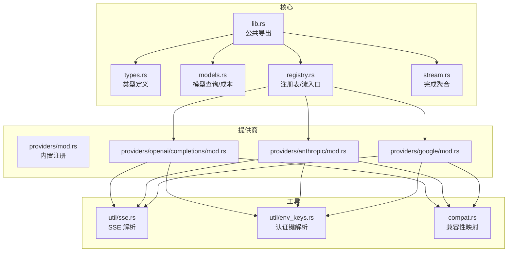
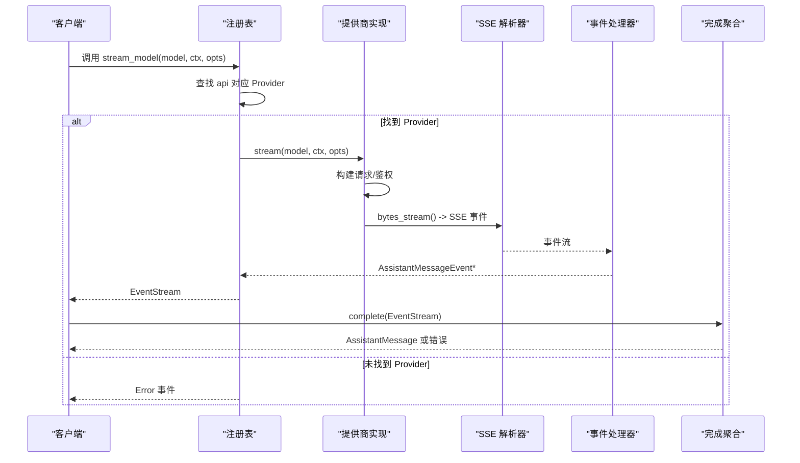
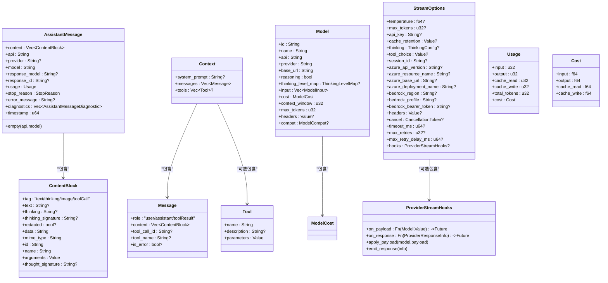
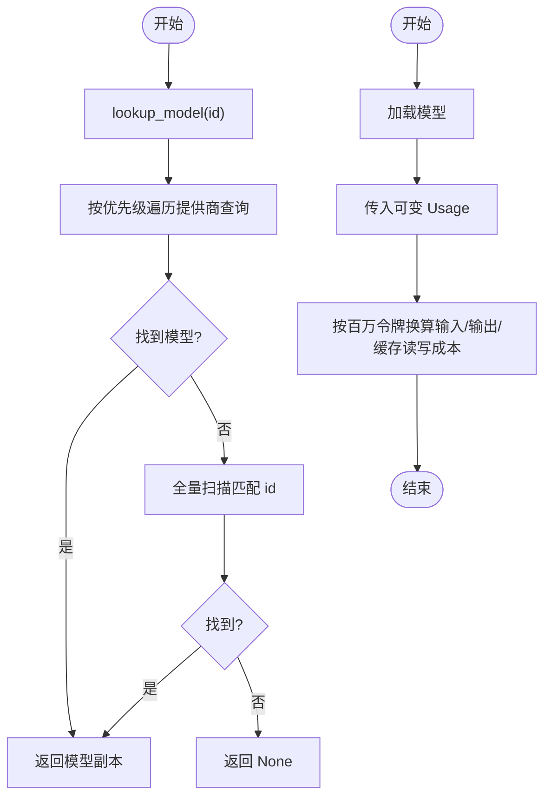
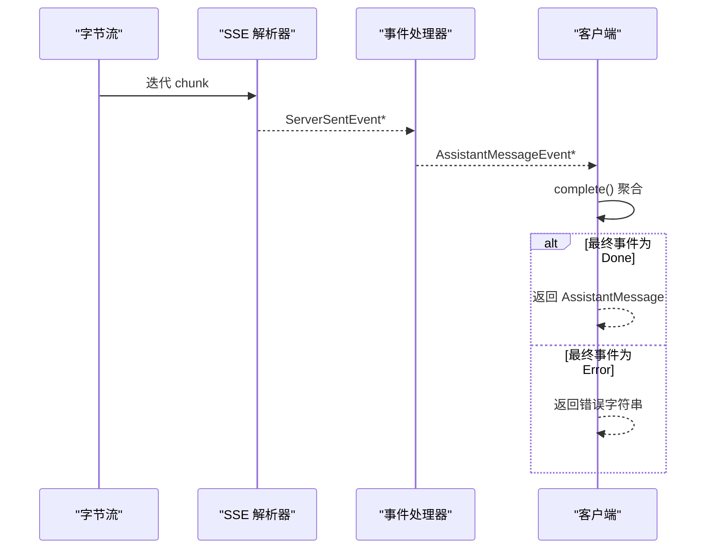
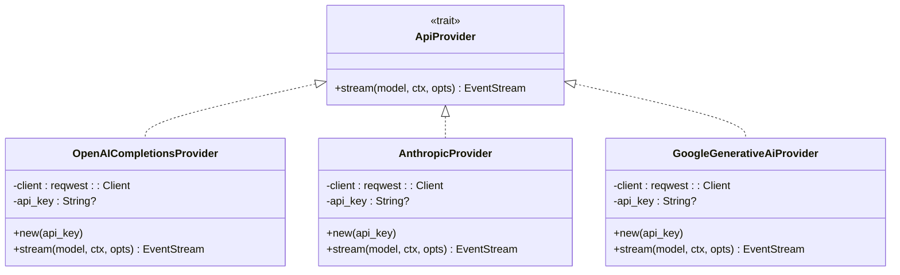
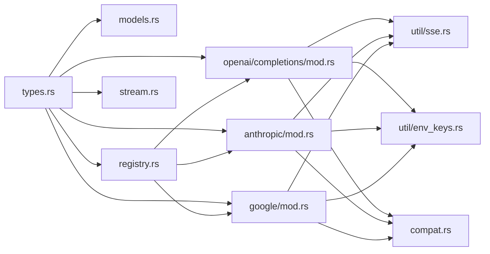

# AI 服务 API

<cite>
**本文引用的文件**
- [lib.rs](file://crates/pi-ai/src/lib.rs)
- [models.rs](file://crates/pi-ai/src/models.rs)
- [types.rs](file://crates/pi-ai/src/types.rs)
- [registry.rs](file://crates/pi-ai/src/registry.rs)
- [stream.rs](file://crates/pi-ai/src/stream.rs)
- [providers/mod.rs](file://crates/pi-ai/src/providers/mod.rs)
- [openai/completions/mod.rs](file://crates/pi-ai/src/providers/openai/completions/mod.rs)
- [anthropic/mod.rs](file://crates/pi-ai/src/providers/anthropic/mod.rs)
- [google/mod.rs](file://crates/pi-ai/src/providers/google/mod.rs)
- [util/sse.rs](file://crates/pi-ai/src/util/sse.rs)
- [util/env_keys.rs](file://crates/pi-ai/src/util/env_keys.rs)
- [compat.rs](file://crates/pi-ai/src/compat.rs)
- [models_generated.json](file://crates/pi-ai/src/models_generated.json)
- [faux_stream.rs](file://crates/pi-ai/examples/faux_stream.rs)
- [model_registry.rs](file://crates/pi-ai/tests/model_registry.rs)
- [openai_completions.rs](file://crates/pi-ai/tests/openai_completions.rs)
- [cost.rs](file://crates/pi-ai/tests/cost.rs)
</cite>

## 目录
1. [简介](#简介)
2. [项目结构](#项目结构)
3. [核心组件](#核心组件)
4. [架构总览](#架构总览)
5. [详细组件分析](#详细组件分析)
6. [依赖关系分析](#依赖关系分析)
7. [性能考虑](#性能考虑)
8. [故障排查指南](#故障排查指南)
9. [结论](#结论)
10. [附录](#附录)

## 简介
本文件为 AI 服务 API 的全面参考文档，覆盖以下主题：
- 核心类型：Model、Context、AssistantMessage、ContentBlock 等的定义与用法
- 模型注册表：模型查询、成本计算、提供商适配与注册
- 流式响应：SSE 支持、事件订阅机制与完成聚合
- 统一接口设计：各 AI 提供商（OpenAI、Anthropic、Google 等）的统一抽象与适配
- 认证管理：环境变量与外部凭据链支持
- 元数据与上下文：模型元数据、上下文构建与响应解析示例
- 错误处理与重试：策略与实现方式

## 项目结构
该模块位于 crates/pi-ai，采用按功能域划分的组织方式：
- 类型与公共导出：types.rs、lib.rs
- 模型注册与查询：models.rs、models_generated.json
- 注册表与流式接口：registry.rs、stream.rs
- 提供商适配层：providers/ 下按提供商拆分
- 工具模块：util/sse.rs、util/env_keys.rs、compat.rs
- 示例与测试：examples/faux_stream.rs、tests/*.rs

**图表来源**
- [lib.rs:1-19](file://crates/pi-ai/src/lib.rs#L1-L19)
- [models.rs:1-110](file://crates/pi-ai/src/models.rs#L1-L110)
- [types.rs:1-599](file://crates/pi-ai/src/types.rs#L1-L599)
- [registry.rs:1-163](file://crates/pi-ai/src/registry.rs#L1-L163)
- [stream.rs:1-90](file://crates/pi-ai/src/stream.rs#L1-L90)
- [providers/mod.rs:1-61](file://crates/pi-ai/src/providers/mod.rs#L1-L61)
- [openai/completions/mod.rs:1-157](file://crates/pi-ai/src/providers/openai/completions/mod.rs#L1-L157)
- [anthropic/mod.rs:1-122](file://crates/pi-ai/src/providers/anthropic/mod.rs#L1-L122)
- [google/mod.rs:1-153](file://crates/pi-ai/src/providers/google/mod.rs#L1-L153)
- [util/sse.rs:1-167](file://crates/pi-ai/src/util/sse.rs#L1-L167)
- [util/env_keys.rs:1-143](file://crates/pi-ai/src/util/env_keys.rs#L1-L143)
- [compat.rs:1-249](file://crates/pi-ai/src/compat.rs#L1-L249)

**章节来源**
- [lib.rs:1-19](file://crates/pi-ai/src/lib.rs#L1-L19)
- [providers/mod.rs:17-60](file://crates/pi-ai/src/providers/mod.rs#L17-L60)

## 核心组件
本节概述关键类型与职责。

- 类型系统
  - ContentBlock：文本、思考、图像、工具调用等多态内容块
  - Message：用户、助手、工具结果消息
  - AssistantMessage：响应聚合体，包含内容、用量、停止原因、诊断信息
  - Context：系统提示、消息列表、可选工具
  - Model/ModelCost/ModelInput：模型元数据、成本、输入类型
  - StreamOptions：温度、最大令牌、API Key、缓存保留、思维配置、工具选择、会话 ID、Azure/Bedrock 参数、自定义头、取消令牌、超时与重试参数、钩子
  - ProviderStreamHooks：请求载荷与响应事件钩子
  - ProviderResponseInfo：状态码与响应头
  - StopReason：停止原因枚举

- 公共导出
  - 通过 lib.rs 将模型查询、注册、流式事件与类型公开

**章节来源**
- [types.rs:9-301](file://crates/pi-ai/src/types.rs#L9-L301)
- [types.rs:303-407](file://crates/pi-ai/src/types.rs#L303-L407)
- [types.rs:418-599](file://crates/pi-ai/src/types.rs#L418-L599)
- [lib.rs:10-19](file://crates/pi-ai/src/lib.rs#L10-L19)

## 架构总览
统一的提供商抽象通过注册表解耦具体实现，流式响应以 SSE 事件驱动，最终由完成函数聚合为完整响应。

**图表来源**
- [registry.rs:31-55](file://crates/pi-ai/src/registry.rs#L31-L55)
- [stream.rs:7-18](file://crates/pi-ai/src/stream.rs#L7-L18)
- [util/sse.rs:56-89](file://crates/pi-ai/src/util/sse.rs#L56-L89)
- [openai/completions/mod.rs:35-156](file://crates/pi-ai/src/providers/openai/completions/mod.rs#L35-L156)
- [anthropic/mod.rs:35-121](file://crates/pi-ai/src/providers/anthropic/mod.rs#L35-L121)
- [google/mod.rs:35-152](file://crates/pi-ai/src/providers/google/mod.rs#L35-L152)

## 详细组件分析

### 类型与数据模型
- ContentBlock
  - 文本、思考、图像、工具调用四类，支持签名字段与可选属性
- Message
  - 用户/助手/工具结果三类，工具结果包含工具调用 ID、名称与错误标记
- AssistantMessage
  - 聚合内容、API 名称、提供商、模型名、响应模型/ID、用量、停止原因、错误信息、诊断、时间戳
  - 提供 empty 辅助构造
- Context/Tool/Model/ModelCost/ModelInput
  - 上下文构建、工具描述与参数、模型元数据（含推理能力、思维映射、输入类型、成本、上下文窗口、最大令牌、头部、兼容性）
- StreamOptions/ProviderStreamHooks/ProviderResponseInfo
  - 流式选项涵盖温度、最大令牌、API Key、缓存保留、思维配置、工具选择、会话 ID、Azure/Bedrock 参数、自定义头、取消令牌、超时与重试、钩子
  - 钩子支持在发送前修改载荷与接收响应后触发回调
- StopReason/Usage/Cost
  - 停止原因枚举；用量与成本结构，成本按百万令牌计费

**图表来源**
- [types.rs:9-301](file://crates/pi-ai/src/types.rs#L9-L301)
- [types.rs:303-407](file://crates/pi-ai/src/types.rs#L303-L407)
- [types.rs:418-599](file://crates/pi-ai/src/types.rs#L418-L599)

**章节来源**
- [types.rs:9-301](file://crates/pi-ai/src/types.rs#L9-L301)
- [types.rs:303-407](file://crates/pi-ai/src/types.rs#L303-L407)
- [types.rs:418-599](file://crates/pi-ai/src/types.rs#L418-L599)

### 模型注册表与查询
- 查询接口
  - lookup_model：优先确定性顺序再回退字典序查找
  - get_model/get_models/get_providers：按提供商过滤与列出
  - all_models：静态加载生成的模型注册表
- 成本计算
  - calculate_cost：基于模型费率与用量，按百万令牌换算
- 注册与路由
  - register/unregister/lookup：全局注册表维护
  - stream_model：根据 model.api 解析提供商，注入环境 API Key，委托流式处理

**图表来源**
- [models.rs:6-14](file://crates/pi-ai/src/models.rs#L6-L14)
- [models.rs:16-44](file://crates/pi-ai/src/models.rs#L16-L44)
- [models.rs:49-54](file://crates/pi-ai/src/models.rs#L49-L54)
- [registry.rs:31-55](file://crates/pi-ai/src/registry.rs#L31-L55)

**章节来源**
- [models.rs:6-14](file://crates/pi-ai/src/models.rs#L6-L14)
- [models.rs:16-44](file://crates/pi-ai/src/models.rs#L16-L44)
- [models.rs:49-54](file://crates/pi-ai/src/models.rs#L49-L54)
- [registry.rs:31-55](file://crates/pi-ai/src/registry.rs#L31-L55)

### 流式响应与 SSE 支持
- 事件模型
  - AssistantMessageEvent：start/text_* / thinking_* / toolcall_* / done/error
- SSE 解析
  - process_chunk/iterate_sse：将字节流切分为事件，支持事件类型与多行 data 合并
- 完成聚合
  - complete：消费事件流，遇到 Done 返回 AssistantMessage，Error 抛出错误

**图表来源**
- [util/sse.rs:11-89](file://crates/pi-ai/src/util/sse.rs#L11-L89)
- [stream.rs:7-18](file://crates/pi-ai/src/stream.rs#L7-L18)
- [types.rs:166-242](file://crates/pi-ai/src/types.rs#L166-L242)

**章节来源**
- [util/sse.rs:11-89](file://crates/pi-ai/src/util/sse.rs#L11-L89)
- [stream.rs:7-18](file://crates/pi-ai/src/stream.rs#L7-L18)
- [types.rs:166-242](file://crates/pi-ai/src/types.rs#L166-L242)

### 提供商适配与统一接口
- 接口抽象
  - ApiProvider：定义 stream(model, ctx, opts) -> EventStream
- 内置注册
  - register_builtins：一次性注册所有内置提供商 API 名称
- 典型实现
  - OpenAI Completions：构建请求、鉴权、SSE 处理、错误映射
  - Anthropic Messages：构建请求、鉴权、SSE 处理、错误映射
  - Google Generative AI：构建请求、鉴权、SSE 处理、错误映射

**图表来源**
- [registry.rs:9-11](file://crates/pi-ai/src/registry.rs#L9-L11)
- [providers/mod.rs:17-60](file://crates/pi-ai/src/providers/mod.rs#L17-L60)
- [openai/completions/mod.rs:17-33](file://crates/pi-ai/src/providers/openai/completions/mod.rs#L17-L33)
- [anthropic/mod.rs:17-33](file://crates/pi-ai/src/providers/anthropic/mod.rs#L17-L33)
- [google/mod.rs:17-33](file://crates/pi-ai/src/providers/google/mod.rs#L17-L33)

**章节来源**
- [registry.rs:9-11](file://crates/pi-ai/src/registry.rs#L9-L11)
- [providers/mod.rs:17-60](file://crates/pi-ai/src/providers/mod.rs#L17-L60)
- [openai/completions/mod.rs:35-156](file://crates/pi-ai/src/providers/openai/completions/mod.rs#L35-L156)
- [anthropic/mod.rs:35-121](file://crates/pi-ai/src/providers/anthropic/mod.rs#L35-L121)
- [google/mod.rs:35-152](file://crates/pi-ai/src/providers/google/mod.rs#L35-L152)

### 认证管理与环境变量
- env_api_key：按提供商映射多个可能的环境变量，若无直接 API Key 则检测外部凭据链（如 AWS Profile、Google Application Credentials），返回真实值或占位符
- 在注册表中自动注入：当 opts.api_key 缺失时，从环境变量补全

**章节来源**
- [util/env_keys.rs:34-46](file://crates/pi-ai/src/util/env_keys.rs#L34-L46)
- [registry.rs:48-52](file://crates/pi-ai/src/registry.rs#L48-L52)

### 兼容性与模型元数据
- ThinkingLevelMap：不同提供商对“思考”层级的映射
- ModelCompat：针对不同提供商的兼容特性集合（如 OpenAI Completions、OpenAI Responses、Anthropic Messages）
- models_generated.json：包含大量模型条目，涵盖提供商、API 名称、成本、上下文窗口、最大令牌、输入类型、兼容性等

**章节来源**
- [compat.rs:13-185](file://crates/pi-ai/src/compat.rs#L13-L185)
- [models_generated.json:1-200](file://crates/pi-ai/src/models_generated.json#L1-L200)

### 使用示例与最佳实践
- 示例程序：faux_stream 展示如何注册假提供商、构建 Context、消费事件流并打印各类增量事件
- 单元测试：验证模型序列化、成本计算、注册表完整性、OpenAI 请求映射与事件聚合

**章节来源**
- [faux_stream.rs:1-82](file://crates/pi-ai/examples/faux_stream.rs#L1-L82)
- [model_registry.rs:148-170](file://crates/pi-ai/tests/model_registry.rs#L148-L170)
- [openai_completions.rs:44-107](file://crates/pi-ai/tests/openai_completions.rs#L44-L107)
- [cost.rs:4-44](file://crates/pi-ai/tests/cost.rs#L4-L44)

## 依赖关系分析
- 模块内聚与耦合
  - types.rs 作为核心数据契约被 models.rs、registry.rs、stream.rs、providers/* 广泛依赖
  - registry.rs 仅依赖 types.rs 与 util/env_keys.rs，保持低耦合
  - providers/* 依赖 registry::ApiProvider、util/sse.rs、util/env_keys.rs、compat.rs
- 外部依赖
  - reqwest 用于 HTTP 请求与 SSE 字节流
  - async-stream/futures 用于异步流式处理
  - serde/serde_json 用于序列化与 JSON 修复工具

**图表来源**
- [types.rs:1-599](file://crates/pi-ai/src/types.rs#L1-L599)
- [models.rs:1-110](file://crates/pi-ai/src/models.rs#L1-L110)
- [registry.rs:1-163](file://crates/pi-ai/src/registry.rs#L1-L163)
- [stream.rs:1-90](file://crates/pi-ai/src/stream.rs#L1-L90)
- [openai/completions/mod.rs:1-157](file://crates/pi-ai/src/providers/openai/completions/mod.rs#L1-L157)
- [anthropic/mod.rs:1-122](file://crates/pi-ai/src/providers/anthropic/mod.rs#L1-L122)
- [google/mod.rs:1-153](file://crates/pi-ai/src/providers/google/mod.rs#L1-L153)
- [util/sse.rs:1-167](file://crates/pi-ai/src/util/sse.rs#L1-L167)
- [util/env_keys.rs:1-143](file://crates/pi-ai/src/util/env_keys.rs#L1-L143)
- [compat.rs:1-249](file://crates/pi-ai/src/compat.rs#L1-L249)

**章节来源**
- [lib.rs:1-19](file://crates/pi-ai/src/lib.rs#L1-L19)

## 性能考虑
- 流式处理
  - 使用 SSE 与异步流减少内存占用，按事件增量消费
- 超时与重试
  - StreamOptions 支持 timeoutMs、maxRetries、maxRetryDelayMs，避免长时间阻塞
- 成本计算
  - calculate_cost 为 O(1) 操作，按百万令牌比例换算，避免重复计算
- 注册表访问
  - all_models 通过静态延迟初始化加载，避免重复 IO

[本节为通用指导，不直接分析具体文件]

## 故障排查指南
- 未知提供商 API
  - 现象：立即产生 Error 事件
  - 处理：检查 model.api 是否正确，确保已通过 register_builtins 或手动 register
- 缺少 API Key
  - 现象：提供商实现返回 Error 事件
  - 处理：设置对应环境变量或在 StreamOptions 中显式传入
- HTTP 错误
  - 现象：状态码非成功，携带错误信息
  - 处理：检查网络、鉴权头、URL 与请求体映射
- SSE 解析异常
  - 现象：迭代过程中出现错误字符串
  - 处理：确认上游 SSE 输出格式与换行符一致性

**章节来源**
- [registry.rs:31-55](file://crates/pi-ai/src/registry.rs#L31-L55)
- [openai/completions/mod.rs:43-59](file://crates/pi-ai/src/providers/openai/completions/mod.rs#L43-L59)
- [anthropic/mod.rs:43-54](file://crates/pi-ai/src/providers/anthropic/mod.rs#L43-L54)
- [google/mod.rs:43-58](file://crates/pi-ai/src/providers/google/mod.rs#L43-L58)
- [util/sse.rs:56-89](file://crates/pi-ai/src/util/sse.rs#L56-L89)

## 结论
本 API 通过统一类型体系与注册表抽象，实现了对多家 AI 提供商的无缝集成；借助 SSE 事件流与完成聚合，提供了高效、可观测的流式交互体验；同时通过环境变量与兼容性映射，简化了部署与迁移成本。建议在生产环境中结合超时与重试策略，并充分利用 ProviderStreamHooks 进行可观测性增强。

[本节为总结性内容，不直接分析具体文件]

## 附录

### API 参考速查
- 模型查询
  - lookup_model(id) -> Option<Model>
  - get_model(provider, id) -> Option<Model>
  - get_models(provider) -> Vec<Model>
  - get_providers() -> Vec<String>
  - all_models() -> &'static [Model]
  - calculate_cost(&Model, &mut Usage)
- 注册与路由
  - register(api, provider)
  - unregister(api)
  - lookup(api) -> Option<Arc<dyn ApiProvider>>
  - stream_model(&Model, Context, Option<StreamOptions>) -> EventStream
- 流式完成
  - complete(EventStream) -> Result<AssistantMessage, String>
- 类型与选项
  - ContentBlock、Message、AssistantMessage、Context、Tool、Model、ModelCost、ModelInput、Usage、Cost、StopReason、StreamOptions、ProviderStreamHooks、ProviderResponseInfo、AssistantMessageEvent

**章节来源**
- [models.rs:6-54](file://crates/pi-ai/src/models.rs#L6-L54)
- [registry.rs:16-55](file://crates/pi-ai/src/registry.rs#L16-L55)
- [stream.rs:7-18](file://crates/pi-ai/src/stream.rs#L7-L18)
- [types.rs:9-301](file://crates/pi-ai/src/types.rs#L9-L301)
- [types.rs:303-407](file://crates/pi-ai/src/types.rs#L303-L407)
- [types.rs:166-242](file://crates/pi-ai/src/types.rs#L166-L242)