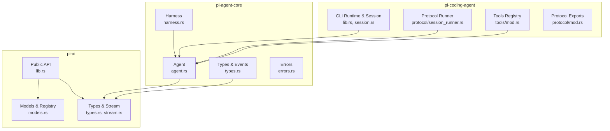
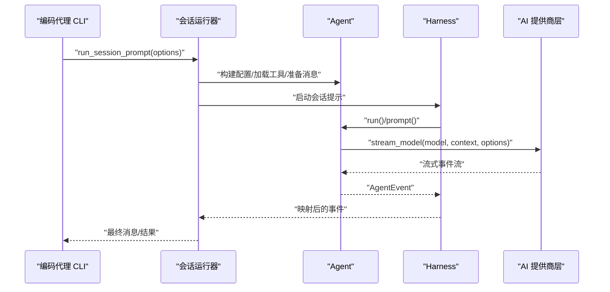
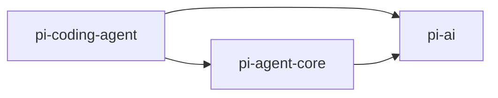

# API 参考

<cite>
**本文引用的文件**
- [lib.rs](file://crates/pi-agent-core/src/lib.rs)
- [agent.rs](file://crates/pi-agent-core/src/agent.rs)
- [types.rs](file://crates/pi-agent-core/src/types.rs)
- [errors.rs](file://crates/pi-agent-core/src/errors.rs)
- [harness.rs](file://crates/pi-agent-core/src/harness.rs)
- [lib.rs](file://crates/pi-ai/src/lib.rs)
- [types.rs](file://crates/pi-ai/src/types.rs)
- [models.rs](file://crates/pi-ai/src/models.rs)
- [stream.rs](file://crates/pi-ai/src/stream.rs)
- [lib.rs](file://crates/pi-coding-agent/src/lib.rs)
- [session.rs](file://crates/pi-coding-agent/src/session.rs)
- [mod.rs](file://crates/pi-coding-agent/src/protocol/mod.rs)
- [session_runner.rs](file://crates/pi-coding-agent/src/protocol/session_runner.rs)
- [mod.rs](file://crates/pi-coding-agent/src/tools/mod.rs)
- [Cargo.toml](file://Cargo.toml)
</cite>

## 目录
1. [简介](#简介)
2. [项目结构](#项目结构)
3. [核心组件](#核心组件)
4. [架构总览](#架构总览)
5. [详细组件分析](#详细组件分析)
6. [依赖关系分析](#依赖关系分析)
7. [性能考量](#性能考量)
8. [故障排查指南](#故障排查指南)
9. [结论](#结论)
10. [附录](#附录)

## 简介
本文件为 Pi-Rust 项目的 API 参考文档，覆盖 Agent API、工具 API、会话 API、AI 类型与流式接口等核心能力。文档以“公共导出 API”为主线，系统梳理方法签名、参数与返回值、数据结构、错误类型与版本信息，并提供使用示例、最佳实践、线程安全性与性能注意事项、常见问题与调试方法。

## 项目结构
Pi-Rust 采用多 crate 组织方式，核心模块如下：
- pi-agent-core：智能体内核、消息与事件、钩子与夹具、资源与压缩等
- pi-ai：模型、上下文、流式事件、成本计算与提供商注册
- pi-coding-agent：命令行入口、运行时、会话管理、协议与工具集合
- pi-mom / pi-pods / pi-web-ui：辅助桩 crate（当前暂缓）

图表来源
- [lib.rs:1-47](file://crates/pi-agent-core/src/lib.rs#L1-L47)
- [lib.rs:1-19](file://crates/pi-ai/src/lib.rs#L1-L19)
- [lib.rs:1-352](file://crates/pi-coding-agent/src/lib.rs#L1-L352)

章节来源
- [Cargo.toml:1-12](file://Cargo.toml#L1-L12)

## 核心组件
- Agent：面向用户的智能体对象，支持添加工具、注入消息、发起对话、运行循环、中止与快照
- Harness：在 Agent 外围提供钩子、观察者、事件映射与并发状态控制
- AI 类型与流：统一的消息、内容块、上下文、流式事件、模型与成本结构
- 编码代理 CLI：命令行运行时、会话管理、协议驱动的提示执行
- 工具集：内置文件与 Bash 工具，支持过滤与注册

章节来源
- [lib.rs:1-47](file://crates/pi-agent-core/src/lib.rs#L1-L47)
- [lib.rs:1-19](file://crates/pi-ai/src/lib.rs#L1-L19)
- [lib.rs:1-352](file://crates/pi-coding-agent/src/lib.rs#L1-L352)

## 架构总览
下图展示从 CLI 到 Agent 的调用链路，以及与 AI 提供商层的交互。

图表来源
- [session_runner.rs:95-128](file://crates/pi-coding-agent/src/protocol/session_runner.rs#L95-L128)
- [harness.rs:520-677](file://crates/pi-agent-core/src/harness.rs#L520-L677)
- [types.rs:362-407](file://crates/pi-ai/src/types.rs#L362-L407)

## 详细组件分析

### Agent API
- 角色定位：对外暴露的智能体对象，封装消息队列、工具、钩子与运行循环
- 主要方法与行为
  - 构造与配置
    - new(config)：创建智能体
    - with_messages(config, messages)：基于已有消息创建
    - replace_messages(messages)：替换当前消息
    - set_resources(resources)：设置资源（技能/模板）
    - set_provider_request_override(context, options?)：覆盖请求上下文与流选项
    - provider_request_snapshot()：生成当前上下文快照
  - 工具与消息
    - add_tool(tool)：注册工具
    - add_message(msg)/messages()：增删改查消息
    - skill(name, additional_instructions?)：按技能名生成提示并运行
    - prompt_from_template(name, args)：按模板名生成提示并运行
    - prompt(text)：追加用户文本并开始一轮对话
    - run()：在已有消息基础上继续运行（校验消息合法性）
  - 队列与中止
    - steer(text)/follow_up(text)：注入引导/后续消息
    - clear_queues()/drain_steering_queue()/drain_follow_up_queue()：清空/取出队列
    - abort()：取消进行中的循环
  - 并发与生命周期
    - 运行中互斥：同一时间仅允许一次运行，重复调用会触发异常
    - 取消令牌：通过 CancellationToken 支持异步中止

- 数据结构要点
  - AgentMessage：用户文本、助手回复、工具结果、系统提示、压缩摘要、Bash 执行、自定义消息、分支摘要
  - AgentTool：名称、描述、参数、执行函数、执行模式
  - AgentEvent：回合开始、请求前、LLM 事件、工具调用、完成/错误、会话压缩等
  - AgentConfig：模型、系统提示、最大轮次、流选项、思考级别、工具执行模式、队列模式、钩子、资源、压缩配置
  - AgentStream：事件流别名

- 错误与诊断
  - run() 对消息合法性进行前置校验，非法状态返回错误
  - abort() 安全地取消运行，适用于并发场景

- 使用示例与最佳实践
  - 示例路径
    - [Agent::prompt:213-215](file://crates/pi-agent-core/src/agent.rs#L213-L215)
    - [Agent::run:223-243](file://crates/pi-agent-core/src/agent.rs#L223-L243)
    - [Agent::skill:146-164](file://crates/pi-agent-core/src/agent.rs#L146-L164)
    - [Agent::prompt_from_template:166-175](file://crates/pi-agent-core/src/agent.rs#L166-L175)
  - 最佳实践
    - 使用 with_messages 初始化上下文，避免遗漏系统提示
    - 合理设置 ThinkingLevel 与 ToolExecutionMode，平衡推理与吞吐
    - 使用 steer/follow_up 实现可控的多轮引导，避免阻塞主流程

- 线程安全与并发
  - Agent 内部使用 Arc<Mutex/_RwLock_> 保护状态，Clone 后可在多任务共享
  - 运行期间禁止并发调用 prompt/run，防止竞态

- 性能与复杂度
  - 消息与工具列表的增删改查为 O(1)/O(n)，注意避免频繁大体量消息累积
  - 工具执行模式影响并发度，合理选择串行/并行

章节来源
- [agent.rs:1-282](file://crates/pi-agent-core/src/agent.rs#L1-L282)
- [types.rs:300-495](file://crates/pi-agent-core/src/types.rs#L300-L495)

### Harness API
- 角色定位：在 Agent 外围提供钩子、观察者、事件映射与生命周期管理
- 主要功能
  - 生命周期与并发
    - phase()：查询当前阶段（Idle/Turn/保留）
    - abort()：中止当前回合并清理队列，返回被清除的消息
  - 钩子与观察者
    - subscribe(observer)：订阅所有事件
    - on::<Kind>(handler)：注册特定通道的处理器（支持多个）
    - hooks 注入：before_agent_start/context/before_provider_request/payload/response/get_api_key_and_headers
  - 事件映射
    - 将 AgentEvent 映射为 AgentHarnessEvent，补充上下文、请求前、工具调用/结果、会话压缩等

- 数据结构要点
  - AgentHarnessHooks：各类钩子函数
  - BeforeProviderRequest/Payload/ProviderResponse：请求前后上下文
  - StreamOptionsPatch/HeaderPatch：对流选项与头部进行增量修改
  - ProviderAuth：API Key 与头部注入
  - AgentHarnessEvent：事件通道

- 使用示例与最佳实践
  - 示例路径
    - [AgentHarness::prompt:520-677](file://crates/pi-agent-core/src/harness.rs#L520-L677)
    - [AgentHarness::on/on subscribe:463-482](file://crates/pi-agent-core/src/harness.rs#L463-L482)
    - [AgentHarness::abort:508-518](file://crates/pi-agent-core/src/harness.rs#L508-L518)
  - 最佳实践
    - 使用 on 注册轻量钩子，避免阻塞事件流
    - 在 before_provider_request 中进行上下文裁剪与流选项微调

- 线程安全与并发
  - 内部使用 Mutex/Arc 保护观察者与钩子注册表
  - 并发调用 prompt 会被拒绝（Busy 错误）

- 性能与复杂度
  - 钩子链路顺序执行，建议减少不必要的 patch

章节来源
- [harness.rs:1-800](file://crates/pi-agent-core/src/harness.rs#L1-L800)

### AI 类型与流式接口
- 模型与上下文
  - Model：标识、名称、提供商、基础地址、输入类型、成本、上下文窗口、最大 token 等
  - Context：系统提示与消息列表，可选工具
  - StreamOptions：温度、最大 token、API Key、缓存策略、思考配置、工具选择、会话 ID、Azure/Bedrock 参数、超时与重试、钩子等
  - ThinkingConfig：启用开关与预算 token/effort

- 消息与内容块
  - Message：用户/助手/工具结果
  - ContentBlock：文本、思考、图像、工具调用
  - AssistantMessage：内容块列表、API/提供商、模型、用量、停止原因、错误信息、诊断、时间戳
  - AssistantMessageEvent：start/text/thinking/toolcall 的 delta/end，done/error

- 成本与用量
  - Usage/Cost：输入/输出/缓存读写/总计与费用
  - calculate_cost：按模型费率计算用量费用

- 流式接口
  - EventStream：事件流别名
  - complete(stream)：等待 Done 或 Error，返回最终消息或错误

- 使用示例与最佳实践
  - 示例路径
    - [Model/Context/StreamOptions 定义:264-407](file://crates/pi-ai/src/types.rs#L264-L407)
    - [AssistantMessageEvent 定义:166-242](file://crates/pi-ai/src/types.rs#L166-L242)
    - [complete:7-18](file://crates/pi-ai/src/stream.rs#L7-L18)

- 线程安全与并发
  - 类型均为不可变数据结构，配合流式异步安全

- 性能与复杂度
  - 事件序列解析为 O(n)，注意避免过长的中间态 partial

章节来源
- [types.rs:1-599](file://crates/pi-ai/src/types.rs#L1-L599)
- [stream.rs:1-90](file://crates/pi-ai/src/stream.rs#L1-L90)

### 模型注册与查找
- 能力概览
  - lookup_model/get_model/get_models/get_providers：按优先级与名称检索模型
  - all_models：静态模型注册表（JSON 生成）
  - calculate_cost：用量转费用

- 使用示例与最佳实践
  - 示例路径
    - [模型注册与查询:6-54](file://crates/pi-ai/src/models.rs#L6-L54)

章节来源
- [models.rs:1-110](file://crates/pi-ai/src/models.rs#L1-L110)

### 编码代理 CLI 与会话 API
- CLI 运行时
  - run_cli/run_cli_with_options/run_cli_with_options_and_stdin：解析参数、加载配置、选择模型、认证、资源装载、会话解析、执行提示
  - print_mode/json/rpc 模式切换与错误处理

- 会话管理
  - open_active_session：新建/打开/继续/派生会话，构建会话上下文
  - ActiveSession：存储句柄与基线消息数
  - 会话目录解析：优先 CLI/运行时/环境变量，否则默认到用户家目录
  - 编码与路径安全：对路径字符进行安全转换

- 协议运行器
  - run_session_prompt/spawn_session_prompt：准备 Agent、启动流、事件分发、捕获消息与压缩摘要、写入会话
  - SessionPromptResult：最终消息、消息列表、会话路径、叶子 ID

- 工具注册
  - builtin_tools：内置文件与 Bash 工具集合
  - filter_tools：按白名单/黑名单/禁用开关过滤工具

- 使用示例与最佳实践
  - 示例路径
    - [run_cli 主流程:83-334](file://crates/pi-coding-agent/src/lib.rs#L83-L334)
    - [open_active_session:89-138](file://crates/pi-coding-agent/src/session.rs#L89-L138)
    - [run_session_prompt:95-101](file://crates/pi-coding-agent/src/protocol/session_runner.rs#L95-L101)

- 线程安全与并发
  - spawn_session_prompt 返回异步通道与取消句柄，适合并发场景

- 性能与复杂度
  - 会话 IO 与消息捕获为 O(n)，注意批量化写入

章节来源
- [lib.rs:1-352](file://crates/pi-coding-agent/src/lib.rs#L1-L352)
- [session.rs:1-204](file://crates/pi-coding-agent/src/session.rs#L1-L204)
- [session_runner.rs:1-436](file://crates/pi-coding-agent/src/protocol/session_runner.rs#L1-L436)
- [mod.rs:1-51](file://crates/pi-coding-agent/src/tools/mod.rs#L1-L51)

### 错误类型与诊断
- 文件错误 FileError：未找到/已存在/权限/路径无效/目录/IO/未知
- 执行错误 ExecutionError：中止/超时/Shell 不可用/进程启动失败/回调错误/未知
- 夹具错误 AgentHarnessError：忙碌/无效状态/参数/会话/钩子/认证/压缩/分支摘要/未知
- 分支摘要错误 BranchSummaryError：中止/总结失败/会话无效
- 错误码映射：提供 as_str() 便于序列化与日志

- 使用示例与最佳实践
  - 示例路径
    - [FileError/ExecutionError/AgentHarnessError/BranchSummaryError:1-231](file://crates/pi-agent-core/src/errors.rs#L1-L231)

章节来源
- [errors.rs:1-231](file://crates/pi-agent-core/src/errors.rs#L1-L231)

## 依赖关系分析
- 模块耦合
  - pi-coding-agent 依赖 pi-agent-core（Agent/Harness）、pi-ai（模型/流式）
  - pi-agent-core 依赖 pi-ai 的类型与流式接口
  - pi-ai 提供模型注册与流式事件，作为通用基础设施

图表来源
- [lib.rs:1-352](file://crates/pi-coding-agent/src/lib.rs#L1-L352)
- [lib.rs:1-47](file://crates/pi-agent-core/src/lib.rs#L1-L47)
- [lib.rs:1-19](file://crates/pi-ai/src/lib.rs#L1-L19)

章节来源
- [Cargo.toml:1-12](file://Cargo.toml#L1-L12)

## 性能考量
- Agent 循环与消息长度
  - 长上下文会增加 token 消耗与压缩压力，建议结合会话压缩配置
- 工具执行模式
  - 并行执行提升吞吐，但可能增加资源竞争；串行更稳定
- 流式事件处理
  - 使用 complete 或逐事件消费，避免长时间持有 partial 状态
- 会话 IO
  - 批量写入与去重插入，减少磁盘压力

## 故障排查指南
- 常见错误与定位
  - AgentHarnessError::Busy：并发调用 prompt，检查 phase 与生命周期
  - AgentHarnessError::InvalidState：run() 前置条件不满足（无消息/最后一条是助手消息）
  - FileError/ExecutionError：文件系统/外部命令异常，检查权限与路径
  - AgentFailure/SessionFailure：Agent 运行或会话写入失败，查看事件流中的错误事件
- 调试建议
  - 使用 subscribe 订阅事件流，打印关键事件（BeforeProviderRequest、ToolCallStart/End、AgentError）
  - 在 before_provider_request 中输出上下文摘要，验证裁剪与补丁
  - 使用 abort 清理队列并中止运行，避免悬挂状态

章节来源
- [harness.rs:520-677](file://crates/pi-agent-core/src/harness.rs#L520-L677)
- [errors.rs:1-231](file://crates/pi-agent-core/src/errors.rs#L1-L231)
- [session_runner.rs:279-315](file://crates/pi-coding-agent/src/protocol/session_runner.rs#L279-L315)

## 结论
Pi-Rust 提供了清晰的 Agent/Harness/会话/工具与 AI 类型体系，具备良好的扩展性与可观测性。遵循本文的 API 使用规范、错误处理与性能建议，可构建稳定高效的智能体应用。

## 附录

### API 版本与兼容性
- 版本信息
  - 项目版本：参见 [Cargo.toml:6-8](file://Cargo.toml#L6-L8)
- 兼容约束
  - 会话 JSONL 与上游互通（跨 crate 一致性）
  - 类型与事件序列保持 serde 一致性，由各提供商测试保障

章节来源
- [Cargo.toml:1-12](file://Cargo.toml#L1-L12)

### 废弃警告与迁移指南
- 当前未发现公开 API 标记为废弃
- 迁移建议
  - 从 TS 侧迁移时，优先使用 pi-ai 的 serde 兼容结构
  - 会话迁移：确保 JSONL 字段与时间戳格式一致

### 常见模式与反模式
- 推荐模式
  - 使用 with_messages 初始化上下文，再调用 run()
  - 在 before_provider_request 中进行上下文裁剪与流选项微调
  - 使用 spawn_session_prompt 进行并发会话
- 反模式
  - 并发调用 prompt/run
  - 忽略事件流中的错误事件导致静默失败
  - 大量小块消息频繁写入会话