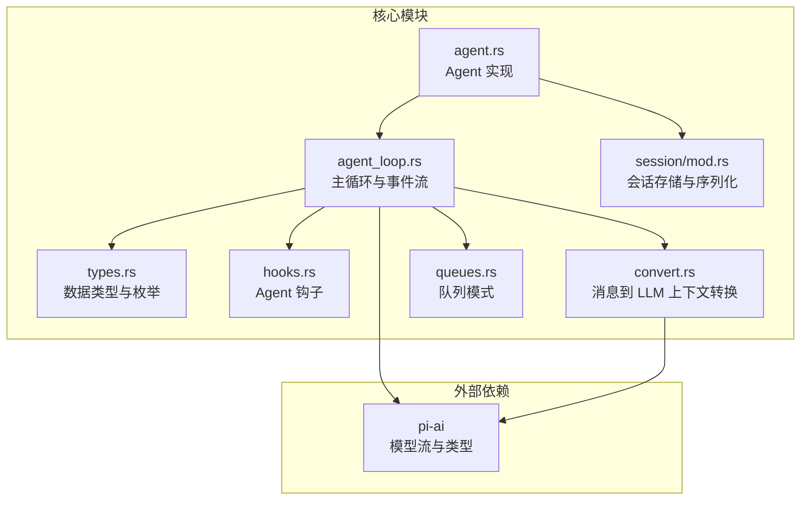
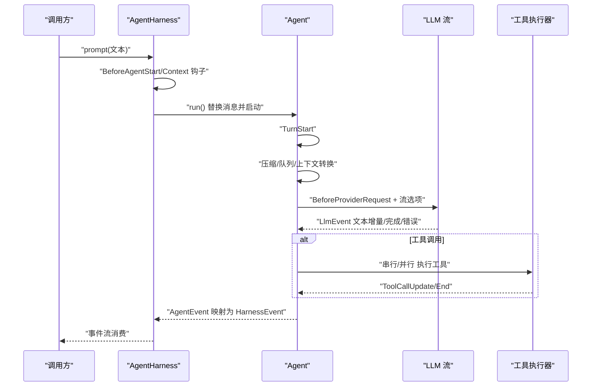
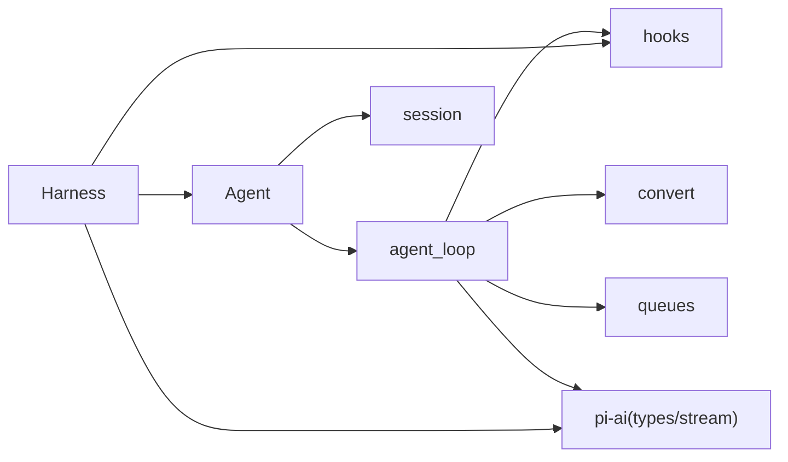

# Agent 核心 API

<cite>
**本文引用的文件列表**
- [lib.rs](file://crates/pi-agent-core/src/lib.rs)
- [agent.rs](file://crates/pi-agent-core/src/agent.rs)
- [types.rs](file://crates/pi-agent-core/src/types.rs)
- [agent_loop.rs](file://crates/pi-agent-core/src/agent_loop.rs)
- [queues.rs](file://crates/pi-agent-core/src/queues.rs)
- [hooks.rs](file://crates/pi-agent-core/src/hooks.rs)
- [harness.rs](file://crates/pi-agent-core/src/harness.rs)
- [convert.rs](file://crates/pi-agent-core/src/convert.rs)
- [session/mod.rs](file://crates/pi-agent-core/src/session/mod.rs)
- [loop_example.rs](file://crates/pi-agent-core/examples/loop_example.rs)
- [Cargo.toml](file://crates/pi-agent-core/Cargo.toml)
</cite>

## 目录
1. [简介](#简介)
2. [项目结构](#项目结构)
3. [核心组件](#核心组件)
4. [架构总览](#架构总览)
5. [详细组件分析](#详细组件分析)
6. [依赖关系分析](#依赖关系分析)
7. [性能考量](#性能考量)
8. [故障排查指南](#故障排查指南)
9. [结论](#结论)
10. [附录：完整 API 使用示例与最佳实践](#附录完整-api-使用示例与最佳实践)

## 简介
本文件为 Agent 核心 API 的权威参考文档，覆盖 AgentConfig、AgentTool、AgentMessage、AgentEvent 等核心数据结构的完整定义与使用方法；详述 Agent 的创建、配置与运行接口（含工具注册、事件流处理与会话管理）；提供 AgentTool trait 的实现指南与工具函数使用示例；阐述 AgentEvent 事件流的处理模式与回调机制；包含思考级别、工具执行模式与队列模式的配置选项；并给出构建自定义代理与处理复杂交互场景的完整示例路径。

## 项目结构
pi-agent-core 提供了 Agent 的核心运行时、事件模型、钩子系统、资源与会话持久化等能力，并通过 harness 暴露面向上层应用的统一生命周期与事件桥接。

图表来源
- [agent.rs:1-282](file://crates/pi-agent-core/src/agent.rs#L1-L282)
- [agent_loop.rs:1-860](file://crates/pi-agent-core/src/agent_loop.rs#L1-L860)
- [types.rs:1-657](file://crates/pi-agent-core/src/types.rs#L1-L657)
- [hooks.rs:1-162](file://crates/pi-agent-core/src/hooks.rs#L1-L162)
- [convert.rs:1-315](file://crates/pi-agent-core/src/convert.rs#L1-L315)
- [queues.rs:1-10](file://crates/pi-agent-core/src/queues.rs#L1-L10)
- [session/mod.rs:1-126](file://crates/pi-agent-core/src/session/mod.rs#L1-L126)

章节来源
- [Cargo.toml:1-23](file://crates/pi-agent-core/Cargo.toml#L1-L23)

## 核心组件
- Agent：对外暴露的代理实例，负责消息管理、工具注册、提示词注入、运行控制与事件流输出。
- AgentConfig：代理配置对象，包含模型、系统提示、最大轮次、流选项、思考级别、工具执行模式、队列模式、钩子、资源与压缩设置。
- AgentTool：工具抽象，包含名称、描述、参数 Schema、执行函数与可选的工具级执行模式。
- AgentMessage：代理上下文中支持的消息类型集合，涵盖用户文本、助手回复、工具结果、系统提示、压缩摘要、Bash 执行、自定义消息与分支摘要。
- AgentEvent：代理事件流的统一事件类型，用于驱动 UI 或业务逻辑。
- AgentHarness：在 Agent 基础上提供生命周期钩子、观察者订阅、请求前处理与事件映射，便于集成到更高层框架。
- Hooks：Agent 与 Harness 的钩子体系，覆盖请求前、工具调用前后、回合结束判断、下一回合准备、上下文转换与 LLM 输入转换等。
- Session：会话存储与序列化，支持 JSONL 内存存储与元数据管理。

章节来源
- [lib.rs:1-47](file://crates/pi-agent-core/src/lib.rs#L1-L47)
- [agent.rs:1-282](file://crates/pi-agent-core/src/agent.rs#L1-L282)
- [types.rs:1-657](file://crates/pi-agent-core/src/types.rs#L1-L657)
- [hooks.rs:1-162](file://crates/pi-agent-core/src/hooks.rs#L1-L162)
- [harness.rs:1-986](file://crates/pi-agent-core/src/harness.rs#L1-L986)
- [session/mod.rs:1-126](file://crates/pi-agent-core/src/session/mod.rs#L1-L126)

## 架构总览
Agent 的运行由 agent_loop 驱动，按回合推进：注入引导消息（如系统提示、技能）、上下文转换、思考级别注入、调用 LLM、解析工具调用、串并行执行工具、应用工具后钩子、更新消息历史、决定是否继续或终止。Harness 在 Agent 外围提供钩子与事件桥接，便于接入认证、请求补丁、响应处理与观察者。

图表来源
- [harness.rs:520-677](file://crates/pi-agent-core/src/harness.rs#L520-L677)
- [agent.rs:213-243](file://crates/pi-agent-core/src/agent.rs#L213-L243)
- [agent_loop.rs:153-860](file://crates/pi-agent-core/src/agent_loop.rs#L153-L860)

## 详细组件分析

### AgentConfig：配置与行为开关
- 关键字段
  - model：模型标识与能力
  - system_prompt：系统提示
  - max_turns：最大轮次上限
  - stream_options：流式选项（含取消令牌、温度、最大 token、思维配置等）
  - thinking_level：思考级别（off/minimal/low/medium/high/xhigh）
  - tool_execution：工具执行模式（sequential/parallel）
  - steering_mode/follow_up_mode：队列模式（all/one-at-a-time）
  - hooks：Agent 钩子集合
  - resources：技能与模板资源
  - compaction：会话压缩配置
- 默认值
  - thinking_level: off
  - tool_execution: parallel
  - steering_mode: one-at-a-time
  - follow_up_mode: one-at-a-time
  - hooks: empty
  - resources: empty
  - compaction: None

章节来源
- [types.rs:407-443](file://crates/pi-agent-core/src/types.rs#L407-L443)

### AgentTool：工具定义与执行
- 结构
  - name/description/parameters：工具元信息与参数 Schema
  - execute：异步执行函数，返回 AgentToolOutput
  - execution_mode：可选的工具级执行模式（覆盖全局）
- 快捷构造
  - new_text：快速构造返回纯文本内容的工具
- 工具更新回调
  - ToolUpdateCallback：工具执行过程中可推送增量更新

章节来源
- [types.rs:355-405](file://crates/pi-agent-core/src/types.rs#L355-L405)

### AgentMessage：消息类型与语义
- 支持的消息变体
  - UserText、Assistant、ToolResult、SystemPrompt、CompactionSummary、BashExecution、Custom、BranchSummary
- 用途
  - 组成对话历史，参与上下文转换与 LLM 请求
  - 记录工具执行结果与系统提示

章节来源
- [types.rs:300-353](file://crates/pi-agent-core/src/types.rs#L300-L353)

### AgentEvent：事件流与状态
- 事件类型
  - TurnStart、BeforeProviderRequest、LlmEvent、ToolCallStart/Update/End、AgentDone、AgentError、SessionCompacted
- 作用
  - 驱动 UI 更新、日志记录、工具执行反馈与会话压缩通知

章节来源
- [types.rs:454-491](file://crates/pi-agent-core/src/types.rs#L454-L491)

### Agent：创建、运行与控制
- 创建与初始化
  - new(config)：创建空消息、空工具的代理实例
  - with_messages(config, messages)：带初始消息的代理
- 注册与管理
  - add_tool(tool)、add_message(msg)、replace_messages(msgs)
  - messages() 获取当前消息快照
- 运行接口
  - prompt(text)：注入用户文本并开始完整工具调用循环
  - run()：基于已有消息继续运行（需校验消息合法性）
  - skill(name, additional_instructions?)：从资源加载技能并以提示词形式触发
  - prompt_from_template(name, args)：从模板渲染提示词并触发
- 队列与引导
  - steer(text)/follow_up(text)：注入引导消息
  - clear_queues()/drain_steering_queue()/drain_follow_up_queue()
- 请求快照与覆盖
  - provider_request_snapshot()：生成当前上下文与流选项
  - set_provider_request_override(context, options?)：覆盖一次请求
- 中断
  - abort()：安全地取消进行中的循环

章节来源
- [agent.rs:53-282](file://crates/pi-agent-core/src/agent.rs#L53-L282)

### AgentHarness：生命周期与事件桥接
- 生命周期
  - BeforeAgentStart、Context、BeforeProviderRequest、BeforeProviderPayload、AfterProviderResponse、ToolCall、ToolResult、SessionCompact、Settled、Error 等
- 钩子与观察者
  - before_agent_start/context/before_provider_request/before_provider_payload/after_provider_response/get_api_key_and_headers
  - subscribe(observer) 与 on(kind) 注册多路处理器
- 控制
  - steer()/follow_up()/abort() 与 Agent 对齐
  - prompt(text) 返回 Harness 事件流，内部将 AgentEvent 映射为 HarnessEvent

章节来源
- [harness.rs:1-986](file://crates/pi-agent-core/src/harness.rs#L1-L986)

### 钩子系统：扩展点与回调
- Agent 钩子
  - before_provider_request、before_tool_call、after_tool_call、should_stop_after_turn、prepare_next_turn、transform_context、convert_to_llm
- Harness 钩子
  - before_agent_start、context、before_provider_request、before_provider_payload、after_provider_response、get_api_key_and_headers
- 回调签名
  - 均为异步函数，返回 Result 或 Option 包裹的结果

章节来源
- [hooks.rs:1-162](file://crates/pi-agent-core/src/hooks.rs#L1-L162)

### 上下文转换与思考级别
- default_convert_to_llm：将 AgentMessage 转换为 LLM Message 列表
- assemble_context：拼装最终 Context（系统提示、消息、工具列表）
- convert_to_context：便捷入口
- 思考级别注入：根据模型能力与配置向 StreamOptions 注入 ThinkingConfig

章节来源
- [convert.rs:1-315](file://crates/pi-agent-core/src/convert.rs#L1-L315)
- [agent_loop.rs:282-306](file://crates/pi-agent-core/src/agent_loop.rs#L282-L306)

### 队列模式与工具执行策略
- QueueMode：all/one-at-a-time
- drain_queue：按模式弹出消息
- 工具执行模式
  - 全局：ToolExecutionMode::Sequential/Parallel
  - 工具级：AgentTool.execution_mode 可覆盖
  - 串行：逐个等待工具完成，期间可推送 ToolCallUpdate
  - 并行：并发执行，收集结果后按原始顺序回写消息

章节来源
- [types.rs:85-114](file://crates/pi-agent-core/src/types.rs#L85-L114)
- [types.rs:54-83](file://crates/pi-agent-core/src/types.rs#L54-L83)
- [queues.rs:1-10](file://crates/pi-agent-core/src/queues.rs#L1-L10)
- [agent_loop.rs:469-479](file://crates/pi-agent-core/src/agent_loop.rs#L469-L479)
- [agent_loop.rs:675-830](file://crates/pi-agent-core/src/agent_loop.rs#L675-L830)

### 会话管理与持久化
- 存储适配
  - JsonlSessionStorage、InMemorySessionStorage
  - JsonlSessionRepo：仓库接口
- 序列化
  - agent_message_to_stored：将 AgentMessage 映射为存储条目
- 元数据
  - SessionHeader、SessionMetadata、JsonlSessionMetadata、StoredAgentMessage、StoredUsage/成本

章节来源
- [session/mod.rs:1-126](file://crates/pi-agent-core/src/session/mod.rs#L1-L126)

## 依赖关系分析

图表来源
- [agent.rs:1-12](file://crates/pi-agent-core/src/agent.rs#L1-L12)
- [agent_loop.rs:1-24](file://crates/pi-agent-core/src/agent_loop.rs#L1-L24)
- [harness.rs:1-13](file://crates/pi-agent-core/src/harness.rs#L1-L13)

章节来源
- [Cargo.toml:6-18](file://crates/pi-agent-core/Cargo.toml#L6-L18)

## 性能考量
- 工具执行模式
  - 并行执行可显著缩短端到端时间，但需注意资源竞争与并发限制
  - 串行执行更易调试与控制副作用
- 队列模式
  - one-at-a-time 更可控，all 可批量注入
- 思考级别
  - 启用思考级别会增加 token 预算，影响上下文长度与成本
- 会话压缩
  - 合理的压缩阈值与保留策略可降低 token 使用，避免过早丢失上下文
- 取消与中断
  - 使用 CancellationToken 安全中止长耗时操作，避免资源泄漏

## 故障排查指南
- AgentError 事件
  - LLM 错误、流未结束、超过最大轮次、被取消等
- 常见问题定位
  - 检查 AgentConfig 的 thinking_level 与 tool_execution 是否与模型能力匹配
  - 确认钩子返回值是否正确应用（如 before_provider_request 的 Patch）
  - 工具参数 Schema 与实际传参一致性
  - 并发工具执行时的资源竞争与幂等性设计
- 观察者与钩子
  - 使用 Harness.subscribe 或 on(...) 订阅事件，便于诊断

章节来源
- [agent_loop.rs:162-179](file://crates/pi-agent-core/src/agent_loop.rs#L162-L179)
- [agent_loop.rs:358-378](file://crates/pi-agent-core/src/agent_loop.rs#L358-L378)
- [harness.rs:520-677](file://crates/pi-agent-core/src/harness.rs#L520-L677)

## 结论
pi-agent-core 提供了清晰的代理生命周期、灵活的钩子扩展、完善的事件流与会话管理能力。通过合理配置思考级别、工具执行模式与队列模式，结合 Harness 的钩子与观察者机制，可在保证可维护性的前提下实现复杂的交互场景与生产级集成。

## 附录：完整 API 使用示例与最佳实践

### 示例一：基础 Agent 循环与事件消费
- 示例程序展示了如何创建 Agent、注册工具、发起提示词并消费 AgentEvent。
- 关键步骤
  - 注册模型与 Provider
  - 构造 AgentConfig（可设置 system_prompt、max_turns）
  - 创建 Agent 并添加工具
  - 调用 prompt(text) 获取 AgentStream 并遍历事件
  - 打印文本增量、工具调用、结果与最终停止原因

章节来源
- [loop_example.rs:1-123](file://crates/pi-agent-core/examples/loop_example.rs#L1-L123)

### 示例二：使用 AgentHarness 与钩子
- 使用 Harness 的钩子链路（BeforeAgentStart、Context、BeforeProviderRequest、BeforeProviderPayload、AfterProviderResponse、GetApiKeyAndHeaders）与 on(...) 注册多个处理器
- 通过 subscribe 订阅所有事件，或使用 on(kind) 订阅特定通道
- 在工具执行期间利用 ToolCallStart/Update/End 事件进行进度反馈

章节来源
- [harness.rs:417-677](file://crates/pi-agent-core/src/harness.rs#L417-L677)

### 示例三：工具实现指南
- 使用 AgentTool::new_text 快速实现返回纯文本的工具
- 在 execute 中处理参数、执行任务、可选地通过 ToolUpdateCallback 推送增量更新
- 使用 AgentToolResult::ok/error 构造结果，支持 details 字段携带结构化信息

章节来源
- [types.rs:376-405](file://crates/pi-agent-core/src/types.rs#L376-L405)
- [agent_loop.rs:563-620](file://crates/pi-agent-core/src/agent_loop.rs#L563-L620)

### 示例四：上下文转换与系统提示
- 使用 convert_to_context 将 AgentMessage 列表转换为 LLM 上下文
- 使用 assemble_context 自定义系统提示与工具列表
- 使用 default_convert_to_llm 作为默认转换器，或通过 convert_to_llm 钩子替换

章节来源
- [convert.rs:95-155](file://crates/pi-agent-core/src/convert.rs#L95-L155)

### 示例五：队列与引导消息
- 使用 steer(text)/follow_up(text) 注入引导消息
- 通过 steering_mode/follow_up_mode 控制注入节奏
- 使用 drain_steering_queue()/drain_follow_up_queue() 清理队列

章节来源
- [agent.rs:104-144](file://crates/pi-agent-core/src/agent.rs#L104-L144)
- [types.rs:85-114](file://crates/pi-agent-core/src/types.rs#L85-L114)

### 示例六：会话存储与序列化
- 使用 agent_message_to_stored 将 AgentMessage 映射为存储条目
- 使用 JsonlSessionStorage/InMemorySessionStorage 进行持久化
- 使用 JsonlSessionRepo 管理会话仓库

章节来源
- [session/mod.rs:21-126](file://crates/pi-agent-core/src/session/mod.rs#L21-L126)

### 最佳实践清单
- 配置建议
  - 根据模型能力启用合适的 thinking_level
  - 工具密集场景优先考虑并行执行，确保工具幂等与无副作用
  - 合理设置 max_turns，避免无限循环
- 钩子使用
  - before_provider_request 用于注入 API Key 与 Headers
  - before_tool_call 用于权限校验与阻断
  - after_tool_call 用于结果后处理与终止条件
- 事件处理
  - 使用 AgentEvent::LlmEvent 的文本增量进行实时渲染
  - 使用 ToolCallUpdate 提供细粒度进度反馈
- 会话与压缩
  - 启用压缩并设置合理的保留 token 数量
  - 定期清理不必要的消息，保持上下文长度可控