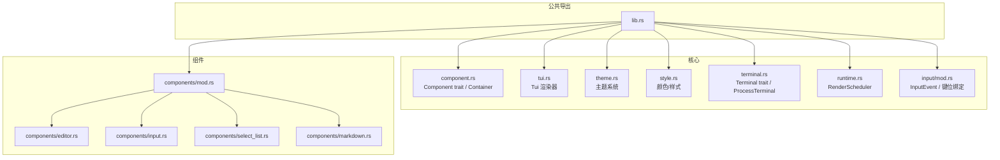
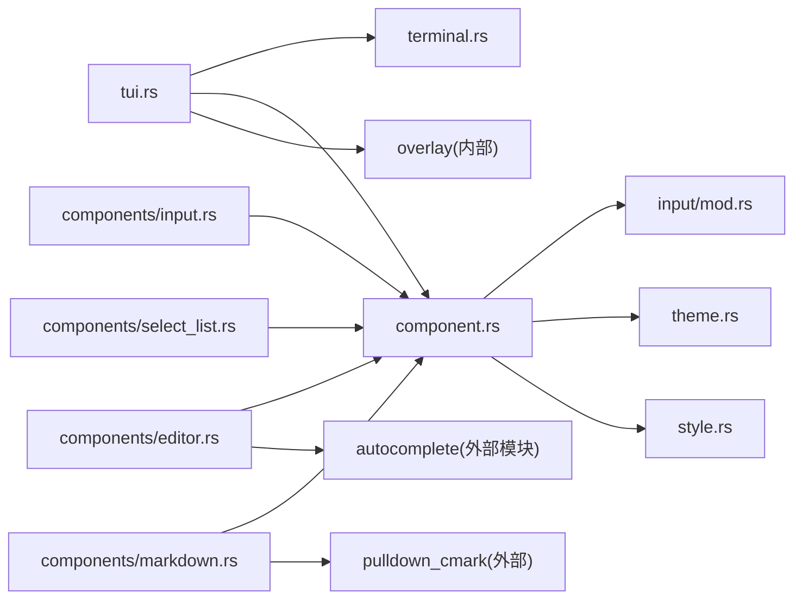

# TUI 组件 API

<cite>
**本文引用的文件**
- [lib.rs](file://crates/pi-tui/src/lib.rs)
- [component.rs](file://crates/pi-tui/src/component.rs)
- [tui.rs](file://crates/pi-tui/src/tui.rs)
- [theme.rs](file://crates/pi-tui/src/theme.rs)
- [style.rs](file://crates/pi-tui/src/style.rs)
- [mod.rs（components）](file://crates/pi-tui/src/components/mod.rs)
- [mod.rs（input）](file://crates/pi-tui/src/input/mod.rs)
- [runtime.rs](file://crates/pi-tui/src/runtime.rs)
- [terminal.rs](file://crates/pi-tui/src/terminal.rs)
- [editor.rs](file://crates/pi-tui/src/components/editor.rs)
- [input.rs](file://crates/pi-tui/src/components/input.rs)
- [select_list.rs](file://crates/pi-tui/src/components/select_list.rs)
- [markdown.rs](file://crates/pi-tui/src/components/markdown.rs)
- [render_once.rs](file://crates/pi-tui/examples/render_once.rs)
- [public_api.rs](file://crates/pi-tui/tests/public_api.rs)
</cite>

## 目录
1. [简介](#简介)
2. [项目结构](#项目结构)
3. [核心组件](#核心组件)
4. [架构总览](#架构总览)
5. [组件详解](#组件详解)
6. [依赖关系分析](#依赖关系分析)
7. [性能与内存优化](#性能与内存优化)
8. [故障排查指南](#故障排查指南)
9. [结论](#结论)
10. [附录：常用 API 索引](#附录常用-api-索引)

## 简介
本文件为 TUI 组件系统的 API 参考文档，覆盖以下内容：
- TuiComponent trait 的生命周期与渲染接口
- Tui 主渲染器的控制流与策略
- 编辑器、输入框、列表选择器、Markdown 渲染器等组件的数据结构与行为
- 主题系统、颜色方案与样式定义
- 键盘事件处理、输入验证与用户交互
- 组件组合模式与布局管理最佳实践
- 性能优化与内存管理建议

## 项目结构
pi-tui crate 提供了终端 UI 的基础能力与一组可复用组件。顶层模块导出公共 API；核心由组件 trait、渲染器、主题与样式、输入与键位绑定、运行时调度器、终端抽象等组成。



图表来源
- [lib.rs:1-61](file://crates/pi-tui/src/lib.rs#L1-L61)
- [component.rs:1-82](file://crates/pi-tui/src/component.rs#L1-L82)
- [tui.rs:1-762](file://crates/pi-tui/src/tui.rs#L1-L762)
- [theme.rs:1-237](file://crates/pi-tui/src/theme.rs#L1-L237)
- [style.rs:1-234](file://crates/pi-tui/src/style.rs#L1-L234)
- [terminal.rs:1-164](file://crates/pi-tui/src/terminal.rs#L1-L164)
- [runtime.rs:1-60](file://crates/pi-tui/src/runtime.rs#L1-L60)
- [input/mod.rs:1-19](file://crates/pi-tui/src/input/mod.rs#L1-L19)
- [components/mod.rs:1-26](file://crates/pi-tui/src/components/mod.rs#L1-L26)

章节来源
- [lib.rs:1-61](file://crates/pi-tui/src/lib.rs#L1-L61)

## 核心组件
本节聚焦于组件模型、渲染器与主题系统的核心 API。

- 组件模型
  - TuiComponent trait 定义了组件的渲染、输入处理、焦点管理与失效机制。容器 Container 实现了复合组件的组合与传播。
- 渲染器
  - Tui 负责收集子组件输出、合成覆盖层、选择渲染策略（全量/差分/无变化）、定位硬件光标，并将最终行缓冲写入终端。
- 主题与样式
  - ThemeMode/ThemePalette/TuiTheme 提供明暗/自定义主题；Style/Color 支持 ANSI/256/真彩；MarkdownTheme/SelectListTheme/SettingsListTheme/EditorTheme 针对各组件提供样式配置。

章节来源
- [component.rs:1-82](file://crates/pi-tui/src/component.rs#L1-L82)
- [tui.rs:52-320](file://crates/pi-tui/src/tui.rs#L52-L320)
- [theme.rs:3-237](file://crates/pi-tui/src/theme.rs#L3-L237)
- [style.rs:3-234](file://crates/pi-tui/src/style.rs#L3-L234)

## 架构总览
下图展示了从输入到渲染的关键流程：事件进入 Tui 后路由至当前焦点组件，组件渲染生成行缓冲，Tui 选择渲染策略并写入终端。

```mermaid
sequenceDiagram
participant Term as "终端"
participant Tui as "Tui"
participant Comp as "组件(Component)"
participant Over as "覆盖层(Overlay)"
Term->>Tui : "InputEvent"
Tui->>Comp : "dispatch_input(event)"
Comp-->>Tui : "render(width) -> Vec<String>"
Tui->>Over : "composite_overlays(...)"
Over-->>Tui : "叠加后的行缓冲"
Tui->>Tui : "choose_strategy(...) 选择策略"
alt 全量重绘
Tui->>Term : "render_full(...)"
else 差分重绘
Tui->>Term : "render_differential(...)"
end
Tui->>Term : "position_hardware_cursor(...)"
```

图表来源
- [tui.rs:223-320](file://crates/pi-tui/src/tui.rs#L223-L320)
- [tui.rs:354-393](file://crates/pi-tui/src/tui.rs#L354-L393)
- [tui.rs:395-531](file://crates/pi-tui/src/tui.rs#L395-L531)

## 组件详解

### TuiComponent trait 与生命周期
- 关键方法
  - render(width): 返回组件渲染的字符串行向量
  - set_viewport_size(width,height): 设置视口尺寸以驱动换行/截断
  - handle_input(&event): 处理输入事件（键、粘贴、原始序列、调整大小）
  - wants_key_release(): 是否需要释放事件
  - set_focused()/focused(): 焦点状态设置与查询
  - as_any()/as_any_mut(): downcast 支持
  - invalidate(): 标记组件失效以触发重新渲染
- Container
  - 递归传播 set_viewport_size/invalidate
  - 渲染时顺序拼接子组件输出

章节来源
- [component.rs:3-29](file://crates/pi-tui/src/component.rs#L3-L29)
- [component.rs:31-81](file://crates/pi-tui/src/component.rs#L31-L81)

### Tui 渲染器与渲染策略
- 渲染策略
  - FullRedraw：全量重绘
  - Differential：从首个变更行开始差分
  - NoChange：无变化
- 关键流程
  - render_once：读取终端尺寸、渲染子组件与覆盖层、选择策略、写入、定位光标
  - choose_strategy：基于尺寸变化、内容长度变化与清屏策略判定
  - position_hardware_cursor：根据游标标记移动硬件光标
- 覆盖层
  - 支持锚点、边距、行列偏移、最大高度、非捕获覆盖层等选项
  - 按需合成到基础行缓冲上

章节来源
- [tui.rs:14-31](file://crates/pi-tui/src/tui.rs#L14-L31)
- [tui.rs:287-320](file://crates/pi-tui/src/tui.rs#L287-L320)
- [tui.rs:395-408](file://crates/pi-tui/src/tui.rs#L395-L408)
- [tui.rs:574-598](file://crates/pi-tui/src/tui.rs#L574-L598)
- [tui.rs:354-393](file://crates/pi-tui/src/tui.rs#L354-L393)

### 输入与键盘事件
- InputEvent
  - Key(KeyEvent)/Paste(String)/Raw(String)/Resize(TerminalSize)
- 键位绑定
  - KeybindingDefinition/KeybindingsManager/TUI_KEYBINDINGS 提供键位注册与匹配
- 输入处理
  - Tui::dispatch_input 将事件路由给当前焦点组件
  - 组件可声明是否需要释放事件（wants_key_release）

章节来源
- [input/mod.rs:12-19](file://crates/pi-tui/src/input/mod.rs#L12-L19)
- [tui.rs:223-235](file://crates/pi-tui/src/tui.rs#L223-L235)
- [component.rs:10-12](file://crates/pi-tui/src/component.rs#L10-L12)

### 主题系统与样式
- 主题
  - ThemeMode：Dark/Light/Custom
  - ThemePalette：强调色、文本、背景、错误、成功、警告、路径、输入边框、菜单边框
  - TuiTheme：聚合 Markdown/SelectList/SettingsList/Editor 主题
- 样式
  - Color：Default/ANSI16/Ansi256/Rgb
  - Style：前景/背景/粗体/弱化/反显
  - 颜色等级检测与按环境降级
- 组件主题
  - EditorTheme/SelectListTheme/SettingsListTheme/MarkdownTheme 分别用于对应组件

章节来源
- [theme.rs:3-237](file://crates/pi-tui/src/theme.rs#L3-L237)
- [style.rs:3-234](file://crates/pi-tui/src/style.rs#L3-L234)

### 文本与 Markdown 渲染
- Text/TruncatedText/Spacer 等基础组件
- Markdown
  - 支持标题、段落、表格、删除线、列表、块引用、代码块、超链接等
  - 可配置主题与是否启用超链接
  - 自动换行与宽度适配

章节来源
- [components/mod.rs:14-26](file://crates/pi-tui/src/components/mod.rs#L14-L26)
- [markdown.rs:9-89](file://crates/pi-tui/src/components/markdown.rs#L9-L89)

### 编辑器组件（Editor）
- 功能要点
  - 文本与光标位置管理
  - 历史记录、撤销/重做栈
  - 剪贴板（KillRing）、粘贴标记展开
  - 自动补全（AutocompleteProvider）
  - 主题化边框与选择列表样式
  - 回调：on_submit/on_change/on_scroll_page_up/down
- 交互
  - 通过 KeybindingsManager 绑定常用操作（前后移动、删除、翻页、提交等）
  - 支持跳转模式、历史选择、多行粘贴

章节来源
- [editor.rs:48-200](file://crates/pi-tui/src/components/editor.rs#L48-L200)

### 输入框组件（Input）
- 功能要点
  - 单行文本输入、光标定位
  - 键位绑定支持（前后移动、删除、行首/行尾）
  - 提交与取消回调
- 交互
  - 支持粘贴、键入字符（忽略带修饰键的特殊字符）

章节来源
- [input.rs:7-164](file://crates/pi-tui/src/components/input.rs#L7-L164)

### 列表选择器（SelectList）
- 功能要点
  - 模糊过滤与索引映射
  - 上/下/翻页/确认/取消键位
  - 最大可见条目数、主题化选中前缀/描述/无匹配提示
- 交互
  - 字母键直接追加过滤条件
  - Backspace 删除最后一个过滤字符

章节来源
- [select_list.rs:28-109](file://crates/pi-tui/src/components/select_list.rs#L28-L109)
- [select_list.rs:111-152](file://crates/pi-tui/src/components/select_list.rs#L111-L152)

### 示例与用法参考
- 最小渲染示例
  - 使用 ProcessTerminal 与 Tui::render_once 渲染单个 Text 组件
- 公共 API 测试
  - 展示 Container、Tui、组件构造、主题应用、图像与颜色工具函数等

章节来源
- [render_once.rs:1-10](file://crates/pi-tui/examples/render_once.rs#L1-L10)
- [public_api.rs:14-116](file://crates/pi-tui/tests/public_api.rs#L14-L116)

## 依赖关系分析
- 模块耦合
  - Tui 依赖 Terminal trait 抽象、InputEvent、Overlay 与组件集合
  - 组件依赖 InputEvent、KeybindingsManager、主题与样式工具
  - 主题系统与样式工具相互独立但被组件广泛使用
- 外部依赖
  - pulldown_cmark 用于 Markdown 解析
  - crossterm 用于终端控制（ProcessTerminal 实现）



图表来源
- [tui.rs:1-762](file://crates/pi-tui/src/tui.rs#L1-L762)
- [terminal.rs:1-164](file://crates/pi-tui/src/terminal.rs#L1-L164)
- [component.rs:1-82](file://crates/pi-tui/src/component.rs#L1-L82)
- [input/mod.rs:1-19](file://crates/pi-tui/src/input/mod.rs#L1-L19)
- [theme.rs:1-237](file://crates/pi-tui/src/theme.rs#L1-L237)
- [style.rs:1-234](file://crates/pi-tui/src/style.rs#L1-L234)
- [editor.rs:1-200](file://crates/pi-tui/src/components/editor.rs#L1-L200)
- [input.rs:1-181](file://crates/pi-tui/src/components/input.rs#L1-L181)
- [select_list.rs:1-200](file://crates/pi-tui/src/components/select_list.rs#L1-L200)
- [markdown.rs:1-200](file://crates/pi-tui/src/components/markdown.rs#L1-L200)

## 性能与内存优化
- 渲染策略
  - 优先使用差分渲染（Differential），仅在尺寸变化或内容整体回退时进行全量重绘
  - 控制覆盖层数量与最大高度，避免过多叠加导致行缓冲膨胀
- 行缓冲与宽度
  - 合理设置组件宽度，避免过宽导致频繁截断与重排
  - 使用可见宽度计算（visible_width）而非字节长度，确保跨语言字符正确
- 组件失效
  - 仅在必要时调用 invalidate，减少不必要的重渲染
- 输入与事件
  - 在高频输入场景下，使用 RenderScheduler 控制最小渲染间隔，合并多次变更
- 内存
  - Editor 的撤销/重做栈与历史记录应限制容量（如 100 条），防止无限增长
  - SelectList 的过滤结果缓存与索引映射避免重复模糊匹配

[本节为通用指导，不直接分析具体文件]

## 故障排查指南
- 常见错误
  - 行宽超限：当某行可见宽度超过终端宽度时抛出错误，检查组件宽度与文本换行策略
  - 焦点丢失：焦点组件被移除后 Tui 会清除焦点，确保在移除前切换焦点或重建焦点
  - 覆盖层隐藏：隐藏覆盖层后若焦点落在其上，Tui 会尝试恢复之前焦点
- 调试建议
  - 使用 Tui::rendered_lines 查看上次渲染的行缓冲
  - 打印组件的 render 输出，确认宽度与换行是否符合预期
  - 检查 InputEvent 是否被正确路由到目标组件（wants_key_release）

章节来源
- [tui.rs:40-50](file://crates/pi-tui/src/tui.rs#L40-L50)
- [tui.rs:202-221](file://crates/pi-tui/src/tui.rs#L202-L221)
- [tui.rs:287-320](file://crates/pi-tui/src/tui.rs#L287-L320)

## 结论
pi-tui 提供了清晰的组件模型与高效的渲染管线，结合灵活的主题与样式系统，能够快速构建复杂的终端交互界面。通过合理的组件组合、覆盖层管理与渲染策略选择，可在保证体验的同时获得良好的性能表现。

[本节为总结性内容，不直接分析具体文件]

## 附录：常用 API 索引
- 组件与容器
  - Component trait：render/set_viewport_size/handle_input/wants_key_release/set_focused/focused/as_any/as_any_mut/invalidate
  - Container：add_child/render/set_viewport_size/invalidate
- 渲染器
  - Tui::new/with_surface/add_child/clear_children/remove_child/show_overlay/hide_overlay/set_overlay_hidden/focus_overlay/unfocus_overlay/set_focus/dispatch_input/component_as/component_as_mut/full_redraws/rendered_lines/set_clear_on_shrink/set_render_surface/render_once
  - RenderStrategy/RenderOutcome/RenderSurface/TuiError
- 输入与键位
  - InputEvent/Key/KeyEvent/KeyModifiers/KeybindingDefinition/KeybindingsManager/TUI_KEYBINDINGS
- 主题与样式
  - ThemeMode/ThemePalette/TuiTheme/dark_theme/light_theme
  - Color/ColorLevel/Style/paint/paint_with/paint_with_level/color_enabled/color_level/detect_color_level_from_env
- 终端抽象
  - Terminal trait/ProcessTerminal/TerminalSize/start/stop/drain_input/set_title/set_progress/kitty_protocol_active
- 运行时调度
  - RenderScheduler::new/request/has_pending/next_render_at/should_render_now/mark_rendered
- 组件清单
  - Text/TruncatedText/Spacer/Box/Markdown/Input/Editor/SelectList/SelectorDialog/SettingsList/CancellableLoader/Loader/LoaderIndicatorOptions/Image/BackgroundFn/SelectItem/SettingItem/SettingsSubmenuDone

章节来源
- [component.rs:3-29](file://crates/pi-tui/src/component.rs#L3-L29)
- [component.rs:31-81](file://crates/pi-tui/src/component.rs#L31-L81)
- [tui.rs:74-286](file://crates/pi-tui/src/tui.rs#L74-L286)
- [input/mod.rs:5-19](file://crates/pi-tui/src/input/mod.rs#L5-L19)
- [theme.rs:156-237](file://crates/pi-tui/src/theme.rs#L156-L237)
- [style.rs:113-234](file://crates/pi-tui/src/style.rs#L113-L234)
- [terminal.rs:15-50](file://crates/pi-tui/src/terminal.rs#L15-L50)
- [runtime.rs:11-59](file://crates/pi-tui/src/runtime.rs#L11-L59)
- [components/mod.rs:14-26](file://crates/pi-tui/src/components/mod.rs#L14-L26)