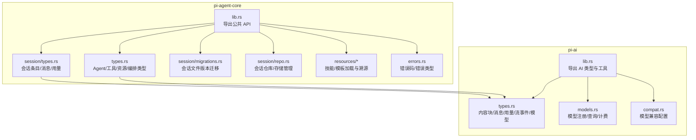
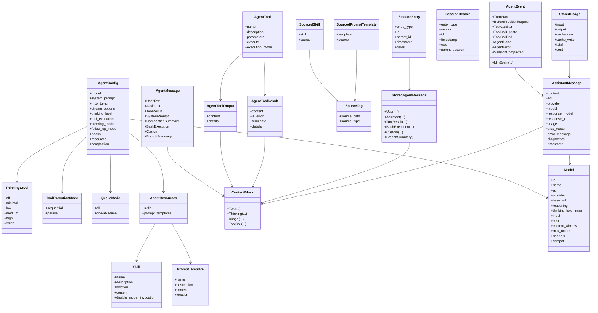
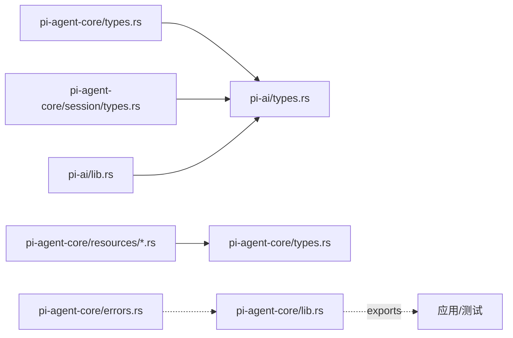

# 数据结构参考

<cite>
**本文档引用的文件**
- [crates/pi-agent-core/src/lib.rs](file://crates/pi-agent-core/src/lib.rs)
- [crates/pi-agent-core/src/types.rs](file://crates/pi-agent-core/src/types.rs)
- [crates/pi-agent-core/src/session/types.rs](file://crates/pi-agent-core/src/session/types.rs)
- [crates/pi-agent-core/src/session/migrations.rs](file://crates/pi-agent-core/src/session/migrations.rs)
- [crates/pi-agent-core/src/session/repo.rs](file://crates/pi-agent-core/src/session/repo.rs)
- [crates/pi-agent-core/src/resources/mod.rs](file://crates/pi-agent-core/src/resources/mod.rs)
- [crates/pi-agent-core/src/resources/skills.rs](file://crates/pi-agent-core/src/resources/skills.rs)
- [crates/pi-agent-core/src/resources/prompt_templates.rs](file://crates/pi-agent-core/src/resources/prompt_templates.rs)
- [crates/pi-agent-core/src/errors.rs](file://crates/pi-agent-core/src/errors.rs)
- [crates/pi-ai/src/lib.rs](file://crates/pi-ai/src/lib.rs)
- [crates/pi-ai/src/types.rs](file://crates/pi-ai/src/types.rs)
- [crates/pi-ai/src/models.rs](file://crates/pi-ai/src/models.rs)
- [crates/pi-ai/src/compat.rs](file://crates/pi-ai/src/compat.rs)
- [crates/pi-agent-core/tests/session_wire.rs](file://crates/pi-agent-core/tests/session_wire.rs)
- [crates/pi-agent-core/tests/session_jsonl.rs](file://crates/pi-agent-core/tests/session_jsonl.rs)
</cite>

## 目录
1. [引言](#引言)
2. [项目结构](#项目结构)
3. [核心组件](#核心组件)
4. [架构总览](#架构总览)
5. [详细组件分析](#详细组件分析)
6. [依赖分析](#依赖分析)
7. [性能考虑](#性能考虑)
8. [故障排查指南](#故障排查指南)
9. [结论](#结论)
10. [附录](#附录)

## 引言
本文件为 Pi-Rust 项目的“数据结构参考”，系统梳理并解释公共数据类型、枚举与结构体的定义、字段语义、序列化格式、JSON 模式、验证规则、错误类型与诊断信息、版本兼容性与迁移策略、内存布局与性能特性、并发安全考量，以及典型用法示例路径。目标是帮助开发者在不深入源码的情况下快速理解并正确使用这些数据结构。

## 项目结构
Pi-Rust 采用多 crate 组织：核心逻辑位于 pi-agent-core，AI 交互与模型能力位于 pi-ai，其他如 TUI、Web UI 等作为独立 crate。本文聚焦于与数据结构直接相关的核心模块与类型定义。

图表来源
- [crates/pi-agent-core/src/lib.rs:1-47](file://crates/pi-agent-core/src/lib.rs#L1-L47)
- [crates/pi-agent-core/src/types.rs:1-657](file://crates/pi-agent-core/src/types.rs#L1-L657)
- [crates/pi-agent-core/src/session/types.rs:1-177](file://crates/pi-agent-core/src/session/types.rs#L1-L177)
- [crates/pi-agent-core/src/session/migrations.rs:1-151](file://crates/pi-agent-core/src/session/migrations.rs#L1-L151)
- [crates/pi-agent-core/src/session/repo.rs:1-281](file://crates/pi-agent-core/src/session/repo.rs#L1-L281)
- [crates/pi-agent-core/src/resources/mod.rs:1-12](file://crates/pi-agent-core/src/resources/mod.rs#L1-L12)
- [crates/pi-agent-core/src/errors.rs:1-231](file://crates/pi-agent-core/src/errors.rs#L1-L231)
- [crates/pi-ai/src/lib.rs:1-19](file://crates/pi-ai/src/lib.rs#L1-L19)
- [crates/pi-ai/src/types.rs:1-599](file://crates/pi-ai/src/types.rs#L1-L599)
- [crates/pi-ai/src/models.rs:1-110](file://crates/pi-ai/src/models.rs#L1-L110)
- [crates/pi-ai/src/compat.rs:1-249](file://crates/pi-ai/src/compat.rs#L1-L249)

章节来源
- [crates/pi-agent-core/src/lib.rs:1-47](file://crates/pi-agent-core/src/lib.rs#L1-L47)
- [crates/pi-ai/src/lib.rs:1-19](file://crates/pi-ai/src/lib.rs#L1-L19)

## 核心组件
本节概述与数据结构强相关的公共类型族，包括思考级别、工具执行模式、队列模式、Agent 配置、事件与消息、工具结果、资源与溯源标签、会话条目与持久化等。

- 思考级别（ThinkingLevel）
  - 取值：off/minimal/low/medium/high/xhigh
  - 支持字符串解析与显示
  - 用途：控制模型推理/思考深度
- 工具执行模式（ToolExecutionMode）
  - 取值：sequential/parallel
  - 用途：控制工具调用并发策略
- 队列模式（QueueMode）
  - 取值：all/one-at-a-time
  - 用途：控制转向与后续请求的排队策略
- Agent 配置（AgentConfig）
  - 关键字段：模型、系统提示、最大轮次、流选项、思考级别、工具执行模式、队列模式、钩子、资源、压缩配置
  - 默认值：符合特定基线（如思考级别 off、工具并行、队列单次）
- Agent 事件（AgentEvent）与消息（AgentMessage）
  - 事件：轮开始、请求前快照、LLM 流事件、工具调用生命周期、完成/错误、会话压缩
  - 消息：用户文本、助手响应、工具结果、系统提示、压缩摘要、Bash 执行、自定义消息、分支摘要
- 工具类型（AgentTool/AgentToolResult/AgentToolOutput）
  - 工具：名称、描述、参数 JSON Schema、执行函数、可选执行模式
  - 结果：内容块列表、是否错误、是否终止、细节
  - 输出：内容块列表、可选细节
- 资源与溯源（Skill/PromptTemplate/AgentResources/Sourced*）
  - 资源：技能集合、提示模板集合
  - 溯源：SourceTag、SourcedSkill、SourcedPromptTemplate、SourcedResourceDiagnostic
- 会话数据（SessionHeader/SessionEntry/StoredAgentMessage/StoredUsage）
  - 头部：类型、版本、会话 ID、时间戳、工作目录、父会话
  - 条目：类型、ID、父 ID、时间戳、扁平字段映射
  - 存储消息：用户/助手/工具结果/Bash/自定义/分支摘要
  - 用量：输入/输出/缓存读写/总计/成本
- 错误类型（FileError/ExecutionError/AgentHarnessError/BranchSummaryError）
  - 错误码：枚举化，提供字符串表示与路径携带
  - 错误对象：带消息与上下文

章节来源
- [crates/pi-agent-core/src/types.rs:13-114](file://crates/pi-agent-core/src/types.rs#L13-L114)
- [crates/pi-agent-core/src/types.rs:409-443](file://crates/pi-agent-core/src/types.rs#L409-L443)
- [crates/pi-agent-core/src/types.rs:456-491](file://crates/pi-agent-core/src/types.rs#L456-L491)
- [crates/pi-agent-core/src/types.rs:302-353](file://crates/pi-agent-core/src/types.rs#L302-L353)
- [crates/pi-agent-core/src/types.rs:118-184](file://crates/pi-agent-core/src/types.rs#L118-L184)
- [crates/pi-agent-core/src/types.rs:188-264](file://crates/pi-agent-core/src/types.rs#L188-L264)
- [crates/pi-agent-core/src/session/types.rs:5-70](file://crates/pi-agent-core/src/session/types.rs#L5-L70)
- [crates/pi-agent-core/src/session/types.rs:72-139](file://crates/pi-agent-core/src/session/types.rs#L72-L139)
- [crates/pi-agent-core/src/session/types.rs:141-161](file://crates/pi-agent-core/src/session/types.rs#L141-L161)
- [crates/pi-agent-core/src/errors.rs:3-100](file://crates/pi-agent-core/src/errors.rs#L3-L100)
- [crates/pi-agent-core/src/errors.rs:125-152](file://crates/pi-agent-core/src/errors.rs#L125-L152)
- [crates/pi-agent-core/src/errors.rs:183-197](file://crates/pi-agent-core/src/errors.rs#L183-L197)
- [crates/pi-agent-core/src/errors.rs:216-230](file://crates/pi-agent-core/src/errors.rs#L216-L230)

## 架构总览
下图展示数据结构在核心与 AI 层之间的关系，以及会话持久化的关键类型。

图表来源
- [crates/pi-agent-core/src/types.rs:13-114](file://crates/pi-agent-core/src/types.rs#L13-L114)
- [crates/pi-agent-core/src/types.rs:409-443](file://crates/pi-agent-core/src/types.rs#L409-L443)
- [crates/pi-agent-core/src/types.rs:456-491](file://crates/pi-agent-core/src/types.rs#L456-L491)
- [crates/pi-agent-core/src/types.rs:302-353](file://crates/pi-agent-core/src/types.rs#L302-L353)
- [crates/pi-agent-core/src/types.rs:118-184](file://crates/pi-agent-core/src/types.rs#L118-L184)
- [crates/pi-agent-core/src/types.rs:188-264](file://crates/pi-agent-core/src/types.rs#L188-L264)
- [crates/pi-agent-core/src/session/types.rs:5-161](file://crates/pi-agent-core/src/session/types.rs#L5-L161)
- [crates/pi-ai/src/types.rs:9-40](file://crates/pi-ai/src/types.rs#L9-L40)
- [crates/pi-ai/src/types.rs:104-122](file://crates/pi-ai/src/types.rs#L104-L122)
- [crates/pi-ai/src/types.rs:264-284](file://crates/pi-ai/src/types.rs#L264-L284)

## 详细组件分析

### 内容块与消息（ContentBlock、Message、AssistantMessage、AssistantMessageEvent）
- ContentBlock
  - 文本、思考、图片、工具调用四类，支持签名与可选字段
- Message
  - 用户/助手/工具结果三类，工具结果含工具调用标识、名称与错误标记
- AssistantMessage
  - 响应主体，包含内容块、API/提供商/模型、用量、停止原因、错误信息、诊断、时间戳
- AssistantMessageEvent
  - 流式事件：start/text/thinking/toolcall 的 delta/end，done/error

序列化与 JSON 模式要点
- ContentBlock.tag 映射到 type 字段；Thinking/thought_signature/redacted 可选
- Message.tag 映射到 role 字段
- AssistantMessageEvent.tag 映射到 type 字段，delta 与索引字段命名遵循 snake_case
- StopReason 序列化为小写字符串

章节来源
- [crates/pi-ai/src/types.rs:9-40](file://crates/pi-ai/src/types.rs#L9-L40)
- [crates/pi-ai/src/types.rs:44-61](file://crates/pi-ai/src/types.rs#L44-L61)
- [crates/pi-ai/src/types.rs:104-122](file://crates/pi-ai/src/types.rs#L104-L122)
- [crates/pi-ai/src/types.rs:166-242](file://crates/pi-ai/src/types.rs#L166-L242)
- [crates/pi-ai/src/types.rs:90-99](file://crates/pi-ai/src/types.rs#L90-L99)

### Agent 配置与事件（AgentConfig、AgentEvent、AgentMessage）
- AgentConfig
  - 默认构造器提供基线默认值；包含模型、系统提示、最大轮次、流选项、思考级别、工具执行模式、队列模式、钩子、资源、压缩配置
- AgentEvent
  - 轮开始、请求前快照、LLM 事件、工具调用生命周期、完成/错误、会话压缩
- AgentMessage
  - 用户文本、助手响应、工具结果、系统提示、压缩摘要、Bash 执行、自定义消息、分支摘要

序列化与 JSON 模式要点
- AgentEvent 与 AgentMessage 均为枚举变体，序列化为包含 type/role 等字段的对象
- 自定义消息支持 display 与 details 字段

章节来源
- [crates/pi-agent-core/src/types.rs:409-443](file://crates/pi-agent-core/src/types.rs#L409-L443)
- [crates/pi-agent-core/src/types.rs:456-491](file://crates/pi-agent-core/src/types.rs#L456-L491)
- [crates/pi-agent-core/src/types.rs:302-353](file://crates/pi-agent-core/src/types.rs#L302-L353)

### 工具与结果（AgentTool、AgentToolResult、AgentToolOutput）
- AgentTool
  - 名称、描述、参数 JSON Schema、执行函数、可选执行模式
  - 提供便捷构造器用于文本工具
- AgentToolResult/AgentToolOutput
  - 结果/输出均包含内容块列表与可选细节

序列化与 JSON 模式要点
- 参数以 JSON Schema 表达，便于外部校验与生成工具接口
- 输出/结果中的内容块遵循 ContentBlock 规范

章节来源
- [crates/pi-agent-core/src/types.rs:357-405](file://crates/pi-agent-core/src/types.rs#L357-L405)
- [crates/pi-agent-core/src/types.rs:118-184](file://crates/pi-agent-core/src/types.rs#L118-L184)

### 资源与溯源（Skill、PromptTemplate、AgentResources、Sourced*）
- Skill/PromptTemplate
  - 包含名称、描述、位置、内容、禁用模型调用标志等
- AgentResources
  - 技能与模板集合，提供空判断
- Sourced*
  - 通过 SourceTag 记录来源路径与类型，便于诊断与审计

加载流程要点
- 技能：支持目录与文件，自动扫描 SKILL.md，忽略隐藏目录
- 模板：支持目录与文件，按文件名排序加载

章节来源
- [crates/pi-agent-core/src/types.rs:188-264](file://crates/pi-agent-core/src/types.rs#L188-L264)
- [crates/pi-agent-core/src/resources/skills.rs:9-60](file://crates/pi-agent-core/src/resources/skills.rs#L9-L60)
- [crates/pi-agent-core/src/resources/skills.rs:111-168](file://crates/pi-agent-core/src/resources/skills.rs#L111-L168)
- [crates/pi-agent-core/src/resources/prompt_templates.rs:8-40](file://crates/pi-agent-core/src/resources/prompt_templates.rs#L8-L40)
- [crates/pi-agent-core/src/resources/prompt_templates.rs:67-127](file://crates/pi-agent-core/src/resources/prompt_templates.rs#L67-L127)

### 会话数据与持久化（SessionHeader、SessionEntry、StoredAgentMessage、StoredUsage）
- SessionHeader
  - 类型固定为 session，版本号、会话 ID、时间戳、工作目录、父会话可选
- SessionEntry
  - 类型、ID、父 ID、时间戳、扁平字段映射；提供 message/session_info 辅助构造
- StoredAgentMessage
  - 用户/助手/工具结果/Bash/自定义/分支摘要六类，字段命名遵循 snake_case
- StoredUsage
  - 输入/输出/缓存读写/总计/成本，总计字段名为 total

版本与迁移
- 当前会话版本：3
- 迁移：v1->v2 注入 ID/parentId/firstKeptEntryId；v2->v3 将 hookMessage 角色重命名为 custom

章节来源
- [crates/pi-agent-core/src/session/types.rs:5-70](file://crates/pi-agent-core/src/session/types.rs#L5-L70)
- [crates/pi-agent-core/src/session/types.rs:72-139](file://crates/pi-agent-core/src/session/types.rs#L72-L139)
- [crates/pi-agent-core/src/session/types.rs:141-161](file://crates/pi-agent-core/src/session/types.rs#L141-L161)
- [crates/pi-agent-core/src/session/migrations.rs:5-54](file://crates/pi-agent-core/src/session/migrations.rs#L5-L54)
- [crates/pi-agent-core/src/session/migrations.rs:56-127](file://crates/pi-agent-core/src/session/migrations.rs#L56-L127)
- [crates/pi-agent-core/src/session/migrations.rs:129-150](file://crates/pi-agent-core/src/session/migrations.rs#L129-L150)

### 会话仓库与存储（JsonlSessionRepo、JsonlSessionStorage）
- JsonlSessionRepo
  - 创建/打开/列出/最近会话/派生（fork）会话，支持基于 cwd 编码目录
- JsonlSessionStorage
  - JSONL 文件存储，包含头、条目、叶子节点追踪与元数据

章节来源
- [crates/pi-agent-core/src/session/repo.rs:8-215](file://crates/pi-agent-core/src/session/repo.rs#L8-L215)

### 模型与兼容性（Model、StreamOptions、ProviderStreamHooks、ModelCompat）
- Model
  - 标识、名称、API/提供商、基础 URL、推理能力、思考级别映射、输入类型、成本、上下文窗口、最大令牌、头部、兼容配置
- StreamOptions
  - 温度、最大令牌、API Key、缓存保留、思考配置、工具选择、会话 ID、Azure/OpenAI/Bedrock 等特定字段、超时/重试/取消令牌/钩子
- ProviderStreamHooks
  - 请求载荷与响应阶段钩子，异步应用
- ModelCompat
  - OpenAI Completions/Responses、Anthropic Messages 等兼容配置，自动识别与序列化

章节来源
- [crates/pi-ai/src/types.rs:264-284](file://crates/pi-ai/src/types.rs#L264-L284)
- [crates/pi-ai/src/types.rs:363-407](file://crates/pi-ai/src/types.rs#L363-L407)
- [crates/pi-ai/src/compat.rs:180-220](file://crates/pi-ai/src/compat.rs#L180-L220)

### 错误类型与诊断（FileError/ExecutionError/AgentHarnessError/BranchSummaryError）
- FileError/ExecutionError
  - 枚举化错误码与错误对象，提供字符串表示与可选路径
- AgentHarnessError/BranchSummaryError
  - 统一错误包装，包含代码与消息

章节来源
- [crates/pi-agent-core/src/errors.rs:3-100](file://crates/pi-agent-core/src/errors.rs#L3-L100)
- [crates/pi-agent-core/src/errors.rs:125-152](file://crates/pi-agent-core/src/errors.rs#L125-L152)
- [crates/pi-agent-core/src/errors.rs:183-197](file://crates/pi-agent-core/src/errors.rs#L183-L197)
- [crates/pi-agent-core/src/errors.rs:216-230](file://crates/pi-agent-core/src/errors.rs#L216-L230)

## 依赖分析
- pi-agent-core 依赖 pi-ai 的类型（内容块、消息、用量、模型、流事件等），用于统一跨提供商的消息与用量建模
- AgentConfig/AgentEvent/AgentMessage 依赖 pi-ai 的 Model/AssistantMessage/ContentBlock/Usage 等
- 会话类型（SessionHeader/SessionEntry/StoredAgentMessage/StoredUsage）与 pi-ai 的 ContentBlock/StopReason 对齐
- 资源加载（skills/prompt_templates）依赖 SourceTag 与 ResourceDiagnostic，形成溯源与诊断闭环

图表来源
- [crates/pi-agent-core/src/types.rs:1-10](file://crates/pi-agent-core/src/types.rs#L1-L10)
- [crates/pi-agent-core/src/session/types.rs:1-3](file://crates/pi-agent-core/src/session/types.rs#L1-L3)
- [crates/pi-agent-core/src/resources/mod.rs:6-11](file://crates/pi-agent-core/src/resources/mod.rs#L6-L11)
- [crates/pi-agent-core/src/lib.rs:18-46](file://crates/pi-agent-core/src/lib.rs#L18-L46)
- [crates/pi-ai/src/lib.rs:10-18](file://crates/pi-ai/src/lib.rs#L10-L18)

## 性能考虑
- 内存布局
  - 大多数结构体为聚合类型，字段顺序与大小受底层类型影响；ContentBlock/StoredAgentMessage 等包含 Vec/Option，注意堆分配与拷贝
- 序列化开销
  - 流事件与消息频繁序列化，建议复用序列化缓冲区或使用流式序列化库
- 并发安全
  - 多数类型为不可变数据容器，适合只读共享；若需并发修改，建议使用 Arc+Mutex 或无锁结构
- 工具执行
  - 工具执行函数返回异步结果，建议限制并发数量以避免资源争用

## 故障排查指南
- 会话文件版本不支持
  - 现象：打开会话报错，提示不支持的版本
  - 处理：确保使用最新版本工具或手动迁移
- 无效会话头/条目
  - 现象：打开失败，提示头缺失或条目非对象
  - 处理：检查 JSONL 第一行是否为合法头，确认每行均为对象
- fork 目标不存在
  - 现象：派生失败，提示条目 ID 未找到
  - 处理：确认目标条目存在于源会话中
- 资源加载失败
  - 现象：技能/模板读取失败产生警告诊断
  - 处理：检查文件权限与路径，确认 Frontmatter 正确

章节来源
- [crates/pi-agent-core/src/session/migrations.rs:36-41](file://crates/pi-agent-core/src/session/migrations.rs#L36-L41)
- [crates/pi-agent-core/tests/session_jsonl.rs:62-76](file://crates/pi-agent-core/tests/session_jsonl.rs#L62-L76)
- [crates/pi-agent-core/src/session/repo.rs:193-197](file://crates/pi-agent-core/src/session/repo.rs#L193-L197)
- [crates/pi-agent-core/src/resources/skills.rs:116-127](file://crates/pi-agent-core/src/resources/skills.rs#L116-L127)
- [crates/pi-agent-core/src/resources/prompt_templates.rs:71-82](file://crates/pi-agent-core/src/resources/prompt_templates.rs#L71-L82)

## 结论
本文档对 Pi-Rust 的核心数据结构进行了系统化梳理，覆盖了从消息与内容块、Agent 配置与事件、工具与结果、资源与溯源、到会话持久化与错误类型的全链路定义。通过明确的序列化规范、版本迁移策略与故障排查指引，开发者可以更高效地集成与扩展功能，同时保持数据一致性与可维护性。

## 附录

### 版本兼容性与迁移指南
- 会话文件版本
  - 当前版本：3
  - 迁移策略：v1->v2 注入 ID/parentId/firstKeptEntryId；v2->v3 将 hookMessage 角色重命名为 custom
- 迁移流程
  - 读取首行头，解析 version
  - 若小于当前版本则按序迁移，更新后继续
  - 若大于当前版本，拒绝打开并提示不支持

章节来源
- [crates/pi-agent-core/src/session/migrations.rs:5-54](file://crates/pi-agent-core/src/session/migrations.rs#L5-L54)
- [crates/pi-agent-core/src/session/migrations.rs:56-127](file://crates/pi-agent-core/src/session/migrations.rs#L56-L127)
- [crates/pi-agent-core/src/session/migrations.rs:129-150](file://crates/pi-agent-core/src/session/migrations.rs#L129-L150)

### 序列化与 JSON 模式要点
- ContentBlock/Message/AssistantMessage/AssistantMessageEvent
  - 使用 serde tag/flatten/rename 等属性保证跨语言一致性
- StopReason/StreamOptions/Model
  - 使用 snake_case/camelCase 命名映射，确保与前端/TS 侧一致
- 会话条目
  - flatten fields 映射任意键值对，便于扩展

章节来源
- [crates/pi-ai/src/types.rs:9-40](file://crates/pi-ai/src/types.rs#L9-L40)
- [crates/pi-ai/src/types.rs:44-61](file://crates/pi-ai/src/types.rs#L44-L61)
- [crates/pi-ai/src/types.rs:166-242](file://crates/pi-ai/src/types.rs#L166-L242)
- [crates/pi-ai/src/types.rs:90-99](file://crates/pi-ai/src/types.rs#L90-L99)
- [crates/pi-ai/src/types.rs:363-407](file://crates/pi-ai/src/types.rs#L363-L407)
- [crates/pi-ai/src/types.rs:264-284](file://crates/pi-ai/src/types.rs#L264-L284)
- [crates/pi-agent-core/src/session/types.rs:25-26](file://crates/pi-agent-core/src/session/types.rs#L25-L26)

### 典型使用示例（代码片段路径）
- 会话头与消息条目序列化
  - [crates/pi-agent-core/tests/session_wire.rs:7-21](file://crates/pi-agent-core/tests/session_wire.rs#L7-L21)
  - [crates/pi-agent-core/tests/session_wire.rs:24-42](file://crates/pi-agent-core/tests/session_wire.rs#L24-L42)
  - [crates/pi-agent-core/tests/session_wire.rs:45-78](file://crates/pi-agent-core/tests/session_wire.rs#L45-L78)
- JSONL 会话创建与打开
  - [crates/pi-agent-core/tests/session_jsonl.rs:19-39](file://crates/pi-agent-core/tests/session_jsonl.rs#L19-L39)
  - [crates/pi-agent-core/tests/session_jsonl.rs:42-59](file://crates/pi-agent-core/tests/session_jsonl.rs#L42-L59)
  - [crates/pi-agent-core/tests/session_jsonl.rs:62-76](file://crates/pi-agent-core/tests/session_jsonl.rs#L62-L76)
- Agent 工具与结果构造
  - [crates/pi-agent-core/src/types.rs:376-405](file://crates/pi-agent-core/src/types.rs#L376-L405)
  - [crates/pi-agent-core/src/types.rs:154-184](file://crates/pi-agent-core/src/types.rs#L154-L184)
- 资源加载与溯源
  - [crates/pi-agent-core/src/resources/skills.rs:39-60](file://crates/pi-agent-core/src/resources/skills.rs#L39-L60)
  - [crates/pi-agent-core/src/resources/prompt_templates.rs:44-65](file://crates/pi-agent-core/src/resources/prompt_templates.rs#L44-L65)