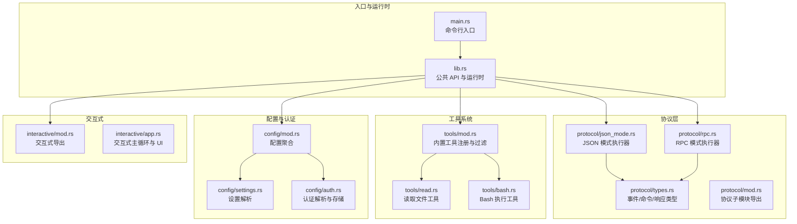
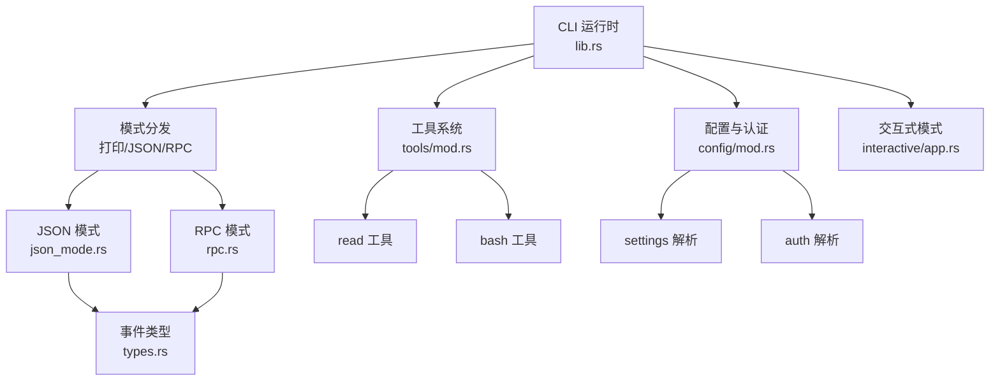
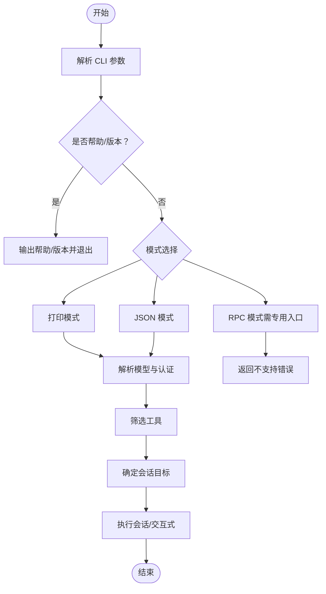
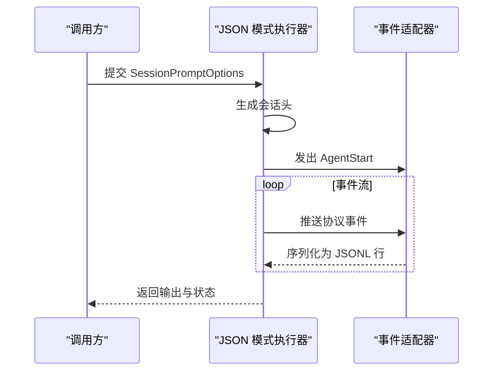
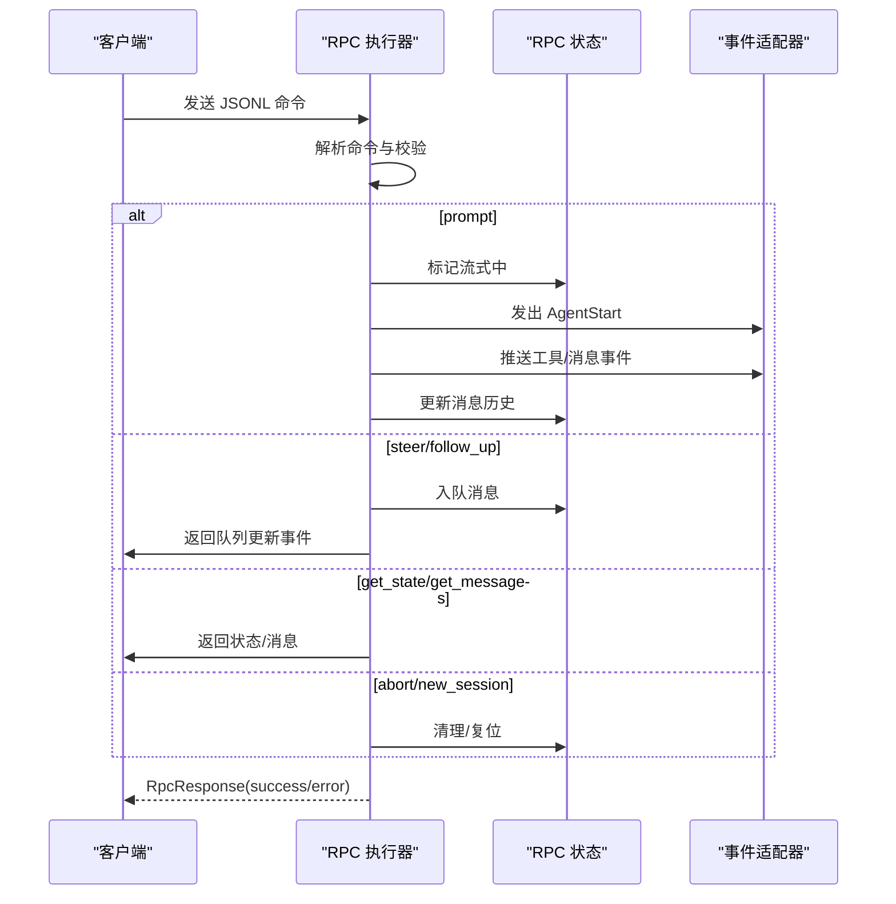
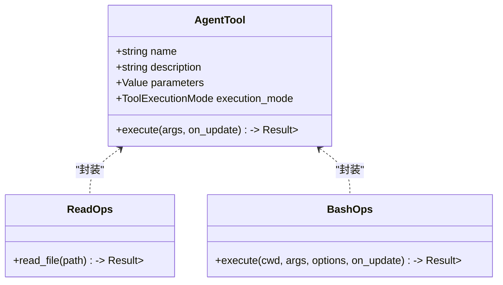
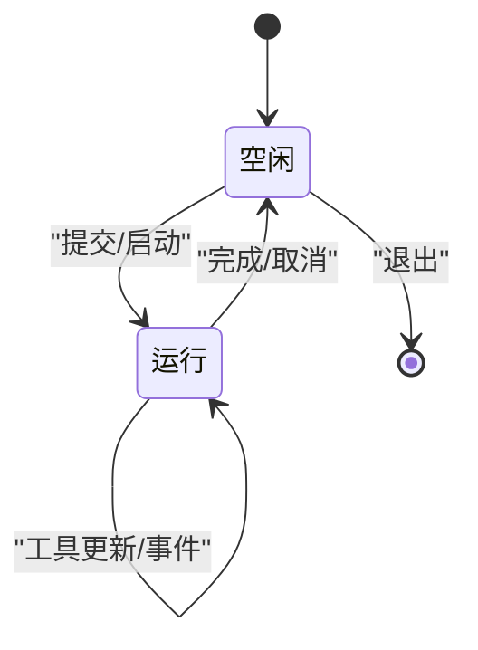
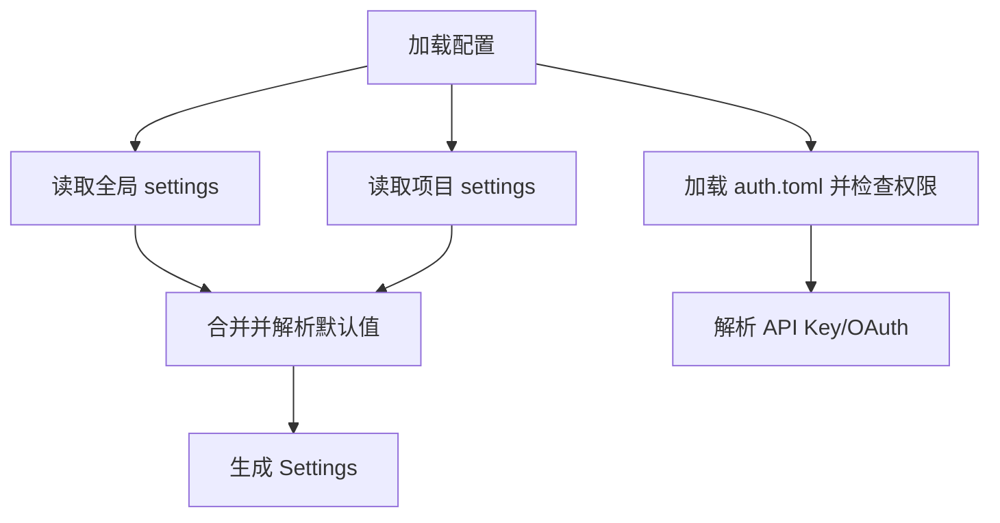
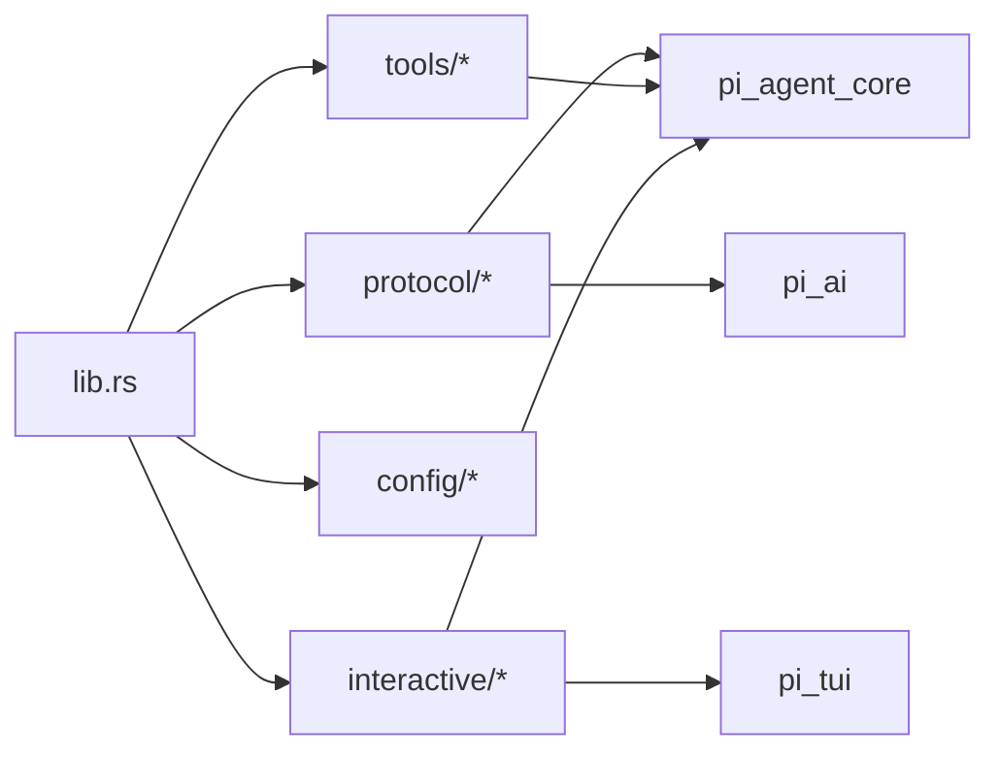

# 编码代理 API

<cite>
**本文引用的文件**
- [lib.rs](file://crates/pi-coding-agent/src/lib.rs)
- [main.rs](file://crates/pi-coding-agent/src/main.rs)
- [protocol/mod.rs](file://crates/pi-coding-agent/src/protocol/mod.rs)
- [protocol/rpc.rs](file://crates/pi-coding-agent/src/protocol/rpc.rs)
- [protocol/json_mode.rs](file://crates/pi-coding-agent/src/protocol/json_mode.rs)
- [protocol/types.rs](file://crates/pi-coding-agent/src/protocol/types.rs)
- [tools/mod.rs](file://crates/pi-coding-agent/src/tools/mod.rs)
- [tools/bash.rs](file://crates/pi-coding-agent/src/tools/bash.rs)
- [tools/read.rs](file://crates/pi-coding-agent/src/tools/read.rs)
- [config/mod.rs](file://crates/pi-coding-agent/src/config/mod.rs)
- [config/settings.rs](file://crates/pi-coding-agent/src/config/settings.rs)
- [config/auth.rs](file://crates/pi-coding-agent/src/config/auth.rs)
- [interactive/mod.rs](file://crates/pi-coding-agent/src/interactive/mod.rs)
- [interactive/app.rs](file://crates/pi-coding-agent/src/interactive/app.rs)
</cite>

## 目录
1. [简介](#简介)
2. [项目结构](#项目结构)
3. [核心组件](#核心组件)
4. [架构总览](#架构总览)
5. [详细组件分析](#详细组件分析)
6. [依赖关系分析](#依赖关系分析)
7. [性能考量](#性能考量)
8. [故障排查指南](#故障排查指南)
9. [结论](#结论)
10. [附录：扩展与最佳实践](#附录扩展与最佳实践)

## 简介
本文件为“编码代理 API”的权威参考，覆盖 CLI 模式切换、协议接口（JSON 模式、RPC 协议、事件流）、工具系统（文件操作、Bash 命令、搜索工具等）、交互式模式组件与生命周期、配置管理、认证处理与会话持久化，以及异步操作与错误处理的最佳实践。读者可据此实现头等舱（headless）与交互式两种运行形态，并基于内置工具体系进行扩展。

## 项目结构
编码代理位于 crates/pi-coding-agent 子工程中，围绕以下模块组织：
- 入口与运行时：lib.rs、main.rs
- 协议层：protocol/（事件流、JSON 模式、RPC、类型）
- 工具系统：tools/（read、write、edit、bash、grep、find、ls 等）
- 配置与认证：config/（settings、auth）
- 交互式界面：interactive/（应用、事件桥、转录）

图表来源
- [main.rs:1-60](file://crates/pi-coding-agent/src/main.rs#L1-L60)
- [lib.rs:1-352](file://crates/pi-coding-agent/src/lib.rs#L1-L352)
- [protocol/mod.rs:1-7](file://crates/pi-coding-agent/src/protocol/mod.rs#L1-L7)
- [protocol/types.rs:1-268](file://crates/pi-coding-agent/src/protocol/types.rs#L1-L268)
- [protocol/json_mode.rs:1-75](file://crates/pi-coding-agent/src/protocol/json_mode.rs#L1-L75)
- [protocol/rpc.rs:1-579](file://crates/pi-coding-agent/src/protocol/rpc.rs#L1-L579)
- [tools/mod.rs:1-51](file://crates/pi-coding-agent/src/tools/mod.rs#L1-L51)
- [tools/read.rs:1-183](file://crates/pi-coding-agent/src/tools/read.rs#L1-L183)
- [tools/bash.rs:1-521](file://crates/pi-coding-agent/src/tools/bash.rs#L1-L521)
- [config/mod.rs:1-124](file://crates/pi-coding-agent/src/config/mod.rs#L1-L124)
- [config/settings.rs:1-389](file://crates/pi-coding-agent/src/config/settings.rs#L1-L389)
- [config/auth.rs:1-514](file://crates/pi-coding-agent/src/config/auth.rs#L1-L514)
- [interactive/mod.rs:1-11](file://crates/pi-coding-agent/src/interactive/mod.rs#L1-L11)
- [interactive/app.rs:1-800](file://crates/pi-coding-agent/src/interactive/app.rs#L1-L800)

章节来源
- [lib.rs:1-352](file://crates/pi-coding-agent/src/lib.rs#L1-L352)
- [main.rs:1-60](file://crates/pi-coding-agent/src/main.rs#L1-L60)

## 核心组件
- CLI 运行时与模式分发
  - 默认 CLI 选项包含内置工具集，支持打印模式、JSON 模式与 RPC 模式（需二进制入口）。
  - 支持从 stdin 合并提示词，处理 at-file 引用，加载资源与上下文文件，选择模型与认证键。
- 协议层
  - JSON 模式：一次性输出会话头与事件序列，适合脚本与流水线。
  - RPC 模式：基于 JSONL 的命令-响应协议，支持队列（steer/follow_up）、思考级别、自动压缩、消息查询等。
  - 事件流：统一的 ProtocolEvent 架构，覆盖对话轮次、工具调用、压缩过程与收尾。
- 工具系统
  - 内置工具：read、write、edit、bash、grep、find、ls；支持过滤与禁用。
  - 工具参数采用 JSON Schema 描述，工具执行支持更新回调与顺序执行模式。
- 配置与认证
  - 设置：全局与项目 settings.toml 合并，终端显示、压缩策略、重试策略等。
  - 认证：CLI 参数 > 环境变量 > 配置文件；OAuth 与 API Key 均受支持。
- 交互式模式
  - TUI 主循环，支持斜杠命令、模型选择、会话树导航、导出/导入、剪贴板复制等。

章节来源
- [lib.rs:74-334](file://crates/pi-coding-agent/src/lib.rs#L74-L334)
- [protocol/types.rs:8-268](file://crates/pi-coding-agent/src/protocol/types.rs#L8-L268)
- [protocol/json_mode.rs:8-75](file://crates/pi-coding-agent/src/protocol/json_mode.rs#L8-L75)
- [protocol/rpc.rs:39-579](file://crates/pi-coding-agent/src/protocol/rpc.rs#L39-L579)
- [tools/mod.rs:17-51](file://crates/pi-coding-agent/src/tools/mod.rs#L17-L51)
- [config/settings.rs:221-225](file://crates/pi-coding-agent/src/config/settings.rs#L221-L225)
- [config/auth.rs:224-265](file://crates/pi-coding-agent/src/config/auth.rs#L224-L265)
- [interactive/app.rs:52-74](file://crates/pi-coding-agent/src/interactive/app.rs#L52-L74)

## 架构总览
下图展示了 CLI、协议层、工具系统与配置之间的交互关系。

图表来源
- [lib.rs:83-334](file://crates/pi-coding-agent/src/lib.rs#L83-L334)
- [protocol/json_mode.rs:8-75](file://crates/pi-coding-agent/src/protocol/json_mode.rs#L8-L75)
- [protocol/rpc.rs:39-579](file://crates/pi-coding-agent/src/protocol/rpc.rs#L39-L579)
- [protocol/types.rs:8-268](file://crates/pi-coding-agent/src/protocol/types.rs#L8-L268)
- [tools/mod.rs:17-51](file://crates/pi-coding-agent/src/tools/mod.rs#L17-L51)
- [config/mod.rs:47-53](file://crates/pi-coding-agent/src/config/mod.rs#L47-L53)
- [config/settings.rs:221-225](file://crates/pi-coding-agent/src/config/settings.rs#L221-L225)
- [config/auth.rs:224-265](file://crates/pi-coding-agent/src/config/auth.rs#L224-L265)
- [interactive/app.rs:52-74](file://crates/pi-coding-agent/src/interactive/app.rs#L52-L74)

## 详细组件分析

### CLI 模式与运行时
- 模式判定
  - Print：直接输出文本结果。
  - Json：输出会话头与事件 JSONL 流。
  - Rpc：需要专用二进制入口；普通入口返回不支持错误。
- 输入处理
  - 支持从 stdin 合并输入，处理 @file 引用，发现上下文文件并拼接系统提示。
- 资源与会话
  - 加载技能与模板，按 CLI 与配置合并；决定是否启用会话与目标（新建/打开/继续/Fork）。
- 工具过滤
  - 支持允许/排除列表、禁用所有工具、禁用内置工具等组合。

图表来源
- [lib.rs:101-334](file://crates/pi-coding-agent/src/lib.rs#L101-L334)

章节来源
- [lib.rs:83-334](file://crates/pi-coding-agent/src/lib.rs#L83-L334)
- [main.rs:6-23](file://crates/pi-coding-agent/src/main.rs#L6-L23)

### 协议接口：JSON 模式
- 行为
  - 输出会话头（含版本、时间戳、工作目录），随后输出 AgentStart 事件，再逐事件输出。
- 适用场景
  - 头等舱（headless）批处理、CI/CD 管道、日志分析。

图表来源
- [protocol/json_mode.rs:8-75](file://crates/pi-coding-agent/src/protocol/json_mode.rs#L8-L75)
- [protocol/types.rs:10-77](file://crates/pi-coding-agent/src/protocol/types.rs#L10-L77)

章节来源
- [protocol/json_mode.rs:8-75](file://crates/pi-coding-agent/src/protocol/json_mode.rs#L8-L75)

### 协议接口：RPC 协议与事件流
- 命令集（M5）
  - prompt、steer、follow_up、abort、new_session、get_state、set_thinking_level、set_steering_mode、set_follow_up_mode、compact、set_auto_compaction、get_session_stats、get_last_assistant_text、set_session_name、get_messages。
- 状态与事件
  - RpcSessionState：模型、思考级别、是否流式、是否压缩、队列模式、会话名、消息数与待处理数。
  - ProtocolEvent：覆盖对话轮次、工具执行、压缩过程与收尾。
- 错误处理
  - 对不支持命令或无效参数返回标准 RpcResponse.error；对解析失败返回 parse 错误。

图表来源
- [protocol/rpc.rs:39-579](file://crates/pi-coding-agent/src/protocol/rpc.rs#L39-L579)
- [protocol/types.rs:105-221](file://crates/pi-coding-agent/src/protocol/types.rs#L105-L221)

章节来源
- [protocol/rpc.rs:39-579](file://crates/pi-coding-agent/src/protocol/rpc.rs#L39-L579)
- [protocol/types.rs:105-221](file://crates/pi-coding-agent/src/protocol/types.rs#L105-L221)

### 工具系统 API
- 内置工具注册
  - builtin_tools 返回 read、write、edit、bash、grep、find、ls。
- 工具过滤
  - 支持 allow/deny 列表、禁用所有工具、禁用内置工具。
- 工具参数与执行
  - 工具参数以 JSON Schema 描述；工具执行支持更新回调与顺序执行模式。
- 文件读取工具（read）
  - 支持偏移/限制读取，大文件截断策略，图像文件提示不读取。
- Bash 工具
  - 支持超时、进程组终止、输出截断（行数/字节）、更新回调。

图表来源
- [tools/mod.rs:17-51](file://crates/pi-coding-agent/src/tools/mod.rs#L17-L51)
- [tools/read.rs:64-183](file://crates/pi-coding-agent/src/tools/read.rs#L64-L183)
- [tools/bash.rs:250-521](file://crates/pi-coding-agent/src/tools/bash.rs#L250-L521)

章节来源
- [tools/mod.rs:17-51](file://crates/pi-coding-agent/src/tools/mod.rs#L17-L51)
- [tools/read.rs:64-183](file://crates/pi-coding-agent/src/tools/read.rs#L64-L183)
- [tools/bash.rs:250-521](file://crates/pi-coding-agent/src/tools/bash.rs#L250-L521)

### 交互式模式组件与生命周期
- 组件
  - Transcript（转录）、Editor（编辑器）、Keybindings（按键绑定）、Tui（终端 UI）。
- 生命周期
  - 初始化终端与渲染调度器；进入主循环；处理用户输入、斜杠命令、工具输出；在运行态与空闲态之间切换；支持导出/导入会话、复制最后一条助手消息等。
- 事件桥接
  - 将协议事件转换为 UI 事件，驱动转录更新与滚动保持。

图表来源
- [interactive/app.rs:163-167](file://crates/pi-coding-agent/src/interactive/app.rs#L163-L167)

章节来源
- [interactive/app.rs:52-74](file://crates/pi-coding-agent/src/interactive/app.rs#L52-L74)
- [interactive/mod.rs:1-11](file://crates/pi-coding-agent/src/interactive/mod.rs#L1-L11)

### 配置管理与认证
- 配置加载
  - 全局 settings.toml 与项目 settings.toml 合并；诊断信息输出到 stderr。
- 设置项
  - 默认提供者/模型、传输方式、队列模式、会话目录、资源路径、终端显示、压缩与重试策略等。
- 认证解析
  - 优先级：CLI 参数 > 环境变量 > 配置文件；支持 API Key 与 OAuth；对 auth.toml 权限进行检查与警告。

图表来源
- [config/mod.rs:47-73](file://crates/pi-coding-agent/src/config/mod.rs#L47-L73)
- [config/settings.rs:221-225](file://crates/pi-coding-agent/src/config/settings.rs#L221-L225)
- [config/auth.rs:224-265](file://crates/pi-coding-agent/src/config/auth.rs#L224-L265)

章节来源
- [config/mod.rs:47-73](file://crates/pi-coding-agent/src/config/mod.rs#L47-L73)
- [config/settings.rs:221-225](file://crates/pi-coding-agent/src/config/settings.rs#L221-L225)
- [config/auth.rs:224-265](file://crates/pi-coding-agent/src/config/auth.rs#L224-L265)

### 会话持久化与资源
- 会话目标
  - 支持 Fork、打开、按 ID 打开、继续最近、禁用会话等。
- 资源加载
  - 技能、模板、主题与上下文文件发现与装载；支持禁用技能/模板/主题与上下文文件。
- 事件适配
  - 将底层事件映射为统一的 ProtocolEvent，便于 JSON/RPC 输出与交互式渲染。

章节来源
- [lib.rs:273-296](file://crates/pi-coding-agent/src/lib.rs#L273-L296)
- [lib.rs:190-210](file://crates/pi-coding-agent/src/lib.rs#L190-L210)
- [protocol/types.rs:10-77](file://crates/pi-coding-agent/src/protocol/types.rs#L10-L77)

## 依赖关系分析
- 模块耦合
  - lib.rs 作为门面，协调 CLI、协议、工具、配置与交互式模块。
  - protocol/* 依赖 pi_agent_core 与 pi_ai 类型，统一事件与消息格式。
  - tools/* 依赖 pi_agent_core 的 AgentTool 接口与内容块类型。
  - config/* 依赖 toml 解析与环境变量。
- 外部依赖点
  - 终端 UI 依赖 pi_tui；会话存储依赖 pi_agent_core 的 JSONL 会话仓库。
- 循环依赖
  - 未见直接循环；交互式模块通过事件桥接与协议层解耦。

图表来源
- [lib.rs:1-24](file://crates/pi-coding-agent/src/lib.rs#L1-L24)
- [protocol/types.rs:1-7](file://crates/pi-coding-agent/src/protocol/types.rs#L1-L7)
- [tools/mod.rs:1-2](file://crates/pi-coding-agent/src/tools/mod.rs#L1-L2)
- [interactive/app.rs:18-37](file://crates/pi-coding-agent/src/interactive/app.rs#L18-L37)

章节来源
- [lib.rs:1-24](file://crates/pi-coding-agent/src/lib.rs#L1-L24)

## 性能考量
- 工具输出截断
  - Bash 工具与文件读取均采用行数与字节上限截断，避免大输出阻塞与内存压力。
- 流式事件
  - RPC 模式与交互式均采用事件驱动，边生成边输出，降低延迟。
- 会话压缩
  - 设置默认开启压缩，保留近期令牌并设定保留令牌数，平衡成本与上下文质量。
- I/O 优化
  - 使用 tokio 流式读写与选择器，提高并发吞吐。

[本节为通用指导，无需特定文件来源]

## 故障排查指南
- CLI 模式错误
  - 缺少提示词：返回缺失提示词错误。
  - 不支持模式：普通入口不支持 RPC 模式。
- 配置诊断
  - settings.toml 与 auth.toml 解析失败或未知字段将产生警告诊断。
  - auth.toml 权限过松会发出警告。
- 认证问题
  - 环境变量未设置或为空时，按优先级回退至配置文件或 CLI 参数。
- RPC 命令错误
  - 命令解析失败返回 parse 错误；不支持命令返回 unsupported 错误；参数非法返回 invalid 错误。
- 工具执行错误
  - Bash 超时、非零退出码、工作目录不存在等均会返回错误信息。

章节来源
- [lib.rs:141-150](file://crates/pi-coding-agent/src/lib.rs#L141-L150)
- [lib.rs:129-133](file://crates/pi-coding-agent/src/lib.rs#L129-L133)
- [config/mod.rs:56-73](file://crates/pi-coding-agent/src/config/mod.rs#L56-L73)
- [config/auth.rs:194-210](file://crates/pi-coding-agent/src/config/auth.rs#L194-L210)
- [protocol/rpc.rs:56-90](file://crates/pi-coding-agent/src/protocol/rpc.rs#L56-L90)
- [tools/bash.rs:422-451](file://crates/pi-coding-agent/src/tools/bash.rs#L422-L451)

## 结论
编码代理 API 提供了从 CLI 到协议、从工具到配置的完整能力谱系。通过统一的事件流与工具接口，既能满足头等舱自动化需求，也能提供丰富的交互式体验。建议在生产环境中结合会话压缩、严格的认证策略与可观测的事件流，确保稳定性与可维护性。

[本节为总结，无需特定文件来源]

## 附录：扩展与最佳实践
- 扩展工具系统
  - 实现 AgentTool 并遵循 JSON Schema 描述参数；如需流式输出，提供更新回调。
  - 使用 tools/mod.rs 的 filter_tools 机制控制工具可见性与执行顺序。
- 自定义交互行为
  - 在交互式应用中注册新的斜杠命令与 UI 组件；通过事件桥接将协议事件映射到 UI。
- 异步与错误处理
  - 使用 tokio 的 select! 并发等待；对工具执行与外部进程采用超时与优雅终止。
  - 对 RPC 命令进行严格校验与错误包装，保证客户端可恢复。

[本节为通用指导，无需特定文件来源]