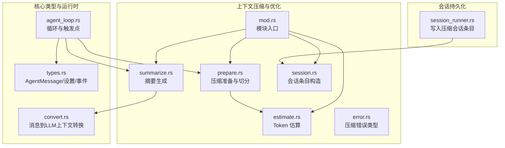
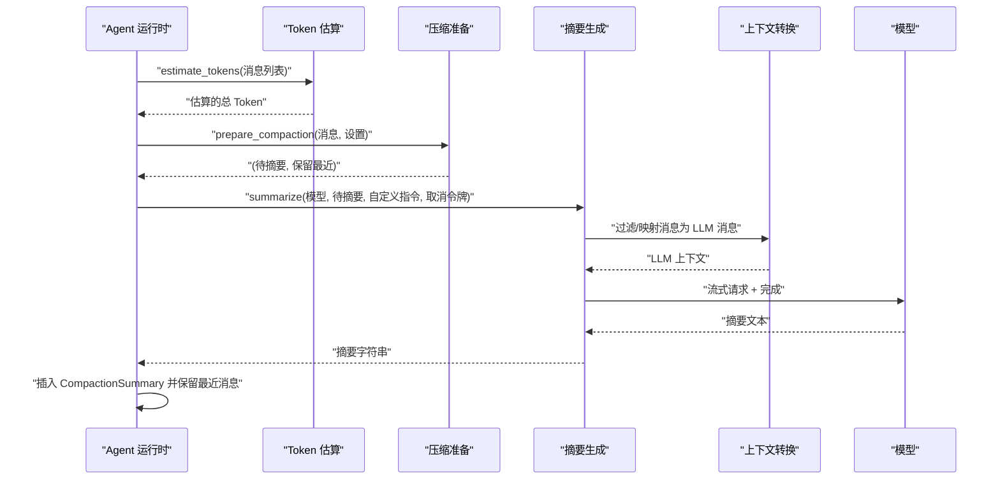
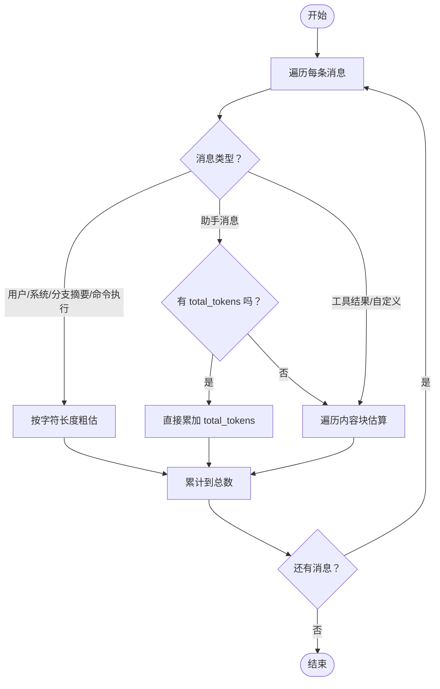
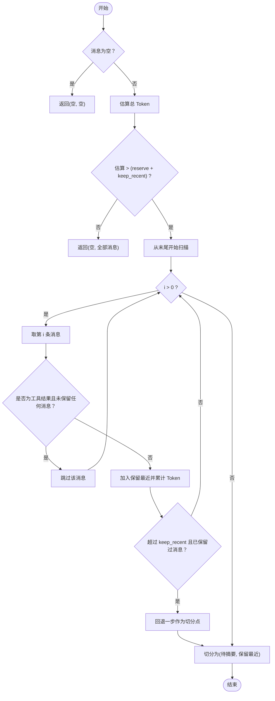
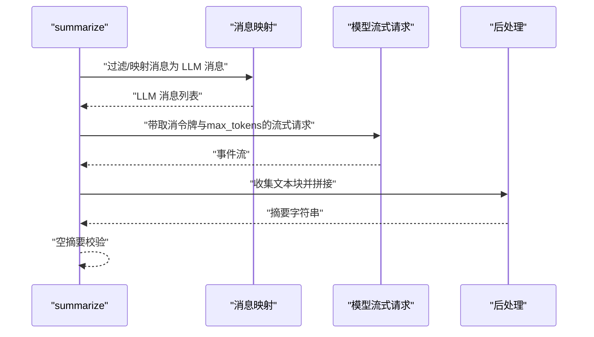
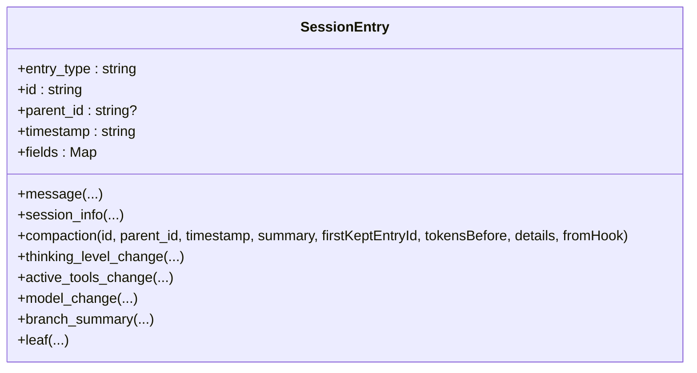
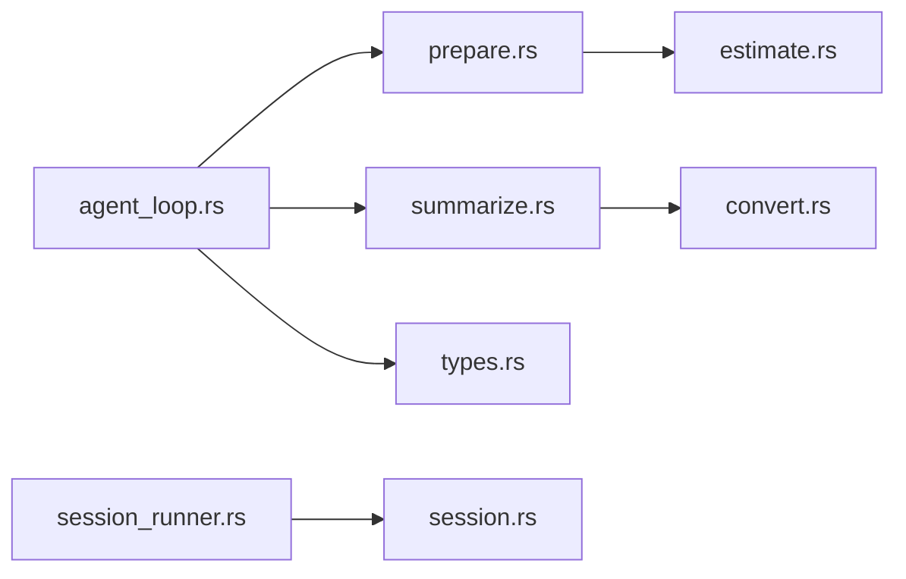

# 上下文压缩与优化

<cite>
**本文引用的文件**
- [crates/pi-agent-core/src/compaction/mod.rs](file://crates/pi-agent-core/src/compaction/mod.rs)
- [crates/pi-agent-core/src/compaction/estimate.rs](file://crates/pi-agent-core/src/compaction/estimate.rs)
- [crates/pi-agent-core/src/compaction/prepare.rs](file://crates/pi-agent-core/src/compaction/prepare.rs)
- [crates/pi-agent-core/src/compaction/summarize.rs](file://crates/pi-agent-core/src/compaction/summarize.rs)
- [crates/pi-agent-core/src/compaction/session.rs](file://crates/pi-agent-core/src/compaction/session.rs)
- [crates/pi-agent-core/src/compaction/error.rs](file://crates/pi-agent-core/src/compaction/error.rs)
- [crates/pi-agent-core/src/types.rs](file://crates/pi-agent-core/src/types.rs)
- [crates/pi-agent-core/src/agent_loop.rs](file://crates/pi-agent-core/src/agent_loop.rs)
- [crates/pi-agent-core/src/convert.rs](file://crates/pi-agent-core/src/convert.rs)
- [crates/pi-agent-core/tests/compaction.rs](file://crates/pi-agent-core/tests/compaction.rs)
- [crates/pi-coding-agent/src/protocol/session_runner.rs](file://crates/pi-coding-agent/src/protocol/session_runner.rs)
</cite>

## 目录
1. [引言](#引言)
2. [项目结构](#项目结构)
3. [核心组件](#核心组件)
4. [架构总览](#架构总览)
5. [详细组件分析](#详细组件分析)
6. [依赖关系分析](#依赖关系分析)
7. [性能考量](#性能考量)
8. [故障排查指南](#故障排查指南)
9. [结论](#结论)
10. [附录：最佳实践与参数调优](#附录最佳实践与参数调优)

## 引言
本技术文档围绕“上下文压缩与优化”子系统展开，目标是帮助读者全面理解在长对话或复杂任务中如何通过压缩历史上下文来维持模型输入长度在上下文窗口内，同时尽可能保持关键信息与推理连续性。文档覆盖以下主题：
- 上下文压缩的必要性与收益
- Token 计量方法与估算策略
- 压缩算法与决策流程（评估、准备、摘要）
- 质量保障与回放策略（保留最近消息、会话记录）
- 配置与参数调优、性能与成本权衡
- 典型用法与错误处理

## 项目结构
上下文压缩与优化功能位于 pi-agent-core 模块的 compaction 子包中，配合类型定义、事件流、转换器与会话记录模块协同工作。



图表来源
- [crates/pi-agent-core/src/compaction/mod.rs:1-6](file://crates/pi-agent-core/src/compaction/mod.rs#L1-L6)
- [crates/pi-agent-core/src/compaction/estimate.rs:1-94](file://crates/pi-agent-core/src/compaction/estimate.rs#L1-L94)
- [crates/pi-agent-core/src/compaction/prepare.rs:1-110](file://crates/pi-agent-core/src/compaction/prepare.rs#L1-L110)
- [crates/pi-agent-core/src/compaction/summarize.rs:1-111](file://crates/pi-agent-core/src/compaction/summarize.rs#L1-L111)
- [crates/pi-agent-core/src/compaction/session.rs:1-139](file://crates/pi-agent-core/src/compaction/session.rs#L1-L139)
- [crates/pi-agent-core/src/compaction/error.rs:1-14](file://crates/pi-agent-core/src/compaction/error.rs#L1-L14)
- [crates/pi-agent-core/src/types.rs:266-298](file://crates/pi-agent-core/src/types.rs#L266-L298)
- [crates/pi-agent-core/src/agent_loop.rs:47-97](file://crates/pi-agent-core/src/agent_loop.rs#L47-L97)
- [crates/pi-agent-core/src/convert.rs:5-89](file://crates/pi-agent-core/src/convert.rs#L5-L89)
- [crates/pi-coding-agent/src/protocol/session_runner.rs:388-402](file://crates/pi-coding-agent/src/protocol/session_runner.rs#L388-L402)

章节来源
- [crates/pi-agent-core/src/compaction/mod.rs:1-6](file://crates/pi-agent-core/src/compaction/mod.rs#L1-L6)
- [crates/pi-agent-core/src/types.rs:266-298](file://crates/pi-agent-core/src/types.rs#L266-L298)

## 核心组件
- Token 估算模块：根据消息类型与内容长度估算 Token 数量，支持文本、工具调用、思考块、图片等。
- 压缩准备模块：基于估算结果与配置阈值决定是否压缩，并进行“保留最近 + 待摘要”的切分，避免孤立工具结果。
- 摘要生成模块：将待摘要的消息集合转换为 LLM 上下文，调用模型生成摘要文本，并进行空摘要校验。
- 错误与事件：统一的压缩错误类型；运行时在请求前自动触发压缩并发出会话事件。
- 类型与会话：定义 AgentMessage、CompactionSettings/Config、SessionEntry 等，用于承载压缩状态与记录。

章节来源
- [crates/pi-agent-core/src/compaction/estimate.rs:4-54](file://crates/pi-agent-core/src/compaction/estimate.rs#L4-L54)
- [crates/pi-agent-core/src/compaction/prepare.rs:4-48](file://crates/pi-agent-core/src/compaction/prepare.rs#L4-L48)
- [crates/pi-agent-core/src/compaction/summarize.rs:6-110](file://crates/pi-agent-core/src/compaction/summarize.rs#L6-L110)
- [crates/pi-agent-core/src/compaction/error.rs:3-13](file://crates/pi-agent-core/src/compaction/error.rs#L3-L13)
- [crates/pi-agent-core/src/types.rs:266-298](file://crates/pi-agent-core/src/types.rs#L266-L298)
- [crates/pi-agent-core/src/compaction/session.rs:4-33](file://crates/pi-agent-core/src/compaction/session.rs#L4-L33)

## 架构总览
压缩流程在每次向模型发起请求前执行，由运行时循环驱动，按如下顺序完成：
- 估算当前上下文 Token
- 决策是否需要压缩
- 切分出“保留最近”与“待摘要”
- 生成摘要并注入一条压缩摘要消息
- 继续后续推理



图表来源
- [crates/pi-agent-core/src/agent_loop.rs:47-97](file://crates/pi-agent-core/src/agent_loop.rs#L47-L97)
- [crates/pi-agent-core/src/compaction/estimate.rs:4-54](file://crates/pi-agent-core/src/compaction/estimate.rs#L4-L54)
- [crates/pi-agent-core/src/compaction/prepare.rs:8-48](file://crates/pi-agent-core/src/compaction/prepare.rs#L8-L48)
- [crates/pi-agent-core/src/compaction/summarize.rs:6-110](file://crates/pi-agent-core/src/compaction/summarize.rs#L6-L110)
- [crates/pi-agent-core/src/convert.rs:5-89](file://crates/pi-agent-core/src/convert.rs#L5-L89)

## 详细组件分析

### 组件一：Token 估算（estimate）
- 设计要点
  - 针对不同 AgentMessage 变体采用差异化估算策略：用户文本、系统提示、分支摘要、命令执行等按字符长度粗估；助手消息优先使用其内部用量；工具结果与自定义消息按内容块聚合估算。
  - 对图片内容采用固定估算值，以简化计算并避免过高的 Token 估计。
- 复杂度与性能
  - 时间复杂度 O(N)，N 为消息数量；空间复杂度 O(1)。
  - 估算逻辑简单，适合高频调用。
- 边界与注意事项
  - 当助手消息携带可用的总用量时直接复用，避免重复计算。
  - 字符到 Token 的换算为近似估算，实际模型可能有差异。



图表来源
- [crates/pi-agent-core/src/compaction/estimate.rs:4-65](file://crates/pi-agent-core/src/compaction/estimate.rs#L4-L65)

章节来源
- [crates/pi-agent-core/src/compaction/estimate.rs:4-54](file://crates/pi-agent-core/src/compaction/estimate.rs#L4-L54)

### 组件二：压缩准备（prepare）
- 设计要点
  - 基于“保留令牌 + 最近保留令牌”阈值判断是否需要压缩。
  - 从尾部向前扫描，优先保留最近消息，避免切分在孤立工具结果处。
  - 返回“待摘要”与“保留最近”两部分，确保后续摘要生成与上下文连续性。
- 决策流程
  - 若估算总 Token 小于等于阈值，不压缩，直接保留全部消息。
  - 否则从末尾回溯，累计保留最近消息，直到超过“最近保留令牌”阈值为止。
  - 切分点前为待摘要，切分点后为保留最近。
- 边界与注意事项
  - 工具结果若出现在最末尾且无其他保留消息，则跳过该结果，防止切分产生孤立工具结果。
  - 切分点回退逻辑确保不会把工具结果单独留在待摘要段落。



图表来源
- [crates/pi-agent-core/src/compaction/prepare.rs:8-48](file://crates/pi-agent-core/src/compaction/prepare.rs#L8-L48)

章节来源
- [crates/pi-agent-core/src/compaction/prepare.rs:4-48](file://crates/pi-agent-core/src/compaction/prepare.rs#L4-L48)

### 组件三：摘要生成（summarize）
- 设计要点
  - 将待摘要消息映射为 LLM 消息（用户、助手、工具结果），并追加一条显式的“请总结以上对话历史”的用户消息。
  - 使用可取消令牌支持中断；限制最大输出 Token 以控制成本与延迟。
  - 收集所有文本块拼接为最终摘要；若为空则报错。
- 数据流
  - 输入：模型、待摘要消息、可选自定义指令、取消令牌。
  - 输出：摘要字符串或压缩错误。
- 质量保障
  - 显式系统提示引导模型聚焦关键点、决策与行动。
  - 过滤非文本块，避免非文本内容污染摘要。



图表来源
- [crates/pi-agent-core/src/compaction/summarize.rs:6-110](file://crates/pi-agent-core/src/compaction/summarize.rs#L6-L110)
- [crates/pi-agent-core/src/convert.rs:5-89](file://crates/pi-agent-core/src/convert.rs#L5-L89)

章节来源
- [crates/pi-agent-core/src/compaction/summarize.rs:6-110](file://crates/pi-agent-core/src/compaction/summarize.rs#L6-L110)

### 组件四：运行时集成与事件（agent_loop）
- 触发点
  - 在每次向模型发起请求前，先尝试压缩。
- 行为
  - 估算 Token → 准备切分 → 摘要 → 插入压缩摘要消息 → 保留最近消息 → 继续推理。
  - 发出“会话被压缩”事件，包含摘要、首个保留消息 ID 与压缩前 Token 数。
- 中断与错误
  - 支持取消令牌；失败时转换为字符串错误并上抛。

```mermaid
sequenceDiagram
participant Loop as "运行时循环"
participant Est as "估算"
participant Prep as "准备"
participant Sum as "摘要"
participant Ev as "事件"
Loop->>Est : "estimate_tokens"
Est-->>Loop : "总 Token"
Loop->>Prep : "prepare_compaction"
Prep-->>Loop : "(待摘要, 保留最近)"
Loop->>Sum : "summarize"
Sum-->>Loop : "摘要"
Loop->>Loop : "插入 CompactionSummary + 保留最近"
Loop->>Ev : "SessionCompacted 事件"
```

图表来源
- [crates/pi-agent-core/src/agent_loop.rs:47-97](file://crates/pi-agent-core/src/agent_loop.rs#L47-L97)

章节来源
- [crates/pi-agent-core/src/agent_loop.rs:47-97](file://crates/pi-agent-core/src/agent_loop.rs#L47-L97)

### 组件五：会话记录（session）
- 功能
  - 提供多种会话条目构造函数，包括压缩条目、思维级别变更、工具变更、模型变更、分支摘要、叶子节点等。
  - 压缩条目包含摘要、首个保留消息 ID、压缩前 Token 数、详情与来源标记。
- 用途
  - 在会话存储中记录压缩动作，便于审计与回放。



图表来源
- [crates/pi-agent-core/src/compaction/session.rs:4-138](file://crates/pi-agent-core/src/compaction/session.rs#L4-L138)

章节来源
- [crates/pi-agent-core/src/compaction/session.rs:4-138](file://crates/pi-agent-core/src/compaction/session.rs#L4-L138)

## 依赖关系分析
- 模块内聚
  - compaction 子模块内部职责清晰：估算、准备、摘要、错误、会话记录各司其职，耦合度低。
- 外部依赖
  - 摘要生成依赖 pi_ai 的模型流式接口与上下文构建。
  - 运行时依赖取消令牌与事件系统。
- 关键依赖链
  - agent_loop → prepare → estimate → summarize → convert → pi_ai
  - session_runner → session::compaction



图表来源
- [crates/pi-agent-core/src/agent_loop.rs:8-23](file://crates/pi-agent-core/src/agent_loop.rs#L8-L23)
- [crates/pi-agent-core/src/compaction/prepare.rs:1-2](file://crates/pi-agent-core/src/compaction/prepare.rs#L1-L2)
- [crates/pi-agent-core/src/compaction/estimate.rs:1-2](file://crates/pi-agent-core/src/compaction/estimate.rs#L1-L2)
- [crates/pi-agent-core/src/compaction/summarize.rs:3](file://crates/pi-agent-core/src/compaction/summarize.rs#L3)
- [crates/pi-agent-core/src/convert.rs:3](file://crates/pi-agent-core/src/convert.rs#L3)
- [crates/pi-coding-agent/src/protocol/session_runner.rs:391](file://crates/pi-coding-agent/src/protocol/session_runner.rs#L391)

章节来源
- [crates/pi-agent-core/src/agent_loop.rs:8-23](file://crates/pi-agent-core/src/agent_loop.rs#L8-L23)
- [crates/pi-coding-agent/src/protocol/session_runner.rs:388-402](file://crates/pi-coding-agent/src/protocol/session_runner.rs#L388-L402)

## 性能考量
- 估算开销
  - 估算为线性复杂度，适合高频调用；字符到 Token 的换算为近似值，建议结合实际模型用量微调。
- 压缩频率
  - 在每次请求前执行压缩，避免上下文溢出；可通过增大 reserve_tokens 与 keep_recent_tokens 降低压缩频率但增加内存占用。
- 摘要成本
  - 通过 max_tokens 限制摘要长度；自定义系统提示可提升摘要质量但可能增加 Token 消耗。
- 取消与中断
  - 使用取消令牌避免长时间摘要阻塞；在高并发或多轮压缩场景尤为重要。

## 故障排查指南
- 常见错误
  - 摘要为空：检查输入消息是否有效、模型是否正常响应、max_tokens 是否过小。
  - 压缩被中止：确认取消令牌状态；检查外部中断信号。
  - 无效会话：核对会话条目字段与类型一致性。
- 排查步骤
  - 打印压缩前后的 Token 数与切分点，验证阈值设置。
  - 检查摘要生成的系统提示与输入消息映射是否正确。
  - 查看事件流中的 SessionCompacted 事件，确认摘要与保留消息是否符合预期。

章节来源
- [crates/pi-agent-core/src/compaction/error.rs:3-13](file://crates/pi-agent-core/src/compaction/error.rs#L3-L13)
- [crates/pi-agent-core/tests/compaction.rs:133-179](file://crates/pi-agent-core/tests/compaction.rs#L133-L179)

## 结论
该上下文压缩与优化系统通过“估算—准备—摘要—保留”的闭环，在不显著影响推理质量的前提下，有效控制了上下文长度，提升了长期对话与多轮任务的稳定性与成本效率。其模块化设计便于扩展与维护，配合会话记录与事件系统，提供了良好的可观测性与可审计性。

## 附录：最佳实践与参数调优
- 参数设置
  - reserve_tokens：为未来一轮交互预留的 Token，建议根据模型 max_tokens 与典型单轮增量设置。
  - keep_recent_tokens：最近保留消息的 Token 预留，建议较大以保证上下文连续性。
  - custom_instructions：针对摘要任务定制系统提示，强调关键点、决策与行动。
- 性能与成本权衡
  - 增大 reserve_tokens 与 keep_recent_tokens 可减少压缩频率，但会提高峰值内存与 Token 消耗。
  - 适当降低 max_tokens 或缩短摘要长度可显著降低成本，但需平衡信息完整性。
- 质量保障
  - 保留最近消息避免“断章取义”，确保模型能回看最新上下文。
  - 使用取消令牌避免长时间摘要阻塞，提升整体吞吐。
- 配置示例参考
  - 默认设置：启用压缩、较大的最近保留与预留，适用于大多数场景。
  - 高成本敏感：减小 keep_recent_tokens 与 max_tokens，提高压缩频率。
  - 高质量优先：增大 keep_recent_tokens 与 max_tokens，降低压缩频率。

章节来源
- [crates/pi-agent-core/src/types.rs:266-298](file://crates/pi-agent-core/src/types.rs#L266-L298)
- [crates/pi-agent-core/src/compaction/summarize.rs:85-87](file://crates/pi-agent-core/src/compaction/summarize.rs#L85-L87)
- [crates/pi-agent-core/tests/compaction.rs:133-179](file://crates/pi-agent-core/tests/compaction.rs#L133-L179)