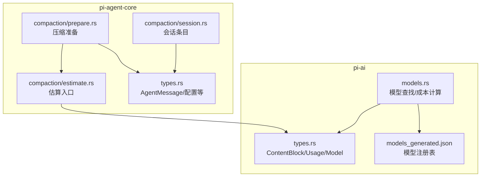
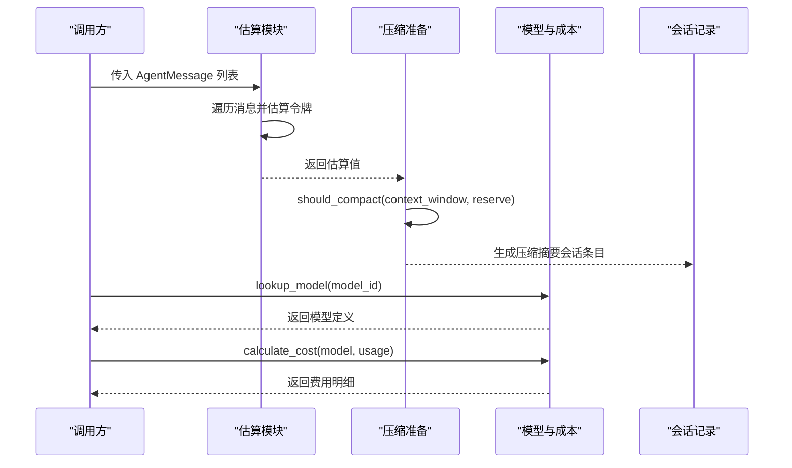
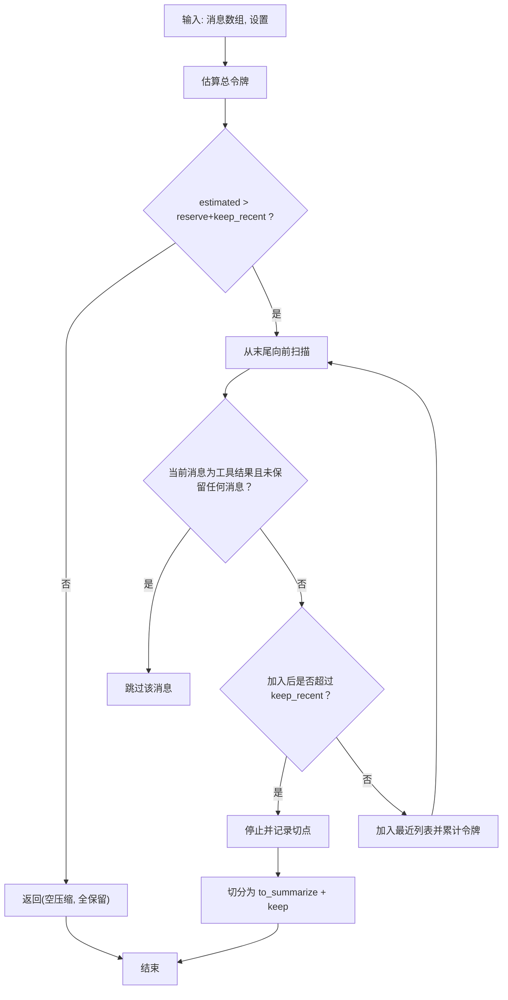
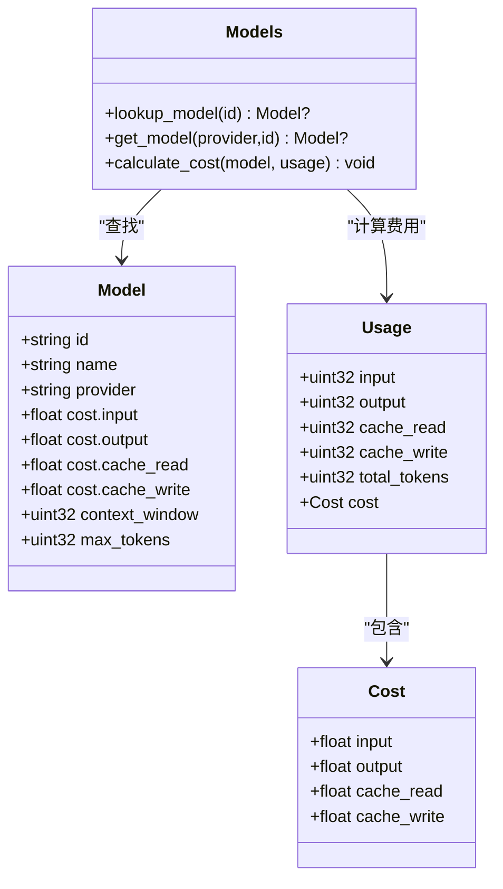
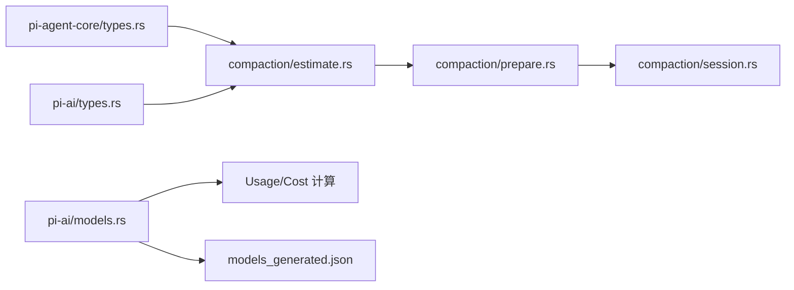

# 令牌估算与计量

<cite>
**本文引用的文件**
- [crates/pi-agent-core/src/compaction/estimate.rs](file://crates/pi-agent-core/src/compaction/estimate.rs)
- [crates/pi-agent-core/src/compaction/prepare.rs](file://crates/pi-agent-core/src/compaction/prepare.rs)
- [crates/pi-agent-core/src/compaction/session.rs](file://crates/pi-agent-core/src/compaction/session.rs)
- [crates/pi-agent-core/src/types.rs](file://crates/pi-agent-core/src/types.rs)
- [crates/pi-ai/src/models.rs](file://crates/pi-ai/src/models.rs)
- [crates/pi-ai/src/types.rs](file://crates/pi-ai/src/types.rs)
- [crates/pi-ai/src/models_generated.json](file://crates/pi-ai/src/models_generated.json)
- [crates/pi-agent-core/tests/compaction.rs](file://crates/pi-agent-core/tests/compaction.rs)
- [crates/pi-ai/tests/cost.rs](file://crates/pi-ai/tests/cost.rs)
- [crates/pi-coding-agent/src/list_models.rs](file://crates/pi-coding-agent/src/list_models.rs)
</cite>

## 目录
1. [简介](#简介)
2. [项目结构](#项目结构)
3. [核心组件](#核心组件)
4. [架构总览](#架构总览)
5. [详细组件分析](#详细组件分析)
6. [依赖关系分析](#依赖关系分析)
7. [性能考量](#性能考量)
8. [故障排查指南](#故障排查指南)
9. [结论](#结论)
10. [附录](#附录)

## 简介
本文件面向“令牌估算与计量”子系统，系统性阐述以下内容：
- Token 计算原理与实现：基于字符长度的启发式估算、内容块（文本/工具调用/思考/图像）的拆分与加权、助手消息已知用量优先策略。
- 准确性保障：边界情况处理（空消息、图像固定开销、工具调用参数序列化长度）、多语言文本支持（按字节长度估算，不区分字符集）。
- 缓存与性能：估算与准备阶段的线性复杂度、避免重复计算、保留最近上下文以减少重算。
- 成本计算：模型注册表、按模型费率计算输入/输出/缓存读写成本，支持百万级计费单位。
- 使用示例与常见问题：在会话压缩流程中的集成方式、典型错误与解决建议。

## 项目结构
围绕令牌估算与计量的关键模块分布于两个 crate：
- pi-agent-core：负责消息类型、估算与压缩准备逻辑。
- pi-ai：负责模型注册表、成本计算、通用数据类型（内容块、用量、模型定义）。



图表来源
- [crates/pi-agent-core/src/compaction/estimate.rs:1-94](file://crates/pi-agent-core/src/compaction/estimate.rs#L1-L94)
- [crates/pi-agent-core/src/compaction/prepare.rs:1-110](file://crates/pi-agent-core/src/compaction/prepare.rs#L1-L110)
- [crates/pi-agent-core/src/types.rs:300-353](file://crates/pi-agent-core/src/types.rs#L300-L353)
- [crates/pi-agent-core/src/compaction/session.rs:1-139](file://crates/pi-agent-core/src/compaction/session.rs#L1-L139)
- [crates/pi-ai/src/models.rs:1-110](file://crates/pi-ai/src/models.rs#L1-L110)
- [crates/pi-ai/src/types.rs:9-301](file://crates/pi-ai/src/types.rs#L9-L301)
- [crates/pi-ai/src/models_generated.json:1-21377](file://crates/pi-ai/src/models_generated.json#L1-L21377)

章节来源
- [crates/pi-agent-core/src/compaction/estimate.rs:1-94](file://crates/pi-agent-core/src/compaction/estimate.rs#L1-L94)
- [crates/pi-agent-core/src/compaction/prepare.rs:1-110](file://crates/pi-agent-core/src/compaction/prepare.rs#L1-L110)
- [crates/pi-agent-core/src/types.rs:300-353](file://crates/pi-agent-core/src/types.rs#L300-L353)
- [crates/pi-ai/src/models.rs:1-110](file://crates/pi-ai/src/models.rs#L1-L110)
- [crates/pi-ai/src/types.rs:9-301](file://crates/pi-ai/src/types.rs#L9-L301)
- [crates/pi-ai/src/models_generated.json:1-21377](file://crates/pi-ai/src/models_generated.json#L1-L21377)

## 核心组件
- 令牌估算函数：对用户文本、系统提示、压缩摘要、分支摘要、命令执行（非排除项）等按字符长度估算；对助手消息优先采用其已报告的总用量，否则逐内容块估算。
- 内容块估算：文本/思考按字符长度/4；工具调用按名称长度与参数字符串长度之和/4；图像固定开销（约 1200 令牌）。
- 压缩准备：根据上下文窗口与保留策略判断是否需要压缩，并从历史中保留最近若干令牌的消息，避免切分到孤立工具结果。
- 模型与成本：通过静态注册表查找模型，按模型费率（每百万令牌）计算输入/输出/缓存读写成本。
- 类型体系：统一的内容块、消息、用量与模型结构，确保跨模块一致的数据契约。

章节来源
- [crates/pi-agent-core/src/compaction/estimate.rs:4-65](file://crates/pi-agent-core/src/compaction/estimate.rs#L4-L65)
- [crates/pi-agent-core/src/compaction/prepare.rs:4-48](file://crates/pi-agent-core/src/compaction/prepare.rs#L4-L48)
- [crates/pi-ai/src/models.rs:47-54](file://crates/pi-ai/src/models.rs#L47-L54)
- [crates/pi-ai/src/types.rs:9-301](file://crates/pi-ai/src/types.rs#L9-L301)

## 架构总览
下图展示了从消息集合到估算、再到压缩决策与成本计算的整体流程。



图表来源
- [crates/pi-agent-core/src/compaction/estimate.rs:4-54](file://crates/pi-agent-core/src/compaction/estimate.rs#L4-L54)
- [crates/pi-agent-core/src/compaction/prepare.rs:4-48](file://crates/pi-agent-core/src/compaction/prepare.rs#L4-L48)
- [crates/pi-ai/src/models.rs:47-54](file://crates/pi-ai/src/models.rs#L47-L54)
- [crates/pi-agent-core/src/compaction/session.rs:4-33](file://crates/pi-agent-core/src/compaction/session.rs#L4-L33)

## 详细组件分析

### 令牌估算模块（estimate）
- 输入：AgentMessage 列表（含用户文本、系统提示、助手消息、工具结果、自定义、分支摘要、Bash 执行等）。
- 估算规则：
  - 用户文本/系统提示/压缩摘要/分支摘要：按字符长度/4。
  - 助手消息：若已报告 total_tokens，则直接累加；否则按内容块估算。
  - 工具结果：按内容块估算。
  - Bash 执行：仅当未标记排除时，累加命令与输出的字符长度/4。
  - 内容块估算：
    - 文本/思考：长度/4。
    - 工具调用：name 长度/4 + 参数字符串长度/4。
    - 图像：固定开销（约 1200 令牌）。
- 边界与准确性：
  - 若助手消息已有 total_tokens，优先使用该值，避免重复估算。
  - 图像固定开销用于覆盖视觉输入的典型占用。
  - 字符长度估算适用于多语言文本，但不考虑具体编码细节（UTF-8/GBK 等），属于近似估算。

```mermaid
flowchart TD
Start(["开始"]) --> Loop["遍历消息列表"]
Loop --> MsgType{"消息类型？"}
MsgType --> |用户文本/系统提示/摘要| CharEst["字符长度/4 累加"]
MsgType --> |助手消息| HasUsage{"usage.total_tokens>0？"}
HasUsage --> |是| UseUsage["直接累加 usage.total_tokens"]
HasUsage --> |否| BlockEst["逐内容块估算"]
MsgType --> |工具结果/Bash执行(非排除)| Acc["累加对应长度/4"]
MsgType --> |自定义/分支摘要| CharEst
BlockEst --> CBType{"内容块类型？"}
CBType --> |文本/思考| CBLen["长度/4"]
CBType --> |工具调用| ToolLen["name+len + 参数串长/4"]
CBType --> |图像| ImgFix["固定开销≈1200"]
CBLen --> Sum["累计总令牌"]
ToolLen --> Sum
ImgFix --> Sum
UseUsage --> Sum
Acc --> Sum
CharEst --> Sum
Sum --> End(["结束"])
```

图表来源
- [crates/pi-agent-core/src/compaction/estimate.rs:4-65](file://crates/pi-agent-core/src/compaction/estimate.rs#L4-L65)

章节来源
- [crates/pi-agent-core/src/compaction/estimate.rs:4-65](file://crates/pi-agent-core/src/compaction/estimate.rs#L4-L65)

### 压缩准备模块（prepare）
- 目标：在达到上下文窗口阈值前，决定是否进行压缩，并保留最近若干令牌的消息，避免切分到孤立工具结果。
- 关键逻辑：
  - should_compact：当估算令牌数超过 context_window - reserve_tokens 时触发压缩。
  - prepare_compaction：从尾部向前扫描，累计保留最近 keep_recent_tokens 的消息；遇到工具结果且尚未保留任何消息时跳过，防止切分孤立工具结果。
- 复杂度：线性扫描，时间复杂度 O(n)，空间开销小。



图表来源
- [crates/pi-agent-core/src/compaction/prepare.rs:4-48](file://crates/pi-agent-core/src/compaction/prepare.rs#L4-L48)

章节来源
- [crates/pi-agent-core/src/compaction/prepare.rs:4-48](file://crates/pi-agent-core/src/compaction/prepare.rs#L4-L48)

### 会话条目与事件（session）
- 会话条目用于记录压缩摘要、思维级别变更、活跃工具变更、模型变更、分支摘要、叶子节点等。
- 提供构造器，将字段序列化为统一格式，便于持久化与回放。

章节来源
- [crates/pi-agent-core/src/compaction/session.rs:4-139](file://crates/pi-agent-core/src/compaction/session.rs#L4-L139)

### 模型与成本（models）
- 模型注册表：静态加载 models_generated.json，提供按 id/provider 查找模型的能力。
- 成本计算：按每百万令牌计价，分别计算输入、输出、缓存读写费用，并更新到 Usage.cost 中。
- 测试验证：覆盖基础计费、带缓存读写的计费、零用量零费用等场景。



图表来源
- [crates/pi-ai/src/models.rs:39-54](file://crates/pi-ai/src/models.rs#L39-L54)
- [crates/pi-ai/src/types.rs:65-86](file://crates/pi-ai/src/types.rs#L65-L86)
- [crates/pi-ai/src/types.rs:264-301](file://crates/pi-ai/src/types.rs#L264-L301)

章节来源
- [crates/pi-ai/src/models.rs:39-54](file://crates/pi-ai/src/models.rs#L39-L54)
- [crates/pi-ai/src/types.rs:65-86](file://crates/pi-ai/src/types.rs#L65-L86)
- [crates/pi-ai/src/types.rs:264-301](file://crates/pi-ai/src/types.rs#L264-L301)

### 数据类型与消息契约（types）
- AgentMessage：统一承载用户文本、系统提示、助手消息、工具结果、自定义、分支摘要、Bash 执行等。
- ContentBlock：文本、思考、图像、工具调用四类内容块，支撑多模态消息。
- Usage/Cost：用量与费用结构，支持总令牌与分项费用统计。

章节来源
- [crates/pi-agent-core/src/types.rs:300-353](file://crates/pi-agent-core/src/types.rs#L300-L353)
- [crates/pi-ai/src/types.rs:9-40](file://crates/pi-ai/src/types.rs#L9-L40)
- [crates/pi-ai/src/types.rs:65-86](file://crates/pi-ai/src/types.rs#L65-L86)

## 依赖关系分析
- 估算模块依赖内容块类型（ContentBlock）与 AgentMessage 变体，以实现多类型消息的统一估算。
- 压缩准备模块依赖估算模块与压缩设置（保留令牌、保留最近令牌），并输出切分后的消息集合。
- 成本计算模块依赖模型注册表与用量结构，提供费用汇总。
- 会话模块依赖 AgentMessage 类型，用于记录压缩摘要等事件。



图表来源
- [crates/pi-agent-core/src/types.rs:300-353](file://crates/pi-agent-core/src/types.rs#L300-L353)
- [crates/pi-ai/src/types.rs:9-301](file://crates/pi-ai/src/types.rs#L9-L301)
- [crates/pi-agent-core/src/compaction/estimate.rs:1-3](file://crates/pi-agent-core/src/compaction/estimate.rs#L1-L3)
- [crates/pi-agent-core/src/compaction/prepare.rs:1-2](file://crates/pi-agent-core/src/compaction/prepare.rs#L1-L2)
- [crates/pi-ai/src/models.rs:1-110](file://crates/pi-ai/src/models.rs#L1-L110)
- [crates/pi-ai/src/models_generated.json:1-21377](file://crates/pi-ai/src/models_generated.json#L1-L21377)

章节来源
- [crates/pi-agent-core/src/compaction/estimate.rs:1-3](file://crates/pi-agent-core/src/compaction/estimate.rs#L1-L3)
- [crates/pi-agent-core/src/compaction/prepare.rs:1-2](file://crates/pi-agent-core/src/compaction/prepare.rs#L1-L2)
- [crates/pi-ai/src/models.rs:1-110](file://crates/pi-ai/src/models.rs#L1-L110)

## 性能考量
- 时间复杂度：估算与准备均为线性扫描，适合大规模对话历史的快速评估。
- 空间复杂度：仅在保留最近消息时产生少量额外内存，整体低开销。
- 估算精度：字符长度/4 为近似估算，适合运行期快速预算；如需更高精度，可结合具体模型的分词器进行二次校准。
- 成本计算：按百万令牌计价，避免浮点误差累积，适合批量统计与报表生成。

## 故障排查指南
- 估算结果偏高/偏低
  - 检查是否正确识别图像内容块（图像固定开销较高）。
  - 确认助手消息是否已提供 total_tokens，避免重复估算。
  - 对于工具调用，确认参数序列化长度是否计入。
- 压缩未触发或误触发
  - 核对上下文窗口与保留令牌设置，确保 should_compact 条件合理。
  - 检查是否意外将工具结果作为切分点，导致孤立工具结果被截断。
- 成本计算异常
  - 确认模型 id 正确，lookup_model 能命中目标模型。
  - 检查 Usage 的各项输入/输出/缓存读写是否为非负整数。
- 单元测试参考
  - 估算与压缩准备：[crates/pi-agent-core/tests/compaction.rs:43-180](file://crates/pi-agent-core/tests/compaction.rs#L43-L180)
  - 成本计算：[crates/pi-ai/tests/cost.rs:1-43](file://crates/pi-ai/tests/cost.rs#L1-L43)

章节来源
- [crates/pi-agent-core/tests/compaction.rs:43-180](file://crates/pi-agent-core/tests/compaction.rs#L43-L180)
- [crates/pi-ai/tests/cost.rs:1-43](file://crates/pi-ai/tests/cost.rs#L1-L43)

## 结论
本系统通过简单高效的字符长度估算与内容块拆分，实现了对多模态消息的快速令牌预算；配合上下文窗口与保留策略，能够在接近实时的交互中完成会话压缩；通过模型注册表与成本计算模块，将令牌用量转化为可审计的成本指标。对于更高精度的需求，可在现有基础上引入模型特定分词器进行校准。

## 附录

### 不同模型的令牌配额与成本概览
- 上下文窗口与最大输出令牌：各模型在注册表中定义，可用于估算可用上下文余量。
- 成本结构：输入/输出/缓存读写均以每百万令牌为单位定价，适合批量计费与预算控制。
- CLI 展示：提供千/百万级令牌格式化显示，便于直观查看。

章节来源
- [crates/pi-ai/src/models_generated.json:1-21377](file://crates/pi-ai/src/models_generated.json#L1-L21377)
- [crates/pi-ai/src/models.rs:47-54](file://crates/pi-ai/src/models.rs#L47-L54)
- [crates/pi-coding-agent/src/list_models.rs:132-164](file://crates/pi-coding-agent/src/list_models.rs#L132-L164)