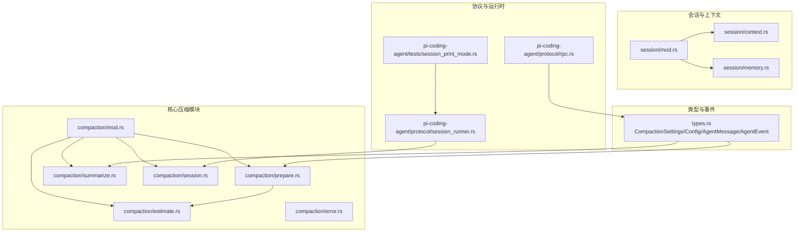
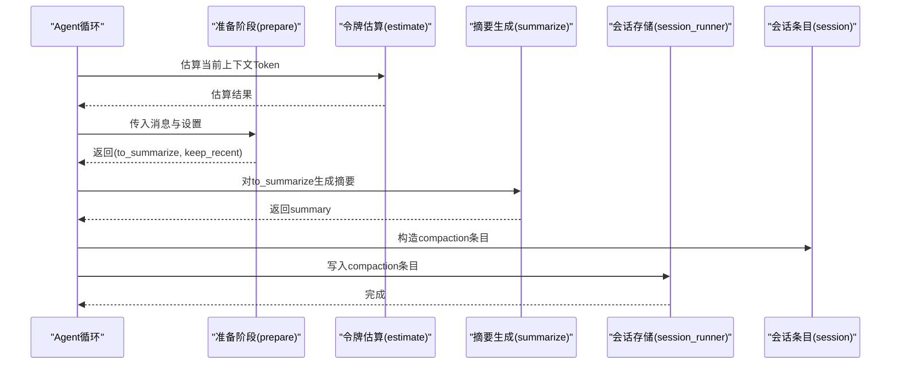
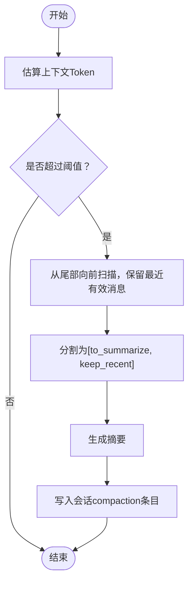
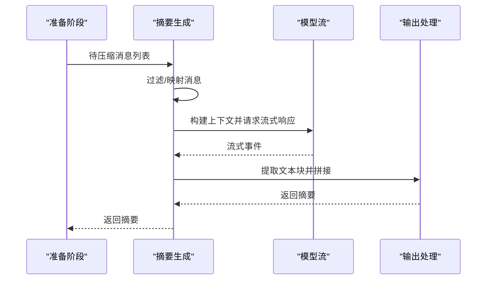
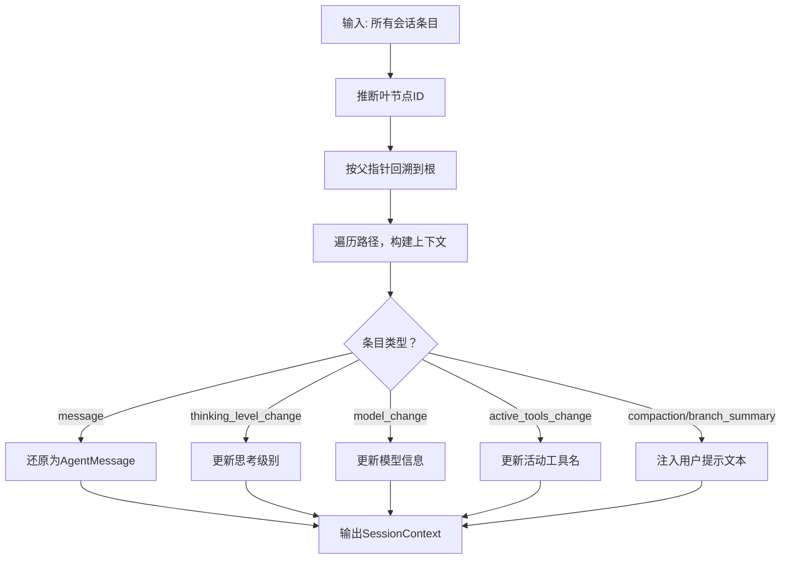
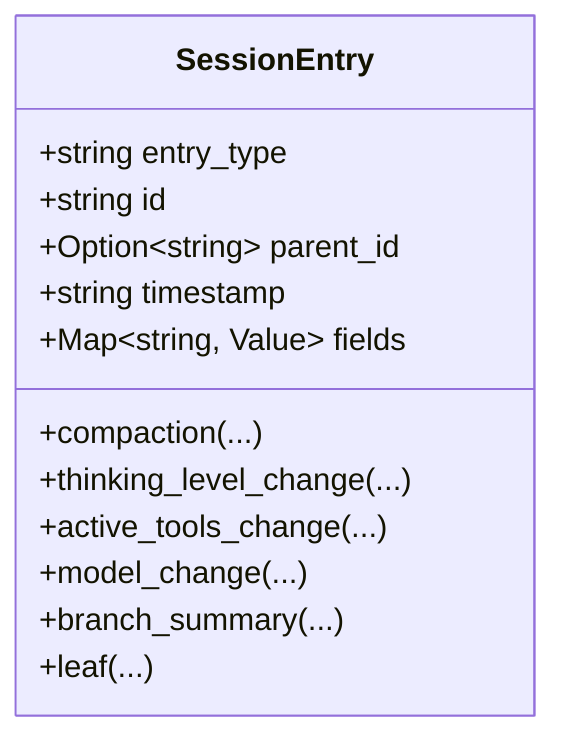
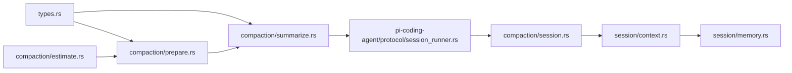

# 会话级压缩管理

<cite>
**本文引用的文件**
- [crates/pi-agent-core/src/compaction/mod.rs](file://crates/pi-agent-core/src/compaction/mod.rs)
- [crates/pi-agent-core/src/compaction/prepare.rs](file://crates/pi-agent-core/src/compaction/prepare.rs)
- [crates/pi-agent-core/src/compaction/estimate.rs](file://crates/pi-agent-core/src/compaction/estimate.rs)
- [crates/pi-agent-core/src/compaction/summarize.rs](file://crates/pi-agent-core/src/compaction/summarize.rs)
- [crates/pi-agent-core/src/compaction/error.rs](file://crates/pi-agent-core/src/compaction/error.rs)
- [crates/pi-agent-core/src/compaction/session.rs](file://crates/pi-agent-core/src/compaction/session.rs)
- [crates/pi-agent-core/src/types.rs](file://crates/pi-agent-core/src/types.rs)
- [crates/pi-agent-core/src/session/context.rs](file://crates/pi-agent-core/src/session/context.rs)
- [crates/pi-agent-core/src/session/memory.rs](file://crates/pi-agent-core/src/session/memory.rs)
- [crates/pi-agent-core/src/session/mod.rs](file://crates/pi-agent-core/src/session/mod.rs)
- [crates/pi-coding-agent/src/protocol/session_runner.rs](file://crates/pi-coding-agent/src/protocol/session_runner.rs)
- [crates/pi-coding-agent/src/protocol/rpc.rs](file://crates/pi-coding-agent/src/protocol/rpc.rs)
- [crates/pi-coding-agent/tests/session_print_mode.rs](file://crates/pi-coding-agent/tests/session_print_mode.rs)
</cite>

## 目录
1. [引言](#引言)
2. [项目结构](#项目结构)
3. [核心组件](#核心组件)
4. [架构总览](#架构总览)
5. [详细组件分析](#详细组件分析)
6. [依赖关系分析](#依赖关系分析)
7. [性能考量](#性能考量)
8. [故障排查指南](#故障排查指南)
9. [结论](#结论)
10. [附录](#附录)

## 引言
本技术文档围绕“会话级压缩管理”展开，系统性阐述在会话生命周期内如何进行上下文压缩与归档，确保在不丢失关键信息的前提下降低上下文长度，从而提升推理效率并控制成本。内容涵盖：
- 会话边界识别与路径回溯
- 跨轮次上下文管理与状态保持
- 触发条件与时机选择（Token 阈值、保留策略）
- 压缩过程的准备、估算、摘要生成与落盘
- 用户体验保护（压缩透明度、可选与可撤销）
- 多会话并发压缩的协调与资源竞争规避
- 配置项与性能调优建议
- 实际应用场景与测试验证

## 项目结构
与会话压缩直接相关的模块主要位于 pi-agent-core 的 compaction 子模块与 session 子模块，并由编码代理（pi-coding-agent）在协议层驱动压缩入口与持久化。

图示来源
- [crates/pi-agent-core/src/compaction/mod.rs:1-6](file://crates/pi-agent-core/src/compaction/mod.rs#L1-L6)
- [crates/pi-agent-core/src/compaction/prepare.rs:1-110](file://crates/pi-agent-core/src/compaction/prepare.rs#L1-L110)
- [crates/pi-agent-core/src/compaction/estimate.rs:1-94](file://crates/pi-agent-core/src/compaction/estimate.rs#L1-L94)
- [crates/pi-agent-core/src/compaction/summarize.rs:1-111](file://crates/pi-agent-core/src/compaction/summarize.rs#L1-L111)
- [crates/pi-agent-core/src/compaction/session.rs:1-139](file://crates/pi-agent-core/src/compaction/session.rs#L1-L139)
- [crates/pi-agent-core/src/types.rs:266-298](file://crates/pi-agent-core/src/types.rs#L266-L298)
- [crates/pi-agent-core/src/session/mod.rs:1-20](file://crates/pi-agent-core/src/session/mod.rs#L1-L20)
- [crates/pi-agent-core/src/session/context.rs:1-496](file://crates/pi-agent-core/src/session/context.rs#L1-L496)
- [crates/pi-agent-core/src/session/memory.rs:1-126](file://crates/pi-agent-core/src/session/memory.rs#L1-L126)
- [crates/pi-coding-agent/src/protocol/session_runner.rs:361-402](file://crates/pi-coding-agent/src/protocol/session_runner.rs#L361-L402)
- [crates/pi-coding-agent/src/protocol/rpc.rs:266-299](file://crates/pi-coding-agent/src/protocol/rpc.rs#L266-L299)
- [crates/pi-coding-agent/tests/session_print_mode.rs:185-222](file://crates/pi-coding-agent/tests/session_print_mode.rs#L185-L222)

章节来源
- [crates/pi-agent-core/src/compaction/mod.rs:1-6](file://crates/pi-agent-core/src/compaction/mod.rs#L1-L6)
- [crates/pi-agent-core/src/session/mod.rs:1-20](file://crates/pi-agent-core/src/session/mod.rs#L1-L20)

## 核心组件
- 压缩设置与配置：定义是否启用自动压缩、保留 Token 数与最近保留 Token 数，以及自定义指令。
- 令牌估算：基于消息内容与块类型估算 Token 数量，支持系统提示、用户文本、助手回复、工具结果、分支摘要等。
- 准备阶段：根据估算结果与保留策略，确定需要压缩的历史消息集合与最近保留的消息集合，避免切分孤儿工具结果。
- 摘要生成：将待压缩消息转换为 LLM 上下文，调用模型生成压缩摘要。
- 会话条目：将压缩结果写入会话日志，包含摘要、首个保留条目的 ID、压缩前 Token 数、是否来自钩子等元数据。
- 事件与类型：暴露压缩完成事件，便于上层感知压缩结果；定义 AgentMessage 枚举以承载不同类型的对话消息。
- 会话上下文构建：从会话条目中解析出线性路径，注入思考级别、模型变更、活动工具、压缩摘要与分支摘要等上下文信息。

章节来源
- [crates/pi-agent-core/src/types.rs:266-298](file://crates/pi-agent-core/src/types.rs#L266-L298)
- [crates/pi-agent-core/src/compaction/estimate.rs:1-94](file://crates/pi-agent-core/src/compaction/estimate.rs#L1-L94)
- [crates/pi-agent-core/src/compaction/prepare.rs:1-110](file://crates/pi-agent-core/src/compaction/prepare.rs#L1-L110)
- [crates/pi-agent-core/src/compaction/summarize.rs:1-111](file://crates/pi-agent-core/src/compaction/summarize.rs#L1-L111)
- [crates/pi-agent-core/src/compaction/session.rs:1-139](file://crates/pi-agent-core/src/compaction/session.rs#L1-L139)
- [crates/pi-agent-core/src/types.rs:485-491](file://crates/pi-agent-core/src/types.rs#L485-L491)
- [crates/pi-agent-core/src/session/context.rs:194-274](file://crates/pi-agent-core/src/session/context.rs#L194-L274)

## 架构总览
下图展示从消息收集到压缩落盘的关键流程，包括触发判断、准备、摘要生成与会话条目写入。

图示来源
- [crates/pi-agent-core/src/compaction/prepare.rs:8-48](file://crates/pi-agent-core/src/compaction/prepare.rs#L8-L48)
- [crates/pi-agent-core/src/compaction/estimate.rs:4-54](file://crates/pi-agent-core/src/compaction/estimate.rs#L4-L54)
- [crates/pi-agent-core/src/compaction/summarize.rs:6-110](file://crates/pi-agent-core/src/compaction/summarize.rs#L6-L110)
- [crates/pi-coding-agent/src/protocol/session_runner.rs:388-402](file://crates/pi-coding-agent/src/protocol/session_runner.rs#L388-L402)
- [crates/pi-agent-core/src/compaction/session.rs:4-33](file://crates/pi-agent-core/src/compaction/session.rs#L4-L33)

## 详细组件分析

### 组件A：压缩触发与时机选择
- 触发条件
  - 估算总 Token 数超过“保留 Token + 最近保留 Token”的阈值时触发压缩。
  - 当前实现通过比较 estimated_tokens 与 context_window - reserve_tokens 判断是否需要压缩。
- 时机选择
  - 在每轮对话后或达到一定上下文长度时评估。
  - 保留策略优先保证最近交互（如用户消息、工具结果）不被切分，避免逻辑断层。
- 用户行为分析
  - 通过“最近保留”策略隐式反映用户关注点，减少对近期高价值内容的压缩。

图示来源
- [crates/pi-agent-core/src/compaction/prepare.rs:4-48](file://crates/pi-agent-core/src/compaction/prepare.rs#L4-L48)
- [crates/pi-agent-core/src/compaction/estimate.rs:4-54](file://crates/pi-agent-core/src/compaction/estimate.rs#L4-L54)

章节来源
- [crates/pi-agent-core/src/compaction/prepare.rs:1-110](file://crates/pi-agent-core/src/compaction/prepare.rs#L1-L110)
- [crates/pi-agent-core/src/compaction/estimate.rs:1-94](file://crates/pi-agent-core/src/compaction/estimate.rs#L1-L94)

### 组件B：摘要生成与LLM集成
- 输入转换：将 AgentMessage 映射为 LLM Message，过滤掉不应进入上下文的内容（如系统提示、排除标记的 Bash 执行等），并在末尾追加“请总结以上对话历史”的引导语。
- 输出处理：提取文本块拼接为最终摘要；若为空则返回错误。
- 取消与超时：支持 CancellationToken，便于外部中断长耗时摘要任务。
- 成本与长度：默认限制最大输出长度，平衡质量与成本。

图示来源
- [crates/pi-agent-core/src/compaction/summarize.rs:6-110](file://crates/pi-agent-core/src/compaction/summarize.rs#L6-L110)

章节来源
- [crates/pi-agent-core/src/compaction/summarize.rs:1-111](file://crates/pi-agent-core/src/compaction/summarize.rs#L1-L111)

### 组件C：会话边界识别与上下文构建
- 边界识别
  - 从会话条目中推断“叶节点”（leaf），若存在目标 ID 则指向特定祖先；否则指向最新非 session 条目。
  - 从叶节点向上回溯至根，形成线性路径。
- 上下文构建
  - 将“message”类条目还原为 AgentMessage；将“thinking_level_change/model_change/active_tools_change”等状态条目注入上下文。
  - 将“compaction/branch_summary”注入用户可见的提示文本，使模型与用户都能感知压缩与分支来源。

图示来源
- [crates/pi-agent-core/src/session/context.rs:14-69](file://crates/pi-agent-core/src/session/context.rs#L14-L69)
- [crates/pi-agent-core/src/session/context.rs:194-274](file://crates/pi-agent-core/src/session/context.rs#L194-L274)

章节来源
- [crates/pi-agent-core/src/session/context.rs:1-496](file://crates/pi-agent-core/src/session/context.rs#L1-L496)

### 组件D：会话条目与落盘
- 会话条目构造
  - compaction 条目包含摘要、首个保留条目 ID、压缩前 Token 数、细节字段与是否来自钩子。
  - 其他状态条目包括思考级别变更、活动工具变更、模型变更、分支摘要、叶节点等。
- 协议层写入
  - 编码代理在执行压缩后，使用 SessionEntry::compaction 构造条目并写入当前活动会话存储。
- 测试验证
  - 测试覆盖 compaction 条目 JSON 形状与摘要内容，确保落盘正确。

图示来源
- [crates/pi-agent-core/src/compaction/session.rs:4-139](file://crates/pi-agent-core/src/compaction/session.rs#L4-L139)

章节来源
- [crates/pi-agent-core/src/compaction/session.rs:1-139](file://crates/pi-agent-core/src/compaction/session.rs#L1-L139)
- [crates/pi-coding-agent/src/protocol/session_runner.rs:388-402](file://crates/pi-coding-agent/src/protocol/session_runner.rs#L388-L402)
- [crates/pi-coding-agent/tests/session_print_mode.rs:185-222](file://crates/pi-coding-agent/tests/session_print_mode.rs#L185-L222)

### 组件E：事件与用户感知
- 事件类型
  - SessionCompacted：压缩完成后向外部广播压缩摘要、首个保留消息 ID、压缩前 Token 数及详情。
- 用户控制
  - RPC 接口提供开关自动压缩的能力，允许用户显式控制压缩行为。

章节来源
- [crates/pi-agent-core/src/types.rs:485-491](file://crates/pi-agent-core/src/types.rs#L485-L491)
- [crates/pi-coding-agent/src/protocol/rpc.rs:278-296](file://crates/pi-coding-agent/src/protocol/rpc.rs#L278-L296)

## 依赖关系分析
- 模块耦合
  - compaction 各模块内聚，prepare 依赖 estimate；summarize 依赖 types 中的 AgentMessage 与模型接口。
  - session/context 与 session/memory 提供会话读写与上下文构建能力，供压缩后的内容消费。
- 外部依赖
  - 摘要生成依赖 pi-ai 的模型流与上下文构建；取消令牌用于异步中断。
- 潜在环路
  - 会话路径回溯通过哈希表检测环，避免循环引用导致的无限回溯。

图示来源
- [crates/pi-agent-core/src/types.rs:266-298](file://crates/pi-agent-core/src/types.rs#L266-L298)
- [crates/pi-agent-core/src/compaction/prepare.rs:1-110](file://crates/pi-agent-core/src/compaction/prepare.rs#L1-L110)
- [crates/pi-agent-core/src/compaction/summarize.rs:1-111](file://crates/pi-agent-core/src/compaction/summarize.rs#L1-L111)
- [crates/pi-agent-core/src/compaction/estimate.rs:1-94](file://crates/pi-agent-core/src/compaction/estimate.rs#L1-L94)
- [crates/pi-coding-agent/src/protocol/session_runner.rs:388-402](file://crates/pi-coding-agent/src/protocol/session_runner.rs#L388-L402)
- [crates/pi-agent-core/src/compaction/session.rs:4-139](file://crates/pi-agent-core/src/compaction/session.rs#L4-L139)
- [crates/pi-agent-core/src/session/context.rs:194-274](file://crates/pi-agent-core/src/session/context.rs#L194-L274)
- [crates/pi-agent-core/src/session/memory.rs:1-126](file://crates/pi-agent-core/src/session/memory.rs#L1-L126)

## 性能考量
- 估算复杂度
  - 估算函数对消息列表线性扫描，时间复杂度 O(N)，空间复杂度 O(1)（不含消息内容拷贝）。
- 准备阶段
  - 逆序扫描至满足保留上限，平均 O(N)；避免切分孤儿工具结果，减少重试与回滚。
- 摘要生成
  - 流式模型调用，受上下文长度与模型参数影响；可通过限制 max_tokens 与合理拆分上下文控制成本。
- 并发与锁
  - 当前实现未见显式锁；在多会话并发场景下，建议通过会话粒度的互斥或队列化操作避免竞态。
- 资源竞争
  - 建议引入优先级队列：对长时间无交互的会话优先压缩，对活跃会话延迟压缩。
- 配置调优
  - 启用开关：根据场景开启/关闭自动压缩。
  - 保留策略：提高 reserve_tokens 降低误触发，提高 keep_recent_tokens 保障最近交互质量。
  - 摘要长度：通过 max_tokens 控制摘要长度，平衡成本与信息密度。
  - 触发阈值：结合模型上下文窗口动态调整阈值，避免频繁压缩。

## 故障排查指南
- 常见错误
  - 摘要为空：检查输入消息是否被全部过滤或模型返回异常；确认引导语是否正确注入。
  - 会话无效：路径回溯检测到环或缺失父节点时抛出无效会话错误。
  - 压缩被中止：外部取消令牌触发，需检查调用方的取消逻辑。
- 定位方法
  - 在 prepare 阶段打印 estimated_tokens 与 keep_recent 长度，核对阈值设置。
  - 在 summarize 阶段捕获并记录模型调用错误，检查上下文构建与流式处理。
  - 在 session/context 中验证 compaction/branch_summary 注入是否生效。
- 修复建议
  - 确保至少保留一条用户消息或工具结果，避免切分孤儿。
  - 对空摘要返回错误时，尝试放宽过滤条件或增加引导语权重。
  - 对于循环引用，检查会话条目父子关系一致性。

章节来源
- [crates/pi-agent-core/src/compaction/error.rs:1-14](file://crates/pi-agent-core/src/compaction/error.rs#L1-L14)
- [crates/pi-agent-core/src/session/context.rs:29-69](file://crates/pi-agent-core/src/session/context.rs#L29-L69)
- [crates/pi-agent-core/src/compaction/summarize.rs:105-107](file://crates/pi-agent-core/src/compaction/summarize.rs#L105-L107)

## 结论
会话级压缩管理通过“估算—准备—摘要—落盘”的闭环流程，在保证上下文连贯性的前提下显著降低 Token 使用，提升推理效率与成本可控性。配合会话边界识别与上下文构建，压缩结果对模型与用户均具备透明性。未来可在并发压缩、优先级调度与资源配额方面进一步优化，以适配更复杂的多会话场景。

## 附录
- 配置项清单
  - enabled：是否启用自动压缩
  - reserve_tokens：保留 Token 数（预留缓冲）
  - keep_recent_tokens：最近保留 Token 数（近期高价值内容）
  - custom_instructions：自定义摘要指令（可选）
- 关键实现参考
  - 估算与准备：[crates/pi-agent-core/src/compaction/estimate.rs:1-94](file://crates/pi-agent-core/src/compaction/estimate.rs#L1-L94)、[crates/pi-agent-core/src/compaction/prepare.rs:1-110](file://crates/pi-agent-core/src/compaction/prepare.rs#L1-L110)
  - 摘要生成：[crates/pi-agent-core/src/compaction/summarize.rs:1-111](file://crates/pi-agent-core/src/compaction/summarize.rs#L1-L111)
  - 会话条目与落盘：[crates/pi-agent-core/src/compaction/session.rs:1-139](file://crates/pi-agent-core/src/compaction/session.rs#L1-L139)、[crates/pi-coding-agent/src/protocol/session_runner.rs:388-402](file://crates/pi-coding-agent/src/protocol/session_runner.rs#L388-L402)
  - 会话上下文构建：[crates/pi-agent-core/src/session/context.rs:194-274](file://crates/pi-agent-core/src/session/context.rs#L194-L274)
  - 类型与事件：[crates/pi-agent-core/src/types.rs:266-298](file://crates/pi-agent-core/src/types.rs#L266-L298)、[crates/pi-agent-core/src/types.rs:485-491](file://crates/pi-agent-core/src/types.rs#L485-L491)
  - 用户控制与测试：[crates/pi-coding-agent/src/protocol/rpc.rs:278-296](file://crates/pi-coding-agent/src/protocol/rpc.rs#L278-L296)、[crates/pi-coding-agent/tests/session_print_mode.rs:185-222](file://crates/pi-coding-agent/tests/session_print_mode.rs#L185-L222)