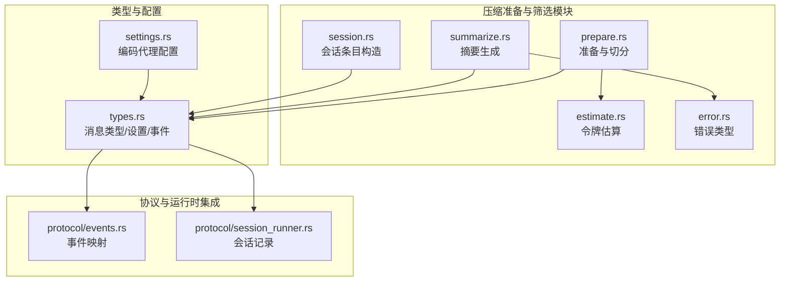
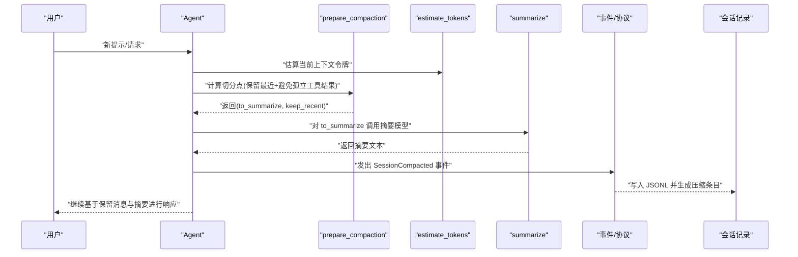
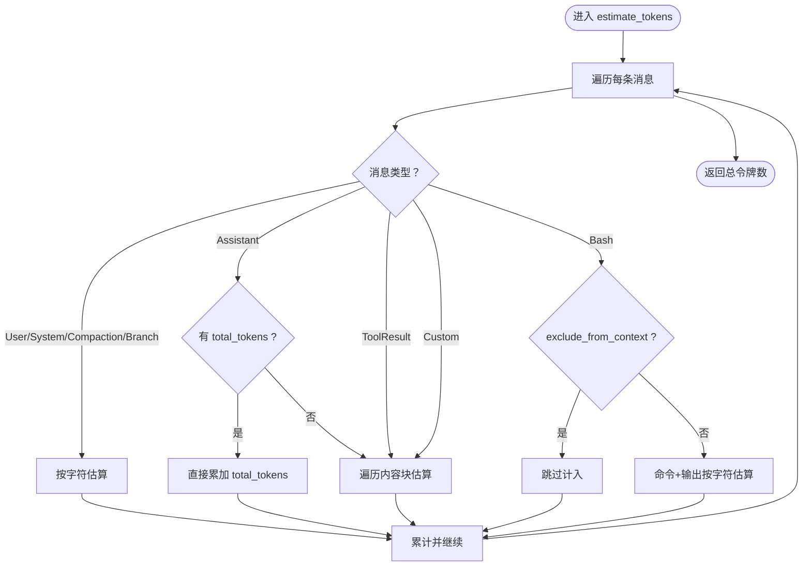
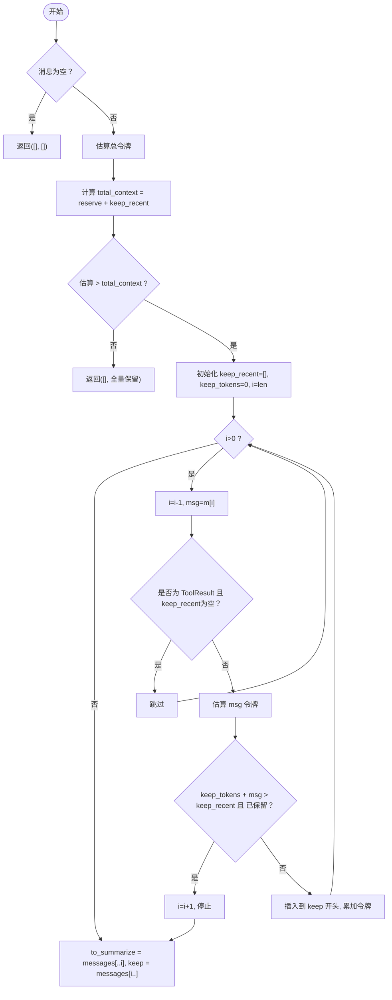
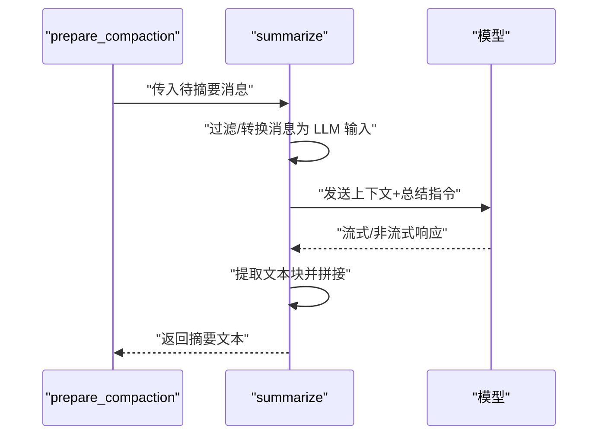
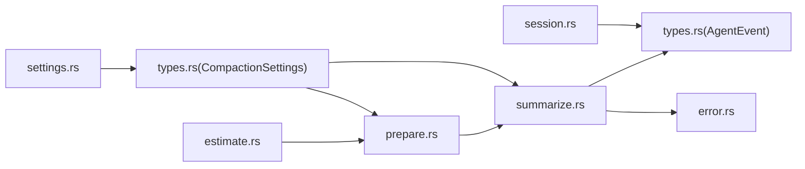

# 压缩准备与筛选

<cite>
**本文引用的文件**
- [prepare.rs](file://crates/pi-agent-core/src/compaction/prepare.rs)
- [estimate.rs](file://crates/pi-agent-core/src/compaction/estimate.rs)
- [summarize.rs](file://crates/pi-agent-core/src/compaction/summarize.rs)
- [error.rs](file://crates/pi-agent-core/src/compaction/error.rs)
- [session.rs](file://crates/pi-agent-core/src/compaction/session.rs)
- [types.rs](file://crates/pi-agent-core/src/types.rs)
- [settings.rs](file://crates/pi-coding-agent/src/config/settings.rs)
- [compaction 测试](file://crates/pi-agent-core/tests/compaction.rs)
- [会话事件协议](file://crates/pi-coding-agent/src/protocol/events.rs)
- [会话运行器](file://crates/pi-coding-agent/src/protocol/session_runner.rs)
</cite>

## 目录
1. [简介](#简介)
2. [项目结构](#项目结构)
3. [核心组件](#核心组件)
4. [架构总览](#架构总览)
5. [详细组件分析](#详细组件分析)
6. [依赖关系分析](#依赖关系分析)
7. [性能考量](#性能考量)
8. [故障排查指南](#故障排查指南)
9. [结论](#结论)
10. [附录：最佳实践与调优建议](#附录最佳实践与调优建议)

## 简介
本技术文档围绕“压缩准备与筛选”子系统，系统化阐述压缩前的数据预处理流程、消息筛选规则、优先级排序策略、时间窗口管理、不同消息类型的处理策略（用户消息、系统消息、工具调用结果等）以及权重分配思路；同时解释压缩决策机制（阈值设定、动态调整、质量控制）、保留策略设计（关键信息保护、上下文连续性维护、历史重要性评估），并提供配置最佳实践与性能调优建议。

## 项目结构
该子系统位于 pi-agent-core 的 compaction 模块中，配合会话条目生成、事件协议与配置模块共同完成运行时压缩与记录。

**图表来源**
- [prepare.rs:1-110](file://crates/pi-agent-core/src/compaction/prepare.rs#L1-L110)
- [estimate.rs:1-94](file://crates/pi-agent-core/src/compaction/estimate.rs#L1-L94)
- [summarize.rs:1-111](file://crates/pi-agent-core/src/compaction/summarize.rs#L1-L111)
- [error.rs:1-14](file://crates/pi-agent-core/src/compaction/error.rs#L1-L14)
- [session.rs:1-139](file://crates/pi-agent-core/src/compaction/session.rs#L1-L139)
- [types.rs:268-298](file://crates/pi-agent-core/src/types.rs#L268-L298)
- [settings.rs:178-213](file://crates/pi-coding-agent/src/config/settings.rs#L178-L213)
- [会话事件协议:98-127](file://crates/pi-coding-agent/src/protocol/events.rs#L98-L127)
- [会话运行器:281-323](file://crates/pi-coding-agent/src/protocol/session_runner.rs#L281-L323)

**章节来源**
- [prepare.rs:1-110](file://crates/pi-agent-core/src/compaction/prepare.rs#L1-L110)
- [estimate.rs:1-94](file://crates/pi-agent-core/src/compaction/estimate.rs#L1-L94)
- [summarize.rs:1-111](file://crates/pi-agent-core/src/compaction/summarize.rs#L1-L111)
- [session.rs:1-139](file://crates/pi-agent-core/src/compaction/session.rs#L1-L139)
- [types.rs:268-298](file://crates/pi-agent-core/src/types.rs#L268-L298)
- [settings.rs:178-213](file://crates/pi-coding-agent/src/config/settings.rs#L178-L213)
- [compaction 测试:1-180](file://crates/pi-agent-core/tests/compaction.rs#L1-L180)
- [会话事件协议:98-127](file://crates/pi-coding-agent/src/protocol/events.rs#L98-L127)
- [会话运行器:281-323](file://crates/pi-coding-agent/src/protocol/session_runner.rs#L281-L323)

## 核心组件
- 令牌估算引擎：对各类 AgentMessage 进行字符/内容块估算，支持从模型用量回填或按内容块估算。
- 准备与切分：根据保留窗口与最近保留令牌数，从旧消息中切分出需要摘要的历史段，并确保不切割孤立的工具结果。
- 摘要生成：将待摘要的消息集合转换为 LLM 输入，调用模型生成摘要文本。
- 错误与状态：统一的压缩错误类型，便于上层处理中断、无效会话等情况。
- 会话条目：在会话 JSONL 中插入压缩条目，记录摘要、首个保留消息 ID、令牌数等元数据。
- 类型与配置：定义消息类型、压缩设置、压缩配置、Agent 事件；编码代理提供配置解析与默认值。

**章节来源**
- [estimate.rs:4-54](file://crates/pi-agent-core/src/compaction/estimate.rs#L4-L54)
- [prepare.rs:8-48](file://crates/pi-agent-core/src/compaction/prepare.rs#L8-L48)
- [summarize.rs:6-110](file://crates/pi-agent-core/src/compaction/summarize.rs#L6-L110)
- [error.rs:3-13](file://crates/pi-agent-core/src/compaction/error.rs#L3-L13)
- [session.rs:4-33](file://crates/pi-agent-core/src/compaction/session.rs#L4-L33)
- [types.rs:268-298](file://crates/pi-agent-core/src/types.rs#L268-L298)

## 架构总览
压缩准备与筛选在运行时与 Agent 循环协作：当检测到上下文即将超过阈值时，先进行令牌估算，再切分出需要摘要的历史段，随后生成摘要并替换为压缩摘要消息，最后继续对话流。期间通过 AgentEvent::SessionCompacted 通知上层，会话记录器将其写入 JSONL 并生成压缩条目。

**图表来源**
- [prepare.rs:8-48](file://crates/pi-agent-core/src/compaction/prepare.rs#L8-L48)
- [estimate.rs:4-54](file://crates/pi-agent-core/src/compaction/estimate.rs#L4-L54)
- [summarize.rs:6-110](file://crates/pi-agent-core/src/compaction/summarize.rs#L6-L110)
- [会话事件协议:98-127](file://crates/pi-coding-agent/src/protocol/events.rs#L98-L127)
- [会话运行器:281-323](file://crates/pi-coding-agent/src/protocol/session_runner.rs#L281-L323)

## 详细组件分析

### 令牌估算引擎（estimate_tokens）
- 支持多种消息类型：用户文本、助手消息（优先使用模型用量回填）、工具结果、系统提示、压缩摘要、分支摘要、自定义消息、Bash 执行（可排除）。
- 内容块估算：文本按字符长度估算，工具调用按名称与参数字符串估算，思考内容按字符估算，图片固定估算值。
- 优势：在无模型用量时仍能给出近似估算，减少不必要的模型调用成本。

**图表来源**
- [estimate.rs:4-65](file://crates/pi-agent-core/src/compaction/estimate.rs#L4-L65)

**章节来源**
- [estimate.rs:4-65](file://crates/pi-agent-core/src/compaction/estimate.rs#L4-L65)

### 准备与切分（prepare_compaction）
- 阈值判断：若当前估算令牌大于 context_window - reserve_tokens，则触发压缩。
- 切分策略：
  - 从尾部向前扫描，累积最近保留消息，直到达到 keep_recent_tokens 上限；
  - 避免孤立工具结果：若最近保留为空，遇到工具结果则跳过；
  - 一旦加入某条消息会使总令牌超出上限且已保留过消息，则回退一步，停止切分。
- 返回值：(待摘要消息列表, 最近保留消息列表)，保证总数等于原消息数。

**图表来源**
- [prepare.rs:8-48](file://crates/pi-agent-core/src/compaction/prepare.rs#L8-L48)

**章节来源**
- [prepare.rs:4-48](file://crates/pi-agent-core/src/compaction/prepare.rs#L4-L48)
- [compaction 测试:65-107](file://crates/pi-agent-core/tests/compaction.rs#L65-L107)

### 摘要生成（summarize）
- 输入过滤：仅将用户文本、助手消息、工具结果（含错误标记与工具名）纳入 LLM 输入；系统提示与压缩摘要被忽略；Bash 执行在未排除时转换为文本后纳入。
- 提示工程：内置系统提示引导模型聚焦关键点、决策与行动；可选自定义指令覆盖。
- 输出提取：聚合所有文本块，拼接为摘要文本；空摘要视为失败并抛出错误。
- 安全与取消：支持取消令牌，限制最大输出长度以控制成本。

**图表来源**
- [summarize.rs:6-110](file://crates/pi-agent-core/src/compaction/summarize.rs#L6-L110)

**章节来源**
- [summarize.rs:6-110](file://crates/pi-agent-core/src/compaction/summarize.rs#L6-L110)

### 错误与状态（CompactionError）
- 统一错误类型：中止、摘要失败、会话无效、未知错误，便于上层进行重试、降级或终止。

**章节来源**
- [error.rs:3-13](file://crates/pi-agent-core/src/compaction/error.rs#L3-L13)

### 会话条目（SessionEntry::compaction）
- 在会话 JSONL 中插入压缩条目，字段包含：摘要、首个保留消息 ID、压缩前令牌数、详情、是否来自钩子等。
- 用于后续会话回放与审计，保持上下文连续性与历史可追溯性。

**章节来源**
- [session.rs:4-33](file://crates/pi-agent-core/src/compaction/session.rs#L4-L33)

### 类型与配置（AgentMessage、CompactionSettings、AgentEvent）
- 消息类型：涵盖用户文本、助手消息、工具结果、系统提示、压缩摘要、分支摘要、自定义消息、Bash 执行等。
- 设置：启用开关、保留令牌、最近保留令牌，提供默认值。
- 事件：新增 SessionCompacted 事件，携带摘要、首个保留消息 ID、压缩前令牌数与详情。

**章节来源**
- [types.rs:268-298](file://crates/pi-agent-core/src/types.rs#L268-L298)
- [types.rs:302-353](file://crates/pi-agent-core/src/types.rs#L302-L353)
- [types.rs:485-491](file://crates/pi-agent-core/src/types.rs#L485-L491)

### 编码代理配置（settings.rs）
- 支持从 TOML 加载压缩设置：enabled、reserve_tokens、keep_recent_tokens，默认值与合并策略明确。
- 与 AgentConfig::compaction 对应，便于在项目/全局层面进行配置覆盖。

**章节来源**
- [settings.rs:178-213](file://crates/pi-coding-agent/src/config/settings.rs#L178-L213)
- [settings.rs:291-352](file://crates/pi-coding-agent/src/config/settings.rs#L291-L352)

## 依赖关系分析
- prepare.rs 依赖 estimate.rs 进行令牌估算，依赖 types.rs 的消息与设置类型。
- summarize.rs 依赖 types.rs 的消息类型与事件类型，依赖 pi-ai 的模型流接口。
- session.rs 依赖 types.rs 的 ThinkingLevel 与 SessionEntry 字段约定。
- types.rs 定义了 AgentEvent::SessionCompacted，供协议层与运行器消费。
- settings.rs 为配置来源，最终注入 AgentConfig::compaction。

**图表来源**
- [prepare.rs:1-2](file://crates/pi-agent-core/src/compaction/prepare.rs#L1-L2)
- [estimate.rs:1-2](file://crates/pi-agent-core/src/compaction/estimate.rs#L1-L2)
- [summarize.rs:2-4](file://crates/pi-agent-core/src/compaction/summarize.rs#L2-L4)
- [session.rs:1-2](file://crates/pi-agent-core/src/compaction/session.rs#L1-L2)
- [types.rs:268-298](file://crates/pi-agent-core/src/types.rs#L268-L298)
- [settings.rs:178-213](file://crates/pi-coding-agent/src/config/settings.rs#L178-L213)

**章节来源**
- [prepare.rs:1-2](file://crates/pi-agent-core/src/compaction/prepare.rs#L1-L2)
- [estimate.rs:1-2](file://crates/pi-agent-core/src/compaction/estimate.rs#L1-L2)
- [summarize.rs:2-4](file://crates/pi-agent-core/src/compaction/summarize.rs#L2-L4)
- [session.rs:1-2](file://crates/pi-agent-core/src/compaction/session.rs#L1-L2)
- [types.rs:268-298](file://crates/pi-agent-core/src/types.rs#L268-L298)
- [settings.rs:178-213](file://crates/pi-coding-agent/src/config/settings.rs#L178-L213)

## 性能考量
- 估算成本：estimate_tokens 对每条消息与内容块进行线性扫描，整体 O(N)；在大消息较多时可考虑缓存或增量估算。
- 切分效率：prepare_compaction 从尾部扫描，平均 O(K) 切分点查找；避免孤立工具结果的逻辑为常数开销。
- 摘要成本：summarize 受待摘要消息数量与长度影响，建议控制 keep_recent_tokens 与 to_summarize 规模；通过取消令牌与最大输出限制降低延迟与费用。
- I/O 与持久化：会话条目写入 JSONL，注意批量写入与磁盘吞吐；压缩事件驱动的落盘有助于减少中间态。

[本节为通用性能讨论，无需特定文件引用]

## 故障排查指南
- 摘要为空或失败：检查输入消息是否被正确过滤（如系统提示与压缩摘要会被忽略），确认 Bash 执行未被错误排除；必要时提供自定义指令增强摘要质量。
- 保留策略异常：若出现频繁切分或保留过多，检查 keep_recent_tokens 是否过小；若出现孤立工具结果，确认 prepare 的跳过逻辑是否生效。
- 事件缺失：若未收到 SessionCompacted 事件，检查 AgentConfig::compaction 是否启用，以及运行器是否正确捕获并记录事件。
- 配置问题：核对 settings.rs 的默认值与项目覆盖，确保 reserve_tokens 与 keep_recent_tokens 合理。

**章节来源**
- [summarize.rs:105-107](file://crates/pi-agent-core/src/compaction/summarize.rs#L105-L107)
- [prepare.rs:31-33](file://crates/pi-agent-core/src/compaction/prepare.rs#L31-L33)
- [compaction 测试:133-179](file://crates/pi-agent-core/tests/compaction.rs#L133-L179)
- [会话事件协议:98-127](file://crates/pi-coding-agent/src/protocol/events.rs#L98-L127)
- [settings.rs:178-213](file://crates/pi-coding-agent/src/config/settings.rs#L178-L213)

## 结论
压缩准备与筛选通过“令牌估算—切分保留—摘要生成—事件记录”的闭环，在保障上下文连续性与关键信息的前提下，有效控制上下文规模与成本。其设计兼顾灵活性（可配置保留与最近保留令牌、自定义摘要指令）与健壮性（错误类型、事件通知、会话条目）。结合合理的阈值与保留策略，可在长对话与复杂工具链场景下维持稳定性能与质量。

[本节为总结性内容，无需特定文件引用]

## 附录：最佳实践与调优建议

- 阈值设定与动态调整
  - 默认保留令牌与最近保留令牌可参考配置模块的默认值，结合模型上下文窗口与业务对话长度进行微调。
  - 动态调整建议：根据实际令牌估算波动与会话长度，定期评估并调整 reserve_tokens 与 keep_recent_tokens，避免频繁压缩或过度保留。

- 不同消息类型的处理策略与权重分配
  - 用户消息与系统提示：按字符估算，适合保留；在切分时优先保留最新用户消息以维持上下文连贯。
  - 工具调用结果：避免孤立切分，确保与对应工具调用配对；若结果冗长，可考虑在摘要阶段强调关键结论。
  - 助手消息：优先使用模型用量回填，若不可用则按内容块估算；在摘要阶段可突出关键推理片段。
  - Bash 执行：默认纳入估算，如需节省上下文可设置排除标志；摘要时可提炼关键输出与退出码。
  - 自定义消息与分支摘要：按内容块估算，摘要时可保留摘要文本以复用历史要点。

- 压缩决策机制
  - 阈值：当估算令牌超过 total_context = reserve_tokens + keep_recent_tokens 时触发压缩。
  - 质量控制：通过自定义摘要指令引导模型聚焦关键点；对空摘要进行失败处理并可选择重试或降级。

- 保留策略设计原理
  - 关键信息保护：保留最新用户消息与工具结果，确保后续推理与执行可追溯。
  - 上下文连续性：避免切割孤立工具结果，保证工具调用与其结果的关联性。
  - 历史重要性评估：通过摘要替代历史长文本，保留摘要文本以维持高层语义连贯。

- 配置最佳实践
  - 在项目配置中显式设置 reserve_tokens 与 keep_recent_tokens，避免默认值导致的不稳定行为。
  - 使用自定义摘要指令针对领域特性优化摘要质量。
  - 在高并发或多轮对话场景下，适当提高 keep_recent_tokens 以减少压缩频率。

- 性能调优建议
  - 控制摘要输入规模：合理设置 keep_recent_tokens，避免 to_summarize 过大。
  - 使用取消令牌与最大输出限制：在摘要阶段限制响应长度与等待时间。
  - 批量写入会话条目：减少 I/O 抖动，提升稳定性。

**章节来源**
- [settings.rs:178-213](file://crates/pi-coding-agent/src/config/settings.rs#L178-L213)
- [settings.rs:291-352](file://crates/pi-coding-agent/src/config/settings.rs#L291-L352)
- [prepare.rs:16-17](file://crates/pi-agent-core/src/compaction/prepare.rs#L16-L17)
- [summarize.rs:12-14](file://crates/pi-agent-core/src/compaction/summarize.rs#L12-L14)
- [summarize.rs:85-87](file://crates/pi-agent-core/src/compaction/summarize.rs#L85-L87)