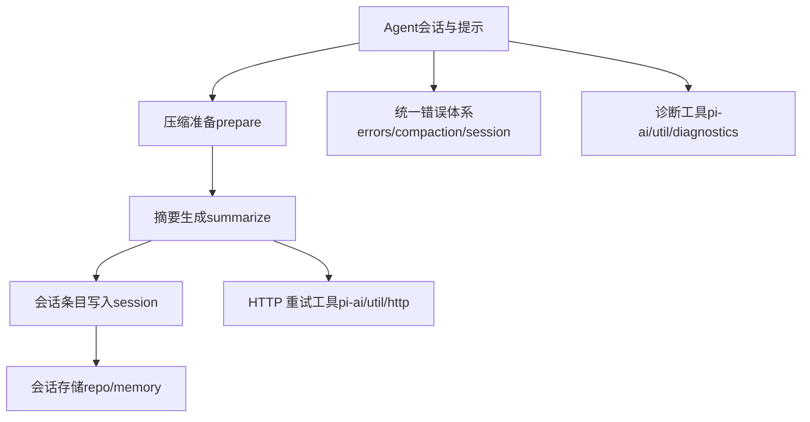
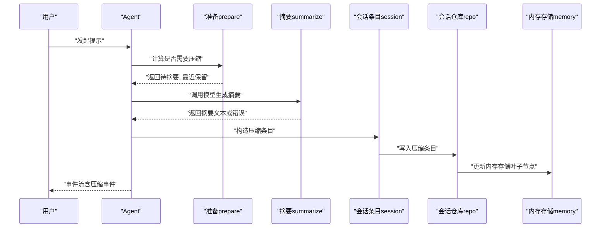
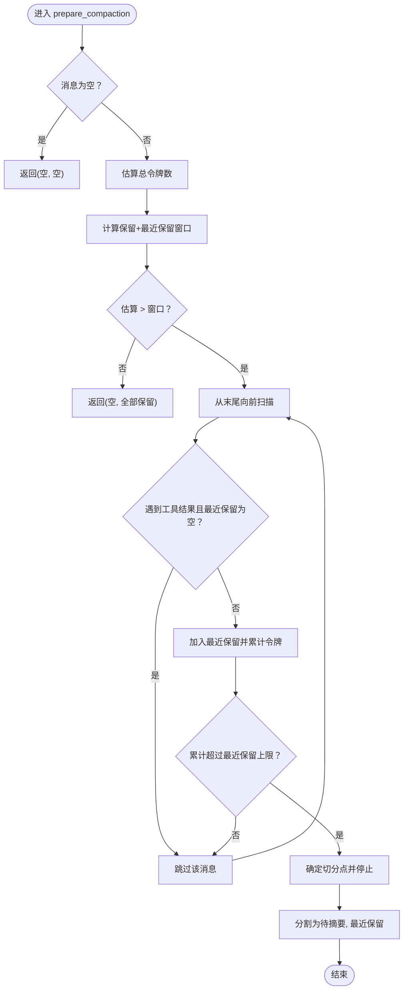
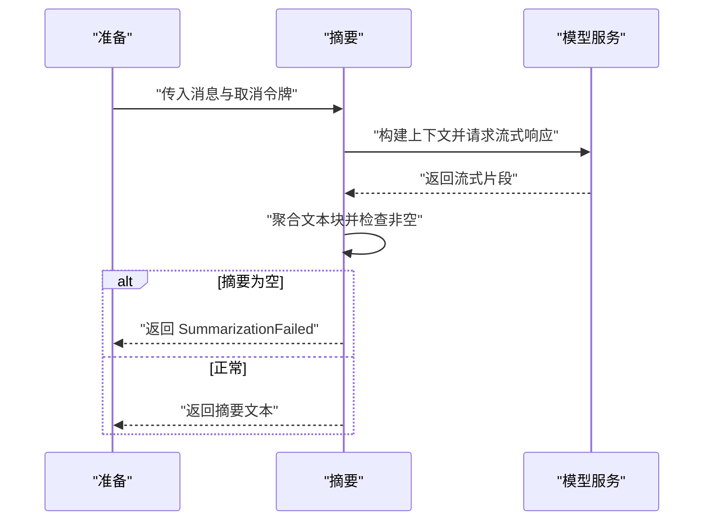
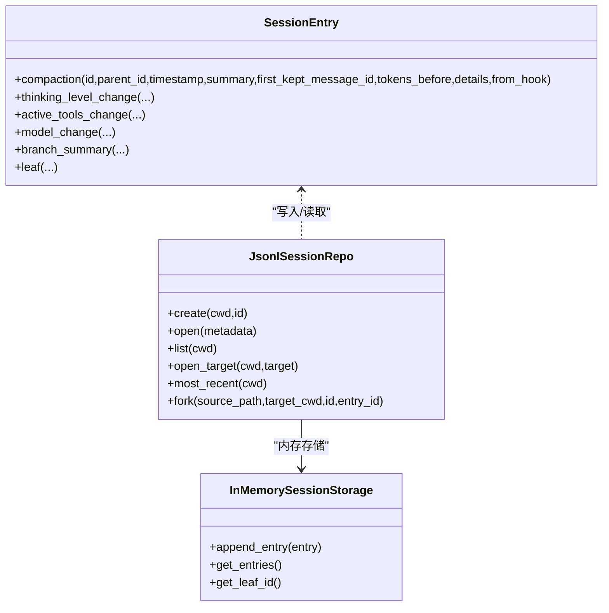
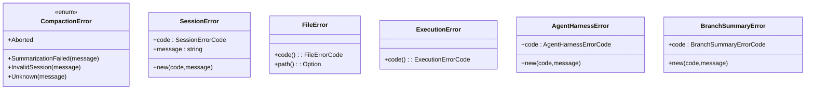
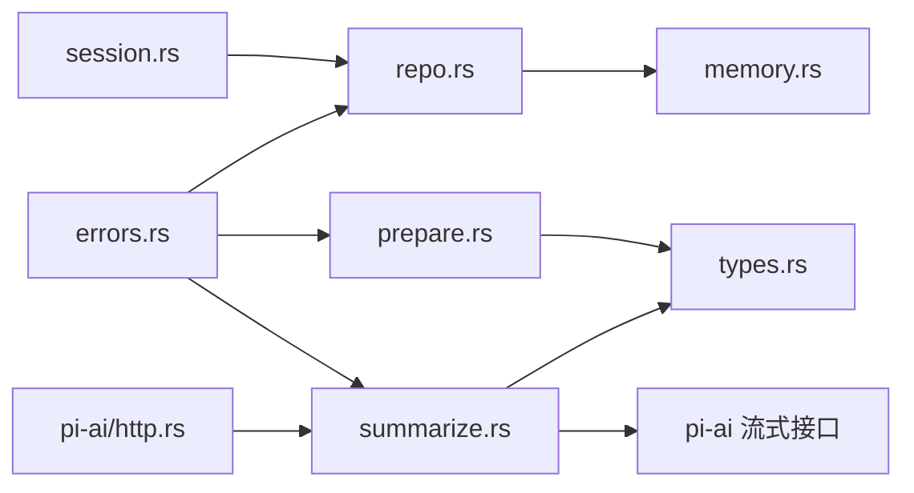

# 压缩错误处理与恢复

<cite>
**本文引用的文件**
- [error.rs](file://crates/pi-agent-core/src/compaction/error.rs)
- [error.rs（会话）](file://crates/pi-agent-core/src/session/error.rs)
- [errors.rs](file://crates/pi-agent-core/src/errors.rs)
- [prepare.rs](file://crates/pi-agent-core/src/compaction/prepare.rs)
- [summarize.rs](file://crates/pi-agent-core/src/compaction/summarize.rs)
- [session.rs（会话条目）](file://crates/pi-agent-core/src/compaction/session.rs)
- [repo.rs（会话存储仓库）](file://crates/pi-agent-core/src/session/repo.rs)
- [memory.rs（内存会话存储）](file://crates/pi-agent-core/src/session/memory.rs)
- [types.rs](file://crates/pi-agent-core/src/types.rs)
- [compaction 测试](file://crates/pi-agent-core/tests/compaction.rs)
- [agent.rs](file://crates/pi-agent-core/src/agent.rs)
- [http.rs（HTTP 重试工具）](file://crates/pi-ai/src/util/http.rs)
- [diagnostics.rs（诊断工具）](file://crates/pi-ai/src/util/diagnostics.rs)
- [session_runner.rs（协议会话运行器）](file://crates/pi-coding-agent/src/protocol/session_runner.rs)
</cite>

## 目录
1. [简介](#简介)
2. [项目结构](#项目结构)
3. [核心组件](#核心组件)
4. [架构总览](#架构总览)
5. [详细组件分析](#详细组件分析)
6. [依赖关系分析](#依赖关系分析)
7. [性能考量](#性能考量)
8. [故障排查指南](#故障排查指南)
9. [结论](#结论)
10. [附录](#附录)

## 简介
本技术文档聚焦于“压缩错误处理与恢复”子系统，围绕对话历史压缩过程中的错误类型、分类与处理策略展开，涵盖以下关键点：
- 错误类型与来源：Token 计算错误、摘要生成失败、会话存储错误、执行超时/中止、未知错误等
- 处理策略：可恢复错误的自动重试、不可恢复错误的优雅降级、部分失败的补偿机制
- 日志与诊断：错误上下文保存、堆栈跟踪、性能指标采集
- 回滚与一致性：压缩失败的回滚、状态恢复、数据一致性保证、用户通知
- 监控与告警：阈值设定、通知渠道、故障转移
- 实战示例与最佳实践：通过现有测试与实现路径给出参考

## 项目结构
压缩错误处理与恢复涉及多个模块协同工作：
- 压缩准备与估算：准备阶段决定是否需要压缩、如何切分消息
- 摘要生成：调用模型完成历史摘要
- 会话存储：写入压缩结果与元数据
- 统一错误体系：集中定义错误类型与错误码
- 诊断与重试：统一的诊断工具与 HTTP 重试策略

**图表来源**
- [agent.rs:177-200](file://crates/pi-agent-core/src/agent.rs#L177-L200)
- [prepare.rs:1-48](file://crates/pi-agent-core/src/compaction/prepare.rs#L1-L48)
- [summarize.rs:1-111](file://crates/pi-agent-core/src/compaction/summarize.rs#L1-L111)
- [session.rs（会话条目）:1-139](file://crates/pi-agent-core/src/compaction/session.rs#L1-L139)
- [repo.rs（会话存储仓库）:1-281](file://crates/pi-agent-core/src/session/repo.rs#L1-L281)
- [memory.rs（内存会话存储）:1-126](file://crates/pi-agent-core/src/session/memory.rs#L1-L126)
- [errors.rs:1-231](file://crates/pi-agent-core/src/errors.rs#L1-L231)
- [error.rs（压缩）:1-14](file://crates/pi-agent-core/src/compaction/error.rs#L1-L14)
- [error.rs（会话）:1-28](file://crates/pi-agent-core/src/session/error.rs#L1-L28)
- [http.rs（HTTP 重试工具）:1-47](file://crates/pi-ai/src/util/http.rs#L1-L47)
- [diagnostics.rs（诊断工具）:1-33](file://crates/pi-ai/src/util/diagnostics.rs#L1-L33)

**章节来源**
- [prepare.rs:1-48](file://crates/pi-agent-core/src/compaction/prepare.rs#L1-L48)
- [summarize.rs:1-111](file://crates/pi-agent-core/src/compaction/summarize.rs#L1-L111)
- [session.rs（会话条目）:1-139](file://crates/pi-agent-core/src/compaction/session.rs#L1-L139)
- [repo.rs（会话存储仓库）:1-281](file://crates/pi-agent-core/src/session/repo.rs#L1-L281)
- [memory.rs（内存会话存储）:1-126](file://crates/pi-agent-core/src/session/memory.rs#L1-L126)
- [errors.rs:1-231](file://crates/pi-agent-core/src/errors.rs#L1-L231)
- [error.rs（压缩）:1-14](file://crates/pi-agent-core/src/compaction/error.rs#L1-L14)
- [error.rs（会话）:1-28](file://crates/pi-agent-core/src/session/error.rs#L1-L28)
- [http.rs（HTTP 重试工具）:1-47](file://crates/pi-ai/src/util/http.rs#L1-L47)
- [diagnostics.rs（诊断工具）:1-33](file://crates/pi-ai/src/util/diagnostics.rs#L1-L33)

## 核心组件
- 压缩准备与估算
  - should_compact：基于上下文窗口与保留令牌判断是否需要压缩
  - prepare_compaction：从旧消息中切分出待摘要与最近保留的消息，避免切割工具结果导致孤立
- 摘要生成
  - summarize：将 AgentMessage 转换为模型输入，调用流式接口并完成摘要生成，校验输出非空
- 会话条目与存储
  - SessionEntry.compaction：构造压缩条目，记录摘要、首个保留消息 ID、令牌数、详情与来源钩子标记
  - JsonlSessionRepo：会话目录管理、打开/创建/列表、fork 等
  - InMemorySessionStorage：内存存储，维护叶子节点追踪
- 统一错误体系
  - CompactionError：压缩阶段错误（中止、摘要失败、无效会话、未知）
  - SessionError：会话层错误（未找到、无效会话/条目、存储、未知）
  - FileError/ExecutionError/AgentHarnessError/BranchSummaryError：文件、执行、编排、分支摘要错误码与错误对象
- 诊断与重试
  - 诊断工具：在助手消息中附加诊断信息
  - HTTP 重试工具：可重试状态码、最大延迟、Retry-After 解析

**章节来源**
- [prepare.rs:1-48](file://crates/pi-agent-core/src/compaction/prepare.rs#L1-L48)
- [summarize.rs:1-111](file://crates/pi-agent-core/src/compaction/summarize.rs#L1-L111)
- [session.rs（会话条目）:1-139](file://crates/pi-agent-core/src/compaction/session.rs#L1-L139)
- [repo.rs（会话存储仓库）:1-281](file://crates/pi-agent-core/src/session/repo.rs#L1-L281)
- [memory.rs（内存会话存储）:1-126](file://crates/pi-agent-core/src/session/memory.rs#L1-L126)
- [errors.rs:1-231](file://crates/pi-agent-core/src/errors.rs#L1-L231)
- [error.rs（压缩）:1-14](file://crates/pi-agent-core/src/compaction/error.rs#L1-L14)
- [error.rs（会话）:1-28](file://crates/pi-agent-core/src/session/error.rs#L1-L28)
- [diagnostics.rs（诊断工具）:1-33](file://crates/pi-ai/src/util/diagnostics.rs#L1-L33)
- [http.rs（HTTP 重试工具）:1-47](file://crates/pi-ai/src/util/http.rs#L1-L47)

## 架构总览
压缩流程从 Agent 的提示触发，经过准备、摘要、写入会话，期间对错误进行分类与处理。

**图表来源**
- [agent.rs:177-200](file://crates/pi-agent-core/src/agent.rs#L177-L200)
- [prepare.rs:1-48](file://crates/pi-agent-core/src/compaction/prepare.rs#L1-L48)
- [summarize.rs:1-111](file://crates/pi-agent-core/src/compaction/summarize.rs#L1-L111)
- [session.rs（会话条目）:1-139](file://crates/pi-agent-core/src/compaction/session.rs#L1-L139)
- [repo.rs（会话存储仓库）:1-281](file://crates/pi-agent-core/src/session/repo.rs#L1-L281)
- [memory.rs（内存会话存储）:1-126](file://crates/pi-agent-core/src/session/memory.rs#L1-L126)

## 详细组件分析

### 压缩准备与估算
- should_compact：当估算令牌数超过（上下文窗口 - 保留令牌）时触发压缩
- prepare_compaction：
  - 从尾部向前扫描，优先保留最近消息，避免切割工具结果造成孤立
  - 将超出保留范围的历史消息作为待摘要集合
  - 返回（待摘要, 最近保留）

**图表来源**
- [prepare.rs:1-48](file://crates/pi-agent-core/src/compaction/prepare.rs#L1-L48)

**章节来源**
- [prepare.rs:1-48](file://crates/pi-agent-core/src/compaction/prepare.rs#L1-L48)

### 摘要生成与错误处理
- summarize：
  - 将 AgentMessage 转换为模型消息，追加“请总结以上对话历史”的用户指令
  - 使用流式接口与取消令牌，完成后提取文本块拼接为摘要
  - 若摘要为空则返回摘要失败错误
  - 摘要失败归类为压缩错误（SummarizationFailed）

**图表来源**
- [summarize.rs:1-111](file://crates/pi-agent-core/src/compaction/summarize.rs#L1-L111)

**章节来源**
- [summarize.rs:1-111](file://crates/pi-agent-core/src/compaction/summarize.rs#L1-L111)
- [error.rs（压缩）:1-14](file://crates/pi-agent-core/src/compaction/error.rs#L1-L14)

### 会话条目写入与一致性
- SessionEntry.compaction：
  - 写入摘要、首个保留条目 ID、令牌数、可选详情、是否来自钩子
- JsonlSessionRepo：
  - 创建/打开/列出会话，支持按目标定位、fork 指定入口
  - fork 时验证入口 ID 存在性，否则返回无效分支目标错误
- InMemorySessionStorage：
  - 追加条目并维护叶子节点（leaf），重复 ID 视为无效条目

**图表来源**
- [session.rs（会话条目）:1-139](file://crates/pi-agent-core/src/compaction/session.rs#L1-L139)
- [repo.rs（会话存储仓库）:1-281](file://crates/pi-agent-core/src/session/repo.rs#L1-L281)
- [memory.rs（内存会话存储）:1-126](file://crates/pi-agent-core/src/session/memory.rs#L1-L126)

**章节来源**
- [session.rs（会话条目）:1-139](file://crates/pi-agent-core/src/compaction/session.rs#L1-L139)
- [repo.rs（会话存储仓库）:1-281](file://crates/pi-agent-core/src/session/repo.rs#L1-L281)
- [memory.rs（内存会话存储）:1-126](file://crates/pi-agent-core/src/session/memory.rs#L1-L126)
- [error.rs（会话）:1-28](file://crates/pi-agent-core/src/session/error.rs#L1-L28)

### 统一错误体系与分类
- 压缩错误（CompactionError）
  - Aborted：压缩被中止
  - SummarizationFailed：摘要生成失败（含空摘要）
  - InvalidSession：会话无效
  - Unknown：未知错误
- 会话错误（SessionError）
  - NotFound/InvalidSession/InvalidEntry/InvalidForkTarget/Storage/Unknown
- 文件/执行/编排/分支摘要错误
  - FileError/ExecutionError/AgentHarnessError/BranchSummaryError：均提供 code() 与路径/消息字段

**图表来源**
- [error.rs（压缩）:1-14](file://crates/pi-agent-core/src/compaction/error.rs#L1-L14)
- [error.rs（会话）:1-28](file://crates/pi-agent-core/src/session/error.rs#L1-L28)
- [errors.rs:1-231](file://crates/pi-agent-core/src/errors.rs#L1-L231)

**章节来源**
- [error.rs（压缩）:1-14](file://crates/pi-agent-core/src/compaction/error.rs#L1-L14)
- [error.rs（会话）:1-28](file://crates/pi-agent-core/src/session/error.rs#L1-L28)
- [errors.rs:1-231](file://crates/pi-agent-core/src/errors.rs#L1-L231)

### 错误分类与处理策略
- 可恢复错误
  - 摘要生成失败（SummarizationFailed）：可结合 HTTP 重试策略进行有限次重试，设置最大延迟与超时
  - 执行超时/回调错误：在执行层采用指数退避与最大重试次数
- 不可恢复错误
  - 会话无效/存储错误：直接降级，保留最近消息，不写入压缩条目
  - 中止（Aborted）：终止流程，向用户发出明确提示
- 部分失败补偿
  - fork 时若入口 ID 不存在，返回 InvalidForkTarget 并回滚到上一个有效状态
  - 会话存储重复条目：拒绝写入并返回 InvalidEntry，保持一致性

**章节来源**
- [summarize.rs:1-111](file://crates/pi-agent-core/src/compaction/summarize.rs#L1-L111)
- [http.rs（HTTP 重试工具）:1-47](file://crates/pi-ai/src/util/http.rs#L1-L47)
- [errors.rs:102-152](file://crates/pi-agent-core/src/errors.rs#L102-L152)
- [repo.rs（会话存储仓库）:157-214](file://crates/pi-agent-core/src/session/repo.rs#L157-L214)
- [memory.rs（内存会话存储）:41-59](file://crates/pi-agent-core/src/session/memory.rs#L41-L59)

### 错误日志记录与诊断
- 诊断工具
  - 在助手消息中附加诊断信息，包含时间戳、错误名称/消息、可选代码与细节
- 错误上下文
  - 摘要失败时携带底层错误字符串
  - 会话错误携带路径与消息
- 性能指标
  - 可在摘要生成前后记录耗时、令牌估算、摘要长度等指标，便于监控

**章节来源**
- [diagnostics.rs（诊断工具）:1-33](file://crates/pi-ai/src/util/diagnostics.rs#L1-L33)
- [summarize.rs:89-110](file://crates/pi-agent-core/src/compaction/summarize.rs#L89-L110)
- [errors.rs:30-100](file://crates/pi-agent-core/src/errors.rs#L30-L100)

### 回滚机制与一致性保证
- 会话写入前校验
  - fork 前验证入口 ID 是否存在于源会话
  - 内存存储拒绝重复条目 ID
- 回滚与降级
  - 摘要失败：不写入压缩条目，保留最近消息
  - 存储错误：返回 SessionError，调用方负责回滚或降级
- 用户通知
  - 通过 Agent 事件流发送压缩事件（摘要、首个保留消息 ID、令牌数、详情），便于前端展示

**章节来源**
- [session_runner.rs（协议会话运行器）:398-422](file://crates/pi-coding-agent/src/protocol/session_runner.rs#L398-L422)
- [types.rs:482-491](file://crates/pi-agent-core/src/types.rs#L482-L491)
- [repo.rs（会话存储仓库）:157-214](file://crates/pi-agent-core/src/session/repo.rs#L157-L214)
- [memory.rs（内存会话存储）:41-59](file://crates/pi-agent-core/src/session/memory.rs#L41-L59)

### 监控与告警配置
- 阈值设定
  - 保留令牌与最近保留令牌：根据模型上下文窗口动态调整
  - 最大重试次数与最大延迟：依据 HTTP 重试工具配置
- 通知渠道
  - 事件流：通过 Agent 事件（如 SessionCompacted）上报压缩结果
  - 诊断消息：在助手消息中附加诊断信息
- 故障转移
  - fork 失败时回退到最近可用会话
  - 存储错误时切换到内存模式或降级为不压缩

**章节来源**
- [types.rs:268-298](file://crates/pi-agent-core/src/types.rs#L268-L298)
- [http.rs（HTTP 重试工具）:1-47](file://crates/pi-ai/src/util/http.rs#L1-L47)
- [session_runner.rs（协议会话运行器）:398-422](file://crates/pi-coding-agent/src/protocol/session_runner.rs#L398-L422)

## 依赖关系分析
- 组件耦合
  - prepare 与 types（消息与设置）紧密耦合
  - summarize 依赖 pi-ai 的流式接口与取消令牌
  - session 条目写入依赖 repo 与 memory
  - 统一错误体系贯穿各模块
- 外部依赖
  - pi-ai 提供模型流式接口与 HTTP 重试工具
  - tokio_util 提供取消令牌

**图表来源**
- [prepare.rs:1-48](file://crates/pi-agent-core/src/compaction/prepare.rs#L1-L48)
- [summarize.rs:1-111](file://crates/pi-agent-core/src/compaction/summarize.rs#L1-L111)
- [session.rs（会话条目）:1-139](file://crates/pi-agent-core/src/compaction/session.rs#L1-L139)
- [repo.rs（会话存储仓库）:1-281](file://crates/pi-agent-core/src/session/repo.rs#L1-L281)
- [memory.rs（内存会话存储）:1-126](file://crates/pi-agent-core/src/session/memory.rs#L1-L126)
- [errors.rs:1-231](file://crates/pi-agent-core/src/errors.rs#L1-L231)
- [http.rs（HTTP 重试工具）:1-47](file://crates/pi-ai/src/util/http.rs#L1-L47)

**章节来源**
- [prepare.rs:1-48](file://crates/pi-agent-core/src/compaction/prepare.rs#L1-L48)
- [summarize.rs:1-111](file://crates/pi-agent-core/src/compaction/summarize.rs#L1-L111)
- [session.rs（会话条目）:1-139](file://crates/pi-agent-core/src/compaction/session.rs#L1-L139)
- [repo.rs（会话存储仓库）:1-281](file://crates/pi-agent-core/src/session/repo.rs#L1-L281)
- [memory.rs（内存会话存储）:1-126](file://crates/pi-agent-core/src/session/memory.rs#L1-L126)
- [errors.rs:1-231](file://crates/pi-agent-core/src/errors.rs#L1-L231)
- [http.rs（HTTP 重试工具）:1-47](file://crates/pi-ai/src/util/http.rs#L1-L47)

## 性能考量
- 令牌估算复杂度
  - 估算 O(n)，其中 n 为消息数量；prepare 中从后向前扫描，平均减少遍历成本
- 摘要生成
  - 流式接口避免一次性加载大文本；合理设置 max_tokens 与取消令牌
- 存储写入
  - JSONL 追加写入；fork 时仅复制必要条目，避免全量复制
- 重试策略
  - 限制最大重试次数与延迟，防止雪崩

[本节为通用指导，无需特定文件分析]

## 故障排查指南
- 摘要为空
  - 现象：返回 SummarizationFailed（空摘要）
  - 排查：检查模型响应、上下文构造、取消令牌是否提前取消
  - 参考路径：[summarize.rs:105-107](file://crates/pi-agent-core/src/compaction/summarize.rs#L105-L107)
- fork 入口 ID 不存在
  - 现象：返回 InvalidForkTarget
  - 排查：确认入口 ID 是否存在于源会话
  - 参考路径：[repo.rs（会话存储仓库）:190-197](file://crates/pi-agent-core/src/session/repo.rs#L190-L197)
- 重复条目 ID
  - 现象：返回 InvalidEntry
  - 排查：确保每个条目 ID 唯一
  - 参考路径：[memory.rs（内存会话存储）:42-47](file://crates/pi-agent-core/src/session/memory.rs#L42-L47)
- 会话未找到/多匹配
  - 现象：NotFound 或 InvalidSession（多匹配/前缀歧义）
  - 排查：核对会话 ID 与前缀唯一性
  - 参考路径：[repo.rs（会话存储仓库）:111-137](file://crates/pi-agent-core/src/session/repo.rs#L111-L137)
- 重试后仍失败
  - 现象：HTTP 重试后仍报错
  - 排查：检查 Retry-After 是否超过最大延迟、状态码是否可重试
  - 参考路径：[http.rs（HTTP 重试工具）:27-47](file://crates/pi-ai/src/util/http.rs#L27-L47)

**章节来源**
- [summarize.rs:105-107](file://crates/pi-agent-core/src/compaction/summarize.rs#L105-L107)
- [repo.rs（会话存储仓库）:190-197](file://crates/pi-agent-core/src/session/repo.rs#L190-L197)
- [memory.rs（内存会话存储）:42-47](file://crates/pi-agent-core/src/session/memory.rs#L42-L47)
- [http.rs（HTTP 重试工具）:27-47](file://crates/pi-ai/src/util/http.rs#L27-L47)

## 结论
本系统通过“准备-摘要-写入”的三段式流程与统一错误体系，实现了对压缩过程的稳健控制。可恢复错误通过重试与降级策略缓解瞬时故障，不可恢复错误通过明确的错误码与回滚机制保障一致性。配合诊断工具与事件流，能够为用户提供可观测、可恢复的压缩体验。

[本节为总结，无需特定文件分析]

## 附录
- 关键实现路径参考
  - 压缩准备与估算：[prepare.rs:1-48](file://crates/pi-agent-core/src/compaction/prepare.rs#L1-L48)
  - 摘要生成：[summarize.rs:1-111](file://crates/pi-agent-core/src/compaction/summarize.rs#L1-L111)
  - 会话条目写入：[session.rs（会话条目）:1-139](file://crates/pi-agent-core/src/compaction/session.rs#L1-L139)
  - 会话存储与 fork：[repo.rs（会话存储仓库）:157-214](file://crates/pi-agent-core/src/session/repo.rs#L157-L214)
  - 内存存储与重复条目校验：[memory.rs（内存会话存储）:41-59](file://crates/pi-agent-core/src/session/memory.rs#L41-L59)
  - 统一错误体系：[errors.rs:1-231](file://crates/pi-agent-core/src/errors.rs#L1-L231)
  - 诊断工具：[diagnostics.rs（诊断工具）:1-33](file://crates/pi-ai/src/util/diagnostics.rs#L1-L33)
  - HTTP 重试工具：[http.rs（HTTP 重试工具）:1-47](file://crates/pi-ai/src/util/http.rs#L1-L47)
  - 事件流与压缩事件：[types.rs:482-491](file://crates/pi-agent-core/src/types.rs#L482-L491)
  - 协议侧写入压缩条目：[session_runner.rs（协议会话运行器）:398-422](file://crates/pi-coding-agent/src/protocol/session_runner.rs#L398-L422)
  - 压缩流程端到端测试：[compaction 测试:133-179](file://crates/pi-agent-core/tests/compaction.rs#L133-L179)