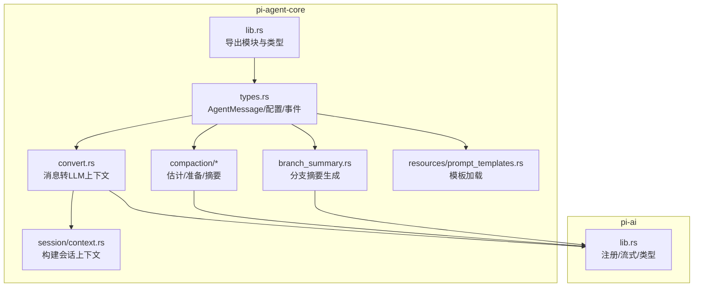
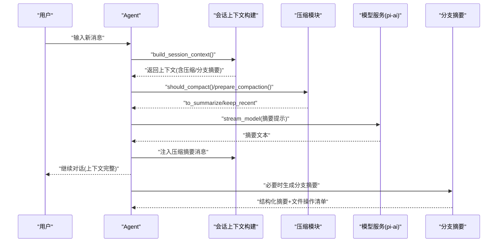
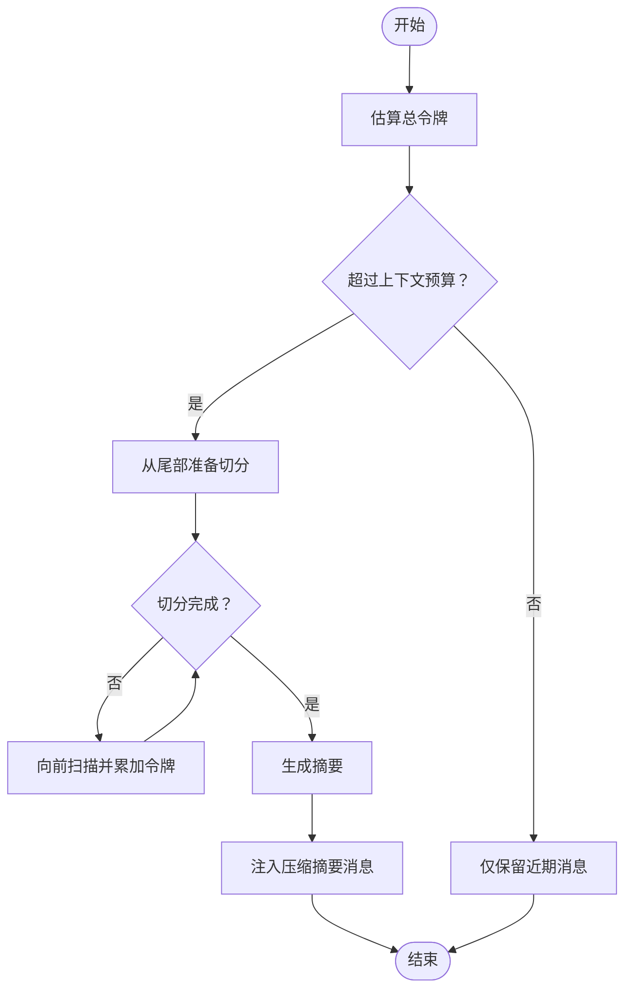
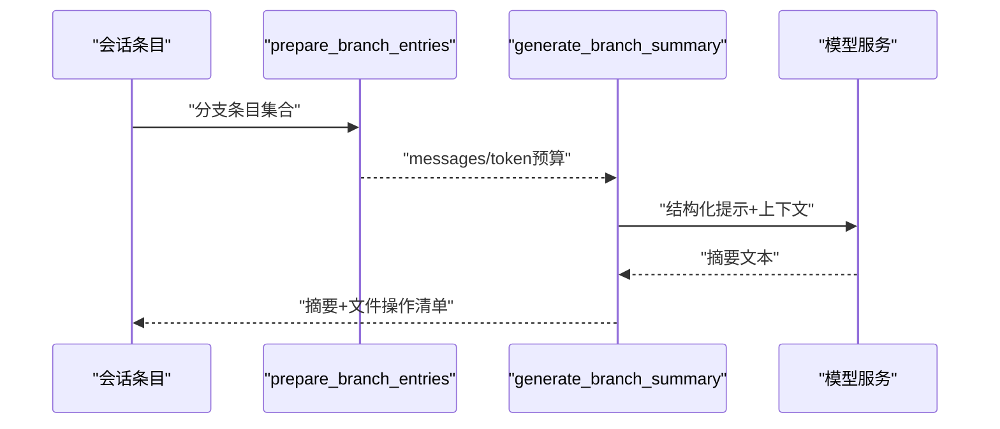
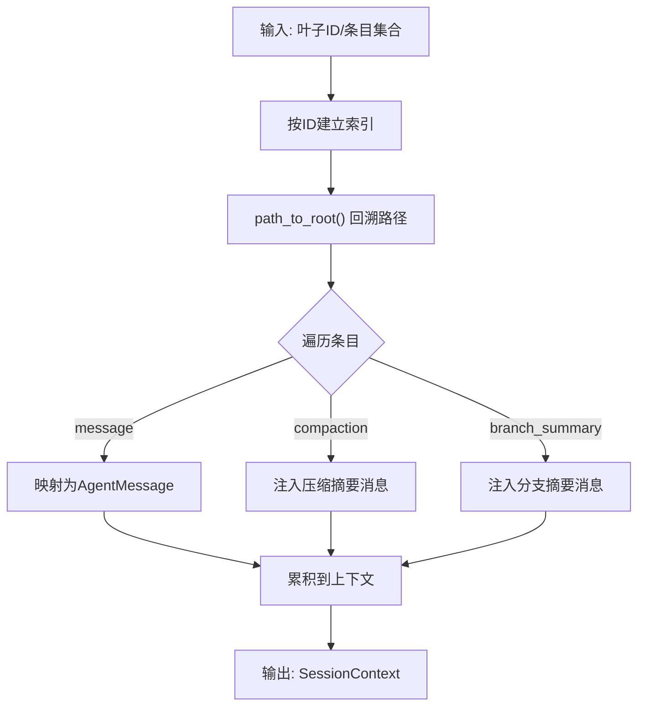
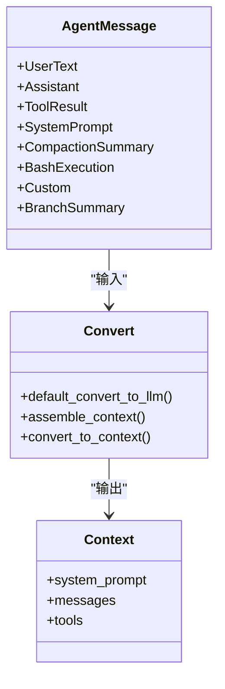
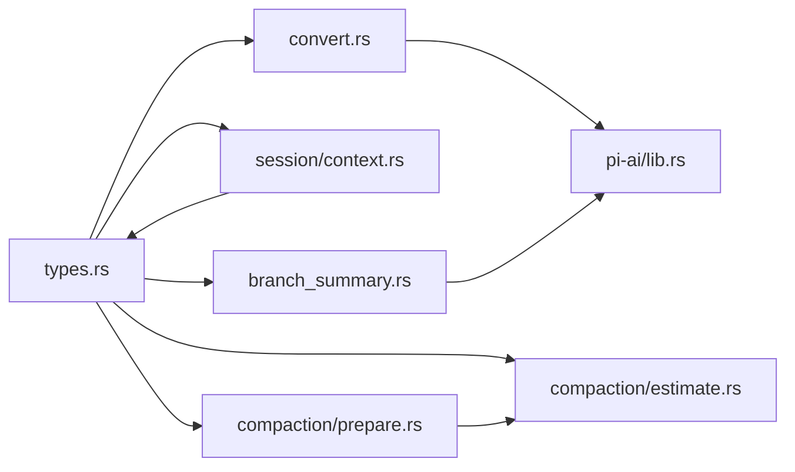

# 摘要生成与重构

<cite>
**本文档引用的文件**   
- [crates/pi-agent-core/src/lib.rs](file://crates/pi-agent-core/src/lib.rs)
- [crates/pi-agent-core/src/types.rs](file://crates/pi-agent-core/src/types.rs)
- [crates/pi-agent-core/src/convert.rs](file://crates/pi-agent-core/src/convert.rs)
- [crates/pi-agent-core/src/session/context.rs](file://crates/pi-agent-core/src/session/context.rs)
- [crates/pi-agent-core/src/branch_summary.rs](file://crates/pi-agent-core/src/branch_summary.rs)
- [crates/pi-agent-core/src/compaction/mod.rs](file://crates/pi-agent-core/src/compaction/mod.rs)
- [crates/pi-agent-core/src/compaction/estimate.rs](file://crates/pi-agent-core/src/compaction/estimate.rs)
- [crates/pi-agent-core/src/compaction/prepare.rs](file://crates/pi-agent-core/src/compaction/prepare.rs)
- [crates/pi-agent-core/src/compaction/summarize.rs](file://crates/pi-agent-core/src/compaction/summarize.rs)
- [crates/pi-agent-core/src/resources/prompt_templates.rs](file://crates/pi-agent-core/src/resources/prompt_templates.rs)
- [crates/pi-ai/src/lib.rs](file://crates/pi-ai/src/lib.rs)
- [crates/pi-agent-core/tests/compaction.rs](file://crates/pi-agent-core/tests/compaction.rs)
</cite>

## 目录
1. [简介](#简介)
2. [项目结构](#项目结构)
3. [核心组件](#核心组件)
4. [架构总览](#架构总览)
5. [详细组件分析](#详细组件分析)
6. [依赖关系分析](#依赖关系分析)
7. [性能考量](#性能考量)
8. [故障排查指南](#故障排查指南)
9. [结论](#结论)
10. [附录](#附录)

## 简介
本文件面向“摘要生成与重构系统”的技术文档，聚焦于会话历史压缩、分支摘要生成、上下文构建与保持、以及与外部模型服务的集成。系统通过“估计-准备-摘要”三步法在运行时动态决定是否压缩历史，并以结构化提示模板驱动生成式摘要；同时通过会话上下文构建确保关键信息（如压缩摘要、分支摘要）被正确注入到后续对话中，维持语义连贯性与可追溯性。

## 项目结构
- 核心模块位于 pi-agent-core，围绕 Agent、消息类型、转换器、会话上下文、压缩与分支摘要展开。
- pi-ai 提供统一的模型注册、流式调用与事件处理能力。
- 资源系统支持从 Markdown 前言元数据加载提示模板，便于策略化配置。

图示来源
- [crates/pi-agent-core/src/lib.rs:1-47](file://crates/pi-agent-core/src/lib.rs#L1-L47)
- [crates/pi-agent-core/src/types.rs:1-657](file://crates/pi-agent-core/src/types.rs#L1-L657)
- [crates/pi-agent-core/src/convert.rs:1-315](file://crates/pi-agent-core/src/convert.rs#L1-L315)
- [crates/pi-agent-core/src/session/context.rs:1-496](file://crates/pi-agent-core/src/session/context.rs#L1-L496)
- [crates/pi-agent-core/src/compaction/mod.rs:1-6](file://crates/pi-agent-core/src/compaction/mod.rs#L1-L6)
- [crates/pi-agent-core/src/branch_summary.rs:1-483](file://crates/pi-agent-core/src/branch_summary.rs#L1-L483)
- [crates/pi-agent-core/src/resources/prompt_templates.rs:1-166](file://crates/pi-agent-core/src/resources/prompt_templates.rs#L1-L166)
- [crates/pi-ai/src/lib.rs:1-19](file://crates/pi-ai/src/lib.rs#L1-L19)

章节来源
- [crates/pi-agent-core/src/lib.rs:1-47](file://crates/pi-agent-core/src/lib.rs#L1-L47)
- [crates/pi-agent-core/src/types.rs:1-657](file://crates/pi-agent-core/src/types.rs#L1-L657)
- [crates/pi-ai/src/lib.rs:1-19](file://crates/pi-ai/src/lib.rs#L1-L19)

## 核心组件
- AgentMessage：统一承载用户文本、助手回复、工具结果、系统提示、压缩摘要、分支摘要、自定义内容、Bash 执行等消息类型，是上下文转换与压缩决策的基础。
- Compaction：包含令牌估算、压缩准备（切分待摘要与保留近期）、运行时摘要生成。
- BranchSummary：基于会话树路径收集分支内容，构造结构化提示，生成带文件操作清单的摘要。
- SessionContext：从会话条目构建线性上下文，自动注入压缩摘要与分支摘要，保证语义连贯。
- PromptTemplates：从 Markdown 加载带前言元数据的模板，支持命名、描述与来源标注。
- Convert/AssembleContext：将 AgentMessage 转换为 LLM 的 Message 列表，并拼装系统提示与工具列表。

章节来源
- [crates/pi-agent-core/src/types.rs:300-353](file://crates/pi-agent-core/src/types.rs#L300-L353)
- [crates/pi-agent-core/src/compaction/estimate.rs:1-94](file://crates/pi-agent-core/src/compaction/estimate.rs#L1-L94)
- [crates/pi-agent-core/src/compaction/prepare.rs:1-110](file://crates/pi-agent-core/src/compaction/prepare.rs#L1-L110)
- [crates/pi-agent-core/src/compaction/summarize.rs:1-111](file://crates/pi-agent-core/src/compaction/summarize.rs#L1-L111)
- [crates/pi-agent-core/src/branch_summary.rs:1-483](file://crates/pi-agent-core/src/branch_summary.rs#L1-L483)
- [crates/pi-agent-core/src/session/context.rs:1-496](file://crates/pi-agent-core/src/session/context.rs#L1-L496)
- [crates/pi-agent-core/src/resources/prompt_templates.rs:1-166](file://crates/pi-agent-core/src/resources/prompt_templates.rs#L1-L166)
- [crates/pi-agent-core/src/convert.rs:1-315](file://crates/pi-agent-core/src/convert.rs#L1-L315)

## 架构总览
系统采用“运行时压缩 + 结构化摘要 + 上下文注入”的组合策略：
- 运行时检测：根据模型上下文窗口与保留令牌预算，动态判断是否需要压缩。
- 压缩准备：从旧历史中切分“待摘要”与“保留近期”，避免孤立工具结果等边界问题。
- 生成摘要：使用结构化提示与定制指令，生成高保真摘要。
- 上下文注入：将压缩摘要与分支摘要作为用户消息注入，确保后续推理保持上下文连续性。

图示来源
- [crates/pi-agent-core/src/session/context.rs:194-274](file://crates/pi-agent-core/src/session/context.rs#L194-L274)
- [crates/pi-agent-core/src/compaction/prepare.rs:8-48](file://crates/pi-agent-core/src/compaction/prepare.rs#L8-L48)
- [crates/pi-agent-core/src/compaction/summarize.rs:6-111](file://crates/pi-agent-core/src/compaction/summarize.rs#L6-L111)
- [crates/pi-agent-core/src/branch_summary.rs:168-274](file://crates/pi-agent-core/src/branch_summary.rs#L168-L274)
- [crates/pi-ai/src/lib.rs:10-19](file://crates/pi-ai/src/lib.rs#L10-L19)

## 详细组件分析

### 组件A：压缩与摘要（Compaction）
- 令牌估算：按消息类型与内容块估算近似令牌数，优先使用模型侧已统计的 usage.total_tokens。
- 压缩准备：从尾部向前扫描，保留最近消息，避免切分在孤立工具结果处；超过阈值才进行摘要。
- 运行时摘要：将 AgentMessage 转换为 LLM Message，附加系统提示与最终请求，完成摘要生成并校验非空。

图示来源
- [crates/pi-agent-core/src/compaction/estimate.rs:4-54](file://crates/pi-agent-core/src/compaction/estimate.rs#L4-L54)
- [crates/pi-agent-core/src/compaction/prepare.rs:4-48](file://crates/pi-agent-core/src/compaction/prepare.rs#L4-L48)
- [crates/pi-agent-core/src/compaction/summarize.rs:6-111](file://crates/pi-agent-core/src/compaction/summarize.rs#L6-L111)

章节来源
- [crates/pi-agent-core/src/compaction/estimate.rs:1-94](file://crates/pi-agent-core/src/compaction/estimate.rs#L1-L94)
- [crates/pi-agent-core/src/compaction/prepare.rs:1-110](file://crates/pi-agent-core/src/compaction/prepare.rs#L1-L110)
- [crates/pi-agent-core/src/compaction/summarize.rs:1-111](file://crates/pi-agent-core/src/compaction/summarize.rs#L1-L111)

### 组件B：分支摘要（BranchSummary）
- 收集分支条目：从会话树定位共同祖先，回溯旧路径得到被放弃的分支条目集合。
- 准备消息：估算令牌预算，逆序拼接消息，优先保留压缩/分支摘要类消息，避免超出预算。
- 生成摘要：构造结构化提示（Goal/Constraints/Progress/Key Decisions/Next Steps），附加文件读取与修改清单。
- 输出结果：返回摘要正文与文件操作清单，供后续上下文注入或展示。

图示来源
- [crates/pi-agent-core/src/branch_summary.rs:79-166](file://crates/pi-agent-core/src/branch_summary.rs#L79-L166)
- [crates/pi-agent-core/src/branch_summary.rs:168-274](file://crates/pi-agent-core/src/branch_summary.rs#L168-L274)

章节来源
- [crates/pi-agent-core/src/branch_summary.rs:1-483](file://crates/pi-agent-core/src/branch_summary.rs#L1-L483)

### 组件C：会话上下文构建（SessionContext）
- 路径构建：从叶子节点沿父链回溯至根，检测环与缺失条目，形成线性路径。
- 消息映射：将存储的消息体映射为 AgentMessage，过滤不参与上下文的消息类型。
- 注入摘要：当遇到压缩摘要或分支摘要条目时，将其转换为用户消息注入上下文，确保后续模型能感知历史压缩与分支探索。

图示来源
- [crates/pi-agent-core/src/session/context.rs:194-274](file://crates/pi-agent-core/src/session/context.rs#L194-L274)

章节来源
- [crates/pi-agent-core/src/session/context.rs:1-496](file://crates/pi-agent-core/src/session/context.rs#L1-L496)

### 组件D：消息转换与上下文组装（Convert/AssembleContext）
- default_convert_to_llm：将 AgentMessage 映射为 LLM Message，处理工具结果、Bash 执行（可排除）、分支摘要注入等。
- assemble_context：合并系统提示（配置优先于消息）、技能注入、工具列表，生成最终 Context。
- convert_to_context：默认转换入口，串联上述两步。

图示来源
- [crates/pi-agent-core/src/types.rs:300-353](file://crates/pi-agent-core/src/types.rs#L300-L353)
- [crates/pi-agent-core/src/convert.rs:9-155](file://crates/pi-agent-core/src/convert.rs#L9-L155)

章节来源
- [crates/pi-agent-core/src/convert.rs:1-315](file://crates/pi-agent-core/src/convert.rs#L1-L315)
- [crates/pi-agent-core/src/types.rs:186-215](file://crates/pi-agent-core/src/types.rs#L186-L215)

### 组件E：提示模板加载（PromptTemplates）
- 支持从单文件或目录批量加载 Markdown 模板，解析前言元数据（name/description），生成模板对象。
- 支持来源标注（SourceTag），便于追踪资源来源与诊断。

章节来源
- [crates/pi-agent-core/src/resources/prompt_templates.rs:1-166](file://crates/pi-agent-core/src/resources/prompt_templates.rs#L1-L166)

## 依赖关系分析
- pi-agent-core 内部模块耦合清晰：types 定义消息与配置，convert/assemble 负责上下文转换，compaction/branch_summary 负责摘要生成，session/context 负责上下文构建。
- 与 pi-ai 的依赖：通过 register/stream_model/complete 使用统一的模型注册与流式接口，事件类型与停止原因用于错误处理与中断控制。
- 测试覆盖：运行时压缩流程、令牌估算、切分边界与摘要注入均有单元测试保障。

图示来源
- [crates/pi-agent-core/src/types.rs:1-657](file://crates/pi-agent-core/src/types.rs#L1-L657)
- [crates/pi-agent-core/src/convert.rs:1-315](file://crates/pi-agent-core/src/convert.rs#L1-L315)
- [crates/pi-agent-core/src/session/context.rs:1-496](file://crates/pi-agent-core/src/session/context.rs#L1-L496)
- [crates/pi-agent-core/src/branch_summary.rs:1-483](file://crates/pi-agent-core/src/branch_summary.rs#L1-L483)
- [crates/pi-agent-core/src/compaction/estimate.rs:1-94](file://crates/pi-agent-core/src/compaction/estimate.rs#L1-L94)
- [crates/pi-agent-core/src/compaction/prepare.rs:1-110](file://crates/pi-agent-core/src/compaction/prepare.rs#L1-L110)
- [crates/pi-ai/src/lib.rs:1-19](file://crates/pi-ai/src/lib.rs#L1-L19)

章节来源
- [crates/pi-agent-core/src/lib.rs:1-47](file://crates/pi-agent-core/src/lib.rs#L1-L47)
- [crates/pi-ai/src/lib.rs:1-19](file://crates/pi-ai/src/lib.rs#L1-L19)

## 性能考量
- 令牌估算 O(n)：对消息与内容块线性扫描，复杂度与消息数量成正比；建议在高频调用场景缓存估算结果或按批处理。
- 压缩切分 O(n)：从尾部扫描，尽量一次遍历完成；注意避免切分在孤立工具结果处，减少重试与回滚成本。
- 流式摘要：使用流式接口逐步接收事件，尽早判定停止原因与错误，降低等待时间。
- 上下文注入：仅在必要时注入压缩/分支摘要，避免重复与冗余，保持上下文紧凑。

## 故障排查指南
- 压缩失败：检查摘要生成返回的停止原因与错误信息，确认模型可用性与令牌预算设置。
- 会话异常：路径回溯检测到环或缺失条目会报错，需检查会话树一致性与条目完整性。
- 摘要为空：摘要文本为空时会返回失败，需调整提示模板或增加上下文长度。
- 运行时压缩未触发：确认上下文窗口与保留令牌设置，确保估算值超过阈值。

章节来源
- [crates/pi-agent-core/src/compaction/error.rs:1-14](file://crates/pi-agent-core/src/compaction/error.rs#L1-L14)
- [crates/pi-agent-core/src/session/context.rs:29-69](file://crates/pi-agent-core/src/session/context.rs#L29-L69)
- [crates/pi-agent-core/src/compaction/summarize.rs:105-107](file://crates/pi-agent-core/src/compaction/summarize.rs#L105-L107)
- [crates/pi-agent-core/tests/compaction.rs:133-179](file://crates/pi-agent-core/tests/compaction.rs#L133-L179)

## 结论
该系统通过“令牌估算-压缩准备-生成摘要-上下文注入”的闭环，在保证上下文完整性的同时，有效控制模型输入规模。分支摘要与结构化提示模板进一步提升了摘要的可读性与可追溯性。结合 pi-ai 的统一模型接口，系统具备良好的扩展性与稳定性。

## 附录

### 摘要算法与策略选择
- 抽取式摘要：适用于短历史或强结构化输出需求；当前实现以生成式为主，但可通过定制提示模板实现抽取式风格。
- 生成式摘要：通过结构化提示模板与定制指令，强调关键点、决策与下一步行动，适合长历史与多轮对话。
- 混合策略：保留近期对话（如用户意图、关键上下文）+ 生成式压缩摘要，兼顾细节与全局连贯。

章节来源
- [crates/pi-agent-core/src/branch_summary.rs:50-77](file://crates/pi-agent-core/src/branch_summary.rs#L50-L77)
- [crates/pi-agent-core/src/compaction/prepare.rs:23-43](file://crates/pi-agent-core/src/compaction/prepare.rs#L23-L43)

### 上下文保持机制
- 关键信息提取：通过分支摘要收集文件读写与修改清单，确保重构后仍可溯源。
- 语义连贯性：压缩摘要与分支摘要以用户消息形式注入，使后续模型能感知历史状态。
- 格式保持：结构化提示模板固定段落与要点，减少格式漂移。

章节来源
- [crates/pi-agent-core/src/branch_summary.rs:460-482](file://crates/pi-agent-core/src/branch_summary.rs#L460-L482)
- [crates/pi-agent-core/src/session/context.rs:250-272](file://crates/pi-agent-core/src/session/context.rs#L250-L272)

### 摘要质量评估方法
- 信息保留率：比较压缩前后关键实体（文件名、函数名、错误信息）出现频率。
- 语义相似度：使用嵌入向量计算摘要与原文的相似度，或通过人工打分评估。
- 可读性评分：评估结构化段落组织、语言简洁度与逻辑连贯性。

章节来源
- [crates/pi-agent-core/src/branch_summary.rs:50-77](file://crates/pi-agent-core/src/branch_summary.rs#L50-L77)

### 重构过程的数据完整性保证
- 引用关系维护：分支摘要模板明确列出“Done/In Progress/Blocked”，确保任务与阻塞关系可追踪。
- 链接修复：通过文件操作清单（读取/修改）辅助定位与修复链接。
- 格式标准化：统一使用 Markdown 标题与列表，减少格式差异带来的解析成本。

章节来源
- [crates/pi-agent-core/src/branch_summary.rs:460-482](file://crates/pi-agent-core/src/branch_summary.rs#L460-L482)

### 场景化策略配置
- 技术文档：启用更保守的保留令牌预算，使用“要点提炼+章节概览”的提示模板。
- 代码审查：强调“变更影响面、潜在风险、回归点”，并在分支摘要中突出修改文件清单。
- 会议记录：强调“决策项、行动项、负责人、截止日期”，使用结构化模板提升检索效率。

章节来源
- [crates/pi-agent-core/src/resources/prompt_templates.rs:67-127](file://crates/pi-agent-core/src/resources/prompt_templates.rs#L67-L127)
- [crates/pi-agent-core/src/branch_summary.rs:50-77](file://crates/pi-agent-core/src/branch_summary.rs#L50-L77)

### 代码示例与性能优化技巧
- 示例路径
  - 压缩准备与切分：[crates/pi-agent-core/src/compaction/prepare.rs:8-48](file://crates/pi-agent-core/src/compaction/prepare.rs#L8-L48)
  - 令牌估算：[crates/pi-agent-core/src/compaction/estimate.rs:4-54](file://crates/pi-agent-core/src/compaction/estimate.rs#L4-L54)
  - 会话上下文构建：[crates/pi-agent-core/src/session/context.rs:194-274](file://crates/pi-agent-core/src/session/context.rs#L194-L274)
  - 分支摘要生成：[crates/pi-agent-core/src/branch_summary.rs:168-274](file://crates/pi-agent-core/src/branch_summary.rs#L168-L274)
  - 提示模板加载：[crates/pi-agent-core/src/resources/prompt_templates.rs:8-40](file://crates/pi-agent-core/src/resources/prompt_templates.rs#L8-L40)
- 性能优化
  - 将估算结果缓存至内存，避免重复计算。
  - 在大规模历史中采用分页摘要，先局部压缩再整体汇总。
  - 使用流式事件提前判定停止原因，缩短等待时间。

章节来源
- [crates/pi-agent-core/tests/compaction.rs:133-179](file://crates/pi-agent-core/tests/compaction.rs#L133-L179)