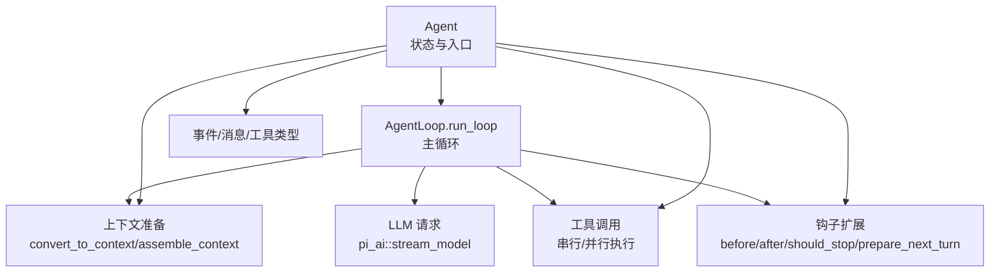
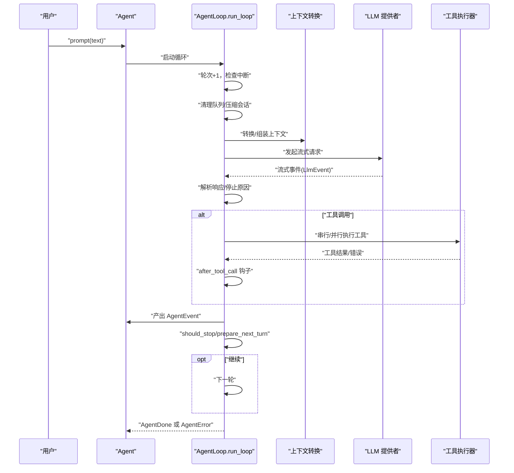
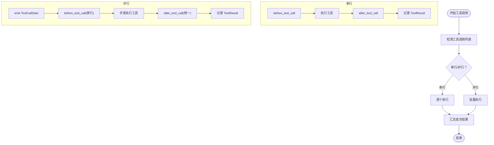
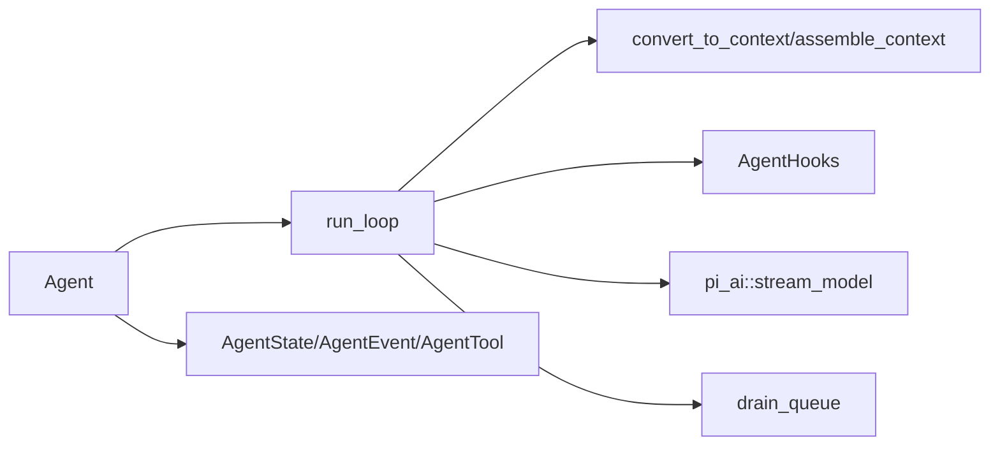
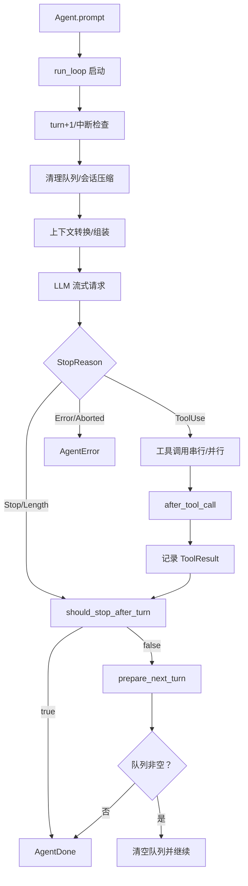

# 代理循环算法

<cite>
**本文引用的文件**
- [agent_loop.rs](file://crates/pi-agent-core/src/agent_loop.rs)
- [agent.rs](file://crates/pi-agent-core/src/agent.rs)
- [types.rs](file://crates/pi-agent-core/src/types.rs)
- [hooks.rs](file://crates/pi-agent-core/src/hooks.rs)
- [convert.rs](file://crates/pi-agent-core/src/convert.rs)
- [queues.rs](file://crates/pi-agent-core/src/queues.rs)
- [loop_example.rs](file://crates/pi-agent-core/examples/loop_example.rs)
- [agent_loop.rs（测试）](file://crates/pi-agent-core/tests/agent_loop.rs)
</cite>

## 目录
1. [简介](#简介)
2. [项目结构](#项目结构)
3. [核心组件](#核心组件)
4. [架构总览](#架构总览)
5. [详细组件分析](#详细组件分析)
6. [依赖关系分析](#依赖关系分析)
7. [性能考量](#性能考量)
8. [故障排除指南](#故障排除指南)
9. [结论](#结论)
10. [附录](#附录)

## 简介
本文件系统性阐述代理循环算法（AgentLoop）在 Rust 实现中的设计与运行机制，重点覆盖：
- 多轮对话循环的生命周期与控制流
- 上下文准备、LLM 请求构建、响应处理、工具调用执行、状态更新等关键阶段
- 事件流的生成与传播（AgentEvent）
- 循环控制逻辑（最大轮次限制、停止条件、中断处理）
- 钩子扩展点（上下文转换、请求前钩子、工具前后钩子、每轮准备、停止判定）
- 工具执行模式（串行/并行）与更新回调
- 使用示例、最佳实践与故障排除

## 项目结构
围绕 AgentLoop 的核心文件组织如下：
- 核心循环与事件流：agent_loop.rs
- 代理状态与入口：agent.rs
- 类型与事件：types.rs
- 钩子接口：hooks.rs
- 上下文转换：convert.rs
- 队列操作：queues.rs
- 示例与测试：examples/loop_example.rs、tests/agent_loop.rs

图表来源
- [agent.rs:153-208](file://crates/pi-agent-core/src/agent.rs#L153-L208)
- [agent_loop.rs:153-859](file://crates/pi-agent-core/src/agent_loop.rs#L153-L859)
- [convert.rs:95-155](file://crates/pi-agent-core/src/convert.rs#L95-L155)
- [hooks.rs:12-162](file://crates/pi-agent-core/src/hooks.rs#L12-L162)

章节来源
- [agent.rs:14-281](file://crates/pi-agent-core/src/agent.rs#L14-L281)
- [agent_loop.rs:153-859](file://crates/pi-agent-core/src/agent_loop.rs#L153-L859)
- [types.rs:407-496](file://crates/pi-agent-core/src/types.rs#L407-L496)
- [hooks.rs:12-162](file://crates/pi-agent-core/src/hooks.rs#L12-L162)
- [convert.rs:95-155](file://crates/pi-agent-core/src/convert.rs#L95-L155)
- [queues.rs:4-9](file://crates/pi-agent-core/src/queues.rs#L4-L9)

## 核心组件
- Agent：封装共享状态（AgentState），提供 prompt/run 接口，触发 AgentLoop.run_loop 并暴露事件流。
- AgentState：持有消息、工具、配置、取消令牌、队列与请求覆盖等。
- AgentLoop.run_loop：主循环，按轮次推进，驱动上下文准备、LLM 请求、工具调用、状态更新与事件产出。
- AgentEvent：事件枚举，覆盖轮开始、请求前、LLM 流事件、工具调用开始/更新/结束、完成/错误、会话压缩等。
- 钩子：before_provider_request、before_tool_call、after_tool_call、should_stop_after_turn、prepare_next_turn、transform_context、convert_to_llm。
- 工具与结果：AgentTool、AgentToolResult、AgentToolOutput；支持串行/并行执行与更新回调。

章节来源
- [agent.rs:14-281](file://crates/pi-agent-core/src/agent.rs#L14-L281)
- [agent_loop.rs:153-859](file://crates/pi-agent-core/src/agent_loop.rs#L153-L859)
- [types.rs:407-496](file://crates/pi-agent-core/src/types.rs#L407-L496)
- [hooks.rs:12-162](file://crates/pi-agent-core/src/hooks.rs#L12-L162)

## 架构总览
AgentLoop 的运行时由 Agent 驱动，通过 run_loop 产生事件流。事件流贯穿以下阶段：
- 轮次初始化与中断检查
- 队列清理与会话压缩
- 上下文转换与组装
- LLM 请求与事件回放
- 响应解析与停止条件
- 工具调用（串行/并行）
- 每轮准备与后续队列处理
- 结束或继续下一轮

图表来源
- [agent.rs:177-208](file://crates/pi-agent-core/src/agent.rs#L177-L208)
- [agent_loop.rs:153-859](file://crates/pi-agent-core/src/agent_loop.rs#L153-L859)

## 详细组件分析

### AgentLoop 主循环与事件流
- 轮次控制：每次进入循环先自增 turn，随后检查取消令牌与 max_turns。
- 中断处理：若取消，立即发出 AgentError 并返回。
- 队列与压缩：先清空 steering 队列，再尝试会话压缩（估算 token、准备压缩、摘要生成并写回状态）。
- 上下文准备：可选 transform_context 钩子；可选 convert_to_llm 钩子；最终通过 assemble_context 组装 Context。
- LLM 请求：根据模型能力应用思考级别（ThinkingConfig），发送流式请求，逐个回放 LlmEvent。
- 响应处理：记录 Assistant 消息；依据 StopReason 决定是否继续或终止。
- 工具调用：提取 ToolCall 列表，按全局/工具级串行策略执行；串行路径逐个 before/execute/after；并行路径先 before 后并发执行，最后统一 after。
- 每轮准备：prepare_next_turn 可动态调整 messages/model/thinking_level/stream_options。
- 结束条件：should_stop_after_turn 返回 true 或 batch_results 全部 terminate。

章节来源
- [agent_loop.rs:153-859](file://crates/pi-agent-core/src/agent_loop.rs#L153-L859)
- [agent_loop.rs:47-97](file://crates/pi-agent-core/src/agent_loop.rs#L47-L97)
- [agent_loop.rs:99-151](file://crates/pi-agent-core/src/agent_loop.rs#L99-L151)
- [agent_loop.rs:192-206](file://crates/pi-agent-core/src/agent_loop.rs#L192-L206)
- [agent_loop.rs:208-354](file://crates/pi-agent-core/src/agent_loop.rs#L208-L354)
- [agent_loop.rs:380-459](file://crates/pi-agent-core/src/agent_loop.rs#L380-L459)
- [agent_loop.rs:461-859](file://crates/pi-agent-core/src/agent_loop.rs#L461-L859)

### 上下文准备与 LLM 请求构建
- transform_context：对原始消息进行变换，返回新消息列表用于后续转换。
- convert_to_llm：将 AgentMessage 转换为 LLM Message 列表；assemble_context 将系统提示、消息与工具列表组装为 Context。
- 思考级别：当模型具备推理能力时，根据 ThinkingLevel 设置 ThinkingConfig 的预算与努力度。
- 请求覆盖：before_provider_request 钩子可返回 Context/StreamOptions 的覆盖项。

章节来源
- [convert.rs:9-89](file://crates/pi-agent-core/src/convert.rs#L9-L89)
- [convert.rs:95-155](file://crates/pi-agent-core/src/convert.rs#L95-L155)
- [hooks.rs:70-109](file://crates/pi-agent-core/src/hooks.rs#L70-L109)
- [agent_loop.rs:208-354](file://crates/pi-agent-core/src/agent_loop.rs#L208-L354)

### 工具调用执行流程
- 串行模式：逐个 before_tool_call -> 执行 -> after_tool_call；支持工具更新回调（ToolUpdateCallback）。
- 并行模式：先 emit ToolCallStart；依次 before_tool_call（串行）；然后并发执行工具；最后统一 after_tool_call。
- 结果合并：将每个工具的结果写入 AgentMessage::ToolResult，并参与 should_stop/terminate 判定。

图表来源
- [agent_loop.rs:461-859](file://crates/pi-agent-core/src/agent_loop.rs#L461-L859)

章节来源
- [agent_loop.rs:461-859](file://crates/pi-agent-core/src/agent_loop.rs#L461-L859)

### 事件流与状态更新
- 事件类型：TurnStart、BeforeProviderRequest、LlmEvent、ToolCallStart/Update/End、AgentDone、AgentError、SessionCompacted。
- 状态更新：每轮结束后将 Assistant/ToolResult 写入消息历史；根据队列与钩子决定是否继续。

章节来源
- [types.rs:456-491](file://crates/pi-agent-core/src/types.rs#L456-L491)
- [agent_loop.rs:391-459](file://crates/pi-agent-core/src/agent_loop.rs#L391-L459)
- [agent_loop.rs:663-674](file://crates/pi-agent-core/src/agent_loop.rs#L663-L674)

### 循环控制逻辑
- 最大轮次：max_turns 为 None 表示无硬上限；超过上限发出 AgentError。
- 停止条件：StopReason 为 Stop/Length 时，调用 should_stop_after_turn；若返回 true，则 AgentDone。
- 中断处理：取消令牌被取消时发出 AgentError。
- 继续条件：若 follow_up_queue 或 steering_queue 非空，先清空队列后继续。

章节来源
- [agent_loop.rs:160-180](file://crates/pi-agent-core/src/agent_loop.rs#L160-L180)
- [agent_loop.rs:399-459](file://crates/pi-agent-core/src/agent_loop.rs#L399-L459)
- [agent_loop.rs:418-434](file://crates/pi-agent-core/src/agent_loop.rs#L418-L434)

### 钩子扩展点
- before_provider_request：可修改 Context/StreamOptions。
- before_tool_call：可阻断工具调用并给出理由。
- after_tool_call：可改写内容/错误/终止标志。
- should_stop_after_turn：基于当前消息与助手响应决定是否停止。
- prepare_next_turn：动态调整 messages/model/thinking_level/stream_options。
- transform_context：对原始消息进行变换。
- convert_to_llm：自定义将消息转为 LLM 输入。

章节来源
- [hooks.rs:12-162](file://crates/pi-agent-core/src/hooks.rs#L12-L162)
- [agent_loop.rs:99-151](file://crates/pi-agent-core/src/agent_loop.rs#L99-L151)
- [agent_loop.rs:318-344](file://crates/pi-agent-core/src/agent_loop.rs#L318-L344)

## 依赖关系分析
- Agent 依赖 AgentLoop.run_loop 与 pi_ai 的流式模型接口。
- AgentLoop 依赖 convert.rs 进行消息到 LLM 的转换与上下文组装。
- AgentLoop 依赖 hooks.rs 定义的钩子接口。
- AgentLoop 依赖 queues.rs 对 steering/follow_up 队列进行清理。
- AgentState 包含 CancelToken、队列与 provider_request_override，支撑中断与请求覆盖。

图表来源
- [agent.rs:14-281](file://crates/pi-agent-core/src/agent.rs#L14-L281)
- [agent_loop.rs:153-859](file://crates/pi-agent-core/src/agent_loop.rs#L153-L859)
- [convert.rs:95-155](file://crates/pi-agent-core/src/convert.rs#L95-L155)
- [hooks.rs:12-162](file://crates/pi-agent-core/src/hooks.rs#L12-L162)
- [queues.rs:4-9](file://crates/pi-agent-core/src/queues.rs#L4-L9)

章节来源
- [agent.rs:14-281](file://crates/pi-agent-core/src/agent.rs#L14-L281)
- [agent_loop.rs:153-859](file://crates/pi-agent-core/src/agent_loop.rs#L153-L859)
- [convert.rs:95-155](file://crates/pi-agent-core/src/convert.rs#L95-L155)
- [hooks.rs:12-162](file://crates/pi-agent-core/src/hooks.rs#L12-L162)
- [queues.rs:4-9](file://crates/pi-agent-core/src/queues.rs#L4-L9)

## 性能考量
- 会话压缩：在每轮开始前评估 token 数量，必要时进行摘要压缩，减少上下文长度，提升吞吐与成本效率。
- 思考级别：仅在模型具备推理能力时启用 ThinkingConfig，避免不必要的开销。
- 工具执行模式：并行执行可显著缩短端到端时间，但需注意资源竞争与顺序依赖；串行更安全。
- 更新回调：工具执行过程中的增量输出通过异步通道推送，避免阻塞主循环。
- 取消与中断：通过 CancellationToken 快速短路，避免无效计算。

章节来源
- [agent_loop.rs:47-97](file://crates/pi-agent-core/src/agent_loop.rs#L47-L97)
- [agent_loop.rs:282-306](file://crates/pi-agent-core/src/agent_loop.rs#L282-L306)
- [agent_loop.rs:563-618](file://crates/pi-agent-core/src/agent_loop.rs#L563-L618)

## 故障排除指南
- 最大轮次超限：检查 max_turns 配置，确认业务期望的轮次上限。
- 中断/取消：调用 Agent.abort() 触发取消，循环将返回 AgentError("aborted")。
- LLM 错误：StopReason::Error 或流中 Error 事件，错误信息来自助手消息或流事件。
- 未知工具：工具名未注册时返回错误内容并继续，确保工具注册完整。
- 队列堆积：steering/follow_up 队列未及时消费导致循环卡住，检查队列模式与消费逻辑。
- 上下文为空：run() 在无消息或最后一条是 Assistant 消息时返回错误，确保消息序列合法。

章节来源
- [agent_loop.rs:160-180](file://crates/pi-agent-core/src/agent_loop.rs#L160-L180)
- [agent_loop.rs:436-448](file://crates/pi-agent-core/src/agent_loop.rs#L436-L448)
- [agent_loop.rs:582-585](file://crates/pi-agent-core/src/agent_loop.rs#L582-L585)
- [agent_loop.rs:418-434](file://crates/pi-agent-core/src/agent_loop.rs#L418-L434)
- [agent.rs:223-243](file://crates/pi-agent-core/src/agent.rs#L223-L243)

## 结论
AgentLoop 通过清晰的阶段划分与丰富的钩子扩展，实现了可插拔、可观测、可控的多轮对话循环。其事件驱动的设计便于集成外部观察者与中间件，工具执行的串并行策略兼顾了灵活性与性能。配合会话压缩与思考级别控制，可在成本与效果之间取得平衡。

## 附录

### 使用示例与最佳实践
- 基础使用：参考示例程序，创建 Agent、注册工具、订阅事件并消费流。
- 事件监听：根据 AgentEvent 分支处理文本增量、工具调用、完成/错误等。
- 错误处理：捕获 AgentError 并根据错误类型采取重试/降级/终止策略。
- 性能优化：合理设置 max_turns、选择合适的工具执行模式、启用会话压缩与思考级别。
- 钩子使用：利用 before_provider_request/after_tool_call 等钩子实现业务定制与可观测性增强。

章节来源
- [loop_example.rs:1-123](file://crates/pi-agent-core/examples/loop_example.rs#L1-L123)
- [agent_loop.rs:153-859](file://crates/pi-agent-core/src/agent_loop.rs#L153-L859)

### 关键流程图（代码级映射）

图表来源
- [agent.rs:177-208](file://crates/pi-agent-core/src/agent.rs#L177-L208)
- [agent_loop.rs:153-859](file://crates/pi-agent-core/src/agent_loop.rs#L153-L859)