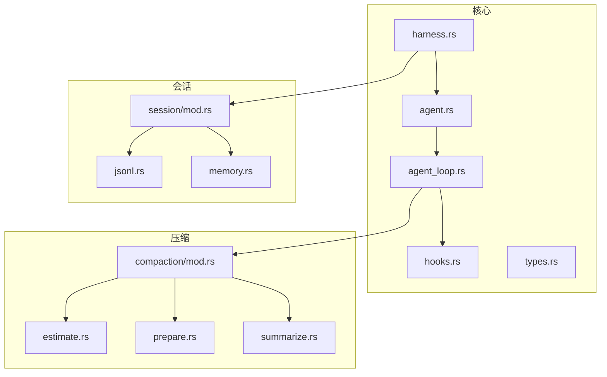
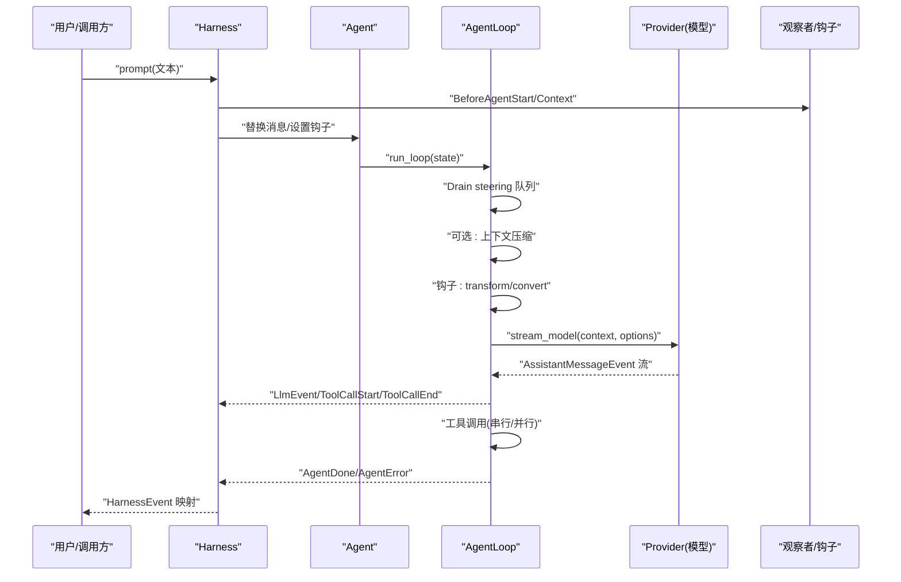
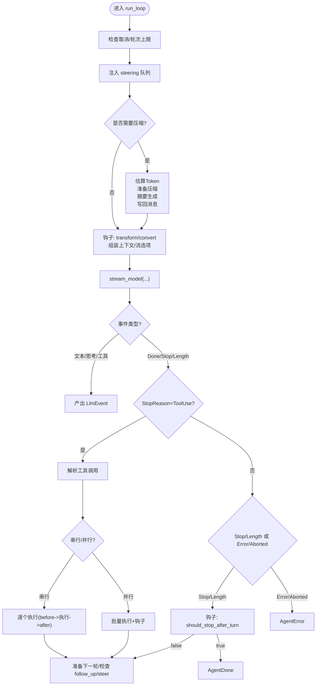
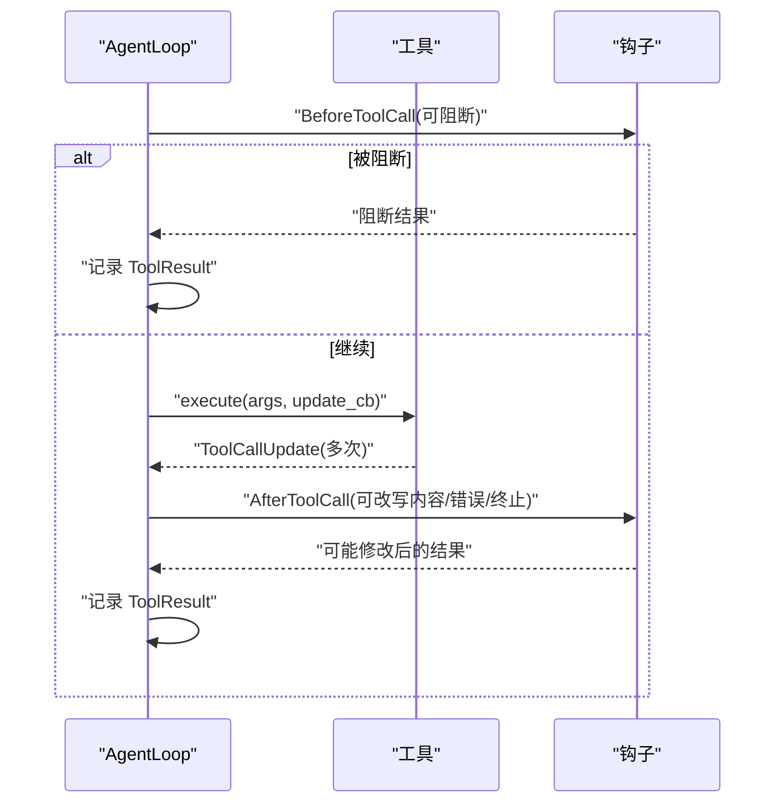
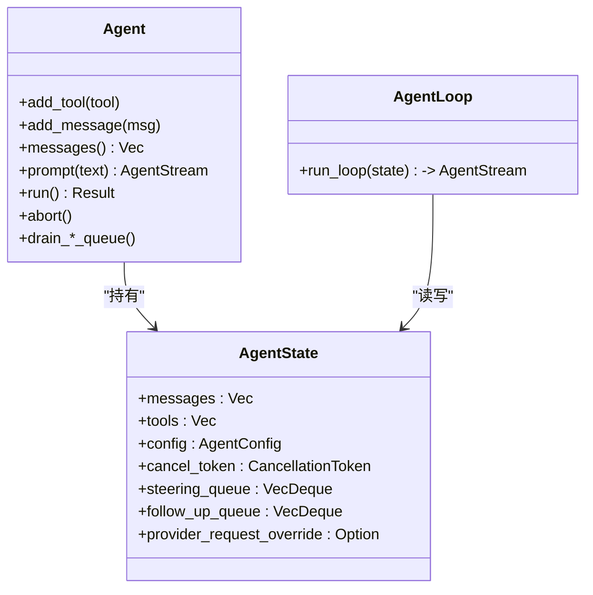
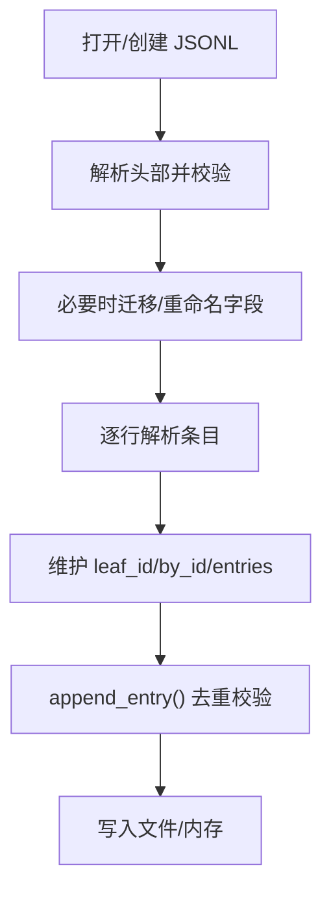
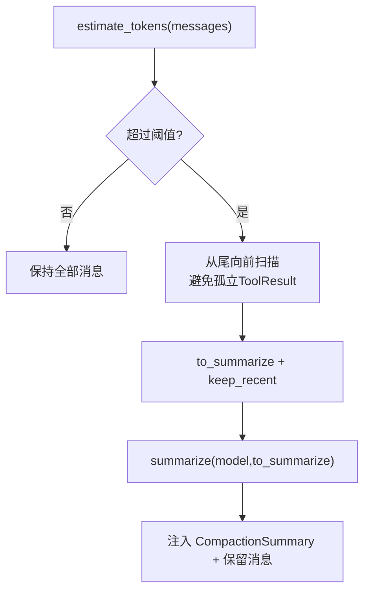
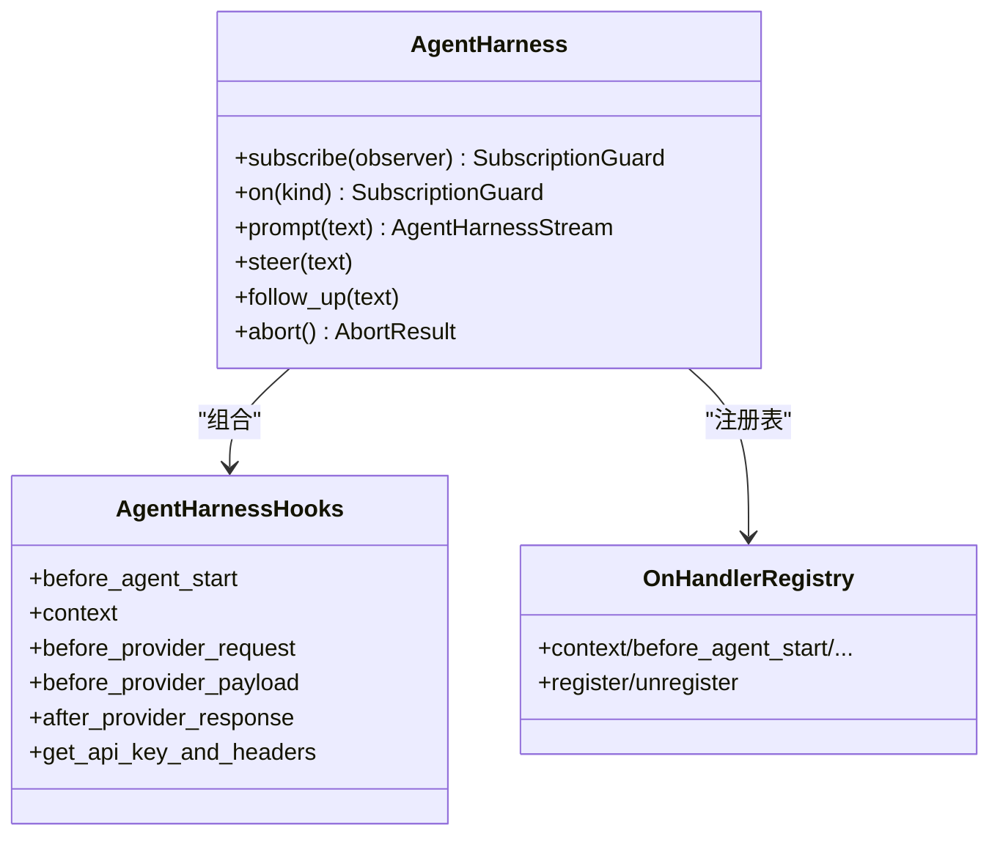
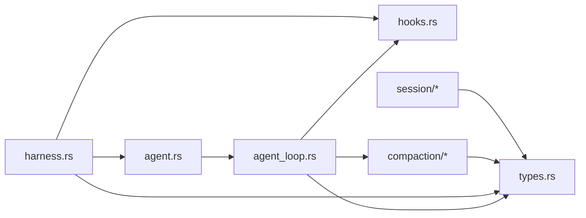

# 代理核心引擎

<cite>
**本文引用的文件**
- [lib.rs](file://crates/pi-agent-core/src/lib.rs)
- [agent_loop.rs](file://crates/pi-agent-core/src/agent_loop.rs)
- [harness.rs](file://crates/pi-agent-core/src/harness.rs)
- [hooks.rs](file://crates/pi-agent-core/src/hooks.rs)
- [agent.rs](file://crates/pi-agent-core/src/agent.rs)
- [types.rs](file://crates/pi-agent-core/src/types.rs)
- [mod.rs（会话模块）](file://crates/pi-agent-core/src/session/mod.rs)
- [jsonl.rs（会话 JSONL 存储）](file://crates/pi-agent-core/src/session/jsonl.rs)
- [memory.rs（内存会话存储）](file://crates/pi-agent-core/src/session/memory.rs)
- [mod.rs（压缩模块）](file://crates/pi-agent-core/src/compaction/mod.rs)
- [estimate.rs（Token 估算）](file://crates/pi-agent-core/src/compaction/estimate.rs)
- [prepare.rs（压缩准备）](file://crates/pi-agent-core/src/compaction/prepare.rs)
- [summarize.rs（压缩摘要）](file://crates/pi-agent-core/src/compaction/summarize.rs)
- [loop_example.rs（循环示例）](file://crates/pi-agent-core/examples/loop_example.rs)
</cite>

## 目录
1. [简介](#简介)
2. [项目结构](#项目结构)
3. [核心组件](#核心组件)
4. [架构总览](#架构总览)
5. [详细组件分析](#详细组件分析)
6. [依赖关系分析](#依赖关系分析)
7. [性能考量](#性能考量)
8. [故障排除指南](#故障排除指南)
9. [结论](#结论)
10. [附录：使用模式与示例路径](#附录使用模式与示例路径)

## 简介
本文件面向“代理核心引擎”（pi-agent-core）的技术文档，聚焦以下主题：
- Agent 循环算法：工具调用机制、事件流处理、状态管理与停止条件
- 会话管理系统：会话持久化、JSONL 格式支持、会话分支与合并（树形结构）
- 上下文压缩与优化：Token 计量、压缩策略、思维级别控制
- 钩子与观察者系统：AgentHarness 的事件监听与扩展点
- 性能优化与故障排除建议
- 具体使用模式与示例路径

本指南力求对初学者友好，同时为有经验的开发者提供足够的技术深度。

## 项目结构
pi-agent-core 采用按功能域划分的模块组织方式，核心模块如下：
- agent 与 agent_loop：Agent 生命周期与主循环
- harness：对外的统一入口与事件桥接层
- hooks：Agent 内部钩子与外部观察者
- compaction：上下文压缩与摘要
- session：会话存储与 JSONL 支持
- types：公共类型定义（消息、工具、配置等）

图示来源
- [agent.rs:1-282](file://crates/pi-agent-core/src/agent.rs#L1-L282)
- [agent_loop.rs:1-860](file://crates/pi-agent-core/src/agent_loop.rs#L1-L860)
- [harness.rs:1-986](file://crates/pi-agent-core/src/harness.rs#L1-L986)
- [hooks.rs:1-162](file://crates/pi-agent-core/src/hooks.rs#L1-L162)
- [types.rs:1-657](file://crates/pi-agent-core/src/types.rs#L1-L657)
- [mod.rs（压缩模块）:1-6](file://crates/pi-agent-core/src/compaction/mod.rs#L1-L6)
- [estimate.rs:1-94](file://crates/pi-agent-core/src/compaction/estimate.rs#L1-L94)
- [prepare.rs:1-110](file://crates/pi-agent-core/src/compaction/prepare.rs#L1-L110)
- [summarize.rs:1-111](file://crates/pi-agent-core/src/compaction/summarize.rs#L1-L111)
- [mod.rs（会话模块）:1-126](file://crates/pi-agent-core/src/session/mod.rs#L1-L126)
- [jsonl.rs:1-559](file://crates/pi-agent-core/src/session/jsonl.rs#L1-L559)
- [memory.rs:1-126](file://crates/pi-agent-core/src/session/memory.rs#L1-L126)

章节来源
- [lib.rs:1-47](file://crates/pi-agent-core/src/lib.rs#L1-L47)

## 核心组件
- Agent：持有 AgentState（消息、工具、配置、取消令牌、队列），负责运行循环与工具调用
- AgentLoop：实现主循环，处理上下文构建、LLM 请求、工具调用、事件产出与停止条件
- Harness：对外统一入口，桥接 Agent 事件到 Harness 事件，支持钩子与观察者
- Hooks：Agent 内部钩子（工具前后、上下文转换、每轮准备、停止判断等）
- Types：消息、工具、配置、事件、思维级别、执行模式等类型
- Session：会话头、条目、JSONL 文件格式、内存存储、版本迁移
- Compaction：Token 估算、压缩准备、摘要生成

章节来源
- [agent.rs:1-282](file://crates/pi-agent-core/src/agent.rs#L1-L282)
- [agent_loop.rs:1-860](file://crates/pi-agent-core/src/agent_loop.rs#L1-L860)
- [harness.rs:1-986](file://crates/pi-agent-core/src/harness.rs#L1-L986)
- [hooks.rs:1-162](file://crates/pi-agent-core/src/hooks.rs#L1-L162)
- [types.rs:1-657](file://crates/pi-agent-core/src/types.rs#L1-L657)
- [mod.rs（会话模块）:1-126](file://crates/pi-agent-core/src/session/mod.rs#L1-L126)
- [mod.rs（压缩模块）:1-6](file://crates/pi-agent-core/src/compaction/mod.rs#L1-L6)

## 架构总览
下图展示从 Harness 到 Agent、再到 LLM 的端到端流程，以及压缩与工具调用的关键节点。

图示来源
- [harness.rs:520-677](file://crates/pi-agent-core/src/harness.rs#L520-L677)
- [agent.rs:195-208](file://crates/pi-agent-core/src/agent.rs#L195-L208)
- [agent_loop.rs:153-434](file://crates/pi-agent-core/src/agent_loop.rs#L153-L434)

## 详细组件分析

### Agent 循环算法与事件流
- 主循环流程
  - 启动时检查取消令牌与最大轮次
  - 注入 steering 队列消息
  - 可选上下文压缩（估算 Token、准备压缩、摘要生成）
  - 钩子 transform/convert 控制上下文
  - 构建上下文与流选项（含思维级别）
  - 发起 LLM 流请求，逐事件转发
  - 处理停止原因：Stop/Length/ToolUse/Error/Aborted
  - 工具调用：串行或并行；支持 before/after 钩子与更新回调
  - 每轮结束可准备下一轮（钩子）
- 关键事件
  - TurnStart、BeforeProviderRequest、LlmEvent、ToolCallStart/Update/End、AgentDone、AgentError、SessionCompacted

图示来源
- [agent_loop.rs:162-800](file://crates/pi-agent-core/src/agent_loop.rs#L162-L800)

章节来源
- [agent_loop.rs:1-860](file://crates/pi-agent-core/src/agent_loop.rs#L1-L860)
- [types.rs:454-491](file://crates/pi-agent-core/src/types.rs#L454-L491)

### 工具调用机制（串行/并行）
- 串行模式：逐个工具调用，支持 before 钩子阻断、执行、after 钩子后处理
- 并行模式：先触发所有 ToolCallStart，再并行执行工具，最后统一 after 钩子处理
- 更新回调：工具执行过程中可通过回调增量推送更新
- 结果归档：将 ToolResult 追加到消息历史

图示来源
- [agent_loop.rs:482-798](file://crates/pi-agent-core/src/agent_loop.rs#L482-L798)

章节来源
- [agent_loop.rs:465-798](file://crates/pi-agent-core/src/agent_loop.rs#L465-L798)
- [types.rs:355-405](file://crates/pi-agent-core/src/types.rs#L355-L405)

### 事件流与状态管理
- AgentState：保存消息、工具、配置、取消令牌、steering/follow_up 队列、提供者请求覆盖
- Agent：封装状态读写、运行 guard、队列操作、技能/模板调用、运行/中止
- AgentLoop：在每次轮次中读取/写入状态，产出 AgentEvent，并通过 Harness 映射为 HarnessEvent

图示来源
- [agent.rs:14-67](file://crates/pi-agent-core/src/agent.rs#L14-L67)
- [agent_loop.rs:153-160](file://crates/pi-agent-core/src/agent_loop.rs#L153-L160)

章节来源
- [agent.rs:1-282](file://crates/pi-agent-core/src/agent.rs#L1-L282)
- [types.rs:407-443](file://crates/pi-agent-core/src/types.rs#L407-L443)

### 会话管理系统（JSONL、内存、树形）
- JSONL 会话存储
  - 头部包含版本、会话 ID、时间戳、工作目录、父会话路径
  - 条目类型：message、compaction、leaf 等
  - 打开时进行版本迁移与字段重命名（如 hookMessage -> custom）
  - 支持追加条目、维护 leaf_id、去重校验
- 内存会话存储
  - 用于测试与临时场景，行为与 JSONL 对齐
- 会话消息映射
  - 将 AgentMessage 映射为 StoredAgentMessage，过滤 SystemPrompt/CompactionSummary

图示来源
- [jsonl.rs:81-220](file://crates/pi-agent-core/src/session/jsonl.rs#L81-L220)
- [memory.rs:12-60](file://crates/pi-agent-core/src/session/memory.rs#L12-L60)
- [mod.rs（会话模块）:21-125](file://crates/pi-agent-core/src/session/mod.rs#L21-L125)

章节来源
- [jsonl.rs:1-559](file://crates/pi-agent-core/src/session/jsonl.rs#L1-L559)
- [memory.rs:1-126](file://crates/pi-agent-core/src/session/memory.rs#L1-L126)
- [mod.rs（会话模块）:1-126](file://crates/pi-agent-core/src/session/mod.rs#L1-L126)

### 上下文压缩与优化（Token 计量、策略、思维级别）
- Token 估算
  - 文本长度估算、块级估算、助手用量优先
- 压缩准备
  - 判断是否超过阈值（保留 + 最近保留）
  - 从前往后扫描，避免孤立 ToolResult，保留最近若干 Token
- 摘要生成
  - 将可识别的消息转为 LLM Message，附加“请总结”提示
  - 使用取消令牌与最大输出限制
- 思维级别控制
  - 根据模型能力与 ThinkingLevel 设置 ThinkingConfig 的预算与 effort
  - Off 时禁用思维

图示来源
- [estimate.rs:4-54](file://crates/pi-agent-core/src/compaction/estimate.rs#L4-L54)
- [prepare.rs:8-48](file://crates/pi-agent-core/src/compaction/prepare.rs#L8-L48)
- [summarize.rs:6-110](file://crates/pi-agent-core/src/compaction/summarize.rs#L6-L110)
- [agent_loop.rs:282-306](file://crates/pi-agent-core/src/agent_loop.rs#L282-L306)

章节来源
- [estimate.rs:1-94](file://crates/pi-agent-core/src/compaction/estimate.rs#L1-L94)
- [prepare.rs:1-110](file://crates/pi-agent-core/src/compaction/prepare.rs#L1-L110)
- [summarize.rs:1-111](file://crates/pi-agent-core/src/compaction/summarize.rs#L1-L111)
- [agent_loop.rs:282-306](file://crates/pi-agent-core/src/agent_loop.rs#L282-L306)
- [types.rs:13-52](file://crates/pi-agent-core/src/types.rs#L13-L52)

### 钩子与观察者系统（AgentHarness）
- 钩子类型
  - Agent 内部：before_provider_request、before_tool_call、after_tool_call、should_stop_after_turn、prepare_next_turn、transform_context、convert_to_llm
  - Harness：before_agent_start、context、before_provider_request、before_provider_payload、after_provider_response、get_api_key_and_headers
- 观察者
  - 订阅任意 HarnessEvent，支持多观察者与订阅生命周期
- 提供者请求钩子链
  - 支持外部钩子与内部钩子叠加，支持流选项补丁与头部合并

图示来源
- [harness.rs:225-482](file://crates/pi-agent-core/src/harness.rs#L225-L482)
- [hooks.rs:12-21](file://crates/pi-agent-core/src/hooks.rs#L12-L21)

章节来源
- [harness.rs:1-986](file://crates/pi-agent-core/src/harness.rs#L1-L986)
- [hooks.rs:1-162](file://crates/pi-agent-core/src/hooks.rs#L1-L162)

## 依赖关系分析
- 模块耦合
  - agent.rs 依赖 agent_loop.rs 与 types.rs
  - agent_loop.rs 依赖 hooks.rs、compaction/*、types.rs、pi_ai::types
  - harness.rs 依赖 agent.rs、hooks.rs、types.rs、pi_ai::types
  - session/* 与 compaction/* 独立于核心循环，通过类型与工具函数交互
- 外部依赖
  - pi_ai::types 提供模型、上下文、流选项、事件等类型
  - tokio_util::sync::CancellationToken 用于取消控制

图示来源
- [agent.rs:1-12](file://crates/pi-agent-core/src/agent.rs#L1-L12)
- [agent_loop.rs:1-24](file://crates/pi-agent-core/src/agent_loop.rs#L1-L24)
- [harness.rs:1-13](file://crates/pi-agent-core/src/harness.rs#L1-L13)
- [types.rs:1-10](file://crates/pi-agent-core/src/types.rs#L1-L10)

章节来源
- [lib.rs:1-47](file://crates/pi-agent-core/src/lib.rs#L1-L47)

## 性能考量
- 上下文压缩
  - 合理设置保留与最近保留 Token，避免频繁压缩
  - 在工具密集场景，优先保留最近消息以减少重复信息
- 思维级别
  - 高预算思维会增加 Token 消耗，仅在需要推理时启用
- 工具执行模式
  - 并行执行可提升吞吐，但需注意资源竞争与顺序依赖
- 事件与流
  - 使用异步流与选择器处理工具更新与执行完成，避免阻塞
- 取消与超时
  - 正确传递 CancellationToken，防止长时间阻塞

## 故障排除指南
- 常见错误与定位
  - AgentError：来自 LLM 错误、流未结束、钩子返回错误
  - SessionError：JSONL 版本不支持、条目重复、头部无效
  - CompactionError：摘要为空、摘要失败
- 排查步骤
  - 检查 AgentConfig 中 max_turns、thinking_level、tool_execution 是否合理
  - 检查钩子返回值与异常传播
  - 检查 JSONL 文件头版本与条目序列
  - 在工具执行中使用 ToolUpdateCallback 增量输出，便于定位卡顿
- 建议
  - 在开发阶段开启最小思维级别，逐步提高
  - 使用内存会话存储快速验证逻辑，再切换到 JSONL

章节来源
- [agent_loop.rs:202-206](file://crates/pi-agent-core/src/agent_loop.rs#L202-L206)
- [jsonl.rs:138-176](file://crates/pi-agent-core/src/session/jsonl.rs#L138-L176)
- [summarize.rs:105-107](file://crates/pi-agent-core/src/compaction/summarize.rs#L105-L107)

## 结论
本引擎以清晰的模块边界与丰富的钩子体系，提供了可扩展的 Agent 循环、灵活的会话存储与高效的上下文压缩能力。通过 Harness 的观察者与钩子机制，可在不侵入核心逻辑的前提下实现强大的定制化与可观测性。建议在生产环境中结合压缩阈值、思维级别与工具执行模式进行综合调优，并利用 JSONL 与内存存储在不同阶段进行验证与部署。

## 附录：使用模式与示例路径
- 基础循环示例
  - 示例展示了如何注册工具、发起对话、消费事件流
  - 示例路径：[loop_example.rs:1-123](file://crates/pi-agent-core/examples/loop_example.rs#L1-L123)
- Agent 与 Harness 基本用法
  - Agent::new -> add_tool/add_message -> prompt/run -> 事件消费
  - Harness::new -> with_hooks -> subscribe/on -> prompt -> 事件桥接
  - 示例路径：[agent.rs:54-215](file://crates/pi-agent-core/src/agent.rs#L54-L215)，[harness.rs:417-677](file://crates/pi-agent-core/src/harness.rs#L417-L677)
- 会话读写
  - 创建/打开 JSONL 文件，追加条目，读取元数据与叶子 ID
  - 示例路径：[jsonl.rs:20-220](file://crates/pi-agent-core/src/session/jsonl.rs#L20-L220)
- 上下文压缩
  - 估算 Token -> 准备压缩 -> 摘要 -> 注入消息
  - 示例路径：[estimate.rs:4-54](file://crates/pi-agent-core/src/compaction/estimate.rs#L4-L54)，[prepare.rs:8-48](file://crates/pi-agent-core/src/compaction/prepare.rs#L8-L48)，[summarize.rs:6-110](file://crates/pi-agent-core/src/compaction/summarize.rs#L6-L110)