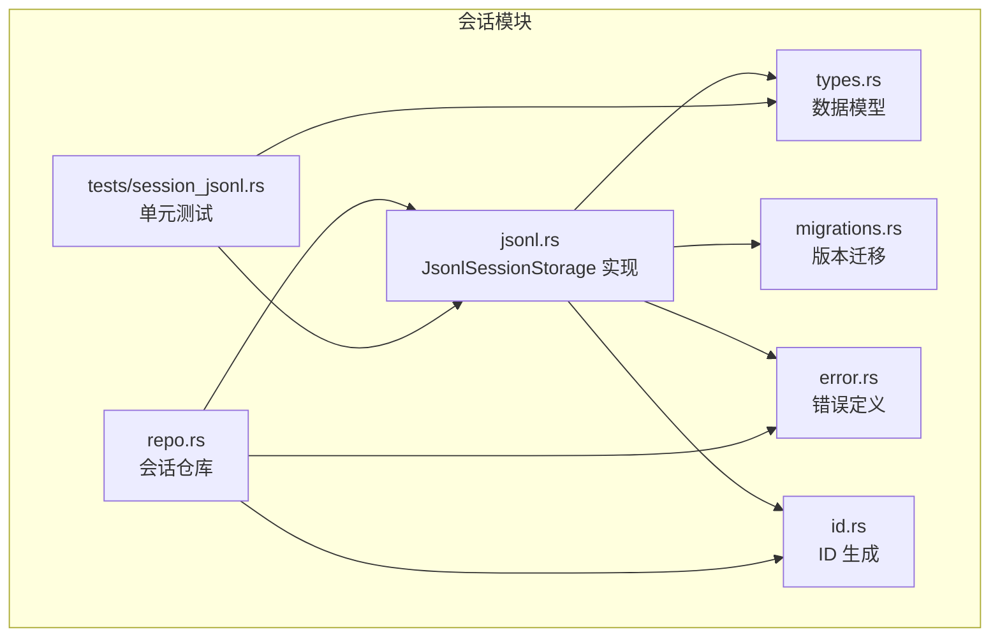
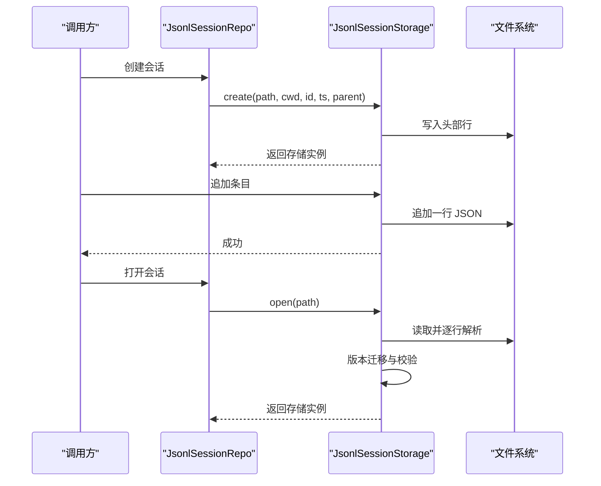
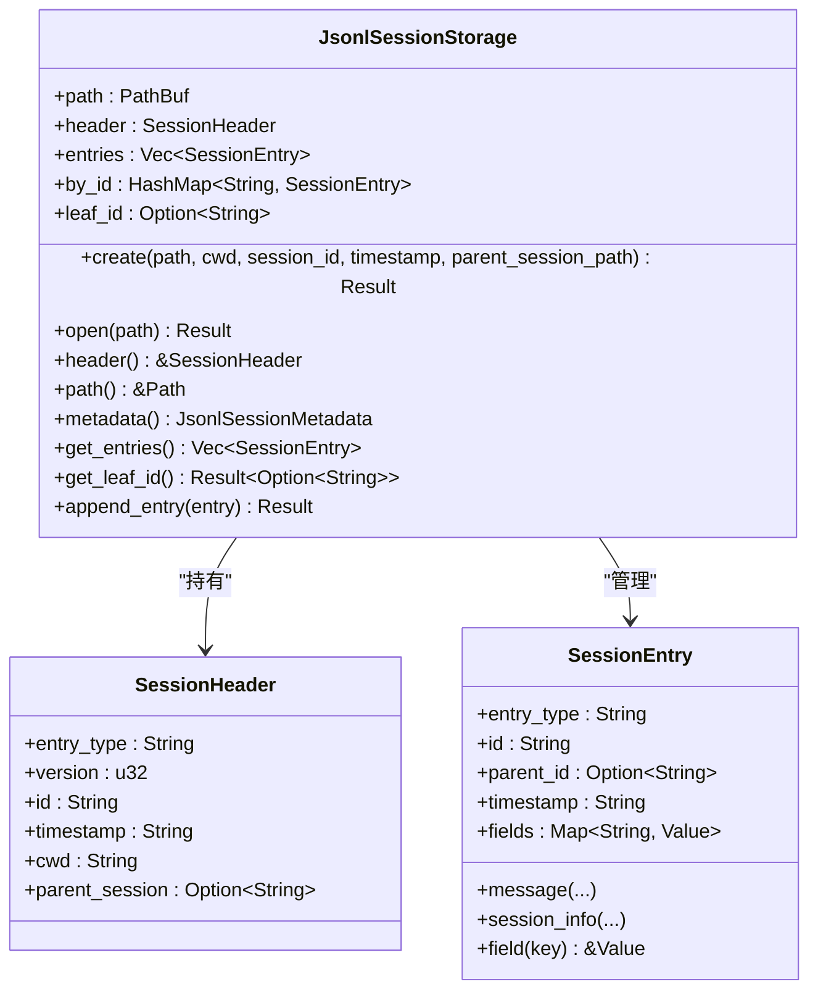
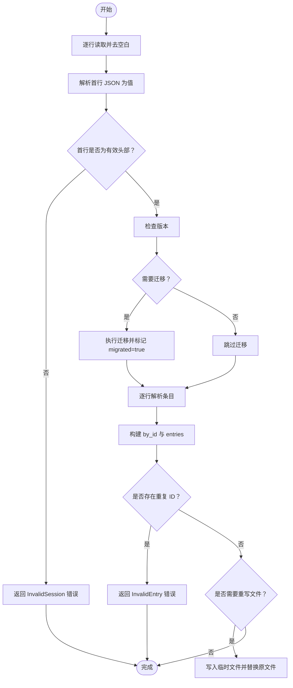
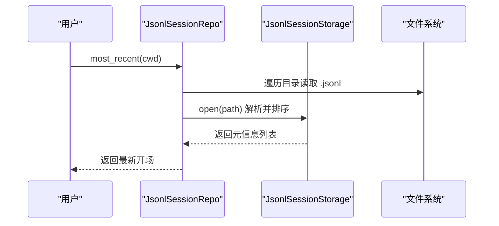
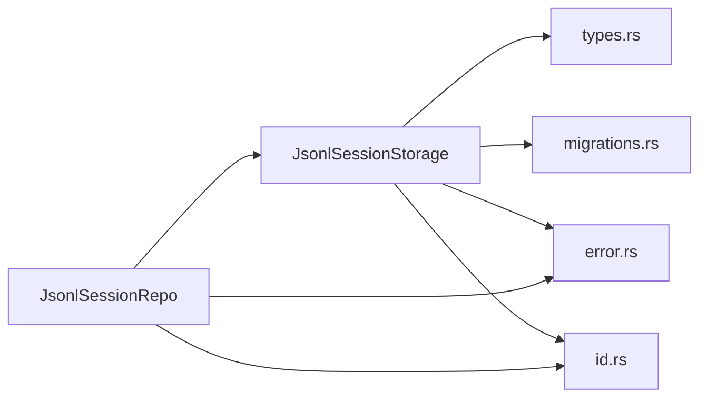

# JSONL 会话存储

<cite>
**本文引用的文件**
- [crates/pi-agent-core/src/session/jsonl.rs](file://crates/pi-agent-core/src/session/jsonl.rs)
- [crates/pi-agent-core/src/session/types.rs](file://crates/pi-agent-core/src/session/types.rs)
- [crates/pi-agent-core/src/session/migrations.rs](file://crates/pi-agent-core/src/session/migrations.rs)
- [crates/pi-agent-core/src/session/repo.rs](file://crates/pi-agent-core/src/session/repo.rs)
- [crates/pi-agent-core/src/session/error.rs](file://crates/pi-agent-core/src/session/error.rs)
- [crates/pi-agent-core/src/session/id.rs](file://crates/pi-agent-core/src/session/id.rs)
- [crates/pi-agent-core/tests/session_jsonl.rs](file://crates/pi-agent-core/tests/session_jsonl.rs)
</cite>

## 目录
1. [简介](#简介)
2. [项目结构](#项目结构)
3. [核心组件](#核心组件)
4. [架构总览](#架构总览)
5. [详细组件分析](#详细组件分析)
6. [依赖关系分析](#依赖关系分析)
7. [性能考量](#性能考量)
8. [故障排查指南](#故障排查指南)
9. [结论](#结论)
10. [附录](#附录)

## 简介
本文件为 JSONL 会话存储模块的技术文档，聚焦于 JsonlSessionStorage 的实现机制与使用方式。内容涵盖：
- JSON Lines 格式的序列化与反序列化流程
- JSONL 文件结构设计（头部、条目、字段、数据类型）
- 文件读写实现细节（流式处理、缓冲、错误处理）
- 性能特性与适用场景（大文件、顺序写入、并发写入限制）
- 最佳实践（数据完整性、备份、迁移）
- 使用模式与测试用例路径

## 项目结构
JSONL 会话存储位于 pi-agent-core crate 的 session 模块中，关键文件如下：
- jsonl.rs：JsonlSessionStorage 实现
- types.rs：SessionHeader、SessionEntry、StoredAgentMessage 等数据模型
- migrations.rs：会话版本迁移逻辑
- repo.rs：会话仓库，负责目录组织、创建、打开、列表、分叉
- error.rs：会话错误码与错误包装
- id.rs：会话与条目 ID 生成工具
- tests/session_jsonl.rs：JSONL 存储单元测试

图表来源
- [crates/pi-agent-core/src/session/jsonl.rs:1-559](file://crates/pi-agent-core/src/session/jsonl.rs#L1-L559)
- [crates/pi-agent-core/src/session/types.rs:1-177](file://crates/pi-agent-core/src/session/types.rs#L1-L177)
- [crates/pi-agent-core/src/session/migrations.rs:1-151](file://crates/pi-agent-core/src/session/migrations.rs#L1-L151)
- [crates/pi-agent-core/src/session/repo.rs:1-281](file://crates/pi-agent-core/src/session/repo.rs#L1-L281)
- [crates/pi-agent-core/src/session/error.rs:1-28](file://crates/pi-agent-core/src/session/error.rs#L1-L28)
- [crates/pi-agent-core/src/session/id.rs:1-54](file://crates/pi-agent-core/src/session/id.rs#L1-L54)
- [crates/pi-agent-core/tests/session_jsonl.rs:1-77](file://crates/pi-agent-core/tests/session_jsonl.rs#L1-L77)

章节来源
- [crates/pi-agent-core/src/session/jsonl.rs:1-559](file://crates/pi-agent-core/src/session/jsonl.rs#L1-L559)
- [crates/pi-agent-core/src/session/types.rs:1-177](file://crates/pi-agent-core/src/session/types.rs#L1-L177)
- [crates/pi-agent-core/src/session/migrations.rs:1-151](file://crates/pi-agent-core/src/session/migrations.rs#L1-L151)
- [crates/pi-agent-core/src/session/repo.rs:1-281](file://crates/pi-agent-core/src/session/repo.rs#L1-L281)
- [crates/pi-agent-core/src/session/error.rs:1-28](file://crates/pi-agent-core/src/session/error.rs#L1-L28)
- [crates/pi-agent-core/src/session/id.rs:1-54](file://crates/pi-agent-core/src/session/id.rs#L1-L54)
- [crates/pi-agent-core/tests/session_jsonl.rs:1-77](file://crates/pi-agent-core/tests/session_jsonl.rs#L1-L77)

## 核心组件
- JsonlSessionStorage：基于 JSON Lines 的只追加式会话存储，支持创建新会话、打开既有会话、追加条目、查询元信息与最新叶子节点 ID。
- 数据模型：
  - SessionHeader：会话头部，包含 type、version、id、timestamp、cwd、parentSession 等字段。
  - SessionEntry：会话条目，包含 type、id、parentId、timestamp 以及通过 Map 存放的动态字段。
  - StoredAgentMessage：消息体封装，支持 user、assistant、toolResult、bashExecution、custom、branchSummary 等角色。
- 迁移系统：自动将旧版本会话迁移到当前版本，并在必要时重写文件。
- 会话仓库 JsonlSessionRepo：负责按工作目录组织会话文件、创建、打开、列出、最新开场、分叉等。

章节来源
- [crates/pi-agent-core/src/session/jsonl.rs:10-297](file://crates/pi-agent-core/src/session/jsonl.rs#L10-L297)
- [crates/pi-agent-core/src/session/types.rs:5-177](file://crates/pi-agent-core/src/session/types.rs#L5-L177)
- [crates/pi-agent-core/src/session/migrations.rs:7-54](file://crates/pi-agent-core/src/session/migrations.rs#L7-L54)
- [crates/pi-agent-core/src/session/repo.rs:8-215](file://crates/pi-agent-core/src/session/repo.rs#L8-L215)

## 架构总览
JsonlSessionStorage 采用“头部 + 多行 JSON 条目”的纯文本格式，使用 BufReader 流式读取，逐行解析并进行版本迁移与校验；写入时以追加方式写入单行 JSON，保持顺序一致性。

图表来源
- [crates/pi-agent-core/src/session/repo.rs:29-46](file://crates/pi-agent-core/src/session/repo.rs#L29-L46)
- [crates/pi-agent-core/src/session/jsonl.rs:20-297](file://crates/pi-agent-core/src/session/jsonl.rs#L20-L297)

## 详细组件分析

### JsonlSessionStorage 类与方法
- 结构体字段
  - path：会话文件路径
  - header：会话头部
  - entries：已加载的条目列表
  - by_id：条目 ID 到条目的映射
  - leaf_id：最新叶子节点 ID（用于分叉定位）

- 关键方法
  - create：创建新会话文件，写入头部，返回存储实例
  - open：打开既有文件，流式读取并解析，执行版本迁移与校验
  - append_entry：追加一条 JSON 行到文件末尾
  - header/path/metadata/get_entries/get_leaf_id：查询元信息与状态

图表来源
- [crates/pi-agent-core/src/session/jsonl.rs:10-297](file://crates/pi-agent-core/src/session/jsonl.rs#L10-L297)
- [crates/pi-agent-core/src/session/types.rs:5-70](file://crates/pi-agent-core/src/session/types.rs#L5-L70)

章节来源
- [crates/pi-agent-core/src/session/jsonl.rs:10-297](file://crates/pi-agent-core/src/session/jsonl.rs#L10-L297)
- [crates/pi-agent-core/src/session/types.rs:5-70](file://crates/pi-agent-core/src/session/types.rs#L5-L70)

### JSONL 文件结构设计
- 文件首行：SessionHeader（type="session"，version 当前为 3，包含 id、timestamp、cwd、可选 parentSession）
- 后续每行：一个 SessionEntry 对象，包含 type、id、parentId、timestamp 与动态字段 Map
- 动态字段示例：message（StoredAgentMessage）、name（session_info）等

字段与数据类型要点
- SessionHeader
  - type: 字符串，固定为 "session"
  - version: 整数，当前为 3
  - id: 字符串，会话唯一标识
  - timestamp: 字符串，RFC3339 时间戳
  - cwd: 字符串，工作目录
  - parentSession: 可选字符串，父会话路径
- SessionEntry
  - type: 字符串，如 "message"、"session_info"、"compaction"
  - id: 字符串，条目唯一标识
  - parentId: 可选字符串，父条目 ID
  - timestamp: 字符串，RFC3339 时间戳
  - fields: Map<String, Value>，动态字段集合
- StoredAgentMessage
  - role: 字符串，枚举值："user"、"assistant"、"toolResult"、"bashExecution"、"custom"、"branchSummary"
  - 其他字段随角色变化，如 content、provider、model、usage、details 等

章节来源
- [crates/pi-agent-core/src/session/types.rs:5-177](file://crates/pi-agent-core/src/session/types.rs#L5-L177)

### 序列化与反序列化流程
- 写入流程（create/append_entry）
  - 将对象序列化为 JSON 字符串，写入一行
  - 追加写入使用 OpenOptions::append(true)，确保顺序一致性
- 读取流程（open）
  - 使用 BufReader 逐行读取
  - 跳过空行，对每行进行 trim 后解析为 JSON
  - 首行必须是有效 SessionHeader，且 type="session"、version=3
  - 其余行逐一解析为 SessionEntry，并构建 by_id 映射与 entries 列表
  - 若发现重复 ID，立即报错
- 版本迁移（migrate_session_values）
  - 支持从 v1/v2 自动迁移到 v3
  - v1->v2：补全 id、parentId、树形关系、替换 compaction 的索引字段为 ID
  - v2->v3：将 hookMessage 角色重命名为 custom

图表来源
- [crates/pi-agent-core/src/session/jsonl.rs:81-220](file://crates/pi-agent-core/src/session/jsonl.rs#L81-L220)
- [crates/pi-agent-core/src/session/migrations.rs:7-54](file://crates/pi-agent-core/src/session/migrations.rs#L7-L54)

章节来源
- [crates/pi-agent-core/src/session/jsonl.rs:81-220](file://crates/pi-agent-core/src/session/jsonl.rs#L81-L220)
- [crates/pi-agent-core/src/session/migrations.rs:7-54](file://crates/pi-agent-core/src/session/migrations.rs#L7-L54)

### 文件读写实现细节
- 流式处理
  - 读取：BufReader::lines() 逐行迭代，避免一次性加载整个文件
  - 写入：每次 append_entry 仅写入一行 JSON，适合持续追加
- 缓冲机制
  - 读取侧使用标准库 BufReader，默认缓冲区大小由系统决定
  - 写入侧使用标准库默认缓冲，无需手动设置
- 错误处理
  - 统一包装为 SessionError，区分 NotFound、InvalidSession、InvalidEntry、Storage、Unknown 等错误码
  - 在解析失败、版本不支持、重复 ID、文件不存在等场景抛出相应错误

章节来源
- [crates/pi-agent-core/src/session/jsonl.rs:81-297](file://crates/pi-agent-core/src/session/jsonl.rs#L81-L297)
- [crates/pi-agent-core/src/session/error.rs:3-27](file://crates/pi-agent-core/src/session/error.rs#L3-L27)

### 会话仓库与使用模式
- JsonlSessionRepo
  - 目录组织：按工作目录编码为子目录，避免同名冲突
  - 创建：生成时间戳+会话 ID 的文件名，创建新会话
  - 打开：直接打开指定路径或根据目标字符串匹配最近会话
  - 列表：扫描根目录下所有 .jsonl 文件，过滤并解析为元信息
  - 分叉：从源会话提取某条目到根的路径，重建目标会话并按序追加

图表来源
- [crates/pi-agent-core/src/session/repo.rs:140-155](file://crates/pi-agent-core/src/session/repo.rs#L140-L155)

章节来源
- [crates/pi-agent-core/src/session/repo.rs:1-281](file://crates/pi-agent-core/src/session/repo.rs#L1-L281)

## 依赖关系分析
- JsonlSessionStorage 依赖
  - types.rs：SessionHeader、SessionEntry、StoredAgentMessage
  - migrations.rs：版本迁移与重写
  - error.rs：错误码与错误包装
  - id.rs：ID 生成工具
- JsonlSessionRepo 依赖
  - jsonl.rs：创建与打开会话
  - id.rs：生成会话与条目 ID
  - error.rs：统一错误处理

图表来源
- [crates/pi-agent-core/src/session/jsonl.rs:1-8](file://crates/pi-agent-core/src/session/jsonl.rs#L1-L8)
- [crates/pi-agent-core/src/session/repo.rs:1-6](file://crates/pi-agent-core/src/session/repo.rs#L1-L6)

章节来源
- [crates/pi-agent-core/src/session/jsonl.rs:1-8](file://crates/pi-agent-core/src/session/jsonl.rs#L1-L8)
- [crates/pi-agent-core/src/session/repo.rs:1-6](file://crates/pi-agent-core/src/session/repo.rs#L1-L6)

## 性能考量
- 大文件处理
  - 读取采用流式逐行解析，内存占用与文件大小线性无关
  - 写入为顺序追加，避免随机 IO
- 随机访问
  - 不支持随机访问；若需定位特定条目，需遍历或引入额外索引
- 并发写入
  - 单进程追加写入安全；多进程同时写入可能产生竞态，建议外部协调或使用锁
- 版本迁移
  - 首次打开旧版本文件时会进行迁移与重写，可能带来一次性的磁盘写入成本
- 建议
  - 大量条目时优先顺序读取与追加
  - 如需频繁随机访问，考虑引入索引或切换为二进制格式

## 故障排查指南
常见问题与处理
- 打开文件时报“首行不是有效会话头部”
  - 检查首行是否为 JSON 对象且包含 type="session"、version=3
  - 参考：[crates/pi-agent-core/src/session/jsonl.rs:118-176](file://crates/pi-agent-core/src/session/jsonl.rs#L118-L176)
- 版本不受支持
  - 当 version > 3 时会报错；请升级运行环境或迁移至兼容版本
  - 参考：[crates/pi-agent-core/src/session/migrations.rs:36-41](file://crates/pi-agent-core/src/session/migrations.rs#L36-L41)
- 重复条目 ID
  - 追加或打开时检测到重复 ID，需修正数据或删除重复项
  - 参考：[crates/pi-agent-core/src/session/jsonl.rs:189-194](file://crates/pi-agent-core/src/session/jsonl.rs#L189-L194)
- 文件不存在或无法读取
  - 检查路径权限与文件存在性，错误码为 NotFound 或 Storage
  - 参考：[crates/pi-agent-core/src/session/jsonl.rs:83-88](file://crates/pi-agent-core/src/session/jsonl.rs#L83-L88)
- 分叉目标条目不存在
  - fork 时传入的 entry_id 不存在，需确认条目 ID 正确
  - 参考：[crates/pi-agent-core/src/session/repo.rs:192-197](file://crates/pi-agent-core/src/session/repo.rs#L192-L197)

章节来源
- [crates/pi-agent-core/src/session/jsonl.rs:83-194](file://crates/pi-agent-core/src/session/jsonl.rs#L83-L194)
- [crates/pi-agent-core/src/session/migrations.rs:36-41](file://crates/pi-agent-core/src/session/migrations.rs#L36-L41)
- [crates/pi-agent-core/src/session/repo.rs:192-197](file://crates/pi-agent-core/src/session/repo.rs#L192-L197)

## 结论
JsonlSessionStorage 提供了简洁可靠的 JSON Lines 会话持久化能力：以头部 + 多行条目的纯文本格式，结合流式读取与版本迁移，满足会话记录的顺序写入与历史回溯需求。对于需要高性能顺序写入与简单迁移的场景尤为合适；若需要随机访问或高并发写入，建议评估其他存储方案或引入索引层。

## 附录
- 使用模式参考
  - 创建会话：[crates/pi-agent-core/src/session/repo.rs:29-39](file://crates/pi-agent-core/src/session/repo.rs#L29-L39)
  - 追加条目：[crates/pi-agent-core/src/session/jsonl.rs:248-296](file://crates/pi-agent-core/src/session/jsonl.rs#L248-L296)
  - 打开会话并获取元信息：[crates/pi-agent-core/src/session/jsonl.rs:81-220](file://crates/pi-agent-core/src/session/jsonl.rs#L81-L220)
  - 分叉会话：[crates/pi-agent-core/src/session/repo.rs:157-214](file://crates/pi-agent-core/src/session/repo.rs#L157-L214)
- 测试用例参考
  - 创建与追加：[crates/pi-agent-core/tests/session_jsonl.rs:19-39](file://crates/pi-agent-core/tests/session_jsonl.rs#L19-L39)
  - 打开与叶子节点追踪：[crates/pi-agent-core/tests/session_jsonl.rs:41-59](file://crates/pi-agent-core/tests/session_jsonl.rs#L41-L59)
  - 缺失头部校验：[crates/pi-agent-core/tests/session_jsonl.rs:61-76](file://crates/pi-agent-core/tests/session_jsonl.rs#L61-L76)