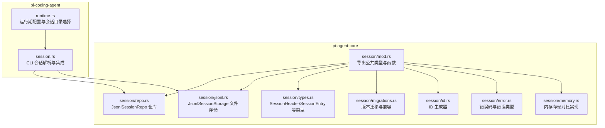
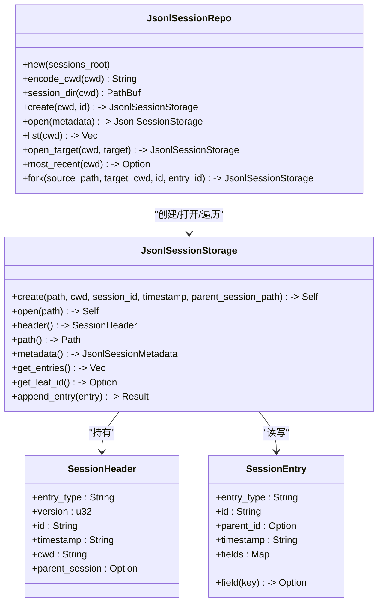
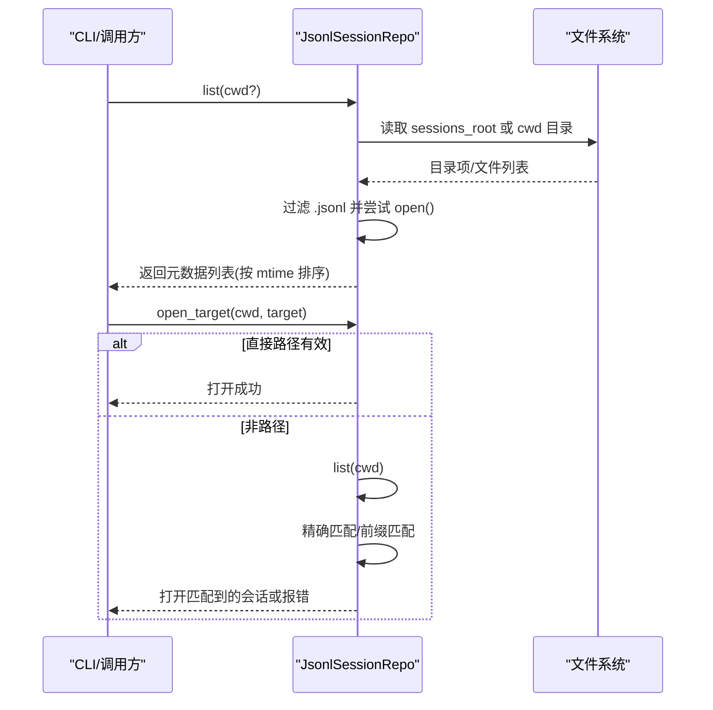
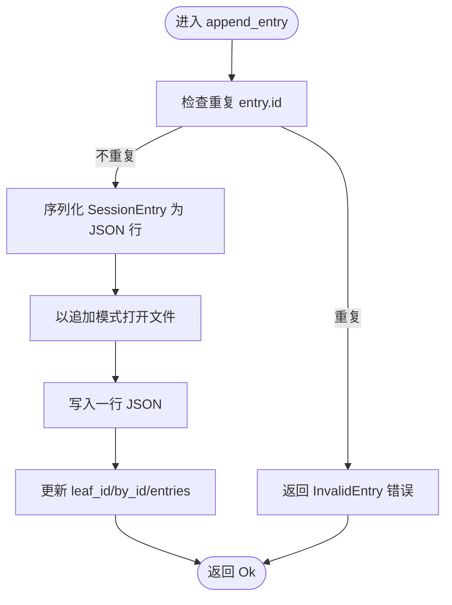
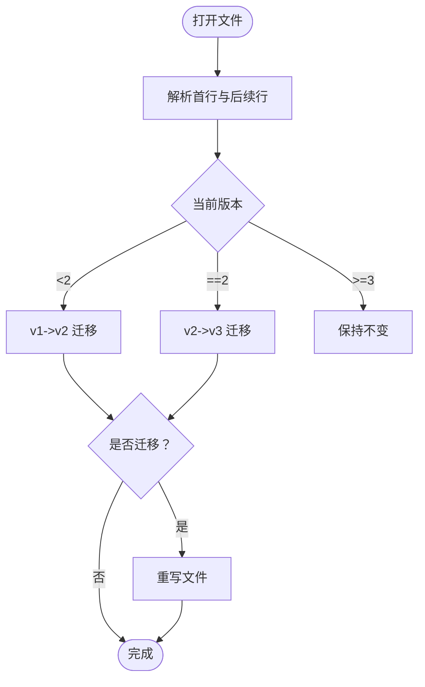
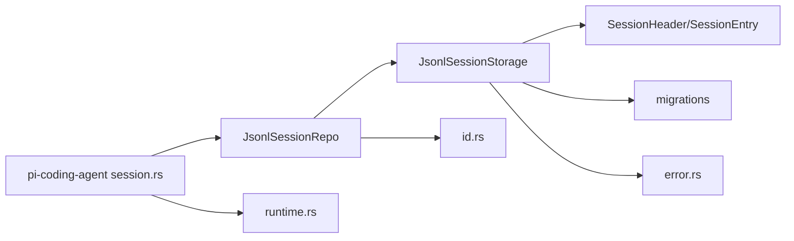

# 仓库会话管理

<cite>
**本文引用的文件**
- [repo.rs](file://crates/pi-agent-core/src/session/repo.rs)
- [jsonl.rs](file://crates/pi-agent-core/src/session/jsonl.rs)
- [types.rs](file://crates/pi-agent-core/src/session/types.rs)
- [migrations.rs](file://crates/pi-agent-core/src/session/migrations.rs)
- [id.rs](file://crates/pi-agent-core/src/session/id.rs)
- [error.rs](file://crates/pi-agent-core/src/session/error.rs)
- [memory.rs](file://crates/pi-agent-core/src/session/memory.rs)
- [mod.rs](file://crates/pi-agent-core/src/session/mod.rs)
- [session.rs](file://crates/pi-coding-agent/src/session.rs)
- [runtime.rs](file://crates/pi-coding-agent/src/runtime.rs)
- [session_repo.rs](file://crates/pi-agent-core/tests/session_repo.rs)
- [session_jsonl.rs](file://crates/pi-agent-core/tests/session_jsonl.rs)
</cite>

## 目录
1. [简介](#简介)
2. [项目结构](#项目结构)
3. [核心组件](#核心组件)
4. [架构总览](#架构总览)
5. [详细组件分析](#详细组件分析)
6. [依赖关系分析](#依赖关系分析)
7. [性能考虑](#性能考虑)
8. [故障排查指南](#故障排查指南)
9. [结论](#结论)
10. [附录](#附录)

## 简介
本文件面向仓库会话管理模块，聚焦 JsonlSessionRepo 的设计与实现，系统性阐述其架构、索引机制、查询接口、CRUD 操作、事务与一致性保障、性能优化策略以及最佳实践。同时给出关键流程的时序图与类图，帮助读者快速理解并正确使用该模块。

## 项目结构
仓库会话管理位于 pi-agent-core 的 session 子模块，围绕 JSONL v3 会话文件进行持久化与读写，并通过 JsonlSessionRepo 提供按工作目录（cwd）分层的会话仓库能力。pi-coding-agent 负责会话目标解析与运行期集成。

图表来源
- [mod.rs:1-20](file://crates/pi-agent-core/src/session/mod.rs#L1-L20)
- [repo.rs:1-281](file://crates/pi-agent-core/src/session/repo.rs#L1-L281)
- [jsonl.rs:1-559](file://crates/pi-agent-core/src/session/jsonl.rs#L1-L559)
- [types.rs:1-177](file://crates/pi-agent-core/src/session/types.rs#L1-L177)
- [migrations.rs:1-151](file://crates/pi-agent-core/src/session/migrations.rs#L1-L151)
- [id.rs:1-54](file://crates/pi-agent-core/src/session/id.rs#L1-L54)
- [error.rs:1-28](file://crates/pi-agent-core/src/session/error.rs#L1-L28)
- [memory.rs:1-126](file://crates/pi-agent-core/src/session/memory.rs#L1-L126)
- [session.rs:1-204](file://crates/pi-coding-agent/src/session.rs#L1-L204)
- [runtime.rs:1-217](file://crates/pi-coding-agent/src/runtime.rs#L1-L217)

章节来源
- [mod.rs:1-20](file://crates/pi-agent-core/src/session/mod.rs#L1-L20)

## 核心组件
- JsonlSessionRepo：按 cwd 组织的会话仓库，提供创建、打开、列出、按目标打开、最近会话、fork 等能力。
- JsonlSessionStorage：单个 JSONL v3 文件的读写与追加，负责头信息、条目序列、去重校验、版本迁移与重写。
- 类型系统：SessionHeader、SessionEntry、StoredAgentMessage、JsonlSessionMetadata 等。
- 迁移系统：从 v1/v2 到 v3 的自动迁移与重写。
- ID 生成：UUIDv7 会话 ID、短 entry ID、时间戳。
- 错误模型：SessionErrorCode 与 SessionError。
- 内存存储：InMemorySessionStorage 用于对比与测试。

章节来源
- [repo.rs:1-281](file://crates/pi-agent-core/src/session/repo.rs#L1-L281)
- [jsonl.rs:1-559](file://crates/pi-agent-core/src/session/jsonl.rs#L1-L559)
- [types.rs:1-177](file://crates/pi-agent-core/src/session/types.rs#L1-L177)
- [migrations.rs:1-151](file://crates/pi-agent-core/src/session/migrations.rs#L1-L151)
- [id.rs:1-54](file://crates/pi-agent-core/src/session/id.rs#L1-L54)
- [error.rs:1-28](file://crates/pi-agent-core/src/session/error.rs#L1-L28)
- [memory.rs:1-126](file://crates/pi-agent-core/src/session/memory.rs#L1-L126)

## 架构总览
仓库采用“文件即数据库”的轻量持久化方案：
- 会话以 JSONL v3 文件存储，首行是会话头，后续每行是一个条目。
- 仓库按 cwd 分目录，目录名经编码映射，避免非法字符冲突。
- 通过 JsonlSessionRepo 统一管理会话生命周期与查询；JsonlSessionStorage 负责单文件的读写与一致性维护。

图表来源
- [repo.rs:8-215](file://crates/pi-agent-core/src/session/repo.rs#L8-L215)
- [jsonl.rs:10-297](file://crates/pi-agent-core/src/session/jsonl.rs#L10-L297)
- [types.rs:5-70](file://crates/pi-agent-core/src/session/types.rs#L5-L70)

## 详细组件分析

### JsonlSessionRepo 设计与索引机制
- 组织结构
  - 以 sessions_root 为根，按 cwd 编码后作为子目录，确保跨平台路径安全。
  - 会话文件命名规则：时间戳_会话ID.jsonl，便于排序与识别。
- 索引与查询
  - list 支持按 cwd 或全量扫描，过滤 .jsonl 文件并尝试打开，收集元数据。
  - open_target 支持直接路径、精确 ID 匹配、前缀匹配，处理歧义与不存在场景。
  - most_recent 基于文件修改时间排序，优先返回最新会话。
- fork
  - 可选基于 entry_id 的路径复制，构建新会话并保留父会话路径信息。

图表来源
- [repo.rs:48-138](file://crates/pi-agent-core/src/session/repo.rs#L48-L138)

章节来源
- [repo.rs:13-215](file://crates/pi-agent-core/src/session/repo.rs#L13-L215)

### JsonlSessionStorage：CRUD 与一致性
- 创建
  - 写入会话头（version=3），后续追加条目。
- 追加
  - 去重校验（by_id），写入 JSON 行，维护 entries 与 by_id 映射，更新 leaf_id。
- 打开
  - 逐行读取，反序列化为值数组，执行版本迁移，校验头字段，构建内存索引。
- 元数据
  - metadata() 将 header 与 path 暴露为只读元数据对象。

图表来源
- [jsonl.rs:248-296](file://crates/pi-agent-core/src/session/jsonl.rs#L248-L296)

章节来源
- [jsonl.rs:19-297](file://crates/pi-agent-core/src/session/jsonl.rs#L19-L297)

### 版本迁移与兼容
- 支持从 v1/v2 自动迁移到 v3，包括：
  - 为缺失的条目生成唯一 id 与 parent_id，补全树关系。
  - 将 compaction 的 firstKeptEntryIndex 改为 firstKeptEntryId。
  - 将 message.role 从 hookMessage 改为 custom。
- 迁移完成后，若发生变更则重写整文件，确保持久化一致。

图表来源
- [migrations.rs:7-54](file://crates/pi-agent-core/src/session/migrations.rs#L7-L54)
- [migrations.rs:56-150](file://crates/pi-agent-core/src/session/migrations.rs#L56-L150)
- [jsonl.rs:299-340](file://crates/pi-agent-core/src/session/jsonl.rs#L299-L340)

章节来源
- [migrations.rs:1-151](file://crates/pi-agent-core/src/session/migrations.rs#L1-L151)
- [jsonl.rs:118-220](file://crates/pi-agent-core/src/session/jsonl.rs#L118-L220)

### 事务与一致性保障
- 单文件追加写入
  - append_entry 以追加模式打开文件并写入一行，具备原子性（单行写入）。
  - 若写入失败，文件状态保持一致（未写入半行）。
- 多文件一致性
  - 仓库层面不提供跨文件事务；fork 通过复制源文件内容并在新文件中重建索引实现“近似原子”。
- 数据完整性
  - 打开时进行严格校验：头类型、版本、必需字段；条目 id 去重；空行跳过。
- 迁移重写
  - 发生迁移时，先写临时文件再替换，避免部分写入导致损坏。

章节来源
- [jsonl.rs:248-296](file://crates/pi-agent-core/src/session/jsonl.rs#L248-L296)
- [jsonl.rs:299-340](file://crates/pi-agent-core/src/session/jsonl.rs#L299-L340)
- [repo.rs:157-214](file://crates/pi-agent-core/src/session/repo.rs#L157-L214)

### 查询接口与使用模式
- 创建会话
  - 使用 create(cwd, id?) 在 cwd 对应目录下创建新会话文件。
- 打开会话
  - open(metadata) 直接打开已知元数据；open_target(cwd, target) 支持多种定位方式。
- 列表与最近会话
  - list(cwd?) 获取 cwd 下或全量会话元数据；most_recent(cwd) 返回最新会话。
- fork
  - fork(source_path, target_cwd, id?, entry_id?) 支持从指定条目开始的分支复制。

章节来源
- [repo.rs:29-155](file://crates/pi-agent-core/src/session/repo.rs#L29-L155)
- [repo.rs:157-214](file://crates/pi-agent-core/src/session/repo.rs#L157-L214)

### 与 CLI 的集成
- 会话目录解析
  - 优先级：命令行参数 > 运行时配置 > 环境变量 > 默认路径。
- 会话目标解析
  - 支持新建、继续最近、按 ID/前缀打开、按 ID 打开或创建、fork。
- 运行期上下文
  - 打开会话后可重建 Agent 上下文，记录 baseline 消息数。

章节来源
- [session.rs:19-138](file://crates/pi-coding-agent/src/session.rs#L19-L138)
- [runtime.rs:190-217](file://crates/pi-coding-agent/src/runtime.rs#L190-L217)

## 依赖关系分析
- 模块内聚
  - session 模块内部职责清晰：类型定义、存储、仓库、迁移、ID、错误。
- 外部依赖
  - serde/serde_json：JSON 序列化与反序列化。
  - uuid：UUIDv7 会话 ID。
  - time：RFC3339 时间戳格式化。
  - thiserror：错误类型派生。
- 与上层集成
  - pi-coding-agent 通过 session.rs 与 repo/jsonl 对接，提供 CLI 语义。

图表来源
- [repo.rs:1-281](file://crates/pi-agent-core/src/session/repo.rs#L1-L281)
- [jsonl.rs:1-559](file://crates/pi-agent-core/src/session/jsonl.rs#L1-L559)
- [types.rs:1-177](file://crates/pi-agent-core/src/session/types.rs#L1-L177)
- [migrations.rs:1-151](file://crates/pi-agent-core/src/session/migrations.rs#L1-L151)
- [id.rs:1-54](file://crates/pi-agent-core/src/session/id.rs#L1-L54)
- [error.rs:1-28](file://crates/pi-agent-core/src/session/error.rs#L1-L28)
- [session.rs:1-204](file://crates/pi-coding-agent/src/session.rs#L1-L204)

章节来源
- [mod.rs:1-20](file://crates/pi-agent-core/src/session/mod.rs#L1-L20)

## 性能考虑
- I/O 模式
  - 追加写入为顺序写，适合线性对话；频繁随机访问需谨慎。
- 内存占用
  - 打开文件时将所有条目加载至内存（entries/by_id），适合中小规模会话；大规模会话建议分片或外部索引。
- 版本迁移重写
  - 迁移可能触发全文件重写，注意磁盘 IO 峰值。
- 并发控制
  - 当前实现未内置锁；多进程/多线程并发写同一文件需外层协调（如单进程写入、文件锁）。
- 批量操作
  - 通过多次 append_entry 实现批量追加；若需要更高吞吐，可在应用层合并消息后再写入。
- 缓存机制
  - by_id 哈希表提供 O(1) 查找；entries 向量支持顺序遍历。

章节来源
- [jsonl.rs:177-220](file://crates/pi-agent-core/src/session/jsonl.rs#L177-L220)
- [jsonl.rs:248-296](file://crates/pi-agent-core/src/session/jsonl.rs#L248-L296)

## 故障排查指南
- 常见错误码
  - NotFound：文件不存在或无法打开。
  - InvalidSession：头无效、版本不支持、缺少必要字段。
  - InvalidEntry：条目解析失败、重复 id。
  - InvalidForkTarget：fork 指定的 entry_id 不存在。
  - Storage：文件系统错误（创建目录、打开文件、写入）。
  - Unknown：未知错误。
- 定位方法
  - 检查 sessions_root 权限与磁盘空间。
  - 打开失败时确认首行是否为合法会话头，版本是否为 3。
  - fork 报错时确认 entry_id 是否存在于源会话。
- 测试参考
  - session_repo.rs 与 session_jsonl.rs 提供了典型用例与边界条件验证。

章节来源
- [error.rs:3-11](file://crates/pi-agent-core/src/session/error.rs#L3-L11)
- [session_repo.rs:1-60](file://crates/pi-agent-core/tests/session_repo.rs#L1-L60)
- [session_jsonl.rs:1-77](file://crates/pi-agent-core/tests/session_jsonl.rs#L1-L77)

## 结论
JsonlSessionRepo 与 JsonlSessionStorage 以简洁的 JSONL v3 文件为载体，提供了按 cwd 组织的会话仓库能力。其设计强调易用性与可移植性，通过严格的头部校验、条目去重与版本迁移，确保数据一致性与向前兼容。对于高并发与大规模会话，建议结合外层锁与分片策略使用，并关注迁移重写的 I/O 影响。

## 附录

### 使用模式与示例（路径指引）
- 创建并追加会话条目
  - 参考：[session_jsonl.rs:19-39](file://crates/pi-agent-core/tests/session_jsonl.rs#L19-L39)
- 按 ID 前缀打开会话
  - 参考：[session_repo.rs:28-41](file://crates/pi-agent-core/tests/session_repo.rs#L28-L41)
- fork 会话并保留父会话路径
  - 参考：[session_repo.rs:43-59](file://crates/pi-agent-core/tests/session_repo.rs#L43-L59)
- CLI 集成：解析会话目录与目标
  - 参考：[session.rs:89-138](file://crates/pi-coding-agent/src/session.rs#L89-L138)，[runtime.rs:190-198](file://crates/pi-coding-agent/src/runtime.rs#L190-L198)