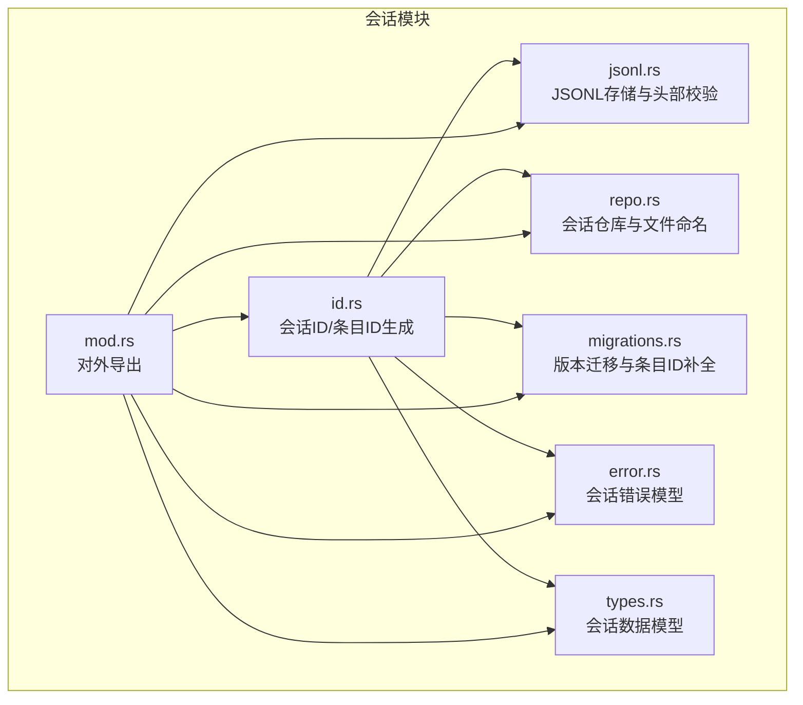
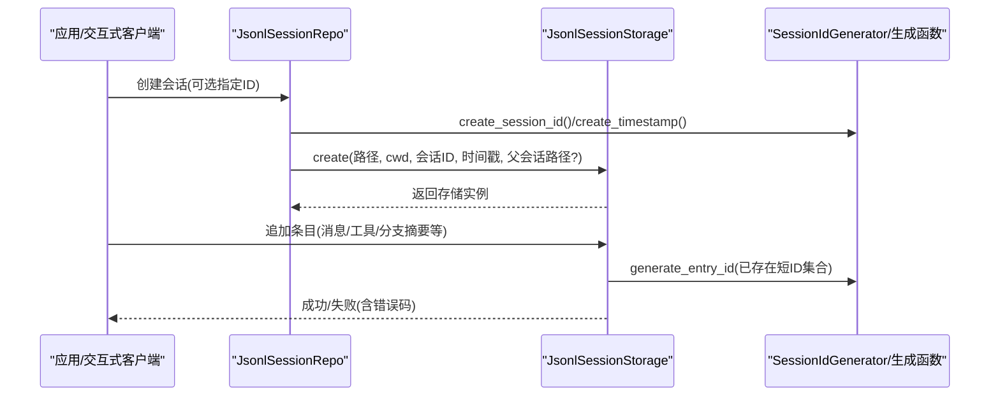
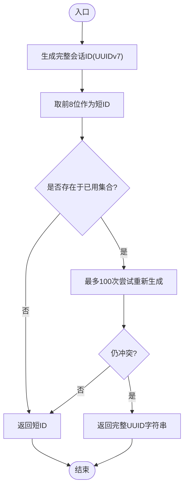
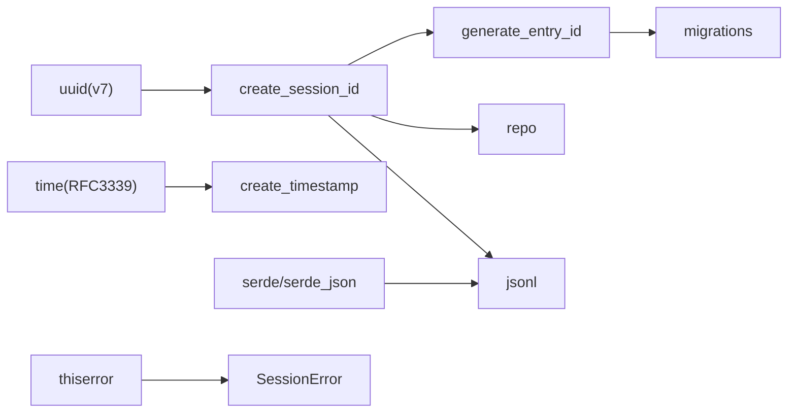

# 会话 ID 生成器

<cite>
**本文引用的文件**
- [id.rs](file://crates/pi-agent-core/src/session/id.rs)
- [error.rs](file://crates/pi-agent-core/src/session/error.rs)
- [types.rs](file://crates/pi-agent-core/src/session/types.rs)
- [jsonl.rs](file://crates/pi-agent-core/src/session/jsonl.rs)
- [repo.rs](file://crates/pi-agent-core/src/session/repo.rs)
- [migrations.rs](file://crates/pi-agent-core/src/session/migrations.rs)
- [mod.rs](file://crates/pi-agent-core/src/session/mod.rs)
- [Cargo.toml](file://crates/pi-agent-core/Cargo.toml)
- [session_repo.rs](file://crates/pi-agent-core/tests/session_repo.rs)
</cite>

## 目录
1. [简介](#简介)
2. [项目结构](#项目结构)
3. [核心组件](#核心组件)
4. [架构总览](#架构总览)
5. [组件详解](#组件详解)
6. [依赖关系分析](#依赖关系分析)
7. [性能与安全特性](#性能与安全特性)
8. [故障排查指南](#故障排查指南)
9. [结论](#结论)
10. [附录：最佳实践与迁移策略](#附录最佳实践与迁移策略)

## 简介
本文件面向“会话 ID 生成器”模块，系统化阐述 SessionIdGenerator 的设计与实现，覆盖以下关键主题：
- 唯一性保证机制（UUID v7、短 ID 冲突检测）
- 时间戳集成（RFC3339 UTC 格式）
- 随机性与可预测性权衡
- 函数职责与使用场景（create_session_id、create_timestamp、generate_entry_id）
- 安全性与性能特性（碰撞概率、并发安全、可预测性）
- ID 格式规范与版本演进（向后兼容、迁移策略、升级方案）
- 分布式环境下的协调与监控建议
- 具体使用模式与代码路径参考

## 项目结构
会话 ID 生成器位于 pi-agent-core 的 session 子模块中，围绕 UUID v7、时间戳格式化与短 ID 生成展开，并通过 JSONL 会话存储、会话仓库与迁移逻辑进行落地。

图表来源
- [id.rs:1-54](file://crates/pi-agent-core/src/session/id.rs#L1-L54)
- [error.rs:1-28](file://crates/pi-agent-core/src/session/error.rs#L1-L28)
- [types.rs:1-177](file://crates/pi-agent-core/src/session/types.rs#L1-L177)
- [jsonl.rs:1-200](file://crates/pi-agent-core/src/session/jsonl.rs#L1-L200)
- [repo.rs:1-200](file://crates/pi-agent-core/src/session/repo.rs#L1-L200)
- [migrations.rs:1-151](file://crates/pi-agent-core/src/session/migrations.rs#L1-L151)
- [mod.rs:1-126](file://crates/pi-agent-core/src/session/mod.rs#L1-L126)

章节来源
- [mod.rs:1-126](file://crates/pi-agent-core/src/session/mod.rs#L1-L126)

## 核心组件
- 会话 ID 生成器：提供会话级全局唯一标识与条目级短 ID 的生成与复用能力
- 时间戳生成器：提供 RFC3339 UTC 格式字符串，便于日志与排序
- 条目 ID 生成器：基于会话 ID 生成短前缀作为条目 ID，避免冲突
- 会话错误模型：统一的错误码与错误包装，便于上层处理
- 数据模型：SessionHeader、SessionEntry 等，承载会话元数据与条目字段
- JSONL 存储：负责会话文件的创建、读取、版本校验与去重检查
- 会话仓库：管理会话目录、文件命名、打开/创建/派生（fork）等操作
- 迁移模块：将旧版会话数据迁移到当前版本，必要时补全条目 ID

章节来源
- [id.rs:1-54](file://crates/pi-agent-core/src/session/id.rs#L1-L54)
- [error.rs:1-28](file://crates/pi-agent-core/src/session/error.rs#L1-L28)
- [types.rs:1-177](file://crates/pi-agent-core/src/session/types.rs#L1-L177)
- [jsonl.rs:1-200](file://crates/pi-agent-core/src/session/jsonl.rs#L1-L200)
- [repo.rs:1-200](file://crates/pi-agent-core/src/session/repo.rs#L1-L200)
- [migrations.rs:1-151](file://crates/pi-agent-core/src/session/migrations.rs#L1-L151)

## 架构总览
下图展示从应用到存储的关键调用链路，以及 ID 生成在其中的位置。

图表来源
- [repo.rs:29-39](file://crates/pi-agent-core/src/session/repo.rs#L29-L39)
- [jsonl.rs:20-79](file://crates/pi-agent-core/src/session/jsonl.rs#L20-L79)
- [id.rs:6-26](file://crates/pi-agent-core/src/session/id.rs#L6-L26)

## 组件详解

### 会话 ID 生成器与辅助函数
- create_session_id：基于 UUID v7 生成全局唯一字符串，作为会话级主 ID
- create_timestamp：基于 OffsetDateTime.now_utc() 生成 RFC3339 格式字符串，末尾 Z 表示 UTC
- generate_entry_id：从会话 ID 中取前 8 个字符作为条目短 ID；若冲突则最多尝试 100 次重新生成，最终兜底返回完整 UUID 字符串
- SessionIdGenerator：用于测试或固定场景的“固定 ID 生成器”，支持预置会话 ID、条目 ID 列表与时间戳，并按序弹出下一个条目 ID；当列表耗尽时返回特定错误

图表来源
- [id.rs:17-26](file://crates/pi-agent-core/src/session/id.rs#L17-L26)

章节来源
- [id.rs:6-26](file://crates/pi-agent-core/src/session/id.rs#L6-L26)
- [id.rs:28-53](file://crates/pi-agent-core/src/session/id.rs#L28-L53)

### 错误模型与错误码
- SessionErrorCode：枚举了会话相关错误类别（未找到、无效会话/条目、存储异常、未知错误等）
- SessionError：封装错误码与消息，便于传播与定位

章节来源
- [error.rs:3-27](file://crates/pi-agent-core/src/session/error.rs#L3-L27)

### 数据模型与 ID 使用
- SessionHeader：会话头部包含 type/version/id/timestamp/cwd/parent_session 等字段
- SessionEntry：会话条目包含 type/id/parentId/timestamp/fields 等字段
- StoredAgentMessage：不同角色的消息结构，用于序列化到条目字段中

章节来源
- [types.rs:5-177](file://crates/pi-agent-core/src/session/types.rs#L5-L177)

### JSONL 存储与版本控制
- JsonlSessionStorage：负责会话文件的创建、写入头部、逐行解析、版本校验、重复 ID 检测等
- 头部校验：要求 type="session"、version=3、id/timestamp/cwd 不为空
- 重复 ID 检测：对条目 id 去重，避免冲突

章节来源
- [jsonl.rs:10-176](file://crates/pi-agent-core/src/session/jsonl.rs#L10-L176)

### 会话仓库与文件命名
- JsonlSessionRepo：管理会话目录、编码工作目录、创建/打开/列出/派生（fork）会话
- 文件命名：时间戳（替换非法字符）+ 下划线 + 会话 ID + .jsonl
- fork：创建新会话并记录父会话路径

章节来源
- [repo.rs:13-138](file://crates/pi-agent-core/src/session/repo.rs#L13-L138)

### 迁移模块与条目 ID 补全
- migrate_session_values：根据版本执行 v1->v2、v2->v3 迁移
- v1->v2：遍历条目，为每个非会话条目生成短 ID 并插入 parentId；同时将 compaction 的索引映射为 firstKeptEntryId
- generate_entry_id：在迁移过程中被调用，确保生成的短 ID 不冲突

章节来源
- [migrations.rs:7-127](file://crates/pi-agent-core/src/session/migrations.rs#L7-L127)
- [migrations.rs:129-151](file://crates/pi-agent-core/src/session/migrations.rs#L129-L151)

## 依赖关系分析
- 会话 ID 生成依赖 uuid（v7 特性）与 time（RFC3339 格式化）
- JSONL 存储与会话仓库依赖 serde/serde_json 进行序列化/反序列化
- 错误模型依赖 thiserror 提供易用的错误派生

图表来源
- [Cargo.toml:6-18](file://crates/pi-agent-core/Cargo.toml#L6-L18)
- [id.rs:1-4](file://crates/pi-agent-core/src/session/id.rs#L1-L4)
- [jsonl.rs:1-7](file://crates/pi-agent-core/src/session/jsonl.rs#L1-L7)
- [error.rs:1](file://crates/pi-agent-core/src/session/error.rs#L1)

章节来源
- [Cargo.toml:6-18](file://crates/pi-agent-core/Cargo.toml#L6-L18)

## 性能与安全特性

- 唯一性保证
  - 会话 ID：UUID v7 全局唯一，碰撞概率极低
  - 条目短 ID：取 UUID 前 8 位，冲突概率取决于生成频率与并发度；通过最多 100 次重试降低冲突风险
  - 冲突兜底：若仍冲突，回退到完整 UUID 字符串，确保可用性

- 并发安全性
  - 生成函数均为纯函数，无共享状态，天然并发安全
  - generate_entry_id 依赖外部传入的已用短 ID 集合，需由调用方在并发场景下维护一致性（例如使用互斥锁或原子集合）

- 可预测性
  - UUID v7 有序性依赖系统时钟，具备一定时间顺序特征
  - 短 ID 前缀长度有限，可能在高并发下增加冲突概率；可通过增大短 ID 长度或引入额外随机片段增强

- 时间戳集成
  - create_timestamp 输出 RFC3339 UTC 字符串，便于跨语言/跨系统一致解析与排序

- 性能考量
  - generate_entry_id 最多循环 100 次，通常快速命中；若冲突频繁，建议扩大短 ID 长度或采用更长随机片段
  - JSONL 存储在写入与解析时进行去重检查，避免 O(n) 查找；建议在高频写入场景下对条目 ID 建立索引缓存

章节来源
- [id.rs:6-26](file://crates/pi-agent-core/src/session/id.rs#L6-L26)
- [jsonl.rs:189-194](file://crates/pi-agent-core/src/session/jsonl.rs#L189-L194)

## 故障排查指南

- 常见错误与定位
  - 会话头缺失或字段不合法：检查 SessionHeader 的 type/version/id/timestamp/cwd 是否满足约束
  - 重复条目 ID：确认 generate_entry_id 的已用集合是否正确传递，或检查迁移流程是否遗漏
  - 会话版本不受支持：确认 CURRENT_SESSION_VERSION 与文件版本匹配
  - 存储异常：检查文件权限、磁盘空间与路径合法性

- 调试建议
  - 打印 create_session_id/create_timestamp/generate_entry_id 的输出，核对格式与唯一性
  - 在并发场景下，对 generate_entry_id 的已用集合进行单元测试，模拟高冲突率场景
  - 对 JSONL 解析失败的行号进行定位，结合 SessionErrorCode::InvalidEntry/InvalidSession 进行修复

章节来源
- [jsonl.rs:111-176](file://crates/pi-agent-core/src/session/jsonl.rs#L111-L176)
- [error.rs:3-11](file://crates/pi-agent-core/src/session/error.rs#L3-L11)

## 结论
会话 ID 生成器以 UUID v7 为核心，结合 RFC3339 时间戳与短 ID 冲突检测，提供了在单机与分布式环境下均具备良好唯一性与可追踪性的 ID 体系。通过 JSONL 存储、会话仓库与迁移模块的协同，实现了从创建、写入、读取到版本演进的完整闭环。在高并发与大规模部署场景下，建议适当增大短 ID 长度、加强已用集合的并发一致性保障，并建立完善的监控与告警机制。

## 附录：最佳实践与迁移策略

- 最佳实践
  - 分布式协调：在多节点环境中，使用集中式短 ID 注册中心或带前缀的短 ID 命名空间，减少冲突
  - 性能优化：对 generate_entry_id 的已用集合采用高效查找结构（如哈希集合），并在批量生成时合并提交
  - 监控指标：跟踪短 ID 冲突次数、生成耗时、JSONL 写入延迟与重复 ID 报错数
  - 日志与审计：记录 create_session_id/create_timestamp/generate_entry_id 的调用上下文，便于问题溯源

- ID 格式规范
  - 会话 ID：UUID v7 字符串（全小写连字符形式）
  - 条目短 ID：取会话 ID 前 8 位；若冲突则回退至完整 UUID 字符串
  - 时间戳：RFC3339 UTC 字符串，末尾 Z 表示 UTC

- 版本演进与迁移
  - 当前版本：v3（头部字段包含 version=3、id/timestamp/cwd 必填）
  - 迁移策略：按版本顺序执行 v1->v2、v2->v3；v1->v2 期间为每个条目生成短 ID 并补全 parentId/firstKeptEntryId；v2->v3 主要进行字段别名调整
  - 升级方案：在读取阶段自动迁移，写入阶段强制使用最新版本；对历史文件保留只读访问

- 使用模式参考
  - 创建会话：调用 create_session_id/create_timestamp，结合 JsonlSessionRepo::create 生成文件名并创建 JSONL 文件
  - 追加条目：使用 generate_entry_id 获取短 ID，写入 SessionEntry 并持久化
  - 派生会话（fork）：复制源会话并设置 parent_session，生成新的会话 ID

章节来源
- [repo.rs:29-39](file://crates/pi-agent-core/src/session/repo.rs#L29-L39)
- [jsonl.rs:129-151](file://crates/pi-agent-core/src/session/jsonl.rs#L129-L151)
- [migrations.rs:56-127](file://crates/pi-agent-core/src/session/migrations.rs#L56-L127)
- [session_repo.rs:28-41](file://crates/pi-agent-core/tests/session_repo.rs#L28-L41)