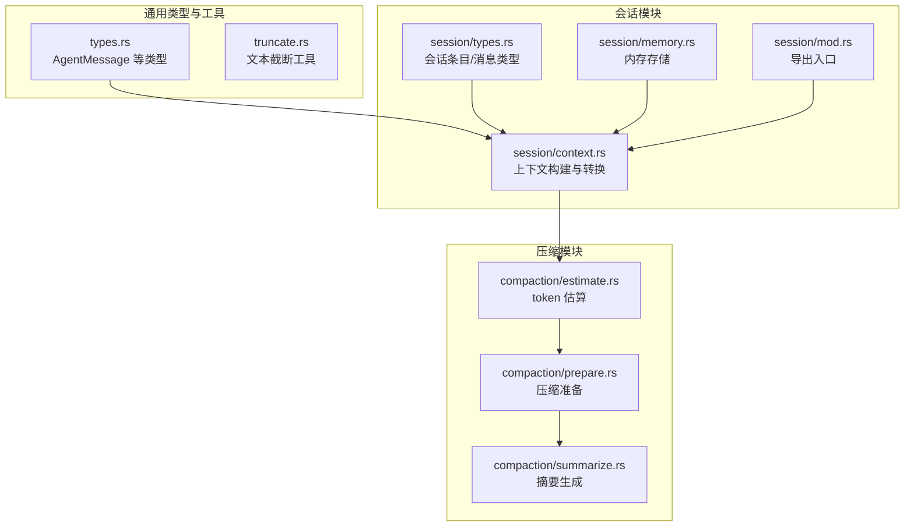
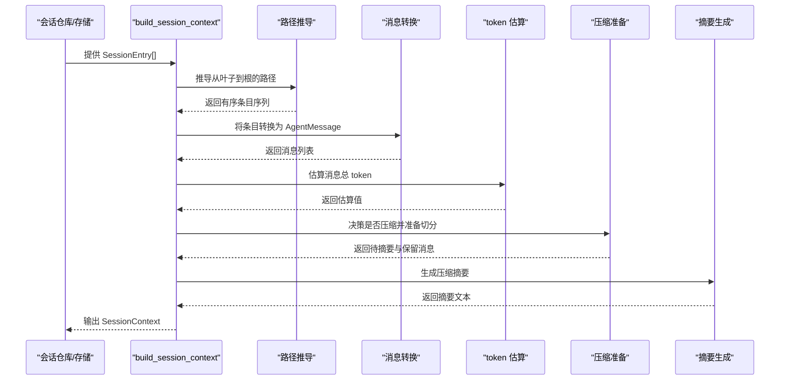
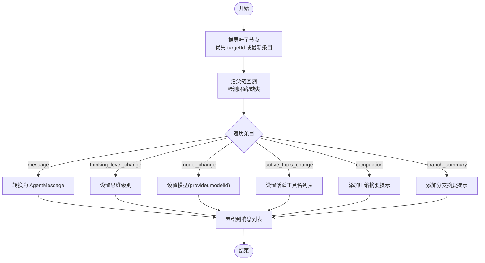
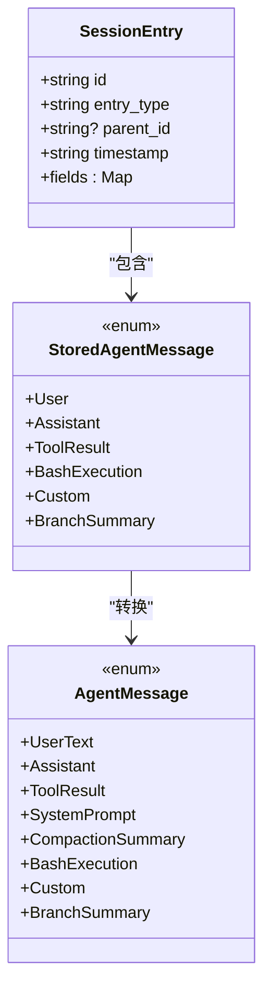
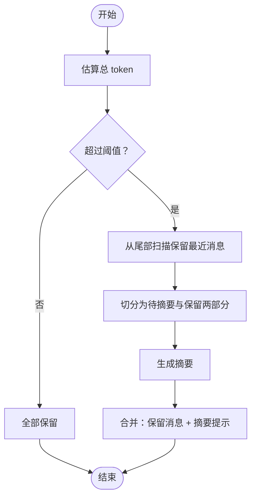
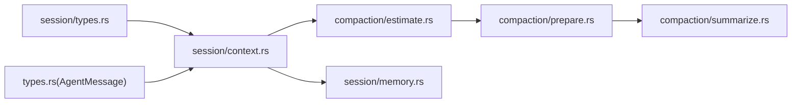

# 会话上下文构建

<cite>
**本文引用的文件**
- [crates/pi-agent-core/src/session/context.rs](file://crates/pi-agent-core/src/session/context.rs)
- [crates/pi-agent-core/src/session/types.rs](file://crates/pi-agent-core/src/session/types.rs)
- [crates/pi-agent-core/src/session/memory.rs](file://crates/pi-agent-core/src/session/memory.rs)
- [crates/pi-agent-core/src/session/mod.rs](file://crates/pi-agent-core/src/session/mod.rs)
- [crates/pi-agent-core/src/types.rs](file://crates/pi-agent-core/src/types.rs)
- [crates/pi-agent-core/src/compaction/estimate.rs](file://crates/pi-agent-core/src/compaction/estimate.rs)
- [crates/pi-agent-core/src/compaction/prepare.rs](file://crates/pi-agent-core/src/compaction/prepare.rs)
- [crates/pi-agent-core/src/compaction/summarize.rs](file://crates/pi-agent-core/src/compaction/summarize.rs)
- [crates/pi-agent-core/src/truncate.rs](file://crates/pi-agent-core/src/truncate.rs)
- [crates/pi-agent-core/tests/session_context.rs](file://crates/pi-agent-core/tests/session_context.rs)
- [crates/pi-agent-core/tests/compaction.rs](file://crates/pi-agent-core/tests/compaction.rs)
</cite>

## 目录
1. [引言](#引言)
2. [项目结构](#项目结构)
3. [核心组件](#核心组件)
4. [架构总览](#架构总览)
5. [详细组件分析](#详细组件分析)
6. [依赖关系分析](#依赖关系分析)
7. [性能考量](#性能考量)
8. [故障排查指南](#故障排查指南)
9. [结论](#结论)
10. [附录：最佳实践与使用模式](#附录最佳实践与使用模式)

## 引言
本文件围绕“会话上下文构建”主题，系统化梳理 SessionContext 的设计与实现，重点覆盖以下方面：
- 上下文数据的采集、过滤与组装流程
- build_session_context 的实现逻辑（时间窗口选择、消息筛选、内容压缩策略）
- 性能优化手段（增量更新、懒加载、缓存策略）
- 对 AI 模型输入的影响（token 限制、信息相关性、上下文长度）
- 最佳实践（参数调优、性能监控、错误处理）及具体使用模式

## 项目结构
会话上下文构建位于 pi-agent-core 子模块中，核心文件组织如下：
- session 模块：负责会话条目、上下文转换、内存存储等
- compaction 模块：负责上下文压缩（估算、准备、摘要生成）
- 类型与工具：统一 AgentMessage 定义、Truncation 工具等

图表来源
- [crates/pi-agent-core/src/session/context.rs:1-496](file://crates/pi-agent-core/src/session/context.rs#L1-L496)
- [crates/pi-agent-core/src/session/types.rs:1-177](file://crates/pi-agent-core/src/session/types.rs#L1-L177)
- [crates/pi-agent-core/src/session/memory.rs:1-126](file://crates/pi-agent-core/src/session/memory.rs#L1-L126)
- [crates/pi-agent-core/src/session/mod.rs:1-126](file://crates/pi-agent-core/src/session/mod.rs#L1-L126)
- [crates/pi-agent-core/src/compaction/estimate.rs:1-94](file://crates/pi-agent-core/src/compaction/estimate.rs#L1-L94)
- [crates/pi-agent-core/src/compaction/prepare.rs:1-109](file://crates/pi-agent-core/src/compaction/prepare.rs#L1-L109)
- [crates/pi-agent-core/src/compaction/summarize.rs:1-111](file://crates/pi-agent-core/src/compaction/summarize.rs#L1-L111)
- [crates/pi-agent-core/src/types.rs:300-353](file://crates/pi-agent-core/src/types.rs#L300-L353)
- [crates/pi-agent-core/src/truncate.rs:1-205](file://crates/pi-agent-core/src/truncate.rs#L1-L205)

章节来源
- [crates/pi-agent-core/src/session/context.rs:1-496](file://crates/pi-agent-core/src/session/context.rs#L1-L496)
- [crates/pi-agent-core/src/session/types.rs:1-177](file://crates/pi-agent-core/src/session/types.rs#L1-L177)
- [crates/pi-agent-core/src/session/memory.rs:1-126](file://crates/pi-agent-core/src/session/memory.rs#L1-L126)
- [crates/pi-agent-core/src/session/mod.rs:1-126](file://crates/pi-agent-core/src/session/mod.rs#L1-L126)
- [crates/pi-agent-core/src/types.rs:300-353](file://crates/pi-agent-core/src/types.rs#L300-L353)
- [crates/pi-agent-core/src/compaction/estimate.rs:1-94](file://crates/pi-agent-core/src/compaction/estimate.rs#L1-L94)
- [crates/pi-agent-core/src/compaction/prepare.rs:1-109](file://crates/pi-agent-core/src/compaction/prepare.rs#L1-L109)
- [crates/pi-agent-core/src/compaction/summarize.rs:1-111](file://crates/pi-agent-core/src/compaction/summarize.rs#L1-L111)
- [crates/pi-agent-core/src/truncate.rs:1-205](file://crates/pi-agent-core/src/truncate.rs#L1-L205)

## 核心组件
- SessionContext：承载最终用于模型推理的上下文，包含消息序列、思维级别、模型标识、活跃工具名列表等。
- build_session_context：从 SessionEntry 列表构建 SessionContext 的主函数，负责路径推导、消息转换与元信息注入。
- SessionEntry/StoredAgentMessage：会话条目的统一结构与消息体定义，支持多种消息类型与字段。
- InMemorySessionStorage：轻量内存存储，维护条目集合与叶子节点追踪。
- Token 估算与压缩：通过估计 token 数量决定是否压缩，并在压缩前保留近期关键消息。

章节来源
- [crates/pi-agent-core/src/session/context.rs:6-274](file://crates/pi-agent-core/src/session/context.rs#L6-L274)
- [crates/pi-agent-core/src/session/types.rs:17-139](file://crates/pi-agent-core/src/session/types.rs#L17-L139)
- [crates/pi-agent-core/src/session/memory.rs:4-60](file://crates/pi-agent-core/src/session/memory.rs#L4-L60)
- [crates/pi-agent-core/src/compaction/estimate.rs:4-54](file://crates/pi-agent-core/src/compaction/estimate.rs#L4-L54)
- [crates/pi-agent-core/src/compaction/prepare.rs:4-48](file://crates/pi-agent-core/src/compaction/prepare.rs#L4-L48)

## 架构总览
下图展示从会话条目到最终上下文的关键流程：条目解析 → 路径推导 → 消息转换 → 元信息注入 → 压缩决策与执行。

图表来源
- [crates/pi-agent-core/src/session/context.rs:194-274](file://crates/pi-agent-core/src/session/context.rs#L194-L274)
- [crates/pi-agent-core/src/compaction/estimate.rs:4-54](file://crates/pi-agent-core/src/compaction/estimate.rs#L4-L54)
- [crates/pi-agent-core/src/compaction/prepare.rs:8-48](file://crates/pi-agent-core/src/compaction/prepare.rs#L8-L48)
- [crates/pi-agent-core/src/compaction/summarize.rs:6-110](file://crates/pi-agent-core/src/compaction/summarize.rs#L6-L110)

## 详细组件分析

### SessionContext 与构建流程
- 设计要点
  - SessionContext 以消息列表为核心，附加思维级别、模型标识、活跃工具名等元信息，便于模型按需调整行为。
  - 构建过程严格遵循“从叶子到根”的路径，确保上下文顺序与会话树一致。
- 关键步骤
  - 叶子节点推导：优先使用显式 targetId，否则取最新非头部条目 ID。
  - 路径遍历：从叶子向上回溯，检测环路并校验缺失条目。
  - 条目类型处理：message 类型转换为 AgentMessage；特殊类型如 thinking_level_change、model_change、active_tools_change、compaction、branch_summary 注入到上下文中。
  - 消息转换：将 StoredAgentMessage 映射为 AgentMessage，同时将 Usage/成本等指标转换为统一格式。

图表来源
- [crates/pi-agent-core/src/session/context.rs:14-274](file://crates/pi-agent-core/src/session/context.rs#L14-L274)

章节来源
- [crates/pi-agent-core/src/session/context.rs:14-274](file://crates/pi-agent-core/src/session/context.rs#L14-L274)

### 数据模型与类型映射
- SessionEntry：统一的条目结构，支持任意字段的动态扩展。
- StoredAgentMessage：涵盖用户文本、助手回复、工具结果、Bash 执行、自定义、分支摘要等。
- AgentMessage：面向上层使用的统一消息抽象，便于后续压缩、截断与模型调用。

图表来源
- [crates/pi-agent-core/src/session/types.rs:17-139](file://crates/pi-agent-core/src/session/types.rs#L17-L139)
- [crates/pi-agent-core/src/types.rs:302-353](file://crates/pi-agent-core/src/types.rs#L302-L353)

章节来源
- [crates/pi-agent-core/src/session/types.rs:17-139](file://crates/pi-agent-core/src/session/types.rs#L17-L139)
- [crates/pi-agent-core/src/types.rs:302-353](file://crates/pi-agent-core/src/types.rs#L302-L353)

### 压缩与摘要（上下文瘦身）
- 估算策略：基于字符长度与内容块进行粗略估算；若存在 Usage 中的 total_tokens，则直接采用该值。
- 压缩准备：当总 token 超过上下文窗口预留阈值时，从尾部向前扫描，保留最近若干 token 的消息，其余交给摘要。
- 摘要生成：将待摘要消息转为标准 Message 列表，附加总结指令，调用模型生成摘要文本。

图表来源
- [crates/pi-agent-core/src/compaction/estimate.rs:4-54](file://crates/pi-agent-core/src/compaction/estimate.rs#L4-L54)
- [crates/pi-agent-core/src/compaction/prepare.rs:8-48](file://crates/pi-agent-core/src/compaction/prepare.rs#L8-L48)
- [crates/pi-agent-core/src/compaction/summarize.rs:6-110](file://crates/pi-agent-core/src/compaction/summarize.rs#L6-L110)

章节来源
- [crates/pi-agent-core/src/compaction/estimate.rs:4-54](file://crates/pi-agent-core/src/compaction/estimate.rs#L4-L54)
- [crates/pi-agent-core/src/compaction/prepare.rs:8-48](file://crates/pi-agent-core/src/compaction/prepare.rs#L8-L48)
- [crates/pi-agent-core/src/compaction/summarize.rs:6-110](file://crates/pi-agent-core/src/compaction/summarize.rs#L6-L110)

### 截断与内容压缩
- 截断策略：提供头截断与尾截断两种方式，支持按行数与字节数双重限制，并记录截断原因与统计信息。
- 使用场景：适用于单段超长输出或日志类内容，避免一次性塞满上下文。

章节来源
- [crates/pi-agent-core/src/truncate.rs:45-157](file://crates/pi-agent-core/src/truncate.rs#L45-L157)

### 测试与验证
- 单元测试覆盖了从线性叶子到显式目标叶子、思维级别变更、模型变更、压缩摘要与分支摘要注入等关键路径。
- 压缩测试验证了 token 估算、阈值判断与运行时压缩流程。

章节来源
- [crates/pi-agent-core/tests/session_context.rs:21-51](file://crates/pi-agent-core/tests/session_context.rs#L21-L51)
- [crates/pi-agent-core/tests/compaction.rs:43-179](file://crates/pi-agent-core/tests/compaction.rs#L43-L179)

## 依赖关系分析
- 组件耦合
  - build_session_context 依赖 SessionEntry/StoredAgentMessage 的结构与 serde 解析能力。
  - 压缩模块独立于上下文构建，但共享 AgentMessage 类型与 Usage 结构。
  - 截断工具与上下文构建解耦，可在消息进入上下文前或后应用。
- 外部依赖
  - 模型流式接口用于摘要生成；AI 类型定义来自 pi_ai crate。

图表来源
- [crates/pi-agent-core/src/session/context.rs:1-496](file://crates/pi-agent-core/src/session/context.rs#L1-L496)
- [crates/pi-agent-core/src/session/types.rs:1-177](file://crates/pi-agent-core/src/session/types.rs#L1-L177)
- [crates/pi-agent-core/src/session/memory.rs:1-126](file://crates/pi-agent-core/src/session/memory.rs#L1-L126)
- [crates/pi-agent-core/src/types.rs:300-353](file://crates/pi-agent-core/src/types.rs#L300-L353)
- [crates/pi-agent-core/src/compaction/estimate.rs:1-94](file://crates/pi-agent-core/src/compaction/estimate.rs#L1-L94)
- [crates/pi-agent-core/src/compaction/prepare.rs:1-109](file://crates/pi-agent-core/src/compaction/prepare.rs#L1-L109)
- [crates/pi-agent-core/src/compaction/summarize.rs:1-111](file://crates/pi-agent-core/src/compaction/summarize.rs#L1-L111)

## 性能考量
- 时间复杂度
  - 路径推导：O(n)，n 为路径长度；哈希索引 by_id 实现 O(1) 查找。
  - 消息转换：O(m)，m 为路径上消息数量。
  - 压缩准备：O(m)，扫描一次尾部消息。
- 空间复杂度
  - 上下文消息列表与临时缓冲线性增长；压缩后整体大小下降。
- 优化建议
  - 增量更新：仅在新条目到达时重建上下文，避免全量重算。
  - 懒加载：对远端大文件或昂贵资源延迟读取，按需拼接。
  - 缓存策略：对常用摘要与 token 估算结果进行短期缓存，减少重复计算。
  - 分页与分片：对超长历史采用分片摘要，逐步替换旧摘要。

## 故障排查指南
- 常见错误
  - 会话环路：路径回溯检测到重复访问条目，返回无效会话错误。
  - 条目缺失：父节点不存在导致无法回溯，返回条目未找到错误。
  - 重复条目 ID：内存存储拒绝重复插入，需检查去重逻辑。
- 定位方法
  - 开启调试日志，打印路径与转换后的消息片段。
  - 验证 SessionEntry 的 entry_type 与字段完整性。
  - 在压缩阶段打印估算值与切分点，确认阈值设置合理。
- 修复建议
  - 规范化条目生成，确保 parent_id 与 targetId 正确。
  - 合理设置 reserve_tokens 与 keep_recent_tokens，避免频繁压缩。
  - 对异常输出启用截断，防止单条消息撑爆上下文。

章节来源
- [crates/pi-agent-core/src/session/context.rs:42-68](file://crates/pi-agent-core/src/session/context.rs#L42-L68)
- [crates/pi-agent-core/src/session/memory.rs:41-59](file://crates/pi-agent-core/src/session/memory.rs#L41-L59)

## 结论
会话上下文构建模块以 SessionEntry 为数据源，通过明确的路径推导与消息转换，生成可直接用于模型推理的 SessionContext。结合压缩与摘要机制，能够在保证信息相关性的前提下控制上下文长度与 token 消耗。配合增量更新、懒加载与缓存策略，可进一步提升整体性能与稳定性。

## 附录：最佳实践与使用模式

- 参数调优
  - reserve_tokens：为模型最大输出与系统提示预留安全余量。
  - keep_recent_tokens：保留最近关键对话，避免丢失上下文连续性。
  - 估算策略：优先使用 Usage.total_tokens，其次按字符长度估算，最后按内容块估算。
- 性能监控
  - 记录每次构建耗时、消息数量、token 估算值、是否触发压缩与摘要长度。
  - 监控压缩频率与保留比例，动态调整阈值。
- 错误处理
  - 对环路与缺失条目进行早失败与清晰报错。
  - 对重复条目 ID 进行幂等处理或去重。
- 使用模式
  - 线性会话：默认从最新叶子构建，适合常规问答。
  - 分支回溯：通过显式 targetId 指向特定叶子，构建分支上下文。
  - 运行时压缩：在发起模型请求前评估 token，必要时先生成摘要再继续推理。

章节来源
- [crates/pi-agent-core/src/compaction/estimate.rs:4-54](file://crates/pi-agent-core/src/compaction/estimate.rs#L4-L54)
- [crates/pi-agent-core/src/compaction/prepare.rs:4-48](file://crates/pi-agent-core/src/compaction/prepare.rs#L4-L48)
- [crates/pi-agent-core/src/compaction/summarize.rs:6-110](file://crates/pi-agent-core/src/compaction/summarize.rs#L6-L110)
- [crates/pi-agent-core/tests/compaction.rs:133-179](file://crates/pi-agent-core/tests/compaction.rs#L133-L179)