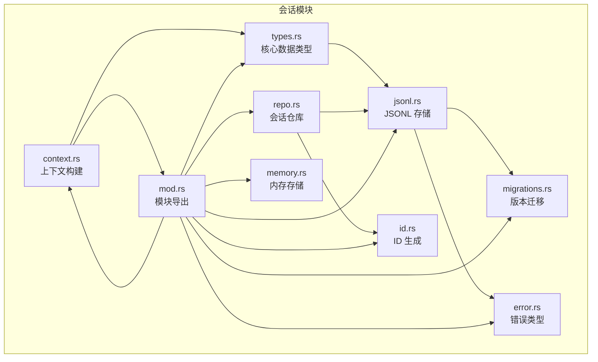
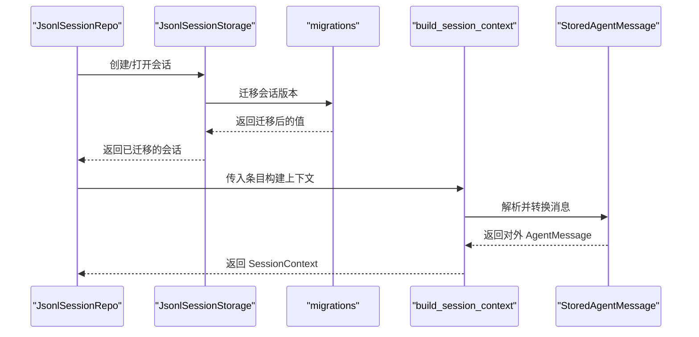
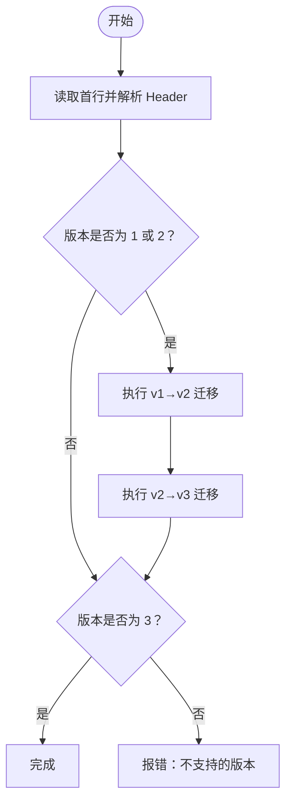
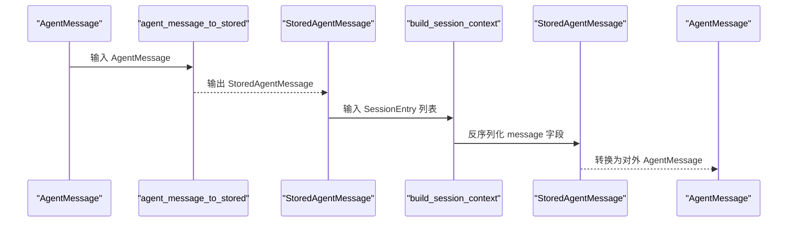
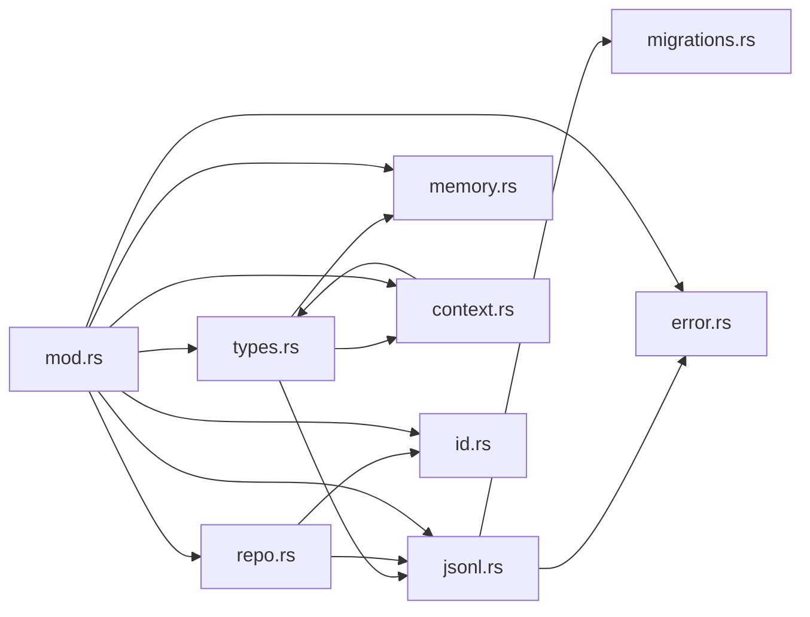

# 会话数据类型

<cite>
**本文档引用的文件**
- [types.rs](file://crates/pi-agent-core/src/session/types.rs)
- [mod.rs](file://crates/pi-agent-core/src/session/mod.rs)
- [migrations.rs](file://crates/pi-agent-core/src/session/migrations.rs)
- [jsonl.rs](file://crates/pi-agent-core/src/session/jsonl.rs)
- [repo.rs](file://crates/pi-agent-core/src/session/repo.rs)
- [memory.rs](file://crates/pi-agent-core/src/session/memory.rs)
- [context.rs](file://crates/pi-agent-core/src/session/context.rs)
- [id.rs](file://crates/pi-agent-core/src/session/id.rs)
- [error.rs](file://crates/pi-agent-core/src/session/error.rs)
- [types.rs](file://crates/pi-agent-core/src/types.rs)
- [session_wire.rs](file://crates/pi-agent-core/tests/session_wire.rs)
- [session_jsonl.rs](file://crates/pi-agent-core/tests/session_jsonl.rs)
- [session_repo.rs](file://crates/pi-agent-core/tests/session_repo.rs)
</cite>

## 目录
1. [简介](#简介)
2. [项目结构](#项目结构)
3. [核心组件](#核心组件)
4. [架构总览](#架构总览)
5. [详细组件分析](#详细组件分析)
6. [依赖关系分析](#依赖关系分析)
7. [性能考量](#性能考量)
8. [故障排查指南](#故障排查指南)
9. [结论](#结论)
10. [附录](#附录)

## 简介
本文件系统性梳理会话数据类型模块，覆盖以下内容：
- 会话相关的核心数据结构：SessionHeader、SessionEntry、SessionMetadata、StoredAgentMessage 及其变体（User、Assistant、ToolResult、BashExecution、Custom、BranchSummary）
- 消息类型的存储格式与序列化/反序列化机制，含版本兼容、字段迁移与默认值处理
- 数据验证规则与约束条件（必填字段、格式校验、业务规则）
- 使用最佳实践（类型安全、性能考虑、错误处理）
- 具体使用模式与代码示例路径

## 项目结构
会话数据类型位于 crates/pi-agent-core/src/session/ 目录，关键文件如下：
- types.rs：定义会话头部、条目、消息变体、使用统计等核心类型
- jsonl.rs：JSON Lines 会话存储实现，负责文件读写、版本迁移与校验
- migrations.rs：会话文件版本迁移逻辑
- repo.rs：会话仓库，管理会话目录、创建/打开/列表/派生会话
- memory.rs：内存中的会话存储实现
- context.rs：从会话条目构建上下文，将存储消息转换为对外 AgentMessage
- id.rs：会话与条目的 ID 生成工具
- error.rs：会话错误码与错误类型
- mod.rs：模块导出入口
- types.rs：对外 AgentMessage 类型定义（用于转换）

图表来源
- [types.rs:1-177](file://crates/pi-agent-core/src/session/types.rs#L1-L177)
- [jsonl.rs:1-559](file://crates/pi-agent-core/src/session/jsonl.rs#L1-L559)
- [migrations.rs:1-151](file://crates/pi-agent-core/src/session/migrations.rs#L1-L151)
- [repo.rs:1-281](file://crates/pi-agent-core/src/session/repo.rs#L1-L281)
- [memory.rs:1-126](file://crates/pi-agent-core/src/session/memory.rs#L1-L126)
- [context.rs:1-496](file://crates/pi-agent-core/src/session/context.rs#L1-L496)
- [id.rs:1-54](file://crates/pi-agent-core/src/session/id.rs#L1-L54)
- [error.rs:1-28](file://crates/pi-agent-core/src/session/error.rs#L1-L28)
- [mod.rs:1-126](file://crates/pi-agent-core/src/session/mod.rs#L1-L126)

章节来源
- [mod.rs:1-20](file://crates/pi-agent-core/src/session/mod.rs#L1-L20)

## 核心组件
本节聚焦于会话数据类型的核心结构及其职责。

- SessionHeader：会话文件头，包含 type、version、id、timestamp、cwd、parentSession 等字段，用于标识会话元信息与父子关系
- SessionEntry：通用会话条目，支持多种 entry_type，并通过 Map<String, Value> 承载动态字段
- StoredAgentMessage：存储侧的消息枚举，包含 User、Assistant、ToolResult、BashExecution、Custom、BranchSummary 等变体
- StoredUsage/StoredUsageCost：存储侧用量与费用统计结构
- SessionMetadata/JsonlSessionMetadata：会话元数据，前者用于内存场景，后者包含文件路径等 JSONL 场景信息
- JsonlSessionStorage：JSON Lines 会话存储，负责创建、打开、追加条目、版本迁移与重写
- JsonlSessionRepo：会话仓库，负责会话目录编码、创建、打开、列表、派生（fork）与最近会话查找
- InMemorySessionStorage：内存中会话存储，用于测试或临时场景
- SessionContext：从会话条目构建的上下文，将存储消息映射为对外 AgentMessage

章节来源
- [types.rs:5-177](file://crates/pi-agent-core/src/session/types.rs#L5-L177)
- [jsonl.rs:10-297](file://crates/pi-agent-core/src/session/jsonl.rs#L10-L297)
- [repo.rs:8-215](file://crates/pi-agent-core/src/session/repo.rs#L8-L215)
- [memory.rs:4-60](file://crates/pi-agent-core/src/session/memory.rs#L4-L60)
- [context.rs:6-274](file://crates/pi-agent-core/src/session/context.rs#L6-L274)

## 架构总览
会话数据类型围绕“存储 + 转换 + 上下文”的架构展开：
- 存储层：JSONL 文件与内存两种实现，统一通过 SessionEntry/SessionHeader 表达
- 迁移层：对旧版本会话进行自动迁移，保证向后兼容
- 转换层：将存储侧消息转换为对外 AgentMessage，供上层逻辑使用
- 仓库层：提供会话生命周期管理（创建、打开、列表、派生）

图表来源
- [repo.rs:13-215](file://crates/pi-agent-core/src/session/repo.rs#L13-L215)
- [jsonl.rs:81-220](file://crates/pi-agent-core/src/session/jsonl.rs#L81-L220)
- [migrations.rs:7-54](file://crates/pi-agent-core/src/session/migrations.rs#L7-L54)
- [context.rs:194-274](file://crates/pi-agent-core/src/session/context.rs#L194-L274)

## 详细组件分析

### 数据类型定义与序列化
- SessionHeader
  - 字段：type="session"、version、id、timestamp、cwd、parentSession（可选）
  - 序列化：作为 JSON Lines 第一行，严格要求 type="session" 且 version=3
  - 反序列化：校验 type、version、id、timestamp、cwd 的存在性与非空
- SessionEntry
  - 字段：type、id、parentId（可选）、timestamp、fields（Map<String, Value>）
  - 动态字段：通过 flatten 的 Map 承载 message、thinking_level_change、model_change 等扩展字段
  - 工具方法：message()/session_info() 构造函数；field() 访问动态字段
- StoredAgentMessage（消息变体）
  - User：content（ContentBlock 列表）、timestamp
  - Assistant：content、api、provider、model、response_model（可选）、response_id（可选）、usage（StoredUsage）、stop_reason、error_message（可选）、timestamp
  - ToolResult：tool_call_id、tool_name、content、is_error、timestamp
  - BashExecution：command、output、exit_code（可选）、cancelled、truncated、full_output_path（可选）、exclude_from_context（可选）、timestamp
  - Custom：custom_type、content、display、details（可选）、timestamp
  - BranchSummary：summary、from_id、timestamp
- StoredUsage/StoredUsageCost
  - StoredUsage：input、output、cache_read、cache_write、total、cost（StoredUsageCost）
  - StoredUsageCost：input、output、cache_read、cache_write

章节来源
- [types.rs:5-177](file://crates/pi-agent-core/src/session/types.rs#L5-L177)
- [types.rs:302-353](file://crates/pi-agent-core/src/types.rs#L302-L353)

### 版本兼容与字段迁移
- 当前版本：3
- 支持从版本 1/2 自动迁移到版本 3：
  - v1→v2：为每个条目生成唯一 id、设置 parentId、将 compaction 的 firstKeptEntryIndex 映射为 firstKeptEntryId
  - v2→v3：将 message.role="hookMessage" 重命名为 "custom"，同时保留 customType 等字段
- 迁移流程：解析首行 header，判断 version，按需执行迁移，必要时重写文件

图表来源
- [migrations.rs:7-54](file://crates/pi-agent-core/src/session/migrations.rs#L7-L54)
- [migrations.rs:56-151](file://crates/pi-agent-core/src/session/migrations.rs#L56-L151)

章节来源
- [migrations.rs:1-151](file://crates/pi-agent-core/src/session/migrations.rs#L1-L151)
- [jsonl.rs:138-212](file://crates/pi-agent-core/src/session/jsonl.rs#L138-L212)

### 序列化与反序列化机制
- JSON Lines 文件
  - 写入：创建时先写入 SessionHeader，随后逐条写入 SessionEntry
  - 读取：逐行解析为 serde_json::Value，再转为具体类型；对首行进行严格校验
  - 迁移：若发现旧版本，迁移后可选择重写文件
- 内存存储
  - InMemorySessionStorage：在内存中维护 header、entries、by_id、leaf_id，提供基本的追加与查询能力
- 错误处理
  - 使用 SessionError 与 SessionErrorCode，涵盖 Not Found、InvalidSession、InvalidEntry、InvalidForkTarget、Storage、Unknown 等

章节来源
- [jsonl.rs:19-297](file://crates/pi-agent-core/src/session/jsonl.rs#L19-L297)
- [memory.rs:12-60](file://crates/pi-agent-core/src/session/memory.rs#L12-L60)
- [error.rs:3-28](file://crates/pi-agent-core/src/session/error.rs#L3-L28)

### 数据验证规则与约束条件
- 必填字段
  - SessionHeader：type="session"、version=3、id、timestamp、cwd
  - SessionEntry：id、type、timestamp
- 格式校验
  - 首行必须为有效 SessionHeader，且 type="session"
  - 不允许重复的 entry id
  - 对于 "leaf" 条目，targetId 字段用于指示当前叶子指向的目标
- 业务规则
  - parentId 与树形结构一致性（路径到根无环）
  - fork 时目标 entry_id 必须存在于源会话中
  - exclude_from_context 在 BashExecution 中仅在为 true 时序列化

章节来源
- [jsonl.rs:138-212](file://crates/pi-agent-core/src/session/jsonl.rs#L138-L212)
- [context.rs:14-69](file://crates/pi-agent-core/src/session/context.rs#L14-L69)
- [repo.rs:157-214](file://crates/pi-agent-core/src/session/repo.rs#L157-L214)

### 消息转换与上下文构建
- agent_message_to_stored
  - 将对外 AgentMessage 转换为存储侧 StoredAgentMessage，处理时间戳、usage 结构映射、可选字段过滤等
- build_session_context
  - 从 SessionEntry 列表构建 SessionContext，支持显式叶子节点或推断叶子节点
  - 支持 thinking_level_change、model_change、active_tools_change、compaction、branch_summary 等条目类型
  - 将存储侧消息转换为对外 AgentMessage，便于上层逻辑消费

图表来源
- [mod.rs:21-125](file://crates/pi-agent-core/src/session/mod.rs#L21-L125)
- [context.rs:71-192](file://crates/pi-agent-core/src/session/context.rs#L71-L192)

章节来源
- [mod.rs:21-125](file://crates/pi-agent-core/src/session/mod.rs#L21-L125)
- [context.rs:194-274](file://crates/pi-agent-core/src/session/context.rs#L194-L274)

### 仓库与存储交互
- JsonlSessionRepo
  - encode_cwd：将工作目录编码为安全的子目录名
  - create/open/list/open_target/most_recent/fork：提供会话全生命周期管理
- JsonlSessionStorage
  - create/open/get_entries/get_leaf_id/append_entry：提供 JSONL 文件的读写与追加能力
- InMemorySessionStorage
  - 用于测试或临时场景，提供基本的条目追加与叶子节点追踪

章节来源
- [repo.rs:13-215](file://crates/pi-agent-core/src/session/repo.rs#L13-L215)
- [jsonl.rs:19-297](file://crates/pi-agent-core/src/session/jsonl.rs#L19-L297)
- [memory.rs:12-60](file://crates/pi-agent-core/src/session/memory.rs#L12-L60)

## 依赖关系分析
- types.rs 定义核心类型，被 jsonl.rs、repo.rs、memory.rs、context.rs 广泛使用
- jsonl.rs 依赖 migrations.rs 进行版本迁移，并依赖 error.rs 提供错误类型
- repo.rs 依赖 jsonl.rs 与 id.rs，提供会话仓库功能
- context.rs 依赖 types.rs 中的 AgentMessage 与 StoredAgentMessage，进行消息转换
- mod.rs 统一导出各模块类型与函数

图表来源
- [types.rs:1-177](file://crates/pi-agent-core/src/session/types.rs#L1-L177)
- [jsonl.rs:1-559](file://crates/pi-agent-core/src/session/jsonl.rs#L1-L559)
- [migrations.rs:1-151](file://crates/pi-agent-core/src/session/migrations.rs#L1-L151)
- [repo.rs:1-281](file://crates/pi-agent-core/src/session/repo.rs#L1-L281)
- [memory.rs:1-126](file://crates/pi-agent-core/src/session/memory.rs#L1-L126)
- [context.rs:1-496](file://crates/pi-agent-core/src/session/context.rs#L1-L496)
- [id.rs:1-54](file://crates/pi-agent-core/src/session/id.rs#L1-L54)
- [error.rs:1-28](file://crates/pi-agent-core/src/session/error.rs#L1-L28)
- [mod.rs:1-20](file://crates/pi-agent-core/src/session/mod.rs#L1-L20)

章节来源
- [mod.rs:1-20](file://crates/pi-agent-core/src/session/mod.rs#L1-L20)

## 性能考量
- JSON Lines 顺序读写，适合流式处理与增量写入
- 内存存储适合小规模数据与测试场景，避免磁盘 IO 开销
- 迁移阶段一次性重写文件，确保后续读取性能稳定
- 建议：
  - 大量条目写入时优先使用 JSONL 存储
  - 避免重复写入相同 id 的条目，减少冲突与回滚成本
  - 合理使用 exclude_from_context 控制上下文大小，降低推理开销

## 故障排查指南
- 常见错误与定位
  - InvalidSession：会话头缺失或版本不支持，检查首行与 version 字段
  - InvalidEntry：条目 id 重复或消息字段缺失，检查重复 id 与必填字段
  - InvalidForkTarget：fork 目标条目不存在，确认源会话中是否存在该 id
  - Storage：文件创建/写入失败，检查权限与磁盘空间
- 排查步骤
  - 确认 JSONL 文件首行为有效 SessionHeader
  - 使用 open_target 时，确认 id 前缀唯一性
  - 若出现版本问题，检查迁移日志与重写结果

章节来源
- [error.rs:3-28](file://crates/pi-agent-core/src/session/error.rs#L3-L28)
- [jsonl.rs:138-212](file://crates/pi-agent-core/src/session/jsonl.rs#L138-L212)
- [repo.rs:102-138](file://crates/pi-agent-core/src/session/repo.rs#L102-L138)

## 结论
会话数据类型模块通过清晰的数据模型、严格的序列化/反序列化与完善的版本迁移机制，提供了可靠、可扩展的会话持久化与上下文构建能力。结合仓库与存储抽象，能够满足不同场景下的会话管理需求。

## 附录

### 使用模式与最佳实践
- 类型安全
  - 使用 SessionEntry::message()/session_info() 构造标准条目，避免手写 Map 导致的键名错误
  - 使用 StoredUsage/StoredUsageCost 保持用量与费用结构一致
- 性能考虑
  - 大量写入使用 JSONL 存储，避免频繁重写
  - 合理控制 BashExecution 的 exclude_from_context，减少上下文体积
- 错误处理
  - 对 open/create/append 等操作捕获 SessionError，区分错误码进行针对性处理
  - fork 时先校验目标条目存在性，避免无效派生

### 代码示例与使用路径
- 构造用户消息条目并写入 JSONL
  - 示例路径：[session_jsonl.rs:19-39](file://crates/pi-agent-core/tests/session_jsonl.rs#L19-L39)
- 打开现有会话并读取最新叶子节点
  - 示例路径：[session_jsonl.rs:42-59](file://crates/pi-agent-core/tests/session_jsonl.rs#L42-L59)
- 仓库创建/列表/打开/派生
  - 示例路径：[session_repo.rs:28-59](file://crates/pi-agent-core/tests/session_repo.rs#L28-L59)
- 消息序列化与字段校验
  - 示例路径：[session_wire.rs:23-78](file://crates/pi-agent-core/tests/session_wire.rs#L23-L78)