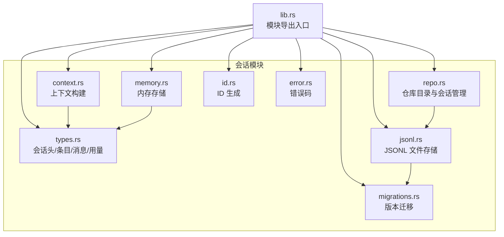
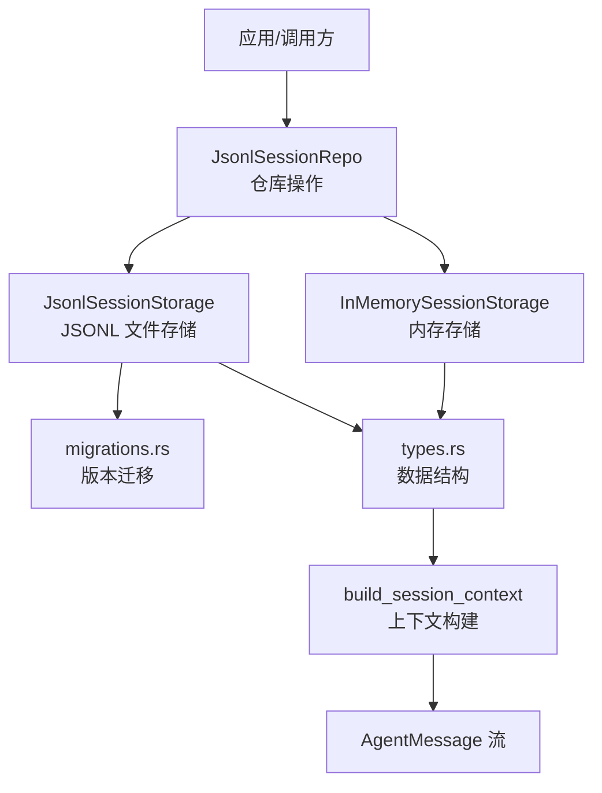
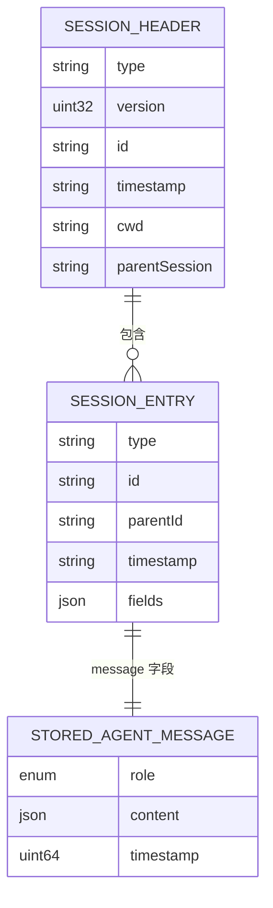
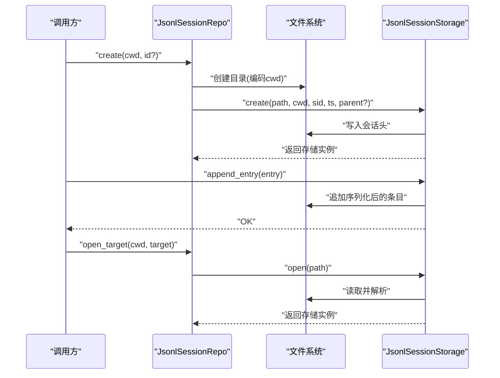
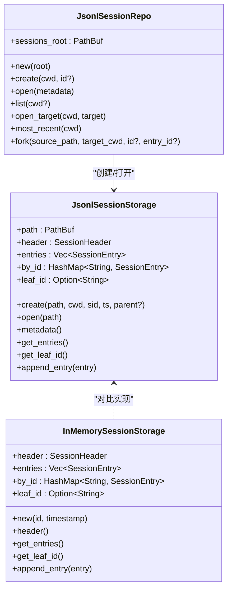
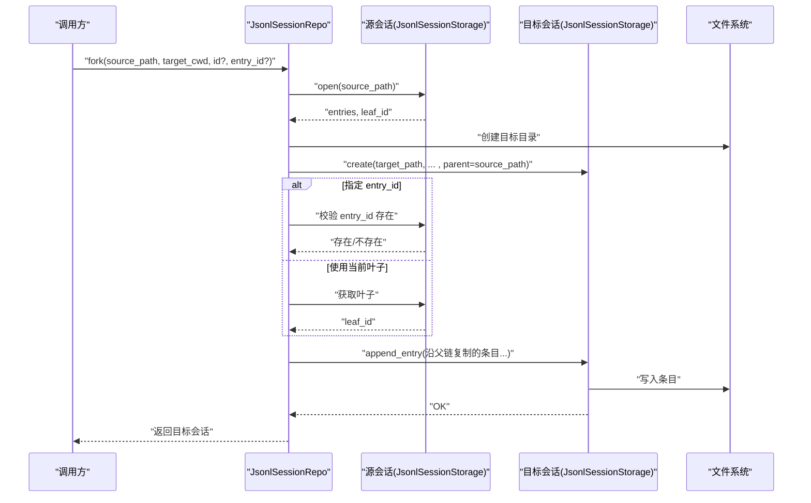
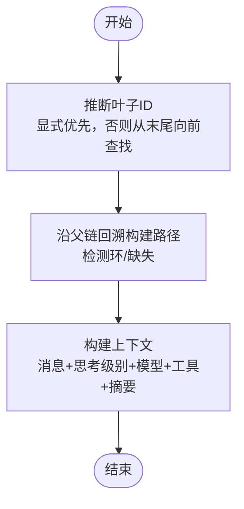
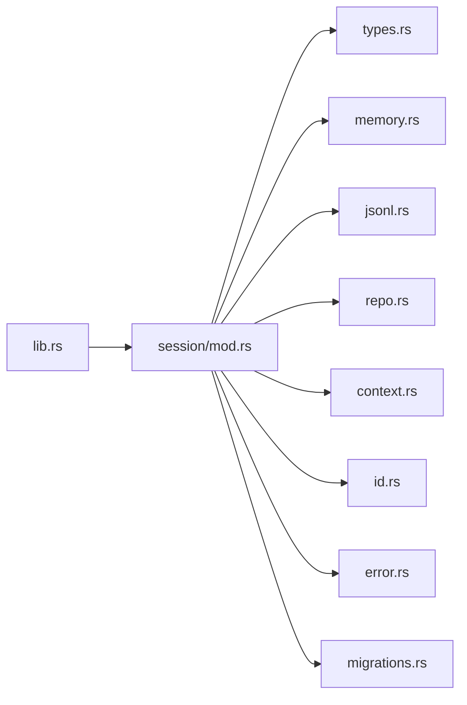

# 会话管理系统

<cite>
**本文引用的文件**
- [mod.rs](file://crates/pi-agent-core/src/session/mod.rs)
- [memory.rs](file://crates/pi-agent-core/src/session/memory.rs)
- [repo.rs](file://crates/pi-agent-core/src/session/repo.rs)
- [jsonl.rs](file://crates/pi-agent-core/src/session/jsonl.rs)
- [types.rs](file://crates/pi-agent-core/src/session/types.rs)
- [context.rs](file://crates/pi-agent-core/src/session/context.rs)
- [id.rs](file://crates/pi-agent-core/src/session/id.rs)
- [error.rs](file://crates/pi-agent-core/src/session/error.rs)
- [migrations.rs](file://crates/pi-agent-core/src/session/migrations.rs)
- [lib.rs](file://crates/pi-agent-core/src/lib.rs)
- [session_jsonl.rs](file://crates/pi-agent-core/tests/session_jsonl.rs)
- [session_repo.rs](file://crates/pi-agent-core/tests/session_repo.rs)
- [session_context.rs](file://crates/pi-agent-core/tests/session_context.rs)
- [branch_summary.rs](file://crates/pi-agent-core/src/branch_summary.rs)
- [session.rs（压缩模块）](file://crates/pi-agent-core/src/compaction/session.rs)
- [convert.rs](file://crates/pi-agent-core/src/convert.rs)
</cite>

## 目录
1. [引言](#引言)
2. [项目结构](#项目结构)
3. [核心组件](#核心组件)
4. [架构总览](#架构总览)
5. [详细组件分析](#详细组件分析)
6. [依赖关系分析](#依赖关系分析)
7. [性能考量](#性能考量)
8. [故障排查指南](#故障排查指南)
9. [结论](#结论)
10. [附录：使用模式与最佳实践](#附录使用模式与最佳实践)

## 引言
本文件系统性地阐述会话管理子系统的设计与实现，覆盖会话生命周期（创建、状态维护、持久化）、内存与仓库两种存储形态、JSONL 持久化格式与迁移机制、分支与合并（通过 fork 与分支摘要）流程，并给出性能优化、一致性保障与备份恢复建议。文档面向不同技术背景读者，既提供高层概览也包含代码级图示与来源标注。

## 项目结构
会话管理位于 pi-agent-core 的 session 子模块中，围绕以下关键文件组织：
- 类型与接口：types.rs 定义会话头、条目、消息、用量等核心数据结构；mod.rs 汇总导出。
- 存储实现：memory.rs 提供内存态；jsonl.rs 实现基于 JSON Lines 的文件存储；repo.rs 提供仓库级目录组织与会话列表、打开、fork 等操作。
- 上下文构建：context.rs 将会话条目转换为 Agent 可消费的消息上下文。
- 工具与错误：id.rs 提供会话/条目 ID 生成；error.rs 定义错误码；migrations.rs 处理历史版本迁移。
- 集成入口：lib.rs 暴露会话模块给上层使用。

图表来源
- [lib.rs:1-47](file://crates/pi-agent-core/src/lib.rs#L1-L47)
- [mod.rs:1-126](file://crates/pi-agent-core/src/session/mod.rs#L1-L126)
- [types.rs:1-177](file://crates/pi-agent-core/src/session/types.rs#L1-L177)
- [memory.rs:1-126](file://crates/pi-agent-core/src/session/memory.rs#L1-L126)
- [jsonl.rs:1-559](file://crates/pi-agent-core/src/session/jsonl.rs#L1-L559)
- [repo.rs:1-281](file://crates/pi-agent-core/src/session/repo.rs#L1-L281)
- [context.rs:1-496](file://crates/pi-agent-core/src/session/context.rs#L1-L496)
- [id.rs:1-54](file://crates/pi-agent-core/src/session/id.rs#L1-L54)
- [error.rs:1-28](file://crates/pi-agent-core/src/session/error.rs#L1-L28)
- [migrations.rs:1-151](file://crates/pi-agent-core/src/session/migrations.rs#L1-L151)

章节来源
- [lib.rs:1-47](file://crates/pi-agent-core/src/lib.rs#L1-L47)
- [mod.rs:1-126](file://crates/pi-agent-core/src/session/mod.rs#L1-L126)

## 核心组件
- 会话头与条目：SessionHeader 描述会话元信息；SessionEntry 表示单条记录，支持多种扩展字段；StoredAgentMessage 定义用户、助手、工具、Bash 执行、自定义、分支摘要等消息类型。
- 内存存储 InMemorySessionStorage：在内存中维护会话头、条目列表、按 id 的索引与叶子节点追踪，适合测试与临时会话。
- JSONL 存储 JsonlSessionStorage：以 JSON Lines 形式持久化到文件，首行是会话头，后续每行为一条条目；支持追加写入、读取解析、重复 id 校验、叶子节点追踪。
- 仓库 JsonlSessionRepo：按工作目录组织会话文件，提供创建、打开、列出、按目标定位、最近会话查询、fork 等能力。
- 上下文构建 build_session_context：从条目路径（线性或分支）构建 Agent 可用的上下文，包含思考级别、模型、活跃工具、压缩摘要、分支摘要等。
- ID 与错误：create_session_id/create_timestamp/generate_entry_id 提供稳定且可预测的标识符；SessionErrorCode 统一错误分类。

章节来源
- [types.rs:1-177](file://crates/pi-agent-core/src/session/types.rs#L1-L177)
- [memory.rs:1-126](file://crates/pi-agent-core/src/session/memory.rs#L1-L126)
- [jsonl.rs:1-559](file://crates/pi-agent-core/src/session/jsonl.rs#L1-L559)
- [repo.rs:1-281](file://crates/pi-agent-core/src/session/repo.rs#L1-L281)
- [context.rs:1-496](file://crates/pi-agent-core/src/session/context.rs#L1-L496)
- [id.rs:1-54](file://crates/pi-agent-core/src/session/id.rs#L1-L54)
- [error.rs:1-28](file://crates/pi-agent-core/src/session/error.rs#L1-L28)

## 架构总览
会话管理采用“类型定义 + 两种存储 + 仓库协调 + 上下文构建”的分层设计：
- 类型层：统一的数据结构与序列化约定。
- 存储层：内存与 JSONL 两种后端，满足不同运行时需求。
- 仓库层：对存储进行目录化组织与生命周期管理（创建、打开、fork、列举）。
- 上下文层：将会话树转换为线性消息流，注入思考级别、模型、工具、摘要等上下文信息。

图表来源
- [repo.rs:1-281](file://crates/pi-agent-core/src/session/repo.rs#L1-L281)
- [jsonl.rs:1-559](file://crates/pi-agent-core/src/session/jsonl.rs#L1-L559)
- [memory.rs:1-126](file://crates/pi-agent-core/src/session/memory.rs#L1-L126)
- [migrations.rs:1-151](file://crates/pi-agent-core/src/session/migrations.rs#L1-L151)
- [types.rs:1-177](file://crates/pi-agent-core/src/session/types.rs#L1-L177)
- [context.rs:1-496](file://crates/pi-agent-core/src/session/context.rs#L1-L496)

## 详细组件分析

### 数据模型与序列化（JSONL）
- JSONL 文件由两部分组成：首行是 SessionHeader（type="session", version=3），其后每行是一个 SessionEntry（type="message" 或其他扩展类型）。消息体通过 "message" 字段承载 StoredAgentMessage。
- 迁移机制：当读取到旧版本（如 v1/v2）时，自动迁移至当前版本（v3），包括补全 id/parentId、重命名 role、添加新字段等；迁移完成后可回写文件。
- 错误处理：对空文件、缺失头、非法版本、重复 id、解析失败等情况进行明确报错。

图表来源
- [types.rs:5-70](file://crates/pi-agent-core/src/session/types.rs#L5-L70)
- [types.rs:72-139](file://crates/pi-agent-core/src/session/types.rs#L72-L139)
- [jsonl.rs:118-220](file://crates/pi-agent-core/src/session/jsonl.rs#L118-L220)
- [migrations.rs:56-150](file://crates/pi-agent-core/src/session/migrations.rs#L56-L150)

章节来源
- [jsonl.rs:19-297](file://crates/pi-agent-core/src/session/jsonl.rs#L19-L297)
- [migrations.rs:7-54](file://crates/pi-agent-core/src/session/migrations.rs#L7-L54)
- [types.rs:5-177](file://crates/pi-agent-core/src/session/types.rs#L5-L177)

### 生命周期管理（创建、状态维护、持久化）
- 创建：仓库创建会话时，先按 cwd 编码生成目录，再生成带时间戳与会话 id 的文件名，创建 JSONL 文件并写入会话头。
- 追加：每次新增条目都会校验 id 唯一性，序列化为 JSON 并追加到文件末尾；同时更新内存中的 by_id 映射与叶子节点。
- 打开：读取文件，逐行解析为 serde_json::Value，迁移后转为 SessionHeader 与 SessionEntry 列表，建立 by_id 索引与叶子追踪。
- 最近会话：按修改时间排序返回最新会话，便于快速定位。

图表来源
- [repo.rs:29-46](file://crates/pi-agent-core/src/session/repo.rs#L29-L46)
- [repo.rs:102-138](file://crates/pi-agent-core/src/session/repo.rs#L102-L138)
- [jsonl.rs:20-79](file://crates/pi-agent-core/src/session/jsonl.rs#L20-L79)
- [jsonl.rs:248-296](file://crates/pi-agent-core/src/session/jsonl.rs#L248-L296)

章节来源
- [repo.rs:13-155](file://crates/pi-agent-core/src/session/repo.rs#L13-L155)
- [jsonl.rs:81-220](file://crates/pi-agent-core/src/session/jsonl.rs#L81-L220)

### 内存会话 vs 仓库会话
- 内存会话 InMemorySessionStorage
  - 特点：无磁盘 IO，适合测试、临时会话、快速迭代。
  - 行为：维护 header、entries、by_id、leaf_id；追加时检查重复 id；支持读取 header 与条目列表。
- 仓库会话 JsonlSessionRepo + JsonlSessionStorage
  - 特点：持久化到文件，支持跨进程/重启访问；提供目录组织、列表、打开、fork、最近会话等功能。
  - 适用：生产环境、长期会话、多会话管理、分支与合并场景。

图表来源
- [memory.rs:4-60](file://crates/pi-agent-core/src/session/memory.rs#L4-L60)
- [jsonl.rs:10-297](file://crates/pi-agent-core/src/session/jsonl.rs#L10-L297)
- [repo.rs:8-215](file://crates/pi-agent-core/src/session/repo.rs#L8-L215)

章节来源
- [memory.rs:12-60](file://crates/pi-agent-core/src/session/memory.rs#L12-L60)
- [jsonl.rs:19-297](file://crates/pi-agent-core/src/session/jsonl.rs#L19-L297)
- [repo.rs:13-215](file://crates/pi-agent-core/src/session/repo.rs#L13-L215)

### 分支与合并（fork 与分支摘要）
- Fork（分支创建）
  - 从源会话选择一个叶子或指定 entry_id，沿父链向上收集完整路径，复制到新的会话文件中；新会话头保留 parentSession 指向源文件。
  - 若 entry_id 不存在，返回 InvalidForkTarget 错误。
- 分支摘要（Branch Summary）
  - 在压缩或分支返回时，生成一条 "branch_summary" 条目，包含摘要文本与来源会话 id；上下文构建时将其转换为用户提示文本，帮助模型理解分支背景。
  - 生成与收集逻辑由 branch_summary 模块与压缩模块协作完成。

图表来源
- [repo.rs:157-214](file://crates/pi-agent-core/src/session/repo.rs#L157-L214)
- [jsonl.rs:248-296](file://crates/pi-agent-core/src/session/jsonl.rs#L248-L296)

章节来源
- [repo.rs:157-214](file://crates/pi-agent-core/src/session/repo.rs#L157-L214)
- [context.rs:259-274](file://crates/pi-agent-core/src/session/context.rs#L259-L274)
- [branch_summary.rs:47-196](file://crates/pi-agent-core/src/branch_summary.rs#L47-L196)
- [session.rs（压缩模块）:93-110](file://crates/pi-agent-core/src/compaction/session.rs#L93-L110)
- [convert.rs:80](file://crates/pi-agent-core/src/convert.rs#L80)

### 上下文构建与消息映射
- 路径推断：若显式传入叶子 id，则以其为目标；否则从末尾向前查找，遇到 leaf 条目则以 targetId 作为目标，否则以最后一个非 session 条目为叶子。
- 路径遍历：从叶子向上回溯父链，检测环与缺失条目，构建线性路径。
- 消息映射：将 StoredAgentMessage 映射为 AgentMessage（用户文本、助手回复、工具结果、Bash 执行、自定义、分支摘要），并注入思考级别、模型、活跃工具、压缩/分支摘要等上下文。

图表来源
- [context.rs:14-69](file://crates/pi-agent-core/src/session/context.rs#L14-L69)
- [context.rs:194-274](file://crates/pi-agent-core/src/session/context.rs#L194-L274)

章节来源
- [context.rs:14-274](file://crates/pi-agent-core/src/session/context.rs#L14-L274)

## 依赖关系分析
- 模块导出：lib.rs 将 session 子模块暴露给外部使用。
- 会话模块内部：types 提供数据契约；memory/jsonl 提供存储实现；repo 协调文件系统与存储；context 将存储转换为上下文；id/error/migrations 提供支撑能力。
- 关键耦合点：
  - JSONL 解析与迁移强依赖 serde_json。
  - fork 依赖 by_id 快速定位条目。
  - 上下文构建依赖条目父子关系与字段解析。

图表来源
- [lib.rs:1-47](file://crates/pi-agent-core/src/lib.rs#L1-L47)
- [mod.rs:1-19](file://crates/pi-agent-core/src/session/mod.rs#L1-L19)

章节来源
- [lib.rs:1-47](file://crates/pi-agent-core/src/lib.rs#L1-L47)
- [mod.rs:1-19](file://crates/pi-agent-core/src/session/mod.rs#L1-L19)

## 性能考量
- IO 与序列化
  - JSONL 追加写入为顺序 IO，适合高吞吐写入；读取时一次性解析所有行，适合小到中等规模会话。
  - 建议：大会话可考虑分片或定期归档；避免频繁随机写。
- 内存占用
  - JSONL 与内存实现均维护 by_id 映射与完整条目列表；大会话应控制并发写入与及时清理不再需要的条目。
- 迁移成本
  - v1->v2->v3 迁移涉及全量扫描与重写；首次打开旧文件时有额外 IO；建议在部署阶段集中迁移或异步迁移。
- fork 成本
  - fork 需要遍历父链复制条目；对超长历史会话，建议限制 fork 起点或启用压缩后再 fork。

[本节为通用指导，不直接分析具体文件]

## 故障排查指南
常见错误与定位要点：
- 无效会话头/版本
  - 现象：打开文件时报“不是有效的会话头”或“不支持的版本”。
  - 排查：确认首行是否为 type="session" 且 version=3；必要时允许迁移或修复版本号。
- 重复条目 id
  - 现象：追加条目时报重复 id。
  - 排查：检查生成策略或使用唯一 id；避免重复插入。
- fork 目标不存在
  - 现象：fork 报 InvalidForkTarget。
  - 排查：确认 entry_id 是否存在于源会话；或省略 entry_id 让系统使用当前叶子。
- 文件系统错误
  - 现象：创建目录/打开文件失败。
  - 排查：检查权限、路径合法性、磁盘空间。

章节来源
- [jsonl.rs:118-176](file://crates/pi-agent-core/src/session/jsonl.rs#L118-L176)
- [jsonl.rs:248-254](file://crates/pi-agent-core/src/session/jsonl.rs#L248-L254)
- [repo.rs:192-197](file://crates/pi-agent-core/src/session/repo.rs#L192-L197)
- [error.rs:3-11](file://crates/pi-agent-core/src/session/error.rs#L3-L11)

## 结论
该会话管理系统以清晰的类型契约与双存储后端为基础，结合仓库级目录组织与 fork 能力，实现了从创建、维护到持久化的完整生命周期管理。通过上下文构建与分支摘要，系统在复杂对话场景中也能保持良好的可追溯性与可解释性。配合迁移机制与严格的错误处理，系统具备较好的演进能力与稳定性。

[本节为总结，不直接分析具体文件]

## 附录：使用模式与最佳实践

### 会话创建与写入
- 使用仓库创建会话，确保目录按 cwd 编码组织；随后追加条目，注意 id 唯一性。
- 示例参考
  - [session_jsonl.rs:20-39](file://crates/pi-agent-core/tests/session_jsonl.rs#L20-L39)
  - [session_repo.rs:28-41](file://crates/pi-agent-core/tests/session_repo.rs#L28-L41)

章节来源
- [repo.rs:29-46](file://crates/pi-agent-core/src/session/repo.rs#L29-L46)
- [jsonl.rs:248-296](file://crates/pi-agent-core/src/session/jsonl.rs#L248-L296)
- [session_jsonl.rs:20-39](file://crates/pi-agent-core/tests/session_jsonl.rs#L20-L39)
- [session_repo.rs:28-41](file://crates/pi-agent-core/tests/session_repo.rs#L28-L41)

### 会话打开与最近会话
- 通过 open_target 支持按 id 前缀匹配；most_recent 按修改时间排序返回最新会话。
- 示例参考
  - [session_repo.rs:37-59](file://crates/pi-agent-core/tests/session_repo.rs#L37-L59)

章节来源
- [repo.rs:102-155](file://crates/pi-agent-core/src/session/repo.rs#L102-L155)
- [session_repo.rs:37-59](file://crates/pi-agent-core/tests/session_repo.rs#L37-L59)

### fork 与分支摘要
- fork 从源会话复制路径到新会话，保留 parentSession 指向源文件；分支摘要用于在上下文中注入分支背景。
- 示例参考
  - [session_repo.rs:44-59](file://crates/pi-agent-core/tests/session_repo.rs#L44-L59)
  - [context.rs:259-274](file://crates/pi-agent-core/src/session/context.rs#L259-L274)
  - [branch_summary.rs:126-196](file://crates/pi-agent-core/src/branch_summary.rs#L126-L196)

章节来源
- [repo.rs:157-214](file://crates/pi-agent-core/src/session/repo.rs#L157-L214)
- [context.rs:259-274](file://crates/pi-agent-core/src/session/context.rs#L259-L274)
- [branch_summary.rs:126-196](file://crates/pi-agent-core/src/branch_summary.rs#L126-L196)

### 上下文构建与消息映射
- 从条目路径构建 AgentMessage 流，包含思考级别、模型、工具、压缩与分支摘要提示。
- 示例参考
  - [session_context.rs:21-42](file://crates/pi-agent-core/tests/session_context.rs#L21-L42)
  - [context.rs:194-274](file://crates/pi-agent-core/src/session/context.rs#L194-L274)

章节来源
- [session_context.rs:21-42](file://crates/pi-agent-core/tests/session_context.rs#L21-L42)
- [context.rs:194-274](file://crates/pi-agent-core/src/session/context.rs#L194-L274)

### 最佳实践
- 性能
  - 控制会话大小，定期归档或压缩；避免在热路径上频繁随机写。
  - 对大文件 fork 前先压缩或限定起点。
- 一致性
  - 使用唯一 id 生成器；严格校验重复 id；迁移时确保原子性（临时文件 + 原子替换）。
- 备份与恢复
  - 定期备份 JSONL 文件；保留 parentSession 以便跨文件关联；恢复时先迁移再打开。
- 可观测性
  - 记录会话创建/fork/压缩/分支摘要事件；在错误日志中包含会话 id 与路径。

[本节为通用指导，不直接分析具体文件]