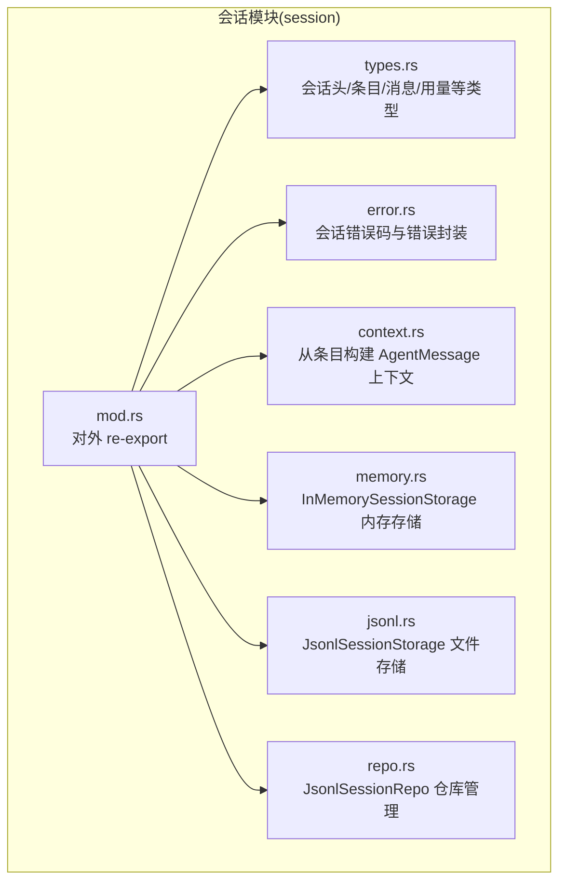
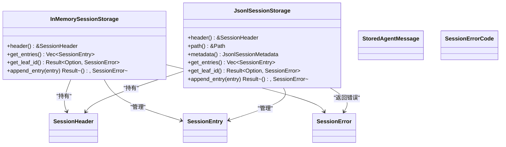
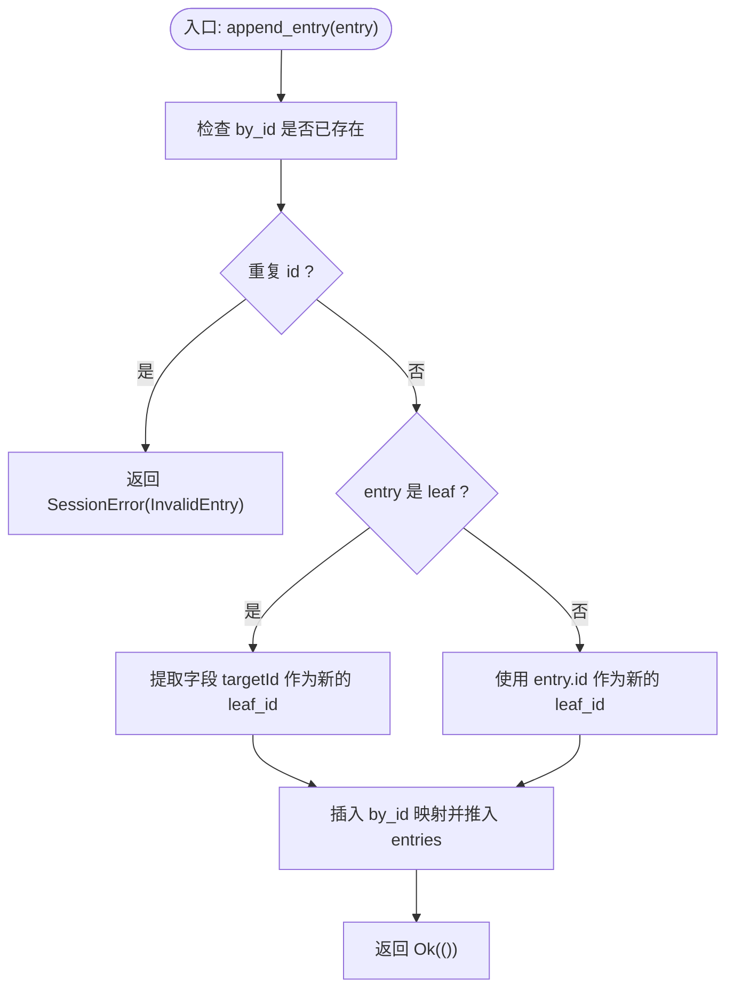
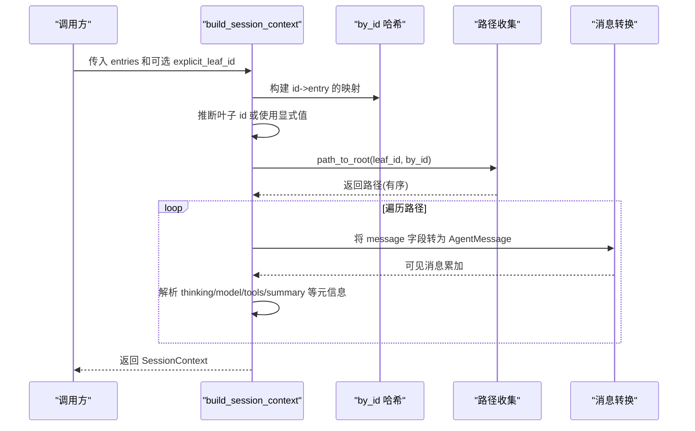
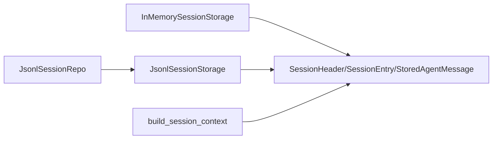
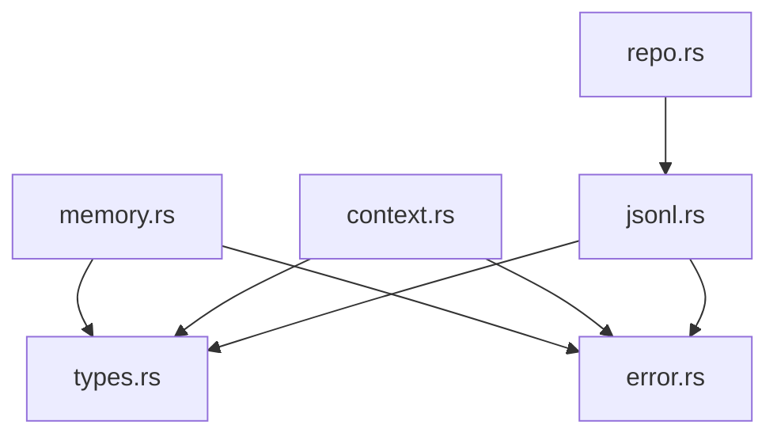

# 内存会话存储

<cite>
**本文引用的文件**
- [memory.rs](file://crates/pi-agent-core/src/session/memory.rs)
- [types.rs](file://crates/pi-agent-core/src/session/types.rs)
- [error.rs](file://crates/pi-agent-core/src/session/error.rs)
- [context.rs](file://crates/pi-agent-core/src/session/context.rs)
- [jsonl.rs](file://crates/pi-agent-core/src/session/jsonl.rs)
- [repo.rs](file://crates/pi-agent-core/src/session/repo.rs)
- [mod.rs](file://crates/pi-agent-core/src/session/mod.rs)
- [session_context.rs](file://crates/pi-agent-core/tests/session_context.rs)
- [2026-06-05-pi-agent-session-persistence-design.md](file://docs/superpowers/specs/2026-06-05-pi-agent-session-persistence-design.md)
</cite>

## 目录
1. [简介](#简介)
2. [项目结构](#项目结构)
3. [核心组件](#核心组件)
4. [架构总览](#架构总览)
5. [详细组件分析](#详细组件分析)
6. [依赖关系分析](#依赖关系分析)
7. [性能与内存管理](#性能与内存管理)
8. [故障排查指南](#故障排查指南)
9. [结论](#结论)
10. [附录：使用模式与最佳实践](#附录使用模式与最佳实践)

## 简介
本文件系统性地解析内存会话存储模块 InMemorySessionStorage 的实现原理与使用场景，覆盖其数据结构设计、并发访问控制、内存管理策略、会话生命周期（创建、更新、删除）、优势与限制、适用场景、最佳实践（内存优化、垃圾回收、性能监控）以及具体使用模式与参考路径。同时给出与 JSONL 存储、仓库管理、上下文构建等周边模块的关系图与流程图，帮助读者从整体到细节全面掌握该模块。

## 项目结构
InMemorySessionStorage 所属的会话子系统位于 pi-agent-core 的 session 模块中，围绕“类型定义、错误模型、上下文构建、内存存储、JSONL 文件存储、仓库管理”形成完整能力面，并通过公共 re-export 对外暴露。

**图表来源**
- [mod.rs:1-20](file://crates/pi-agent-core/src/session/mod.rs#L1-L20)
- [types.rs:1-177](file://crates/pi-agent-core/src/session/types.rs#L1-L177)
- [error.rs:1-28](file://crates/pi-agent-core/src/session/error.rs#L1-L28)
- [context.rs:1-496](file://crates/pi-agent-core/src/session/context.rs#L1-L496)
- [memory.rs:1-126](file://crates/pi-agent-core/src/session/memory.rs#L1-L126)
- [jsonl.rs:1-559](file://crates/pi-agent-core/src/session/jsonl.rs#L1-L559)
- [repo.rs:1-281](file://crates/pi-agent-core/src/session/repo.rs#L1-L281)

**章节来源**
- [mod.rs:1-20](file://crates/pi-agent-core/src/session/mod.rs#L1-L20)

## 核心组件
- InMemorySessionStorage：进程内内存存储，用于单元测试与快速原型，支持会话头、线性条目追加、叶子节点追踪、重复条目校验。
- SessionHeader/SessionEntry/StoredAgentMessage：会话元数据、条目结构与消息载体的统一序列化模型。
- SessionError/SessionErrorCode：稳定的错误码体系，便于上层处理。
- build_session_context：将条目路径转换为 AgentMessage 列表，支持思考级别、模型、工具、压缩/分支摘要等元信息注入。
- JsonlSessionStorage/JsonlSessionRepo：持久化 JSONL 文件与按工作目录组织的仓库管理，作为生产环境首选。

**章节来源**
- [memory.rs:4-60](file://crates/pi-agent-core/src/session/memory.rs#L4-L60)
- [types.rs:5-177](file://crates/pi-agent-core/src/session/types.rs#L5-L177)
- [error.rs:3-28](file://crates/pi-agent-core/src/session/error.rs#L3-L28)
- [context.rs:6-274](file://crates/pi-agent-core/src/session/context.rs#L6-L274)
- [jsonl.rs:10-297](file://crates/pi-agent-core/src/session/jsonl.rs#L10-L297)
- [repo.rs:8-215](file://crates/pi-agent-core/src/session/repo.rs#L8-L215)

## 架构总览
InMemorySessionStorage 与 JSONL 存储共享同一套类型与错误模型，对外通过统一接口（header/get_entries/get_leaf_id/append_entry）进行交互；在运行时可按需在内存与文件之间切换，满足不同场景对一致性与持久化的需求。

**图表来源**
- [memory.rs:4-60](file://crates/pi-agent-core/src/session/memory.rs#L4-L60)
- [jsonl.rs:10-297](file://crates/pi-agent-core/src/session/jsonl.rs#L10-L297)
- [types.rs:5-177](file://crates/pi-agent-core/src/session/types.rs#L5-L177)
- [error.rs:3-28](file://crates/pi-agent-core/src/session/error.rs#L3-L28)

## 详细组件分析

### InMemorySessionStorage 实现要点
- 数据结构
  - header：会话头，包含版本、类型、会话 ID、时间戳、cwd、父会话等。
  - entries：线性条目列表，按追加顺序维护。
  - by_id：以 id 为键的哈希映射，用于 O(1) 查重与路径回溯。
  - leaf_id：当前叶子节点 id，支持 leaf 条目与显式 targetId 的语义。
- 并发访问控制
  - 当前实现未引入锁或原子类型，属于单线程可变状态。若在多线程环境中使用，需外部同步（如 Mutex/Arc）。
- 追加与去重
  - 追加前检查 by_id 是否已存在，避免重复 id。
  - 若新条目为 leaf，则优先使用字段 targetId 作为叶子；否则使用自身 id。
- 访问接口
  - header/get_entries/get_leaf_id 提供只读视图与查询。
  - append_entry 返回 SessionError，错误码包含 InvalidEntry 等。

**图表来源**
- [memory.rs:41-59](file://crates/pi-agent-core/src/session/memory.rs#L41-L59)

**章节来源**
- [memory.rs:4-60](file://crates/pi-agent-core/src/session/memory.rs#L4-L60)

### 会话上下文构建（build_session_context）
- 叶子节点推断：优先使用显式 leaf 条目 targetId；若无则取最后一个非 session 类型条目的 id。
- 路径回溯：基于 parent_id 逆向遍历，构建从根到叶子的消息路径；检测环与缺失条目并返回相应错误。
- 消息转换：将 message 字段中的 StoredAgentMessage 转换为 AgentMessage；同时识别 thinking_level_change、model_change、active_tools_change、compaction、branch_summary 等元信息并注入上下文。

**图表来源**
- [context.rs:194-274](file://crates/pi-agent-core/src/session/context.rs#L194-L274)

**章节来源**
- [context.rs:14-274](file://crates/pi-agent-core/src/session/context.rs#L14-L274)

### 与 JSONL 存储与仓库的关系
- JSONL 存储负责磁盘文件的严格校验、容错解析、追加写入与迁移重写。
- 仓库管理提供按工作目录编码的会话目录、列出、打开、最近会话、分叉等功能。
- InMemorySessionStorage 与 JSONL 存储共享相同的类型与错误模型，便于在测试与开发阶段使用内存存储，在生产环境使用 JSONL 存储。

**图表来源**
- [memory.rs:1-126](file://crates/pi-agent-core/src/session/memory.rs#L1-L126)
- [jsonl.rs:1-559](file://crates/pi-agent-core/src/session/jsonl.rs#L1-L559)
- [repo.rs:1-281](file://crates/pi-agent-core/src/session/repo.rs#L1-L281)
- [context.rs:1-496](file://crates/pi-agent-core/src/session/context.rs#L1-L496)
- [types.rs:1-177](file://crates/pi-agent-core/src/session/types.rs#L1-L177)

**章节来源**
- [jsonl.rs:19-297](file://crates/pi-agent-core/src/session/jsonl.rs#L19-L297)
- [repo.rs:13-215](file://crates/pi-agent-core/src/session/repo.rs#L13-L215)
- [context.rs:194-274](file://crates/pi-agent-core/src/session/context.rs#L194-L274)

## 依赖关系分析
- 内聚性：InMemorySessionStorage 仅依赖 SessionHeader/SessionEntry/SessionError，内聚度高。
- 耦合点：与 types.rs 的强耦合（类型定义），与 error.rs 的错误模型耦合；与 context.rs 的使用场景耦合（构建上下文）。
- 外部依赖：标准库集合与 serde；JSONL 存储依赖文件系统与 serde_json。
- 循环依赖：未发现循环导入；各模块职责清晰。

**图表来源**
- [memory.rs:1-126](file://crates/pi-agent-core/src/session/memory.rs#L1-L126)
- [types.rs:1-177](file://crates/pi-agent-core/src/session/types.rs#L1-L177)
- [error.rs:1-28](file://crates/pi-agent-core/src/session/error.rs#L1-L28)
- [context.rs:1-496](file://crates/pi-agent-core/src/session/context.rs#L1-L496)
- [jsonl.rs:1-559](file://crates/pi-agent-core/src/session/jsonl.rs#L1-L559)
- [repo.rs:1-281](file://crates/pi-agent-core/src/session/repo.rs#L1-L281)

**章节来源**
- [mod.rs:1-20](file://crates/pi-agent-core/src/session/mod.rs#L1-L20)

## 性能与内存管理
- 时间复杂度
  - 追加：O(1)（哈希查重 + 向量尾插）。
  - 查询叶子：O(n)（线性扫描条目以推断叶子，但通常由 leaf 条目直接确定）。
  - 上下文构建：O(n)（路径回溯与消息转换）。
- 空间复杂度
  - entries 与 by_id 各保存一次条目副本，空间开销约为 2×条目数。
- 并发与锁
  - 当前实现未内置并发控制，多线程使用需外部同步。
- 内存管理策略
  - 使用 Vec + HashMap 组合，适合短生命周期的会话；长生命周期建议配合定期清理或分页读取。
  - 在大体量会话中，可考虑分片存储或只保留最近 N 条目以控制内存峰值。
- 错误处理
  - 重复 id、环路、缺失条目等均通过 SessionError 返回，便于上层降级或重试。

**章节来源**
- [memory.rs:41-59](file://crates/pi-agent-core/src/session/memory.rs#L41-L59)
- [context.rs:29-69](file://crates/pi-agent-core/src/session/context.rs#L29-L69)

## 故障排查指南
- 常见错误与定位
  - 重复条目 id：append_entry 返回 InvalidEntry，检查是否重复使用相同 id。
  - 环路/缺失条目：build_session_context 检测到环或 parent_id 缺失时返回 InvalidSession。
  - JSONL 版本不支持/头部无效：JsonlSessionStorage.open 抛出 InvalidSession/InvalidEntry。
- 定位手段
  - 打印 entries 与 by_id 的长度与内容，确认 id 唯一性与 parent_id 连接。
  - 使用测试用例模式复现问题，逐步缩小输入范围。
- 修复建议
  - 生成唯一 id（如 UUIDv7 前缀），确保 parent_id 与实际存在的条目一致。
  - 对于 JSONL 文件，先验证首行是否为合法 header，再逐行解析。

**章节来源**
- [memory.rs:41-59](file://crates/pi-agent-core/src/session/memory.rs#L41-L59)
- [context.rs:42-69](file://crates/pi-agent-core/src/session/context.rs#L42-L69)
- [jsonl.rs:118-220](file://crates/pi-agent-core/src/session/jsonl.rs#L118-L220)
- [error.rs:3-11](file://crates/pi-agent-core/src/session/error.rs#L3-L11)

## 结论
InMemorySessionStorage 以极简的数据结构与接口提供了可靠的内存会话能力，适用于测试、离线脚本与短期会话场景。结合 JSONL 存储与仓库管理，可在开发与生产之间灵活切换。对于需要长期持久化、跨进程共享与大规模会话的场景，应优先采用 JSONL 存储与仓库管理方案，并在上层通过 build_session_context 构建上下文，确保会话语义的一致性与可追溯性。

## 附录：使用模式与最佳实践

### 使用模式
- 测试与原型
  - 使用 InMemorySessionStorage 快速构造线性对话，验证上下文构建逻辑与消息转换。
  - 参考路径：[session_context.rs:45-51](file://crates/pi-agent-core/tests/session_context.rs#L45-L51)
- 生产与持久化
  - 使用 JsonlSessionStorage 进行文件级持久化，配合 JsonlSessionRepo 管理会话目录与最近会话。
  - 参考路径：[jsonl.rs:19-297](file://crates/pi-agent-core/src/session/jsonl.rs#L19-L297)，[repo.rs:13-215](file://crates/pi-agent-core/src/session/repo.rs#L13-L215)
- 上下文构建
  - 将条目转换为 AgentMessage 列表，注入思考级别、模型、工具与摘要信息。
  - 参考路径：[context.rs:194-274](file://crates/pi-agent-core/src/session/context.rs#L194-L274)

### 最佳实践
- 内存使用优化
  - 控制会话规模：对长历史会话采用分页读取或压缩摘要（branch_summary/compaction）。
  - 清理策略：定期清理不再使用的会话或只保留最近 N 条目。
- 垃圾回收策略
  - 由于内存存储为进程内结构，随作用域结束自动释放；多线程场景需显式同步。
- 性能监控
  - 记录条目数量、追加耗时、上下文构建耗时；对异常错误码进行统计与告警。
- 一致性与迁移
  - JSONL 存储支持版本迁移与重写，确保旧文件兼容与新格式落地。
  - 参考路径：[jsonl.rs:299-340](file://crates/pi-agent-core/src/session/jsonl.rs#L299-L340)

### 设计背景与兼容性
- Rust M3 目标要求与兼容性契约，确保与 TypeScript 环境互操作。
- 参考路径：[2026-06-05-pi-agent-session-persistence-design.md:81-282](file://docs/superpowers/specs/2026-06-05-pi-agent-session-persistence-design.md#L81-L282)

**章节来源**
- [session_context.rs:1-52](file://crates/pi-agent-core/tests/session_context.rs#L1-L52)
- [jsonl.rs:19-297](file://crates/pi-agent-core/src/session/jsonl.rs#L19-L297)
- [repo.rs:13-215](file://crates/pi-agent-core/src/session/repo.rs#L13-L215)
- [context.rs:194-274](file://crates/pi-agent-core/src/session/context.rs#L194-L274)
- [2026-06-05-pi-agent-session-persistence-design.md:81-282](file://docs/superpowers/specs/2026-06-05-pi-agent-session-persistence-design.md#L81-L282)