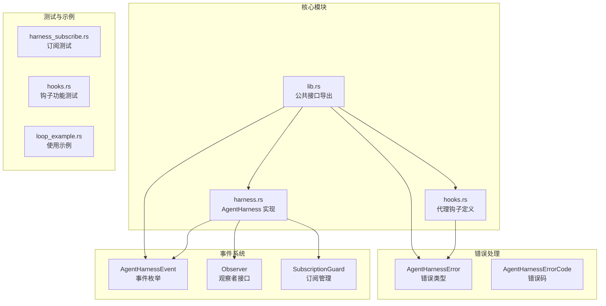
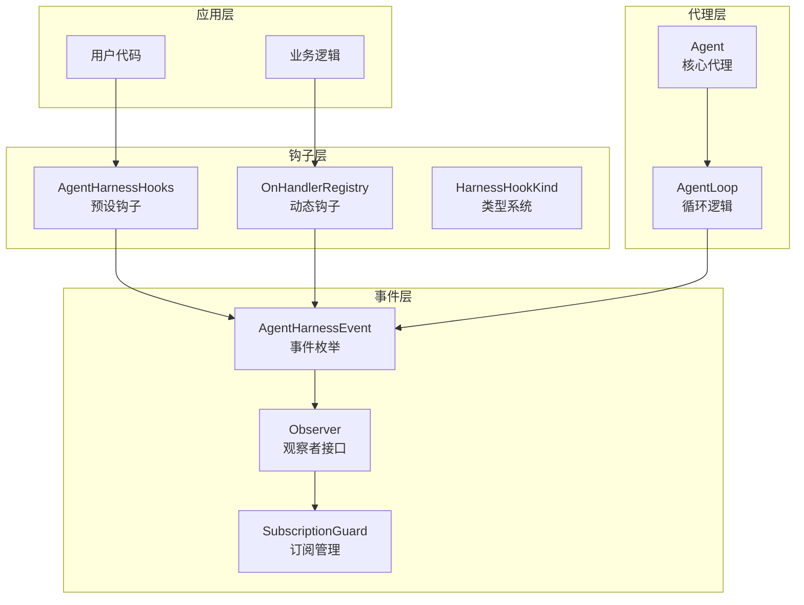
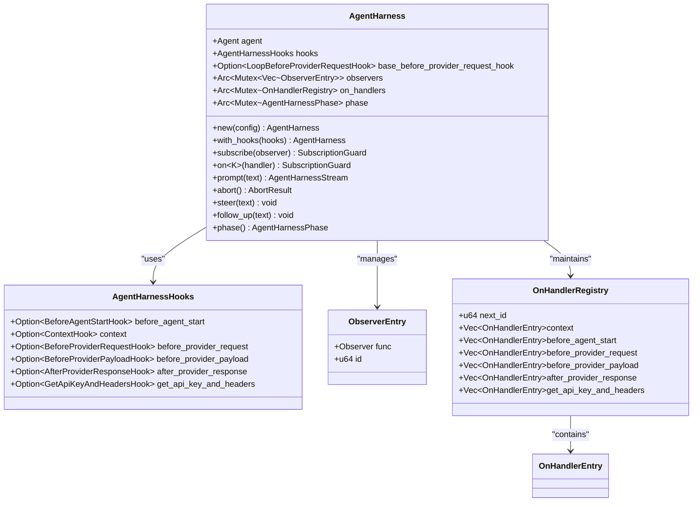
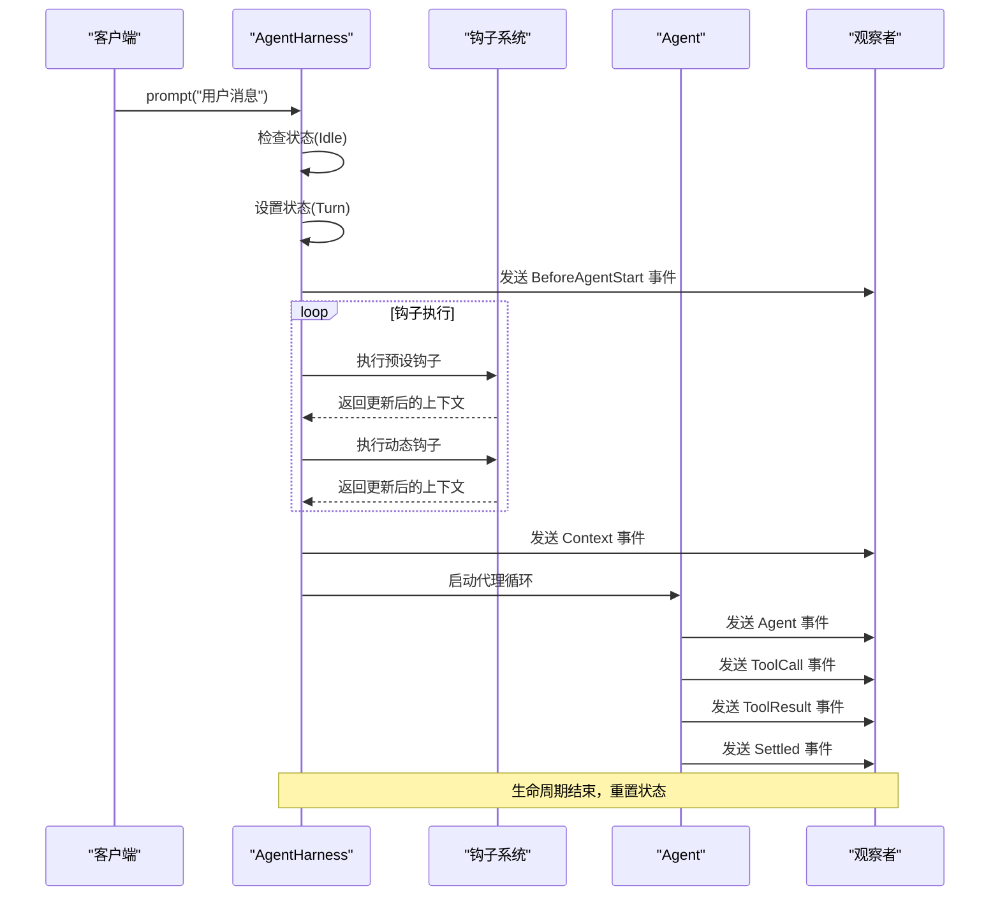
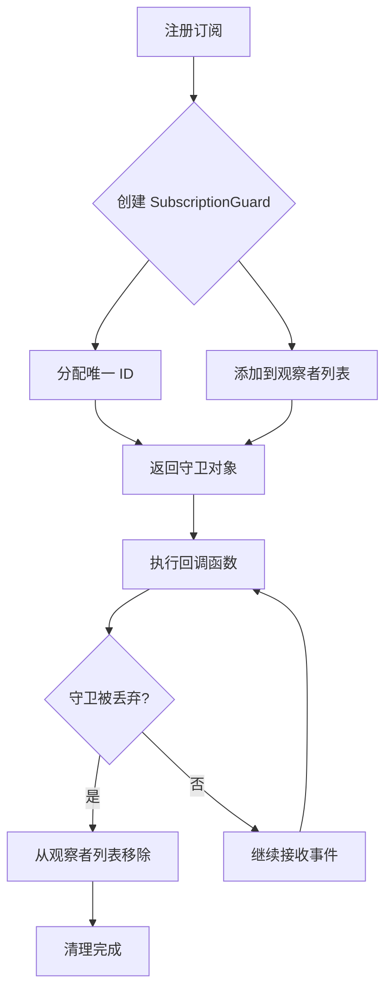
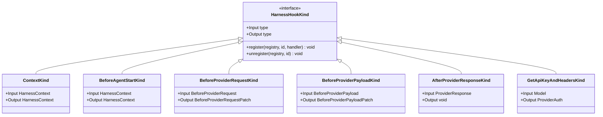
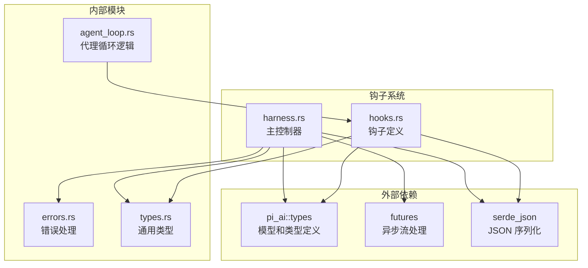
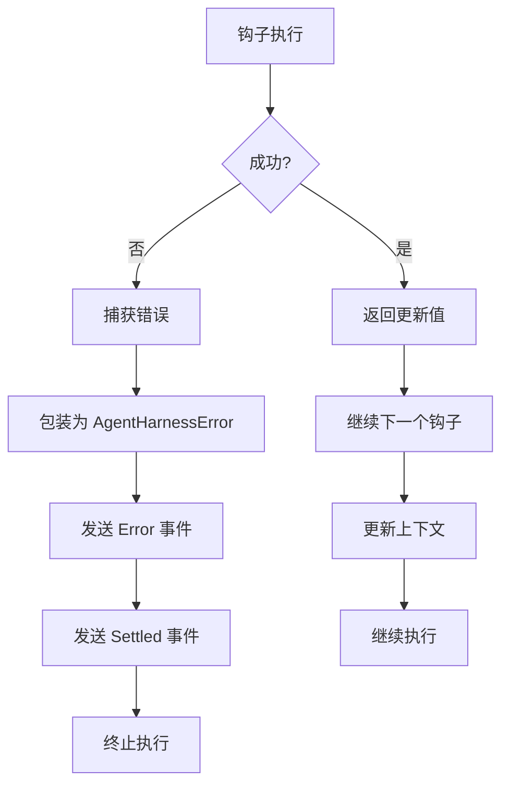

# 钩子与观察者系统

<cite>
**本文档引用的文件**
- [harness.rs](file://crates/pi-agent-core/src/harness.rs)
- [hooks.rs](file://crates/pi-agent-core/src/hooks.rs)
- [lib.rs](file://crates/pi-agent-core/src/lib.rs)
- [errors.rs](file://crates/pi-agent-core/src/errors.rs)
- [types.rs](file://crates/pi-agent-core/src/types.rs)
- [agent_loop.rs](file://crates/pi-agent-core/src/agent_loop.rs)
- [harness_subscribe.rs](file://crates/pi-agent-core/tests/harness_subscribe.rs)
- [hooks.rs](file://crates/pi-agent-core/tests/hooks.rs)
- [loop_example.rs](file://crates/pi-agent-core/examples/loop_example.rs)
</cite>

## 目录
1. [简介](#简介)
2. [项目结构](#项目结构)
3. [核心组件](#核心组件)
4. [架构概览](#架构概览)
5. [详细组件分析](#详细组件分析)
6. [依赖关系分析](#依赖关系分析)
7. [性能考虑](#性能考虑)
8. [故障排除指南](#故障排除指南)
9. [结论](#结论)

## 简介

钩子与观察者系统是 pi-agent-core 框架中的核心扩展机制，它为代理系统提供了强大的可插拔性和可观测性能力。该系统通过两种主要机制实现：钩子（Hooks）用于修改和增强代理行为，观察者（Observers）用于监控和响应系统事件。

系统的核心设计理念是提供细粒度的控制点，允许开发者在代理生命周期的关键节点插入自定义逻辑，同时保持系统的高性能和可靠性。钩子系统支持同步和异步操作，具有完善的错误处理和资源管理机制。

## 项目结构

钩子与观察者系统主要分布在以下文件中：

**图表来源**
- [harness.rs:1-986](file://crates/pi-agent-core/src/harness.rs#L1-L986)
- [hooks.rs:1-162](file://crates/pi-agent-core/src/hooks.rs#L1-L162)
- [lib.rs:1-47](file://crates/pi-agent-core/src/lib.rs#L1-L47)

**章节来源**
- [harness.rs:1-986](file://crates/pi-agent-core/src/harness.rs#L1-L986)
- [hooks.rs:1-162](file://crates/pi-agent-core/src/hooks.rs#L1-L162)
- [lib.rs:1-47](file://crates/pi-agent-core/src/lib.rs#L1-L47)

## 核心组件

### AgentHarness - 主控制器

AgentHarness 是钩子与观察者系统的核心控制器，负责协调所有钩子和观察者的执行。它提供了以下关键功能：

- **生命周期管理**：跟踪代理的运行状态（Idle、Turn、Compaction、BranchSummary）
- **钩子注册**：支持多种类型的钩子注册和管理
- **事件分发**：将系统事件广播给所有注册的观察者
- **资源管理**：提供 RAII 守护机制确保资源正确释放

### 钩子类型系统

系统定义了两类主要的钩子类型：

#### 转换钩子（Transform Hooks）
- `BeforeProviderRequestHook`：修改提供程序请求前的上下文
- `TransformContextHook`：重写 LLM 调用前的消息上下文
- `ConvertToLlmHook`：自定义消息到 LLM 输入的转换逻辑

#### 工具钩子（Tool Hooks）
- `BeforeToolCallHook`：在工具调用前决定是否阻止执行
- `AfterToolCallHook`：修改工具调用后的结果
- `ShouldStopAfterTurnHook`：决定是否在回合结束后停止

#### 提供程序钩子（Provider Hooks）
- `BeforeProviderPayloadHook`：修改提供程序请求负载
- `AfterProviderResponseHook`：处理提供程序响应后逻辑
- `GetApiKeyAndHeadersHook`：动态获取认证信息

#### 停止判断钩子（Stop Judgment Hooks）
- `ShouldStopAfterTurnHook`：基于当前对话状态决定停止条件
- `PrepareNextTurnHook`：准备下一轮对话的上下文

**章节来源**
- [hooks.rs:12-86](file://crates/pi-agent-core/src/hooks.rs#L12-L86)
- [harness.rs:25-74](file://crates/pi-agent-core/src/harness.rs#L25-L74)

## 架构概览

钩子与观察者系统采用分层架构设计，确保高内聚低耦合：

**图表来源**
- [harness.rs:225-482](file://crates/pi-agent-core/src/harness.rs#L225-L482)
- [hooks.rs:12-86](file://crates/pi-agent-core/src/hooks.rs#L12-L86)

### 事件流处理机制

系统实现了完整的事件流处理机制，包括：

1. **事件生成**：代理内部产生 AgentEvent
2. **事件映射**：转换为 AgentHarnessEvent
3. **事件分发**：广播给所有观察者
4. **钩子执行**：按顺序执行注册的钩子
5. **状态更新**：维护代理的生命周期状态

**章节来源**
- [harness.rs:680-708](file://crates/pi-agent-core/src/harness.rs#L680-L708)
- [harness.rs:574-584](file://crates/pi-agent-core/src/harness.rs#L574-L584)

## 详细组件分析

### AgentHarness 类设计

**图表来源**
- [harness.rs:225-271](file://crates/pi-agent-core/src/harness.rs#L225-L271)
- [harness.rs:235-251](file://crates/pi-agent-core/src/harness.rs#L235-L251)

### 钩子执行流程

**图表来源**
- [harness.rs:520-677](file://crates/pi-agent-core/src/harness.rs#L520-L677)
- [harness.rs:574-584](file://crates/pi-agent-core/src/harness.rs#L574-L584)

### 订阅管理机制

**图表来源**
- [harness.rs:440-457](file://crates/pi-agent-core/src/harness.rs#L440-L457)
- [harness.rs:395-415](file://crates/pi-agent-core/src/harness.rs#L395-L415)

**章节来源**
- [harness.rs:417-482](file://crates/pi-agent-core/src/harness.rs#L417-L482)
- [harness.rs:440-457](file://crates/pi-agent-core/src/harness.rs#L440-L457)

### 钩子类型系统

**图表来源**
- [harness.rs:274-293](file://crates/pi-agent-core/src/harness.rs#L274-L293)
- [harness.rs:295-393](file://crates/pi-agent-core/src/harness.rs#L295-L393)

**章节来源**
- [harness.rs:274-393](file://crates/pi-agent-core/src/harness.rs#L274-L393)

## 依赖关系分析

钩子与观察者系统与其他模块的依赖关系如下：

**图表来源**
- [harness.rs:1-15](file://crates/pi-agent-core/src/harness.rs#L1-L15)
- [hooks.rs:1-8](file://crates/pi-agent-core/src/hooks.rs#L1-L8)

### 错误处理机制

系统实现了完善的错误处理机制：

**图表来源**
- [harness.rs:598-602](file://crates/pi-agent-core/src/harness.rs#L598-L602)
- [errors.rs:155-197](file://crates/pi-agent-core/src/errors.rs#L155-L197)

**章节来源**
- [errors.rs:155-197](file://crates/pi-agent-core/src/errors.rs#L155-L197)
- [harness.rs:598-602](file://crates/pi-agent-core/src/harness.rs#L598-L602)

## 性能考虑

### 异步执行优化

钩子系统采用异步执行模式，确保不会阻塞主线程：

- **并发执行**：多个钩子可以并行执行
- **流式处理**：事件以流的形式处理，减少内存占用
- **延迟初始化**：只在需要时创建钩子链

### 内存管理

- **Arc 共享**：使用原子引用计数共享数据
- **RAII 守护**：自动清理资源和订阅
- **克隆优化**：提供高效的克隆实现

### 线程安全

- **Mutex 保护**：关键数据结构使用互斥锁保护
- **Sync trait**：确保类型可以在多线程环境中安全使用
- **Send trait**：支持跨线程传递

## 故障排除指南

### 常见问题诊断

1. **钩子未执行**
   - 检查钩子是否正确注册
   - 验证钩子函数签名是否匹配
   - 确认钩子没有抛出异常

2. **事件未到达观察者**
   - 检查订阅是否仍在有效期内
   - 验证观察者函数是否正确实现
   - 确认事件类型是否匹配

3. **性能问题**
   - 检查钩子执行时间
   - 监控内存使用情况
   - 分析事件处理延迟

### 调试技巧

- 使用 `subscribe` 方法监听所有事件
- 在钩子中添加日志记录
- 利用 `AbortResult` 检查队列状态
- 监控 `AgentHarnessPhase` 状态变化

**章节来源**
- [harness_subscribe.rs:41-70](file://crates/pi-agent-core/tests/harness_subscribe.rs#L41-L70)
- [harness.rs:440-457](file://crates/pi-agent-core/src/harness.rs#L440-L457)

## 结论

钩子与观察者系统为 pi-agent-core 提供了强大而灵活的扩展机制。通过精心设计的架构，系统实现了：

- **高度可扩展性**：支持多种类型的钩子和观察者
- **强健的错误处理**：完善的异常管理和恢复机制
- **优秀的性能表现**：异步执行和内存优化
- **良好的开发体验**：清晰的 API 设计和丰富的示例

该系统不仅满足了当前的功能需求，还为未来的功能扩展奠定了坚实的基础。通过合理的抽象和设计，开发者可以轻松地扩展代理的行为，同时保持系统的稳定性和性能。