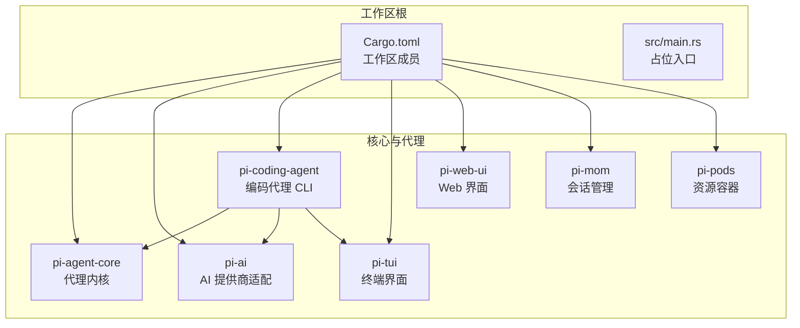
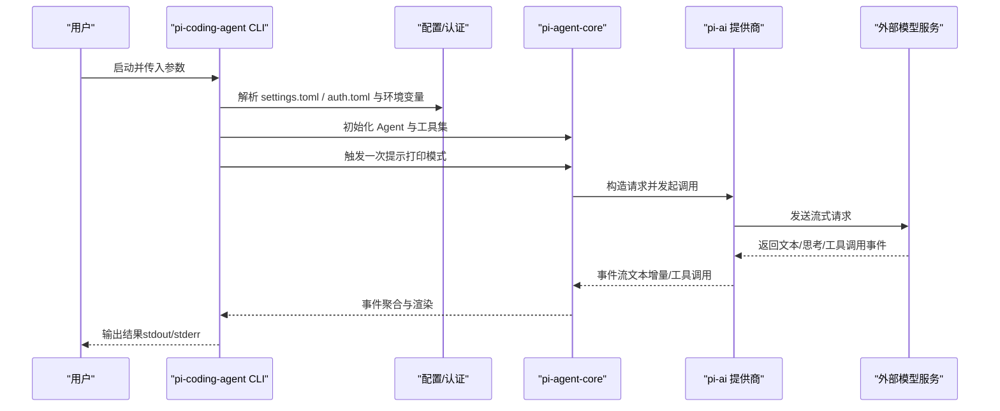
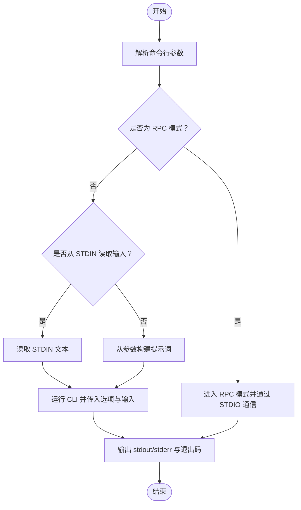
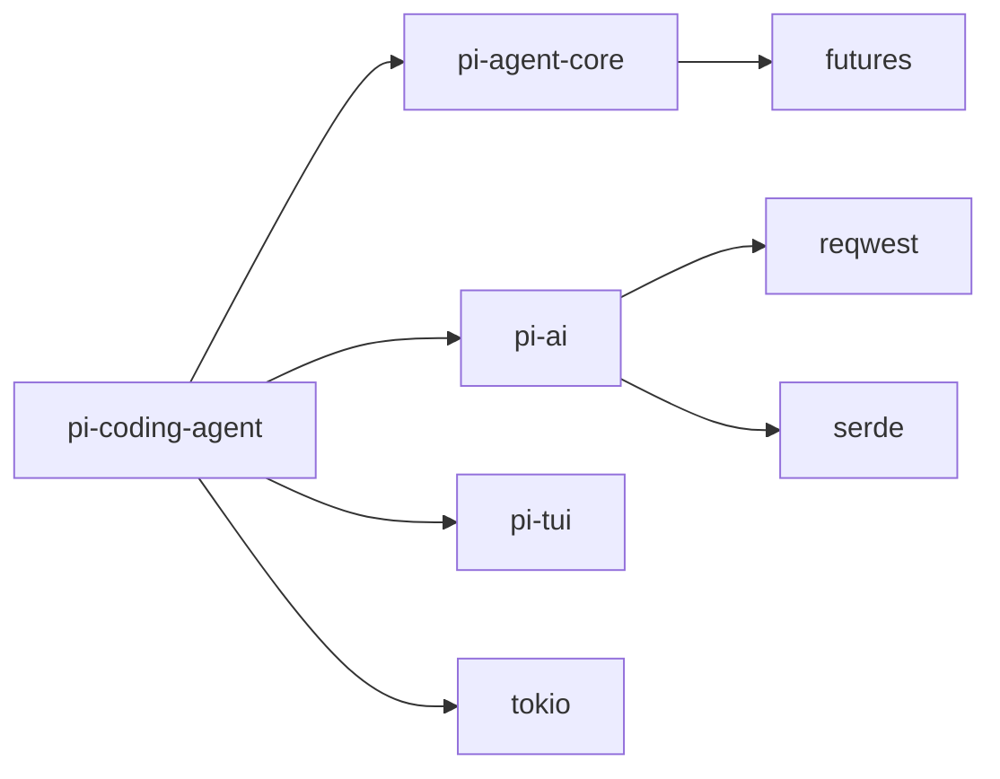

# 快速开始

<cite>
**本文引用的文件**   
- [Cargo.toml](file://Cargo.toml)
- [main.rs](file://src/main.rs)
- [pi-coding-agent 主程序](file://crates/pi-coding-agent/src/main.rs)
- [pi-coding-agent 命令行参数解析](file://crates/pi-coding-agent/src/args.rs)
- [pi-coding-agent 配置与认证](file://crates/pi-coding-agent/src/config/mod.rs)
- [pi-coding-agent 设置加载](file://crates/pi-coding-agent/src/config/settings.rs)
- [pi-coding-agent 认证存储](file://crates/pi-coding-agent/src/config/auth.rs)
- [pi-coding-agent 配置路径解析](file://crates/pi-coding-agent/src/config/paths.rs)
- [pi-coding-agent 内置工具集](file://crates/pi-coding-agent/src/tools/mod.rs)
- [pi-agent-core 示例：循环示例](file://crates/pi-agent-core/examples/loop_example.rs)
- [pi-coding-agent 示例：手动测试](file://crates/pi-coding-agent/examples/manual_test.rs)
- [pi-ai 依赖清单](file://crates/pi-ai/Cargo.toml)
- [pi-coding-agent 依赖清单](file://crates/pi-coding-agent/Cargo.toml)
</cite>

## 目录
1. [简介](#简介)
2. [项目结构](#项目结构)
3. [核心组件](#核心组件)
4. [架构总览](#架构总览)
5. [详细组件分析](#详细组件分析)
6. [依赖关系分析](#依赖关系分析)
7. [性能注意事项](#性能注意事项)
8. [故障排除指南](#故障排除指南)
9. [结论](#结论)
10. [附录](#附录)

## 简介
本指南面向首次接触 Pi-Rust 的用户，帮助你在本地完成环境准备、项目构建与运行，并快速启动第一个代理实例。你将学会：
- 安装 Rust 工具链与系统依赖
- 克隆与编译项目
- 运行第一个代理实例（打印模式）
- 使用常用命令行参数与配置项
- 进行基础的 API 密钥与模型选择配置
- 解决常见问题与故障排除

## 项目结构
Pi-Rust 是一个基于 Rust 的多 crate 工作区，核心围绕“智能代理”能力展开，包含代理内核、AI 提供商适配层、编码代理 CLI、TUI 组件与 Web UI 等模块。

图表来源
- [Cargo.toml:1-12](file://Cargo.toml#L1-L12)
- [pi-ai 依赖清单:1-21](file://crates/pi-ai/Cargo.toml#L1-L21)
- [pi-coding-agent 依赖清单:1-27](file://crates/pi-coding-agent/Cargo.toml#L1-L27)

章节来源
- [Cargo.toml:1-12](file://Cargo.toml#L1-L12)
- [main.rs:1-4](file://src/main.rs#L1-L4)

## 核心组件
- 代理内核（pi-agent-core）：提供代理生命周期、事件流、工具注册与会话管理等能力。
- AI 适配层（pi-ai）：统一不同提供商（如 OpenAI、Anthropic、Google 等）的请求/响应格式与流式处理。
- 编码代理 CLI（pi-coding-agent）：提供命令行交互、RPC 模式、打印模式、会话控制与内置工具集。
- 配置与认证（pi-coding-agent/config）：支持全局与项目级 settings.toml、auth.toml，以及环境变量覆盖。
- 示例与演示：提供 loop_example.rs 与 manual_test.rs，便于理解代理事件流与无 API 调用的演示。

章节来源
- [pi-coding-agent 主程序:1-60](file://crates/pi-coding-agent/src/main.rs#L1-L60)
- [pi-coding-agent 命令行参数解析:1-343](file://crates/pi-coding-agent/src/args.rs#L1-L343)
- [pi-coding-agent 配置与认证:1-124](file://crates/pi-coding-agent/src/config/mod.rs#L1-L124)
- [pi-coding-agent 设置加载:1-389](file://crates/pi-coding-agent/src/config/settings.rs#L1-L389)
- [pi-coding-agent 认证存储:1-514](file://crates/pi-coding-agent/src/config/auth.rs#L1-L514)
- [pi-coding-agent 配置路径解析:1-62](file://crates/pi-coding-agent/src/config/paths.rs#L1-L62)
- [pi-coding-agent 内置工具集:1-51](file://crates/pi-coding-agent/src/tools/mod.rs#L1-L51)
- [pi-agent-core 示例：循环示例:1-123](file://crates/pi-agent-core/examples/loop_example.rs#L1-L123)
- [pi-coding-agent 示例：手动测试:1-88](file://crates/pi-coding-agent/examples/manual_test.rs#L1-L88)

## 架构总览
下图展示了从命令行到代理内核与 AI 提供商的整体调用链路，以及配置与工具在其中的作用。

图表来源
- [pi-coding-agent 主程序:1-60](file://crates/pi-coding-agent/src/main.rs#L1-L60)
- [pi-coding-agent 命令行参数解析:1-343](file://crates/pi-coding-agent/src/args.rs#L1-L343)
- [pi-coding-agent 配置与认证:1-124](file://crates/pi-coding-agent/src/config/mod.rs#L1-L124)
- [pi-coding-agent 设置加载:1-389](file://crates/pi-coding-agent/src/config/settings.rs#L1-L389)
- [pi-coding-agent 认证存储:1-514](file://crates/pi-coding-agent/src/config/auth.rs#L1-L514)
- [pi-agent-core 示例：循环示例:1-123](file://crates/pi-agent-core/examples/loop_example.rs#L1-L123)

## 详细组件分析

### 环境与依赖准备
- Rust 工具链
  - 推荐使用 rustup 安装最新稳定版（包含 cargo、rustc、rustup）。
  - 参考：[Rust 官方安装指南](https://www.rust-lang.org/tools/install)
- 系统依赖
  - Windows：建议安装 MSVC 工具链或使用 GNU 工具链（根据你的编译器选择）。
  - Linux/macOS：确保已安装 build-essential 或 Xcode Command Line Tools。
- Git：用于克隆仓库。
- 可选：图像处理依赖（PNG/JPEG/GIF/WebP），由 image crate 提供，通常随系统开发包自动满足。

章节来源
- [pi-ai 依赖清单:1-21](file://crates/pi-ai/Cargo.toml#L1-L21)
- [pi-coding-agent 依赖清单:1-27](file://crates/pi-coding-agent/Cargo.toml#L1-L27)

### 克隆与编译
- 克隆仓库
  - 使用 git clone 获取源码。
- 在工作区根目录执行
  - cargo build（默认 debug）
  - cargo run -p pi-coding-agent（运行编码代理 CLI）
  - cargo test（可选，运行测试）

章节来源
- [Cargo.toml:1-12](file://Cargo.toml#L1-L12)

### 运行第一个代理实例（打印模式）
- 打印模式（print）
  - 一次性提示并输出助手响应，适合初学者快速验证。
  - 基本命令：cargo run -p pi-coding-agent -- -p "<你的提示>"
  - 若需要指定模型或提供商，可配合 --model 与 --provider 参数。
- RPC 模式（rpc）
  - 通过标准输入/输出进行进程间通信，适合集成到其他系统。
  - 命令：cargo run -p pi-coding-agent -- --mode rpc
- 交互与会话
  - 支持 --continue/--resume/--session/--session-id 等会话控制参数。
  - 会话持久化目录可通过配置项或环境变量调整。

章节来源
- [pi-coding-agent 主程序:1-60](file://crates/pi-coding-agent/src/main.rs#L1-L60)
- [pi-coding-agent 命令行参数解析:1-343](file://crates/pi-coding-agent/src/args.rs#L1-L343)

### 常见命令行参数与配置项
- 基础
  - -p, --print：打印模式，一次性输出响应
  - --mode：headless 模式（print/json/rpc）
  - --provider：优先选择的提供商
  - --model：指定模型 ID（来自内置模型表）
  - --api-key：直接传入提供商 API 密钥
  - --system-prompt / --append-system-prompt：系统提示词覆盖与追加
  - --max-turns：限制代理对话轮次
- 工具与思维
  - --thinking：思维层级（off/minimal/.../xhigh）
  - --tool-execution：工具执行模式（parallel/sequential）
  - --tools / --exclude-tools：内置工具白名单/黑名单
  - --no-tools / --no-builtin-tools：禁用工具
- 资源与发现
  - --skills / --prompt-templates：加载技能与模板目录
  - --no-context-files / --no-skills / --no-prompt-templates / --no-themes：关闭特定资源发现
- 会话
  - -c/--continue、-r/--resume、--no-session、--session、--session-id、--fork、--session-dir、--name/-n

章节来源
- [pi-coding-agent 命令行参数解析:1-343](file://crates/pi-coding-agent/src/args.rs#L1-L343)

### 初始配置：API 密钥与模型选择
- 配置文件位置
  - 全局：$PI_RUST_DIR 或 $HOME/.pi-rust（Windows 下为 %USERPROFILE%\.pi-rust）
  - 项目：当前工作目录下的 .pi-rust
- 配置文件
  - settings.toml：默认提供商、模型、思维层级、会话目录、资源路径等
  - auth.toml：提供商密钥或 OAuth 令牌（支持环境变量引用）
- API 密钥解析顺序
  - CLI 参数 > 环境变量 > auth.toml（支持 $VAR 与 ${VAR} 引用；未设置时发出诊断）
- 模型选择
  - 通过 --model 或 settings.toml 中 default_model 指定
  - 使用 --list-models 查看可用模型（可选搜索过滤）

章节来源
- [pi-coding-agent 配置路径解析:1-62](file://crates/pi-coding-agent/src/config/paths.rs#L1-L62)
- [pi-coding-agent 设置加载:1-389](file://crates/pi-coding-agent/src/config/settings.rs#L1-L389)
- [pi-coding-agent 认证存储:1-514](file://crates/pi-coding-agent/src/config/auth.rs#L1-L514)

### 内置工具与简单使用示例
- 内置工具集（在打印模式下默认启用）
  - 文件读写：read、write、edit
  - 文件系统：ls、find、grep
  - Shell：bash
- 示例一：无 API 调用的演示（faux provider）
  - 使用示例程序，不依赖真实 API 密钥即可看到代理事件流与工具调用过程
- 示例二：循环示例（事件流）
  - 展示代理事件（文本增量、工具调用、结束等）的完整流程

章节来源
- [pi-coding-agent 内置工具集:1-51](file://crates/pi-coding-agent/src/tools/mod.rs#L1-L51)
- [pi-coding-agent 示例：手动测试:1-88](file://crates/pi-coding-agent/examples/manual_test.rs#L1-L88)
- [pi-agent-core 示例：循环示例:1-123](file://crates/pi-agent-core/examples/loop_example.rs#L1-L123)

### 关键流程图：打印模式主流程

图表来源
- [pi-coding-agent 主程序:1-60](file://crates/pi-coding-agent/src/main.rs#L1-L60)

## 依赖关系分析
- 工作区成员
  - pi-agent-core：代理内核
  - pi-ai：AI 提供商适配
  - pi-coding-agent：CLI 与会话、工具、配置
  - pi-tui：终端 UI
  - pi-web-ui：Web UI
  - pi-mom、pi-pods：会话与资源容器
- 关键依赖
  - tokio、futures、serde、reqwest、thiserror 等
  - 图像处理依赖（image crate）

图表来源
- [pi-coding-agent 依赖清单:1-27](file://crates/pi-coding-agent/Cargo.toml#L1-L27)
- [pi-ai 依赖清单:1-21](file://crates/pi-ai/Cargo.toml#L1-L21)

章节来源
- [Cargo.toml:1-12](file://Cargo.toml#L1-L12)
- [pi-coding-agent 依赖清单:1-27](file://crates/pi-coding-agent/Cargo.toml#L1-L27)
- [pi-ai 依赖清单:1-21](file://crates/pi-ai/Cargo.toml#L1-L21)

## 性能注意事项
- 流式输出：代理事件以流形式返回，建议直接重定向到文件或管道，避免阻塞。
- 工具执行：并行执行工具可能增加系统负载，必要时切换为串行执行模式。
- 会话压缩：合理配置会话压缩策略，减少上下文长度，提高响应速度。
- TLS 与网络：使用 rustls 传输栈，注意网络超时与重试策略。

## 故障排除指南
- 无法找到模型
  - 使用 --list-models 检查可用模型列表；确认 settings.toml 中 default_model 是否正确。
- API 密钥无效或未设置
  - 检查 auth.toml 权限（Unix 下应为 0600）；确认环境变量是否正确导出；查看诊断输出。
- RPC 模式无输入
  - RPC 模式不接受位置参数提示，请通过 STDIO 传递协议消息。
- 会话冲突
  - 同时使用多个会话目标标志会导致错误；请仅保留一个（--continue、--resume、--session、--session-id、--fork）。
- 工具不可用
  - 确认未启用 --no-tools 或 --no-builtin-tools；检查 --tools 与 --exclude-tools 的组合是否合法。

章节来源
- [pi-coding-agent 命令行参数解析:1-343](file://crates/pi-coding-agent/src/args.rs#L1-L343)
- [pi-coding-agent 认证存储:1-514](file://crates/pi-coding-agent/src/config/auth.rs#L1-L514)
- [pi-coding-agent 主程序:1-60](file://crates/pi-coding-agent/src/main.rs#L1-L60)

## 结论
通过本指南，你已经完成了 Rust 环境准备、项目构建与第一次代理实例运行。你可以在此基础上进一步探索：
- 使用真实提供商 API（OpenAI、Anthropic 等）
- 自定义系统提示词与技能模板
- 配置复杂会话与工具组合
- 将代理集成到你的应用或 CI 流水线中

## 附录

### 常用命令速查
- 构建：cargo build
- 运行 CLI：cargo run -p pi-coding-agent -- -p "你好"
- RPC 模式：cargo run -p pi-coding-agent -- --mode rpc
- 列出模型：cargo run -p pi-coding-agent -- --list-models
- 查看帮助：cargo run -p pi-coding-agent -- --help

### 配置文件示例（说明性）
- settings.toml（示例字段）
  - default_provider、default_model、default_thinking_level
  - session_dir、skills、prompts、themes
  - terminal.show_images、terminal.show_progress
  - compaction.enabled/reserve_tokens/keep_recent_tokens
  - retry.enabled/max_retries/base_delay_ms
- auth.toml（示例字段）
  - [provider] 类型为 api_key 或 oauth
  - 支持 $VAR 与 ${VAR} 环境变量引用

章节来源
- [pi-coding-agent 设置加载:1-389](file://crates/pi-coding-agent/src/config/settings.rs#L1-L389)
- [pi-coding-agent 认证存储:1-514](file://crates/pi-coding-agent/src/config/auth.rs#L1-L514)