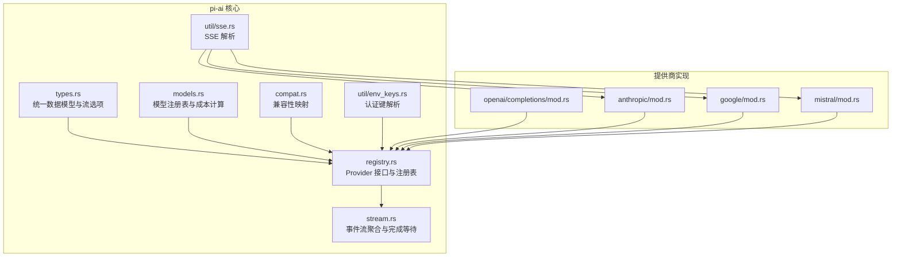
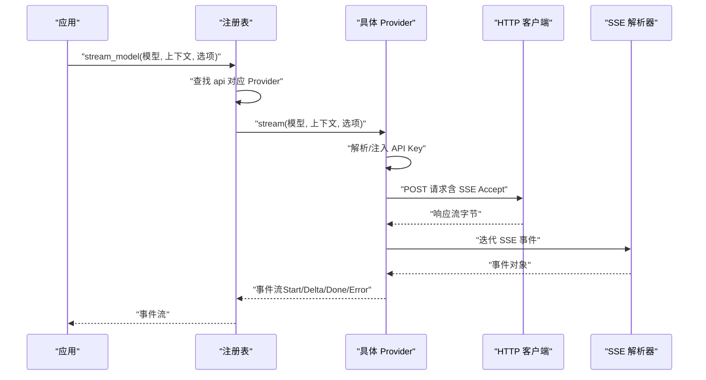
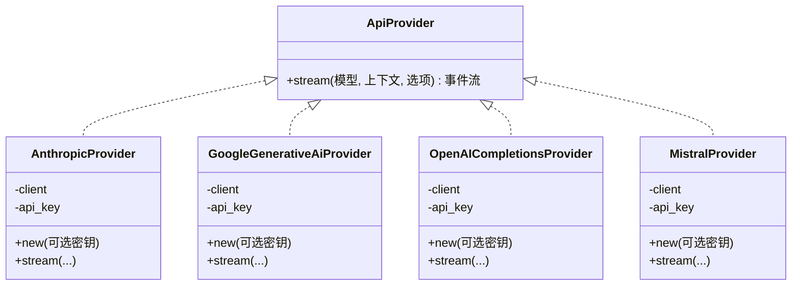
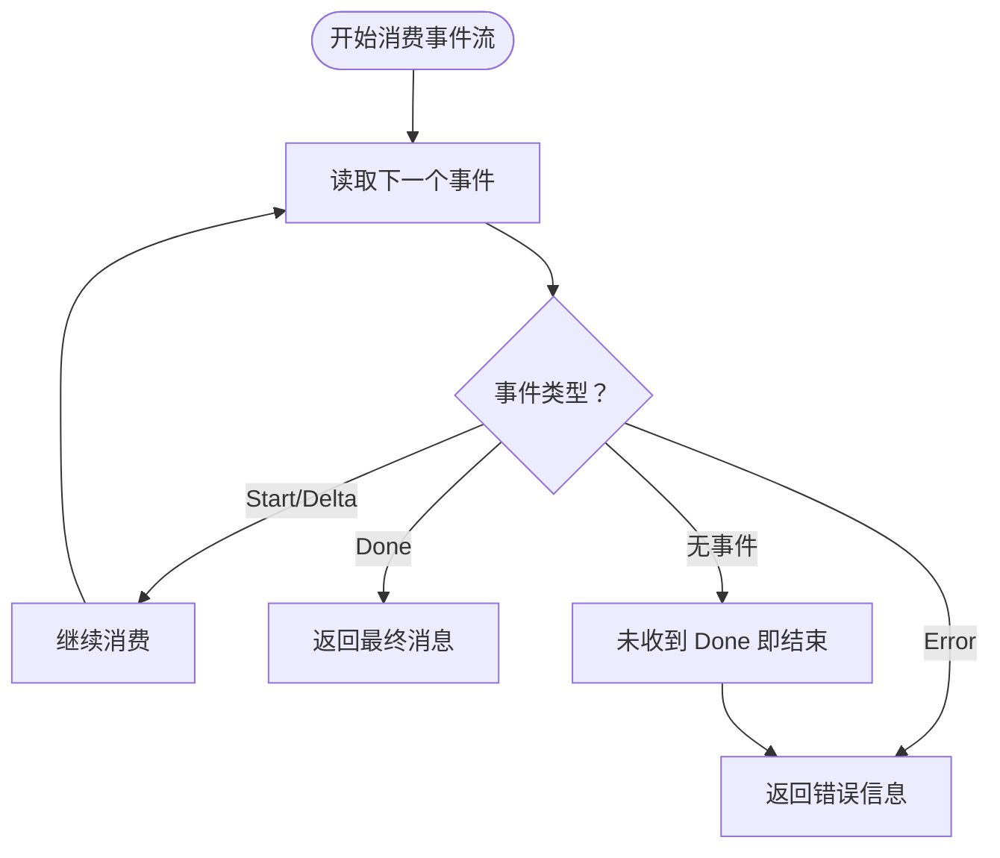
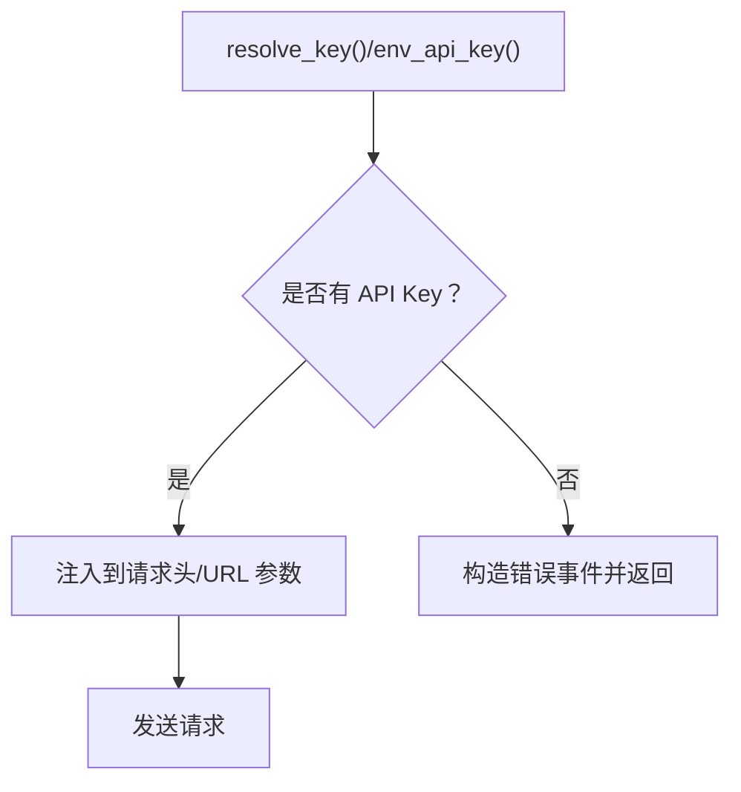
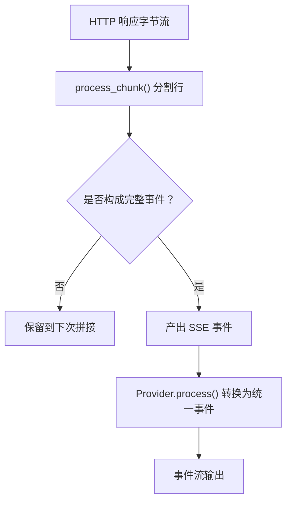
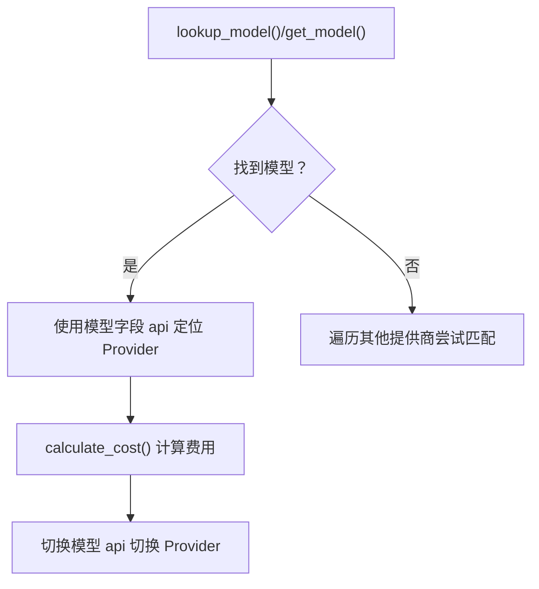
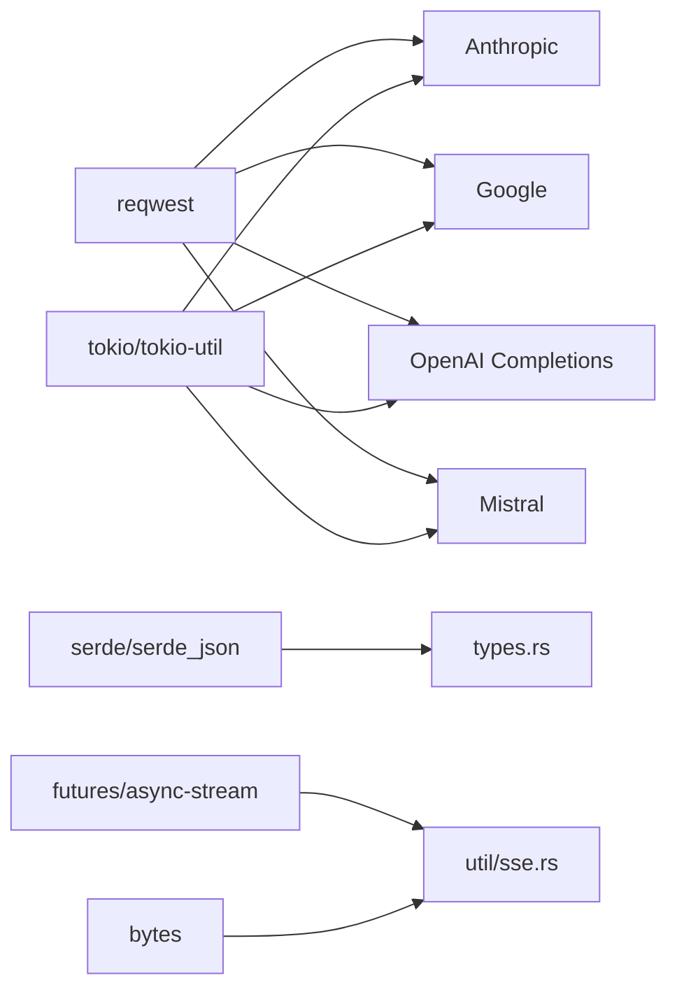

# AI 集成架构

<cite>
**本文引用的文件**
- [lib.rs](file://crates/pi-ai/src/lib.rs)
- [providers/mod.rs](file://crates/pi-ai/src/providers/mod.rs)
- [types.rs](file://crates/pi-ai/src/types.rs)
- [models.rs](file://crates/pi-ai/src/models.rs)
- [registry.rs](file://crates/pi-ai/src/registry.rs)
- [stream.rs](file://crates/pi-ai/src/stream.rs)
- [sse.rs](file://crates/pi-ai/src/util/sse.rs)
- [env_keys.rs](file://crates/pi-ai/src/util/env_keys.rs)
- [compat.rs](file://crates/pi-ai/src/compat.rs)
- [anthropic/mod.rs](file://crates/pi-ai/src/providers/anthropic/mod.rs)
- [google/mod.rs](file://crates/pi-ai/src/providers/google/mod.rs)
- [openai/completions/mod.rs](file://crates/pi-ai/src/providers/openai/completions/mod.rs)
- [mistral/mod.rs](file://crates/pi-ai/src/providers/mistral/mod.rs)
- [Cargo.toml](file://crates/pi-ai/Cargo.toml)
</cite>

## 目录
1. [简介](#简介)
2. [项目结构](#项目结构)
3. [核心组件](#核心组件)
4. [架构总览](#架构总览)
5. [详细组件分析](#详细组件分析)
6. [依赖关系分析](#依赖关系分析)
7. [性能考虑](#性能考虑)
8. [故障排查指南](#故障排查指南)
9. [结论](#结论)
10. [附录](#附录)

## 简介
本文件为 pi-ai 多提供商抽象层的系统化架构文档。pi-ai 通过统一的数据模型与事件流接口，屏蔽不同 AI 提供商（如 OpenAI、Anthropic、Google、Mistral 等）在协议、认证、流式传输与错误处理上的差异，向上提供一致的调用体验。本文重点阐述 Provider 抽象层、统一接口设计、认证管理、SSE 流式事件处理、模型注册表与成本计算、供应商切换机制，以及兼容性适配策略。

## 项目结构
pi-ai crate 的核心模块围绕“类型定义—注册表—Provider 实现—工具函数”展开，采用分层与按功能域划分的组织方式：
- 类型与接口：统一消息、内容块、使用量、停止原因、流选项等核心数据结构
- 注册表：Provider 接口与全局注册中心，负责解析模型到具体 Provider 的映射
- Provider 实现：各厂商子模块，封装请求构建、认证注入、SSE 解析与事件转换
- 工具：SSE 解析、环境变量认证键解析、重试配置等横切能力
- 兼容性：针对不同厂商的参数差异与特性进行兼容映射

**图示来源**
- [lib.rs:1-19](file://crates/pi-ai/src/lib.rs#L1-L19)
- [providers/mod.rs:1-61](file://crates/pi-ai/src/providers/mod.rs#L1-L61)
- [types.rs:1-599](file://crates/pi-ai/src/types.rs#L1-L599)
- [models.rs:1-110](file://crates/pi-ai/src/models.rs#L1-L110)
- [registry.rs:1-163](file://crates/pi-ai/src/registry.rs#L1-L163)
- [stream.rs:1-90](file://crates/pi-ai/src/stream.rs#L1-L90)
- [sse.rs:1-167](file://crates/pi-ai/src/util/sse.rs#L1-L167)
- [env_keys.rs:1-143](file://crates/pi-ai/src/util/env_keys.rs#L1-L143)
- [compat.rs:1-249](file://crates/pi-ai/src/compat.rs#L1-L249)
- [openai/completions/mod.rs:1-157](file://crates/pi-ai/src/providers/openai/completions/mod.rs#L1-L157)
- [anthropic/mod.rs:1-122](file://crates/pi-ai/src/providers/anthropic/mod.rs#L1-L122)
- [google/mod.rs:1-153](file://crates/pi-ai/src/providers/google/mod.rs#L1-L153)
- [mistral/mod.rs:1-145](file://crates/pi-ai/src/providers/mistral/mod.rs#L1-L145)

**章节来源**
- [lib.rs:1-19](file://crates/pi-ai/src/lib.rs#L1-L19)
- [providers/mod.rs:1-61](file://crates/pi-ai/src/providers/mod.rs#L1-L61)

## 核心组件
- 统一数据模型与事件流
  - 内容块、消息、使用量与成本、停止原因、流选项等结构定义，确保跨提供商的一致性
  - 事件流枚举覆盖文本、思考、工具调用的开始/增量/结束与最终完成/错误事件
- Provider 抽象与注册表
  - ApiProvider trait 定义统一的 stream 方法；注册表以字符串标识符注册 Provider 实例
  - stream_model 作为顶层入口，解析模型的 api 字段，注入环境 API Key，并委派给具体 Provider
- 认证管理
  - env_api_key 基于提供商映射批量查询环境变量，支持外部凭据链（如 AWS Profile、Google ADC）
- 模型注册表与成本计算
  - 模型静态注册表由生成的 JSON 加载；提供按 id/提供商检索与成本计算函数
- SSE 支持与事件处理
  - util/sse 提供原始字节流到 SSE 事件的解析器，支持换行回车、注释行、事件类型与多行 data 合并
- 兼容性与参数映射
  - compat 模块对不同提供商的思维模式、缓存控制、路由等差异进行结构化映射

**章节来源**
- [types.rs:1-599](file://crates/pi-ai/src/types.rs#L1-L599)
- [registry.rs:1-163](file://crates/pi-ai/src/registry.rs#L1-L163)
- [models.rs:1-110](file://crates/pi-ai/src/models.rs#L1-L110)
- [stream.rs:1-90](file://crates/pi-ai/src/stream.rs#L1-L90)
- [sse.rs:1-167](file://crates/pi-ai/src/util/sse.rs#L1-L167)
- [env_keys.rs:1-143](file://crates/pi-ai/src/util/env_keys.rs#L1-L143)
- [compat.rs:1-249](file://crates/pi-ai/src/compat.rs#L1-L249)

## 架构总览
pi-ai 的调用路径从上层应用到具体提供商，遵循“模型选择 → 注册表解析 → 认证注入 → 请求发送 → SSE 解析 → 事件转换 → 上层消费”的闭环。

**图示来源**
- [registry.rs:28-55](file://crates/pi-ai/src/registry.rs#L28-L55)
- [anthropic/mod.rs:35-121](file://crates/pi-ai/src/providers/anthropic/mod.rs#L35-L121)
- [google/mod.rs:35-152](file://crates/pi-ai/src/providers/google/mod.rs#L35-L152)
- [mistral/mod.rs:60-144](file://crates/pi-ai/src/providers/mistral/mod.rs#L60-L144)
- [sse.rs:56-89](file://crates/pi-ai/src/util/sse.rs#L56-L89)

## 详细组件分析

### Provider 抽象层与统一接口
- ApiProvider trait
  - 定义 stream 方法，返回统一的事件流类型，屏蔽底层差异
- 注册表
  - register/unregister/lookup 提供并发安全的全局注册中心
  - stream_model 负责未知 api 的快速失败与环境 API Key 的自动注入
- Provider 实现模式
  - 各提供商均实现 ApiProvider::stream，流程相似：解析/注入密钥、构建请求、发送、校验状态码、读取字节流、交由处理器转换为统一事件流

**图示来源**
- [registry.rs:9-11](file://crates/pi-ai/src/registry.rs#L9-L11)
- [anthropic/mod.rs:17-33](file://crates/pi-ai/src/providers/anthropic/mod.rs#L17-L33)
- [google/mod.rs:17-33](file://crates/pi-ai/src/providers/google/mod.rs#L17-L33)
- [openai/completions/mod.rs:17-33](file://crates/pi-ai/src/providers/openai/completions/mod.rs#L17-L33)
- [mistral/mod.rs:17-33](file://crates/pi-ai/src/providers/mistral/mod.rs#L17-L33)

**章节来源**
- [registry.rs:1-163](file://crates/pi-ai/src/registry.rs#L1-L163)
- [anthropic/mod.rs:1-122](file://crates/pi-ai/src/providers/anthropic/mod.rs#L1-L122)
- [google/mod.rs:1-153](file://crates/pi-ai/src/providers/google/mod.rs#L1-L153)
- [openai/completions/mod.rs:1-157](file://crates/pi-ai/src/providers/openai/completions/mod.rs#L1-L157)
- [mistral/mod.rs:1-145](file://crates/pi-ai/src/providers/mistral/mod.rs#L1-L145)

### 统一接口设计与事件流
- 事件流类型
  - AssistantMessageEvent 覆盖 Start/Delta/Done/Error，以及文本、思考、工具调用三类增量事件
- 完成等待
  - complete 函数持续消费事件流，直到遇到 Done 或 Error，返回最终消息或错误信息

**图示来源**
- [stream.rs:7-18](file://crates/pi-ai/src/stream.rs#L7-L18)
- [types.rs:166-242](file://crates/pi-ai/src/types.rs#L166-L242)

**章节来源**
- [stream.rs:1-90](file://crates/pi-ai/src/stream.rs#L1-L90)
- [types.rs:164-242](file://crates/pi-ai/src/types.rs#L164-L242)

### 认证管理机制
- 环境变量解析
  - env_api_key 为每个提供商维护候选环境变量列表，优先返回首个非空值；对需要外部凭据链的提供商返回占位认证标记
- Provider 层注入
  - 各 Provider 在 stream 中优先使用传入选项中的 apiKey，其次使用 resolve_key 获取环境变量；若仍为空则立即返回错误事件

**图示来源**
- [env_keys.rs:34-46](file://crates/pi-ai/src/util/env_keys.rs#L34-L46)
- [anthropic/mod.rs:30-54](file://crates/pi-ai/src/providers/anthropic/mod.rs#L30-L54)
- [google/mod.rs:30-58](file://crates/pi-ai/src/providers/google/mod.rs#L30-L58)
- [openai/completions/mod.rs:30-59](file://crates/pi-ai/src/providers/openai/completions/mod.rs#L30-L59)
- [mistral/mod.rs:30-80](file://crates/pi-ai/src/providers/mistral/mod.rs#L30-L80)

**章节来源**
- [env_keys.rs:1-143](file://crates/pi-ai/src/util/env_keys.rs#L1-L143)
- [anthropic/mod.rs:1-122](file://crates/pi-ai/src/providers/anthropic/mod.rs#L1-L122)
- [google/mod.rs:1-153](file://crates/pi-ai/src/providers/google/mod.rs#L1-L153)
- [openai/completions/mod.rs:1-157](file://crates/pi-ai/src/providers/openai/completions/mod.rs#L1-L157)
- [mistral/mod.rs:1-145](file://crates/pi-ai/src/providers/mistral/mod.rs#L1-L145)

### 流式事件处理与 SSE 支持
- SSE 解析
  - 支持事件类型、多行 data 合并、注释行忽略、CRLF 行结尾处理、分片拼接残留缓冲
- 事件转换
  - 各 Provider 将底层 SSE 事件转换为统一的 AssistantMessageEvent，再通过事件流暴露给上层

**图示来源**
- [sse.rs:13-89](file://crates/pi-ai/src/util/sse.rs#L13-L89)
- [anthropic/mod.rs:115-118](file://crates/pi-ai/src/providers/anthropic/mod.rs#L115-L118)
- [google/mod.rs:146-149](file://crates/pi-ai/src/providers/google/mod.rs#L146-L149)
- [mistral/mod.rs:138-141](file://crates/pi-ai/src/providers/mistral/mod.rs#L138-L141)

**章节来源**
- [sse.rs:1-167](file://crates/pi-ai/src/util/sse.rs#L1-L167)
- [anthropic/mod.rs:1-122](file://crates/pi-ai/src/providers/anthropic/mod.rs#L1-L122)
- [google/mod.rs:1-153](file://crates/pi-ai/src/providers/google/mod.rs#L1-L153)
- [mistral/mod.rs:1-145](file://crates/pi-ai/src/providers/mistral/mod.rs#L1-L145)

### 错误处理策略
- 快速失败
  - 未知 api：直接返回 Error 事件，避免无效调用
  - 缺失 API Key：立即返回 Error 事件，提示设置方法
- HTTP 错误
  - 非成功状态码时，读取响应体并封装为 Error 事件
- 超时与重试
  - Google Provider 使用 RetryConfig 从选项中提取超时与重试参数；OpenAI/Mistral 也支持超时包装
- 完成等待
  - complete 在未收到 Done 时返回错误，保证上层能感知异常终止

**章节来源**
- [registry.rs:31-55](file://crates/pi-ai/src/registry.rs#L31-L55)
- [anthropic/mod.rs:43-109](file://crates/pi-ai/src/providers/anthropic/mod.rs#L43-L109)
- [google/mod.rs:88-140](file://crates/pi-ai/src/providers/google/mod.rs#L88-L140)
- [openai/completions/mod.rs:92-144](file://crates/pi-ai/src/providers/openai/completions/mod.rs#L92-L144)
- [mistral/mod.rs:104-132](file://crates/pi-ai/src/providers/mistral/mod.rs#L104-L132)
- [stream.rs:7-18](file://crates/pi-ai/src/stream.rs#L7-L18)

### 模型注册表、成本计算与供应商切换
- 模型注册表
  - 通过 models_generated.json 加载静态模型清单；提供按 id、提供商检索与去重的提供商列表
- 成本计算
  - 基于每百万令牌计费的模型成本，对输入/输出/缓存读写分别计算费用
- 供应商切换
  - 通过修改模型的 api 字段即可切换到不同的 Provider；注册表负责解析与调度

**图示来源**
- [models.rs:5-54](file://crates/pi-ai/src/models.rs#L5-L54)
- [registry.rs:28-55](file://crates/pi-ai/src/registry.rs#L28-L55)

**章节来源**
- [models.rs:1-110](file://crates/pi-ai/src/models.rs#L1-L110)
- [registry.rs:1-163](file://crates/pi-ai/src/registry.rs#L1-L163)

### 各提供商集成模式与兼容性处理
- OpenAI Completions
  - 自动注入 Bearer Token，支持超时与重试；根据 base_url 自动补全 /v1
- Anthropic Messages
  - 自定义头部（x-api-key、anthropic-version），SSE 流解析
- Google Generative AI
  - 通过 URL 查询参数携带 API Key，支持 alt=sse；内置超时与重试
- Mistral Conversations
  - 通用 Bearer Token，支持会话亲和头与自定义 JSON 头部合并
- 兼容性映射
  - compat 模块对不同提供商的思维格式、缓存控制、路由策略等进行结构化映射，便于统一处理

**章节来源**
- [openai/completions/mod.rs:1-157](file://crates/pi-ai/src/providers/openai/completions/mod.rs#L1-L157)
- [anthropic/mod.rs:1-122](file://crates/pi-ai/src/providers/anthropic/mod.rs#L1-L122)
- [google/mod.rs:1-153](file://crates/pi-ai/src/providers/google/mod.rs#L1-L153)
- [mistral/mod.rs:1-145](file://crates/pi-ai/src/providers/mistral/mod.rs#L1-L145)
- [compat.rs:1-249](file://crates/pi-ai/src/compat.rs#L1-L249)

## 依赖关系分析
- 运行时依赖
  - 异步生态：tokio、futures、async-stream
  - HTTP：reqwest（启用 JSON、流与 rustls TLS）
  - 序列化：serde/serde_json
  - 字节处理：bytes
  - 取消令牌：tokio-util
  - 哈希/编码：ring、base64
- 模块耦合
  - types 与 registry 高内聚，共同定义统一接口契约
  - util 子模块（env_keys、sse）被各 Provider 广泛复用
  - compat 与 models 为 Provider 提供参数与成本层面的适配

**图示来源**
- [Cargo.toml:6-17](file://crates/pi-ai/Cargo.toml#L6-L17)
- [anthropic/mod.rs:1-122](file://crates/pi-ai/src/providers/anthropic/mod.rs#L1-L122)
- [google/mod.rs:1-153](file://crates/pi-ai/src/providers/google/mod.rs#L1-L153)
- [openai/completions/mod.rs:1-157](file://crates/pi-ai/src/providers/openai/completions/mod.rs#L1-L157)
- [mistral/mod.rs:1-145](file://crates/pi-ai/src/providers/mistral/mod.rs#L1-L145)
- [sse.rs:1-167](file://crates/pi-ai/src/util/sse.rs#L1-L167)
- [types.rs:1-599](file://crates/pi-ai/src/types.rs#L1-L599)

**章节来源**
- [Cargo.toml:1-21](file://crates/pi-ai/Cargo.toml#L1-L21)

## 性能考虑
- 流式处理
  - 采用字节流与 SSE 解析器逐步解码，降低内存峰值占用
- 超时与重试
  - 通过 StreamOptions 传递超时与最大重试参数，避免长时间阻塞
- 并发与取消
  - 使用 CancellationToken 支持异步取消，减少资源浪费
- 缓存策略
  - 模型成本计算基于令牌统计，建议在上层会话中复用统计结果，避免重复计算
- 故障转移
  - 通过模型 api 字段快速切换 Provider；结合错误事件与重试策略提升可用性

[本节为通用指导，不直接分析特定文件]

## 故障排查指南
- 无法识别的 Provider API
  - 现象：立即返回 Error 事件
  - 排查：确认模型的 api 字段与已注册的 Provider 名称一致
- 缺少 API Key
  - 现象：返回错误事件，提示设置环境变量或传入 apiKey
  - 排查：检查 env_keys 映射的变量是否正确设置；对于外部凭据链提供商，确认凭据存在
- HTTP 请求失败或状态码异常
  - 现象：返回包含状态码与响应体的错误事件
  - 排查：核对 base_url、认证头、请求体；查看提供商控制台日志
- SSE 事件缺失或乱序
  - 现象：事件流提前结束或未收到 Done
  - 排查：检查网络稳定性与超时设置；确认提供商 SSE 输出格式
- 成本计算异常
  - 现象：费用与预期不符
  - 排查：确认模型 cost 字段与使用的令牌统计；注意缓存读写成本

**章节来源**
- [registry.rs:31-55](file://crates/pi-ai/src/registry.rs#L31-L55)
- [env_keys.rs:1-143](file://crates/pi-ai/src/util/env_keys.rs#L1-L143)
- [anthropic/mod.rs:43-109](file://crates/pi-ai/src/providers/anthropic/mod.rs#L43-L109)
- [google/mod.rs:88-140](file://crates/pi-ai/src/providers/google/mod.rs#L88-L140)
- [openai/completions/mod.rs:92-144](file://crates/pi-ai/src/providers/openai/completions/mod.rs#L92-L144)
- [mistral/mod.rs:104-132](file://crates/pi-ai/src/providers/mistral/mod.rs#L104-L132)
- [stream.rs:7-18](file://crates/pi-ai/src/stream.rs#L7-L18)
- [models.rs:47-54](file://crates/pi-ai/src/models.rs#L47-L54)

## 结论
pi-ai 通过统一的数据模型、事件流与注册表机制，有效屏蔽多家提供商的协议与认证差异，实现了高内聚、低耦合的多提供商抽象层。借助 SSE 解析器、兼容性映射与完善的错误处理，系统在易用性与扩展性之间取得平衡。未来可在缓存与故障转移策略上进一步细化，以满足更复杂的生产场景需求。

## 附录
- 关键 API 一览
  - Provider 注册与查找：register、unregister、lookup
  - 顶层入口：stream_model
  - 事件流聚合：complete
  - 模型查询与成本：lookup_model、get_model、get_models、get_providers、calculate_cost
  - 认证键解析：env_api_key
  - SSE 解析：process_chunk、iterate_sse
  - 兼容性映射：ModelCompat、ThinkingLevelMap、OpenAICompletionsCompat 等

[本节为概览性总结，不直接分析特定文件]