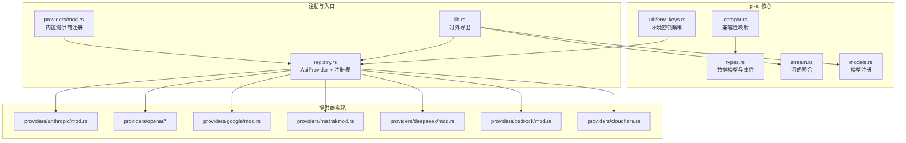
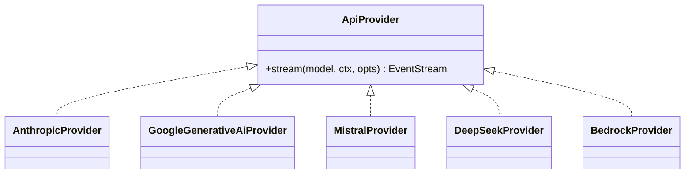
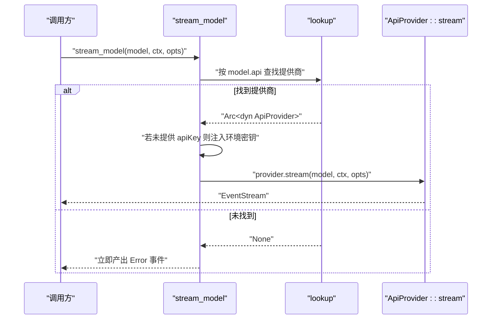
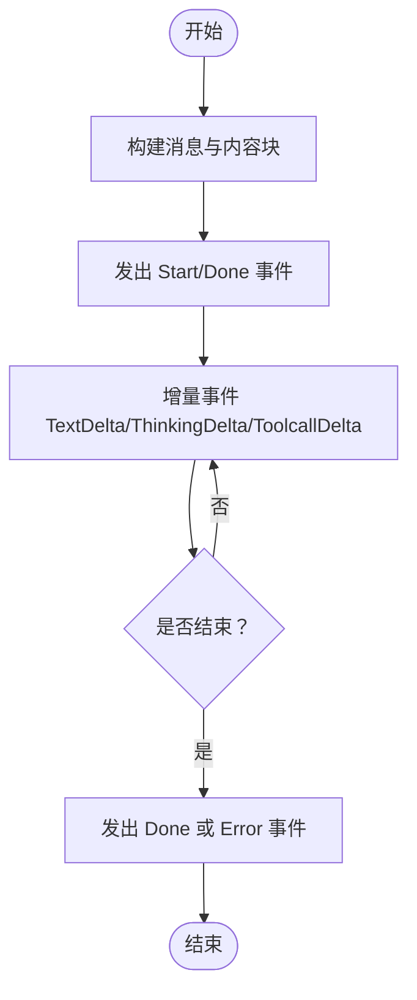
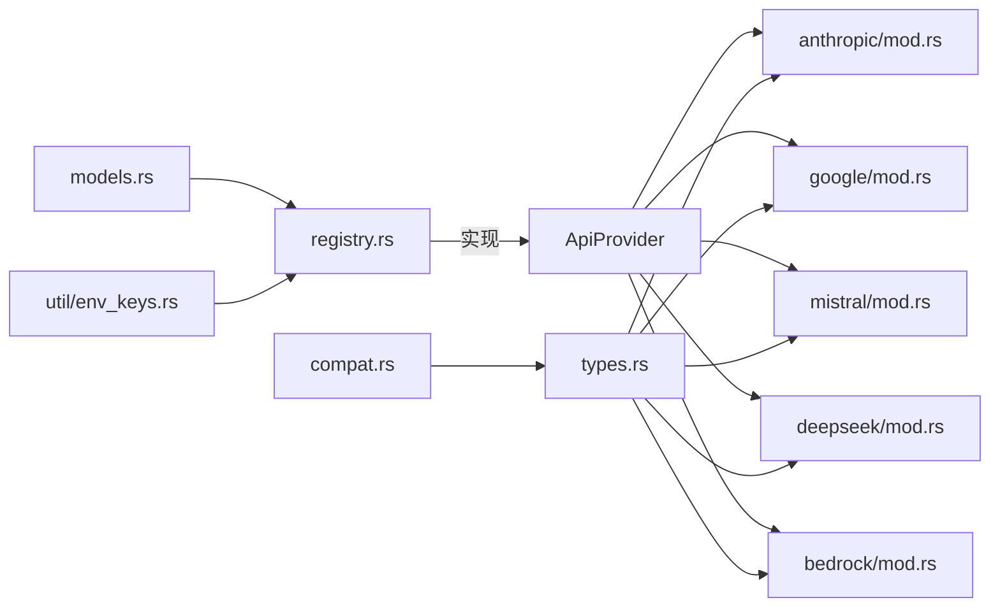

# Provider 抽象层

<cite>
**本文引用的文件**
- [lib.rs](file://crates/pi-ai/src/lib.rs)
- [providers/mod.rs](file://crates/pi-ai/src/providers/mod.rs)
- [registry.rs](file://crates/pi-ai/src/registry.rs)
- [types.rs](file://crates/pi-ai/src/types.rs)
- [compat.rs](file://crates/pi-ai/src/compat.rs)
- [anthropic/mod.rs](file://crates/pi-ai/src/providers/anthropic/mod.rs)
- [google/mod.rs](file://crates/pi-ai/src/providers/google/mod.rs)
- [mistral/mod.rs](file://crates/pi-ai/src/providers/mistral/mod.rs)
- [deepseek/mod.rs](file://crates/pi-ai/src/providers/deepseek/mod.rs)
- [bedrock/mod.rs](file://crates/pi-ai/src/providers/bedrock/mod.rs)
- [cloudflare.rs](file://crates/pi-ai/src/providers/cloudflare.rs)
- [stream.rs](file://crates/pi-ai/src/stream.rs)
- [env_keys.rs](file://crates/pi-ai/src/util/env_keys.rs)
- [models.rs](file://crates/pi-ai/src/models.rs)
</cite>

## 目录
1. [简介](#简介)
2. [项目结构](#项目结构)
3. [核心组件](#核心组件)
4. [架构总览](#架构总览)
5. [详细组件分析](#详细组件分析)
6. [依赖关系分析](#依赖关系分析)
7. [性能考量](#性能考量)
8. [故障排查指南](#故障排查指南)
9. [结论](#结论)
10. [附录：新增提供商指南](#附录新增提供商指南)

## 简介
本文件系统化阐述 pi-ai 模块中的 Provider 抽象层设计与实现，重点覆盖：
- 多提供商统一接口的设计原理与行为约定
- Provider trait（ApiProvider）的定义、方法签名与控制流
- 各 AI 提供商（Anthropic、OpenAI 系列、Google、Mistral、AWS Bedrock、DeepSeek、Cloudflare）的具体实现差异与兼容性处理
- 认证机制、API 调用封装、错误映射与响应转换
- 提供商切换、负载均衡与故障转移策略建议
- 新增提供商的步骤与最佳实践

## 项目结构
pi-ai 模块采用“抽象接口 + 全局注册表 + 多提供商实现”的分层组织：
- 抽象接口与类型：在 types.rs 中定义统一的数据模型；在 registry.rs 中定义 ApiProvider trait 与全局注册表
- 提供商实现：每个提供商位于 crates/pi-ai/src/providers 下的独立子模块，均实现 ApiProvider
- 工具与配置：util 子模块提供环境变量解析、HTTP 重试等通用能力；models.rs 提供模型注册与查询
- 入口与聚合：lib.rs 汇总导出公共 API

图表来源
- [lib.rs:1-19](file://crates/pi-ai/src/lib.rs#L1-L19)
- [providers/mod.rs:1-61](file://crates/pi-ai/src/providers/mod.rs#L1-L61)
- [registry.rs:9-55](file://crates/pi-ai/src/registry.rs#L9-L55)
- [types.rs:1-599](file://crates/pi-ai/src/types.rs#L1-L599)
- [compat.rs:1-249](file://crates/pi-ai/src/compat.rs#L1-L249)
- [stream.rs:1-90](file://crates/pi-ai/src/stream.rs#L1-L90)
- [models.rs:1-110](file://crates/pi-ai/src/models.rs#L1-L110)
- [env_keys.rs:1-143](file://crates/pi-ai/src/util/env_keys.rs#L1-L143)

章节来源
- [lib.rs:1-19](file://crates/pi-ai/src/lib.rs#L1-L19)
- [providers/mod.rs:1-61](file://crates/pi-ai/src/providers/mod.rs#L1-L61)

## 核心组件
- ApiProvider trait：定义统一的流式调用接口，所有提供商必须实现 stream 方法，返回事件流
- 注册表：全局 HashMap 存储已注册的提供商实例，按 model.api 命名空间查找
- 统一事件模型：AssistantMessage 及 AssistantMessageEvent 定义了文本、思考、工具调用等事件的统一格式
- 流式聚合：complete 函数从事件流中提取最终消息或错误
- 模型注册：通过 models.rs 读取生成的模型清单，支持优先级查找与成本计算
- 兼容性映射：compat.rs 将不同提供商的差异化字段映射到统一结构

章节来源
- [registry.rs:9-55](file://crates/pi-ai/src/registry.rs#L9-L55)
- [types.rs:103-242](file://crates/pi-ai/src/types.rs#L103-L242)
- [stream.rs:7-18](file://crates/pi-ai/src/stream.rs#L7-L18)
- [models.rs:39-54](file://crates/pi-ai/src/models.rs#L39-L54)
- [compat.rs:180-249](file://crates/pi-ai/src/compat.rs#L180-L249)

## 架构总览
Provider 抽象层以“注册表 + trait 接口”为核心，屏蔽各提供商的差异，向上提供一致的事件流输出。

图表来源
- [registry.rs:9-11](file://crates/pi-ai/src/registry.rs#L9-L11)
- [anthropic/mod.rs:35-121](file://crates/pi-ai/src/providers/anthropic/mod.rs#L35-L121)
- [google/mod.rs:35-152](file://crates/pi-ai/src/providers/google/mod.rs#L35-L152)
- [mistral/mod.rs:60-144](file://crates/pi-ai/src/providers/mistral/mod.rs#L60-L144)
- [deepseek/mod.rs:35-146](file://crates/pi-ai/src/providers/deepseek/mod.rs#L35-L146)
- [bedrock/mod.rs:79-211](file://crates/pi-ai/src/providers/bedrock/mod.rs#L79-L211)

## 详细组件分析

### ApiProvider 抽象与注册表
- ApiProvider：定义 stream 方法，接收 Model、Context、StreamOptions，返回 EventStream
- 注册表：提供 register/unregister/lookup，以及顶层入口 stream_model，负责注入默认 API Key 并转发调用
- 错误处理：当未知 API 名称时，立即返回 Error 事件，避免进入下游

图表来源
- [registry.rs:28-55](file://crates/pi-ai/src/registry.rs#L28-L55)

章节来源
- [registry.rs:9-55](file://crates/pi-ai/src/registry.rs#L9-L55)

### 数据模型与事件流
- 内容块与消息：ContentBlock 支持 text/thinking/image/toolCall；Message 支持 user/assistant/toolResult
- 统一响应：AssistantMessage 包含内容、用量、停止原因、诊断信息等
- 事件流：AssistantMessageEvent 定义 start/delta/end/done/error 等阶段事件
- 思维与工具：ThinkingConfig、Tool、Model 输入类型与成本结构

图表来源
- [types.rs:9-242](file://crates/pi-ai/src/types.rs#L9-L242)

章节来源
- [types.rs:9-242](file://crates/pi-ai/src/types.rs#L9-L242)

### 认证与密钥注入
- 环境变量解析：env_keys.rs 针对不同提供商提供多候选环境变量，部分提供商支持外部凭据链（如 AWS Profile）
- 注入时机：stream_model 在 opts.api_key 缺失时自动注入对应提供商的密钥
- 外部凭据：某些提供商（如 Bedrock、Google Vertex）可使用自身认证链，env_api_key 返回占位符以便后续签名

章节来源
- [env_keys.rs:1-65](file://crates/pi-ai/src/util/env_keys.rs#L1-L65)
- [registry.rs:48-52](file://crates/pi-ai/src/registry.rs#L48-L52)

### 各提供商实现差异与兼容性

#### Anthropic（messages）
- 认证：x-api-key 头 + anthropic-version
- 请求体：build_request 生成标准消息请求
- 错误：HTTP 失败直接转 Error 事件
- SSE：使用 bytes_stream + process::process 解析事件

章节来源
- [anthropic/mod.rs:35-121](file://crates/pi-ai/src/providers/anthropic/mod.rs#L35-L121)

#### Google（generative-ai）
- 认证：URL 查询参数 ?key= 注入 API Key
- 超时：支持基于 StreamOptions 的超时与重试配置
- 错误：HTTP 失败与超时分别映射为 Error 事件
- SSE：同上

章节来源
- [google/mod.rs:35-152](file://crates/pi-ai/src/providers/google/mod.rs#L35-L152)

#### Mistral（conversations）
- 认证：Bearer Token
- 会话亲和：支持通过 headers/session_id 注入 x-affinity
- 错误：HTTP 失败映射为 Error 事件
- SSE：同上

章节来源
- [mistral/mod.rs:60-144](file://crates/pi-ai/src/providers/mistral/mod.rs#L60-L144)

#### DeepSeek（chat-completions）
- 认证：Bearer Token
- 行为：非 SSE，直接解析 JSON 响应并转换为事件序列
- 取消：支持 CancellationToken，取消时返回 Aborted
- 错误：HTTP 与解析失败映射为 Error 事件

章节来源
- [deepseek/mod.rs:35-146](file://crates/pi-ai/src/providers/deepseek/mod.rs#L35-L146)

#### AWS Bedrock（converse-stream）
- 认证：支持 Bearer Token 或 SigV4 签名；区域解析优先级高
- URL：/model/{modelId}/converse-stream
- 事件：application/vnd.amazon.eventstream
- 错误：签名失败、HTTP 失败均映射为 Error 事件

章节来源
- [bedrock/mod.rs:79-211](file://crates/pi-ai/src/providers/bedrock/mod.rs#L79-L211)

#### Cloudflare（Workers AI / AI Gateway）
- BaseUrl 占位符解析：支持模板字符串替换，缺失必要变量时报错
- 用途：为 Cloudflare 提供动态 BaseUrl 渲染能力

章节来源
- [cloudflare.rs:1-34](file://crates/pi-ai/src/providers/cloudflare.rs#L1-L34)

#### OpenAI 系列（completions/responses/codex）
- 结构：openai 子目录下包含多个子模块，分别适配不同端点与行为
- 兼容性：通过 compat.rs 的 ModelCompat 映射不同提供商的差异化字段

章节来源
- [providers/mod.rs:1-12](file://crates/pi-ai/src/providers/mod.rs#L1-L12)
- [compat.rs:180-249](file://crates/pi-ai/src/compat.rs#L180-L249)

### 内置提供商注册
- providers/mod.rs 在启动时将各内置提供商注册到全局注册表
- 注册键名与提供商名称一一对应，便于通过 model.api 快速定位

章节来源
- [providers/mod.rs:17-60](file://crates/pi-ai/src/providers/mod.rs#L17-L60)

### 流式聚合与完成
- complete：从事件流中等待 Done 或 Error，返回最终消息或错误字符串
- 适用范围：适用于所有提供商的事件流

章节来源
- [stream.rs:7-18](file://crates/pi-ai/src/stream.rs#L7-L18)

### 模型注册与成本计算
- lookup_model：按优先级与字典序查找模型
- all_models：加载生成的模型清单
- calculate_cost：按模型费率计算用量成本

章节来源
- [models.rs:6-54](file://crates/pi-ai/src/models.rs#L6-L54)

## 依赖关系分析
- ApiProvider 与各提供商：通过 trait 实现解耦，注册表集中管理
- 统一事件模型：types.rs 作为跨提供商契约，确保上层消费一致性
- 工具模块：env_keys.rs 与 http 重试配置（Google）提升可用性
- 兼容性：compat.rs 将差异化字段映射到统一结构，降低上游复杂度

图表来源
- [registry.rs:9-55](file://crates/pi-ai/src/registry.rs#L9-L55)
- [types.rs:103-242](file://crates/pi-ai/src/types.rs#L103-L242)
- [compat.rs:180-249](file://crates/pi-ai/src/compat.rs#L180-L249)
- [models.rs:39-54](file://crates/pi-ai/src/models.rs#L39-L54)
- [env_keys.rs:1-65](file://crates/pi-ai/src/util/env_keys.rs#L1-L65)

章节来源
- [registry.rs:9-55](file://crates/pi-ai/src/registry.rs#L9-L55)
- [types.rs:103-242](file://crates/pi-ai/src/types.rs#L103-L242)
- [compat.rs:180-249](file://crates/pi-ai/src/compat.rs#L180-L249)
- [models.rs:39-54](file://crates/pi-ai/src/models.rs#L39-L54)
- [env_keys.rs:1-65](file://crates/pi-ai/src/util/env_keys.rs#L1-L65)

## 性能考量
- 流式处理：统一采用 SSE 或 JSON 流，避免一次性缓冲大响应
- 超时与重试：Google 提供显式超时与重试配置；其他提供商可通过 StreamOptions 的超时字段配合上层调度
- 取消令牌：DeepSeek 支持 CancellationToken；上层可结合任务取消减少资源占用
- 认证开销：Bedrock 的 SigV4 签名与 Cloudflare BaseUrl 解析存在少量 CPU 开销，建议缓存结果或复用客户端

## 故障排查指南
- 未知提供商 API：检查 model.api 是否与注册表键名一致
- 缺少 API Key：确认 env_keys.rs 中对应环境变量是否设置；某些提供商支持外部凭据链
- HTTP 错误：关注状态码与响应体，映射为 Error 事件；检查网络与鉴权头
- Bedrock 签名失败：核对 AWS Region、Access Key/Secret Key、URL 解析；优先使用 Bearer Token
- DeepSeek 非 SSE：确认返回 JSON 结构与 ChatCompletionResponse 对齐

章节来源
- [registry.rs:31-55](file://crates/pi-ai/src/registry.rs#L31-L55)
- [anthropic/mod.rs:43-54](file://crates/pi-ai/src/providers/anthropic/mod.rs#L43-L54)
- [google/mod.rs:88-150](file://crates/pi-ai/src/providers/google/mod.rs#L88-L150)
- [mistral/mod.rs:68-80](file://crates/pi-ai/src/providers/mistral/mod.rs#L68-L80)
- [deepseek/mod.rs:43-55](file://crates/pi-ai/src/providers/deepseek/mod.rs#L43-L55)
- [bedrock/mod.rs:111-160](file://crates/pi-ai/src/providers/bedrock/mod.rs#L111-L160)

## 结论
Provider 抽象层通过统一的 ApiProvider 接口、事件模型与注册表机制，有效屏蔽多提供商差异，实现一致的流式输出与错误处理。借助 compat.rs 与 env_keys.rs，系统在兼容性与可用性方面具备良好扩展性。对于新增提供商，遵循统一事件流与错误映射规范即可快速接入。

## 附录：新增提供商指南
- 步骤概要
  1) 在 providers 子目录新增模块，并实现 ApiProvider
  2) 在 providers/mod.rs 中注册新提供商
  3) 在 lib.rs 中导出必要的类型与函数
  4) 在 models.rs 中补充模型注册（如需）
  5) 在 env_keys.rs 中为该提供商添加环境变量映射
  6) 编写测试覆盖关键路径（鉴权、错误、事件流）

- 关键实现要点
  - 认证：根据提供商要求设置头或查询参数；必要时支持外部凭据链
  - 请求体：使用 build_request 生成统一请求体
  - 事件流：将提供商原始事件转换为 AssistantMessageEvent
  - 错误映射：HTTP 错误与解析失败统一映射为 Error 事件
  - SSE/JSON：遵循现有模式，保持流式与可取消特性

- 示例参考
  - Anthropic：SSE + 头注入
  - Google：带超时的 SSE
  - Mistral：Bearer + 会话亲和
  - DeepSeek：JSON 直接解析
  - Bedrock：SigV4 或 Bearer 签名

章节来源
- [providers/mod.rs:17-60](file://crates/pi-ai/src/providers/mod.rs#L17-L60)
- [lib.rs:10-19](file://crates/pi-ai/src/lib.rs#L10-L19)
- [env_keys.rs:1-65](file://crates/pi-ai/src/util/env_keys.rs#L1-L65)
- [models.rs:6-54](file://crates/pi-ai/src/models.rs#L6-L54)