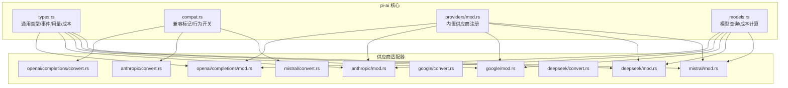
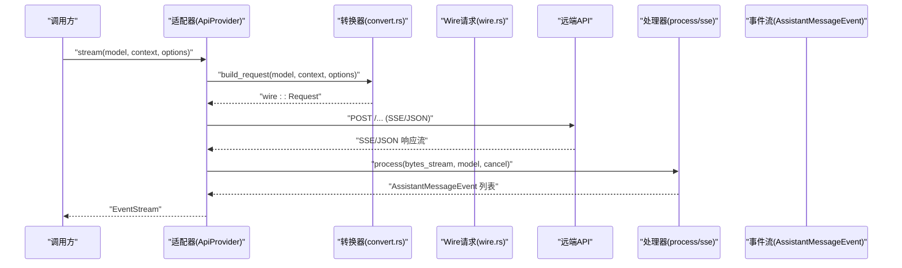
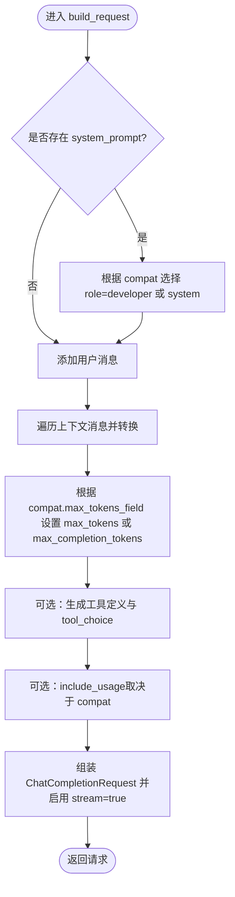
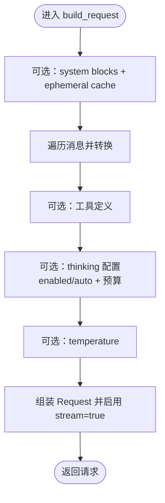
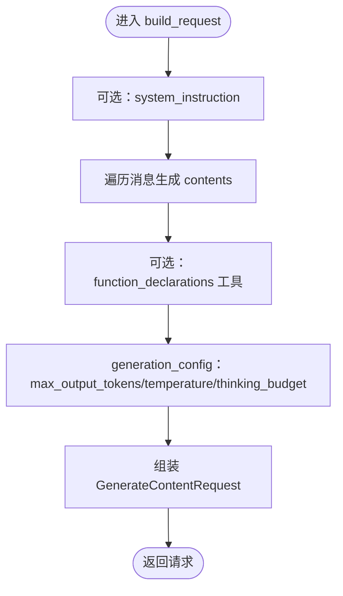
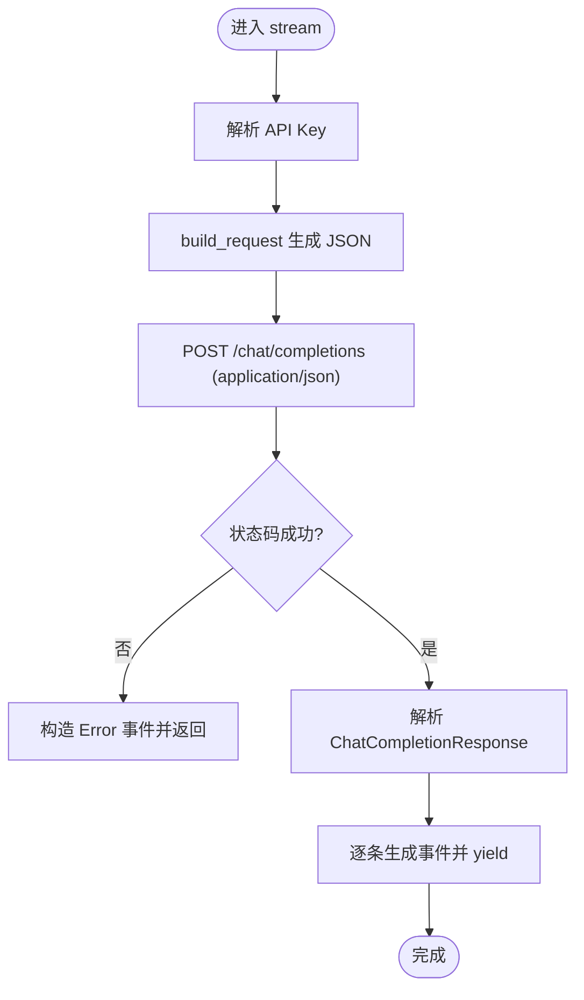
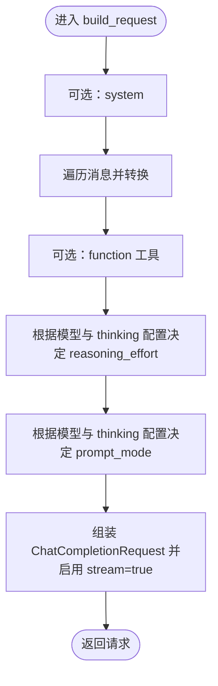
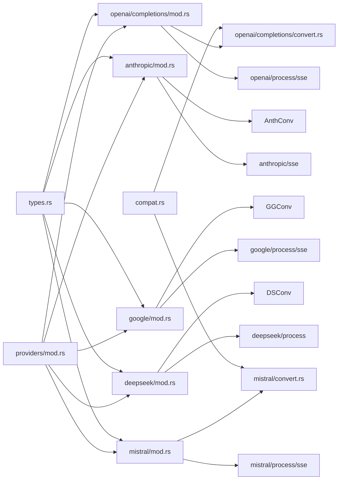

# 兼容性适配层

<cite>
**本文引用的文件**
- [crates/pi-ai/src/lib.rs](file://crates/pi-ai/src/lib.rs)
- [crates/pi-ai/src/compat.rs](file://crates/pi-ai/src/compat.rs)
- [crates/pi-ai/src/providers/mod.rs](file://crates/pi-ai/src/providers/mod.rs)
- [crates/pi-ai/src/types.rs](file://crates/pi-ai/src/types.rs)
- [crates/pi-ai/src/models.rs](file://crates/pi-ai/src/models.rs)
- [crates/pi-ai/src/providers/openai/completions/mod.rs](file://crates/pi-ai/src/providers/openai/completions/mod.rs)
- [crates/pi-ai/src/providers/openai/completions/convert.rs](file://crates/pi-ai/src/providers/openai/completions/convert.rs)
- [crates/pi-ai/src/providers/anthropic/mod.rs](file://crates/pi-ai/src/providers/anthropic/mod.rs)
- [crates/pi-ai/src/providers/anthropic/convert.rs](file://crates/pi-ai/src/providers/anthropic/convert.rs)
- [crates/pi-ai/src/providers/google/mod.rs](file://crates/pi-ai/src/providers/google/mod.rs)
- [crates/pi-ai/src/providers/google/convert.rs](file://crates/pi-ai/src/providers/google/convert.rs)
- [crates/pi-ai/src/providers/deepseek/mod.rs](file://crates/pi-ai/src/providers/deepseek/mod.rs)
- [crates/pi-ai/src/providers/deepseek/convert.rs](file://crates/pi-ai/src/providers/deepseek/convert.rs)
- [crates/pi-ai/src/providers/mistral/mod.rs](file://crates/pi-ai/src/providers/mistral/mod.rs)
- [crates/pi-ai/src/providers/mistral/convert.rs](file://crates/pi-ai/src/providers/mistral/convert.rs)
</cite>

## 目录
1. [简介](#简介)
2. [项目结构](#项目结构)
3. [核心组件](#核心组件)
4. [架构总览](#架构总览)
5. [详细组件分析](#详细组件分析)
6. [依赖关系分析](#依赖关系分析)
7. [性能考量](#性能考量)
8. [故障排查指南](#故障排查指南)
9. [结论](#结论)
10. [附录](#附录)

## 简介
本文件系统化阐述“兼容性适配层”的设计与实现，聚焦于多厂商（OpenAI、Anthropic、Google、DeepSeek、Mistral 等）大模型 API 的格式标准化与转换机制。内容覆盖：
- 数据结构映射：消息、内容块、工具调用、思考内容等的跨厂商对齐
- 字段对齐与类型转换：温度、最大令牌数、工具选择、缓存控制、会话亲和等
- 响应格式统一：事件流、停止原因、用量统计、成本计算
- 参数标准化：流式选项、重试配置、超时控制、钩子扩展
- 错误码映射与错误传播：HTTP 状态、解析失败、取消信号
- 适配器实现示例：以 OpenAI Completions、Anthropic Messages、Google Generative AI、DeepSeek Chat Completions、Mistral Conversations 为例
- 向后兼容与版本演进：兼容标记、模型注册表、弃用迁移路径
- 性能影响与最佳实践：请求头合并、流式处理、重试与超时

## 项目结构
兼容性适配层位于 crates/pi-ai 模块中，采用“按供应商分层 + 统一类型与事件”的组织方式：
- 类型与事件：types.rs 定义通用的消息、内容块、事件、用量与成本等核心数据结构
- 兼容标记：compat.rs 定义各厂商特有的兼容字段与行为开关
- 供应商注册：providers/mod.rs 负责内置供应商的注册入口
- 适配器实现：各供应商目录下包含 convert（请求构建）、process/sse（事件解析）、wire（请求/响应结构）、mod.rs（适配器主体）
- 模型注册与成本：models.rs 提供模型查询与成本计算

图表来源
- [crates/pi-ai/src/lib.rs:1-19](file://crates/pi-ai/src/lib.rs#L1-L19)
- [crates/pi-ai/src/compat.rs:1-249](file://crates/pi-ai/src/compat.rs#L1-L249)
- [crates/pi-ai/src/providers/mod.rs:1-61](file://crates/pi-ai/src/providers/mod.rs#L1-L61)
- [crates/pi-ai/src/types.rs:1-599](file://crates/pi-ai/src/types.rs#L1-L599)
- [crates/pi-ai/src/models.rs:1-110](file://crates/pi-ai/src/models.rs#L1-L110)

章节来源
- [crates/pi-ai/src/lib.rs:1-19](file://crates/pi-ai/src/lib.rs#L1-L19)
- [crates/pi-ai/src/providers/mod.rs:17-60](file://crates/pi-ai/src/providers/mod.rs#L17-L60)

## 核心组件
- 通用类型与事件
  - 内容块：文本、思考、图像、工具调用
  - 消息：用户、助手、工具结果
  - 流事件：开始、文本增量、思考增量、工具调用增量、结束/错误
  - 用量与成本：输入/输出/缓存读写令牌与费用
  - 停止原因：停止、长度、工具使用、错误、中止
- 兼容标记
  - 思考层级映射、思考格式、缓存控制格式
  - OpenAI Completions 兼容：是否支持存储、用量在流中返回、开发者角色、推理努力、最大令牌字段别名、工具结果命名要求、思考作为文本、思考格式、路由与网关、Zai 工具流、严格模式、缓存控制格式、会话亲和头、长缓存保留
  - OpenAI Responses 兼容：会话 ID 头、长缓存保留
  - Anthropic Messages 兼容：急切工具输入流、会话亲和头、长缓存保留、工具缓存控制、温度、自适应思考强制、空签名允许
  - 兼容枚举：根据 JSON 结构自动识别具体兼容类型
- 供应商注册
  - 注册内置供应商名称与其实例，集中初始化
- 模型与成本
  - 模型查询、优先级查找、成本计算（按百万令牌计费）

章节来源
- [crates/pi-ai/src/types.rs:9-122](file://crates/pi-ai/src/types.rs#L9-L122)
- [crates/pi-ai/src/types.rs:166-242](file://crates/pi-ai/src/types.rs#L166-L242)
- [crates/pi-ai/src/types.rs:264-301](file://crates/pi-ai/src/types.rs#L264-L301)
- [crates/pi-ai/src/compat.rs:6-249](file://crates/pi-ai/src/compat.rs#L6-L249)
- [crates/pi-ai/src/providers/mod.rs:17-60](file://crates/pi-ai/src/providers/mod.rs#L17-L60)
- [crates/pi-ai/src/models.rs:6-54](file://crates/pi-ai/src/models.rs#L6-L54)

## 架构总览
兼容性适配层通过“统一类型 + 供应商转换器”的模式实现跨厂商 API 的解耦：
- 输入侧：统一 Context/Message/ContentBlock/Tool → 各供应商 convert.rs 将其映射到对应 wire 请求结构
- 输出侧：各供应商 SSE/JSON 流 → 适配器 process/sse 解析为统一 AssistantMessageEvent
- 控制侧：StreamOptions 提供统一的温度、最大令牌、工具选择、缓存保留、会话 ID、Azure/Bedrock/Headers 等参数；ProviderStreamHooks 提供 payload 与响应钩子扩展点
- 成本侧：models.rs 计算用量费用

图表来源
- [crates/pi-ai/src/providers/openai/completions/mod.rs:35-156](file://crates/pi-ai/src/providers/openai/completions/mod.rs#L35-L156)
- [crates/pi-ai/src/providers/openai/completions/convert.rs:5-77](file://crates/pi-ai/src/providers/openai/completions/convert.rs#L5-L77)
- [crates/pi-ai/src/providers/anthropic/mod.rs:35-121](file://crates/pi-ai/src/providers/anthropic/mod.rs#L35-L121)
- [crates/pi-ai/src/providers/anthropic/convert.rs:39-98](file://crates/pi-ai/src/providers/anthropic/convert.rs#L39-L98)
- [crates/pi-ai/src/providers/google/mod.rs:35-152](file://crates/pi-ai/src/providers/google/mod.rs#L35-L152)
- [crates/pi-ai/src/providers/google/convert.rs:4-64](file://crates/pi-ai/src/providers/google/convert.rs#L4-L64)
- [crates/pi-ai/src/providers/deepseek/mod.rs:35-146](file://crates/pi-ai/src/providers/deepseek/mod.rs#L35-L146)
- [crates/pi-ai/src/providers/deepseek/convert.rs:4-29](file://crates/pi-ai/src/providers/deepseek/convert.rs#L4-L29)
- [crates/pi-ai/src/providers/mistral/mod.rs:60-144](file://crates/pi-ai/src/providers/mistral/mod.rs#L60-L144)
- [crates/pi-ai/src/providers/mistral/convert.rs:6-60](file://crates/pi-ai/src/providers/mistral/convert.rs#L6-L60)

## 详细组件分析

### 组件A：OpenAI Completions 适配器
- 设计要点
  - 请求构建：根据模型 compat 决定 system 角色（developer/system）、max_tokens/max_completion_tokens 字段别名、是否包含 usage、工具定义与 tool_choice
  - 用户内容：纯文本走单字段，含图片时转为多部分（含 dataURL）
  - 助手内容：拆分为文本与工具调用两路，必要时仅发送空文本占位
  - 工具结果：映射为 tool 角色消息，并携带 tool_call_id
  - 流式处理：SSE 流经 process 阶段转换为统一事件
- 关键流程

图表来源
- [crates/pi-ai/src/providers/openai/completions/convert.rs:5-77](file://crates/pi-ai/src/providers/openai/completions/convert.rs#L5-L77)

章节来源
- [crates/pi-ai/src/providers/openai/completions/mod.rs:35-156](file://crates/pi-ai/src/providers/openai/completions/mod.rs#L35-L156)
- [crates/pi-ai/src/providers/openai/completions/convert.rs:5-186](file://crates/pi-ai/src/providers/openai/completions/convert.rs#L5-L186)

### 组件B：Anthropic Messages 适配器
- 设计要点
  - 工具调用 ID 规范化：满足 ^[a-zA-Z0-9_-]{1,64}$
  - 工具结果合并：连续 ToolResult 合并到上一个用户回合，避免多轮拆分
  - 思考内容：映射为 thinking 类型内容块
  - 缓存控制：system 块支持临时缓存
  - 停止原因映射：end_turn→停止、max_tokens→长度、tool_use→工具使用
- 关键流程

图表来源
- [crates/pi-ai/src/providers/anthropic/convert.rs:39-98](file://crates/pi-ai/src/providers/anthropic/convert.rs#L39-L98)

章节来源
- [crates/pi-ai/src/providers/anthropic/mod.rs:35-121](file://crates/pi-ai/src/providers/anthropic/mod.rs#L35-L121)
- [crates/pi-ai/src/providers/anthropic/convert.rs:1-307](file://crates/pi-ai/src/providers/anthropic/convert.rs#L1-L307)

### 组件C：Google Generative AI 适配器
- 设计要点
  - system_instruction 单独传入
  - contents 由用户/模型消息组成，工具通过 function_declarations 传递
  - generation_config 支持 max_output_tokens、temperature、thinking_config（预算）
  - 使用 alt=sse 的 SSE 接口
- 关键流程

图表来源
- [crates/pi-ai/src/providers/google/convert.rs:4-64](file://crates/pi-ai/src/providers/google/convert.rs#L4-L64)

章节来源
- [crates/pi-ai/src/providers/google/mod.rs:35-152](file://crates/pi-ai/src/providers/google/mod.rs#L35-L152)
- [crates/pi-ai/src/providers/google/convert.rs:1-156](file://crates/pi-ai/src/providers/google/convert.rs#L1-L156)

### 组件D：DeepSeek Chat Completions 适配器
- 设计要点
  - 非流式 JSON 响应，直接解析为 ChatCompletionResponse
  - 将响应转换为统一事件序列
  - 支持取消信号，及时返回中止事件
- 关键流程

图表来源
- [crates/pi-ai/src/providers/deepseek/mod.rs:35-146](file://crates/pi-ai/src/providers/deepseek/mod.rs#L35-L146)

章节来源
- [crates/pi-ai/src/providers/deepseek/mod.rs:1-147](file://crates/pi-ai/src/providers/deepseek/mod.rs#L1-L147)
- [crates/pi-ai/src/providers/deepseek/convert.rs:1-59](file://crates/pi-ai/src/providers/deepseek/convert.rs#L1-L59)

### 组件E：Mistral Conversations 适配器
- 设计要点
  - 支持图片输入（按模型能力动态启用）
  - 思考内容映射为专用内容部件
  - 工具调用规范化 ID（哈希+裁剪），确保长度与字符集合规
  - 推理努力与提示模式：根据模型与配置决定是否开启 reasoning 模式
- 关键流程

图表来源
- [crates/pi-ai/src/providers/mistral/convert.rs:6-60](file://crates/pi-ai/src/providers/mistral/convert.rs#L6-L60)

章节来源
- [crates/pi-ai/src/providers/mistral/mod.rs:60-144](file://crates/pi-ai/src/providers/mistral/mod.rs#L60-L144)
- [crates/pi-ai/src/providers/mistral/convert.rs:207-255](file://crates/pi-ai/src/providers/mistral/convert.rs#L207-L255)

### 组件F：兼容标记与统一事件
- 兼容标记
  - ThinkingLevelMap：最小/低/中/高/x高 的值映射，支持字符串或 null
  - ThinkingFormat：多种思考格式（OpenAI/OpenRouter/DeepSeek/Zai/Qwen/Qwen-chat-template/Together/StringThinking）
  - CacheControlFormat：Anthropic 缓存控制格式
  - OpenAICompletionsCompat：字段别名、工具/思考/缓存相关行为开关
  - OpenAIResponsesCompat：会话 ID 头、长缓存保留
  - AnthropicMessagesCompat：急切工具输入流、温度、自适应思考、空签名允许、工具缓存控制
  - ModelCompat：枚举包装，运行时根据 JSON 结构自动识别具体兼容类型
- 统一事件
  - AssistantMessageEvent：start/text_* / thinking_* / toolcall_* / done/error
  - StopReason：统一停止原因
  - Usage/Cost：统一用量与费用统计

章节来源
- [crates/pi-ai/src/compat.rs:6-249](file://crates/pi-ai/src/compat.rs#L6-L249)
- [crates/pi-ai/src/types.rs:9-122](file://crates/pi-ai/src/types.rs#L9-L122)
- [crates/pi-ai/src/types.rs:166-242](file://crates/pi-ai/src/types.rs#L166-L242)
- [crates/pi-ai/src/types.rs:264-301](file://crates/pi-ai/src/types.rs#L264-L301)

## 依赖关系分析
- 适配器与类型
  - 所有适配器均依赖 types.rs 中的通用类型（Message/ContentBlock/AssistantMessage/AssistantMessageEvent/Usage/Cost/StopReason）
  - OpenAI/Mistral 依赖 compat.rs 中的兼容标记进行字段别名与行为开关
- 适配器与转换器
  - convert.rs 负责将通用上下文映射到各供应商 wire 请求结构
  - process/sse 负责将远端响应流解析为统一事件
- 供应商注册
  - providers/mod.rs 在启动时注册所有内置供应商，便于全局统一调度

图表来源
- [crates/pi-ai/src/types.rs:1-599](file://crates/pi-ai/src/types.rs#L1-L599)
- [crates/pi-ai/src/compat.rs:1-249](file://crates/pi-ai/src/compat.rs#L1-L249)
- [crates/pi-ai/src/providers/mod.rs:1-61](file://crates/pi-ai/src/providers/mod.rs#L1-L61)

章节来源
- [crates/pi-ai/src/providers/mod.rs:17-60](file://crates/pi-ai/src/providers/mod.rs#L17-L60)

## 性能考量
- 请求头合并与会话亲和
  - Mistral 提供了将 headers 与 session_id 合并为亲和头的策略，有助于提升缓存命中与稳定性
- 流式处理与背压
  - OpenAI/Anthropic/Google 采用 SSE 流，适配器按事件粒度产出，避免一次性缓冲大量中间数据
- 重试与超时
  - 通过 StreamOptions 与 RetryConfig 控制超时与重试次数，降低瞬时网络波动的影响
- 图像数据编码
  - 对于需要 Base64 的场景（如 Google/Anthropic），尽量减少重复编码与不必要的拷贝
- 工具调用 ID 规范化
  - 通过哈希与裁剪策略生成稳定且合规的 ID，避免后续解析与匹配开销

## 故障排查指南
- API Key 缺失
  - 各适配器在未检测到 API Key 时，立即产生 Error 事件并设置 StopReason::Error
- HTTP 错误
  - 非成功状态码时，读取响应体并封装为 Error 事件
- 超时与取消
  - 超时触发 Error 事件；DeepSeek 支持取消令牌，提前中止并返回 Aborted
- 解析失败
  - DeepSeek JSON 解析失败时，产生 Error 事件并携带错误信息
- 建议
  - 在调用前校验 API Key 来源（环境变量或显式传入）
  - 为关键请求设置合理的超时与重试上限
  - 使用 ProviderStreamHooks 记录关键指标（状态码、耗时、错误码）

章节来源
- [crates/pi-ai/src/providers/openai/completions/mod.rs:43-58](file://crates/pi-ai/src/providers/openai/completions/mod.rs#L43-L58)
- [crates/pi-ai/src/providers/anthropic/mod.rs:43-54](file://crates/pi-ai/src/providers/anthropic/mod.rs#L43-L54)
- [crates/pi-ai/src/providers/google/mod.rs:43-58](file://crates/pi-ai/src/providers/google/mod.rs#L43-L58)
- [crates/pi-ai/src/providers/deepseek/mod.rs:43-55](file://crates/pi-ai/src/providers/deepseek/mod.rs#L43-L55)
- [crates/pi-ai/src/providers/mistral/mod.rs:68-80](file://crates/pi-ai/src/providers/mistral/mod.rs#L68-L80)

## 结论
兼容性适配层通过统一类型与事件、明确的转换规则与兼容标记，有效屏蔽多厂商 API 的差异，实现：
- 数据结构与字段的标准化映射
- 参数与行为的统一化控制
- 响应格式的事件化统一
- 可扩展的钩子与兼容标记体系
在实际工程中，建议结合各供应商特性（如 Anthropic 的思考块、Google 的 thinking_budget、Mistral 的推理努力）合理配置 StreamOptions 与 compat 标记，以获得更优的体验与性能。

## 附录
- 向后兼容与版本演进
  - 兼容标记采用 untagged/别名与可选字段，新增字段不影响旧版解析
  - 模型注册表以 JSON 形式静态加载，新增模型无需修改代码
- 弃用与迁移
  - 通过 compat 标记中的开关（如 requiresThinkingAsText、supportsReasoningEffort）逐步引导迁移
  - 对于不支持的字段，转换器采用降级策略（如仅发送文本占位、忽略图片）
- 最佳实践
  - 明确区分“参数标准化”与“行为开关”，前者统一字段名，后者控制行为
  - 在 convert 层做尽可能多的“语义对齐”，在 process 层专注“格式解析”
  - 使用 ProviderStreamHooks 进行可观测性与治理（状态码、耗时、错误码）