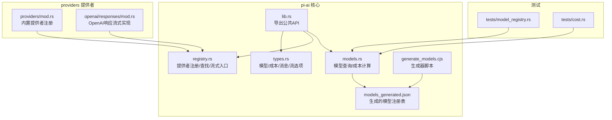
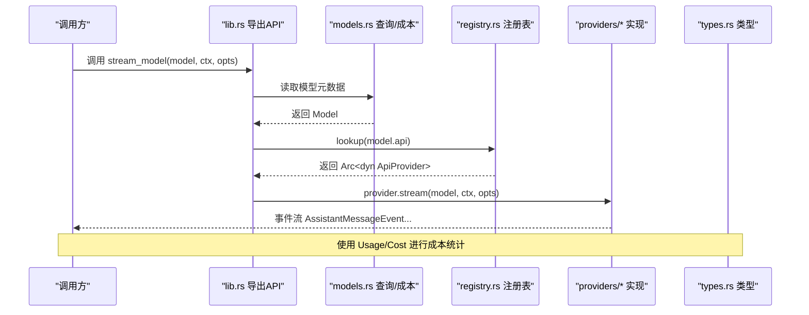
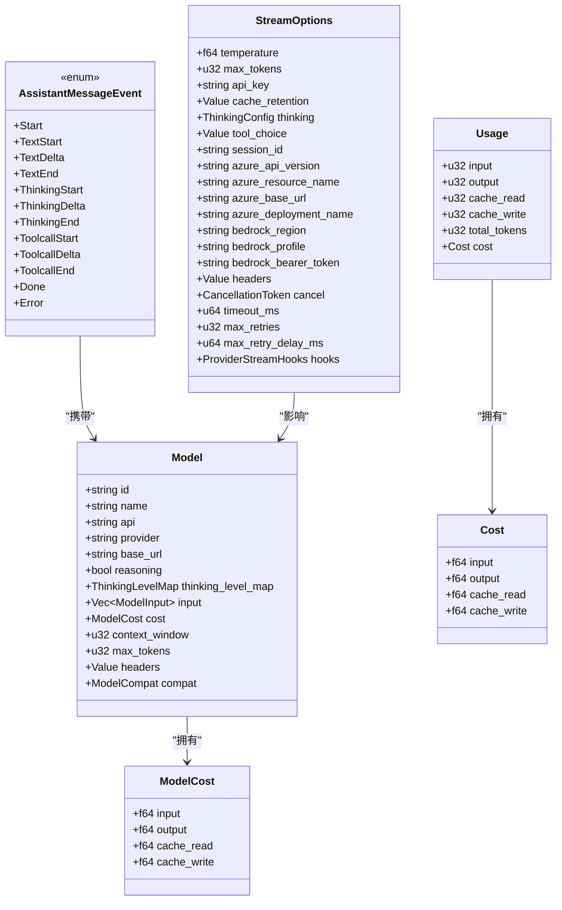
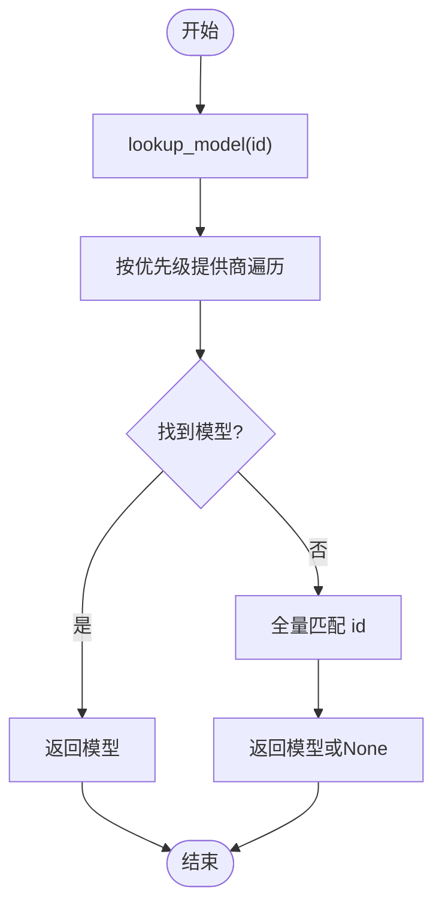
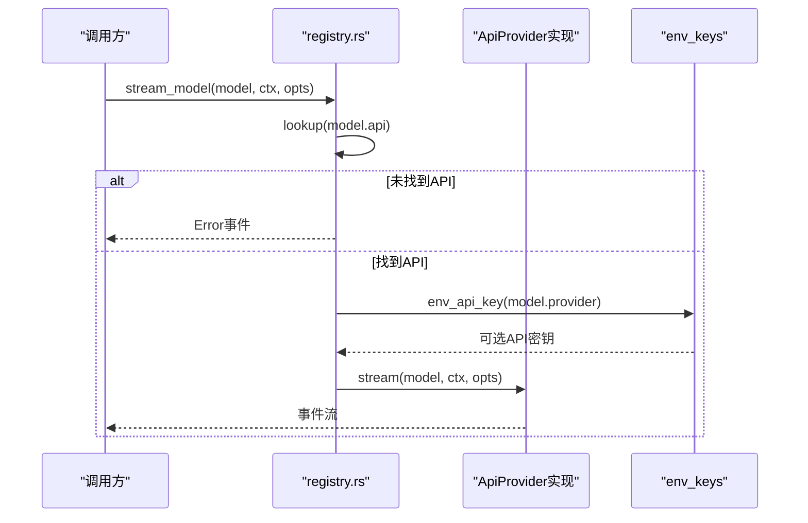
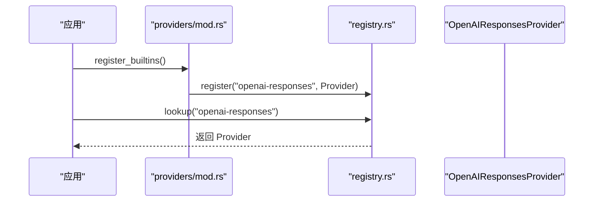
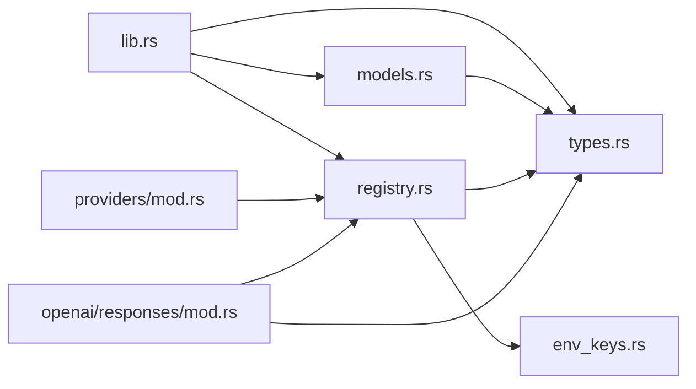

# 模型注册表系统

<cite>
**本文档引用的文件**
- [crates/pi-ai/src/lib.rs](file://crates/pi-ai/src/lib.rs)
- [crates/pi-ai/src/registry.rs](file://crates/pi-ai/src/registry.rs)
- [crates/pi-ai/src/models.rs](file://crates/pi-ai/src/models.rs)
- [crates/pi-ai/src/types.rs](file://crates/pi-ai/src/types.rs)
- [crates/pi-ai/src/providers/mod.rs](file://crates/pi-ai/src/providers/mod.rs)
- [crates/pi-ai/src/providers/openai/responses/mod.rs](file://crates/pi-ai/src/providers/openai/responses/mod.rs)
- [crates/pi-ai/tests/model_registry.rs](file://crates/pi-ai/tests/model_registry.rs)
- [crates/pi-ai/tests/cost.rs](file://crates/pi-ai/tests/cost.rs)
- [crates/pi-ai/tools/generate_models.cjs](file://crates/pi-ai/tools/generate_models.cjs)
- [crates/pi-ai/src/models_generated.json](file://crates/pi-ai/src/models_generated.json)
- [docs/superpowers/plans/2026-06-04-pi-ai-m2-provider-breadth-model-registry.md](file://docs/superpowers/plans/2026-06-04-pi-ai-m2-provider-breadth-model-registry.md)
- [docs/superpowers/plans/2026-06-03-pi-ai-rust-poc.md](file://docs/superpowers/plans/2026-06-03-pi-ai-rust-poc.md)
- [crates/pi-coding-agent/src/models.rs](file://crates/pi-coding-agent/src/models.rs)
</cite>

## 目录
1. [简介](#简介)
2. [项目结构](#项目结构)
3. [核心组件](#核心组件)
4. [架构总览](#架构总览)
5. [详细组件分析](#详细组件分析)
6. [依赖关系分析](#依赖关系分析)
7. [性能考量](#性能考量)
8. [故障排查指南](#故障排查指南)
9. [结论](#结论)
10. [附录](#附录)

## 简介
本文件为模型注册表系统的完整技术文档，覆盖以下关键主题：
- 模型元数据管理：包含模型结构、输入类型、成本结构、上下文窗口等字段定义
- 注册机制与查询接口：提供按ID、按提供商过滤、列出提供商、优先级查找等能力
- 成本计算算法：基于每百万令牌的费率进行精确计算，并支持缓存读写成本
- 最优模型选择策略：通过优先级列表与通用回退逻辑实现稳定选择
- 数据结构与索引：静态加载的JSON注册表、按提供商分组、BTreeSet去重
- 缓存策略：LazyLock延迟初始化，避免重复解析与分配
- 模型发现与版本管理：通过生成器从TypeScript源生成JSON，确保一致性
- 向后兼容性：字段命名驼峰与蛇形混用的序列化适配
- API参考：模型查找、注册、注销、流式调用、批量操作建议
- 动态更新与热重载：当前实现为静态注册表，建议扩展点
- 性能监控与成本分析：Usage/Cost结构与测试用例验证

## 项目结构
模型注册表系统主要位于pi-ai crate中，配合providers模块提供多供应商接入，测试用例覆盖注册表完整性与成本计算。

**图表来源**
- [crates/pi-ai/src/lib.rs:1-19](file://crates/pi-ai/src/lib.rs#L1-L19)
- [crates/pi-ai/src/models.rs:1-110](file://crates/pi-ai/src/models.rs#L1-L110)
- [crates/pi-ai/src/registry.rs:1-163](file://crates/pi-ai/src/registry.rs#L1-L163)
- [crates/pi-ai/src/types.rs:1-599](file://crates/pi-ai/src/types.rs#L1-L599)
- [crates/pi-ai/src/providers/mod.rs:1-61](file://crates/pi-ai/src/providers/mod.rs#L1-L61)
- [crates/pi-ai/src/providers/openai/responses/mod.rs:1-157](file://crates/pi-ai/src/providers/openai/responses/mod.rs#L1-L157)
- [crates/pi-ai/tests/model_registry.rs:1-170](file://crates/pi-ai/tests/model_registry.rs#L1-L170)
- [crates/pi-ai/tests/cost.rs:1-43](file://crates/pi-ai/tests/cost.rs#L1-L43)
- [crates/pi-ai/tools/generate_models.cjs:1-60](file://crates/pi-ai/tools/generate_models.cjs#L1-L60)
- [crates/pi-ai/src/models_generated.json:1-200](file://crates/pi-ai/src/models_generated.json#L1-L200)

**章节来源**
- [crates/pi-ai/src/lib.rs:1-19](file://crates/pi-ai/src/lib.rs#L1-L19)
- [crates/pi-ai/src/models.rs:1-110](file://crates/pi-ai/src/models.rs#L1-L110)
- [crates/pi-ai/src/registry.rs:1-163](file://crates/pi-ai/src/registry.rs#L1-L163)
- [crates/pi-ai/src/types.rs:1-599](file://crates/pi-ai/src/types.rs#L1-L599)
- [crates/pi-ai/src/providers/mod.rs:1-61](file://crates/pi-ai/src/providers/mod.rs#L1-L61)
- [crates/pi-ai/src/providers/openai/responses/mod.rs:1-157](file://crates/pi-ai/src/providers/openai/responses/mod.rs#L1-L157)
- [crates/pi-ai/tests/model_registry.rs:1-170](file://crates/pi-ai/tests/model_registry.rs#L1-L170)
- [crates/pi-ai/tests/cost.rs:1-43](file://crates/pi-ai/tests/cost.rs#L1-L43)
- [crates/pi-ai/tools/generate_models.cjs:1-60](file://crates/pi-ai/tools/generate_models.cjs#L1-L60)
- [crates/pi-ai/src/models_generated.json:1-200](file://crates/pi-ai/src/models_generated.json#L1-L200)

## 核心组件
- 类型系统（types.rs）
  - 模型结构：包含标识、名称、API、提供商、基础URL、推理开关、思维映射、输入类型、成本、上下文窗口、最大令牌数、请求头、兼容性等字段
  - 成本与用量：Cost与Usage结构，分别表示单价成本与实际用量及累计成本
  - 流式事件：AssistantMessageEvent系列，支持文本、思考、工具调用增量事件
  - 流式选项：StreamOptions，包含温度、最大令牌、API密钥、缓存保留、思维配置、工具选择、会话ID、Azure/Bedrock参数、自定义头部、取消令牌、超时与重试配置、钩子等
- 模型查询与成本（models.rs）
  - lookup_model：按优先级提供商搜索，再回退到全量匹配
  - get_model/get_models/get_providers：按提供商过滤与枚举
  - all_models：LazyLock静态加载生成的JSON注册表
  - calculate_cost：按每百万令牌费率计算输入、输出与缓存读写成本
- 注册与流式入口（registry.rs）
  - ApiProvider trait：统一的流式接口
  - 全局注册表：HashMap<String, Arc<dyn ApiProvider>>，线程安全读写
  - register/unregister/lookup：提供者注册、注销与查找
  - stream_model：根据模型API解析对应提供者并注入环境密钥，委托执行
- 提供者集成（providers/mod.rs 与具体实现）
  - register_builtins：一次性注册所有内置提供者
  - OpenAIResponsesProvider：示例提供者，展示如何解析密钥、构造请求、处理错误与SSE流
- 生成器与注册表（tools/generate_models.cjs 与 models_generated.json）
  - 从TypeScript源生成标准化JSON，包含id/name/api/provider/baseUrl/reasoning/input/cost/contextWindow/maxTokens/thinkingLevelMap/headers/compat等字段
  - models.rs通过include_str与LazyLock加载该JSON，保证启动时只解析一次

**章节来源**
- [crates/pi-ai/src/types.rs:263-407](file://crates/pi-ai/src/types.rs#L263-L407)
- [crates/pi-ai/src/models.rs:5-110](file://crates/pi-ai/src/models.rs#L5-L110)
- [crates/pi-ai/src/registry.rs:9-55](file://crates/pi-ai/src/registry.rs#L9-L55)
- [crates/pi-ai/src/providers/mod.rs:17-60](file://crates/pi-ai/src/providers/mod.rs#L17-L60)
- [crates/pi-ai/src/providers/openai/responses/mod.rs:35-157](file://crates/pi-ai/src/providers/openai/responses/mod.rs#L35-L157)
- [crates/pi-ai/tools/generate_models.cjs:22-59](file://crates/pi-ai/tools/generate_models.cjs#L22-L59)
- [crates/pi-ai/src/models_generated.json:1-200](file://crates/pi-ai/src/models_generated.json#L1-L200)

## 架构总览
系统采用“类型定义 + 静态注册表 + 提供者插件”的架构。核心流程如下：

**图表来源**
- [crates/pi-ai/src/lib.rs:10-19](file://crates/pi-ai/src/lib.rs#L10-L19)
- [crates/pi-ai/src/registry.rs:31-55](file://crates/pi-ai/src/registry.rs#L31-L55)
- [crates/pi-ai/src/models.rs:39-54](file://crates/pi-ai/src/models.rs#L39-L54)
- [crates/pi-ai/src/types.rs:65-122](file://crates/pi-ai/src/types.rs#L65-L122)

## 详细组件分析

### 类型系统与数据模型
- 模型（Model）：包含id/name/api/provider/baseUrl/reasoning/thinkingLevelMap/input/cost/contextWindow/maxTokens/headers/compat等字段，支持序列化为JSON并保持驼峰命名
- 成本（ModelCost）：input/output/cache_read/cache_write，单位为每百万令牌
- 用量（Usage/Cost）：input/output/cache_read/cache_write/total_tokens/cost，用于累计成本
- 流式事件（AssistantMessageEvent）：支持文本、思考、工具调用的增量事件，以及完成与错误事件
- 流式选项（StreamOptions）：集中管理温度、最大令牌、API密钥、缓存保留、思维配置、工具选择、会话ID、Azure/Bedrock参数、自定义头部、取消令牌、超时与重试、钩子等

**图表来源**
- [crates/pi-ai/src/types.rs:263-407](file://crates/pi-ai/src/types.rs#L263-L407)
- [crates/pi-ai/src/types.rs:65-122](file://crates/pi-ai/src/types.rs#L65-L122)

**章节来源**
- [crates/pi-ai/src/types.rs:263-407](file://crates/pi-ai/src/types.rs#L263-L407)
- [crates/pi-ai/src/types.rs:65-122](file://crates/pi-ai/src/types.rs#L65-L122)

### 模型查询与成本计算
- lookup_model：优先在["anthropic","openai","google","deepseek"]中按顺序查找，若未找到则在全量注册表中匹配
- get_model/get_models/get_providers：按提供商过滤与枚举，使用BTreeSet保证非空且有序
- all_models：LazyLock延迟加载models_generated.json，避免重复解析
- calculate_cost：按每百万令牌费率计算input/output/cache_read/cache_write的成本，原地更新Usage.cost

**图表来源**
- [crates/pi-ai/src/models.rs:5-14](file://crates/pi-ai/src/models.rs#L5-L14)

**章节来源**
- [crates/pi-ai/src/models.rs:5-110](file://crates/pi-ai/src/models.rs#L5-L110)

### 注册机制与提供者流式入口
- ApiProvider trait：统一的stream接口，接收Model、Context、StreamOptions，返回事件流
- 全局注册表：HashMap<String, Arc<dyn ApiProvider>>，使用LazyLock与RwLock保护并发访问
- register/unregister/lookup：注册提供者、注销、查找；lookup返回克隆后的Arc以避免生命周期问题
- stream_model：根据model.api查找提供者，若缺失则立即返回错误事件；否则注入环境API密钥并委托给provider.stream

**图表来源**
- [crates/pi-ai/src/registry.rs:31-55](file://crates/pi-ai/src/registry.rs#L31-L55)
- [crates/pi-ai/src/registry.rs:9-26](file://crates/pi-ai/src/registry.rs#L9-L26)

**章节来源**
- [crates/pi-ai/src/registry.rs:9-55](file://crates/pi-ai/src/registry.rs#L9-L55)

### 提供者集成与OpenAI示例
- register_builtins：一次性注册所有内置提供者，便于应用启动时初始化
- OpenAIResponsesProvider：演示如何解析API密钥、构造请求URL、设置头部、处理超时与HTTP错误、解析SSE流并转换为事件流

**图表来源**
- [crates/pi-ai/src/providers/mod.rs:17-60](file://crates/pi-ai/src/providers/mod.rs#L17-L60)
- [crates/pi-ai/src/providers/openai/responses/mod.rs:35-157](file://crates/pi-ai/src/providers/openai/responses/mod.rs#L35-L157)

**章节来源**
- [crates/pi-ai/src/providers/mod.rs:17-60](file://crates/pi-ai/src/providers/mod.rs#L17-L60)
- [crates/pi-ai/src/providers/openai/responses/mod.rs:35-157](file://crates/pi-ai/src/providers/openai/responses/mod.rs#L35-L157)

### 模型发现、版本管理与向后兼容
- 生成器：generate_models.cjs从TypeScript源提取模型元数据，规范化字段并输出JSON
- 注册表：models_generated.json包含大量模型条目，支持thinkingLevelMap/headers/compat等可选字段
- 向后兼容：类型定义中对字段名进行camelCase/snake_case映射，确保与历史数据一致

**章节来源**
- [crates/pi-ai/tools/generate_models.cjs:22-59](file://crates/pi-ai/tools/generate_models.cjs#L22-L59)
- [crates/pi-ai/src/models_generated.json:1-200](file://crates/pi-ai/src/models_generated.json#L1-L200)
- [crates/pi-ai/src/types.rs:263-301](file://crates/pi-ai/src/types.rs#L263-L301)

### API参考（函数与类型）
- 模型查询
  - lookup_model(id: &str) -> Option<Model>
  - get_model(provider: &str, id: &str) -> Option<Model>
  - get_models(provider: &str) -> Vec<Model>
  - get_providers() -> Vec<String>
  - all_models() -> &'static [Model]
- 成本计算
  - calculate_cost(model: &Model, usage: &mut Usage)
- 注册与流式
  - register(api: &str, provider: Arc<dyn ApiProvider>)
  - unregister(api: &str)
  - lookup(api: &str) -> Option<Arc<dyn ApiProvider>>
  - stream_model(model: &Model, ctx: Context, opts: Option<StreamOptions>) -> EventStream
- 类型
  - Model/ModelCost/Usage/Cost/AssistantMessageEvent/StreamOptions/ThinkingConfig等

注意：当前未提供批量注册/注销与动态热重载接口，建议后续扩展。

**章节来源**
- [crates/pi-ai/src/models.rs:5-54](file://crates/pi-ai/src/models.rs#L5-L54)
- [crates/pi-ai/src/registry.rs:16-55](file://crates/pi-ai/src/registry.rs#L16-L55)
- [crates/pi-ai/src/types.rs:263-407](file://crates/pi-ai/src/types.rs#L263-L407)

## 依赖关系分析
- 模块耦合
  - lib.rs作为统一出口，聚合models、registry、types等模块
  - models依赖types中的Model/Usage结构与LazyLock加载的JSON
  - registry依赖types中的Model/StreamOptions与env_keys解析API密钥
  - providers通过registry注册自身，形成插件化架构
- 外部依赖
  - serde用于序列化/反序列化
  - tokio/futures用于异步流式处理
  - reqwest用于HTTP请求（以OpenAI为例）

**图表来源**
- [crates/pi-ai/src/lib.rs:1-19](file://crates/pi-ai/src/lib.rs#L1-L19)
- [crates/pi-ai/src/models.rs:1-4](file://crates/pi-ai/src/models.rs#L1-L4)
- [crates/pi-ai/src/registry.rs:1-7](file://crates/pi-ai/src/registry.rs#L1-L7)
- [crates/pi-ai/src/providers/mod.rs:14-15](file://crates/pi-ai/src/providers/mod.rs#L14-L15)
- [crates/pi-ai/src/providers/openai/responses/mod.rs:8-14](file://crates/pi-ai/src/providers/openai/responses/mod.rs#L8-L14)

**章节来源**
- [crates/pi-ai/src/lib.rs:1-19](file://crates/pi-ai/src/lib.rs#L1-L19)
- [crates/pi-ai/src/models.rs:1-4](file://crates/pi-ai/src/models.rs#L1-L4)
- [crates/pi-ai/src/registry.rs:1-7](file://crates/pi-ai/src/registry.rs#L1-L7)
- [crates/pi-ai/src/providers/mod.rs:14-15](file://crates/pi-ai/src/providers/mod.rs#L14-L15)
- [crates/pi-ai/src/providers/openai/responses/mod.rs:8-14](file://crates/pi-ai/src/providers/openai/responses/mod.rs#L8-L14)

## 性能考量
- 静态注册表与LazyLock
  - models.rs使用LazyLock延迟加载models_generated.json，避免重复解析与内存占用
  - 适合启动时一次性加载，运行期无额外IO开销
- 并发安全
  - registry.rs使用RwLock保护全局注册表，读多写少场景下性能良好
- 计算复杂度
  - lookup_model：优先级数组固定长度，全量匹配为O(N)，N为模型总数
  - get_models：过滤为O(N)，集合去重为O(M log M)，M为结果数量
- 序列化/反序列化
  - JSON注册表一次性解析，类型定义中字段映射减少运行期转换成本

[本节为一般性指导，不直接分析具体文件]

## 故障排查指南
- 未知提供者API
  - 现象：stream_model返回Error事件，stop_reason为Error
  - 排查：确认model.api是否正确，是否已通过register_builtins或手动register
  - 参考：[crates/pi-ai/src/registry.rs:31-55](file://crates/pi-ai/src/registry.rs#L31-L55)
- 缺失API密钥
  - 现象：提供者在解析密钥阶段返回Error事件
  - 排查：检查环境变量或StreamOptions.apiKey是否设置
  - 参考：[crates/pi-ai/src/providers/openai/responses/mod.rs:35-157](file://crates/pi-ai/src/providers/openai/responses/mod.rs#L35-L157)
- 成本计算异常
  - 现象：Usage.cost与预期不符
  - 排查：核对Model.cost字段与calculate_cost实现，确保单位为每百万令牌
  - 参考：[crates/pi-ai/src/models.rs:47-54](file://crates/pi-ai/src/models.rs#L47-L54)，[crates/pi-ai/tests/cost.rs:1-43](file://crates/pi-ai/tests/cost.rs#L1-L43)
- 注册表不一致
  - 现象：测试失败提示缺少字段或重复模型
  - 排查：重新运行generate_models.cjs生成models_generated.json，确保字段齐全
  - 参考：[crates/pi-ai/tests/model_registry.rs:122-146](file://crates/pi-ai/tests/model_registry.rs#L122-L146)，[crates/pi-ai/tools/generate_models.cjs:22-59](file://crates/pi-ai/tools/generate_models.cjs#L22-L59)

**章节来源**
- [crates/pi-ai/src/registry.rs:31-55](file://crates/pi-ai/src/registry.rs#L31-L55)
- [crates/pi-ai/src/providers/openai/responses/mod.rs:35-157](file://crates/pi-ai/src/providers/openai/responses/mod.rs#L35-L157)
- [crates/pi-ai/src/models.rs:47-54](file://crates/pi-ai/src/models.rs#L47-L54)
- [crates/pi-ai/tests/cost.rs:1-43](file://crates/pi-ai/tests/cost.rs#L1-L43)
- [crates/pi-ai/tests/model_registry.rs:122-146](file://crates/pi-ai/tests/model_registry.rs#L122-L146)
- [crates/pi-ai/tools/generate_models.cjs:22-59](file://crates/pi-ai/tools/generate_models.cjs#L22-L59)

## 结论
模型注册表系统通过清晰的类型定义、静态注册表与插件化提供者架构，实现了高内聚、低耦合的模型管理与调用链路。成本计算与流式事件设计完善，测试覆盖全面。建议后续增强：
- 动态注册/注销与热重载接口
- 批量操作API（批量查询、注册、注销）
- 最优模型选择策略（基于成本、性能、可用性的综合评分）
- 性能监控与使用统计（结合Usage/Cost进行成本分析）

[本节为总结性内容，不直接分析具体文件]

## 附录

### 版本与演进
- 初始POC：手写静态模型表，逐步迁移到生成器驱动的JSON注册表
- 关键里程碑
  - 添加ModelInput/ModelCost，替换扁平字段
  - 生成models_generated.rs与JSON，统一字段命名
  - 增强env-key解析与流式错误处理
  - 完善测试用例与文档计划

**章节来源**
- [docs/superpowers/plans/2026-06-03-pi-ai-rust-poc.md:637-750](file://docs/superpowers/plans/2026-06-03-pi-ai-rust-poc.md#L637-L750)
- [docs/superpowers/plans/2026-06-04-pi-ai-m2-provider-breadth-model-registry.md:138-195](file://docs/superpowers/plans/2026-06-04-pi-ai-m2-provider-breadth-model-registry.md#L138-L195)
- [docs/superpowers/plans/2026-06-04-pi-ai-m2-provider-breadth-model-registry.md:403-473](file://docs/superpowers/plans/2026-06-04-pi-ai-m2-provider-breadth-model-registry.md#L403-L473)

### 相关实现参考
- 模型轮转（CLI侧）：pi-coding-agent中的glob模式匹配与思考级别配置，体现模型选择策略的扩展思路

**章节来源**
- [crates/pi-coding-agent/src/models.rs:1-54](file://crates/pi-coding-agent/src/models.rs#L1-L54)