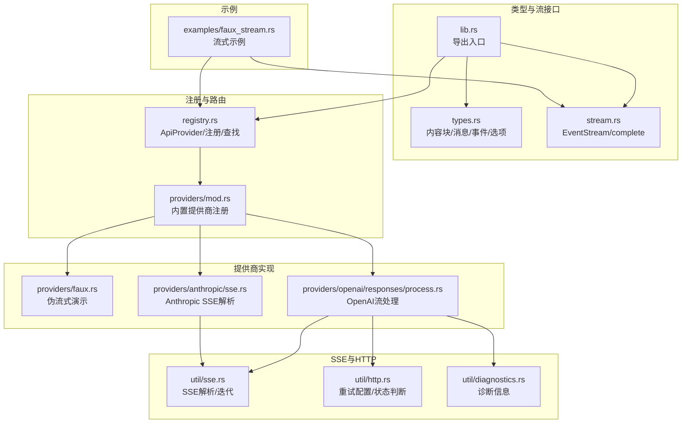
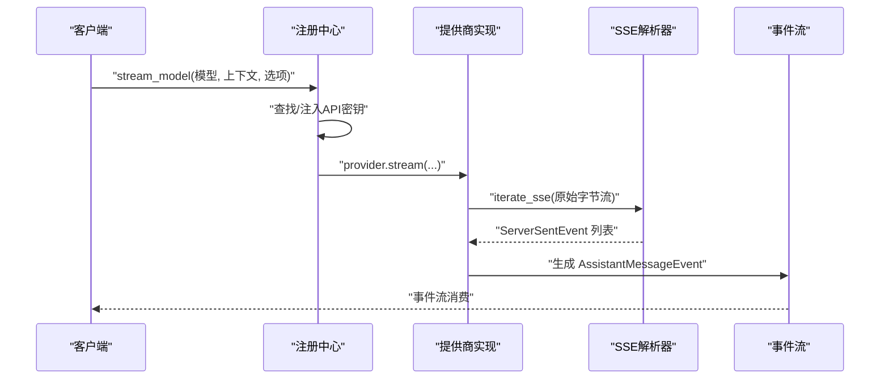
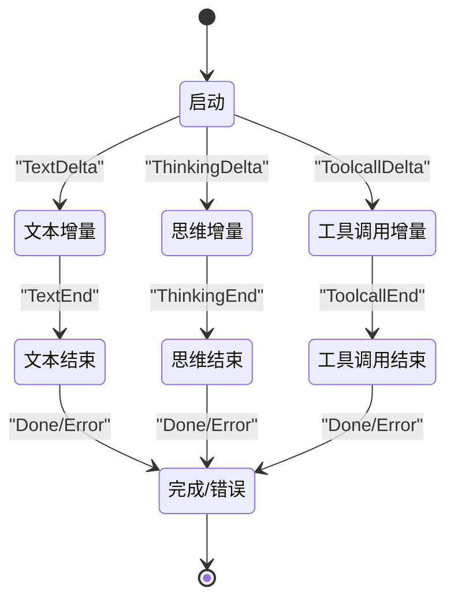
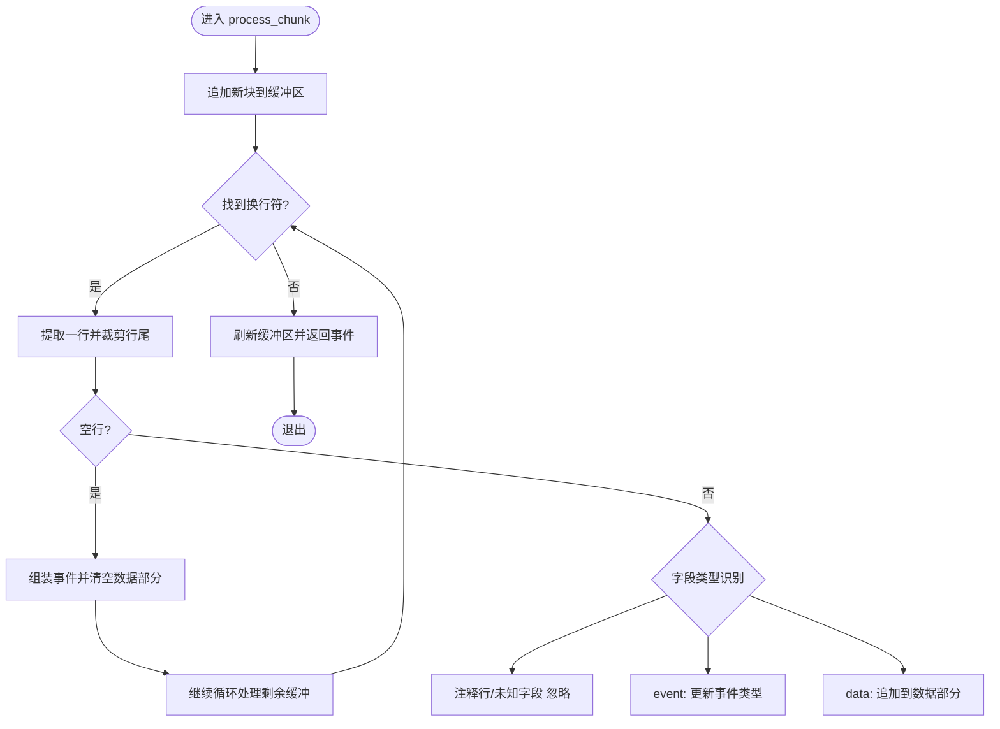
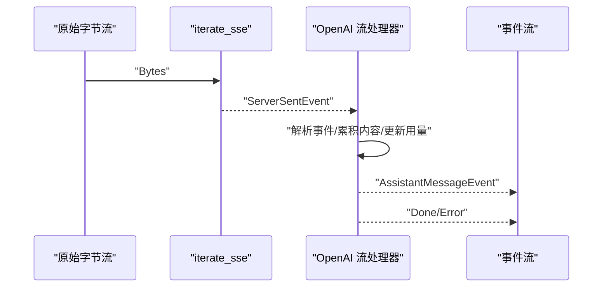
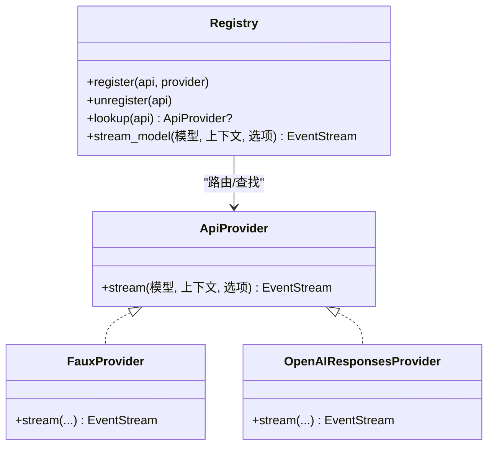
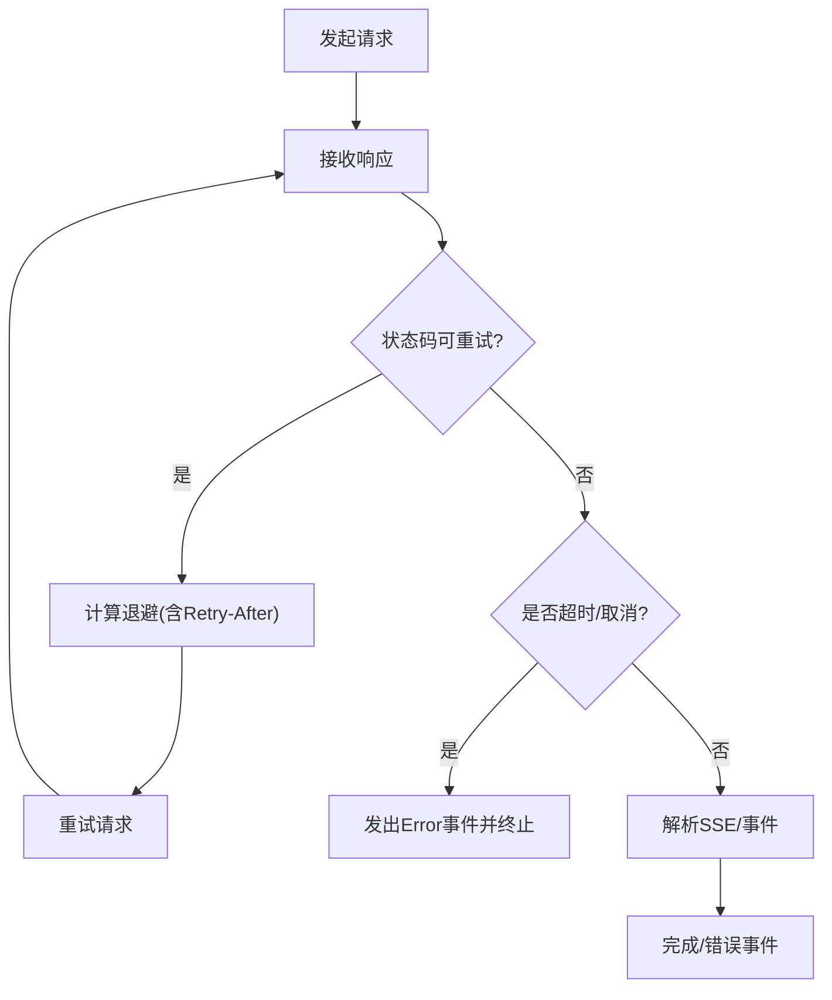
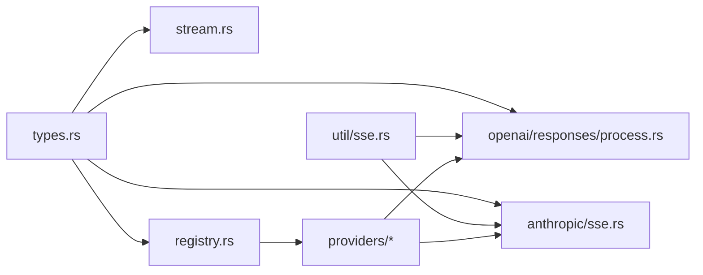

# 流式处理系统

<cite>
**本文引用的文件**
- [crates/pi-ai/src/stream.rs](file://crates/pi-ai/src/stream.rs)
- [crates/pi-ai/src/util/sse.rs](file://crates/pi-ai/src/util/sse.rs)
- [crates/pi-ai/examples/faux_stream.rs](file://crates/pi-ai/examples/faux_stream.rs)
- [crates/pi-ai/src/types.rs](file://crates/pi-ai/src/types.rs)
- [crates/pi-ai/src/registry.rs](file://crates/pi-ai/src/registry.rs)
- [crates/pi-ai/src/providers/mod.rs](file://crates/pi-ai/src/providers/mod.rs)
- [crates/pi-ai/src/providers/faux.rs](file://crates/pi-ai/src/providers/faux.rs)
- [crates/pi-ai/src/providers/openai/responses/process.rs](file://crates/pi-ai/src/providers/openai/responses/process.rs)
- [crates/pi-ai/src/providers/anthropic/sse.rs](file://crates/pi-ai/src/providers/anthropic/sse.rs)
- [crates/pi-ai/tests/fixtures/anthropic-thinking-tooluse.sse](file://crates/pi-ai/tests/fixtures/anthropic-thinking-tooluse.sse)
- [crates/pi-ai/src/lib.rs](file://crates/pi-ai/src/lib.rs)
- [crates/pi-ai/src/util/http.rs](file://crates/pi-ai/src/util/http.rs)
- [crates/pi-ai/src/util/diagnostics.rs](file://crates/pi-ai/src/util/diagnostics.rs)
</cite>

## 目录
1. [简介](#简介)
2. [项目结构](#项目结构)
3. [核心组件](#核心组件)
4. [架构总览](#架构总览)
5. [详细组件分析](#详细组件分析)
6. [依赖关系分析](#依赖关系分析)
7. [性能考量](#性能考量)
8. [故障排查指南](#故障排查指南)
9. [结论](#结论)
10. [附录](#附录)

## 简介
本文件面向流式处理系统，围绕 EventStream 的实现架构与事件驱动模型展开，系统性阐述 Server-Sent Events (SSE) 的解析、缓冲与传输机制，覆盖流式响应生命周期管理、背压处理与内存优化策略，并给出错误恢复、重连与超时处理方案。文档同时提供多格式流式数据（文本、思维过程、工具调用）的处理示例路径与最佳实践，以及订阅模式与回调机制的实现要点。

## 项目结构
本项目以“类型定义—流式接口—SSE解析—提供商适配—注册中心”的分层组织方式构建，核心位于 crates/pi-ai 子模块中，通过统一的事件模型与流式接口抽象，屏蔽不同大模型提供商的差异。

**图表来源**
- [crates/pi-ai/src/lib.rs:1-19](file://crates/pi-ai/src/lib.rs#L1-L19)
- [crates/pi-ai/src/types.rs:1-599](file://crates/pi-ai/src/types.rs#L1-L599)
- [crates/pi-ai/src/stream.rs:1-90](file://crates/pi-ai/src/stream.rs#L1-L90)
- [crates/pi-ai/src/util/sse.rs:1-167](file://crates/pi-ai/src/util/sse.rs#L1-L167)
- [crates/pi-ai/src/util/http.rs:1-47](file://crates/pi-ai/src/util/http.rs#L1-L47)
- [crates/pi-ai/src/util/diagnostics.rs:1-34](file://crates/pi-ai/src/util/diagnostics.rs#L1-L34)
- [crates/pi-ai/src/registry.rs:1-163](file://crates/pi-ai/src/registry.rs#L1-L163)
- [crates/pi-ai/src/providers/mod.rs:1-61](file://crates/pi-ai/src/providers/mod.rs#L1-L61)
- [crates/pi-ai/src/providers/faux.rs:1-191](file://crates/pi-ai/src/providers/faux.rs#L1-L191)
- [crates/pi-ai/src/providers/openai/responses/process.rs:1-253](file://crates/pi-ai/src/providers/openai/responses/process.rs#L1-L253)
- [crates/pi-ai/src/providers/anthropic/sse.rs:1-174](file://crates/pi-ai/src/providers/anthropic/sse.rs#L1-L174)
- [crates/pi-ai/examples/faux_stream.rs:1-82](file://crates/pi-ai/examples/faux_stream.rs#L1-L82)

**章节来源**
- [crates/pi-ai/src/lib.rs:1-19](file://crates/pi-ai/src/lib.rs#L1-L19)
- [crates/pi-ai/src/registry.rs:1-163](file://crates/pi-ai/src/registry.rs#L1-L163)
- [crates/pi-ai/src/providers/mod.rs:1-61](file://crates/pi-ai/src/providers/mod.rs#L1-L61)

## 核心组件
- 事件与消息模型：统一的 AssistantMessage 与 AssistantMessageEvent 抽象，支持文本、思维过程、工具调用等多模态增量更新，以及完成/错误事件。
- 流接口：EventStream 将异步事件流暴露为标准的 Stream<Item = AssistantMessageEvent>，并提供 complete 辅助函数等待 Done 或 Error 事件。
- SSE 解析：通用的 SSE 解析器将字节流切分为完整事件，支持跨块边界拼接、CRLF/LF 兼容、注释行忽略与空行分隔。
- 注册中心：ApiProvider 抽象与全局注册表，按模型 api 字段动态路由到具体提供商实现。
- 提供商适配：内置多家提供商的流式处理逻辑，统一输出 AssistantMessageEvent 流。

**章节来源**
- [crates/pi-ai/src/types.rs:164-242](file://crates/pi-ai/src/types.rs#L164-L242)
- [crates/pi-ai/src/stream.rs:1-18](file://crates/pi-ai/src/stream.rs#L1-L18)
- [crates/pi-ai/src/util/sse.rs:11-89](file://crates/pi-ai/src/util/sse.rs#L11-L89)
- [crates/pi-ai/src/registry.rs:9-55](file://crates/pi-ai/src/registry.rs#L9-L55)

## 架构总览
下图展示了从模型选择到事件流产出的端到端流程，强调事件驱动与解耦设计。

**图表来源**
- [crates/pi-ai/src/registry.rs:31-55](file://crates/pi-ai/src/registry.rs#L31-L55)
- [crates/pi-ai/src/util/sse.rs:57-89](file://crates/pi-ai/src/util/sse.rs#L57-L89)
- [crates/pi-ai/src/providers/openai/responses/process.rs:14-235](file://crates/pi-ai/src/providers/openai/responses/process.rs#L14-L235)

## 详细组件分析

### 事件驱动模型与生命周期
- 事件类型：Start、Text*/Thinking*/Toolcall* 各阶段增量事件、Done/Error 终止事件，确保消费者可逐步渲染与回放。
- 生命周期：Start → 增量事件 → 结束事件；complete 函数在遇到 Done/Error 时返回最终消息或错误。
- 订阅与回调：通过标准 Stream 消费者模式订阅事件；可结合 ProviderStreamHooks 在负载与响应阶段注入钩子。

**图表来源**
- [crates/pi-ai/src/types.rs:168-242](file://crates/pi-ai/src/types.rs#L168-L242)
- [crates/pi-ai/src/stream.rs:7-18](file://crates/pi-ai/src/stream.rs#L7-L18)

**章节来源**
- [crates/pi-ai/src/types.rs:164-242](file://crates/pi-ai/src/types.rs#L164-L242)
- [crates/pi-ai/src/stream.rs:1-18](file://crates/pi-ai/src/stream.rs#L1-L18)

### SSE 解析、缓冲与传输
- 跨块拼接：内部缓冲区维护不完整行，直至遇到换行符后拆分事件。
- 行尾兼容：支持 LF 与 CRLF；注释行以冒号开头被忽略；空行为事件分隔。
- 错误传播：读取错误与解析错误均转换为 Error 事件，便于上层统一处理。
- 迭代器：iterate_sse 将底层字节流转换为 ServerSentEvent 流，保证背压由上游控制。

**图表来源**
- [crates/pi-ai/src/util/sse.rs:13-54](file://crates/pi-ai/src/util/sse.rs#L13-L54)
- [crates/pi-ai/src/util/sse.rs:57-89](file://crates/pi-ai/src/util/sse.rs#L57-L89)

**章节来源**
- [crates/pi-ai/src/util/sse.rs:11-89](file://crates/pi-ai/src/util/sse.rs#L11-L89)

### 流式响应处理与多格式支持
- 文本增量：TextStart/TextDelta/TextEnd 三段式，逐步拼接字符串。
- 思维过程：ThinkingStart/ThinkingDelta/ThinkingEnd，支持签名与脱敏标记。
- 工具调用：ToolcallStart/Delta/End，增量拼接 JSON 参数并通过修复函数解析。
- OpenAI 示例：OpenAI 流处理将 SSE 事件映射为统一事件序列，并在结束时计算用量与停止原因。

**图表来源**
- [crates/pi-ai/src/providers/openai/responses/process.rs:14-235](file://crates/pi-ai/src/providers/openai/responses/process.rs#L14-L235)
- [crates/pi-ai/src/util/sse.rs:57-89](file://crates/pi-ai/src/util/sse.rs#L57-L89)

**章节来源**
- [crates/pi-ai/src/providers/openai/responses/process.rs:14-235](file://crates/pi-ai/src/providers/openai/responses/process.rs#L14-L235)

### 注册中心与提供商路由
- ApiProvider 抽象：统一 stream 接口，屏蔽提供商差异。
- 注册与查找：静态注册表按 api 名称存储 Arc<dyn ApiProvider>，stream_model 动态解析并注入环境密钥。
- 内置提供商：providers/mod.rs 中集中注册多家提供商，便于一次性初始化。

**图表来源**
- [crates/pi-ai/src/registry.rs:9-55](file://crates/pi-ai/src/registry.rs#L9-L55)
- [crates/pi-ai/src/providers/mod.rs:19-60](file://crates/pi-ai/src/providers/mod.rs#L19-L60)
- [crates/pi-ai/src/providers/faux.rs:92-191](file://crates/pi-ai/src/providers/faux.rs#L92-L191)

**章节来源**
- [crates/pi-ai/src/registry.rs:1-163](file://crates/pi-ai/src/registry.rs#L1-L163)
- [crates/pi-ai/src/providers/mod.rs:1-61](file://crates/pi-ai/src/providers/mod.rs#L1-L61)

### 背压处理与内存优化
- 背压策略：SSE 迭代器与事件处理器均为异步流，遵循 Rust 异步生态的背压原则；上层消费方应使用 .next().await 控制速率。
- 内存优化：增量事件仅持有必要片段；工具调用参数采用增量 JSON 累积并及时解析；结束时统一收尾，避免长期持有中间态。
- 取消令牌：OpenAI 处理器支持 CancellationToken，在取消时立即发出 Error 并终止。

**章节来源**
- [crates/pi-ai/src/providers/openai/responses/process.rs:14-235](file://crates/pi-ai/src/providers/openai/responses/process.rs#L14-L235)

### 错误恢复、重连与超时
- 可重试状态：HTTP 状态码 408/409/429/500-599 视为可重试。
- 重试延迟：基于 Retry-After 头部与最大延迟限制，防止过长退避。
- 超时与取消：StreamOptions 支持 timeout_ms 与 CancellationToken，结合 ProviderStreamHooks 实现外部中断。
- 诊断信息：util/diagnostics 提供统一的诊断结构，便于追踪错误来源。

**图表来源**
- [crates/pi-ai/src/util/http.rs:27-47](file://crates/pi-ai/src/util/http.rs#L27-L47)
- [crates/pi-ai/src/providers/openai/responses/process.rs:36-58](file://crates/pi-ai/src/providers/openai/responses/process.rs#L36-L58)
- [crates/pi-ai/src/util/diagnostics.rs:1-34](file://crates/pi-ai/src/util/diagnostics.rs#L1-L34)

**章节来源**
- [crates/pi-ai/src/util/http.rs:1-47](file://crates/pi-ai/src/util/http.rs#L1-L47)
- [crates/pi-ai/src/util/diagnostics.rs:1-34](file://crates/pi-ai/src/util/diagnostics.rs#L1-L34)

### 订阅模式与回调机制
- 订阅模式：通过 futures::StreamExt 的 next()/collect() 等方法进行消费；示例程序展示如何按事件类型打印不同内容。
- 回调钩子：ProviderStreamHooks 支持 on_payload/on_response 钩子，可在发送前修改负载或在收到响应后执行副作用。
- 会话与协议：编码代理协议中包含对 AssistantMessageEvent 的桥接，便于在更高层协议中复用事件语义。

**章节来源**
- [crates/pi-ai/examples/faux_stream.rs:55-79](file://crates/pi-ai/examples/faux_stream.rs#L55-L79)
- [crates/pi-ai/src/types.rs:327-360](file://crates/pi-ai/src/types.rs#L327-L360)

## 依赖关系分析
- 类型层：types.rs 为所有事件与消息的核心定义，被 stream.rs、registry.rs、各提供商实现广泛依赖。
- 流接口层：stream.rs 依赖 types.rs 的事件模型；complete 函数用于阻塞式等待完成。
- SSE 层：util/sse.rs 为通用解析器，被 OpenAI 与 Anthropic 等提供商复用。
- 注册层：registry.rs 依赖 types.rs 与 util/env_keys，负责路由与环境变量注入。
- 提供商层：各提供商实现 ApiProvider，统一输出 EventStream。

**图表来源**
- [crates/pi-ai/src/types.rs:1-599](file://crates/pi-ai/src/types.rs#L1-L599)
- [crates/pi-ai/src/stream.rs:1-90](file://crates/pi-ai/src/stream.rs#L1-L90)
- [crates/pi-ai/src/util/sse.rs:1-167](file://crates/pi-ai/src/util/sse.rs#L1-L167)
- [crates/pi-ai/src/registry.rs:1-163](file://crates/pi-ai/src/registry.rs#L1-L163)
- [crates/pi-ai/src/providers/openai/responses/process.rs:1-253](file://crates/pi-ai/src/providers/openai/responses/process.rs#L1-L253)
- [crates/pi-ai/src/providers/anthropic/sse.rs:1-174](file://crates/pi-ai/src/providers/anthropic/sse.rs#L1-L174)

**章节来源**
- [crates/pi-ai/src/lib.rs:1-19](file://crates/pi-ai/src/lib.rs#L1-L19)

## 性能考量
- 异步非阻塞：全链路基于 futures::Stream 与异步运行时，避免阻塞 IO。
- 增量聚合：文本与工具调用参数采用增量拼接与修复，减少一次性解析成本。
- 资源释放：结束事件后及时清理中间状态，避免内存泄漏。
- 超时与取消：合理设置超时与取消令牌，防止长时间占用资源。
- 监控指标：建议在 ProviderStreamHooks 中埋点请求耗时、事件数量、错误率等指标。

## 故障排查指南
- SSE 解析失败：检查数据是否包含合法的 event/data 行，确认换行符格式；查看 Error 事件中的错误信息。
- 未知提供商：stream_model 对未知 api 返回 Error 事件，检查模型 api 字段与注册表。
- 可重试错误：根据状态码与 Retry-After 头调整重试策略，避免超过最大延迟。
- 取消与超时：确认 CancellationToken 是否正确传递，以及 StreamOptions 的 timeout_ms 设置。

**章节来源**
- [crates/pi-ai/src/registry.rs:31-55](file://crates/pi-ai/src/registry.rs#L31-L55)
- [crates/pi-ai/src/util/http.rs:27-47](file://crates/pi-ai/src/util/http.rs#L27-L47)
- [crates/pi-ai/src/providers/openai/responses/process.rs:36-74](file://crates/pi-ai/src/providers/openai/responses/process.rs#L36-L74)

## 结论
该流式处理系统以统一的事件模型与流式接口为核心，通过 SSE 解析器与注册中心实现对多家提供商的无缝集成。其事件驱动架构支持文本、思维过程与工具调用的多格式增量渲染，配合完善的错误处理、重试与取消机制，满足生产级的稳定性与可观测性需求。建议在实际部署中结合 ProviderStreamHooks 进行性能埋点与告警联动，持续优化背压与内存占用。

## 附录
- 示例：使用示例程序演示如何订阅与打印不同类型的增量事件。
- 数据样例：Anthropic 思维与工具调用的 SSE fixture 文件可用于测试与验证解析逻辑。

**章节来源**
- [crates/pi-ai/examples/faux_stream.rs:1-82](file://crates/pi-ai/examples/faux_stream.rs#L1-L82)
- [crates/pi-ai/tests/fixtures/anthropic-thinking-tooluse.sse:1-44](file://crates/pi-ai/tests/fixtures/anthropic-thinking-tooluse.sse#L1-L44)