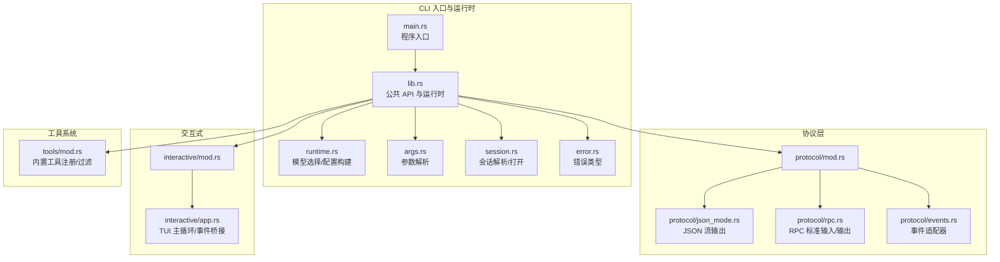
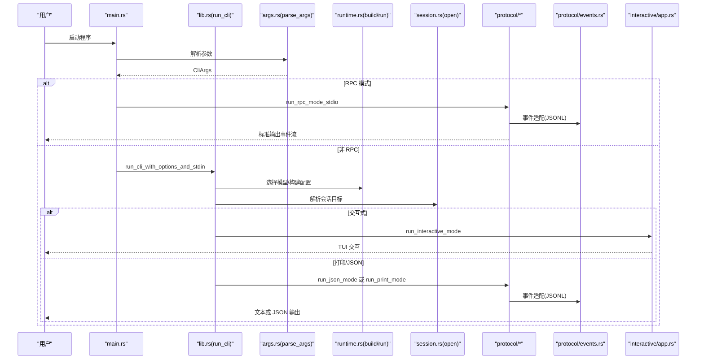
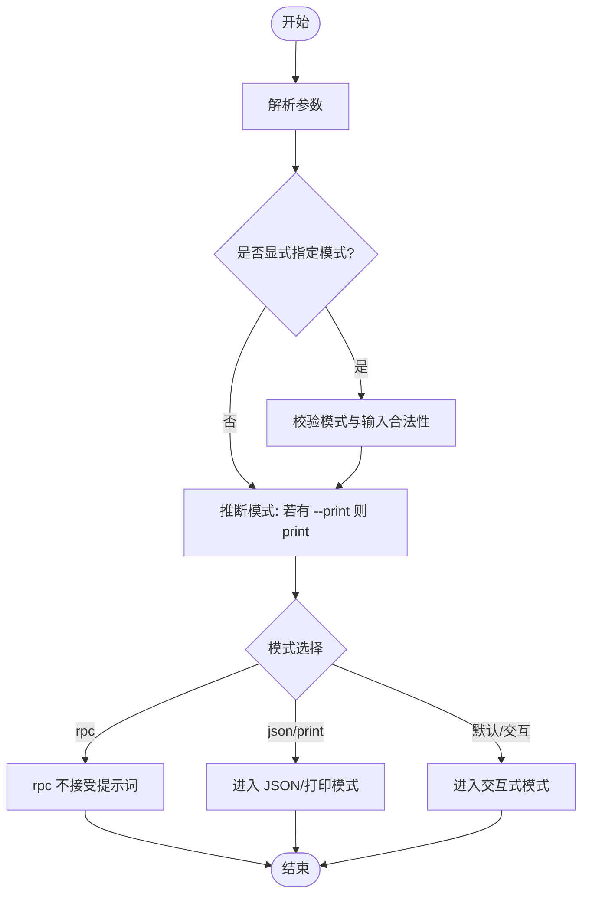
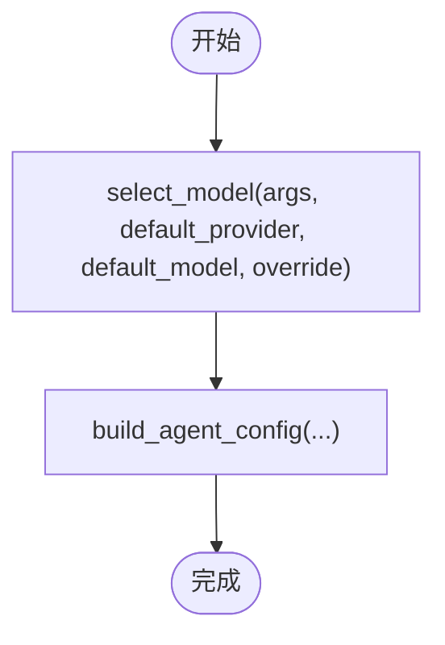
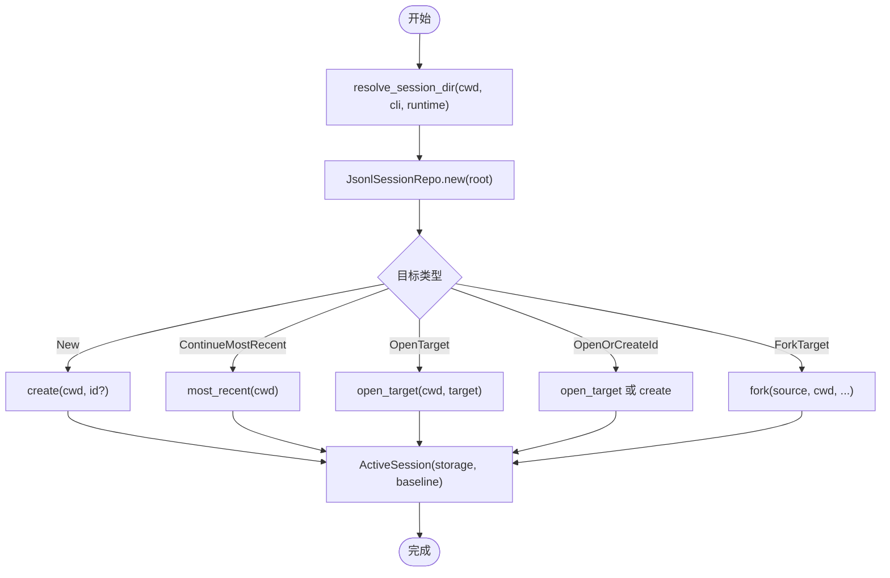
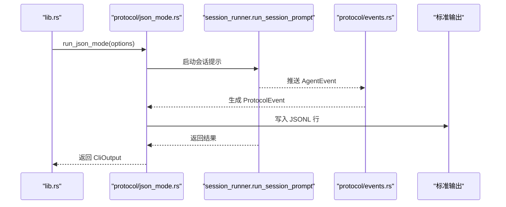
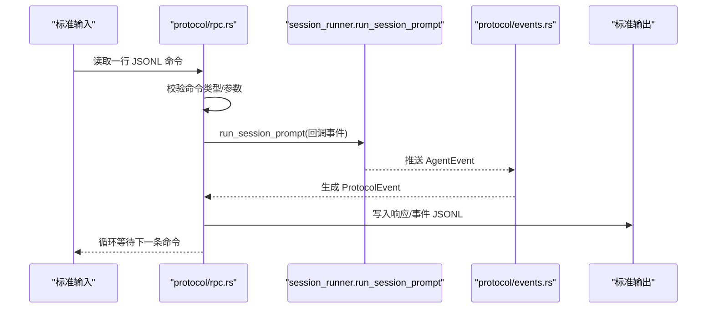
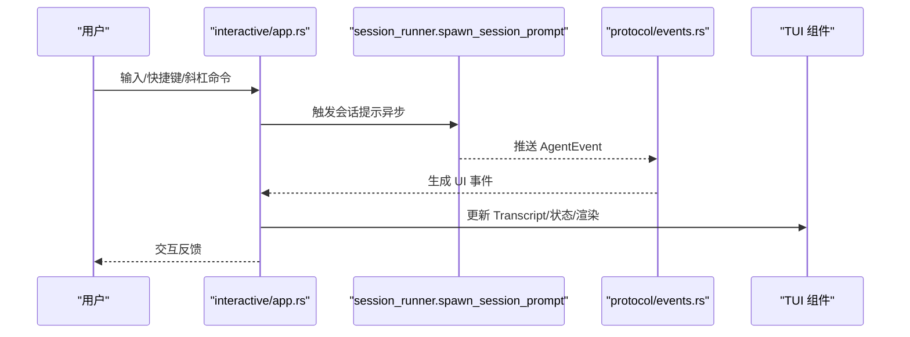
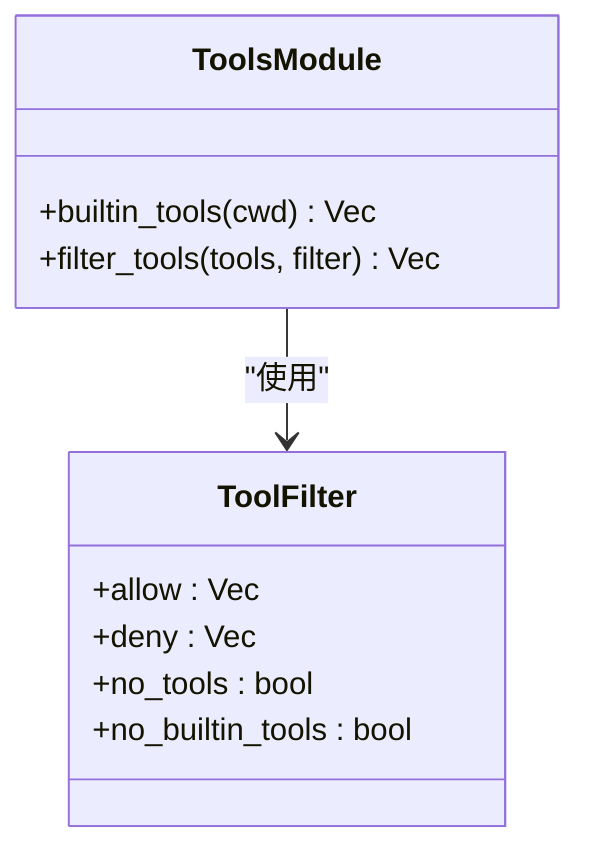
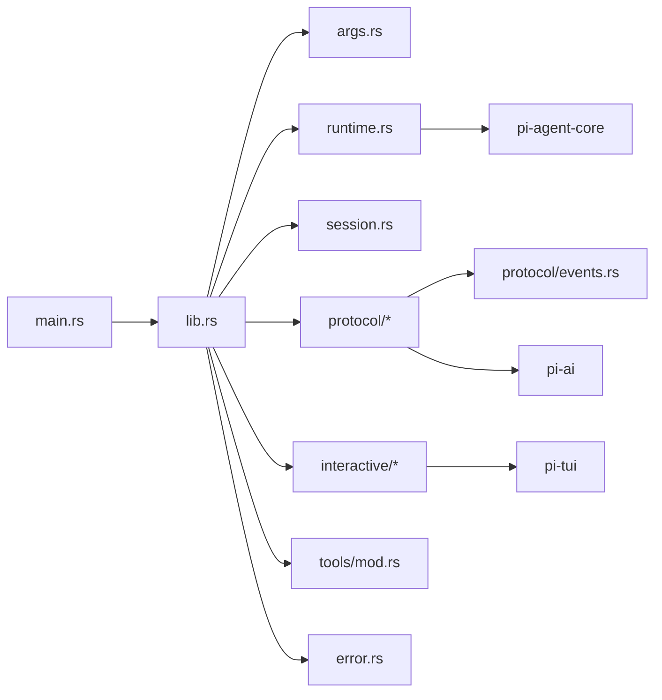

# CLI 架构

<cite>
**本文引用的文件**
- [main.rs](file://crates/pi-coding-agent/src/main.rs)
- [lib.rs](file://crates/pi-coding-agent/src/lib.rs)
- [args.rs](file://crates/pi-coding-agent/src/args.rs)
- [runtime.rs](file://crates/pi-coding-agent/src/runtime.rs)
- [session.rs](file://crates/pi-coding-agent/src/session.rs)
- [protocol/mod.rs](file://crates/pi-coding-agent/src/protocol/mod.rs)
- [protocol/rpc.rs](file://crates/pi-coding-agent/src/protocol/rpc.rs)
- [protocol/json_mode.rs](file://crates/pi-coding-agent/src/protocol/json_mode.rs)
- [protocol/events.rs](file://crates/pi-coding-agent/src/protocol/events.rs)
- [interactive/mod.rs](file://crates/pi-coding-agent/src/interactive/mod.rs)
- [interactive/app.rs](file://crates/pi-coding-agent/src/interactive/app.rs)
- [print_mode.rs](file://crates/pi-coding-agent/src/print_mode.rs)
- [tools/mod.rs](file://crates/pi-coding-agent/src/tools/mod.rs)
- [error.rs](file://crates/pi-coding-agent/src/error.rs)
- [Cargo.toml](file://crates/pi-coding-agent/Cargo.toml)
</cite>

## 目录
1. [简介](#简介)
2. [项目结构](#项目结构)
3. [核心组件](#核心组件)
4. [架构总览](#架构总览)
5. [详细组件分析](#详细组件分析)
6. [依赖分析](#依赖分析)
7. [性能考虑](#性能考虑)
8. [故障排查指南](#故障排查指南)
9. [结论](#结论)
10. [附录](#附录)

## 简介
本文件面向 pi-coding-agent 的命令行界面（CLI）架构，系统化阐述其命令行入口、参数解析、模式切换、交互式体验、协议支持（JSON 模式、RPC 协议）、事件流适配、工具系统抽象与扩展机制，并给出 CLI 与核心引擎的交互关系图示。文档同时覆盖错误处理、用户体验、性能优化与可扩展性设计考量。

## 项目结构
pi-coding-agent 的 CLI 位于 crates/pi-coding-agent，采用模块化组织：
- 入口与运行时：main.rs、lib.rs、runtime.rs
- 参数解析与帮助：args.rs
- 会话与持久化：session.rs
- 协议层：protocol/mod.rs 及子模块（json_mode.rs、rpc.rs、events.rs）
- 交互式模式：interactive/mod.rs、interactive/app.rs
- 打印模式：print_mode.rs
- 内置工具系统：tools/mod.rs
- 错误类型：error.rs
- 依赖声明：Cargo.toml

**图表来源**
- [main.rs:1-60](file://crates/pi-coding-agent/src/main.rs#L1-L60)
- [lib.rs:1-352](file://crates/pi-coding-agent/src/lib.rs#L1-L352)
- [args.rs:1-343](file://crates/pi-coding-agent/src/args.rs#L1-L343)
- [runtime.rs:1-217](file://crates/pi-coding-agent/src/runtime.rs#L1-L217)
- [session.rs:1-204](file://crates/pi-coding-agent/src/session.rs#L1-L204)
- [protocol/mod.rs:1-7](file://crates/pi-coding-agent/src/protocol/mod.rs#L1-L7)
- [protocol/json_mode.rs:1-75](file://crates/pi-coding-agent/src/protocol/json_mode.rs#L1-L75)
- [protocol/rpc.rs:1-579](file://crates/pi-coding-agent/src/protocol/rpc.rs#L1-L579)
- [protocol/events.rs:1-310](file://crates/pi-coding-agent/src/protocol/events.rs#L1-L310)
- [interactive/mod.rs:1-11](file://crates/pi-coding-agent/src/interactive/mod.rs#L1-L11)
- [interactive/app.rs:1-800](file://crates/pi-coding-agent/src/interactive/app.rs#L1-L800)
- [tools/mod.rs:1-51](file://crates/pi-coding-agent/src/tools/mod.rs#L1-L51)
- [error.rs:1-24](file://crates/pi-coding-agent/src/error.rs#L1-L24)

**章节来源**
- [main.rs:1-60](file://crates/pi-coding-agent/src/main.rs#L1-L60)
- [lib.rs:1-352](file://crates/pi-coding-agent/src/lib.rs#L1-L352)
- [Cargo.toml:1-27](file://crates/pi-coding-agent/Cargo.toml#L1-L27)

## 核心组件
- 命令行入口与模式分发
  - 入口在 main.rs，优先尝试解析参数并进入 RPC 模式；否则根据 stdin 是否为终端决定是否进入交互式模式，否则走打印/JSON 模式。
- 参数解析与帮助
  - args.rs 定义 CliArgs 结构体与 CliMode 枚举，提供 parse_args 与 help_text，涵盖模式、会话、工具、资源加载、思维层级、工具执行模式等选项。
- 运行时与配置
  - runtime.rs 提供 CliRunOptions、SessionRunOptions、模型选择策略、AgentConfig 构建、PromptInvocation 抽象。
- 会话管理
  - session.rs 负责会话目录解析、目标解析（新建/继续/打开/分叉）、消息存储与上下文构建。
- 协议与事件
  - protocol/json_mode.rs 输出 JSONL 事件流；protocol/rpc.rs 实现基于标准 IO 的 RPC 协议；protocol/events.rs 将 AgentEvent 适配为统一的 ProtocolEvent。
- 交互式模式
  - interactive/app.rs 提供 TUI 主循环、事件桥接、剪贴板、导出导入、会话树导航等能力。
- 工具系统
  - tools/mod.rs 注册内置工具集并支持允许/排除/禁用策略。

**章节来源**
- [main.rs:1-60](file://crates/pi-coding-agent/src/main.rs#L1-L60)
- [args.rs:1-343](file://crates/pi-coding-agent/src/args.rs#L1-L343)
- [runtime.rs:1-217](file://crates/pi-coding-agent/src/runtime.rs#L1-L217)
- [session.rs:1-204](file://crates/pi-coding-agent/src/session.rs#L1-L204)
- [protocol/json_mode.rs:1-75](file://crates/pi-coding-agent/src/protocol/json_mode.rs#L1-L75)
- [protocol/rpc.rs:1-579](file://crates/pi-coding-agent/src/protocol/rpc.rs#L1-L579)
- [protocol/events.rs:1-310](file://crates/pi-coding-agent/src/protocol/events.rs#L1-L310)
- [interactive/app.rs:1-800](file://crates/pi-coding-agent/src/interactive/app.rs#L1-L800)
- [tools/mod.rs:1-51](file://crates/pi-coding-agent/src/tools/mod.rs#L1-L51)

## 架构总览
CLI 架构围绕“参数解析 → 运行时装配 → 模式分发 → 引擎执行 → 事件适配/输出”的主干流程展开。RPC 模式通过标准 IO 读取命令 JSONL 并写入事件 JSONL；JSON 模式直接输出会话头与事件流；交互式模式以 TUI 驱动用户输入与事件渲染。

**图表来源**
- [main.rs:1-60](file://crates/pi-coding-agent/src/main.rs#L1-L60)
- [lib.rs:83-334](file://crates/pi-coding-agent/src/lib.rs#L83-L334)
- [args.rs:153-333](file://crates/pi-coding-agent/src/args.rs#L153-L333)
- [runtime.rs:62-188](file://crates/pi-coding-agent/src/runtime.rs#L62-L188)
- [session.rs:89-138](file://crates/pi-coding-agent/src/session.rs#L89-L138)
- [protocol/json_mode.rs:8-74](file://crates/pi-coding-agent/src/protocol/json_mode.rs#L8-L74)
- [protocol/rpc.rs:100-104](file://crates/pi-coding-agent/src/protocol/rpc.rs#L100-L104)
- [protocol/events.rs:38-245](file://crates/pi-coding-agent/src/protocol/events.rs#L38-L245)
- [interactive/app.rs:52-74](file://crates/pi-coding-agent/src/interactive/app.rs#L52-L74)

## 详细组件分析

### 参数解析与模式切换
- 支持模式：print、json、rpc；默认 print。
- 互斥与约束：
  - --print 仅能与 --mode print 组合；
  - rpc 不接受位置提示词；
  - 会话目标互斥（continue/resume/session/session-id/fork 多选即错）；
  - --no-session 与会话目标/命名冲突；
  - --no-tools 与 --tools/--exclude-tools 冲突；
  - --json 仅能在 --list-models 使用。
- 帮助文本包含所有可用选项与简要说明。

**图表来源**
- [args.rs:153-333](file://crates/pi-coding-agent/src/args.rs#L153-L333)

**章节来源**
- [args.rs:1-343](file://crates/pi-coding-agent/src/args.rs#L1-L343)

### 运行时装配与配置构建
- 模型选择策略：
  - 优先级：--models 模糊匹配 → --model 指定 → 默认配置/覆盖 → 默认模型 → 首个提供商模型 → 回退默认。
- AgentConfig 构建：
  - 设置 system_prompt、max_turns、stream_options（含重试）、thinking_level、tool_execution、resources、可选压缩设置。
- PromptInvocation：
  - 支持纯文本、富内容（含图片）、技能调用、模板调用。

**图表来源**
- [runtime.rs:62-188](file://crates/pi-coding-agent/src/runtime.rs#L62-L188)

**章节来源**
- [runtime.rs:1-217](file://crates/pi-coding-agent/src/runtime.rs#L1-L217)

### 会话系统与持久化
- 会话目录解析顺序：CLI 指定 → 运行时配置 → 环境变量 → 默认路径。
- 支持目标：
  - 新建、继续最近、按路径/ID 打开、按 ID 创建或打开、分叉。
- 存储采用 JSONL，消息转换为 StoredAgentMessage 并追加到会话。

**图表来源**
- [session.rs:29-138](file://crates/pi-coding-agent/src/session.rs#L29-L138)

**章节来源**
- [session.rs:1-204](file://crates/pi-coding-agent/src/session.rs#L1-L204)

### JSON 模式与事件流
- JSON 模式输出：
  - 会话头 JSONL 行；
  - AgentStart 事件；
  - 逐条事件 JSONL 行（由事件适配器生成）。
- 事件适配器：
  - 将 AgentEvent 映射为统一的 ProtocolEvent，包含 TurnStart/TurnEnd、MessageStart/Update/End、ToolExecution*、AgentEnd、Compaction* 等。

**图表来源**
- [protocol/json_mode.rs:8-74](file://crates/pi-coding-agent/src/protocol/json_mode.rs#L8-L74)
- [protocol/events.rs:38-245](file://crates/pi-coding-agent/src/protocol/events.rs#L38-L245)

**章节来源**
- [protocol/json_mode.rs:1-75](file://crates/pi-coding-agent/src/protocol/json_mode.rs#L1-L75)
- [protocol/events.rs:1-310](file://crates/pi-coding-agent/src/protocol/events.rs#L1-L310)

### RPC 协议与标准 IO
- 输入：标准输入逐行读取 JSONL 命令；
- 输出：标准输出逐行写出 JSONL 响应/事件；
- 支持命令：
  - prompt、steer、follow_up、abort、new_session、get_state、set_*、get_*、set_session_name、get_messages 等；
- 限制：
  - 图像输入在当前实现不支持；
  - 手动压缩不可用；
  - 正在流式中时需要设置 streamingBehavior 才能将 prompt 进入队列。

**图表来源**
- [protocol/rpc.rs:39-98](file://crates/pi-coding-agent/src/protocol/rpc.rs#L39-L98)
- [protocol/rpc.rs:170-340](file://crates/pi-coding-agent/src/protocol/rpc.rs#L170-L340)
- [protocol/events.rs:38-245](file://crates/pi-coding-agent/src/protocol/events.rs#L38-L245)

**章节来源**
- [protocol/rpc.rs:1-579](file://crates/pi-coding-agent/src/protocol/rpc.rs#L1-L579)

### 交互式模式与 TUI
- 交互式入口：
  - 仅在 stdin/stdout 为 TTY 时启用；
  - 启动 ProcessTerminal 与输入泵（线程读取 stdin 字节流）。
- 功能要点：
  - 编辑器组件、快捷键绑定、剪贴板复制、会话导出/导入、模型/会话选择、使用量统计、工具输出折叠/展开、滚动控制、斜杠命令（/help、/settings、/model、/export、/import、/copy、/name、/session、/hotkeys、/fork、/clone、/tree、/login、/logout、/new、/compact、/resume、/reload、/quit）。
- 事件桥接：
  - 将 AgentEvent 转换为 UI 事件，驱动 Transcript 渲染与状态更新。

**图表来源**
- [interactive/app.rs:52-74](file://crates/pi-coding-agent/src/interactive/app.rs#L52-L74)
- [interactive/app.rs:758-790](file://crates/pi-coding-agent/src/interactive/app.rs#L758-L790)
- [protocol/events.rs:38-245](file://crates/pi-coding-agent/src/protocol/events.rs#L38-L245)

**章节来源**
- [interactive/app.rs:1-800](file://crates/pi-coding-agent/src/interactive/app.rs#L1-L800)
- [interactive/mod.rs:1-11](file://crates/pi-coding-agent/src/interactive/mod.rs#L1-L11)

### 工具系统抽象与扩展
- 内置工具集：
  - read、write、edit、bash、grep、find、ls；
  - 通过 builtin_tools(cwd) 注册。
- 工具过滤策略：
  - 允许列表、排除列表、禁用工具、禁用内置工具；
  - 通过 filter_tools 应用集合运算。
- 扩展机制：
  - 任何 AgentTool 可注入到 CliRunOptions.tools 中，遵循统一接口即可被引擎调度。

**图表来源**
- [tools/mod.rs:17-51](file://crates/pi-coding-agent/src/tools/mod.rs#L17-L51)

**章节来源**
- [tools/mod.rs:1-51](file://crates/pi-coding-agent/src/tools/mod.rs#L1-L51)

### 错误处理机制
- 错误类型覆盖：
  - 缺少值、未知标志、不支持模式、缺少提示词、未知模型、最大轮次非法、无效输入、代理失败、会话相关错误等。
- 处理策略：
  - 参数解析阶段即时返回错误；
  - 运行时遇到配置/认证/会话问题抛出对应错误；
  - CLI 层将错误映射为 CliOutput，stderr 输出错误文本，exit_code 非零。

**章节来源**
- [error.rs:1-24](file://crates/pi-coding-agent/src/error.rs#L1-L24)
- [lib.rs:46-62](file://crates/pi-coding-agent/src/lib.rs#L46-L62)

## 依赖分析
- 外部依赖（部分）：tokio（异步运行时与 IO）、pi-agent-core（引擎核心）、pi-ai（模型与流式）、pi-tui（TUI 组件库）、serde/serde_json（序列化）、dirs、regex、ignore、globset、image、futures、thiserror、toml、unicode-normalization 等。
- 模块间耦合：
  - lib.rs 作为门面，向上暴露 run_cli，向下依赖 args、runtime、session、protocol、interactive、tools、error。
  - protocol/* 与 engine 通过 session_runner 对接，事件经 protocol/events.rs 适配。
  - interactive/app.rs 依赖 TUI、Keybindings、Editor、Transcript 等组件。

**图表来源**
- [Cargo.toml:6-22](file://crates/pi-coding-agent/Cargo.toml#L6-L22)
- [lib.rs:1-24](file://crates/pi-coding-agent/src/lib.rs#L1-L24)

**章节来源**
- [Cargo.toml:1-27](file://crates/pi-coding-agent/Cargo.toml#L1-L27)
- [lib.rs:1-24](file://crates/pi-coding-agent/src/lib.rs#L1-L24)

## 性能考虑
- 异步与并发
  - tokio 多线程运行时与多特性（fs/process/time/io-util/io-std/sync）用于高并发 IO 与任务调度。
- 流式输出
  - JSON/RPC 模式逐事件写入，避免大缓冲累积。
- 事件适配
  - 事件适配器按需生成最小必要事件，减少冗余序列化。
- 会话压缩
  - 可选自动压缩配置，降低上下文长度与成本。
- 交互式渲染
  - 帧率与渲染间隔常量控制刷新频率，避免过度绘制。

[本节为通用指导，无需特定文件引用]

## 故障排查指南
- 无法进入交互式模式
  - 症状：提示需要 TTY。
  - 排查：确认 stdin/stdout 为终端；非 TTY 下 CLI 自动回退到非交互模式。
- RPC 模式报错
  - 症状：命令解析失败、不支持命令、图像输入不支持、正在流式中未设置 streamingBehavior。
  - 排查：检查命令 JSONL 结构与字段；确保只发送受支持命令；在流式中使用 steer/followUp。
- 模型选择失败
  - 症状：未知模型。
  - 排查：检查 --model/--models/--provider 组合；确认默认配置；尝试列出可用模型。
- 会话相关错误
  - 症状：无历史可继续、打开失败、分叉失败。
  - 排查：检查会话目录与权限；确认目标路径/ID 存在且可访问。
- 工具执行异常
  - 症状：工具不可用或被拒绝。
  - 排查：检查 --no-tools/--tools/--exclude-tools/--no-builtin-tools 组合；确认工具名称正确。

**章节来源**
- [interactive/app.rs:52-74](file://crates/pi-coding-agent/src/interactive/app.rs#L52-L74)
- [protocol/rpc.rs:56-98](file://crates/pi-coding-agent/src/protocol/rpc.rs#L56-L98)
- [runtime.rs:62-131](file://crates/pi-coding-agent/src/runtime.rs#L62-L131)
- [session.rs:89-138](file://crates/pi-coding-agent/src/session.rs#L89-L138)
- [tools/mod.rs:37-50](file://crates/pi-coding-agent/src/tools/mod.rs#L37-L50)

## 结论
pi-coding-agent 的 CLI 架构以清晰的模块边界与职责分离实现了从参数解析到引擎执行再到事件输出的完整链路。交互式模式提供丰富的 TUI 体验，JSON/RPC 模式满足自动化与集成场景。工具系统通过统一抽象与过滤策略实现灵活扩展。整体设计兼顾用户体验、性能与可扩展性，为后续演进（如更多斜杠命令、主题与资源体系增强）提供了良好基础。

## 附录
- CLI 入口与模式分发流程参考：[main.rs:1-60](file://crates/pi-coding-agent/src/main.rs#L1-L60)
- 运行时装配与配置构建参考：[runtime.rs:62-188](file://crates/pi-coding-agent/src/runtime.rs#L62-L188)
- 会话系统参考：[session.rs:29-138](file://crates/pi-coding-agent/src/session.rs#L29-L138)
- JSON 模式参考：[protocol/json_mode.rs:8-74](file://crates/pi-coding-agent/src/protocol/json_mode.rs#L8-L74)
- RPC 协议参考：[protocol/rpc.rs:39-98](file://crates/pi-coding-agent/src/protocol/rpc.rs#L39-L98)
- 事件适配器参考：[protocol/events.rs:38-245](file://crates/pi-coding-agent/src/protocol/events.rs#L38-L245)
- 交互式模式参考：[interactive/app.rs:52-74](file://crates/pi-coding-agent/src/interactive/app.rs#L52-L74)
- 工具系统参考：[tools/mod.rs:17-51](file://crates/pi-coding-agent/src/tools/mod.rs#L17-L51)
- 错误类型参考：[error.rs:1-24](file://crates/pi-coding-agent/src/error.rs#L1-L24)