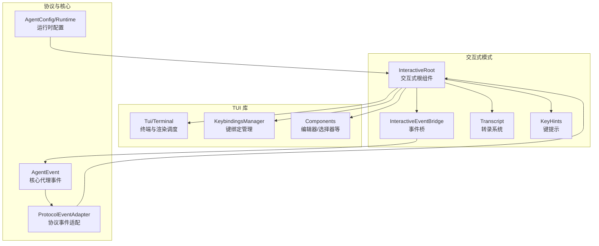
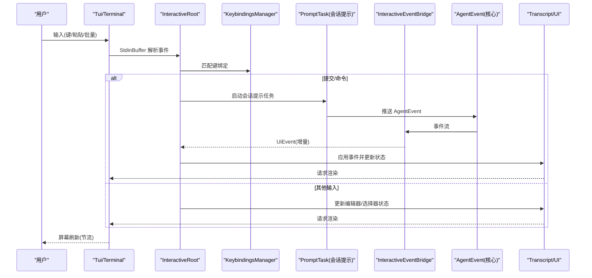
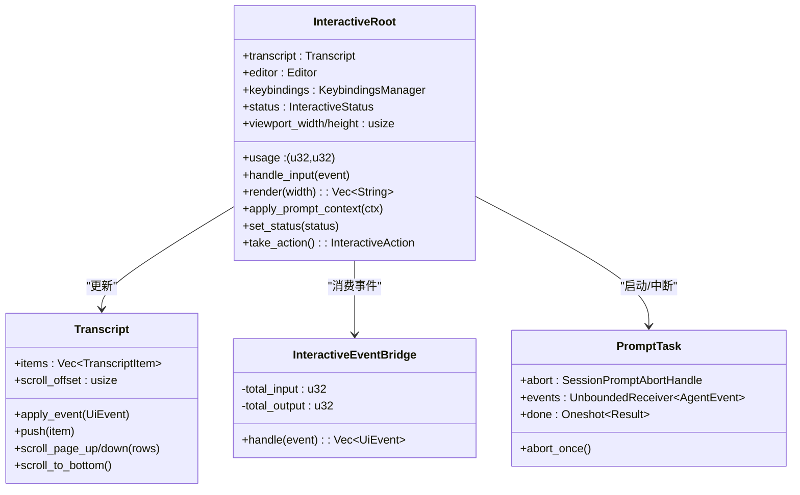
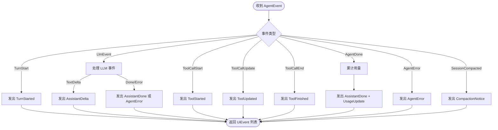
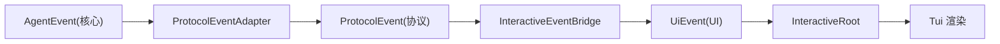
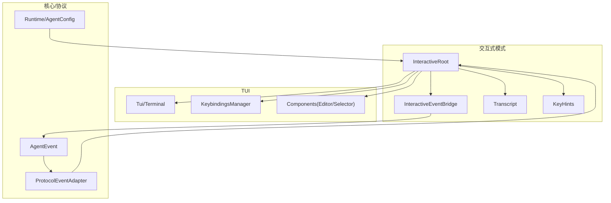

# 交互式模式

<cite>
**本文引用的文件**
- [crates/pi-coding-agent/src/interactive/mod.rs](file://crates/pi-coding-agent/src/interactive/mod.rs)
- [crates/pi-coding-agent/src/interactive/app.rs](file://crates/pi-coding-agent/src/interactive/app.rs)
- [crates/pi-coding-agent/src/interactive/event_bridge.rs](file://crates/pi-coding-agent/src/interactive/event_bridge.rs)
- [crates/pi-coding-agent/src/interactive/transcript.rs](file://crates/pi-coding-agent/src/interactive/transcript.rs)
- [crates/pi-coding-agent/src/interactive/key_hints.rs](file://crates/pi-coding-agent/src/interactive/key_hints.rs)
- [crates/pi-tui/src/lib.rs](file://crates/pi-tui/src/lib.rs)
- [crates/pi-tui/src/input/keybindings.rs](file://crates/pi-tui/src/input/keybindings.rs)
- [crates/pi-agent-core/src/lib.rs](file://crates/pi-agent-core/src/lib.rs)
- [crates/pi-coding-agent/src/protocol/events.rs](file://crates/pi-coding-agent/src/protocol/events.rs)
- [crates/pi-coding-agent/src/protocol/types.rs](file://crates/pi-coding-agent/src/protocol/types.rs)
- [crates/pi-coding-agent/src/runtime.rs](file://crates/pi-coding-agent/src/runtime.rs)
- [crates/pi-coding-agent/src/main.rs](file://crates/pi-coding-agent/src/main.rs)
</cite>

## 目录
1. [简介](#简介)
2. [项目结构](#项目结构)
3. [核心组件](#核心组件)
4. [架构总览](#架构总览)
5. [详细组件分析](#详细组件分析)
6. [依赖关系分析](#依赖关系分析)
7. [性能考量](#性能考量)
8. [故障排查指南](#故障排查指南)
9. [结论](#结论)
10. [附录](#附录)

## 简介
本文件面向交互式 TUI 模式的架构与实现，聚焦以下目标：
- 解释交互式 TUI 的设计与实现原理
- 描述应用状态管理、事件桥接机制与转录系统的工作流程
- 阐明用户输入处理、实时响应与会话管理的架构设计
- 说明事件驱动的 UI 更新机制、键盘绑定系统与异步事件处理
- 记录与核心代理引擎的集成方式与数据流向
- 提供用户体验设计原则与性能优化策略

## 项目结构
交互式模式位于编码代理子项目中，围绕“交互式根组件 + 事件桥 + 转录系统 + TUI 组件库”的分层组织展开；同时通过协议适配器与核心代理引擎进行事件互通。

图表来源
- [crates/pi-coding-agent/src/interactive/app.rs](file://crates/pi-coding-agent/src/interactive/app.rs)
- [crates/pi-coding-agent/src/interactive/event_bridge.rs](file://crates/pi-coding-agent/src/interactive/event_bridge.rs)
- [crates/pi-coding-agent/src/interactive/transcript.rs](file://crates/pi-coding-agent/src/interactive/transcript.rs)
- [crates/pi-coding-agent/src/interactive/key_hints.rs](file://crates/pi-coding-agent/src/interactive/key_hints.rs)
- [crates/pi-tui/src/lib.rs](file://crates/pi-tui/src/lib.rs)
- [crates/pi-tui/src/input/keybindings.rs](file://crates/pi-tui/src/input/keybindings.rs)
- [crates/pi-coding-agent/src/protocol/events.rs](file://crates/pi-coding-agent/src/protocol/events.rs)
- [crates/pi-agent-core/src/lib.rs](file://crates/pi-agent-core/src/lib.rs)
- [crates/pi-coding-agent/src/runtime.rs](file://crates/pi-coding-agent/src/runtime.rs)

章节来源
- [crates/pi-coding-agent/src/interactive/mod.rs](file://crates/pi-coding-agent/src/interactive/mod.rs)
- [crates/pi-coding-agent/src/interactive/app.rs](file://crates/pi-coding-agent/src/interactive/app.rs)
- [crates/pi-tui/src/lib.rs](file://crates/pi-tui/src/lib.rs)

## 核心组件
- 交互式根组件（InteractiveRoot）：承载 UI 状态、事件处理、渲染调度与会话管理入口。
- 事件桥（InteractiveEventBridge）：将核心代理事件转换为 UI 可消费的 UiEvent，并维护用量统计。
- 转录系统（Transcript/TranscriptItem）：记录对话历史、工具调用结果与系统消息，支持滚动与新输出标记。
- 键提示（KeyHints）：格式化键位提示文本，结合键绑定管理器生成可读的快捷键信息。
- TUI 组件与键绑定：提供编辑器、选择器、渲染调度器与键绑定解析能力。
- 协议适配器（ProtocolEventAdapter）：将 AgentEvent 映射为协议事件，用于会话持久化与外部协议。
- 运行时与配置（Runtime/AgentConfig）：模型选择、工具注册、会话模式与流式选项配置。

章节来源
- [crates/pi-coding-agent/src/interactive/app.rs](file://crates/pi-coding-agent/src/interactive/app.rs)
- [crates/pi-coding-agent/src/interactive/event_bridge.rs](file://crates/pi-coding-agent/src/interactive/event_bridge.rs)
- [crates/pi-coding-agent/src/interactive/transcript.rs](file://crates/pi-coding-agent/src/interactive/transcript.rs)
- [crates/pi-coding-agent/src/interactive/key_hints.rs](file://crates/pi-coding-agent/src/interactive/key_hints.rs)
- [crates/pi-tui/src/input/keybindings.rs](file://crates/pi-tui/src/input/keybindings.rs)
- [crates/pi-coding-agent/src/protocol/events.rs](file://crates/pi-coding-agent/src/protocol/events.rs)
- [crates/pi-coding-agent/src/runtime.rs](file://crates/pi-coding-agent/src/runtime.rs)

## 架构总览
交互式模式采用“事件驱动 + 异步并发”的循环架构：
- 输入路径：标准输入经缓冲与解析后进入键绑定匹配，派发到交互式根组件。
- 代理路径：提交触发会话提示任务，异步接收核心代理事件，通过事件桥转换为 UI 事件，更新转录与状态。
- 渲染路径：渲染调度器按帧率节流，合并多次请求，驱动 TUI 重绘。
- 退出路径：Ctrl+C 在运行态中断任务，在空闲态退出或清空编辑器。

图表来源
- [crates/pi-coding-agent/src/interactive/app.rs](file://crates/pi-coding-agent/src/interactive/app.rs)
- [crates/pi-coding-agent/src/interactive/event_bridge.rs](file://crates/pi-coding-agent/src/interactive/event_bridge.rs)
- [crates/pi-tui/src/lib.rs](file://crates/pi-tui/src/lib.rs)
- [crates/pi-agent-core/src/lib.rs](file://crates/pi-agent-core/src/lib.rs)

## 详细组件分析

### 交互式根组件（InteractiveRoot）
- 职责
  - 管理交互式 UI 的完整状态：转录、编辑器、键绑定、模型/会话选择、使用量、滚动与提示等。
  - 处理输入事件：提交、撤销、模型/会话/设置选择、工具输出折叠切换、滚动页操作等。
  - 驱动渲染：根据状态变化请求渲染，控制帧率与强制刷新。
  - 触发会话提示：在提交时启动异步任务，接收事件并更新 UI。
- 关键行为
  - 输入泵（InputPump）：从标准输入读取字节流，拆分为字符串块，供事件循环消费。
  - 渲染调度（RenderScheduler）：限制每 16ms 左右的渲染频率，避免过度绘制。
  - 事件循环：基于 tokio::select 并发处理渲染延迟、标准输入、代理事件与定时器。
  - 会话提示任务（PromptTask）：封装中止句柄、事件通道与完成信号，统一生命周期管理。
- 用户体验要点
  - Ctrl+O 切换工具输出折叠/展开，提升长输出可读性。
  - Ctrl+C 在不同状态下分别执行中断、退出或清空编辑器。
  - 页上/页下滚动与新输出标记，保证阅读连续性。

图表来源
- [crates/pi-coding-agent/src/interactive/app.rs](file://crates/pi-coding-agent/src/interactive/app.rs)
- [crates/pi-coding-agent/src/interactive/event_bridge.rs](file://crates/pi-coding-agent/src/interactive/event_bridge.rs)
- [crates/pi-coding-agent/src/interactive/transcript.rs](file://crates/pi-coding-agent/src/interactive/transcript.rs)

章节来源
- [crates/pi-coding-agent/src/interactive/app.rs](file://crates/pi-coding-agent/src/interactive/app.rs)

### 事件桥接机制（InteractiveEventBridge）
- 功能
  - 将 AgentEvent 转换为 UiEvent，覆盖回合开始、助手增量文本、工具调用起止与更新、错误、压缩通知与用量更新。
  - 维护累计用量，随回合结束事件一并上报。
- 设计要点
  - 一对一映射为主，部分 LLM 事件拆分为多条 UiEvent（如文本增量）。
  - 对工具调用参数进行提取与传递，便于 UI 展示。

图表来源
- [crates/pi-coding-agent/src/interactive/event_bridge.rs](file://crates/pi-coding-agent/src/interactive/event_bridge.rs)

章节来源
- [crates/pi-coding-agent/src/interactive/event_bridge.rs](file://crates/pi-coding-agent/src/interactive/event_bridge.rs)

### 转录系统（Transcript/TranscriptItem）
- 数据模型
  - 支持用户消息、助手消息（含 done 标记）、工具调用（含结果与错误标志）、错误与系统消息。
- 行为特性
  - 增量追加助手文本，自动标记新输出并在滚动时保持相对位置。
  - 工具调用结果可更新与收尾，支持错误标记。
  - 提供滚动页操作与底部对齐，配合 UI 新输出提示。
- 性能注意
  - 滚动偏移变更时计算新增行数，避免全量重排。

章节来源
- [crates/pi-coding-agent/src/interactive/transcript.rs](file://crates/pi-coding-agent/src/interactive/transcript.rs)

### 键盘绑定系统（KeybindingsManager）
- 能力
  - 默认键位定义覆盖编辑器、输入与选择类动作；支持用户自定义覆盖与冲突检测。
  - 提供按键匹配与键位查询，用于 UI 提示与事件分发。
- 交互式模式中的应用
  - 通过键位 ID 与事件匹配，驱动模型轮换、提交、选择器确认/取消、页滚动等行为。
  - 键提示模块负责将键位标准化为显示文本，增强可用性。

章节来源
- [crates/pi-tui/src/input/keybindings.rs](file://crates/pi-tui/src/input/keybindings.rs)
- [crates/pi-coding-agent/src/interactive/key_hints.rs](file://crates/pi-coding-agent/src/interactive/key_hints.rs)

### 与核心代理引擎的集成
- 事件映射
  - 核心代理事件由协议适配器转换为协议事件，再由事件桥转换为 UI 事件，最终由交互式根组件渲染。
- 会话持久化
  - 交互式模式复用会话存储格式，导出 HTML/JSONL，导入 JSONL 并恢复会话。
- 运行时配置
  - 模型选择、思考层级、工具执行模式、资源与重试策略等通过运行时配置注入代理。

图表来源
- [crates/pi-coding-agent/src/protocol/events.rs](file://crates/pi-coding-agent/src/protocol/events.rs)
- [crates/pi-coding-agent/src/protocol/types.rs](file://crates/pi-coding-agent/src/protocol/types.rs)
- [crates/pi-coding-agent/src/interactive/event_bridge.rs](file://crates/pi-coding-agent/src/interactive/event_bridge.rs)
- [crates/pi-coding-agent/src/interactive/app.rs](file://crates/pi-coding-agent/src/interactive/app.rs)

章节来源
- [crates/pi-coding-agent/src/protocol/events.rs](file://crates/pi-coding-agent/src/protocol/events.rs)
- [crates/pi-coding-agent/src/protocol/types.rs](file://crates/pi-coding-agent/src/protocol/types.rs)
- [crates/pi-coding-agent/src/runtime.rs](file://crates/pi-coding-agent/src/runtime.rs)

## 依赖关系分析
- 交互式模式对 TUI 的依赖集中在组件、键绑定与渲染调度。
- 与核心代理引擎的耦合通过事件桥与协议适配器解耦，仅在必要处进行数据转换。
- 会话管理与导出/导入功能独立于 UI，通过会话存储接口与交互式根组件交互。

图表来源
- [crates/pi-coding-agent/src/interactive/app.rs](file://crates/pi-coding-agent/src/interactive/app.rs)
- [crates/pi-tui/src/lib.rs](file://crates/pi-tui/src/lib.rs)
- [crates/pi-coding-agent/src/protocol/events.rs](file://crates/pi-coding-agent/src/protocol/events.rs)
- [crates/pi-coding-agent/src/runtime.rs](file://crates/pi-coding-agent/src/runtime.rs)

章节来源
- [crates/pi-coding-agent/src/interactive/app.rs](file://crates/pi-coding-agent/src/interactive/app.rs)
- [crates/pi-tui/src/lib.rs](file://crates/pi-tui/src/lib.rs)
- [crates/pi-coding-agent/src/protocol/events.rs](file://crates/pi-coding-agent/src/protocol/events.rs)
- [crates/pi-coding-agent/src/runtime.rs](file://crates/pi-coding-agent/src/runtime.rs)

## 性能考量
- 渲染节流：固定约 16ms 的渲染间隔，避免高频刷新导致的闪烁与 CPU 占用。
- 事件合并：渲染调度器合并多次渲染请求，仅在必要时强制刷新。
- 文本增量：助手文本以增量方式追加，减少全量重绘成本。
- 工具输出折叠：默认折叠工具输出，仅在需要时展开，降低渲染行数。
- 滚动优化：滚动偏移变更时计算新增行数，避免全量布局重算。
- 输入缓冲：标准输入分块读取与缓冲，减少阻塞与抖动。

## 故障排查指南
- 无法进入交互式模式
  - 检查是否在 TTY 上运行；非 TTY 时会直接返回错误码。
- Ctrl+C 行为异常
  - 运行中按 Ctrl+C 应中断当前提示；空闲且编辑器为空则退出；否则清空编辑器。
- 键位无效或冲突
  - 使用键绑定管理器检查冲突；可通过用户配置覆盖默认键位。
- 代理事件未显示
  - 确认事件桥已正确处理并转换为 UiEvent；检查协议适配器映射逻辑。
- 导入/导出会话失败
  - 检查 JSONL 文件路径与权限；导出时确保目录存在。

章节来源
- [crates/pi-coding-agent/src/interactive/app.rs](file://crates/pi-coding-agent/src/interactive/app.rs)
- [crates/pi-tui/src/input/keybindings.rs](file://crates/pi-tui/src/input/keybindings.rs)
- [crates/pi-coding-agent/src/interactive/event_bridge.rs](file://crates/pi-coding-agent/src/interactive/event_bridge.rs)

## 结论
交互式模式通过清晰的分层与事件驱动机制，实现了从输入到渲染的低延迟闭环。事件桥与协议适配器有效隔离了 UI 与核心代理引擎，既保证了扩展性，也维持了良好的用户体验。借助 TUI 的组件与键绑定系统，交互式模式在易用性与性能之间取得平衡。

## 附录
- 交互式模式入口与 CLI 集成
  - 主程序在非 RPC 模式下启动交互式 TUI；RPC 模式走独立通道。
- 会话管理
  - 支持新建、导入/导出、克隆、名称设置与统计展示。
- 键提示与可访问性
  - 自动格式化键位提示，结合主题与颜色启用状态，提升可读性。

章节来源
- [crates/pi-coding-agent/src/main.rs](file://crates/pi-coding-agent/src/main.rs)
- [crates/pi-coding-agent/src/interactive/app.rs](file://crates/pi-coding-agent/src/interactive/app.rs)
- [crates/pi-coding-agent/src/interactive/key_hints.rs](file://crates/pi-coding-agent/src/interactive/key_hints.rs)