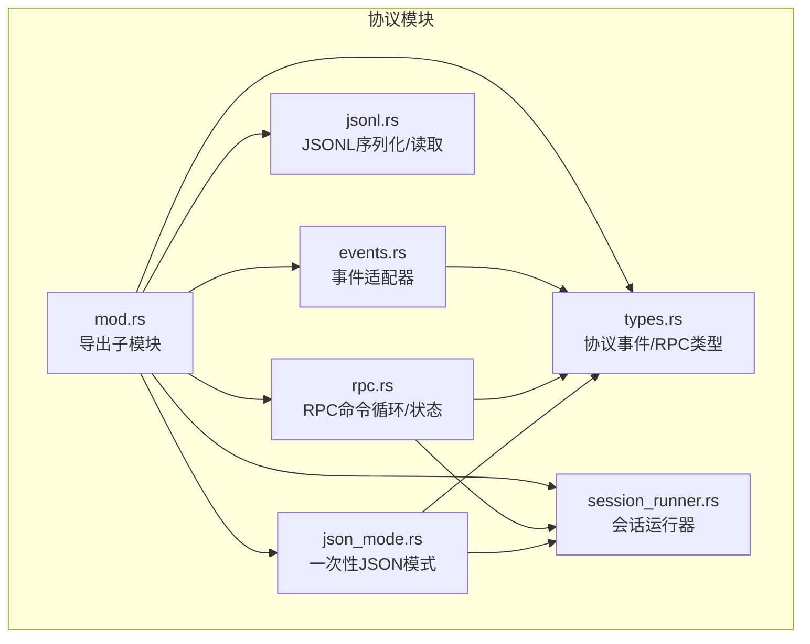
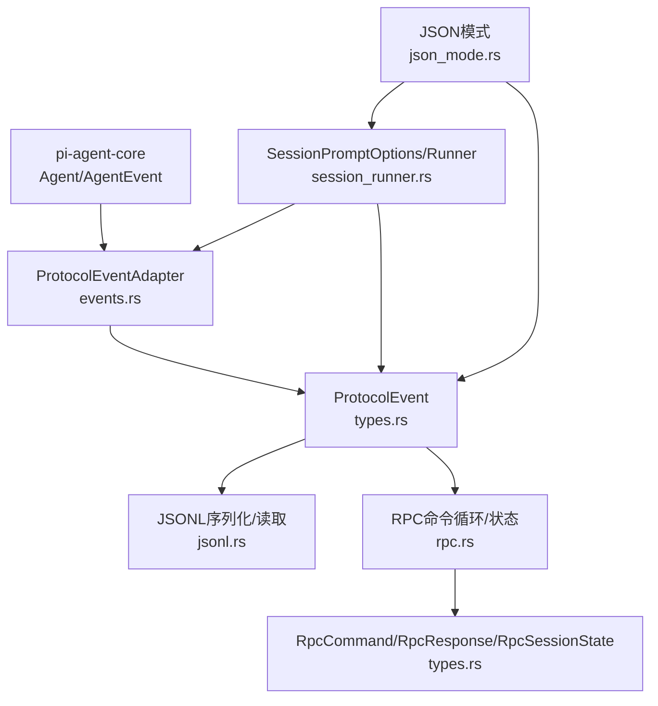
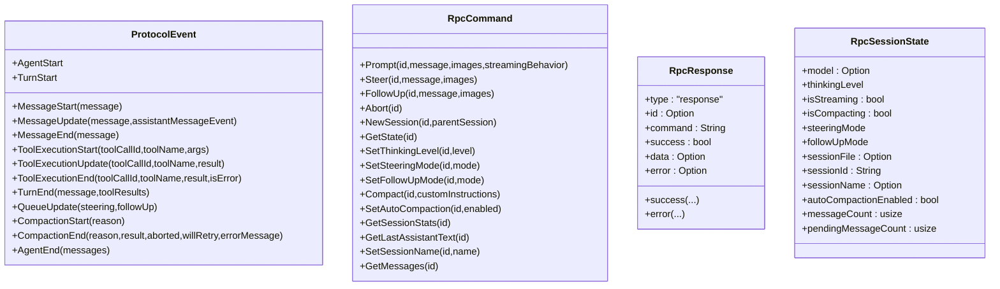
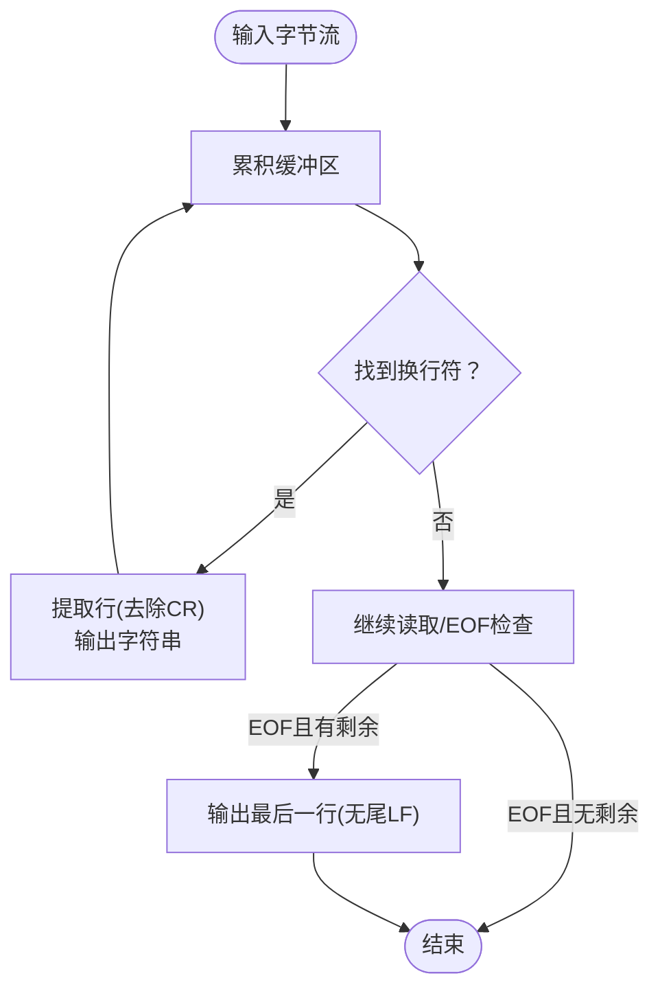
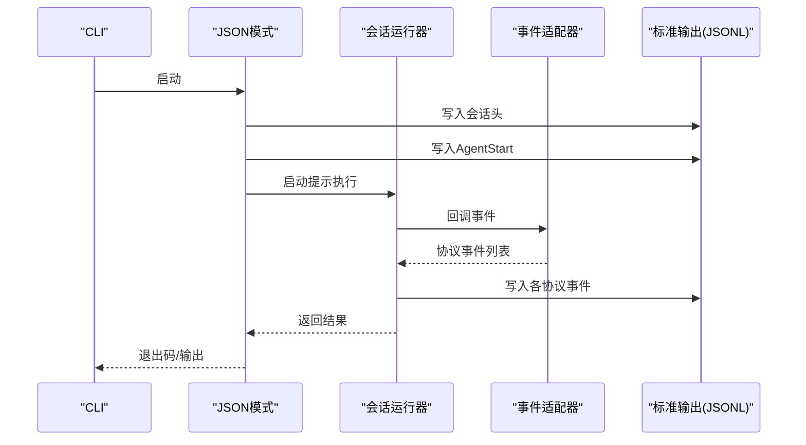
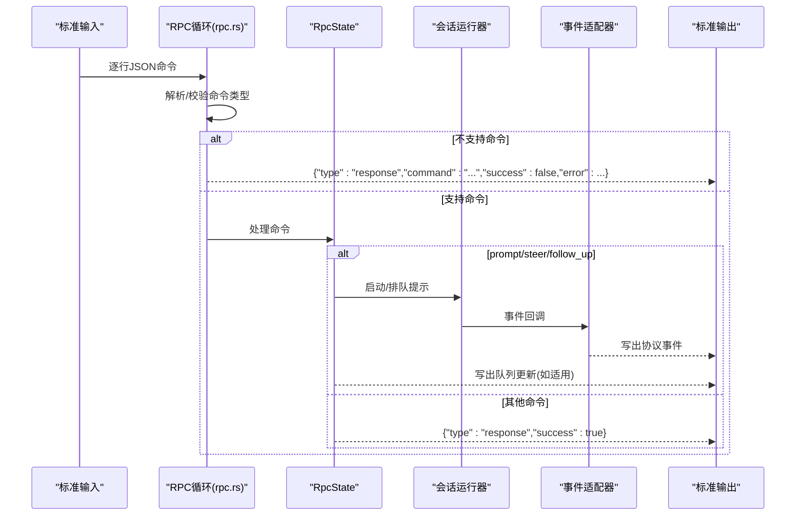
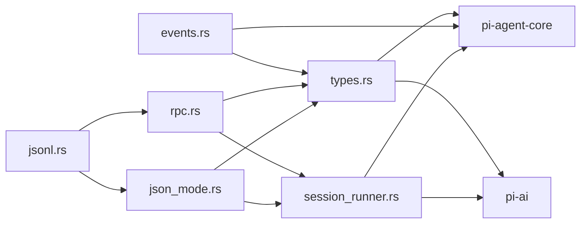

# 协议系统

<cite>
**本文引用的文件**   
- [crates/pi-coding-agent/src/protocol/mod.rs](file://crates/pi-coding-agent/src/protocol/mod.rs)
- [crates/pi-coding-agent/src/protocol/types.rs](file://crates/pi-coding-agent/src/protocol/types.rs)
- [crates/pi-coding-agent/src/protocol/rpc.rs](file://crates/pi-coding-agent/src/protocol/rpc.rs)
- [crates/pi-coding-agent/src/protocol/events.rs](file://crates/pi-coding-agent/src/protocol/events.rs)
- [crates/pi-coding-agent/src/protocol/json_mode.rs](file://crates/pi-coding-agent/src/protocol/json_mode.rs)
- [crates/pi-coding-agent/src/protocol/jsonl.rs](file://crates/pi-coding-agent/src/protocol/jsonl.rs)
- [crates/pi-coding-agent/src/protocol/session_runner.rs](file://crates/pi-coding-agent/src/protocol/session_runner.rs)
- [crates/pi-coding-agent/src/runtime.rs](file://crates/pi-coding-agent/src/runtime.rs)
- [docs/superpowers/specs/2026-06-07-pi-coding-agent-m5-headless-protocol-design.md](file://docs/superpowers/specs/2026-06-07-pi-coding-agent-m5-headless-protocol-design.md)
- [crates/pi-coding-agent/tests/protocol_events.rs](file://crates/pi-coding-agent/tests/protocol_events.rs)
- [crates/pi-coding-agent/tests/protocol_jsonl.rs](file://crates/pi-coding-agent/tests/protocol_jsonl.rs)
- [crates/pi-coding-agent/tests/protocol_sessions.rs](file://crates/pi-coding-agent/tests/protocol_sessions.rs)
</cite>

## 目录
1. [引言](#引言)
2. [项目结构](#项目结构)
3. [核心组件](#核心组件)
4. [架构总览](#架构总览)
5. [详细组件分析](#详细组件分析)
6. [依赖关系分析](#依赖关系分析)
7. [性能考量](#性能考量)
8. [故障排查指南](#故障排查指南)
9. [结论](#结论)
10. [附录](#附录)

## 引言
本文件面向“协议系统”的架构与实现，聚焦于以下目标：
- JSON 模式：以 JSONL（每行一个 JSON 对象）输出会话头与事件流，兼容 TypeScript 的事件形状。
- RPC 协议：通过标准输入/输出进行长连接命令交互，支持队列化与并发控制。
- 事件流处理：从底层 Agent 事件到稳定协议事件的适配层，确保消息序列化、反序列化与传输一致。
- 协议抽象层：统一协议事件、RPC 命令、响应与状态模型，屏蔽底层实现细节。
- 会话运行器：封装模型配置、工具注册、会话加载与持久化，统一驱动一次或多次提示。
- 版本兼容与扩展：基于 JSONL v3 会话头与协议事件命名约定，预留扩展点。
- 性能与安全：异步读写、背压处理、最小化内存占用；输入解析严格、错误隔离。
- 跨进程与一致性：通过 JSONL 帧格式与只按换行符切分的解析策略，保证跨进程通信的稳定性。

## 项目结构
协议系统位于编码代理的协议子模块中，围绕“事件适配”“JSONL 序列化/反序列化”“RPC 命令循环”“会话运行器”四个核心构件组织：



**图表来源**
- [crates/pi-coding-agent/src/protocol/mod.rs:1-7](file://crates/pi-coding-agent/src/protocol/mod.rs#L1-L7)
- [crates/pi-coding-agent/src/protocol/types.rs:1-268](file://crates/pi-coding-agent/src/protocol/types.rs#L1-L268)
- [crates/pi-coding-agent/src/protocol/events.rs:1-310](file://crates/pi-coding-agent/src/protocol/events.rs#L1-L310)
- [crates/pi-coding-agent/src/protocol/jsonl.rs:1-72](file://crates/pi-coding-agent/src/protocol/jsonl.rs#L1-L72)
- [crates/pi-coding-agent/src/protocol/json_mode.rs:1-75](file://crates/pi-coding-agent/src/protocol/json_mode.rs#L1-L75)
- [crates/pi-coding-agent/src/protocol/rpc.rs:1-579](file://crates/pi-coding-agent/src/protocol/rpc.rs#L1-L579)
- [crates/pi-coding-agent/src/protocol/session_runner.rs:1-436](file://crates/pi-coding-agent/src/protocol/session_runner.rs#L1-L436)

**章节来源**
- [crates/pi-coding-agent/src/protocol/mod.rs:1-7](file://crates/pi-coding-agent/src/protocol/mod.rs#L1-L7)

## 核心组件
- 协议事件与 RPC 类型：定义协议事件枚举、RPC 命令、RPC 响应、RPC 状态与统计结构，并提供序列化/反序列化辅助函数。
- 事件适配器：将底层 Agent 事件转换为稳定的协议事件序列，覆盖文本增量、工具调用、转轮结束、压缩开始/结束、代理结束等。
- JSONL 工具：提供严格 LF 分隔的 JSON 行序列化与异步读取，支持 CRLF 客户端的尾部 CR 剥离。
- JSON 模式：一次性提示执行，输出会话头与协议事件流，用于诊断与非交互场景。
- RPC 模式：命令循环、状态机、并发控制与事件回推，支持队列化与自动压缩开关。
- 会话运行器：构建 Agent 配置、加载/创建活动会话、注册工具、启动提示/技能/模板调用、捕获新消息与压缩元数据。

**章节来源**
- [crates/pi-coding-agent/src/protocol/types.rs:8-268](file://crates/pi-coding-agent/src/protocol/types.rs#L8-L268)
- [crates/pi-coding-agent/src/protocol/events.rs:9-310](file://crates/pi-coding-agent/src/protocol/events.rs#L9-L310)
- [crates/pi-coding-agent/src/protocol/jsonl.rs:4-72](file://crates/pi-coding-agent/src/protocol/jsonl.rs#L4-L72)
- [crates/pi-coding-agent/src/protocol/json_mode.rs:8-75](file://crates/pi-coding-agent/src/protocol/json_mode.rs#L8-L75)
- [crates/pi-coding-agent/src/protocol/rpc.rs:39-579](file://crates/pi-coding-agent/src/protocol/rpc.rs#L39-L579)
- [crates/pi-coding-agent/src/protocol/session_runner.rs:95-436](file://crates/pi-coding-agent/src/protocol/session_runner.rs#L95-L436)

## 架构总览
协议系统采用“适配层 + 运行器 + 传输层”的分层设计：
- 适配层：事件适配器负责将底层 Agent 事件映射为协议事件，确保消息体与生命周期事件的稳定形态。
- 运行器：会话运行器统一流程入口，负责配置构建、会话加载/创建、工具注册、事件回调与最终消息捕获。
- 传输层：JSONL 提供严格的帧边界；RPC 模式在 STDIO 上以 LF 分隔的 JSON 行进行双向通信。



**图表来源**
- [crates/pi-coding-agent/src/protocol/events.rs:38-245](file://crates/pi-coding-agent/src/protocol/events.rs#L38-L245)
- [crates/pi-coding-agent/src/protocol/types.rs:10-221](file://crates/pi-coding-agent/src/protocol/types.rs#L10-L221)
- [crates/pi-coding-agent/src/protocol/jsonl.rs:4-72](file://crates/pi-coding-agent/src/protocol/jsonl.rs#L4-L72)
- [crates/pi-coding-agent/src/protocol/json_mode.rs:8-75](file://crates/pi-coding-agent/src/protocol/json_mode.rs#L8-L75)
- [crates/pi-coding-agent/src/protocol/rpc.rs:39-98](file://crates/pi-coding-agent/src/protocol/rpc.rs#L39-L98)
- [crates/pi-coding-agent/src/protocol/session_runner.rs:95-436](file://crates/pi-coding-agent/src/protocol/session_runner.rs#L95-L436)

## 详细组件分析

### 协议事件与 RPC 类型
- 协议事件：包含代理开始、回合开始、消息开始/更新/结束、工具执行开始/更新/结束、回合结束、队列更新、压缩开始/结束、代理结束等。
- RPC 命令：prompt、steer、follow_up、abort、new_session、get_state、set_thinking_level、set_steering_mode、set_follow_up_mode、compact、set_auto_compaction、get_session_stats、get_last_assistant_text、set_session_name、get_messages。
- RPC 响应：统一的响应结构，包含类型、请求 id、命令名、成功标志、数据与错误信息。
- RPC 状态：封装当前模型、思考级别、是否流式、是否压缩、队列模式、会话标识/名称、自动压缩开关、消息计数与待处理消息数等。



**图表来源**
- [crates/pi-coding-agent/src/protocol/types.rs:8-221](file://crates/pi-coding-agent/src/protocol/types.rs#L8-L221)

**章节来源**
- [crates/pi-coding-agent/src/protocol/types.rs:8-268](file://crates/pi-coding-agent/src/protocol/types.rs#L8-L268)

### 事件适配器（ProtocolEventAdapter）
- 职责：将底层 Agent 事件转换为协议事件序列，维护当前助手消息、工具结果、工具参数映射与回合状态。
- 关键行为：
  - 文本增量事件映射为消息开始/更新/结束与回合结束。
  - 工具调用开始/更新/结束映射为工具执行开始/更新/结束与工具结果消息。
  - 代理完成时生成最终消息结束、回合结束与代理结束。
  - 代理错误时生成带错误原因的消息序列。
  - 会话压缩时生成压缩开始/结束事件。
- 输出：返回一组协议事件，供上层写入 JSONL 或 RPC 响应通道。

```mermaid
flowchart TD
START(["接收AgentEvent"]) --> CHECK{"事件类型？"}
CHECK --> |TurnStart| TURN_START["清空当前工具结果<br/>发出TurnStart"]
CHECK --> |LlmEvent(Start/Done/Error)| MSG_LIFECYCLE["更新current_assistant<br/>必要时发出MessageStart/MessageUpdate/MessageEnd"]
CHECK --> |ToolCallStart| TOOL_START["发出ToolExecutionStart(含args)"]
CHECK --> |ToolCallUpdate| TOOL_UPDATE["发出ToolExecutionUpdate"]
CHECK --> |ToolCallEnd| TOOL_END["存储ToolResult<br/>发出ToolExecutionEnd与MessageStart/MessageEnd"]
CHECK --> |AgentDone| DONE["发出MessageEnd/TurnEnd/AgentEnd"]
CHECK --> |AgentError| ERROR["生成错误助手消息序列"]
CHECK --> |SessionCompacted| COMPACT["发出CompactionStart/CompactionEnd"]
TURN_START --> OUT["返回协议事件列表"]
MSG_LIFECYCLE --> OUT
TOOL_START --> OUT
TOOL_UPDATE --> OUT
TOOL_END --> OUT
DONE --> OUT
ERROR --> OUT
COMPACT --> OUT
```

**图表来源**
- [crates/pi-coding-agent/src/protocol/events.rs:38-245](file://crates/pi-coding-agent/src/protocol/events.rs#L38-L245)

**章节来源**
- [crates/pi-coding-agent/src/protocol/events.rs:9-310](file://crates/pi-coding-agent/src/protocol/events.rs#L9-L310)

### JSONL 序列化与读取
- 序列化：将任意可序列化对象转为单行 JSON 字符串并追加换行符。
- 读取：逐行读取，仅按字节换行符切分；若行末为回车则剥离；支持分块边界与 EOF 最后一行未换行的场景。
- 用途：JSON 模式与 RPC 模式的统一帧格式，保证跨进程传输的确定性。



**图表来源**
- [crates/pi-coding-agent/src/protocol/jsonl.rs:40-72](file://crates/pi-coding-agent/src/protocol/jsonl.rs#L40-L72)

**章节来源**
- [crates/pi-coding-agent/src/protocol/jsonl.rs:1-72](file://crates/pi-coding-agent/src/protocol/jsonl.rs#L1-L72)

### JSON 模式
- 入口：一次性提示执行，先输出会话头（JSONL v3），再输出协议事件流。
- 会话头：包含类型、版本、会话 ID、时间戳、工作目录等；禁用会话时为内存态。
- 事件流：由运行器驱动，事件经适配器转换后逐条写出。
- 退出码：根据运行器结果设置，错误时输出到标准错误。



**图表来源**
- [crates/pi-coding-agent/src/protocol/json_mode.rs:8-75](file://crates/pi-coding-agent/src/protocol/json_mode.rs#L8-L75)
- [crates/pi-coding-agent/src/protocol/session_runner.rs:95-436](file://crates/pi-coding-agent/src/protocol/session_runner.rs#L95-L436)
- [crates/pi-coding-agent/src/protocol/events.rs:38-245](file://crates/pi-coding-agent/src/protocol/events.rs#L38-L245)

**章节来源**
- [crates/pi-coding-agent/src/protocol/json_mode.rs:8-75](file://crates/pi-coding-agent/src/protocol/json_mode.rs#L8-L75)

### RPC 模式与会话运行器
- 命令循环：从标准输入逐行读取 JSON 命令，严格校验类型与支持集合，解析失败返回结构化错误响应。
- 并发与状态：单次提示任务串行执行；支持队列化（steer/follow_up）与取消（abort）；状态通过 RpcState 维护。
- 事件回推：提示执行期间，事件经适配器转换后立即写出，保持流式体验。
- 会话运行器：统一构建 Agent 配置、加载会话上下文、注册工具、启动执行、捕获消息与压缩元数据。



**图表来源**
- [crates/pi-coding-agent/src/protocol/rpc.rs:39-98](file://crates/pi-coding-agent/src/protocol/rpc.rs#L39-L98)
- [crates/pi-coding-agent/src/protocol/rpc.rs:170-340](file://crates/pi-coding-agent/src/protocol/rpc.rs#L170-L340)
- [crates/pi-coding-agent/src/protocol/session_runner.rs:95-436](file://crates/pi-coding-agent/src/protocol/session_runner.rs#L95-L436)
- [crates/pi-coding-agent/src/protocol/events.rs:38-245](file://crates/pi-coding-agent/src/protocol/events.rs#L38-L245)

**章节来源**
- [crates/pi-coding-agent/src/protocol/rpc.rs:39-579](file://crates/pi-coding-agent/src/protocol/rpc.rs#L39-L579)
- [crates/pi-coding-agent/src/protocol/session_runner.rs:95-436](file://crates/pi-coding-agent/src/protocol/session_runner.rs#L95-L436)

## 依赖关系分析
- 协议类型依赖 pi-agent-core 的会话消息与队列模式、思考级别，以及 pi-ai 的内容块与模型类型。
- 事件适配器依赖 Agent 事件与会话消息模型，负责将内部事件映射为协议事件。
- RPC 与 JSON 模式均依赖会话运行器，后者负责配置构建、会话加载与消息捕获。
- JSONL 工具被两者共享，确保帧格式一致。



**图表来源**
- [crates/pi-coding-agent/src/protocol/types.rs:1-6](file://crates/pi-coding-agent/src/protocol/types.rs#L1-L6)
- [crates/pi-coding-agent/src/protocol/events.rs:1-7](file://crates/pi-coding-agent/src/protocol/events.rs#L1-L7)
- [crates/pi-coding-agent/src/protocol/rpc.rs:1-14](file://crates/pi-coding-agent/src/protocol/rpc.rs#L1-L14)
- [crates/pi-coding-agent/src/protocol/json_mode.rs:1-6](file://crates/pi-coding-agent/src/protocol/json_mode.rs#L1-L6)
- [crates/pi-coding-agent/src/protocol/jsonl.rs:1-7](file://crates/pi-coding-agent/src/protocol/jsonl.rs#L1-L7)
- [crates/pi-coding-agent/src/protocol/session_runner.rs:1-15](file://crates/pi-coding-agent/src/protocol/session_runner.rs#L1-L15)

**章节来源**
- [crates/pi-coding-agent/src/protocol/types.rs:1-6](file://crates/pi-coding-agent/src/protocol/types.rs#L1-L6)
- [crates/pi-coding-agent/src/protocol/session_runner.rs:1-15](file://crates/pi-coding-agent/src/protocol/session_runner.rs#L1-L15)

## 性能考量
- 异步 I/O 与背压：RPC 循环与 JSONL 读取均使用异步读写，写出时显式刷新，避免阻塞与死锁风险。
- 流式事件：事件适配器在运行器回调中即时转换并写出，降低内存峰值与延迟。
- 会话捕获：运行器在流结束后批量捕获新增消息与压缩元数据，减少重复写入。
- 解析严格性：RPC 输入仅按换行符切分，避免复杂分隔符带来的解析开销与不确定性。
- 传输最小化：JSONL 每行一对象，不进行额外转义或多行合并，简化解析与传输。

[本节为通用性能讨论，无需特定文件引用]

## 故障排查指南
- RPC 解析错误：当命令 JSON 无效或类型不在支持集合时，返回结构化错误响应并继续读取后续命令。
- 并发冲突：RPC 在流式运行时拒绝无行为的 prompt；可通过 steer/followUp 将消息排队。
- 会话持久化：启用会话时，RPC 模式会在提示完成后追加用户/助手/压缩等条目；可通过测试验证 JSONL 文件存在与内容。
- 错误映射：底层 Agent 错误会被映射为带错误原因的消息序列，随后触发回合结束与代理结束，便于客户端感知。

**章节来源**
- [crates/pi-coding-agent/src/protocol/rpc.rs:56-98](file://crates/pi-coding-agent/src/protocol/rpc.rs#L56-L98)
- [crates/pi-coding-agent/src/protocol/rpc.rs:342-454](file://crates/pi-coding-agent/src/protocol/rpc.rs#L342-L454)
- [crates/pi-coding-agent/tests/protocol_sessions.rs:26-62](file://crates/pi-coding-agent/tests/protocol_sessions.rs#L26-L62)

## 结论
该协议系统通过清晰的分层与严格的帧格式，实现了从底层 Agent 事件到稳定协议事件的可靠映射，并提供了 JSON 与 RPC 两种头模式，满足非交互与长连接控制的不同需求。事件适配器与会话运行器的职责分离，既保证了协议契约的稳定性，也为未来扩展（如更细粒度的工具详情、压缩开始事件等）预留了空间。

[本节为总结，无需特定文件引用]

## 附录

### 协议版本与兼容性
- JSONL 帧格式：每条记录为一个 JSON 对象，末尾换行；输入按换行符切分，尾部回车剥离。
- 会话头：JSON 模式首行固定为会话头，版本号为 3；RPC 模式不主动输出会话头，可通过 get_state 获取当前状态。
- 事件形状：遵循 TypeScript 兼容的事件命名与消息结构，确保生态互通。
- 扩展机制：协议事件与 RPC 命令均采用标签字段与重命名策略，便于在不破坏现有消费者的情况下添加新字段或新事件。

**章节来源**
- [docs/superpowers/specs/2026-06-07-pi-coding-agent-m5-headless-protocol-design.md:110-185](file://docs/superpowers/specs/2026-06-07-pi-coding-agent-m5-headless-protocol-design.md#L110-L185)
- [crates/pi-coding-agent/src/protocol/json_mode.rs:8-31](file://crates/pi-coding-agent/src/protocol/json_mode.rs#L8-L31)
- [crates/pi-coding-agent/src/protocol/jsonl.rs:4-8](file://crates/pi-coding-agent/src/protocol/jsonl.rs#L4-L8)

### 安全设计原则
- 输入严格解析：RPC 模式仅接受 LF 分隔的 JSON 行，解析失败即返回错误响应，不吞没异常。
- 输出可控：所有协议事件与响应均通过统一序列化器写出，避免注入与格式错误。
- 背压处理：写出操作显式刷新，防止下游阻塞导致的死锁。
- 会话隔离：RPC 模式不直接使用终端原始模式，通过 STDIO 注入器进行测试与生产，降低安全风险。

**章节来源**
- [crates/pi-coding-agent/src/protocol/rpc.rs:23-37](file://crates/pi-coding-agent/src/protocol/rpc.rs#L23-L37)
- [crates/pi-coding-agent/src/protocol/jsonl.rs:40-63](file://crates/pi-coding-agent/src/protocol/jsonl.rs#L40-L63)

### 跨进程通信与数据一致性
- 帧边界确定：JSONL 严格按换行符切分，避免多字节或 Unicode 分隔符带来的歧义。
- 顺序一致性：事件适配器在运行器回调中即时转换并写出，配合 RPC 的串行提示执行，保证事件顺序。
- 会话一致性：运行器在流结束后统一捕获新增消息与压缩元数据，确保会话文件的原子性追加。

**章节来源**
- [crates/pi-coding-agent/src/protocol/jsonl.rs:40-72](file://crates/pi-coding-agent/src/protocol/jsonl.rs#L40-L72)
- [crates/pi-coding-agent/src/protocol/session_runner.rs:267-342](file://crates/pi-coding-agent/src/protocol/session_runner.rs#L267-L342)