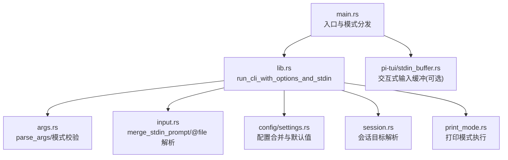
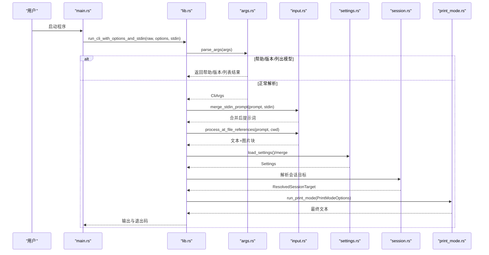
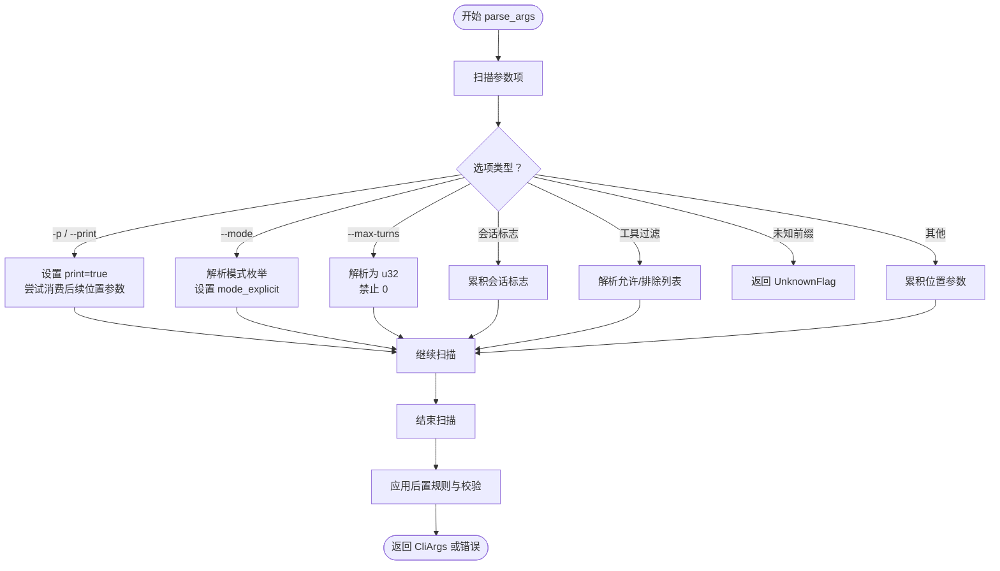
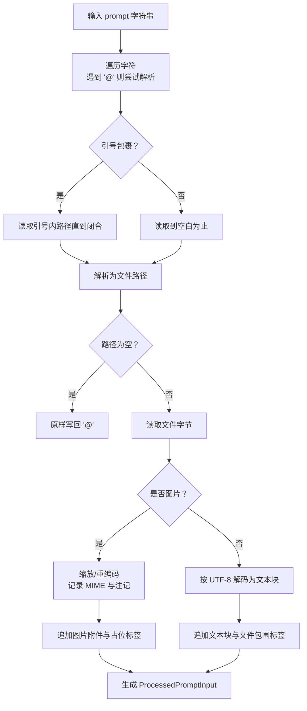
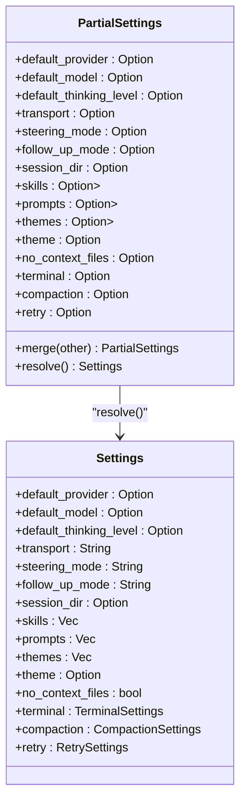
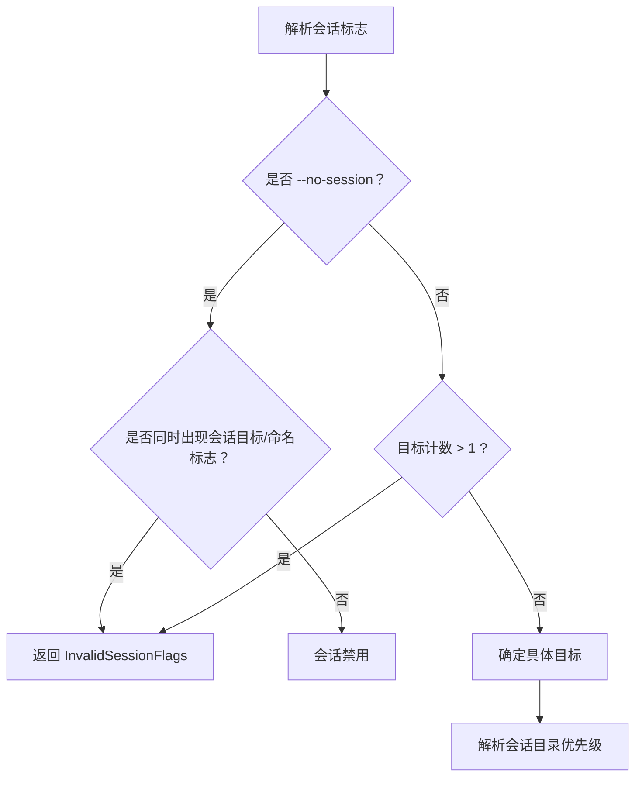
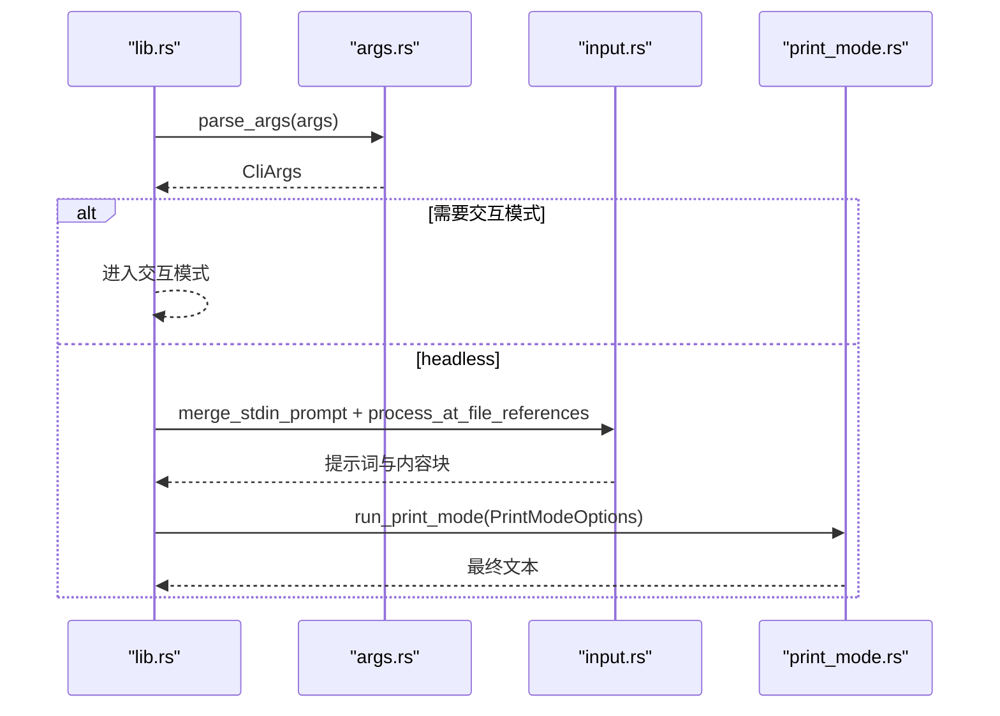
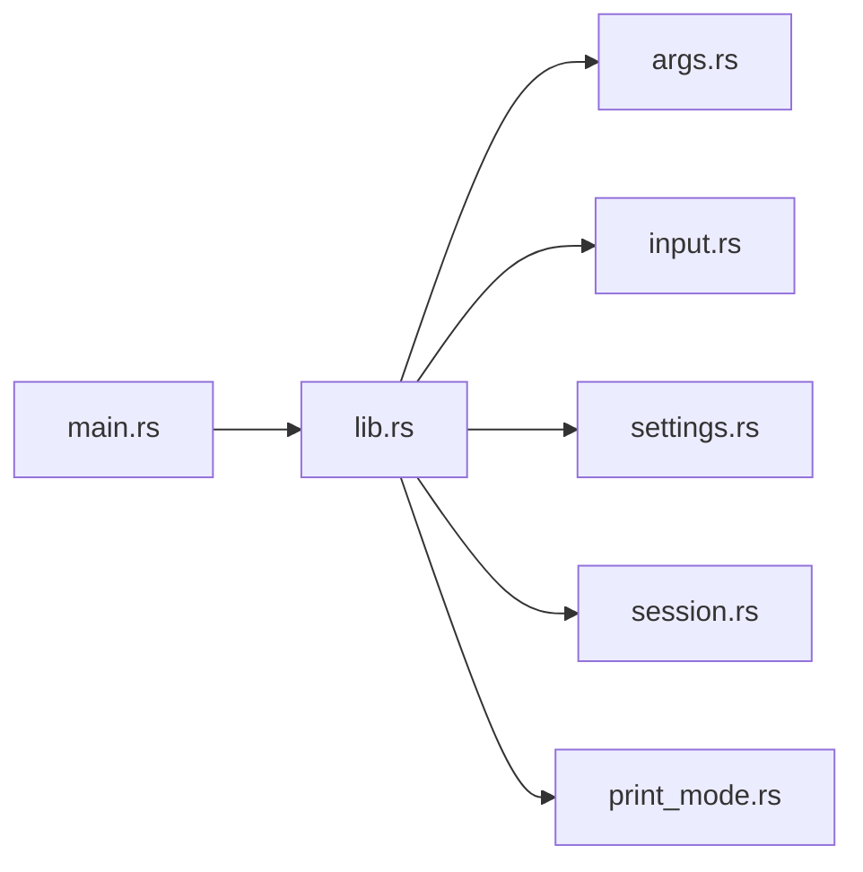

# 参数解析

<cite>
**本文档引用的文件**
- [args.rs](file://crates/pi-coding-agent/src/args.rs)
- [input.rs](file://crates/pi-coding-agent/src/input.rs)
- [print_mode.rs](file://crates/pi-coding-agent/src/print_mode.rs)
- [main.rs](file://crates/pi-coding-agent/src/main.rs)
- [lib.rs](file://crates/pi-coding-agent/src/lib.rs)
- [error.rs](file://crates/pi-coding-agent/src/error.rs)
- [settings.rs](file://crates/pi-coding-agent/src/config/settings.rs)
- [session.rs](file://crates/pi-coding-agent/src/session.rs)
- [stdin_buffer.rs](file://crates/pi-tui/src/input/stdin_buffer.rs)
- [protocol_args.rs](file://crates/pi-coding-agent/tests/protocol_args.rs)
- [args.rs（测试）](file://crates/pi-coding-agent/tests/args.rs)
- [print_mode.rs（测试）](file://crates/pi-coding-agent/tests/print_mode.rs)
</cite>

## 目录
1. [简介](#简介)
2. [项目结构](#项目结构)
3. [核心组件](#核心组件)
4. [架构总览](#架构总览)
5. [详细组件分析](#详细组件分析)
6. [依赖关系分析](#依赖关系分析)
7. [性能考量](#性能考量)
8. [故障排查指南](#故障排查指南)
9. [结论](#结论)
10. [附录](#附录)

## 简介
本文件系统性阐述 pi-coding-agent 的参数解析与执行流水线，覆盖命令行参数解析设计模式、参数验证与默认值处理、配置合并逻辑、输入预处理与文件引用解析、标准输入处理、打印模式的特殊处理与模式切换机制、参数优先级与冲突解决策略、错误处理与用户反馈，以及复杂参数组合与边界情况的处理方案。

## 项目结构
围绕参数解析与执行的关键模块如下：
- 命令行解析与模式选择：args.rs
- 输入预处理与文件引用解析：input.rs
- 打印模式执行入口：print_mode.rs
- 入口与模式分发：main.rs、lib.rs
- 错误类型定义：error.rs
- 配置合并与资源加载：config/settings.rs
- 会话解析与持久化：session.rs
- 标准输入缓冲（交互式场景）：pi-tui/input/stdin_buffer.rs
- 行为与约束测试：tests 下的协议与参数测试

图表来源
- [main.rs:1-60](file://crates/pi-coding-agent/src/main.rs#L1-L60)
- [lib.rs:95-334](file://crates/pi-coding-agent/src/lib.rs#L95-L334)
- [args.rs:153-333](file://crates/pi-coding-agent/src/args.rs#L153-L333)
- [input.rs:36-126](file://crates/pi-coding-agent/src/input.rs#L36-L126)
- [settings.rs:135-193](file://crates/pi-coding-agent/src/config/settings.rs#L135-L193)
- [session.rs:49-138](file://crates/pi-coding-agent/src/session.rs#L49-L138)
- [print_mode.rs:70-94](file://crates/pi-coding-agent/src/print_mode.rs#L70-L94)
- [stdin_buffer.rs:1-45](file://crates/pi-tui/src/input/stdin_buffer.rs#L1-L45)

章节来源
- [main.rs:1-60](file://crates/pi-coding-agent/src/main.rs#L1-L60)
- [lib.rs:95-334](file://crates/pi-coding-agent/src/lib.rs#L95-L334)

## 核心组件
- 参数模型与解析器
  - CliArgs 结构体承载所有解析后的参数，包含模式、提示词、模型、系统提示、会话控制、工具过滤、调试开关等字段。
  - parse_args 实现线性扫描解析，支持短/长选项、位置参数拼接、CSV 扩展参数、未知标志拒绝、缺失值检测、模式与会话冲突校验。
- 模式与模式切换
  - CliMode 枚举定义 print/json/rpc 三种模式；--mode 显式指定；-p/--print 与模式存在互斥与兼容性约束。
- 输入预处理与文件引用
  - merge_stdin_prompt 合并标准输入与提示词；process_at_file_references 解析 @file 引用，自动识别图片并按需缩放，生成文本与图片块。
- 配置合并与默认值
  - PartialSettings/Settings 支持全局与项目设置的字段级合并与默认值填充；列表型资源路径采用追加合并。
- 会话目标解析
  - ResolvedSessionTarget 将 CLI 会话相关标志解析为具体目标，确保互斥与合法性。
- 打印模式执行
  - PrintModeOptions 作为打印模式的执行载体，调用 run_session_prompt 并提取最终助手文本。

章节来源
- [args.rs:25-117](file://crates/pi-coding-agent/src/args.rs#L25-L117)
- [args.rs:153-333](file://crates/pi-coding-agent/src/args.rs#L153-L333)
- [input.rs:8-126](file://crates/pi-coding-agent/src/input.rs#L8-L126)
- [settings.rs:135-193](file://crates/pi-coding-agent/src/config/settings.rs#L135-L193)
- [session.rs:49-138](file://crates/pi-coding-agent/src/session.rs#L49-L138)
- [print_mode.rs:8-68](file://crates/pi-coding-agent/src/print_mode.rs#L8-L68)

## 架构总览
参数解析与执行的端到端流程如下：

图表来源
- [main.rs:39-59](file://crates/pi-coding-agent/src/main.rs#L39-L59)
- [lib.rs:95-334](file://crates/pi-coding-agent/src/lib.rs#L95-L334)
- [args.rs:153-333](file://crates/pi-coding-agent/src/args.rs#L153-L333)
- [input.rs:36-126](file://crates/pi-coding-agent/src/input.rs#L36-L126)
- [settings.rs:221-225](file://crates/pi-coding-agent/src/config/settings.rs#L221-L225)
- [session.rs:29-47](file://crates/pi-coding-agent/src/session.rs#L29-L47)
- [print_mode.rs:70-94](file://crates/pi-coding-agent/src/print_mode.rs#L70-L94)

## 详细组件分析

### 参数解析器与模式系统
- 设计模式
  - 线性状态机：逐项扫描 raw 参数，根据前缀与上下文决定行为。
  - 命令对象模式：每个选项映射到一个分支处理，统一使用 take_value 获取后续值。
  - 枚举与 FromStr：CliMode 通过字符串枚举实现模式解析。
- 关键实现点
  - -p/--print 与位置参数拼接：当紧随 -p 出现且非选项时，视为提示词片段。
  - --mode 显式模式：解析字符串枚举，标记 mode_explicit。
  - 模式与 -p 的互斥与兼容：-p 仅能与 --mode print 组合；rpc 模式不接受位置提示词。
  - 会话标志互斥：多于一个会话目标标志即报错；--no-session 与会话目标/命名标志互斥。
  - 工具过滤互斥：--no-tools 与 --tools/--exclude-tools 互斥。
  - --json 仅在 --list-models 时有效。
- 默认值与缺省行为
  - mode 默认 print；max-turns 默认 None（与 TypeScript 版本一致）。
- 错误处理
  - UnknownFlag/MissingValue/InvalidMaxTurns/InvalidInput/InvalidSessionFlags 等。

图表来源
- [args.rs:153-333](file://crates/pi-coding-agent/src/args.rs#L153-L333)

章节来源
- [args.rs:153-333](file://crates/pi-coding-agent/src/args.rs#L153-L333)
- [protocol_args.rs:1-65](file://crates/pi-coding-agent/tests/protocol_args.rs#L1-L65)
- [args.rs（测试）:1-155](file://crates/pi-coding-agent/tests/args.rs#L1-L155)

### 输入预处理与文件引用解析
- 标准输入合并
  - merge_stdin_prompt 在提示词为空时直接采用 stdin；两者均存在时以空行分隔拼接。
- @file 引用解析
  - process_at_file_references_with_options 支持带引号与无引号路径，自动识别图片 MIME 并按需缩放，生成文本与图片块。
  - 图片缩放：基于最大维度与等比缩放，输出重编码后的图片字节与尺寸信息注记。
  - 路径解析：支持 ~ 与 ~/...，相对路径转绝对路径。
- 错误处理
  - 文件读取失败、UTF-8 解码失败、图片格式识别失败或重编码失败均转换为 CliError::InvalidInput。

图表来源
- [input.rs:46-173](file://crates/pi-coding-agent/src/input.rs#L46-L173)
- [input.rs:180-232](file://crates/pi-coding-agent/src/input.rs#L180-L232)
- [input.rs:244-287](file://crates/pi-coding-agent/src/input.rs#L244-L287)

章节来源
- [input.rs:36-126](file://crates/pi-coding-agent/src/input.rs#L36-L126)
- [input.rs:128-173](file://crates/pi-coding-agent/src/input.rs#L128-L173)
- [input.rs:180-232](file://crates/pi-coding-agent/src/input.rs#L180-L232)
- [input.rs:244-287](file://crates/pi-coding-agent/src/input.rs#L244-L287)

### 配置合并与默认值处理
- 层次化配置
  - 全局设置与项目设置分别加载，随后进行字段级合并与默认值填充。
- 合并策略
  - 标量字段：项目覆盖全局；未设置则采用默认值。
  - 嵌套对象：字段级覆盖，未设置字段保留另一侧值。
  - 列表型资源路径：采用追加合并，保证全局与项目路径共同生效。
- 默认值
  - 传输方式、引导模式、跟随模式默认为“自动/逐一”；压缩与重试启用并设定合理阈值；终端显示图片/进度默认开启；上下文文件默认开启。

图表来源
- [settings.rs:30-85](file://crates/pi-coding-agent/src/config/settings.rs#L30-L85)
- [settings.rs:135-193](file://crates/pi-coding-agent/src/config/settings.rs#L135-L193)

章节来源
- [settings.rs:135-193](file://crates/pi-coding-agent/src/config/settings.rs#L135-L193)
- [settings.rs:221-225](file://crates/pi-coding-agent/src/config/settings.rs#L221-L225)

### 会话目标解析与优先级
- 目标解析
  - 将 CLI 会话标志解析为 ResolvedSessionTarget，支持新建、继续最近、打开目标、按 ID 打开或创建、fork 目标。
- 优先级与互斥
  - 会话目标互斥：多于一个会话目标标志即报错。
  - --no-session 与会话目标/命名标志互斥。
- 目录解析
  - 支持 CLI 指定、运行时传入、环境变量 PI_SESSION_DIR、默认根目录等多源解析。

图表来源
- [args.rs:291-312](file://crates/pi-coding-agent/src/args.rs#L291-L312)
- [session.rs:49-138](file://crates/pi-coding-agent/src/session.rs#L49-L138)
- [session.rs:29-47](file://crates/pi-coding-agent/src/session.rs#L29-L47)

章节来源
- [args.rs:291-312](file://crates/pi-coding-agent/src/args.rs#L291-L312)
- [session.rs:49-138](file://crates/pi-coding-agent/src/session.rs#L49-L138)
- [session.rs:29-47](file://crates/pi-coding-agent/src/session.rs#L29-L47)

### 打印模式的特殊处理与模式切换
- 模式选择
  - 若未显式指定模式且非 -p，则进入交互模式；否则走 headless 路径。
  - rpc 模式需要专用二进制入口；普通入口对 rpc 返回 UnsupportedMode。
- 打印模式执行
  - 将 SessionPromptOptions 转换为 PrintModeOptions，调用 run_session_prompt 并提取最终文本。
- 位置参数与 stdin 的结合
  - 当提示词为空但 stdin 非空时，合并后作为输入；两者均为空则报错 MissingPrompt。

图表来源
- [lib.rs:125-151](file://crates/pi-coding-agent/src/lib.rs#L125-L151)
- [lib.rs:322-333](file://crates/pi-coding-agent/src/lib.rs#L322-L333)
- [print_mode.rs:70-94](file://crates/pi-coding-agent/src/print_mode.rs#L70-L94)

章节来源
- [lib.rs:125-151](file://crates/pi-coding-agent/src/lib.rs#L125-L151)
- [lib.rs:322-333](file://crates/pi-coding-agent/src/lib.rs#L322-L333)
- [print_mode.rs:70-94](file://crates/pi-coding-agent/src/print_mode.rs#L70-L94)

### 标准输入处理与交互式输入缓冲
- 标准输入读取
  - main.rs 中检测 stdin 是否为终端；非终端时一次性读取至字符串，失败则退出码 1。
- 交互式输入缓冲
  - pi-tui 的 StdinBuffer 提供粘贴模式与超时刷新机制，用于交互式场景的输入稳定处理。

章节来源
- [main.rs:25-36](file://crates/pi-coding-agent/src/main.rs#L25-L36)
- [stdin_buffer.rs:1-45](file://crates/pi-tui/src/input/stdin_buffer.rs#L1-L45)

## 依赖关系分析
- 模块耦合
  - lib.rs 是中枢，依赖 args、input、settings、session、print_mode 等模块完成解析、预处理、配置与执行。
  - args.rs 与 lib.rs 存在强耦合（模式与后置校验），但职责清晰。
- 外部依赖
  - 配置解析依赖 toml；图片处理依赖 image；路径解析依赖 dirs；UUID/时间戳依赖 uuid/time。
- 循环依赖
  - 未见循环导入；各模块方向单一。

图表来源
- [lib.rs:15-24](file://crates/pi-coding-agent/src/lib.rs#L15-L24)
- [main.rs:39-59](file://crates/pi-coding-agent/src/main.rs#L39-L59)

章节来源
- [lib.rs:15-24](file://crates/pi-coding-agent/src/lib.rs#L15-L24)

## 性能考量
- 解析阶段
  - 线性扫描 O(n)，分支内操作均为常数或轻量级字符串处理，整体 O(n)。
- 输入预处理
  - @file 解析为 O(m)（m 为提示词长度），图片缩放与重编码为 O(p)（p 为像素数），通常可忽略。
- 配置合并
  - 字段级合并与默认填充为 O(k)（k 为配置字段数），列表追加为 O(u)（u 为资源路径数量）。
- 建议
  - 对大文件图片建议在外部预处理；避免在 CLI 层做重型计算；保持解析与预处理的线性复杂度。

## 故障排查指南
- 常见错误与定位
  - MissingValue：检查缺少参数值的选项，如 --model/--api-key/--max-turns。
  - UnknownFlag：检查拼写或未实现的选项。
  - InvalidMaxTurns：确保大于 0 的整数。
  - InvalidInput：检查模式、RPC 不接受位置提示词、工具过滤互斥、--json 仅与 --list-models 搭配等。
  - InvalidSessionFlags：检查会话目标互斥与 --no-session 冲突。
  - MissingPrompt：提示词为空且 stdin 为空。
- 用户反馈
  - run_cli_with_options_and_stdin 将错误转换为 CliOutput，stderr 输出错误文本，exit_code 为 1。
- 测试参考
  - 协议参数测试覆盖模式与 -p 的互斥、rpc 模式的限制、未知模式等。
  - 参数解析测试覆盖 -p 位置参数拼接、缺失值、无效 max-turns、未知标志等。

章节来源
- [error.rs:1-24](file://crates/pi-coding-agent/src/error.rs#L1-L24)
- [lib.rs:55-61](file://crates/pi-coding-agent/src/lib.rs#L55-L61)
- [protocol_args.rs:1-65](file://crates/pi-coding-agent/tests/protocol_args.rs#L1-L65)
- [args.rs（测试）:112-155](file://crates/pi-coding-agent/tests/args.rs#L112-L155)

## 结论
该参数解析系统以线性扫描与命令对象模式实现高可维护性的 CLI 解析，结合严格的后置校验与明确的错误反馈，确保复杂参数组合下的正确性与一致性。输入预处理与配置合并机制提供了强大的扩展能力，打印模式与会话管理形成完整的执行闭环。建议在后续迭代中进一步完善扩展标志捕获与更细粒度的诊断输出。

## 附录

### 参数优先级与冲突解决策略
- 模式优先级
  - -p 隐式选择 print；--mode 显式覆盖；二者同时出现仅当 --mode 为 print 时允许。
- 会话目标优先级
  - --no-session 禁用会话；与会话目标/命名标志互斥。
- 工具过滤优先级
  - --no-tools 禁用所有工具；与 --tools/--exclude-tools 互斥。
- --json 与 --list-models
  - --json 仅在 --list-models 时有效。

章节来源
- [args.rs:276-330](file://crates/pi-coding-agent/src/args.rs#L276-L330)

### 复杂参数组合与边界情况
- -p 与位置参数
  - -p 后续非选项被视作提示词片段；若下一个选项出现则停止消费。
- --list-models 与搜索/JSON
  - 支持可选搜索词与 --json；搜索词不会被误认作后续选项或文件参数。
- @file 引用边界
  - 引号路径必须闭合；空路径原样输出 @；图片格式识别失败则回退为原始字节。
- stdin 边界
  - stdin 为空时不参与合并；两者均为空时报 MissingPrompt。

章节来源
- [args.rs:164-173](file://crates/pi-coding-agent/src/args.rs#L164-L173)
- [args.rs:184-196](file://crates/pi-coding-agent/src/args.rs#L184-L196)
- [input.rs:68-110](file://crates/pi-coding-agent/src/input.rs#L68-L110)
- [input.rs:134-173](file://crates/pi-coding-agent/src/input.rs#L134-L173)
- [lib.rs:141-151](file://crates/pi-coding-agent/src/lib.rs#L141-L151)