# 工具系统

<cite>
**本文引用的文件**
- [crates/pi-coding-agent/src/tools/mod.rs](file://crates/pi-coding-agent/src/tools/mod.rs)
- [crates/pi-coding-agent/src/lib.rs](file://crates/pi-coding-agent/src/lib.rs)
- [crates/pi-coding-agent/src/runtime.rs](file://crates/pi-coding-agent/src/runtime.rs)
- [crates/pi-coding-agent/src/session.rs](file://crates/pi-coding-agent/src/session.rs)
- [crates/pi-coding-agent/src/tools/bash.rs](file://crates/pi-coding-agent/src/tools/bash.rs)
- [crates/pi-coding-agent/src/tools/read.rs](file://crates/pi-coding-agent/src/tools/read.rs)
- [crates/pi-coding-agent/src/tools/write.rs](file://crates/pi-coding-agent/src/tools/write.rs)
- [crates/pi-coding-agent/src/tools/find.rs](file://crates/pi-coding-agent/src/tools/find.rs)
- [crates/pi-coding-agent/src/tools/grep.rs](file://crates/pi-coding-agent/src/tools/grep.rs)
- [crates/pi-coding-agent/src/tools/edit.rs](file://crates/pi-coding-agent/src/tools/edit.rs)
- [crates/pi-coding-agent/src/tools/ls.rs](file://crates/pi-coding-agent/src/tools/ls.rs)
- [crates/pi-coding-agent/src/tools/path.rs](file://crates/pi-coding-agent/src/tools/path.rs)
- [crates/pi-coding-agent/src/tools/truncate.rs](file://crates/pi-coding-agent/src/tools/truncate.rs)
- [crates/pi-coding-agent/src/tools/file_mutation_queue.rs](file://crates/pi-coding-agent/src/tools/file_mutation_queue.rs)
- [crates/pi-coding-agent/src/tools/edit_diff.rs](file://crates/pi-coding-agent/src/tools/edit_diff.rs)
- [crates/pi-agent-core/src/lib.rs](file://crates/pi-agent-core/src/lib.rs)
</cite>

## 目录
1. [引言](#引言)
2. [项目结构](#项目结构)
3. [核心组件](#核心组件)
4. [架构总览](#架构总览)
5. [详细组件分析](#详细组件分析)
6. [依赖关系分析](#依赖关系分析)
7. [性能考量](#性能考量)
8. [故障排查指南](#故障排查指南)
9. [结论](#结论)
10. [附录：自定义工具开发指南与最佳实践](#附录自定义工具开发指南与最佳实践)

## 引言
本文件面向“工具系统”的架构与实现，聚焦以下目标：
- 抽象层设计与工具注册机制
- 文件操作工具（读取、写入、编辑、列出、查找）与搜索工具（内容检索）的实现原理
- 工具执行队列与并发控制机制
- 工具接口标准化与扩展点
- 权限管理、安全沙箱与资源限制
- 自定义工具开发指南与最佳实践
- 错误处理与回滚机制

## 项目结构
工具系统位于编码代理子项目中，采用模块化组织方式：
- 工具注册入口：tools/mod.rs 负责内置工具的聚合与过滤
- 工具实现：每个工具独立模块（read、write、edit、bash、grep、find、ls）
- 公共基础设施：路径解析、截断策略、文件变更串行队列、差异生成等
- 运行时与会话：runtime.rs 提供运行参数与配置构建；session.rs 管理会话存储与目录解析

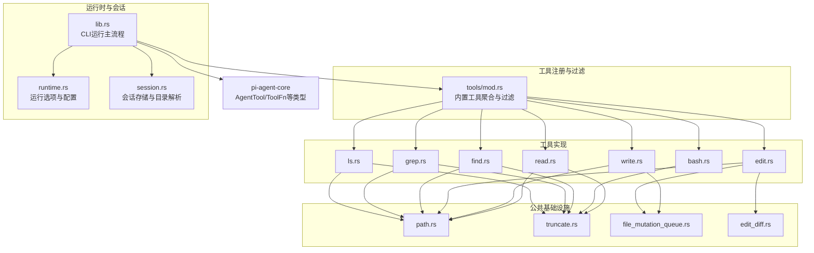

图示来源
- [crates/pi-coding-agent/src/tools/mod.rs:17-50](file://crates/pi-coding-agent/src/tools/mod.rs#L17-L50)
- [crates/pi-coding-agent/src/tools/read.rs:1-183](file://crates/pi-coding-agent/src/tools/read.rs#L1-L183)
- [crates/pi-coding-agent/src/tools/write.rs:1-111](file://crates/pi-coding-agent/src/tools/write.rs#L1-L111)
- [crates/pi-coding-agent/src/tools/edit.rs:1-329](file://crates/pi-coding-agent/src/tools/edit.rs#L1-L329)
- [crates/pi-coding-agent/src/tools/bash.rs:1-521](file://crates/pi-coding-agent/src/tools/bash.rs#L1-L521)
- [crates/pi-coding-agent/src/tools/find.rs:1-202](file://crates/pi-coding-agent/src/tools/find.rs#L1-L202)
- [crates/pi-coding-agent/src/tools/grep.rs:1-331](file://crates/pi-coding-agent/src/tools/grep.rs#L1-L331)
- [crates/pi-coding-agent/src/tools/ls.rs:1-128](file://crates/pi-coding-agent/src/tools/ls.rs#L1-L128)
- [crates/pi-coding-agent/src/tools/path.rs:1-58](file://crates/pi-coding-agent/src/tools/path.rs#L1-L58)
- [crates/pi-coding-agent/src/tools/truncate.rs:1-294](file://crates/pi-coding-agent/src/tools/truncate.rs#L1-L294)
- [crates/pi-coding-agent/src/tools/file_mutation_queue.rs:1-72](file://crates/pi-coding-agent/src/tools/file_mutation_queue.rs#L1-L72)
- [crates/pi-coding-agent/src/tools/edit_diff.rs:1-258](file://crates/pi-coding-agent/src/tools/edit_diff.rs#L1-L258)
- [crates/pi-coding-agent/src/lib.rs:74-334](file://crates/pi-coding-agent/src/lib.rs#L74-L334)
- [crates/pi-coding-agent/src/runtime.rs:1-217](file://crates/pi-coding-agent/src/runtime.rs#L1-L217)
- [crates/pi-coding-agent/src/session.rs:1-204](file://crates/pi-coding-agent/src/session.rs#L1-L204)
- [crates/pi-agent-core/src/lib.rs:40-46](file://crates/pi-agent-core/src/lib.rs#L40-L46)

章节来源
- [crates/pi-coding-agent/src/tools/mod.rs:17-50](file://crates/pi-coding-agent/src/tools/mod.rs#L17-L50)
- [crates/pi-coding-agent/src/lib.rs:74-334](file://crates/pi-coding-agent/src/lib.rs#L74-L334)

## 核心组件
- 工具抽象与注册
  - AgentTool 定义了工具的标准接口：名称、描述、参数模式、执行函数、执行模式（顺序/并发）
  - 内置工具通过工具模块统一导出，并在 CLI 默认选项中注册
- 工具执行与生命周期
  - 每个工具实现 ToolFn，接收 JSON 参数与可选更新回调
  - 执行结果封装为 AgentToolOutput，支持细节字段（如 diff、patch）
- 并发与串行控制
  - 工具执行模式由 AgentTool.execution_mode 指定
  - 文件写入/编辑使用文件变更串行队列确保原子性与一致性
- 资源与输出限制
  - 统一的截断策略（按行数与字节数），避免大输出导致内存与带宽压力
- 路径与工作目录
  - 路径解析支持相对路径、绝对路径与用户主目录展开
- 会话与运行时
  - 运行时负责模型选择、流式选项、压缩设置、思考层级与工具执行模式
  - 会话负责持久化与上下文构建

章节来源
- [crates/pi-agent-core/src/lib.rs:40-46](file://crates/pi-agent-core/src/lib.rs#L40-L46)
- [crates/pi-coding-agent/src/tools/mod.rs:17-27](file://crates/pi-coding-agent/src/tools/mod.rs#L17-L27)
- [crates/pi-coding-agent/src/lib.rs:74-81](file://crates/pi-coding-agent/src/lib.rs#L74-L81)
- [crates/pi-coding-agent/src/tools/file_mutation_queue.rs:56-71](file://crates/pi-coding-agent/src/tools/file_mutation_queue.rs#L56-L71)
- [crates/pi-coding-agent/src/tools/truncate.rs:75-133](file://crates/pi-coding-agent/src/tools/truncate.rs#L75-133)
- [crates/pi-coding-agent/src/tools/path.rs:10-26](file://crates/pi-coding-agent/src/tools/path.rs#L10-L26)
- [crates/pi-coding-agent/src/runtime.rs:143-188](file://crates/pi-coding-agent/src/runtime.rs#L143-188)

## 架构总览
工具系统围绕“抽象层 + 注册机制 + 执行管线”展开，CLI 主流程负责加载配置、构建 Agent 配置、筛选工具并启动会话。

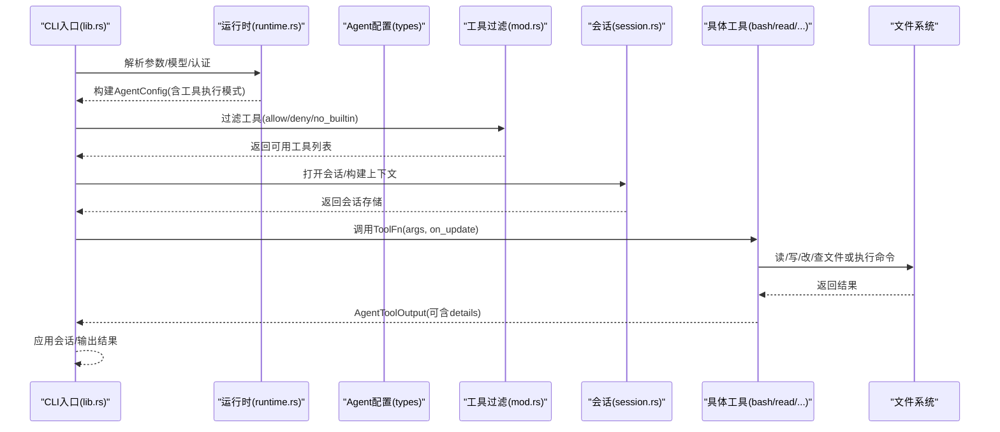

图示来源
- [crates/pi-coding-agent/src/lib.rs:83-334](file://crates/pi-coding-agent/src/lib.rs#L83-L334)
- [crates/pi-coding-agent/src/runtime.rs:62-131](file://crates/pi-coding-agent/src/runtime.rs#L62-L131)
- [crates/pi-coding-agent/src/tools/mod.rs:37-50](file://crates/pi-coding-agent/src/tools/mod.rs#L37-L50)
- [crates/pi-coding-agent/src/session.rs:89-138](file://crates/pi-coding-agent/src/session.rs#L89-L138)

## 详细组件分析

### 抽象层与注册机制
- 抽象层
  - AgentTool：包含 name、description、parameters（JSON Schema）、execute（ToolFn）、execution_mode
  - ToolFn：异步函数签名，接收参数与可选更新回调
  - ToolExecutionMode：顺序/并发两种执行模式
- 注册与过滤
  - builtin_tools 聚合所有内置工具
  - filter_tools 支持 allow/deny 列表、禁用全部/内置工具开关
- 运行时集成
  - default_cli_options 将内置工具注入到 CliRunOptions.tools
  - run_cli_with_options_and_stdin 在最终会话阶段传入工具集合

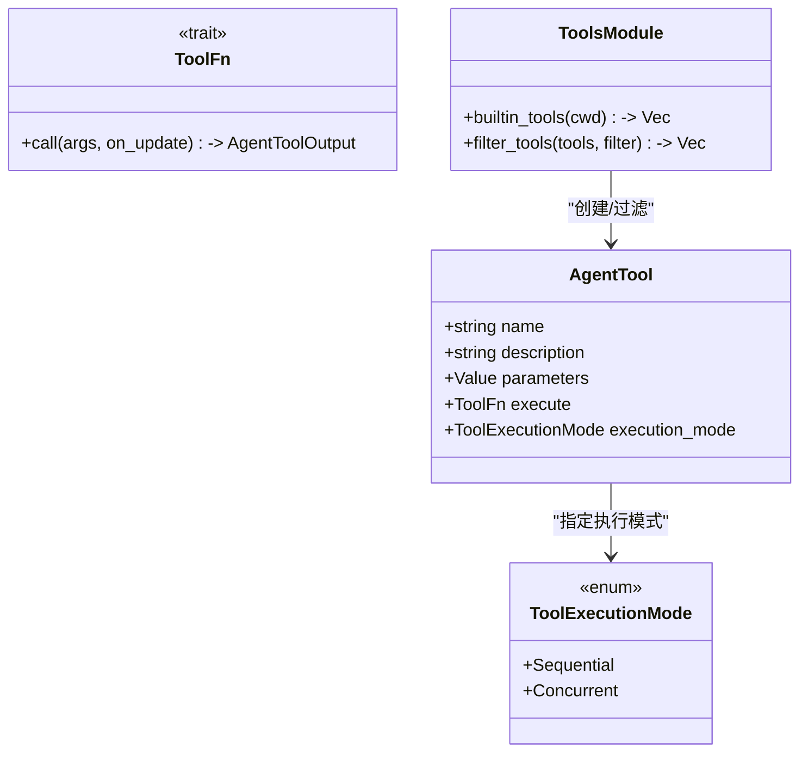

图示来源
- [crates/pi-agent-core/src/lib.rs:40-46](file://crates/pi-agent-core/src/lib.rs#L40-L46)
- [crates/pi-coding-agent/src/tools/mod.rs:17-50](file://crates/pi-coding-agent/src/tools/mod.rs#L17-L50)

章节来源
- [crates/pi-coding-agent/src/tools/mod.rs:17-50](file://crates/pi-coding-agent/src/tools/mod.rs#L17-L50)
- [crates/pi-coding-agent/src/lib.rs:74-81](file://crates/pi-coding-agent/src/lib.rs#L74-L81)

### 文件操作工具：读取(read)
- 功能要点
  - 解析参数：path、offset、limit
  - 路径解析：resolve_to_cwd
  - 读取文件：tokio::fs::read
  - 图像检测：根据扩展名判断是否为图像，headless 模式下提示不支持
  - 分页读取：基于 offset/limit 的行切片
  - 截断策略：truncate_head，支持首部截断与提示续读
- 输出格式
  - 文本块，必要时附加“继续阅读”提示或大小限制提示

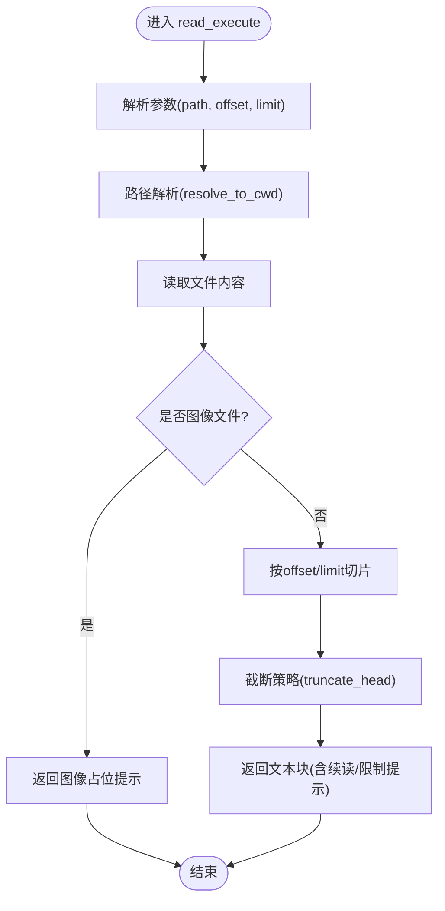

图示来源
- [crates/pi-coding-agent/src/tools/read.rs:64-159](file://crates/pi-coding-agent/src/tools/read.rs#L64-L159)
- [crates/pi-coding-agent/src/tools/path.rs:10-26](file://crates/pi-coding-agent/src/tools/path.rs#L10-L26)
- [crates/pi-coding-agent/src/tools/truncate.rs:75-133](file://crates/pi-coding-agent/src/tools/truncate.rs#L75-133)

章节来源
- [crates/pi-coding-agent/src/tools/read.rs:1-183](file://crates/pi-coding-agent/src/tools/read.rs#L1-L183)
- [crates/pi-coding-agent/src/tools/path.rs:1-58](file://crates/pi-coding-agent/src/tools/path.rs#L1-L58)
- [crates/pi-coding-agent/src/tools/truncate.rs:1-294](file://crates/pi-coding-agent/src/tools/truncate.rs#L1-L294)

### 文件操作工具：写入(write)
- 功能要点
  - 参数校验：path、content 必填
  - 路径解析：resolve_to_cwd
  - 目录创建：create_dir_all
  - 原子写入：with_file_mutation_queue 串行化同一文件的写入
  - 结果反馈：返回写入字节数
- 并发控制
  - 使用全局文件级互斥锁，保证同一文件写入串行化

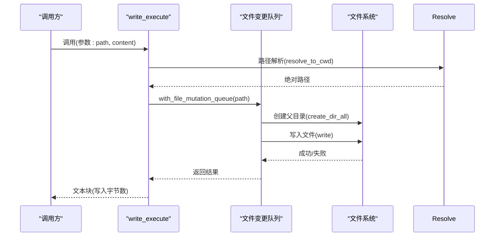

图示来源
- [crates/pi-coding-agent/src/tools/write.rs:61-87](file://crates/pi-coding-agent/src/tools/write.rs#L61-L87)
- [crates/pi-coding-agent/src/tools/file_mutation_queue.rs:56-71](file://crates/pi-coding-agent/src/tools/file_mutation_queue.rs#L56-L71)

章节来源
- [crates/pi-coding-agent/src/tools/write.rs:1-111](file://crates/pi-coding-agent/src/tools/write.rs#L1-L111)
- [crates/pi-coding-agent/src/tools/file_mutation_queue.rs:1-72](file://crates/pi-coding-agent/src/tools/file_mutation_queue.rs#L1-L72)

### 文件操作工具：编辑(edit)
- 功能要点
  - 输入解析：支持 edits 数组或旧/新文本对
  - 文本规范化：统一换行、去除 BOM、保留 CRLF
  - 匹配与去重：模糊匹配/精确匹配，要求每段 oldText 唯一且不重叠
  - 应用替换：从后向前替换，避免索引偏移
  - 输出差异：生成 diff 字符串与统一补丁
- 并发控制
  - 同文件串行化，读取-写入原子完成
- 错误处理
  - 未找到、重复出现、重叠替换、无变化等均给出明确错误信息

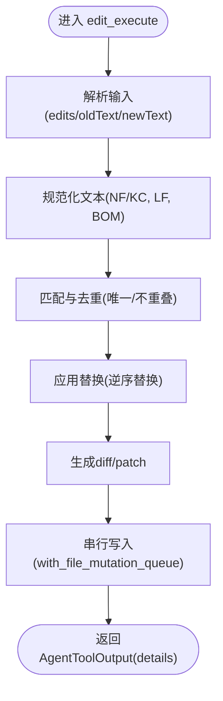

图示来源
- [crates/pi-coding-agent/src/tools/edit.rs:266-309](file://crates/pi-coding-agent/src/tools/edit.rs#L266-L309)
- [crates/pi-coding-agent/src/tools/edit_diff.rs:80-257](file://crates/pi-coding-agent/src/tools/edit_diff.rs#L80-L257)
- [crates/pi-coding-agent/src/tools/file_mutation_queue.rs:56-71](file://crates/pi-coding-agent/src/tools/file_mutation_queue.rs#L56-L71)

章节来源
- [crates/pi-coding-agent/src/tools/edit.rs:1-329](file://crates/pi-coding-agent/src/tools/edit.rs#L1-L329)
- [crates/pi-coding-agent/src/tools/edit_diff.rs:1-258](file://crates/pi-coding-agent/src/tools/edit_diff.rs#L1-L258)
- [crates/pi-coding-agent/src/tools/file_mutation_queue.rs:1-72](file://crates/pi-coding-agent/src/tools/file_mutation_queue.rs#L1-L72)

### 文件操作工具：列出(ls)、查找(find)
- ls
  - 读取目录条目，区分目录与文件，排序输出
  - 限制条目数量与输出大小，超过阈值提示增大 limit
- find
  - 基于 ignore 与 globset 进行递归遍历，尊重 .gitignore
  - 可按路径或基名匹配，限制结果数量与输出大小

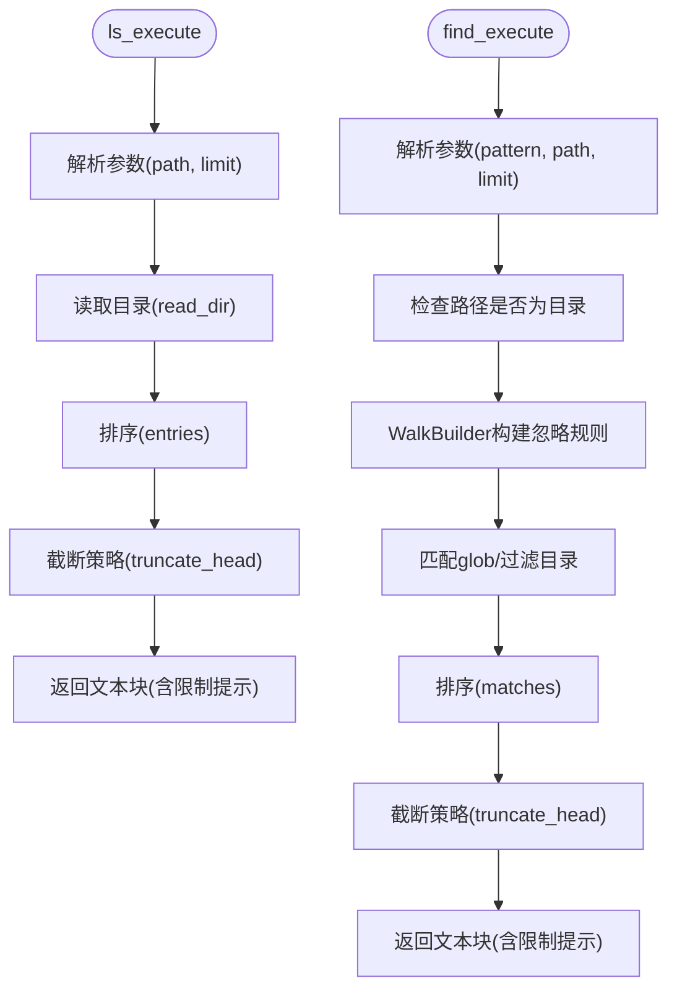

图示来源
- [crates/pi-coding-agent/src/tools/ls.rs:40-113](file://crates/pi-coding-agent/src/tools/ls.rs#L40-L113)
- [crates/pi-coding-agent/src/tools/find.rs:95-187](file://crates/pi-coding-agent/src/tools/find.rs#L95-L187)
- [crates/pi-coding-agent/src/tools/truncate.rs:75-133](file://crates/pi-coding-agent/src/tools/truncate.rs#L75-133)

章节来源
- [crates/pi-coding-agent/src/tools/ls.rs:1-128](file://crates/pi-coding-agent/src/tools/ls.rs#L1-L128)
- [crates/pi-coding-agent/src/tools/find.rs:1-202](file://crates/pi-coding-agent/src/tools/find.rs#L1-L202)
- [crates/pi-coding-agent/src/tools/truncate.rs:1-294](file://crates/pi-coding-agent/src/tools/truncate.rs#L1-L294)

### 搜索工具：内容检索(grep)
- 功能要点
  - 支持正则/字面量、大小写敏感、上下文行数、glob 过滤
  - 递归遍历，忽略 .git 与 node_modules 等目录
  - 限制匹配数量与输出大小，长行截断
- 输出
  - 每条匹配包含文件路径与行号，必要时附带上下文

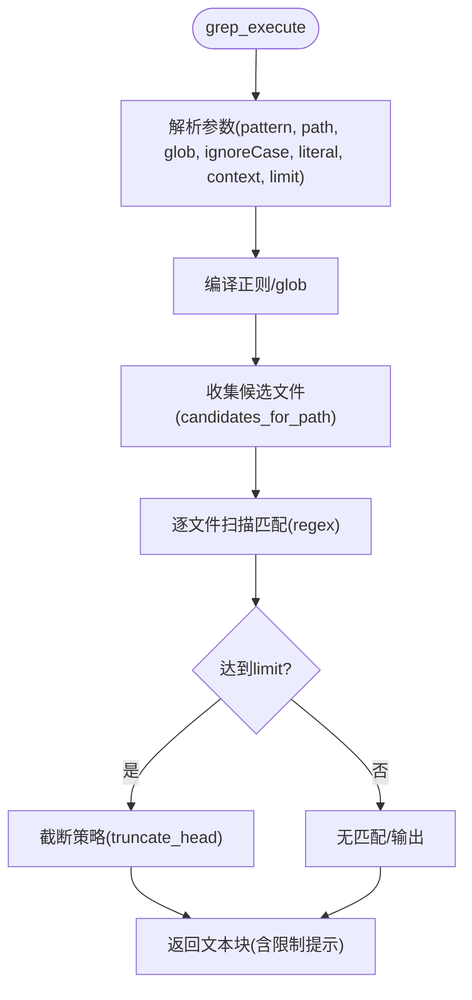

图示来源
- [crates/pi-coding-agent/src/tools/grep.rs:203-316](file://crates/pi-coding-agent/src/tools/grep.rs#L203-L316)
- [crates/pi-coding-agent/src/tools/truncate.rs:75-133](file://crates/pi-coding-agent/src/tools/truncate.rs#L75-133)

章节来源
- [crates/pi-coding-agent/src/tools/grep.rs:1-331](file://crates/pi-coding-agent/src/tools/grep.rs#L1-L331)
- [crates/pi-coding-agent/src/tools/truncate.rs:1-294](file://crates/pi-coding-agent/src/tools/truncate.rs#L1-L294)

### 命令执行工具：bash
- 功能要点
  - 支持自定义 shell 路径、命令前缀、spawn 钩子
  - 异步读取 stdout/stderr，边读边截断（尾部截断策略）
  - 超时控制：超时后终止进程树，合并剩余输出
  - 输出截断：默认 2000 行或 50KB，溢出提示
- 并发与安全
  - 进程组隔离（Unix），超时/异常时强制终止
  - 输出实时更新回调，便于 UI 实时展示

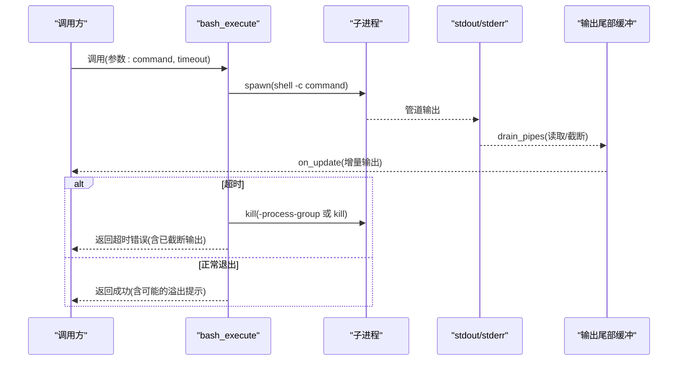

图示来源
- [crates/pi-coding-agent/src/tools/bash.rs:284-452](file://crates/pi-coding-agent/src/tools/bash.rs#L284-L452)
- [crates/pi-coding-agent/src/tools/truncate.rs:135-196](file://crates/pi-coding-agent/src/tools/truncate.rs#L135-L196)

章节来源
- [crates/pi-coding-agent/src/tools/bash.rs:1-521](file://crates/pi-coding-agent/src/tools/bash.rs#L1-L521)
- [crates/pi-coding-agent/src/tools/truncate.rs:1-294](file://crates/pi-coding-agent/src/tools/truncate.rs#L1-L294)

### 工具执行队列与并发控制
- 文件变更串行队列
  - 以文件真实路径为键，维护互斥锁，确保同一文件写入/编辑串行化
  - 清理策略：当队列对象仅被两个引用持有时清理映射项
- 工具执行模式
  - 通过 AgentTool.execution_mode 指定顺序或并发
  - bash 工具显式声明顺序执行，避免并发命令竞争

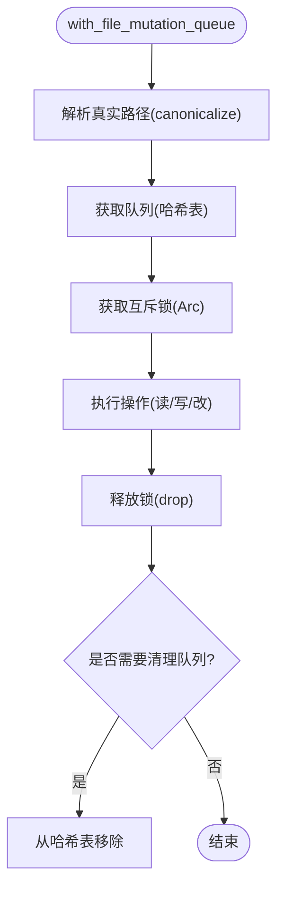

图示来源
- [crates/pi-coding-agent/src/tools/file_mutation_queue.rs:56-71](file://crates/pi-coding-agent/src/tools/file_mutation_queue.rs#L56-L71)

章节来源
- [crates/pi-coding-agent/src/tools/file_mutation_queue.rs:1-72](file://crates/pi-coding-agent/src/tools/file_mutation_queue.rs#L1-L72)
- [crates/pi-coding-agent/src/tools/bash.rs:513-520](file://crates/pi-coding-agent/src/tools/bash.rs#L513-L520)

### 工具接口标准化与扩展点
- 标准化接口
  - ToolFn：统一的异步执行入口
  - AgentTool：统一的元数据与执行模式
  - AgentToolOutput：统一的结果封装，支持 details 字段
- 扩展点
  - 工具注册：在 tools/mod.rs 中添加新工具
  - 执行模式：按需选择顺序或并发
  - 回调更新：on_update 支持增量输出
  - 参数校验：JSON Schema 保障输入合法性

章节来源
- [crates/pi-agent-core/src/lib.rs:40-46](file://crates/pi-agent-core/src/lib.rs#L40-L46)
- [crates/pi-coding-agent/src/tools/mod.rs:17-27](file://crates/pi-coding-agent/src/tools/mod.rs#L17-L27)

### 权限管理、安全沙箱与资源限制
- 权限与工作目录
  - 路径解析严格限定在当前工作目录范围内，避免越权访问
  - bash 执行时清空环境变量，仅注入必要环境，降低攻击面
- 安全沙箱
  - bash 在 Unix 上使用进程组隔离，超时/异常时强制终止整个进程树
  - 不允许交互式输入，标准输入设为 null
- 资源限制
  - 统一的截断策略：行数与字节数上限，避免内存与带宽压力
  - find/grep/ls 对结果数量进行限制并提示扩大

章节来源
- [crates/pi-coding-agent/src/tools/path.rs:10-26](file://crates/pi-coding-agent/src/tools/path.rs#L10-L26)
- [crates/pi-coding-agent/src/tools/bash.rs:314-339](file://crates/pi-coding-agent/src/tools/bash.rs#L314-L339)
- [crates/pi-coding-agent/src/tools/bash.rs:454-491](file://crates/pi-coding-agent/src/tools/bash.rs#L454-L491)
- [crates/pi-coding-agent/src/tools/truncate.rs:75-133](file://crates/pi-coding-agent/src/tools/truncate.rs#L75-L133)
- [crates/pi-coding-agent/src/tools/find.rs:157-184](file://crates/pi-coding-agent/src/tools/find.rs#L157-L184)
- [crates/pi-coding-agent/src/tools/grep.rs:296-313](file://crates/pi-coding-agent/src/tools/grep.rs#L296-L313)
- [crates/pi-coding-agent/src/tools/ls.rs:98-110](file://crates/pi-coding-agent/src/tools/ls.rs#L98-L110)

## 依赖关系分析
- 组件耦合
  - 工具模块依赖 path、truncate、file_mutation_queue、edit_diff 等基础设施
  - CLI 主流程依赖 runtime 与 session，再调用工具
- 外部依赖
  - ignore、globset、regex 用于文件遍历与匹配
  - tokio::fs/tokio::process 用于异步文件与进程操作
- 循环依赖
  - 未发现直接循环依赖；工具模块之间通过公共基础设施解耦

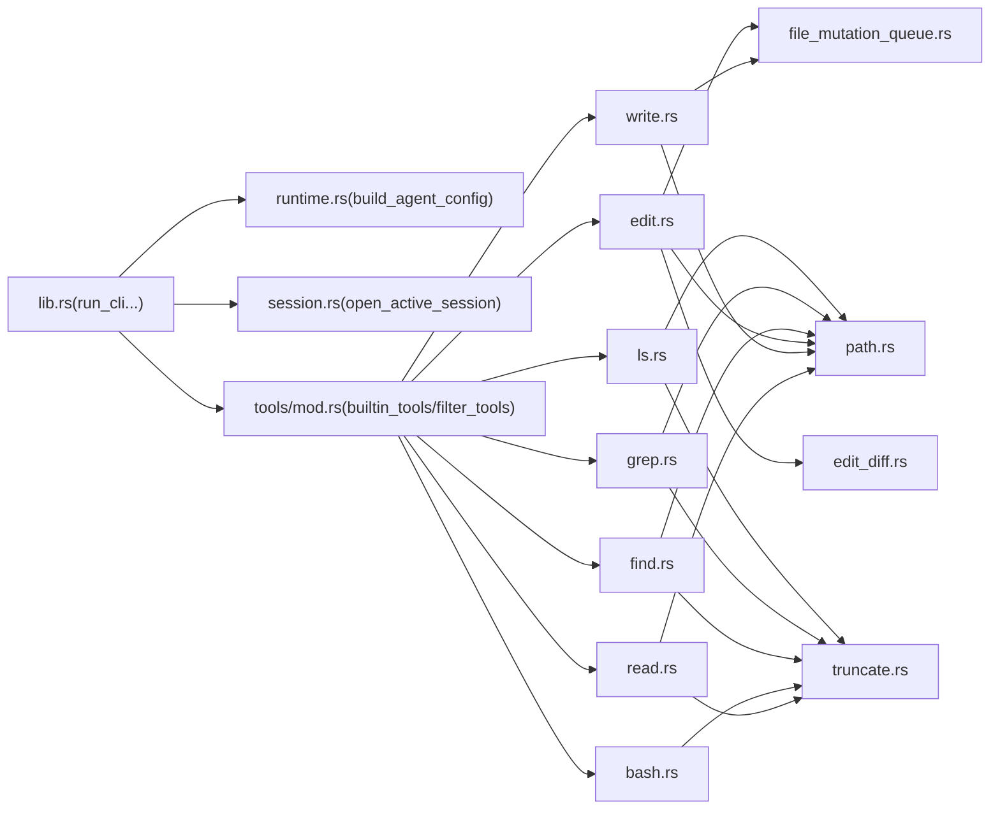

图示来源
- [crates/pi-coding-agent/src/lib.rs:83-334](file://crates/pi-coding-agent/src/lib.rs#L83-L334)
- [crates/pi-coding-agent/src/runtime.rs:143-188](file://crates/pi-coding-agent/src/runtime.rs#L143-188)
- [crates/pi-coding-agent/src/session.rs:89-138](file://crates/pi-coding-agent/src/session.rs#L89-L138)
- [crates/pi-coding-agent/src/tools/mod.rs:17-27](file://crates/pi-coding-agent/src/tools/mod.rs#L17-L27)

章节来源
- [crates/pi-coding-agent/src/lib.rs:1-352](file://crates/pi-coding-agent/src/lib.rs#L1-L352)
- [crates/pi-coding-agent/src/tools/mod.rs:1-51](file://crates/pi-coding-agent/src/tools/mod.rs#L1-L51)

## 性能考量
- I/O 与 CPU
  - 文件读取/写入/编辑采用 tokio 异步，避免阻塞
  - find/grep 递归遍历受 .gitignore 与忽略目录影响，建议缩小搜索范围
- 内存与带宽
  - 统一截断策略防止大输出占用过多内存与网络带宽
- 并发与吞吐
  - 文件写入/编辑通过串行队列保证一致性，避免竞态
  - bash 工具顺序执行，避免并发命令相互干扰

## 故障排查指南
- 工具参数错误
  - 缺少必填字段、类型不符、路径不存在等，工具内部会返回明确错误信息
- 文件相关错误
  - 读取/写入/编辑失败、权限不足、路径越界
- 搜索工具问题
  - glob/正则无效、结果过多/过大，参考工具输出中的限制提示调整参数
- bash 超时/信号
  - 超时会终止进程树并返回已截断输出；信号导致非零退出码
- 会话与运行时
  - 模型选择失败、API Key 解析错误、会话打开失败等

章节来源
- [crates/pi-coding-agent/src/tools/read.rs:54-61](file://crates/pi-coding-agent/src/tools/read.rs#L54-L61)
- [crates/pi-coding-agent/src/tools/write.rs:42-58](file://crates/pi-coding-agent/src/tools/write.rs#L42-L58)
- [crates/pi-coding-agent/src/tools/edit.rs:166-188](file://crates/pi-coding-agent/src/tools/edit.rs#L166-L188)
- [crates/pi-coding-agent/src/tools/grep.rs:228-236](file://crates/pi-coding-agent/src/tools/grep.rs#L228-L236)
- [crates/pi-coding-agent/src/tools/bash.rs:422-451](file://crates/pi-coding-agent/src/tools/bash.rs#L422-L451)
- [crates/pi-coding-agent/src/session.rs:89-138](file://crates/pi-coding-agent/src/session.rs#L89-L138)

## 结论
该工具系统以清晰的抽象层与标准化接口为核心，结合严格的路径解析、统一的截断策略与文件串行队列，实现了安全、可控且高性能的工具执行能力。内置工具覆盖文件读写编辑、目录浏览、文件查找与内容检索以及命令执行，满足常见开发场景需求。通过工具过滤与执行模式配置，系统具备良好的可扩展性与可运维性。

## 附录：自定义工具开发指南与最佳实践
- 开发步骤
  - 新建模块并在 tools/mod.rs 中导出工具构造函数
  - 实现 ToolFn：解析参数、执行业务逻辑、返回 AgentToolOutput
  - 如涉及文件写入/编辑，使用 with_file_mutation_queue 保证串行化
  - 设计 JSON Schema 参数校验，提供清晰的 description
- 接口规范
  - 使用 ToolExecutionMode 指定顺序或并发
  - 在需要时提供 on_update 回调，支持增量输出
  - 结果中通过 details 字段携带额外信息（如 diff、patch）
- 安全与资源
  - 严格使用 resolve_to_cwd 限定工作目录范围
  - 对外部命令执行（如 bash）设置超时与进程组隔离
  - 使用统一截断策略限制输出规模
- 错误处理与回滚
  - 明确的错误消息，区分输入错误、权限错误、资源错误
  - 对写入/编辑类操作，确保原子性；失败时不产生半成品文件
- 测试建议
  - 单元测试覆盖参数解析、边界条件、截断行为
  - 并发测试验证文件串行队列与 bash 超时/信号处理

章节来源
- [crates/pi-coding-agent/src/tools/mod.rs:17-27](file://crates/pi-coding-agent/src/tools/mod.rs#L17-L27)
- [crates/pi-coding-agent/src/tools/file_mutation_queue.rs:56-71](file://crates/pi-coding-agent/src/tools/file_mutation_queue.rs#L56-L71)
- [crates/pi-coding-agent/src/tools/truncate.rs:75-133](file://crates/pi-coding-agent/src/tools/truncate.rs#L75-L133)
- [crates/pi-coding-agent/src/tools/bash.rs:284-452](file://crates/pi-coding-agent/src/tools/bash.rs#L284-L452)