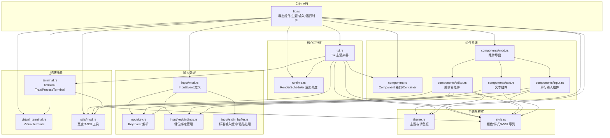
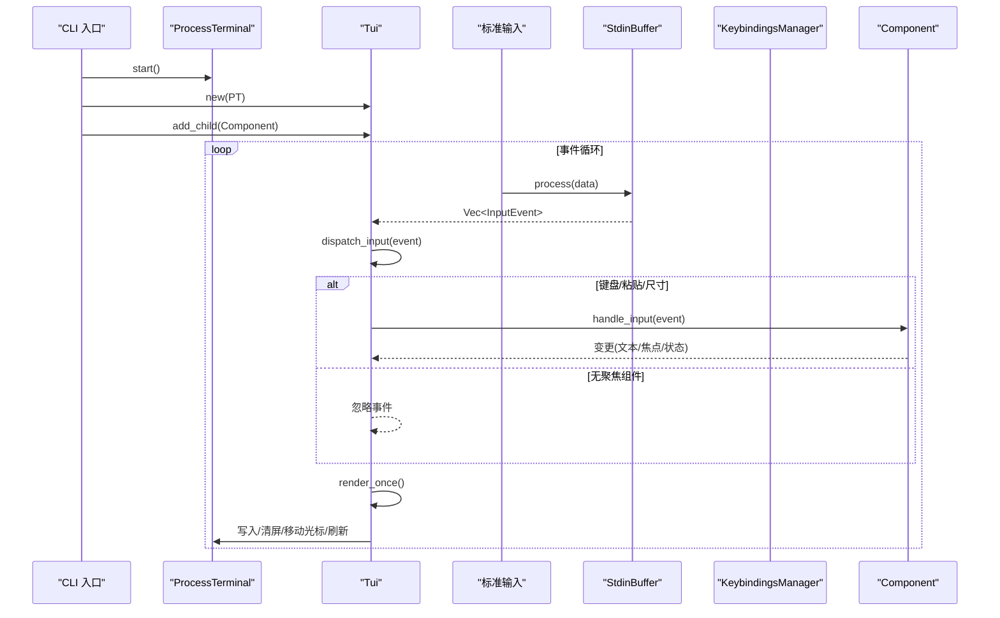
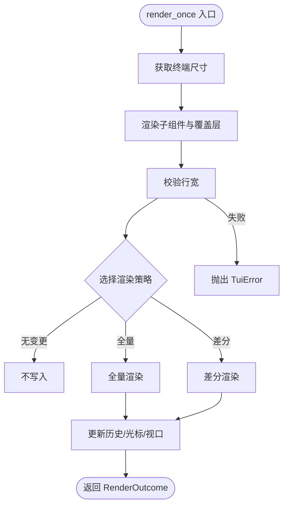
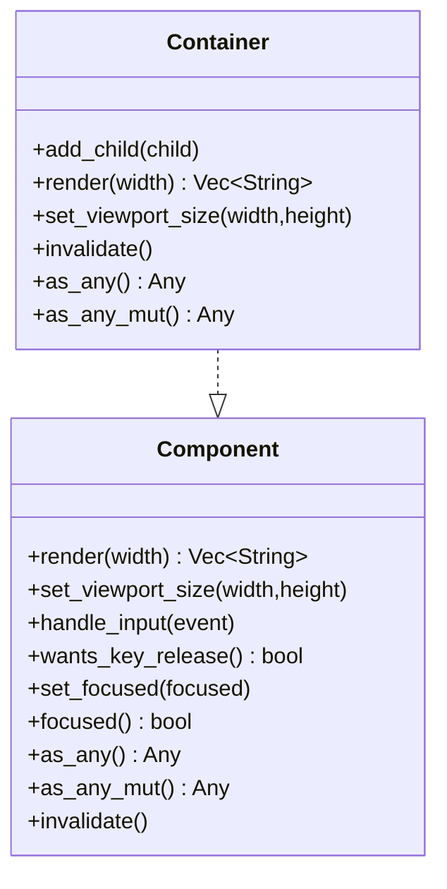
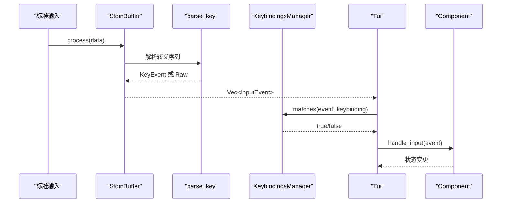
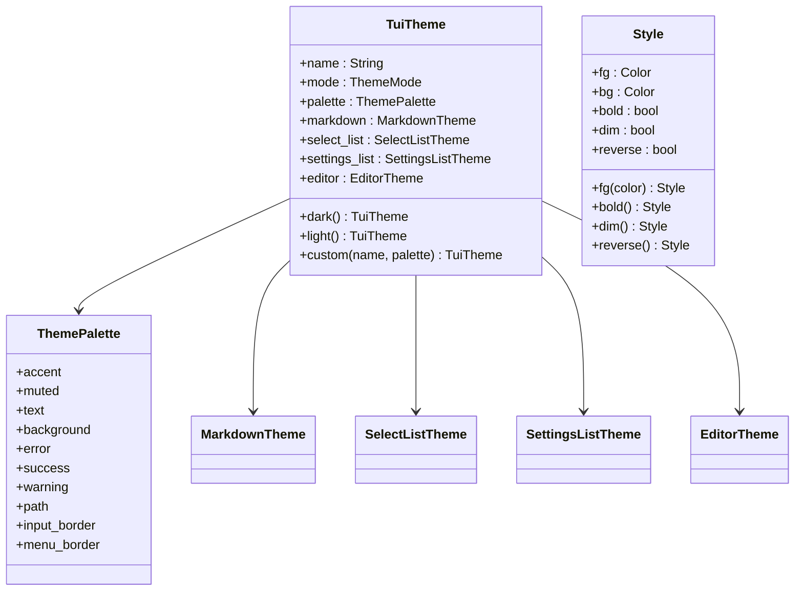
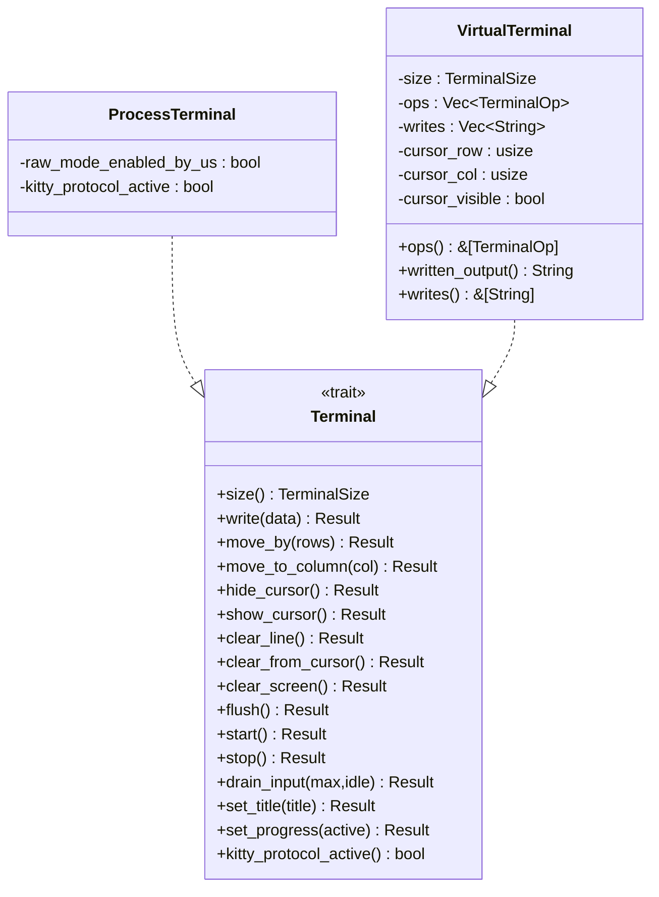
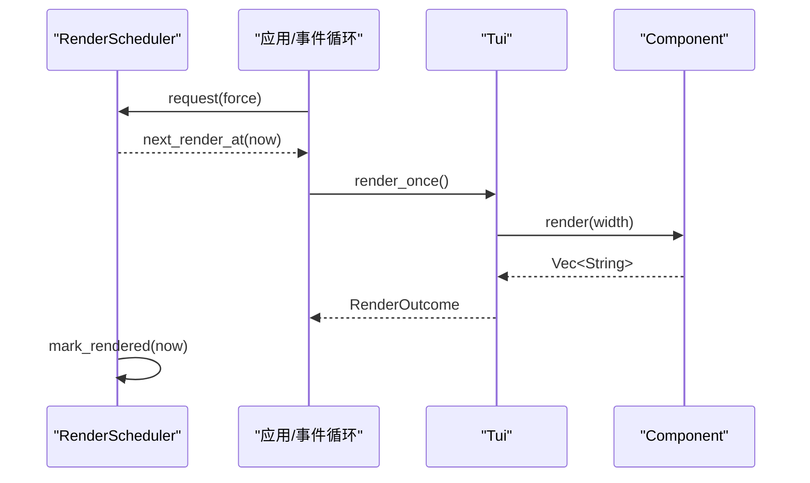
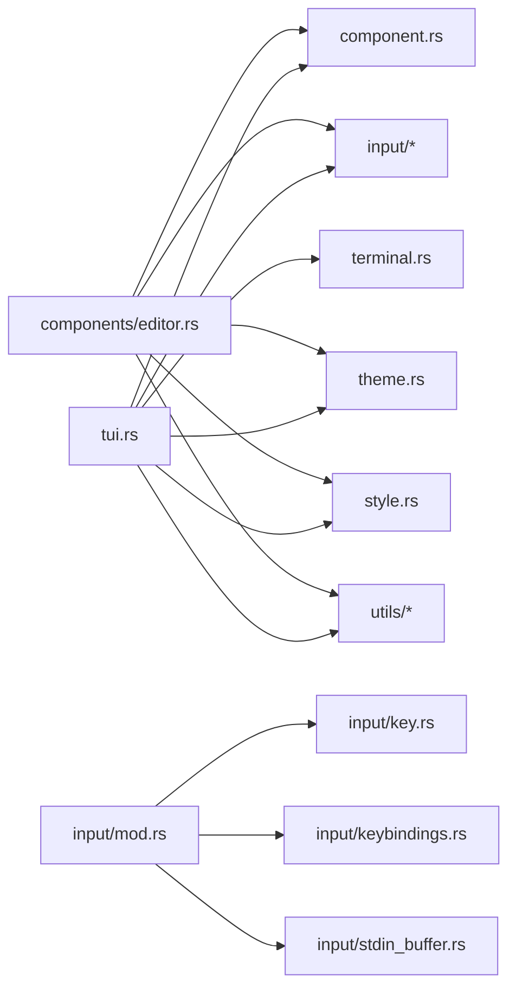

# TUI 架构

<cite>
**本文档引用的文件**
- [lib.rs](file://crates/pi-tui/src/lib.rs)
- [tui.rs](file://crates/pi-tui/src/tui.rs)
- [runtime.rs](file://crates/pi-tui/src/runtime.rs)
- [component.rs](file://crates/pi-tui/src/component.rs)
- [theme.rs](file://crates/pi-tui/src/theme.rs)
- [style.rs](file://crates/pi-tui/src/style.rs)
- [input/mod.rs](file://crates/pi-tui/src/input/mod.rs)
- [input/key.rs](file://crates/pi-tui/src/input/key.rs)
- [input/keybindings.rs](file://crates/pi-tui/src/input/keybindings.rs)
- [input/stdin_buffer.rs](file://crates/pi-tui/src/input/stdin_buffer.rs)
- [components/mod.rs](file://crates/pi-tui/src/components/mod.rs)
- [components/editor.rs](file://crates/pi-tui/src/components/editor.rs)
- [components/input.rs](file://crates/pi-tui/src/components/input.rs)
- [components/text.rs](file://crates/pi-tui/src/components/text.rs)
- [terminal.rs](file://crates/pi-tui/src/terminal.rs)
- [virtual_terminal.rs](file://crates/pi-tui/src/virtual_terminal.rs)
- [utils/mod.rs](file://crates/pi-tui/src/utils/mod.rs)
</cite>

## 目录
1. [引言](#引言)
2. [项目结构](#项目结构)
3. [核心组件](#核心组件)
4. [架构总览](#架构总览)
5. [详细组件分析](#详细组件分析)
6. [依赖关系分析](#依赖关系分析)
7. [性能考虑](#性能考虑)
8. [故障排除指南](#故障排除指南)
9. [结论](#结论)
10. [附录](#附录)

## 引言
本文件为 pi-tui 的终端用户界面（TUI）架构文档，面向希望理解并扩展该 TUI 系统的开发者。内容涵盖组件系统、渲染策略、输入处理、主题与样式、终端兼容性、状态管理与异步渲染等关键方面，并通过架构图与流程图直观展示 TUI 与 CLI 的集成关系及内部交互。

## 项目结构
pi-tui crate 提供了完整的 TUI 能力：组件模型、输入解析与键位绑定、主题与样式、终端抽象与虚拟终端、以及渲染调度器。对外通过 lib.rs 暴露统一 API，内部模块按职责分层组织。

**图表来源**
- [lib.rs:1-61](file://crates/pi-tui/src/lib.rs#L1-L61)
- [tui.rs:52-72](file://crates/pi-tui/src/tui.rs#L52-L72)
- [runtime.rs:4-59](file://crates/pi-tui/src/runtime.rs#L4-L59)
- [component.rs:3-29](file://crates/pi-tui/src/component.rs#L3-L29)
- [components/mod.rs:1-26](file://crates/pi-tui/src/components/mod.rs#L1-L26)
- [input/mod.rs:12-19](file://crates/pi-tui/src/input/mod.rs#L12-L19)
- [input/key.rs:48-84](file://crates/pi-tui/src/input/key.rs#L48-L84)
- [input/keybindings.rs:21-63](file://crates/pi-tui/src/input/keybindings.rs#L21-L63)
- [input/stdin_buffer.rs:60-118](file://crates/pi-tui/src/input/stdin_buffer.rs#L60-L118)
- [theme.rs:156-228](file://crates/pi-tui/src/theme.rs#L156-L228)
- [style.rs:113-148](file://crates/pi-tui/src/style.rs#L113-L148)
- [terminal.rs:15-50](file://crates/pi-tui/src/terminal.rs#L15-L50)
- [virtual_terminal.rs:27-36](file://crates/pi-tui/src/virtual_terminal.rs#L27-L36)
- [utils/mod.rs:4-7](file://crates/pi-tui/src/utils/mod.rs#L4-L7)

**章节来源**
- [lib.rs:1-61](file://crates/pi-tui/src/lib.rs#L1-L61)
- [components/mod.rs:1-26](file://crates/pi-tui/src/components/mod.rs#L1-L26)
- [input/mod.rs:12-19](file://crates/pi-tui/src/input/mod.rs#L12-L19)
- [theme.rs:156-228](file://crates/pi-tui/src/theme.rs#L156-L228)
- [style.rs:113-148](file://crates/pi-tui/src/style.rs#L113-L148)
- [terminal.rs:15-50](file://crates/pi-tui/src/terminal.rs#L15-L50)
- [virtual_terminal.rs:27-36](file://crates/pi-tui/src/virtual_terminal.rs#L27-L36)
- [utils/mod.rs:4-7](file://crates/pi-tui/src/utils/mod.rs#L4-L7)

## 核心组件
- 组件接口与容器
  - Component trait 定义渲染、输入处理、焦点管理、失效通知等能力；Container 实现组合渲染与传播。
- Tui 主渲染器
  - 负责子组件与覆盖层的布局、渲染策略选择、硬件光标定位与同步刷新。
- 输入系统
  - InputEvent 抽象键盘、粘贴、原始序列与终端尺寸变化；StdinBuffer 解析转义序列、处理粘贴块与超时；Key/Keybindings 提供跨终端键码解析与键位绑定匹配。
- 主题与样式
  - TuiTheme/ThemePalette 定义主题；Style/Color 支持 ANSI/256/真彩；自动检测终端颜色等级。
- 终端抽象
  - Terminal Trait 抽象输出操作；ProcessTerminal 实际写入；VirtualTerminal 用于测试与模拟。
- 运行时调度
  - RenderScheduler 控制最小渲染间隔、强制刷新与待渲染标记。

**章节来源**
- [component.rs:3-29](file://crates/pi-tui/src/component.rs#L3-L29)
- [component.rs:31-82](file://crates/pi-tui/src/component.rs#L31-L82)
- [tui.rs:52-72](file://crates/pi-tui/src/tui.rs#L52-L72)
- [input/mod.rs:12-19](file://crates/pi-tui/src/input/mod.rs#L12-L19)
- [input/stdin_buffer.rs:60-118](file://crates/pi-tui/src/input/stdin_buffer.rs#L60-L118)
- [input/key.rs:48-84](file://crates/pi-tui/src/input/key.rs#L48-L84)
- [input/keybindings.rs:21-63](file://crates/pi-tui/src/input/keybindings.rs#L21-L63)
- [theme.rs:156-228](file://crates/pi-tui/src/theme.rs#L156-L228)
- [style.rs:113-148](file://crates/pi-tui/src/style.rs#L113-L148)
- [terminal.rs:15-50](file://crates/pi-tui/src/terminal.rs#L15-L50)
- [virtual_terminal.rs:27-36](file://crates/pi-tui/src/virtual_terminal.rs#L27-L36)
- [runtime.rs:4-59](file://crates/pi-tui/src/runtime.rs#L4-L59)

## 架构总览
下图展示了 TUI 与 CLI 的集成关系：CLI 启动后初始化 ProcessTerminal，创建 Tui 并注册组件；事件循环从 stdin 读取并通过 StdinBuffer 解析为 InputEvent，派发到当前聚焦组件；Tui 根据渲染策略将组件输出写入终端或虚拟终端。

**图表来源**
- [terminal.rs:72-146](file://crates/pi-tui/src/terminal.rs#L72-L146)
- [tui.rs:223-235](file://crates/pi-tui/src/tui.rs#L223-L235)
- [tui.rs:287-320](file://crates/pi-tui/src/tui.rs#L287-L320)
- [input/stdin_buffer.rs:60-118](file://crates/pi-tui/src/input/stdin_buffer.rs#L60-L118)
- [input/keybindings.rs:31-63](file://crates/pi-tui/src/input/keybindings.rs#L31-L63)

## 详细组件分析

### Tui 主渲染器
- 角色与职责
  - 管理子组件与覆盖层，维护焦点与视口；根据上次渲染结果与当前内容选择全量/差分/无变更渲染策略；控制硬件光标位置与可见性；支持内联与清屏两种渲染表面。
- 关键数据结构
  - RenderStrategy: 全量重绘、差分重绘、无变更。
  - RenderSurface: 内联/清屏。
  - OverlayEntry: 覆盖层条目（组件、选项、隐藏状态、恢复焦点）。
- 渲染流程
  - 计算每帧输出行，合成覆盖层，选择策略，执行全量/差分写入，更新历史行与光标状态。
- 错误处理
  - 行宽校验，防止超过终端宽度导致渲染异常。
- 性能要点
  - 首次渲染与尺寸变化触发全量；内容未变且尺寸不变时走差分；差分仅重写首处变更行起的若干行，减少闪烁与 I/O。

**图表来源**
- [tui.rs:287-320](file://crates/pi-tui/src/tui.rs#L287-L320)
- [tui.rs:395-408](file://crates/pi-tui/src/tui.rs#L395-L408)
- [tui.rs:410-531](file://crates/pi-tui/src/tui.rs#L410-L531)
- [tui.rs:611-624](file://crates/pi-tui/src/tui.rs#L611-L624)

**章节来源**
- [tui.rs:52-72](file://crates/pi-tui/src/tui.rs#L52-L72)
- [tui.rs:113-138](file://crates/pi-tui/src/tui.rs#L113-L138)
- [tui.rs:140-200](file://crates/pi-tui/src/tui.rs#L140-L200)
- [tui.rs:223-235](file://crates/pi-tui/src/tui.rs#L223-L235)
- [tui.rs:287-320](file://crates/pi-tui/src/tui.rs#L287-L320)
- [tui.rs:395-408](file://crates/pi-tui/src/tui.rs#L395-L408)
- [tui.rs:410-531](file://crates/pi-tui/src/tui.rs#L410-L531)
- [tui.rs:611-624](file://crates/pi-tui/src/tui.rs#L611-L624)

### 组件接口与生命周期
- Component trait
  - render(width): 返回多行字符串；set_viewport_size(height,width)；handle_input(event)；wants_key_release/focused/set_focused；invalidate；as_any/as_any_mut 支持类型转换。
  - Container 实现组合渲染与传播 set_viewport_size/invalidate。
- 生命周期
  - 创建 -> 设置视口 -> 多次渲染 -> 输入处理 -> 失效通知 -> 渲染更新 -> 销毁清理。
- 焦点管理
  - Tui.set_focus 切换聚焦组件，调用组件 set_focused(true/false)。

**图表来源**
- [component.rs:3-29](file://crates/pi-tui/src/component.rs#L3-L29)
- [component.rs:31-82](file://crates/pi-tui/src/component.rs#L31-L82)

**章节来源**
- [component.rs:3-29](file://crates/pi-tui/src/component.rs#L3-L29)
- [component.rs:31-82](file://crates/pi-tui/src/component.rs#L31-L82)

### 输入处理系统与键位绑定
- InputEvent
  - 键盘事件、粘贴块、原始转义序列、终端尺寸变化。
- StdinBuffer
  - 解析转义序列长度，识别粘贴块，空闲超时驱动残留事件发出；支持禁用超时以手动 flush。
- 键解析
  - parse_key 支持 Kitty CSI-u、传统 CSI/SS3、控制字符映射与未知序列降级为 Raw。
- 键位绑定
  - KeybindingsManager 基于默认定义与用户配置生成键集合，检测冲突；提供 matches 匹配与描述查询。

**图表来源**
- [input/stdin_buffer.rs:60-118](file://crates/pi-tui/src/input/stdin_buffer.rs#L60-L118)
- [input/key.rs:48-84](file://crates/pi-tui/src/input/key.rs#L48-L84)
- [input/keybindings.rs:31-63](file://crates/pi-tui/src/input/keybindings.rs#L31-L63)
- [tui.rs:223-235](file://crates/pi-tui/src/tui.rs#L223-L235)

**章节来源**
- [input/mod.rs:12-19](file://crates/pi-tui/src/input/mod.rs#L12-L19)
- [input/stdin_buffer.rs:60-118](file://crates/pi-tui/src/input/stdin_buffer.rs#L60-L118)
- [input/key.rs:48-84](file://crates/pi-tui/src/input/key.rs#L48-L84)
- [input/keybindings.rs:21-63](file://crates/pi-tui/src/input/keybindings.rs#L21-L63)

### 主题系统与样式
- 主题
  - TuiTheme 包含模式、调色板与各组件主题（Markdown/SelectList/SettingsList/Editor）；提供深色/浅色工厂方法与自定义构造。
  - ThemePalette 定义强调色、文本、背景、错误、成功、警告、路径、边框等。
- 样式
  - Style/Color 支持前景/背景色、粗体/弱化/反显；paint/paint_with/paint_with_level 生成 ANSI 序列；color_enabled/detect_color_level_from_env 自动探测终端颜色等级。
- 使用
  - 组件在渲染时应用主题样式，确保跨终端一致性与可读性。

**图表来源**
- [theme.rs:156-228](file://crates/pi-tui/src/theme.rs#L156-L228)
- [theme.rs:10-54](file://crates/pi-tui/src/theme.rs#L10-L54)
- [style.rs:69-111](file://crates/pi-tui/src/style.rs#L69-L111)

**章节来源**
- [theme.rs:156-228](file://crates/pi-tui/src/theme.rs#L156-L228)
- [style.rs:113-148](file://crates/pi-tui/src/style.rs#L113-L148)
- [style.rs:156-224](file://crates/pi-tui/src/style.rs#L156-L224)

### 终端抽象与兼容性
- Terminal Trait
  - 封装尺寸、写入、光标移动、清屏、刷新、标题设置、进度指示、协议状态等。
- ProcessTerminal
  - 实际终端实现：启用/禁用 raw 模式、发送同步/协议序列、隐藏/显示光标、清屏与刷新。
- VirtualTerminal
  - 测试用虚拟终端：记录操作序列与游标状态，计算已写输出，便于断言。
- 颜色等级检测
  - 依据环境变量与终端程序名自动判定 ANSI16/256/TrueColor 能力，避免在 dumb 终端输出彩色。

**图表来源**
- [terminal.rs:15-50](file://crates/pi-tui/src/terminal.rs#L15-L50)
- [terminal.rs:72-146](file://crates/pi-tui/src/terminal.rs#L72-L146)
- [virtual_terminal.rs:27-36](file://crates/pi-tui/src/virtual_terminal.rs#L27-L36)
- [virtual_terminal.rs:152-246](file://crates/pi-tui/src/virtual_terminal.rs#L152-L246)

**章节来源**
- [terminal.rs:15-50](file://crates/pi-tui/src/terminal.rs#L15-L50)
- [terminal.rs:72-146](file://crates/pi-tui/src/terminal.rs#L72-L146)
- [virtual_terminal.rs:27-36](file://crates/pi-tui/src/virtual_terminal.rs#L27-L36)
- [virtual_terminal.rs:152-246](file://crates/pi-tui/src/virtual_terminal.rs#L152-L246)
- [style.rs:156-224](file://crates/pi-tui/src/style.rs#L156-L224)

### 组件复用模式与状态管理
- 组件复用
  - Container 组合多个子组件，统一传播视口大小与失效；组件通过 as_any/as_any_mut 进行类型安全转换。
- 状态管理
  - Editor/Input 等组件内部维护文本、光标、历史、撤销栈、自动补全状态等；通过回调（on_submit/on_change）与外部通信。
- 异步渲染机制
  - RenderScheduler 控制渲染节流：最小间隔、强制刷新标记、待渲染标记；由上层事件循环或任务调度器驱动。

**图表来源**
- [runtime.rs:11-59](file://crates/pi-tui/src/runtime.rs#L11-L59)
- [tui.rs:287-320](file://crates/pi-tui/src/tui.rs#L287-L320)

**章节来源**
- [component.rs:31-82](file://crates/pi-tui/src/component.rs#L31-L82)
- [components/editor.rs:48-79](file://crates/pi-tui/src/components/editor.rs#L48-L79)
- [components/input.rs:7-14](file://crates/pi-tui/src/components/input.rs#L7-L14)
- [runtime.rs:11-59](file://crates/pi-tui/src/runtime.rs#L11-L59)

## 依赖关系分析
- 模块耦合
  - tui.rs 依赖 component.rs、input/*、theme.rs、style.rs、terminal.rs、utils/*；components/* 依赖 component.rs、input/*、theme.rs、style.rs、utils/*。
- 外部依赖
  - crossterm 用于实际终端控制；unicode_segmentation 用于图形单元边界处理；bitflags 用于修饰键位掩码。
- 循环依赖
  - 通过 trait 边界与模块导出避免直接循环；组件与输入/主题解耦，经 Tui 协调。

**图表来源**
- [tui.rs:4-8](file://crates/pi-tui/src/tui.rs#L4-L8)
- [components/editor.rs:10-13](file://crates/pi-tui/src/components/editor.rs#L10-L13)
- [input/mod.rs:5-10](file://crates/pi-tui/src/input/mod.rs#L5-L10)

**章节来源**
- [tui.rs:4-8](file://crates/pi-tui/src/tui.rs#L4-L8)
- [components/editor.rs:10-13](file://crates/pi-tui/src/components/editor.rs#L10-L13)
- [input/mod.rs:5-10](file://crates/pi-tui/src/input/mod.rs#L5-L10)

## 性能考虑
- 渲染策略
  - 首次渲染与尺寸变化触发全量；内容未变时走差分，仅重写首处变更行起的若干行，降低 I/O 与闪烁。
- 文本处理
  - 使用图形单元边界进行插入/删除，保证多字节字符与 emoji 的正确性；行宽与可见宽度计算避免越界。
- 输入解析
  - StdinBuffer 对转义序列进行惰性解析，粘贴块使用 bracketed paste，减少中间态事件；空闲超时避免阻塞。
- 颜色与样式
  - 自动探测颜色等级，避免在 dumb 终端输出彩色序列；ANSI 序列拼接最小化。
- 终端协议
  - 使用同步序列与协议开关，确保渲染原子性与一致性。

[本节为通用指导，无需特定文件引用]

## 故障排除指南
- 渲染错误：行宽过宽
  - 现象：渲染时报错，指出某行超出最大宽度。
  - 处理：检查组件输出是否包含不可见控制序列导致可见宽度误判；对长行进行截断或换行。
  - 参考：行宽校验逻辑与错误类型定义。
- 键盘事件未响应
  - 现象：按键无反应或被忽略。
  - 处理：确认聚焦组件存在；检查 wants_key_release 与事件类型（Release 是否被过滤）；核对键位绑定配置与冲突。
- 粘贴内容异常
  - 现象：粘贴块未完整或出现乱码。
  - 处理：确保终端支持 bracketed paste；检查 StdinBuffer 的 paste 状态与残留处理。
- 颜色显示异常
  - 现象：终端无彩色或颜色不正确。
  - 处理：检查环境变量与终端程序名；验证 color_enabled/color_level 的探测结果。

**章节来源**
- [tui.rs:611-624](file://crates/pi-tui/src/tui.rs#L611-L624)
- [input/stdin_buffer.rs:60-118](file://crates/pi-tui/src/input/stdin_buffer.rs#L60-L118)
- [input/key.rs:101-109](file://crates/pi-tui/src/input/key.rs#L101-L109)
- [input/keybindings.rs:31-63](file://crates/pi-tui/src/input/keybindings.rs#L31-L63)
- [style.rs:156-224](file://crates/pi-tui/src/style.rs#L156-L224)

## 结论
pi-tui 采用清晰的组件化架构与严格的渲染策略，结合强大的输入解析与键位绑定、灵活的主题与样式系统、以及对多终端的颜色与协议兼容，提供了高性能、可扩展、易维护的 TUI 能力。通过 RenderScheduler 与差分渲染，系统在复杂交互场景下仍能保持流畅体验；通过 VirtualTerminal 与工具函数，测试与调试更加便捷。

## 附录
- 组件清单（导出）
  - 编辑器、输入框、文本、Markdown、选择列表、设置列表、对话框、图像、加载器、盒子、间距、截断文本等。
- 关键 API 路径
  - [组件接口:3-29](file://crates/pi-tui/src/component.rs#L3-L29)
  - [Tui 主渲染器:52-72](file://crates/pi-tui/src/tui.rs#L52-L72)
  - [输入事件与解析:12-19](file://crates/pi-tui/src/input/mod.rs#L12-L19)
  - [键位绑定管理:21-63](file://crates/pi-tui/src/input/keybindings.rs#L21-L63)
  - [主题与样式:156-228](file://crates/pi-tui/src/theme.rs#L156-L228)
  - [终端抽象:15-50](file://crates/pi-tui/src/terminal.rs#L15-L50)
  - [虚拟终端:27-36](file://crates/pi-tui/src/virtual_terminal.rs#L27-L36)
  - [渲染调度器:4-59](file://crates/pi-tui/src/runtime.rs#L4-L59)