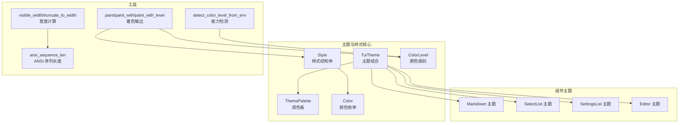
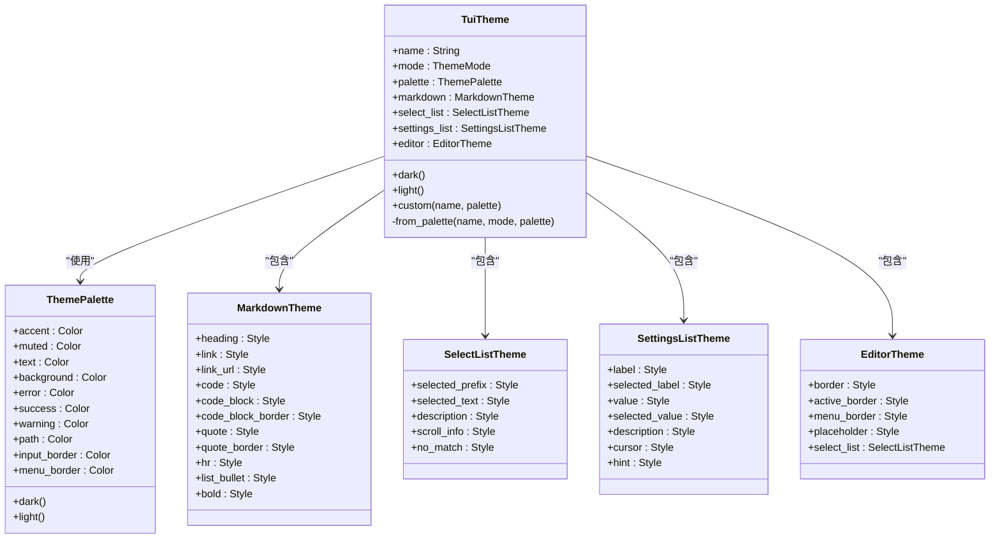
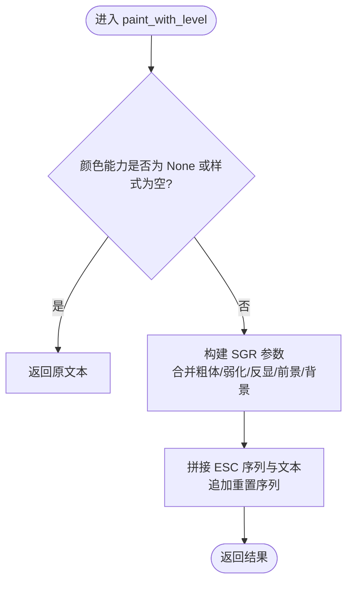
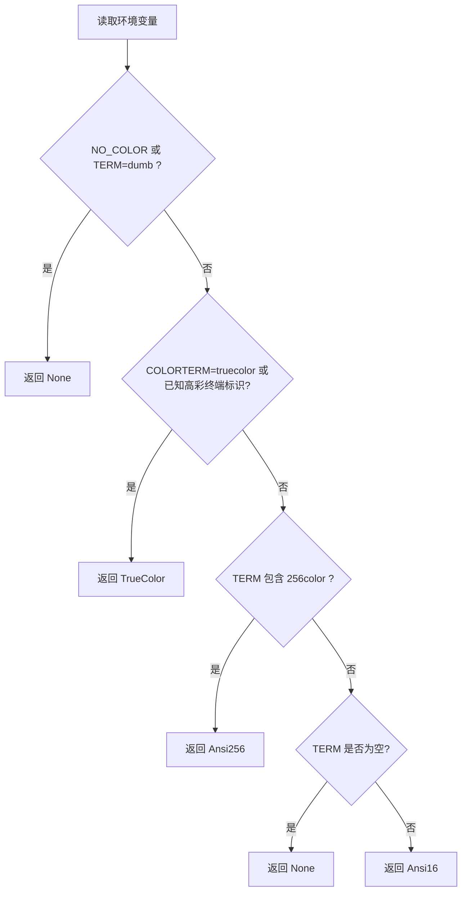
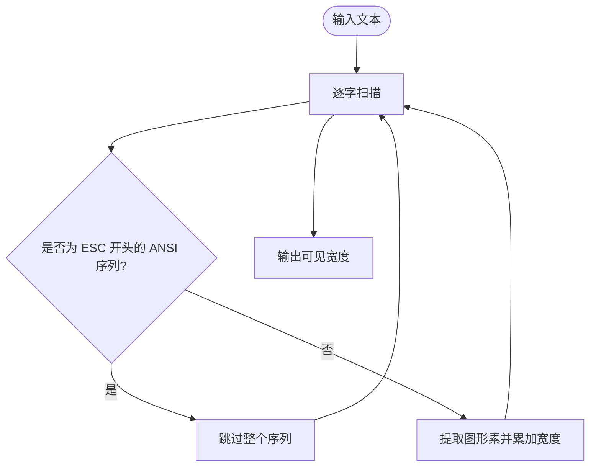
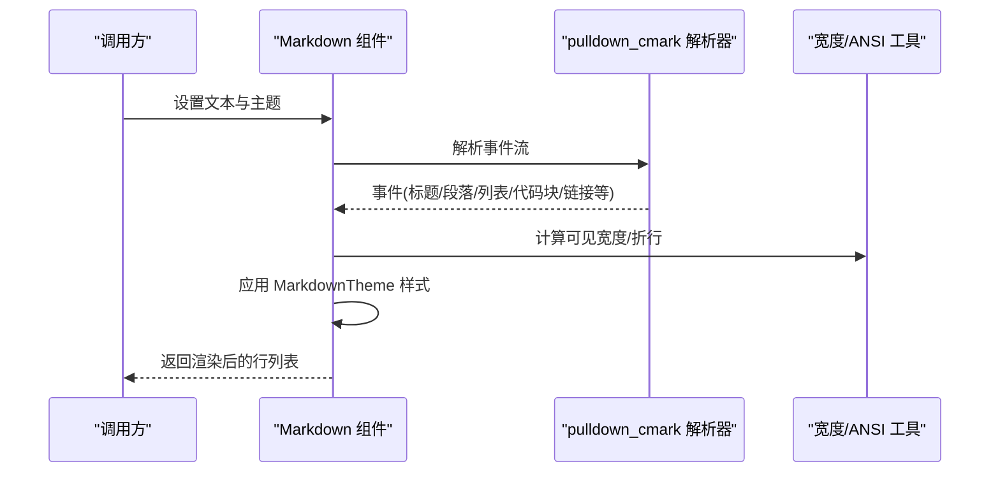
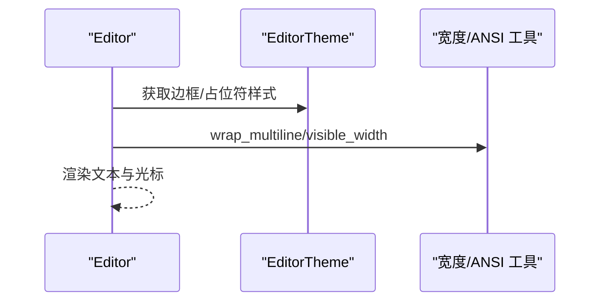
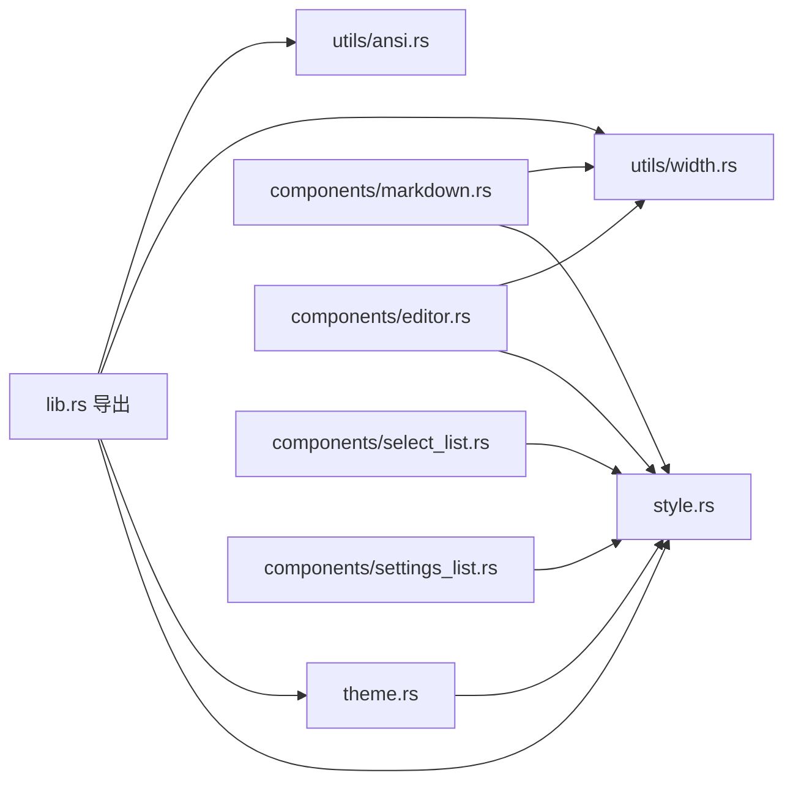

# 主题与样式系统

<cite>
**本文档引用的文件**
- [theme.rs](file://crates/pi-tui/src/theme.rs)
- [style.rs](file://crates/pi-tui/src/style.rs)
- [ansi.rs](file://crates/pi-tui/src/utils/ansi.rs)
- [width.rs](file://crates/pi-tui/src/utils/width.rs)
- [markdown.rs](file://crates/pi-tui/src/components/markdown.rs)
- [editor.rs](file://crates/pi-tui/src/components/editor.rs)
- [select_list.rs](file://crates/pi-tui/src/components/select_list.rs)
- [settings_list.rs](file://crates/pi-tui/src/components/settings_list.rs)
- [lib.rs](file://crates/pi-tui/src/lib.rs)
- [resources.rs](file://crates/pi-coding-agent/src/resources.rs)
- [theme.rs（测试）](file://crates/pi-tui/tests/theme.rs)
- [style.rs（测试）](file://crates/pi-tui/tests/style.rs)
- [2026-06-20-m11-color-capabilities.md](file://docs/superpowers/plans/2026-06-20-m11-color-capabilities.md)
- [TUI_INTERACTION_ROADMAP.md](file://docs/TUI_INTERACTION_ROADMAP.md)
</cite>

## 目录
1. [简介](#简介)
2. [项目结构](#项目结构)
3. [核心组件](#核心组件)
4. [架构总览](#架构总览)
5. [详细组件分析](#详细组件分析)
6. [依赖关系分析](#依赖关系分析)
7. [性能考量](#性能考量)
8. [故障排除指南](#故障排除指南)
9. [结论](#结论)
10. [附录](#附录)

## 简介
本文件系统化阐述 pi-tui 的主题与样式体系，围绕 TuiTheme 的主题架构、Color 与 Style 的设计模式、ThemePalette 的颜色管理机制展开；同时覆盖 ANSI 转义序列处理、颜色级别检测与终端兼容策略，并给出 Markdown 渲染主题、编辑器主题与列表组件主题的定制方法，以及动态主题切换、颜色感知与无障碍支持的实现建议。文档还提供主题开发指南与样式最佳实践，帮助解决颜色显示异常、宽度计算与跨平台一致性等常见问题。

## 项目结构
主题与样式系统主要分布在以下模块：
- 核心定义：theme.rs（主题与调色板）、style.rs（颜色与样式、颜色能力检测）
- 组件主题应用：components/markdown.rs、components/editor.rs、components/select_list.rs、components/settings_list.rs
- 宽度与 ANSI 处理：utils/width.rs、utils/ansi.rs
- 公开 API 导出：src/lib.rs
- 主题资源加载与合并：crates/pi-coding-agent/src/resources.rs
- 测试用例：crates/pi-tui/tests/theme.rs、crates/pi-tui/tests/style.rs
- 规划文档：docs/superpowers/plans/2026-06-20-m11-color-capabilities.md
- 交互路线图：docs/TUI_INTERACTION_ROADMAP.md

**图表来源**
- [theme.rs:156-227](file://crates/pi-tui/src/theme.rs#L156-L227)
- [style.rs:3-111](file://crates/pi-tui/src/style.rs#L3-L111)
- [width.rs:6-33](file://crates/pi-tui/src/utils/width.rs#L6-L33)
- [ansi.rs:1-41](file://crates/pi-tui/src/utils/ansi.rs#L1-L41)

**章节来源**
- [theme.rs:1-237](file://crates/pi-tui/src/theme.rs#L1-L237)
- [style.rs:1-234](file://crates/pi-tui/src/style.rs#L1-L234)
- [lib.rs:39-59](file://crates/pi-tui/src/lib.rs#L39-L59)

## 核心组件
- TuiTheme：统一的主题容器，包含名称、模式、调色板与各组件主题（Markdown、SelectList、SettingsList、Editor）。
- ThemePalette：集中管理强调色、柔和色、文本色、背景色、错误/成功/警告色、路径色、输入边框色与菜单边框色。
- Color：支持默认、16 色、256 色与真彩（RGB），用于前景/背景色。
- Style：封装前景色、背景色与粗体/弱化/反显等样式属性，并提供 SGR 参数生成与着色函数。
- ColorLevel：颜色能力等级（无/16 色/256 色/真彩），由环境变量检测决定。
- 组件主题：MarkdownTheme、SelectListTheme、SettingsListTheme、EditorTheme 分别控制对应组件的渲染风格。

**章节来源**
- [theme.rs:3-227](file://crates/pi-tui/src/theme.rs#L3-L227)
- [style.rs:3-111](file://crates/pi-tui/src/style.rs#L3-L111)
- [style.rs:156-224](file://crates/pi-tui/src/style.rs#L156-L224)

## 架构总览
主题系统采用“调色板驱动”的组合式架构：通过 ThemePalette 派生出各组件主题，确保视觉一致性；颜色能力检测贯穿渲染流程，保证在不同终端环境下正确输出。

**图表来源**
- [theme.rs:11-227](file://crates/pi-tui/src/theme.rs#L11-L227)

## 详细组件分析

### 颜色与样式（Color/Style）
- Color 支持默认、16 色、256 色与 RGB 四种表示，内部通过 SGR 参数生成函数将颜色映射为 ANSI 转义序列。
- Style 封装前景/背景色与文本样式（粗体、弱化、反显），并提供 has_any 判定以避免无意义的转义输出。
- paint/paint_with/paint_with_level 提供不同粒度的颜色输出控制，后者允许按颜色能力级别输出。

**图表来源**
- [style.rs:117-148](file://crates/pi-tui/src/style.rs#L117-L148)

**章节来源**
- [style.rs:3-111](file://crates/pi-tui/src/style.rs#L3-L111)
- [style.rs:117-148](file://crates/pi-tui/src/style.rs#L117-L148)

### 颜色能力检测与终端兼容
- detect_color_level_from_env 从环境变量综合判断终端颜色能力，优先级考虑 NO_COLOR、TERM、COLORTERM、TERM_PROGRAM、TERMINAL_EMULATOR 及特定终端标识。
- color_level 使用 OnceLock 缓存检测结果；color_enabled 返回布尔值以快速判定是否启用颜色输出。
- 支持 TrueColor（24 位）、Ansi256、Ansi16 与 None 四个级别。

**图表来源**
- [style.rs:160-224](file://crates/pi-tui/src/style.rs#L160-L224)

**章节来源**
- [style.rs:156-224](file://crates/pi-tui/src/style.rs#L156-L224)
- [2026-06-20-m11-color-capabilities.md:100-122](file://docs/superpowers/plans/2026-06-20-m11-color-capabilities.md#L100-L122)

### 宽度计算与 ANSI 序列处理
- visible_width 忽略 ANSI 转义序列，仅计算可见字符宽度，支持制表符扩展。
- truncate_to_width 在保留 ANSI 序列完整性的同时进行截断。
- wrap_text_with_ansi 将长文本按宽度折行，维护活跃的 SGR 状态，避免样式丢失。
- ansi_sequence_len 识别 CSI/字符串型转义序列长度，为宽度与截断提供基础。

**图表来源**
- [width.rs:6-33](file://crates/pi-tui/src/utils/width.rs#L6-L33)
- [ansi.rs:1-41](file://crates/pi-tui/src/utils/ansi.rs#L1-L41)

**章节来源**
- [width.rs:6-33](file://crates/pi-tui/src/utils/width.rs#L6-L33)
- [width.rs:100-188](file://crates/pi-tui/src/utils/width.rs#L100-L188)
- [ansi.rs:1-41](file://crates/pi-tui/src/utils/ansi.rs#L1-L41)

### Markdown 渲染主题
- Markdown 组件通过 MarkdownTheme 控制标题、链接、代码块、引用、分隔线、列表与粗体等元素的样式。
- 渲染时根据内容类型选择相应 Style，并结合颜色能力输出。
- 对超链接可选择内联样式或附加协议编码，增强可访问性。

**图表来源**
- [markdown.rs:54-89](file://crates/pi-tui/src/components/markdown.rs#L54-L89)
- [markdown.rs:91-295](file://crates/pi-tui/src/components/markdown.rs#L91-L295)

**章节来源**
- [markdown.rs:54-295](file://crates/pi-tui/src/components/markdown.rs#L54-L295)

### 编辑器主题
- EditorTheme 控制边框（普通/激活）、菜单边框、占位符与内置选择列表主题。
- 编辑器内部使用颜色能力检测与宽度计算，确保光标定位、自动补全与长文本折行的正确性。

**图表来源**
- [editor.rs:48-114](file://crates/pi-tui/src/components/editor.rs#L48-L114)
- [editor.rs:772-800](file://crates/pi-tui/src/components/editor.rs#L772-L800)

**章节来源**
- [editor.rs:48-114](file://crates/pi-tui/src/components/editor.rs#L48-L114)
- [editor.rs:772-800](file://crates/pi-tui/src/components/editor.rs#L772-L800)

### 列表组件主题
- SelectListTheme 与 SettingsListTheme 分别控制选中项前缀、选中文本、描述、滚动信息与无匹配提示等。
- 渲染时根据颜色能力注入样式，并对超长行进行截断与对齐。

**章节来源**
- [select_list.rs:111-152](file://crates/pi-tui/src/components/select_list.rs#L111-L152)
- [settings_list.rs:238-312](file://crates/pi-tui/src/components/settings_list.rs#L238-L312)

### 主题资源加载与合并
- 编辑器侧支持从 JSON 资源加载主题，基于 mode 决定深浅模式基色，再与用户配置合并得到最终 ThemePalette，进而生成 TuiTheme。
- 支持自定义主题路径与主题名解析，提供诊断信息以便排查读取/解析错误。

**章节来源**
- [resources.rs:44-60](file://crates/pi-coding-agent/src/resources.rs#L44-L60)
- [resources.rs:232-313](file://crates/pi-coding-agent/src/resources.rs#L232-L313)

## 依赖关系分析
- 主题层：TuiTheme 依赖 ThemePalette 与各组件主题；组件主题依赖 Style 与 Color。
- 渲染层：组件通过 paint_with/paint_with_level 输出带样式的文本；宽度计算依赖 ansi_sequence_len。
- 能力检测：color_level/detect_color_level_from_env 为全局缓存与环境探测入口。
- 公开导出：lib.rs 将 Color、Style、ColorLevel、paint_* 等符号对外暴露。

**图表来源**
- [lib.rs:39-59](file://crates/pi-tui/src/lib.rs#L39-L59)
- [theme.rs:1-237](file://crates/pi-tui/src/theme.rs#L1-L237)
- [style.rs:1-234](file://crates/pi-tui/src/style.rs#L1-L234)
- [width.rs:1-335](file://crates/pi-tui/src/utils/width.rs#L1-L335)
- [ansi.rs:1-41](file://crates/pi-tui/src/utils/ansi.rs#L1-L41)

**章节来源**
- [lib.rs:39-59](file://crates/pi-tui/src/lib.rs#L39-L59)

## 性能考量
- 颜色能力检测仅在首次调用时进行，后续通过 OnceLock 缓存，避免重复解析环境变量。
- paint_with_level 在 ColorLevel::None 或样式为空时直接返回原文本，减少不必要的字符串拼接。
- 宽度计算与折行采用增量扫描与状态机，尽量避免额外分配。
- 组件渲染时优先复用已计算的布局信息（如可视行索引、滚动偏移），降低重复计算成本。

[本节为通用指导，不直接分析具体文件]

## 故障排除指南
- 颜色显示异常
  - 确认 NO_COLOR 或 TERM=dumb 是否导致禁用颜色输出。
  - 检查 COLORTERM、TERM_PROGRAM、TERMINAL_EMULATOR 等环境变量是否被正确识别。
  - 使用 color_enabled()/color_level() 进行调试，确认当前颜色能力级别。
- 宽度计算异常
  - 确保文本中包含未转义的制表符时，宽度计算会将其扩展为固定空格数。
  - 截断与折行时注意保留 ANSI 序列完整性，避免样式错乱。
- 跨平台一致性
  - 优先使用 ThemePalette 中的 16/256/真彩颜色，避免依赖特定终端特性。
  - 在关键场景下使用 paint_with_level 显式指定颜色能力，确保行为一致。
- 主题资源加载失败
  - 检查主题 JSON 文件的读取与解析错误诊断信息，修正字段名大小写与颜色格式。

**章节来源**
- [style.rs:156-224](file://crates/pi-tui/src/style.rs#L156-L224)
- [width.rs:35-98](file://crates/pi-tui/src/utils/width.rs#L35-L98)
- [resources.rs:232-257](file://crates/pi-coding-agent/src/resources.rs#L232-L257)

## 结论
pi-tui 的主题与样式系统以 ThemePalette 为核心，通过 TuiTheme 统一派生各组件主题，结合 Color/Style 的灵活表达与 ColorLevel 的能力检测，实现了在多终端环境下的稳定与一致的视觉体验。配合宽度与 ANSI 处理工具，系统在复杂文本渲染场景中保持正确性与可读性。未来可通过主题资源系统进一步增强动态主题切换与颜色感知能力。

[本节为总结性内容，不直接分析具体文件]

## 附录

### 动态主题切换与颜色感知
- 建议在运行时根据环境变量或用户设置动态选择 TuiTheme（dark/light/custom），并在需要时重新派生组件主题。
- 对于颜色感知，优先使用 ThemePalette 的语义化颜色（accent/muted/text/error/success/warning），并在高彩终端上启用 RGB/256 色以提升表现。

**章节来源**
- [theme.rs:167-178](file://crates/pi-tui/src/theme.rs#L167-L178)
- [resources.rs:44-60](file://crates/pi-coding-agent/src/resources.rs#L44-L60)

### 无障碍支持建议
- 保持足够的对比度：优先使用 ThemePalette 的 text/background 组合，确保在不同模式下均满足对比度要求。
- 提供纯文本降级：当 ColorLevel 为 None 时，仍应提供可读的文本结构（如粗体/弱化）。
- 超链接可访问性：在支持的情况下启用协议编码，或在不可用时保留 URL 文本以便复制。

**章节来源**
- [markdown.rs:442-457](file://crates/pi-tui/src/components/markdown.rs#L442-L457)
- [style.rs:156-224](file://crates/pi-tui/src/style.rs#L156-L224)

### 主题开发指南与最佳实践
- 设计原则
  - 以 ThemePalette 为中心，避免在组件中硬编码颜色。
  - 使用 Style 的 bold/dim/reverse 等语义化样式，而非直接绑定特定颜色。
- 字段命名与合并
  - JSON 主题中颜色字段支持大小写变体（如 inputBorder 与 input_border），合并逻辑会兼容多种键名。
- 测试验证
  - 使用测试用例验证主题派生、颜色输出与能力检测的行为。

**章节来源**
- [theme.rs（测试）:10-45](file://crates/pi-tui/tests/theme.rs#L10-L45)
- [style.rs（测试）:86-118](file://crates/pi-tui/tests/style.rs#L86-L118)
- [resources.rs:276-312](file://crates/pi-coding-agent/src/resources.rs#L276-L312)