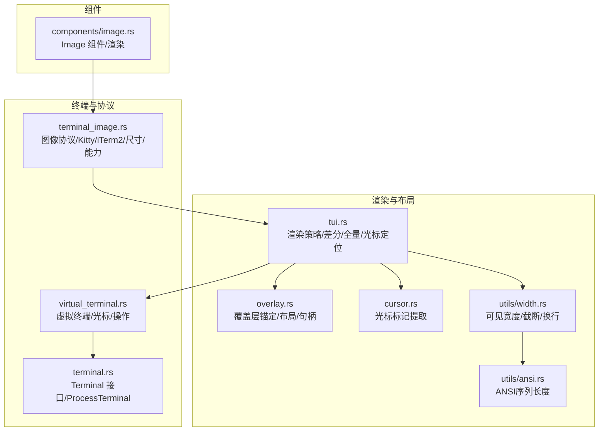
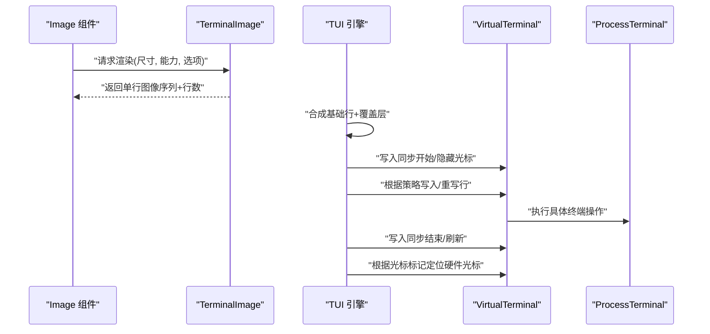
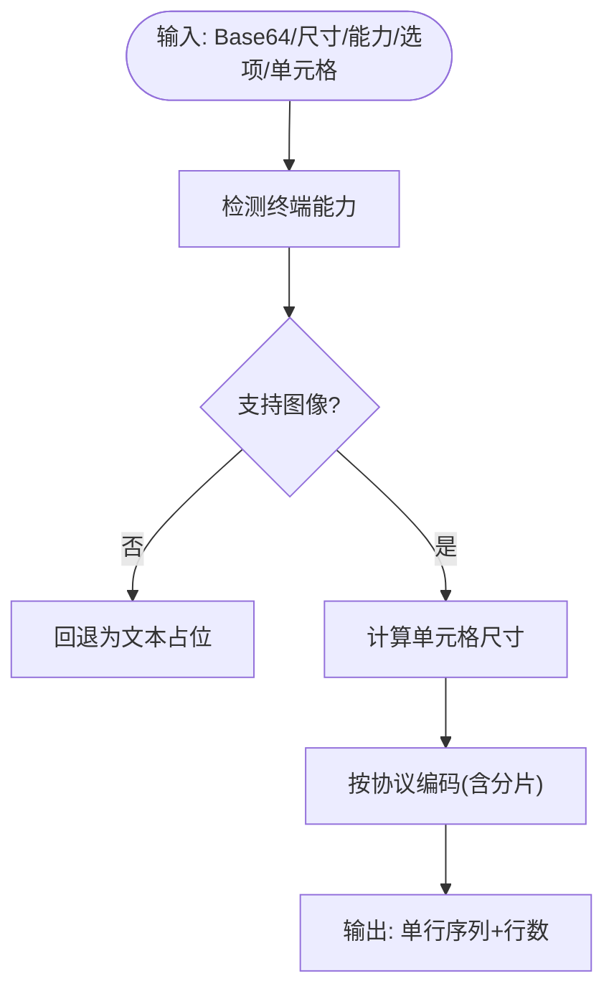
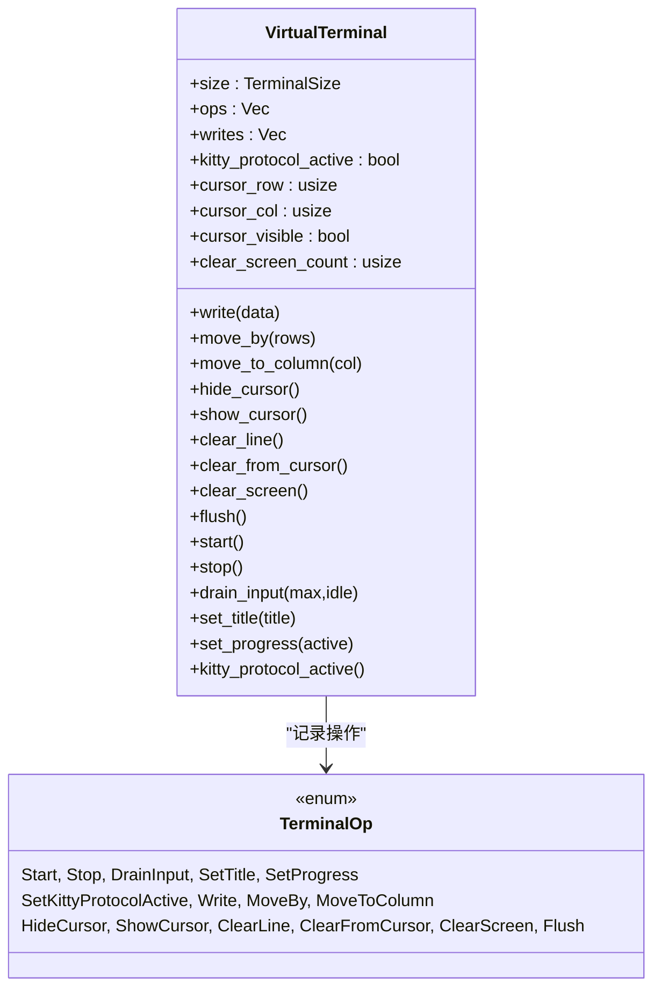
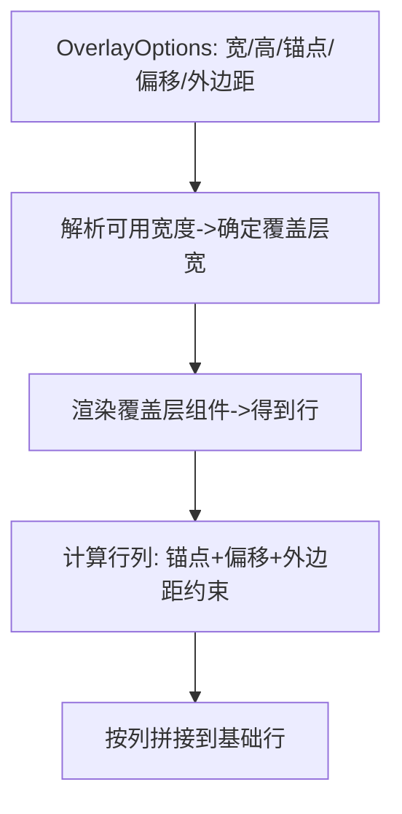
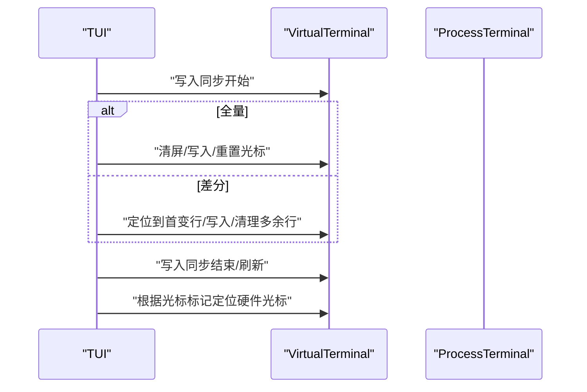
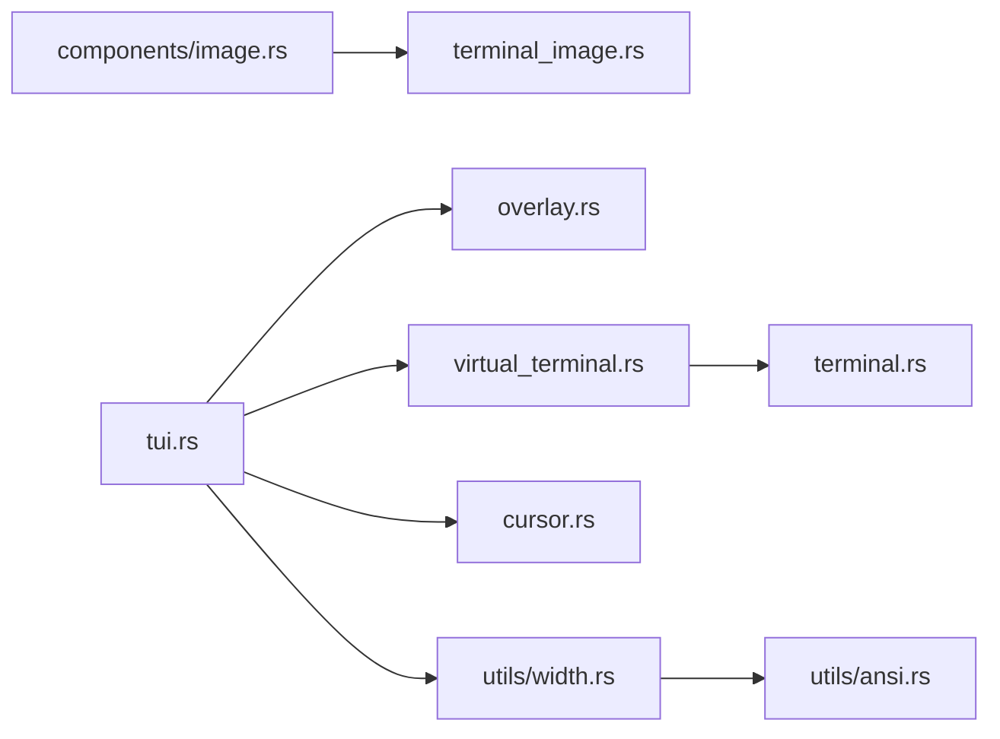

# 图像与终端集成

<cite>
**本文引用的文件**
- [terminal_image.rs](file://crates/pi-tui/src/terminal_image.rs)
- [virtual_terminal.rs](file://crates/pi-tui/src/virtual_terminal.rs)
- [overlay.rs](file://crates/pi-tui/src/overlay.rs)
- [tui.rs](file://crates/pi-tui/src/tui.rs)
- [image.rs](file://crates/pi-tui/src/components/image.rs)
- [cursor.rs](file://crates/pi-tui/src/cursor.rs)
- [ansi.rs](file://crates/pi-tui/src/utils/ansi.rs)
- [width.rs](file://crates/pi-tui/src/utils/width.rs)
- [terminal.rs](file://crates/pi-tui/src/terminal.rs)
- [lib.rs](file://crates/pi-tui/src/lib.rs)
- [terminal_image.rs（测试）](file://crates/pi-tui/tests/terminal_image.rs)
- [overlay.rs（测试）](file://crates/pi-tui/tests/overlay.rs)
</cite>

## 目录
1. [简介](#简介)
2. [项目结构](#项目结构)
3. [核心组件](#核心组件)
4. [架构总览](#架构总览)
5. [详细组件分析](#详细组件分析)
6. [依赖关系分析](#依赖关系分析)
7. [性能考量](#性能考量)
8. [故障排查指南](#故障排查指南)
9. [结论](#结论)
10. [附录：最佳实践与自定义协议开发指南](#附录最佳实践与自定义协议开发指南)

## 简介
本文件面向“图像与终端集成”子系统，围绕以下目标展开：
- 深入解释 TerminalImage 的图像渲染机制（含 Kitty 与 iTerm2 协议支持、图像尺寸计算、终端能力检测）
- 详解 VirtualTerminal 的虚拟终端协议与光标状态管理
- 详述 Overlay 系统的覆盖层管理与锚定布局
- 提供图像缓存策略、内存管理与渲染优化建议
- 给出图像集成最佳实践与自定义终端协议开发指南
- 解决图像显示问题、内存占用与性能优化等技术挑战

## 项目结构
该子系统位于 crates/pi-tui 中，采用模块化设计，按职责划分：
- terminal_image：图像协议编码、尺寸解析、能力检测、渲染输出
- virtual_terminal：虚拟终端操作与状态机
- overlay：覆盖层布局、锚定、聚焦与隐藏控制
- tui：顶层渲染调度、差分/全量重绘、光标定位与同步
- components：组件层，如 Image 组件对接 terminal_image
- utils：ANSI 序列长度解析、可见宽度与文本换行
- terminal：终端接口抽象与 ProcessTerminal 实现
- lib：对外统一导出

图示来源
- [terminal_image.rs:1-382](file://crates/pi-tui/src/terminal_image.rs#L1-L382)
- [virtual_terminal.rs:1-247](file://crates/pi-tui/src/virtual_terminal.rs#L1-L247)
- [tui.rs:1-762](file://crates/pi-tui/src/tui.rs#L1-L762)
- [overlay.rs:1-98](file://crates/pi-tui/src/overlay.rs#L1-L98)
- [cursor.rs:1-26](file://crates/pi-tui/src/cursor.rs#L1-L26)
- [width.rs:1-335](file://crates/pi-tui/src/utils/width.rs#L1-L335)
- [ansi.rs:1-41](file://crates/pi-tui/src/utils/ansi.rs#L1-L41)
- [terminal.rs:1-164](file://crates/pi-tui/src/terminal.rs#L1-L164)
- [image.rs:1-124](file://crates/pi-tui/src/components/image.rs#L1-L124)

章节来源
- [lib.rs:1-61](file://crates/pi-tui/src/lib.rs#L1-L61)

## 核心组件
- TerminalImage 子系统
  - 能力检测：基于环境变量与会话标识判断是否支持图像与超链接
  - 协议编码：Kitty 与 iTerm2 图像传输序列生成，含分片传输
  - 尺寸计算：根据像素尺寸与单元格像素尺寸计算行列占位
  - 维度解析：从 Base64 或字节流解析 PNG/JPEG/GIF/WebP 尺寸
  - 渲染输出：生成单行图像序列与行数信息
- VirtualTerminal 子系统
  - 操作模型：Start/Stop/Write/Move/Clear/Flush/DrainInput/SetTitle/SetProgress
  - 光标跟踪：写入时解析 ESC 序列，维护行列与可见性
  - 状态持久：记录清屏次数、Kitty 协议开关
- Overlay 子系统
  - 锚定：九宫格锚点与中心/边中心定位
  - 布局：百分比/列宽、最小宽度、外边距、偏移
  - 句柄：隐藏/显示/聚焦/取消聚焦
- TUI 渲染引擎
  - 渲染策略：全量重绘、差分重绘、无变化
  - 表面模式：内联/清屏式
  - 光标同步：通过特殊标记提取并移动硬件光标
  - 差分算法：首行变更位置计算与增量写入
- 组件 Image
  - 渲染流程：解析尺寸 → 计算单元格大小 → 选择协议 → 生成序列
  - 回退：无法解析或不支持时输出可读占位
- 工具链
  - 可见宽度：忽略 ANSI，正确计算图形宽度
  - 截断与换行：保留 ANSI 上下文，避免破坏样式
  - ANSI 长度：识别 CSI/字符串序列边界

章节来源
- [terminal_image.rs:1-382](file://crates/pi-tui/src/terminal_image.rs#L1-L382)
- [virtual_terminal.rs:1-247](file://crates/pi-tui/src/virtual_terminal.rs#L1-L247)
- [overlay.rs:1-98](file://crates/pi-tui/src/overlay.rs#L1-L98)
- [tui.rs:1-762](file://crates/pi-tui/src/tui.rs#L1-L762)
- [image.rs:1-124](file://crates/pi-tui/src/components/image.rs#L1-L124)
- [width.rs:1-335](file://crates/pi-tui/src/utils/width.rs#L1-L335)
- [ansi.rs:1-41](file://crates/pi-tui/src/utils/ansi.rs#L1-L41)
- [cursor.rs:1-26](file://crates/pi-tui/src/cursor.rs#L1-L26)
- [terminal.rs:1-164](file://crates/pi-tui/src/terminal.rs#L1-L164)

## 架构总览
整体数据流与控制流如下：

图示来源
- [image.rs:90-114](file://crates/pi-tui/src/components/image.rs#L90-L114)
- [terminal_image.rs:279-301](file://crates/pi-tui/src/terminal_image.rs#L279-L301)
- [tui.rs:287-320](file://crates/pi-tui/src/tui.rs#L287-L320)
- [virtual_terminal.rs:152-246](file://crates/pi-tui/src/virtual_terminal.rs#L152-L246)
- [terminal.rs:72-163](file://crates/pi-tui/src/terminal.rs#L72-L163)

## 详细组件分析

### TerminalImage：图像渲染与协议支持
- 能力检测
  - 依据环境变量与会话标识判定是否支持图像与超链接，并区分 Kitty 与 iTerm2
  - tmux/screen 等场景下禁用图像，但保留真彩与超链接能力
- 协议编码
  - Kitty：支持分片传输（>4096 字符），参数包含列/行/游标移动/图像 ID
  - iTerm2：inline 参数、宽高、是否保持纵横比
- 尺寸计算
  - 输入像素尺寸与最大单元格列/行，结合单元格像素尺寸计算最终占位
  - 保证最小占位与最大限制
- 维度解析
  - 支持 PNG/JPEG/GIF/WebP，从头部魔数与结构字段解析宽高
- 渲染输出
  - 返回单行图像序列与所占行数，供上层 TUI 合成

图示来源
- [terminal_image.rs:77-152](file://crates/pi-tui/src/terminal_image.rs#L77-L152)
- [terminal_image.rs:236-260](file://crates/pi-tui/src/terminal_image.rs#L236-L260)
- [terminal_image.rs:174-234](file://crates/pi-tui/src/terminal_image.rs#L174-L234)
- [terminal_image.rs:262-277](file://crates/pi-tui/src/terminal_image.rs#L262-L277)
- [terminal_image.rs:279-301](file://crates/pi-tui/src/terminal_image.rs#L279-L301)

章节来源
- [terminal_image.rs:1-382](file://crates/pi-tui/src/terminal_image.rs#L1-L382)
- [terminal_image.rs（测试）:13-77](file://crates/pi-tui/tests/terminal_image.rs#L13-L77)

### VirtualTerminal：虚拟终端协议与光标管理
- 操作模型
  - 写入、移动、清屏、隐藏/显示光标、刷新、标题设置、进度指示、输入排空
  - Kitty 协议开关状态记录
- 光标跟踪
  - 写入时解析 ESC 序列，维护行列位置与可见性
  - 对换行/回车/控制字符进行正确处理
- 状态持久
  - 记录清屏次数，便于渲染策略判断

图示来源
- [virtual_terminal.rs:8-36](file://crates/pi-tui/src/virtual_terminal.rs#L8-L36)
- [virtual_terminal.rs:152-246](file://crates/pi-tui/src/virtual_terminal.rs#L152-L246)

章节来源
- [virtual_terminal.rs:1-247](file://crates/pi-tui/src/virtual_terminal.rs#L1-L247)

### Overlay：覆盖层管理与锚定机制
- 锚定与定位
  - 九宫格锚点（中心、四角、上下左右中）
  - 支持绝对行/列或相对百分比/列数
  - 外边距与偏移控制
- 布局与合成
  - 计算覆盖层宽度与高度，按锚点与偏移定位
  - 在基础行之上按列拼接覆盖层内容
- 句柄与交互
  - 隐藏/显示、聚焦/取消聚焦、非捕获覆盖层
  - 自动恢复焦点

图示来源
- [overlay.rs:3-65](file://crates/pi-tui/src/overlay.rs#L3-L65)
- [tui.rs:354-393](file://crates/pi-tui/src/tui.rs#L354-L393)
- [tui.rs:648-708](file://crates/pi-tui/src/tui.rs#L648-L708)

章节来源
- [overlay.rs:1-98](file://crates/pi-tui/src/overlay.rs#L1-L98)
- [tui.rs:140-200](file://crates/pi-tui/src/tui.rs#L140-L200)

### TUI：渲染策略与光标同步
- 渲染策略
  - 初次/尺寸变化/收缩时全量重绘
  - 差分重绘：从首个不同行开始重写
  - 行内/清屏两种表面模式
- 光标同步
  - 使用特殊标记提取目标光标位置
  - 将逻辑光标映射到硬件光标并显示
- 差分算法
  - 首个不同行定位、行重写、追加行处理

图示来源
- [tui.rs:395-531](file://crates/pi-tui/src/tui.rs#L395-L531)
- [tui.rs:574-598](file://crates/pi-tui/src/tui.rs#L574-L598)
- [cursor.rs:11-25](file://crates/pi-tui/src/cursor.rs#L11-L25)

章节来源
- [tui.rs:287-320](file://crates/pi-tui/src/tui.rs#L287-L320)
- [tui.rs:395-531](file://crates/pi-tui/src/tui.rs#L395-L531)
- [tui.rs:574-598](file://crates/pi-tui/src/tui.rs#L574-L598)
- [cursor.rs:1-26](file://crates/pi-tui/src/cursor.rs#L1-L26)

### 组件 Image：与 TerminalImage 的对接
- 关键路径
  - 解析尺寸（优先传入，其次 Base64/类型）
  - 调用 render_image 生成单行序列
  - 回退：无法解析或不支持时输出占位文本
- 选项
  - 最大列/行、纵横比、图像 ID、单元格尺寸、文件名

章节来源
- [image.rs:1-124](file://crates/pi-tui/src/components/image.rs#L1-L124)
- [terminal_image.rs:279-301](file://crates/pi-tui/src/terminal_image.rs#L279-L301)

### 工具链：可见宽度与 ANSI 处理
- 可见宽度
  - 忽略 ESC 序列，正确计算图形宽度
- 截断与换行
  - 保留 ANSI 上下文，避免破坏样式
- ANSI 序列长度
  - 识别 CSI 与字符串序列边界

章节来源
- [width.rs:6-78](file://crates/pi-tui/src/utils/width.rs#L6-L78)
- [width.rs:100-188](file://crates/pi-tui/src/utils/width.rs#L100-L188)
- [ansi.rs:1-41](file://crates/pi-tui/src/utils/ansi.rs#L1-L41)

## 依赖关系分析
- 组件耦合
  - Image 依赖 TerminalImage 的渲染与尺寸解析
  - TUI 依赖 Overlay 进行覆盖层合成，依赖 VirtualTerminal 执行终端操作
  - VirtualTerminal 依赖 Terminal 抽象与 ProcessTerminal 实现
- 外部依赖
  - crossterm：终端控制命令
  - unicode-width/unicode-segmentation：宽度与分词
  - base64：图像 Base64 编解码

图示来源
- [image.rs:1-124](file://crates/pi-tui/src/components/image.rs#L1-L124)
- [terminal_image.rs:1-382](file://crates/pi-tui/src/terminal_image.rs#L1-L382)
- [tui.rs:1-762](file://crates/pi-tui/src/tui.rs#L1-L762)
- [overlay.rs:1-98](file://crates/pi-tui/src/overlay.rs#L1-L98)
- [virtual_terminal.rs:1-247](file://crates/pi-tui/src/virtual_terminal.rs#L1-L247)
- [terminal.rs:1-164](file://crates/pi-tui/src/terminal.rs#L1-L164)
- [cursor.rs:1-26](file://crates/pi-tui/src/cursor.rs#L1-L26)
- [width.rs:1-335](file://crates/pi-tui/src/utils/width.rs#L1-L335)
- [ansi.rs:1-41](file://crates/pi-tui/src/utils/ansi.rs#L1-L41)

章节来源
- [lib.rs:1-61](file://crates/pi-tui/src/lib.rs#L1-L61)

## 性能考量
- 渲染策略
  - 尽可能使用差分重绘以减少写入量；仅在尺寸变化或收缩时触发全量
  - 控制覆盖层数量与尺寸，避免频繁拼接大块文本
- 图像传输
  - Kitty 分片传输避免超长行导致终端卡顿
  - 合理设置最大列/行，避免过度放大
- 文本处理
  - 可见宽度与截断避免重复计算与无效写入
  - 保留 ANSI 上下文减少样式重置开销
- 光标同步
  - 仅在需要时移动硬件光标，减少不必要的定位

## 故障排查指南
- 图像未显示
  - 检查能力检测结果：确认终端环境变量与会话标识
  - 确认协议编码参数（列/行/游标移动/图像 ID）
  - 验证 Base64 与 MIME 类型匹配
- 图像被裁剪或比例异常
  - 调整最大列/行与纵横比选项
  - 核对单元格像素尺寸配置
- 覆盖层错位
  - 检查锚点、百分比/列数、外边距与偏移
  - 确认终端尺寸变化后重新计算
- 光标位置错误
  - 检查光标标记是否正确插入与提取
  - 确保同步开始/结束与刷新顺序正确
- 性能问题
  - 启用差分重绘，减少全量写入
  - 降低覆盖层数量与复杂度
  - 避免频繁改变终端尺寸

章节来源
- [terminal_image.rs（测试）:13-77](file://crates/pi-tui/tests/terminal_image.rs#L13-L77)
- [overlay.rs（测试）:19-52](file://crates/pi-tui/tests/overlay.rs#L19-L52)
- [tui.rs:395-531](file://crates/pi-tui/src/tui.rs#L395-L531)
- [cursor.rs:11-25](file://crates/pi-tui/src/cursor.rs#L11-L25)

## 结论
本子系统通过清晰的模块划分与严格的协议实现，提供了对 Kitty 与 iTerm2 图像协议的良好支持，并结合虚拟终端状态管理与覆盖层布局，实现了高效稳定的终端图像渲染体验。通过合理的渲染策略、尺寸计算与工具链支持，能够在多种终端环境中获得一致且高性能的表现。

## 附录：最佳实践与自定义协议开发指南

### 图像集成最佳实践
- 能力检测前置
  - 在渲染前调用能力检测，避免无效传输
- 尺寸与比例
  - 明确指定最大列/行，启用纵横比保持
  - 针对小终端适度缩小图像
- 传输优化
  - 大图像启用分片传输
  - 合理设置图像 ID，便于后续删除与更新
- 回退策略
  - 不支持图像时输出可读占位，包含尺寸与类型信息
- 覆盖层配合
  - 将图像置于 Overlay 中，避免与主内容混排
  - 使用合适的锚点与外边距，确保不遮挡重要信息

### 自定义终端协议开发指南
- 协议要素
  - 识别协议头与尾（如 ESC 序列）
  - 参数规范：列/行/宽/高/纵横比/游标行为/图像 ID
  - 分片规则：起止标记与偏移控制
- 能力检测扩展
  - 新增环境变量或会话标识分支
  - 返回对应协议枚举与能力标志
- 尺寸与布局
  - 与现有单元格尺寸体系对齐
  - 提供单元格尺寸计算与约束
- 测试验证
  - 覆盖典型尺寸、分片、参数组合
  - 验证回退与错误路径

章节来源
- [terminal_image.rs:77-152](file://crates/pi-tui/src/terminal_image.rs#L77-L152)
- [terminal_image.rs:174-234](file://crates/pi-tui/src/terminal_image.rs#L174-L234)
- [terminal_image.rs:236-260](file://crates/pi-tui/src/terminal_image.rs#L236-L260)
- [terminal_image.rs（测试）:119-163](file://crates/pi-tui/tests/terminal_image.rs#L119-L163)