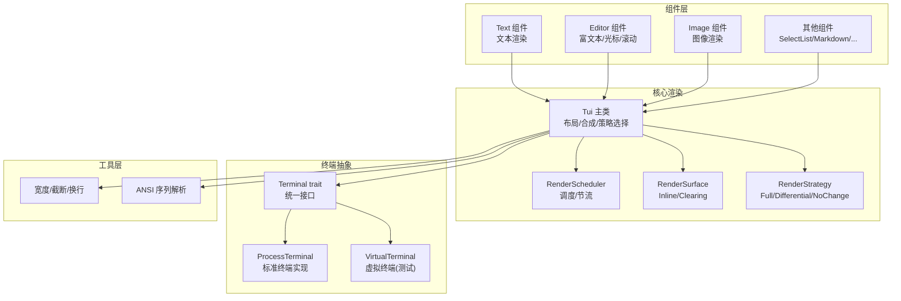
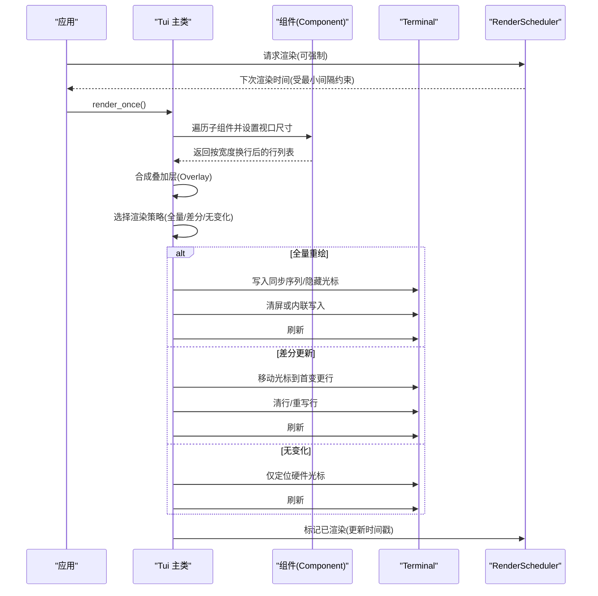
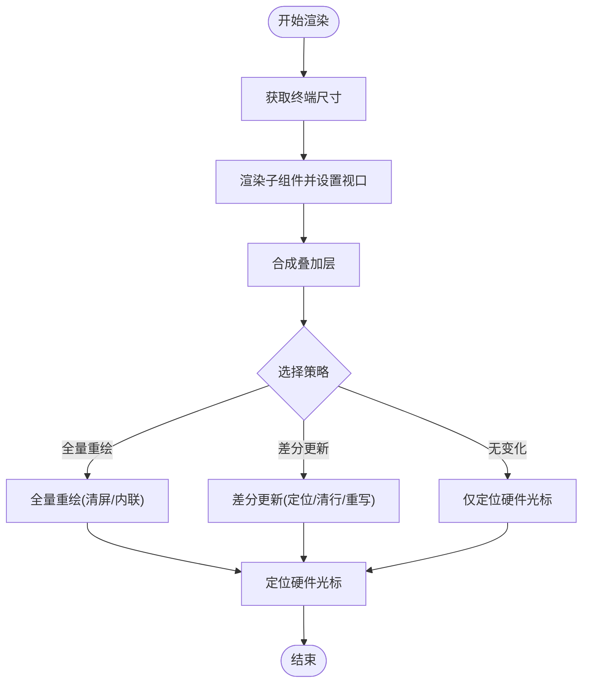
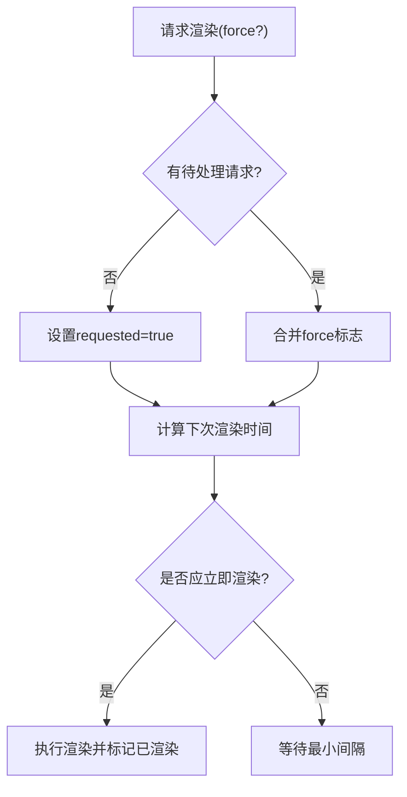
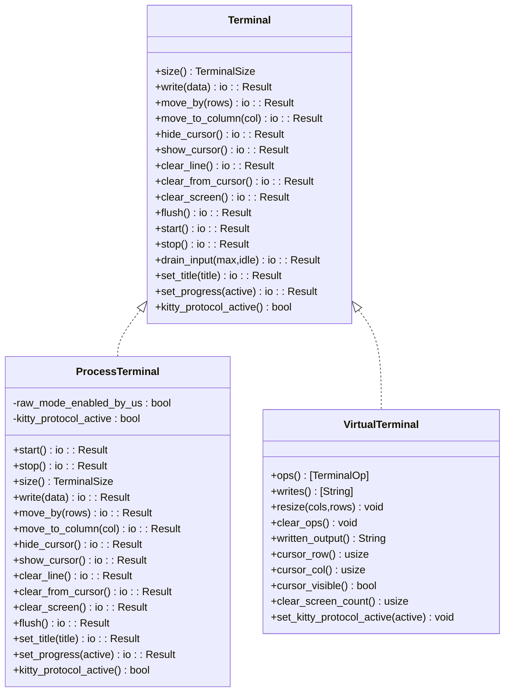
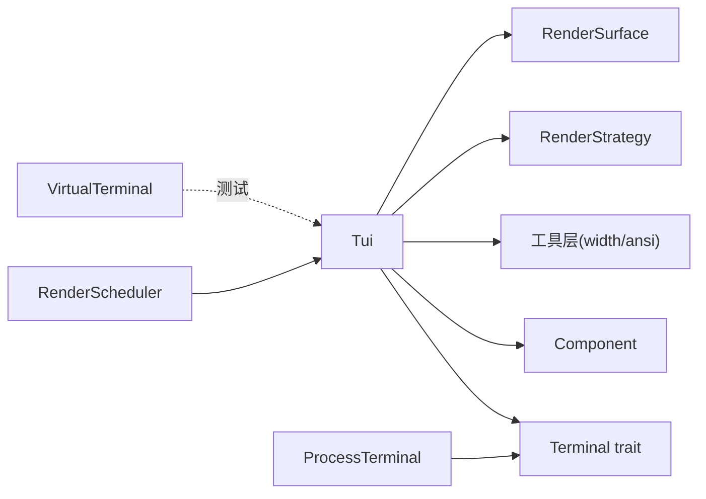

# 渲染系统

<cite>
**本文档引用的文件**
- [lib.rs](file://crates/pi-tui/src/lib.rs)
- [tui.rs](file://crates/pi-tui/src/tui.rs)
- [runtime.rs](file://crates/pi-tui/src/runtime.rs)
- [terminal.rs](file://crates/pi-tui/src/terminal.rs)
- [virtual_terminal.rs](file://crates/pi-tui/src/virtual_terminal.rs)
- [text.rs](file://crates/pi-tui/src/components/text.rs)
- [editor.rs](file://crates/pi-tui/src/components/editor.rs)
- [width.rs](file://crates/pi-tui/src/utils/width.rs)
- [ansi.rs](file://crates/pi-tui/src/utils/ansi.rs)
- [tui_render.rs](file://crates/pi-tui/tests/tui_render.rs)
- [render_once.rs](file://crates/pi-tui/examples/render_once.rs)
</cite>

## 目录
1. [简介](#简介)
2. [项目结构](#项目结构)
3. [核心组件](#核心组件)
4. [架构总览](#架构总览)
5. [详细组件分析](#详细组件分析)
6. [依赖关系分析](#依赖关系分析)
7. [性能考量](#性能考量)
8. [故障排查指南](#故障排查指南)
9. [结论](#结论)
10. [附录](#附录)

## 简介
本文件面向渲染系统，重点阐述 Tui 主类的设计模式、RenderScheduler 的调度机制与 RenderStrategy 的渲染策略；详解 RenderSurface 的表面管理与 Terminal 的底层渲染接口；记录异步渲染流程、脏区域检测与增量更新机制；并提供帧率控制、渲染优化与内存管理策略，以及渲染性能调优指南与自定义渲染后端的开发方法，最后覆盖渲染闪烁、内存泄漏与跨终端兼容性等关键问题。

## 项目结构
pi-tui crate 提供了完整的终端用户界面渲染能力，包含以下关键模块：
- 组件层：文本、编辑器、图像、输入框等组件实现
- 核心渲染：Tui 主类负责布局、合成、策略选择与输出
- 调度层：RenderScheduler 控制渲染节奏与最小间隔
- 终端抽象：Terminal trait 定义底层接口，ProcessTerminal 为默认实现，VirtualTerminal 用于测试
- 工具层：ANSI 解析、宽度计算、换行与截断等辅助功能

**图表来源**
- [lib.rs:1-61](file://crates/pi-tui/src/lib.rs#L1-L61)
- [tui.rs:52-72](file://crates/pi-tui/src/tui.rs#L52-L72)
- [runtime.rs:3-9](file://crates/pi-tui/src/runtime.rs#L3-L9)
- [terminal.rs:15-50](file://crates/pi-tui/src/terminal.rs#L15-L50)
- [virtual_terminal.rs:27-36](file://crates/pi-tui/src/virtual_terminal.rs#L27-L36)
- [width.rs:6-33](file://crates/pi-tui/src/utils/width.rs#L6-L33)
- [ansi.rs:1-41](file://crates/pi-tui/src/utils/ansi.rs#L1-L41)

**章节来源**
- [lib.rs:1-61](file://crates/pi-tui/src/lib.rs#L1-L61)

## 核心组件
- Tui 主类：负责组件树渲染、叠加层合成、策略选择与终端输出；维护上一帧状态以支持增量更新。
- RenderScheduler：控制渲染请求与最小间隔，避免过度刷新。
- RenderStrategy：渲染策略枚举，决定全量重绘、差分更新或无变化。
- RenderSurface：渲染表面类型，Inline（内联）与 Clearing（清屏）两种模式。
- Terminal trait：统一的终端操作接口，ProcessTerminal 为默认实现，VirtualTerminal 用于测试。
- 组件系统：通过 Component trait 定义渲染行为，如 Text、Editor 等。

**章节来源**
- [tui.rs:14-37](file://crates/pi-tui/src/tui.rs#L14-L37)
- [tui.rs:52-72](file://crates/pi-tui/src/tui.rs#L52-L72)
- [runtime.rs:3-9](file://crates/pi-tui/src/runtime.rs#L3-L9)
- [terminal.rs:15-50](file://crates/pi-tui/src/terminal.rs#L15-L50)
- [lib.rs:24-56](file://crates/pi-tui/src/lib.rs#L24-L56)

## 架构总览
渲染系统采用“组件驱动 + 策略选择 + 终端抽象”的分层设计。Tui 负责将多个组件与叠加层渲染为字符串行列表，随后根据策略选择最优输出方式，并通过 Terminal trait 将指令写入终端。调度器确保渲染频率可控，工具层提供宽度与 ANSI 解析能力。

**图表来源**
- [tui.rs:287-320](file://crates/pi-tui/src/tui.rs#L287-L320)
- [tui.rs:395-408](file://crates/pi-tui/src/tui.rs#L395-L408)
- [tui.rs:410-531](file://crates/pi-tui/src/tui.rs#L410-L531)
- [runtime.rs:30-58](file://crates/pi-tui/src/runtime.rs#L30-L58)

## 详细组件分析

### Tui 主类与渲染策略
- 设计模式：组合模式 + 策略模式。Tui 组合多个 Component 实例，通过 RenderStrategy 在不同场景下选择最优渲染路径。
- 增量更新：通过比较上一帧与当前帧的行内容，定位首个变更行，执行差分更新，避免全量清屏。
- 叠加层合成：在基础行之上按锚点与偏移拼接叠加层内容，支持最大高度与边距控制。
- 光标定位：从渲染结果中提取光标标记，移动硬件光标至目标位置，保证可见与一致。

**图表来源**
- [tui.rs:287-320](file://crates/pi-tui/src/tui.rs#L287-L320)
- [tui.rs:395-408](file://crates/pi-tui/src/tui.rs#L395-L408)
- [tui.rs:410-531](file://crates/pi-tui/src/tui.rs#L410-L531)

**章节来源**
- [tui.rs:287-320](file://crates/pi-tui/src/tui.rs#L287-L320)
- [tui.rs:395-408](file://crates/pi-tui/src/tui.rs#L395-L408)
- [tui.rs:410-531](file://crates/pi-tui/src/tui.rs#L410-L531)
- [tui.rs:354-393](file://crates/pi-tui/src/tui.rs#L354-L393)

### RenderScheduler 调度机制
- 请求与强制：支持普通请求与强制请求，强制请求会立即触发渲染。
- 最小间隔：基于上次渲染时间与最小间隔计算下次渲染时间，避免抖动与过载。
- 状态管理：标记已渲染后重置请求标志，更新时间戳，确保节流生效。

**图表来源**
- [runtime.rs:21-48](file://crates/pi-tui/src/runtime.rs#L21-L48)
- [runtime.rs:50-58](file://crates/pi-tui/src/runtime.rs#L50-L58)

**章节来源**
- [runtime.rs:3-9](file://crates/pi-tui/src/runtime.rs#L3-L9)
- [runtime.rs:21-48](file://crates/pi-tui/src/runtime.rs#L21-L48)
- [runtime.rs:50-58](file://crates/pi-tui/src/runtime.rs#L50-L58)

### RenderStrategy 渲染策略
- FullRedraw：首次渲染、尺寸变化、收缩且启用清屏时触发。
- Differential：存在首个变更行时，进行差分更新，减少写入与闪烁。
- NoChange：无任何变化时，仅定位硬件光标，不产生额外输出。

**章节来源**
- [tui.rs:14-19](file://crates/pi-tui/src/tui.rs#L14-L19)
- [tui.rs:395-408](file://crates/pi-tui/src/tui.rs#L395-L408)

### RenderSurface 表面管理
- Inline：内联模式，尽量复用现有屏幕内容，适合大多数交互场景。
- Clearing：清屏模式，在全量重绘前清空屏幕，适合独立会话或全屏应用。

**章节来源**
- [tui.rs:27-31](file://crates/pi-tui/src/tui.rs#L27-L31)
- [tui.rs:410-456](file://crates/pi-tui/src/tui.rs#L410-L456)
- [tui.rs:472-489](file://crates/pi-tui/src/tui.rs#L472-L489)

### Terminal 底层渲染接口
- Terminal trait：统一的终端操作接口，包括尺寸查询、写入、光标移动、清屏、刷新等。
- ProcessTerminal：默认实现，封装 crossterm 操作，处理原始模式与同步序列。
- VirtualTerminal：测试实现，记录所有操作与写入，便于断言与验证。

**图表来源**
- [terminal.rs:15-50](file://crates/pi-tui/src/terminal.rs#L15-L50)
- [terminal.rs:72-163](file://crates/pi-tui/src/terminal.rs#L72-L163)
- [virtual_terminal.rs:152-246](file://crates/pi-tui/src/virtual_terminal.rs#L152-L246)

**章节来源**
- [terminal.rs:15-50](file://crates/pi-tui/src/terminal.rs#L15-L50)
- [terminal.rs:72-163](file://crates/pi-tui/src/terminal.rs#L72-L163)
- [virtual_terminal.rs:27-36](file://crates/pi-tui/src/virtual_terminal.rs#L27-L36)
- [virtual_terminal.rs:152-246](file://crates/pi-tui/src/virtual_terminal.rs#L152-L246)

### 组件系统与文本渲染
- Text 组件：按宽度换行，处理尾随换行符，空内容补空行。
- Editor 组件：复杂文本编辑器，支持滚动、历史、撤销/重做、自动补全、光标定位与边界处理。

**章节来源**
- [text.rs:17-43](file://crates/pi-tui/src/components/text.rs#L17-L43)
- [editor.rs:772-800](file://crates/pi-tui/src/components/editor.rs#L772-L800)

### 工具层：宽度与 ANSI 处理
- 可见宽度：忽略 ANSI 序列，正确计算字符宽度，支持制表符扩展。
- 截断与省略：在指定宽度内截断文本，必要时追加省略号并恢复 SGR 状态。
- ANSI 解析：识别 CSI 与字符串序列长度，避免误判字节边界。

**章节来源**
- [width.rs:6-33](file://crates/pi-tui/src/utils/width.rs#L6-L33)
- [width.rs:35-98](file://crates/pi-tui/src/utils/width.rs#L35-L98)
- [width.rs:100-188](file://crates/pi-tui/src/utils/width.rs#L100-L188)
- [ansi.rs:1-41](file://crates/pi-tui/src/utils/ansi.rs#L1-L41)

## 依赖关系分析
- Tui 依赖 Terminal trait 进行底层输出，依赖组件系统生成行列表，依赖工具层进行宽度与 ANSI 处理。
- RenderScheduler 与 Tui 解耦，通过外部调度控制渲染频率。
- VirtualTerminal 作为测试桩，模拟真实终端行为，便于断言。

**图表来源**
- [tui.rs:52-72](file://crates/pi-tui/src/tui.rs#L52-L72)
- [lib.rs:24-56](file://crates/pi-tui/src/lib.rs#L24-L56)
- [runtime.rs:3-9](file://crates/pi-tui/src/runtime.rs#L3-L9)
- [terminal.rs:15-50](file://crates/pi-tui/src/terminal.rs#L15-L50)
- [virtual_terminal.rs:27-36](file://crates/pi-tui/src/virtual_terminal.rs#L27-L36)

**章节来源**
- [lib.rs:1-61](file://crates/pi-tui/src/lib.rs#L1-L61)

## 性能考量
- 增量更新优先：通过首变更行定位，仅重写受影响区域，显著降低 I/O 与闪烁。
- 最小化清屏：默认使用内联模式，仅在必要时清屏；收缩时可配置清屏策略。
- 节流与帧率控制：通过 RenderScheduler 的最小间隔限制渲染频率，避免 CPU 占用过高。
- 内存管理：每帧复制行列表，但通过差分更新减少写入；建议在高频更新场景中合并事件与渲染请求。
- 宽度与 ANSI 计算：可见宽度与截断均考虑 ANSI 序列，避免错误宽度导致的重排与闪烁。

[本节为通用性能指导，无需特定文件引用]

## 故障排查指南
- 渲染闪烁
  - 检查是否频繁全量重绘，优先使用差分更新。
  - 确认 RenderSurface 设置合理，内联模式更适合交互。
  - 验证 Overlay 是否超出终端尺寸或遮挡不当。
- 内存泄漏
  - 确保组件生命周期管理，及时清理 Overlay 与历史。
  - 避免在渲染循环中累积大量临时数据结构。
- 跨终端兼容性
  - 使用 Terminal trait 抽象，避免直接依赖具体终端特性。
  - 对于 Kitty 图像协议等特性，需检测终端能力后再启用。
- 常见错误
  - 行宽超限：检查可见宽度计算与换行逻辑，确保不超过终端宽度。
  - 光标错位：确认光标标记插入与定位逻辑，避免相对/绝对坐标混淆。

**章节来源**
- [tui.rs:40-50](file://crates/pi-tui/src/tui.rs#L40-L50)
- [tui.rs:611-624](file://crates/pi-tui/src/tui.rs#L611-L624)
- [terminal.rs:47-49](file://crates/pi-tui/src/terminal.rs#L47-L49)

## 结论
该渲染系统通过清晰的分层设计与策略选择，实现了高效、低闪烁的终端 UI 渲染。Tui 主类结合组件系统与工具层，提供灵活的布局与文本处理；RenderScheduler 保障渲染节律；Terminal trait 使后端可插拔。通过差分更新、最小清屏与帧率控制，系统在性能与体验间取得良好平衡。

[本节为总结，无需特定文件引用]

## 附录

### 异步渲染流程与脏区域检测
- 脏区域检测：比较上一帧与当前帧的行内容，定位首个变更行，后续行按需重写。
- 异步事件：通过 RenderScheduler 接收事件驱动的渲染请求，合并多次请求，延迟到最小间隔后一次性渲染。
- 输出优化：内联模式下尽可能复用屏幕内容，差分更新时先移动光标再清行与重写。

**章节来源**
- [tui.rs:395-408](file://crates/pi-tui/src/tui.rs#L395-L408)
- [tui.rs:458-531](file://crates/pi-tui/src/tui.rs#L458-L531)
- [runtime.rs:21-48](file://crates/pi-tui/src/runtime.rs#L21-L48)

### 自定义渲染后端开发方法
- 实现 Terminal trait：提供尺寸查询、写入、光标移动、清屏、刷新等方法。
- 处理同步序列：在 start/stop 中发送/关闭同步序列，减少闪烁。
- 能力探测：在后端初始化时探测终端能力（如 Kitty 图像协议），并在 VirtualTerminal 中记录状态以便测试。
- 示例参考：ProcessTerminal 与 VirtualTerminal 的实现模式。

**章节来源**
- [terminal.rs:15-50](file://crates/pi-tui/src/terminal.rs#L15-L50)
- [terminal.rs:72-163](file://crates/pi-tui/src/terminal.rs#L72-L163)
- [virtual_terminal.rs:152-246](file://crates/pi-tui/src/virtual_terminal.rs#L152-L246)

### 使用示例
- 最简渲染：创建 ProcessTerminal，构建 Tui 并添加 Text 组件，调用 render_once。
- 测试验证：使用 VirtualTerminal 断言操作序列与输出，验证全量/差分/无变化策略。

**章节来源**
- [render_once.rs:1-10](file://crates/pi-tui/examples/render_once.rs#L1-L10)
- [tui_render.rs:32-52](file://crates/pi-tui/tests/tui_render.rs#L32-L52)
- [tui_render.rs:166-189](file://crates/pi-tui/tests/tui_render.rs#L166-L189)
- [tui_render.rs:262-273](file://crates/pi-tui/tests/tui_render.rs#L262-L273)