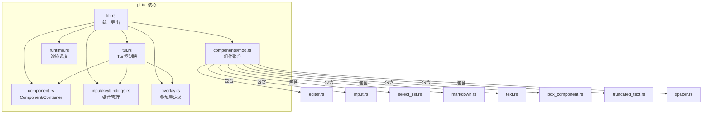
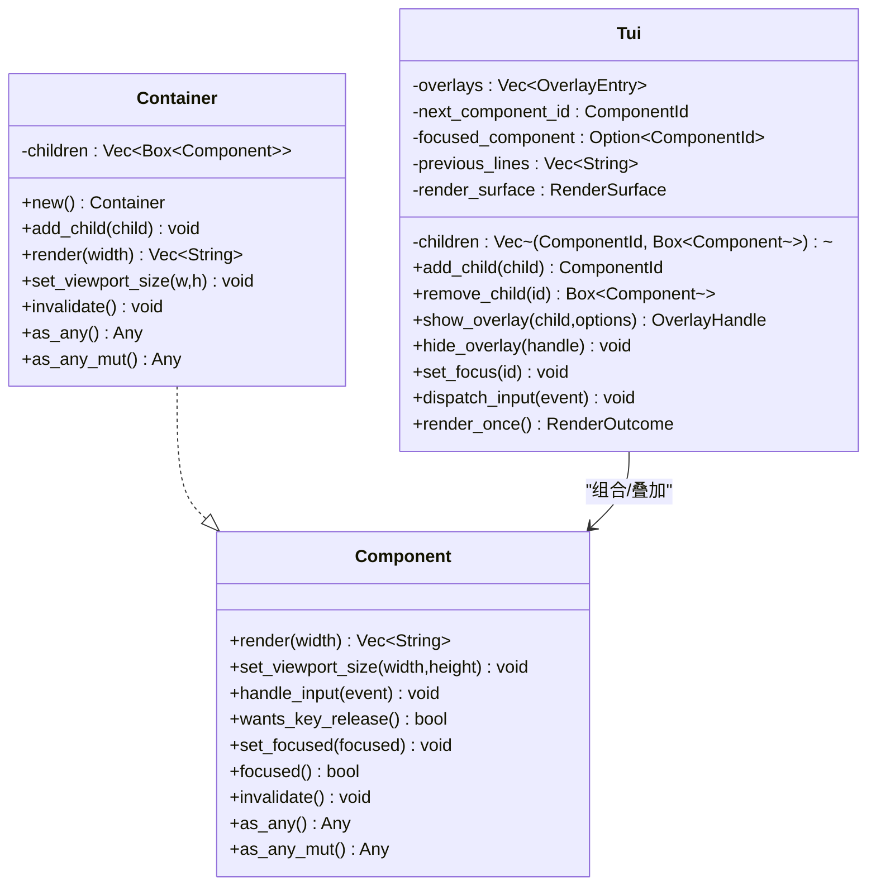
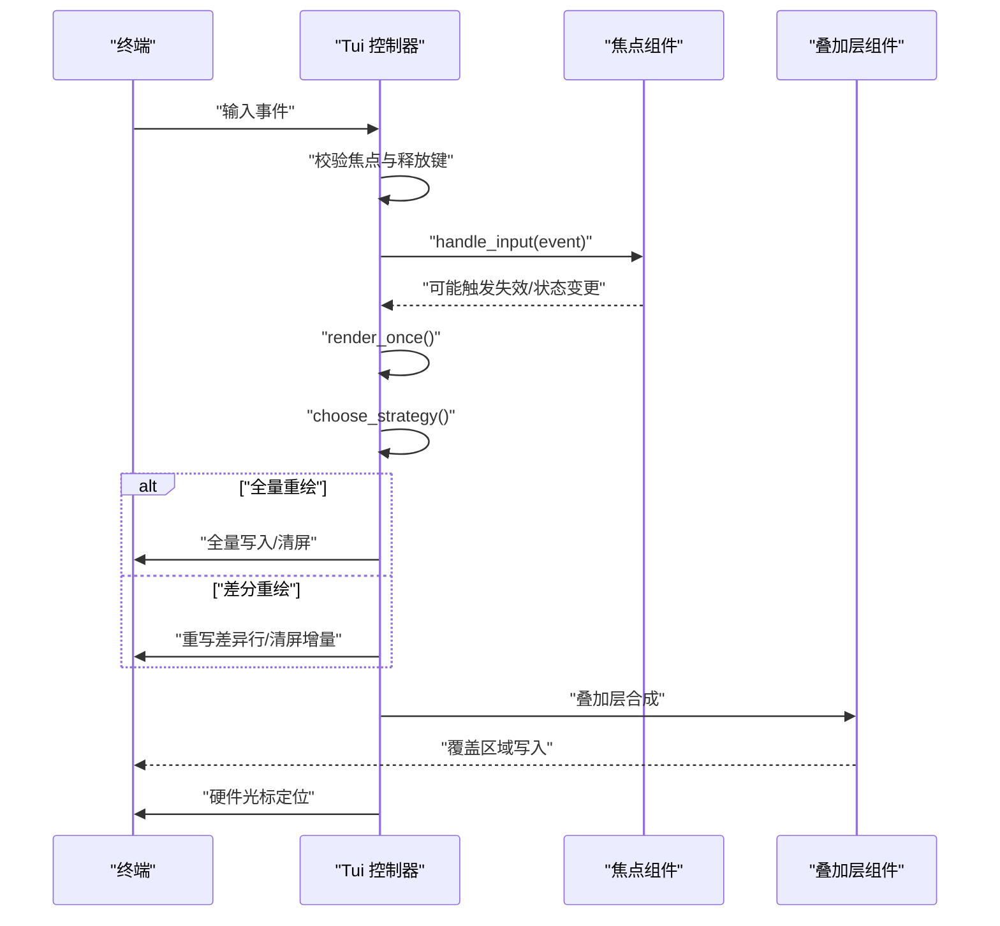
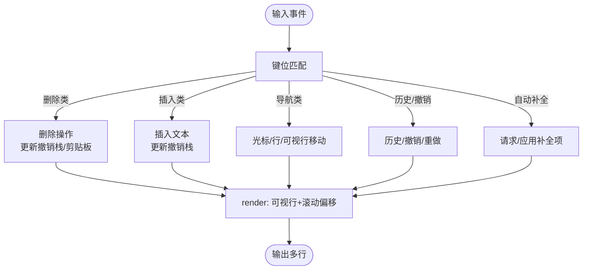
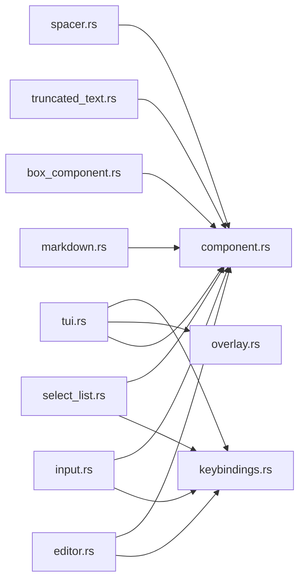

# 组件系统架构

<cite>
**本文引用的文件**
- [lib.rs](file://crates/pi-tui/src/lib.rs)
- [component.rs](file://crates/pi-tui/src/component.rs)
- [components/mod.rs](file://crates/pi-tui/src/components/mod.rs)
- [runtime.rs](file://crates/pi-tui/src/runtime.rs)
- [tui.rs](file://crates/pi-tui/src/tui.rs)
- [editor.rs](file://crates/pi-tui/src/components/editor.rs)
- [input.rs](file://crates/pi-tui/src/components/input.rs)
- [select_list.rs](file://crates/pi-tui/src/components/select_list.rs)
- [markdown.rs](file://crates/pi-tui/src/components/markdown.rs)
- [text.rs](file://crates/pi-tui/src/components/text.rs)
- [box_component.rs](file://crates/pi-tui/src/components/box_component.rs)
- [truncated_text.rs](file://crates/pi-tui/src/components/truncated_text.rs)
- [spacer.rs](file://crates/pi-tui/src/components/spacer.rs)
- [keybindings.rs](file://crates/pi-tui/src/input/keybindings.rs)
- [overlay.rs](file://crates/pi-tui/src/overlay.rs)
</cite>

## 目录
1. [引言](#引言)
2. [项目结构](#项目结构)
3. [核心组件](#核心组件)
4. [架构总览](#架构总览)
5. [详细组件分析](#详细组件分析)
6. [依赖关系分析](#依赖关系分析)
7. [性能考量](#性能考量)
8. [故障排查指南](#故障排查指南)
9. [结论](#结论)
10. [附录](#附录)

## 引言
本文件系统性梳理 pi-tui 组件系统的架构与实现，重点覆盖以下方面：
- 组件接口设计：Component trait 的职责边界与可选能力
- 生命周期管理：焦点、输入处理、失效与重绘调度
- 容器模式：Container 与 Box 的组合渲染策略
- 内置组件：Editor、Input、SelectList、Markdown、Text、Box、TruncatedText、Spacer 的设计理念与使用方式
- 状态管理：组件内部状态、主题与回调
- 事件传播：从 Tui 到焦点组件的输入分发
- 渲染优化：差分渲染、全量渲染与硬件光标定位
- 复用与扩展：最佳实践与自定义组件开发指南
- 组件间通信：Overlay 机制与焦点切换
- 布局管理：Overlay 定位、尺寸解析与溢出处理
- 性能优化：最小化写入、按需渲染与调度节流

## 项目结构
pi-tui 模块通过统一入口导出组件与工具，核心位于 crates/pi-tui/src：
- 入口导出：lib.rs 将组件、输入、样式、终端、运行时等模块集中导出
- 组件接口与容器：component.rs 定义 Component trait 与 Container
- 组件集合：components/mod.rs 聚合各内置组件
- 运行时与渲染：runtime.rs 提供渲染调度；tui.rs 实现 Tui 主控制器
- 输入与键位：input/keybindings.rs 提供键位定义与匹配
- 叠加层：overlay.rs 定义 Overlay 的锚点、尺寸与句柄

**图表来源**
- [lib.rs:1-61](file://crates/pi-tui/src/lib.rs#L1-L61)
- [component.rs:1-82](file://crates/pi-tui/src/component.rs#L1-L82)
- [components/mod.rs:1-26](file://crates/pi-tui/src/components/mod.rs#L1-L26)
- [runtime.rs:1-60](file://crates/pi-tui/src/runtime.rs#L1-L60)
- [tui.rs:1-762](file://crates/pi-tui/src/tui.rs#L1-L762)
- [keybindings.rs:1-331](file://crates/pi-tui/src/input/keybindings.rs#L1-L331)
- [overlay.rs:1-98](file://crates/pi-tui/src/overlay.rs#L1-L98)

**章节来源**
- [lib.rs:1-61](file://crates/pi-tui/src/lib.rs#L1-L61)
- [components/mod.rs:1-26](file://crates/pi-tui/src/components/mod.rs#L1-L26)

## 核心组件
本节聚焦 Component 接口、Container 容器与 Tui 主控制器。

- Component trait
  - 必要方法：render(width) 返回按行字符串列表
  - 可选方法：set_viewport_size、handle_input、wants_key_release、set_focused/focused、invalidate、as_any/as_any_mut
  - 设计意图：以纯函数式渲染为核心，输入处理与状态变更在组件内部完成，便于组合与测试

- Container 容器
  - 存储子组件 Vec<Box<dyn Component>>
  - 实现 Component：顺序渲染子组件，传递视口尺寸，递归失效
  - 支持 as_any/as_any_mut 以便类型安全查询

- Tui 主控制器
  - 维护子组件列表与叠加层，分配 ComponentId，管理焦点
  - 输入分发：仅向当前焦点组件派发，尊重 wants_key_release
  - 渲染策略：根据上次渲染结果与终端尺寸选择 FullRedraw/Differential/NoChange
  - 差分渲染：计算首行变化位置，仅重写差异区域或清屏重绘
  - 硬件光标定位：基于上次视口偏移与目标行列移动，避免闪烁

**图表来源**
- [component.rs:3-29](file://crates/pi-tui/src/component.rs#L3-L29)
- [component.rs:31-81](file://crates/pi-tui/src/component.rs#L31-L81)
- [tui.rs:52-122](file://crates/pi-tui/src/tui.rs#L52-L122)
- [tui.rs:223-235](file://crates/pi-tui/src/tui.rs#L223-L235)
- [tui.rs:287-320](file://crates/pi-tui/src/tui.rs#L287-L320)

**章节来源**
- [component.rs:1-82](file://crates/pi-tui/src/component.rs#L1-L82)
- [tui.rs:52-122](file://crates/pi-tui/src/tui.rs#L52-L122)
- [tui.rs:223-235](file://crates/pi-tui/src/tui.rs#L223-L235)
- [tui.rs:287-320](file://crates/pi-tui/src/tui.rs#L287-L320)

## 架构总览
下图展示从输入到渲染的端到端流程，以及组件与叠加层的组合关系。

**图表来源**
- [tui.rs:223-235](file://crates/pi-tui/src/tui.rs#L223-L235)
- [tui.rs:287-320](file://crates/pi-tui/src/tui.rs#L287-L320)
- [tui.rs:354-393](file://crates/pi-tui/src/tui.rs#L354-L393)
- [tui.rs:395-408](file://crates/pi-tui/src/tui.rs#L395-L408)
- [tui.rs:458-531](file://crates/pi-tui/src/tui.rs#L458-L531)

## 详细组件分析

### Editor 组件
- 设计理念
  - 面向编辑体验的复合组件：支持撤销/重做、剪贴板环、自动补全、历史回放、跳转到字符等
  - 文本按可视宽度换行，维护滚动偏移与光标位置
  - 通过主题与键位管理器控制外观与行为
- 关键状态
  - 文本、光标、焦点、滚动偏移、主题、键位、剪贴板环、撤销栈、自动补全上下文
- 生命周期
  - render：生成带光标的可视行，按视口高度裁剪
  - handle_input：按键匹配与动作执行，必要时推入撤销快照
  - invalidate：由父容器触发，通常用于外部刷新
- 使用建议
  - 通过回调注册提交与变更通知
  - 合理设置视口高度与边框显示
  - 自动补全提供者需实现建议与应用编辑的契约

**图表来源**
- [editor.rs:81-115](file://crates/pi-tui/src/components/editor.rs#L81-L115)
- [editor.rs:201-221](file://crates/pi-tui/src/components/editor.rs#L201-L221)
- [editor.rs:363-377](file://crates/pi-tui/src/components/editor.rs#L363-L377)
- [editor.rs:622-634](file://crates/pi-tui/src/components/editor.rs#L622-L634)
- [editor.rs:772-800](file://crates/pi-tui/src/components/editor.rs#L772-L800)

**章节来源**
- [editor.rs:48-115](file://crates/pi-tui/src/components/editor.rs#L48-L115)
- [editor.rs:201-221](file://crates/pi-tui/src/components/editor.rs#L201-L221)
- [editor.rs:363-377](file://crates/pi-tui/src/components/editor.rs#L363-L377)
- [editor.rs:622-634](file://crates/pi-tui/src/components/editor.rs#L622-L634)
- [editor.rs:772-800](file://crates/pi-tui/src/components/editor.rs#L772-L800)

### Input 组件
- 设计理念
  - 最小可用输入：单行文本、基础光标移动与删除
  - 通过键位管理器映射常用编辑键
- 生命周期
  - render：在焦点时插入光标标记
  - handle_input：按键映射到插入、删除、移动与提交/取消回调
- 使用建议
  - 通过回调绑定提交与取消逻辑
  - 与键位配置保持一致，避免冲突

**章节来源**
- [input.rs:7-15](file://crates/pi-tui/src/components/input.rs#L7-L15)
- [input.rs:76-164](file://crates/pi-tui/src/components/input.rs#L76-L164)

### SelectList 组件
- 设计理念
  - 基于模糊匹配的可筛选选择列表，支持上下翻页与确认/取消回调
- 生命周期
  - render：按最大可见数截断并着色选中项
  - handle_input：方向键、翻页、确认、取消与过滤字符输入
- 使用建议
  - 通过 theme 控制选中与描述样式
  - 合理设置 max_visible 以适配终端高度

**章节来源**
- [select_list.rs:28-38](file://crates/pi-tui/src/components/select_list.rs#L28-L38)
- [select_list.rs:111-219](file://crates/pi-tui/src/components/select_list.rs#L111-L219)

### Markdown 组件
- 设计理念
  - 解析 Markdown 并按主题渲染，支持代码块、标题、引用、链接、粗体等
  - 行内样式与块级样式分离，段落按宽度折行
- 生命周期
  - render：计算内容宽度，生成多行文本
- 使用建议
  - 开启超链接时注意终端支持
  - 通过 padding 控制内外边距

**章节来源**
- [markdown.rs:9-52](file://crates/pi-tui/src/components/markdown.rs#L9-L52)
- [markdown.rs:54-89](file://crates/pi-tui/src/components/markdown.rs#L54-L89)
- [markdown.rs:91-295](file://crates/pi-tui/src/components/markdown.rs#L91-L295)

### Text 组件
- 设计理念
  - 简单文本渲染，按宽度折行，处理长单词截断
- 生命周期
  - render：逐行折行，保留尾随换行
- 使用建议
  - 适合静态文本展示与简单提示

**章节来源**
- [text.rs:3-15](file://crates/pi-tui/src/components/text.rs#L3-L15)
- [text.rs:17-43](file://crates/pi-tui/src/components/text.rs#L17-L43)

### Box 容器组件
- 设计理念
  - 为子组件添加内边距与背景装饰，支持背景函数对整行进行二次加工
- 生命周期
  - render：按内容宽度渲染子组件，再填充左右内边距与上下空白行
  - invalidate：递归失效子组件
- 使用建议
  - 通过背景函数实现分隔线或高亮背景
  - 注意 padding 与可用宽度的关系

**章节来源**
- [box_component.rs:5-10](file://crates/pi-tui/src/components/box_component.rs#L5-L10)
- [box_component.rs:62-114](file://crates/pi-tui/src/components/box_component.rs#L62-L114)

### TruncatedText 组件
- 设计理念
  - 单行截断文本，支持左右/上下内边距
- 生命周期
  - render：仅取第一行，按可用宽度截断并居中填充
- 使用建议
  - 适合标题或短提示信息

**章节来源**
- [truncated_text.rs:3-25](file://crates/pi-tui/src/components/truncated_text.rs#L3-L25)
- [truncated_text.rs:27-69](file://crates/pi-tui/src/components/truncated_text.rs#L27-L69)

### Spacer 组件
- 设计理念
  - 空白占位，高度可配置
- 生命周期
  - render：返回指定数量的空行
- 使用建议
  - 用于分隔与对齐

**章节来源**
- [spacer.rs:3-11](file://crates/pi-tui/src/components/spacer.rs#L3-L11)
- [spacer.rs:13-25](file://crates/pi-tui/src/components/spacer.rs#L13-L25)

### 键位管理与默认键位
- KeybindingsManager
  - 通过定义与用户配置解析键位映射，检测冲突
  - 提供 matches 方法用于组件内部键位判断
- 默认键位
  - 覆盖编辑、输入、选择与模型切换等常用操作
- 使用建议
  - 在组件构造时注入 KeybindingsManager
  - 保持键位一致性，避免冲突

**章节来源**
- [keybindings.rs:22-63](file://crates/pi-tui/src/input/keybindings.rs#L22-L63)
- [keybindings.rs:116-315](file://crates/pi-tui/src/input/keybindings.rs#L116-L315)

### 叠加层 Overlay
- OverlayOptions
  - 锚点、宽高、最小宽度、最大高度、边距、行列绝对/相对定位、偏移、非捕获模式
- OverlayHandle
  - 提供隐藏、设为隐藏、聚焦与取消聚焦等操作
- Tui 中的叠加层合成
  - 计算叠加层宽高与位置，按行拼接至基线
- 使用建议
  - 非捕获叠加层不影响焦点流转
  - 合理设置 margin 与 max_height，避免遮挡主内容

**章节来源**
- [overlay.rs:3-48](file://crates/pi-tui/src/overlay.rs#L3-L48)
- [overlay.rs:67-88](file://crates/pi-tui/src/overlay.rs#L67-L88)
- [overlay.rs:90-98](file://crates/pi-tui/src/overlay.rs#L90-L98)
- [tui.rs:354-393](file://crates/pi-tui/src/tui.rs#L354-L393)
- [tui.rs:648-708](file://crates/pi-tui/src/tui.rs#L648-L708)

## 依赖关系分析
- 组件对外部依赖
  - 统一依赖：unicode_segmentation（图形素边界）、pulldown_cmark（Markdown）
  - 输入：Key/KeyEvent/KeyModifiers 等键事件抽象
  - 样式：Style/Color 与颜色级别检测
  - 终端：Terminal trait 抽象输出与光标控制
- 组件内聚与耦合
  - 组件内部状态封装良好，与 Tui 的耦合通过接口与 ID 解耦
  - Container/Box 作为组合容器，降低复杂度
- 循环依赖
  - 无直接循环；组件通过 trait 对 Tui 产生单向依赖

**图表来源**
- [tui.rs:1-10](file://crates/pi-tui/src/tui.rs#L1-L10)
- [editor.rs:1-14](file://crates/pi-tui/src/components/editor.rs#L1-L14)
- [input.rs:1-6](file://crates/pi-tui/src/components/input.rs#L1-L6)
- [select_list.rs:1-5](file://crates/pi-tui/src/components/select_list.rs#L1-L5)
- [markdown.rs:1-8](file://crates/pi-tui/src/components/markdown.rs#L1-L8)
- [box_component.rs:1-2](file://crates/pi-tui/src/components/box_component.rs#L1-L2)
- [truncated_text.rs:1-2](file://crates/pi-tui/src/components/truncated_text.rs#L1-L2)
- [spacer.rs:1-2](file://crates/pi-tui/src/components/spacer.rs#L1-L2)

**章节来源**
- [tui.rs:1-10](file://crates/pi-tui/src/tui.rs#L1-L10)
- [editor.rs:1-14](file://crates/pi-tui/src/components/editor.rs#L1-L14)
- [input.rs:1-6](file://crates/pi-tui/src/components/input.rs#L1-L6)
- [select_list.rs:1-5](file://crates/pi-tui/src/components/select_list.rs#L1-L5)
- [markdown.rs:1-8](file://crates/pi-tui/src/components/markdown.rs#L1-L8)
- [box_component.rs:1-2](file://crates/pi-tui/src/components/box_component.rs#L1-L2)
- [truncated_text.rs:1-2](file://crates/pi-tui/src/components/truncated_text.rs#L1-L2)
- [spacer.rs:1-2](file://crates/pi-tui/src/components/spacer.rs#L1-L2)

## 性能考量
- 渲染策略
  - 首次渲染或尺寸变化：FullRedraw
  - 尺寸不变且内容有差异：Differential，定位首行变化后重写差异行
  - 无变化：NoChange
- 差分优化
  - Inline 模式下仅重写差异行并清理多余行
  - Clearing 模式下从首变行开始清屏重绘
- 硬件光标
  - 仅在需要时显示/移动，减少闪烁
- 文本处理
  - 可见宽度计算与截断，避免越界写入
- 调度节流
  - RenderScheduler 限制最小渲染间隔，合并多次请求

**章节来源**
- [tui.rs:395-408](file://crates/pi-tui/src/tui.rs#L395-L408)
- [tui.rs:458-531](file://crates/pi-tui/src/tui.rs#L458-L531)
- [tui.rs:574-598](file://crates/pi-tui/src/tui.rs#L574-L598)
- [runtime.rs:11-59](file://crates/pi-tui/src/runtime.rs#L11-L59)

## 故障排查指南
- 常见错误
  - 行宽越界：当某行可见宽度超过终端宽度时抛出错误
  - 未找到焦点组件：输入分发前检查焦点是否存在
- 定位与修复
  - 检查组件 render 输出是否正确截断与换行
  - 确认 Overlay 宽高与边距计算合理
  - 校验键位冲突与 matches 结果
- 相关实现
  - 行宽校验与错误包装
  - 焦点组件查找与 set_focused 分发

**章节来源**
- [tui.rs:40-50](file://crates/pi-tui/src/tui.rs#L40-L50)
- [tui.rs:611-624](file://crates/pi-tui/src/tui.rs#L611-L624)
- [tui.rs:223-235](file://crates/pi-tui/src/tui.rs#L223-L235)

## 结论
pi-tui 的组件系统以 Component trait 为核心，通过 Container/Box 实现组合渲染，借助 Tui 的输入分发与渲染调度，形成清晰的职责边界与高效的渲染路径。内置组件覆盖编辑、输入、选择、展示与布局等常见场景，并通过 Overlay 提供弹窗与对话能力。键位管理与主题系统进一步提升了可定制性与可维护性。遵循本文最佳实践，可在保证性能的同时快速构建复杂的 TUI 应用。

## 附录

### 组件状态管理与事件传播清单
- 状态字段
  - Editor：文本、光标、滚动偏移、主题、键位、剪贴板环、撤销栈、自动补全上下文
  - Input：值、光标、键位、提交/取消回调
  - SelectList：条目、过滤索引、选中索引、过滤串、主题、确认/取消回调
  - Markdown：文本、内边距、主题、超链接开关
  - Box：子组件、内边距、背景函数
  - TruncatedText/Spacer：文本/高度、内边距
- 事件传播
  - Tui.dispatch_input → 焦点组件.handle_input
  - 组件内部通过回调向外通知状态变更（如 Editor 的 onChange/onSubmit）

**章节来源**
- [editor.rs:48-115](file://crates/pi-tui/src/components/editor.rs#L48-L115)
- [input.rs:7-15](file://crates/pi-tui/src/components/input.rs#L7-L15)
- [select_list.rs:28-38](file://crates/pi-tui/src/components/select_list.rs#L28-L38)
- [markdown.rs:9-52](file://crates/pi-tui/src/components/markdown.rs#L9-L52)
- [box_component.rs:5-10](file://crates/pi-tui/src/components/box_component.rs#L5-L10)
- [truncated_text.rs:3-25](file://crates/pi-tui/src/components/truncated_text.rs#L3-L25)
- [spacer.rs:3-11](file://crates/pi-tui/src/components/spacer.rs#L3-L11)
- [tui.rs:223-235](file://crates/pi-tui/src/tui.rs#L223-L235)

### 组件复用与自定义开发最佳实践
- 复用
  - 使用 Box 添加统一边距与背景
  - 使用 Container 组合多个子组件
  - 通过主题与回调解耦样式与业务逻辑
- 自定义组件
  - 实现 Component trait 的 render 与 handle_input
  - 合理使用 set_viewport_size 与 invalidate
  - 通过 as_any/as_any_mut 提供类型安全查询
  - 与 KeybindingsManager 集成，保持键位一致性

**章节来源**
- [component.rs:3-29](file://crates/pi-tui/src/component.rs#L3-L29)
- [box_component.rs:62-114](file://crates/pi-tui/src/components/box_component.rs#L62-L114)
- [keybindings.rs:31-63](file://crates/pi-tui/src/input/keybindings.rs#L31-L63)