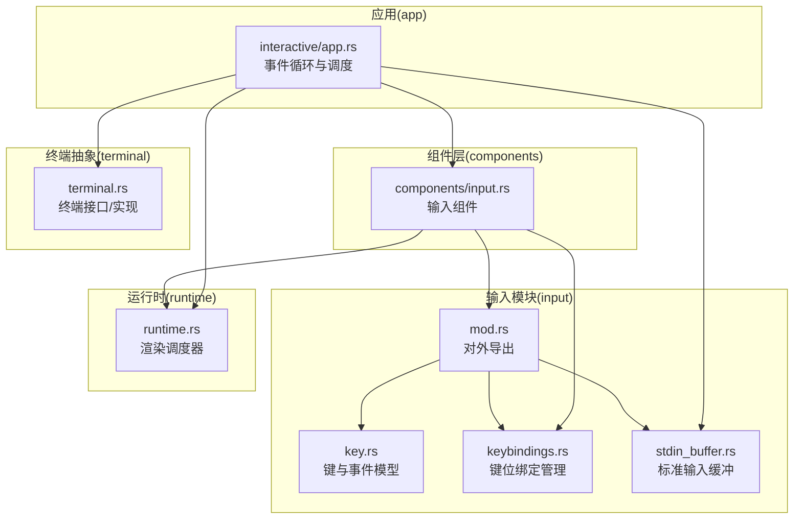
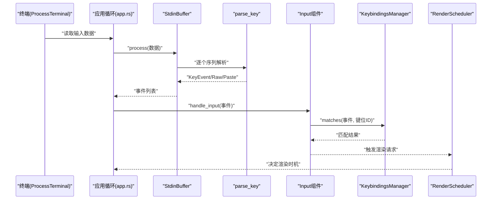
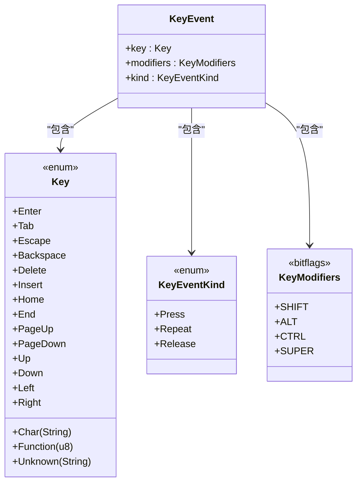
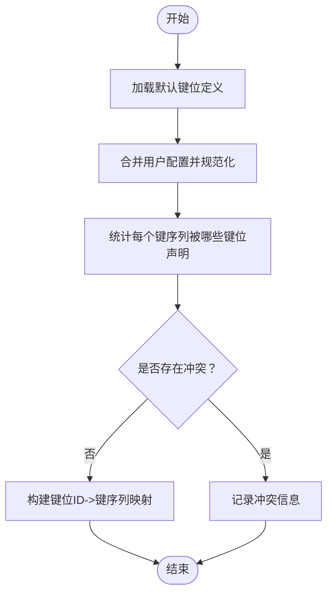
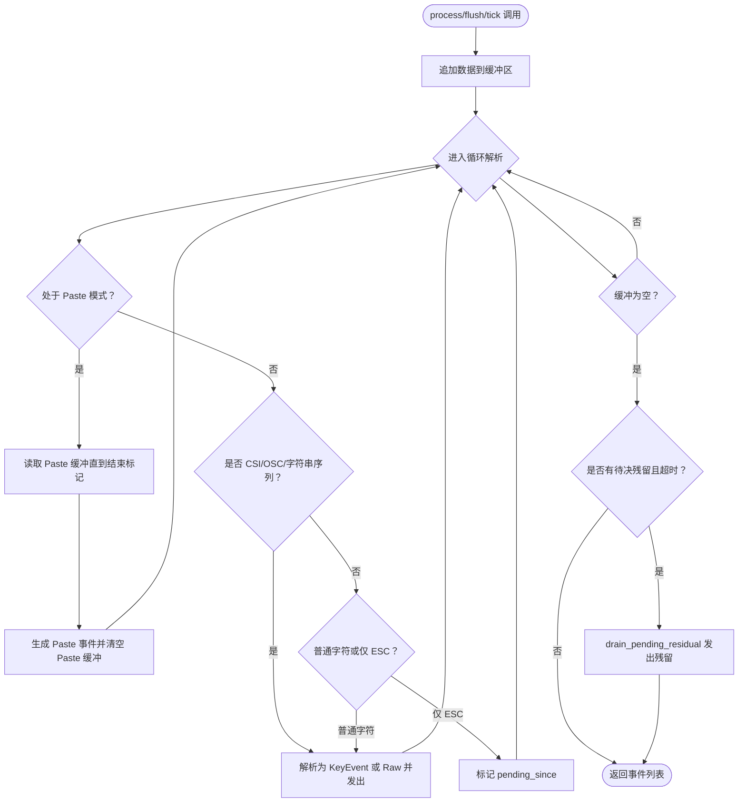
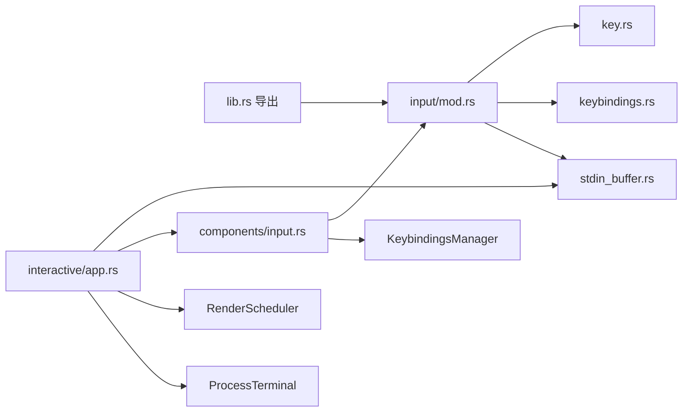

# 输入处理系统

<cite>
**本文引用的文件**
- [key.rs](file://crates/pi-tui/src/input/key.rs)
- [keybindings.rs](file://crates/pi-tui/src/input/keybindings.rs)
- [stdin_buffer.rs](file://crates/pi-tui/src/input/stdin_buffer.rs)
- [mod.rs](file://crates/pi-tui/src/input/mod.rs)
- [lib.rs](file://crates/pi-tui/src/lib.rs)
- [input.rs](file://crates/pi-tui/src/components/input.rs)
- [runtime.rs](file://crates/pi-tui/src/runtime.rs)
- [terminal.rs](file://crates/pi-tui/src/terminal.rs)
- [app.rs](file://crates/pi-coding-agent/src/interactive/app.rs)
- [input_stack.rs](file://crates/pi-tui/tests/input_stack.rs)
</cite>

## 目录
1. [简介](#简介)
2. [项目结构](#项目结构)
3. [核心组件](#核心组件)
4. [架构总览](#架构总览)
5. [详细组件分析](#详细组件分析)
6. [依赖关系分析](#依赖关系分析)
7. [性能考量](#性能考量)
8. [故障排查指南](#故障排查指南)
9. [结论](#结论)
10. [附录](#附录)

## 简介
本文件面向“输入处理系统”，围绕键盘事件解析、Key 与 KeyEvent 的建模、KeybindingManager 的键位绑定配置与冲突检测、StdinBuffer 的缓冲与异步输入处理策略展开，覆盖特殊键与修饰键组合、跨平台兼容（Kitty/CSI/SS3）方案，并提供快捷键配置与自定义键位绑定的实践指南，最后总结输入延迟、事件丢失与性能瓶颈的解决方案。

## 项目结构
输入处理系统主要位于 TUI 子 crate 的 input 模块中，配合组件层的 Input 组件、运行时调度器与终端抽象共同构成完整的输入链路。

图表来源
- [mod.rs:1-19](file://crates/pi-tui/src/input/mod.rs#L1-L19)
- [key.rs:1-407](file://crates/pi-tui/src/input/key.rs#L1-L407)
- [keybindings.rs:1-331](file://crates/pi-tui/src/input/keybindings.rs#L1-L331)
- [stdin_buffer.rs:1-348](file://crates/pi-tui/src/input/stdin_buffer.rs#L1-L348)
- [input.rs:1-181](file://crates/pi-tui/src/components/input.rs#L1-L181)
- [runtime.rs:1-60](file://crates/pi-tui/src/runtime.rs#L1-L60)
- [terminal.rs:1-164](file://crates/pi-tui/src/terminal.rs#L1-L164)
- [app.rs:2051-2194](file://crates/pi-coding-agent/src/interactive/app.rs#L2051-L2194)

章节来源
- [mod.rs:1-19](file://crates/pi-tui/src/input/mod.rs#L1-L19)
- [lib.rs:32-36](file://crates/pi-tui/src/lib.rs#L32-L36)

## 核心组件
- 键与事件模型：Key、KeyEvent、KeyEventKind、KeyModifiers，统一描述字符、功能键、未知序列与修饰键组合。
- 键位绑定管理：KeybindingManager 负责定义默认键位、合并用户配置、检测冲突、匹配输入事件。
- 标准输入缓冲：StdinBuffer 将原始字节流切分为键事件或粘贴事件，支持 CSI/OSC/字符串终止序列识别与 Kitty 协议扩展。
- 输入组件：Input 组件消费 InputEvent，调用 KeybindingsManager 进行行为分发。
- 运行时调度：RenderScheduler 控制渲染节奏；事件循环通过 tokio::select 驱动输入缓冲与渲染。
- 终端抽象：ProcessTerminal 提供跨平台的终端控制与协议开关（如 Kitty 协议）。

章节来源
- [key.rs:3-46](file://crates/pi-tui/src/input/key.rs#L3-L46)
- [keybindings.rs:21-63](file://crates/pi-tui/src/input/keybindings.rs#L21-L63)
- [stdin_buffer.rs:10-17](file://crates/pi-tui/src/input/stdin_buffer.rs#L10-L17)
- [input.rs:7-14](file://crates/pi-tui/src/components/input.rs#L7-L14)
- [runtime.rs:3-9](file://crates/pi-tui/src/runtime.rs#L3-L9)
- [terminal.rs:52-70](file://crates/pi-tui/src/terminal.rs#L52-L70)

## 架构总览
下图展示从终端读取到组件响应的完整输入链路，包括缓冲、解析、匹配与事件分发。

图表来源
- [app.rs:2051-2194](file://crates/pi-coding-agent/src/interactive/app.rs#L2051-L2194)
- [stdin_buffer.rs:60-118](file://crates/pi-tui/src/input/stdin_buffer.rs#L60-L118)
- [key.rs:48-84](file://crates/pi-tui/src/input/key.rs#L48-L84)
- [input.rs:85-147](file://crates/pi-tui/src/components/input.rs#L85-L147)
- [keybindings.rs:44-50](file://crates/pi-tui/src/input/keybindings.rs#L44-L50)
- [runtime.rs:21-48](file://crates/pi-tui/src/runtime.rs#L21-L48)

## 详细组件分析

### 键与事件模型（Key、KeyEvent、KeyEventKind、KeyModifiers）
- Key 支持字符、方向键、功能键、删除/插入/首页/末页、函数键与未知序列。
- KeyEvent 包含键值、修饰键集合与事件类型（按下/重复/释放）。
- KeyModifiers 使用位标志表示 Shift/Alt/Ctrl/Super。
- 解析优先级：Kitty CSI-u 序列 → 传统 CSI 序列 → SS3 序列 → 控制字符 → 原始字符；未知转为 Unknown。

图表来源
- [key.rs:3-46](file://crates/pi-tui/src/input/key.rs#L3-L46)
- [key.rs:24-32](file://crates/pi-tui/src/input/key.rs#L24-L32)
- [key.rs:34-46](file://crates/pi-tui/src/input/key.rs#L34-L46)

章节来源
- [key.rs:3-407](file://crates/pi-tui/src/input/key.rs#L3-L407)

### 键位绑定管理（KeybindingManager）
- 定义：键位定义包含默认键序列与可选描述；键位冲突检测基于“每个键序列映射到多个键位ID”。
- 解析与规范化：去除空串与重复项，统一大小写；合并用户配置与默认定义。
- 匹配：对给定 InputEvent，按键位ID查询其对应的键序列集合，逐一尝试 matches_key 判断。
- 冲突报告：返回所有存在多键位映射的键序列。

图表来源
- [keybindings.rs:65-100](file://crates/pi-tui/src/input/keybindings.rs#L65-L100)
- [keybindings.rs:116-331](file://crates/pi-tui/src/input/keybindings.rs#L116-L331)

章节来源
- [keybindings.rs:1-331](file://crates/pi-tui/src/input/keybindings.rs#L1-L331)

### 标准输入缓冲（StdinBuffer）与异步输入处理
- 缓冲策略：累积输入，按 VT/CSI/OSC/字符串终止序列切分；支持 Bracketed Paste 作为单次 Paste 事件。
- 超时机制：对非 Paste 的残留内容设置 pending_timeout，默认 10ms；tick 或 flush 触发超时刷新。
- 异步处理：事件循环在收到输入或超时时分别调用 process/tick，将事件交由组件处理。

图表来源
- [stdin_buffer.rs:60-180](file://crates/pi-tui/src/input/stdin_buffer.rs#L60-L180)
- [stdin_buffer.rs:183-242](file://crates/pi-tui/src/input/stdin_buffer.rs#L183-L242)

章节来源
- [stdin_buffer.rs:1-348](file://crates/pi-tui/src/input/stdin_buffer.rs#L1-L348)

### 输入组件与事件分发
- Input 组件接收 InputEvent：
  - Paste：直接插入文本。
  - Key 事件（非 Release）：
    - 匹配提交键位：触发 on_submit 回调。
    - Escape：触发 on_escape 回调。
    - 其他编辑类键位：移动光标、删除、跳转等。
    - 字符键：在无 Ctrl/Alt/Super 修饰时插入文本。
- KeybindingsManager 用于统一匹配，避免硬编码键位。

章节来源
- [input.rs:85-147](file://crates/pi-tui/src/components/input.rs#L85-L147)

### 事件循环与调度
- 应用循环使用 tokio::select 同时监听：
  - 渲染调度：根据 RenderScheduler 计算下次渲染时间。
  - 输入缓冲：等待 stdin_pending_delay，到期后调用 tick 获取超时事件。
  - 主输入通道：读取输入块，调用 process 产出事件。
- 结束条件：当输入通道关闭时，调用 flush 强制输出残留事件。

章节来源
- [app.rs:2051-2194](file://crates/pi-coding-agent/src/interactive/app.rs#L2051-L2194)

## 依赖关系分析
- 输入模块对外导出：key、keybindings、stdin_buffer 及 InputEvent 类型，供上层组件与应用使用。
- 组件依赖：Input 组件依赖 KeybindingsManager 与 InputEvent；渲染调度依赖 RenderScheduler。
- 终端依赖：ProcessTerminal 实现 Terminal trait，负责启用/禁用 raw 模式与 Kitty 协议开关。
- 测试验证：input_stack.rs 覆盖批量 ESC 序列拆分、部分 CSI 等待、Bracketed Paste、Legacy/Kitty 键解析与释放事件检测。

图表来源
- [lib.rs:32-36](file://crates/pi-tui/src/lib.rs#L32-L36)
- [mod.rs:5-10](file://crates/pi-tui/src/input/mod.rs#L5-L10)
- [input.rs:3-5](file://crates/pi-tui/src/components/input.rs#L3-L5)
- [app.rs:2051-2194](file://crates/pi-coding-agent/src/interactive/app.rs#L2051-L2194)

章节来源
- [lib.rs:32-36](file://crates/pi-tui/src/lib.rs#L32-L36)
- [mod.rs:5-10](file://crates/pi-tui/src/input/mod.rs#L5-L10)

## 性能考量
- 缓冲与切分：按 VT/CSI/OSC/字符串终止序列切分，避免整包阻塞；Bracketed Paste 一次性事件减少多次解析开销。
- 超时策略：默认 10ms 待决超时，兼顾实时性与完整性；可通过 with_pending_timeout/flush 显式控制。
- 事件过滤：Input 组件对修饰键进行快速判断，避免不必要的处理路径。
- 渲染节流：RenderScheduler 最小间隔与强制渲染标记，降低频繁重绘成本。
- 终端协议：启用 Kitty 协议可获得更丰富的事件（如 Release/Repeat），但需确保终端支持。

## 故障排查指南
- 输入延迟
  - 检查 RenderScheduler 的最小间隔与请求频率，避免过于频繁的渲染请求。
  - 确认事件循环中对 stdin_pending_delay 的处理，确保 tick 能及时触发。
- 事件丢失
  - 若仅收到 ESC，检查 pending_timeout 是否过短或未正确调用 tick/flush。
  - 对于 CSI 序列，确认 next_sequence_len 能正确识别终止字符。
- 修饰键不生效
  - 确保 KeybindingsManager 中键位定义包含期望的修饰键组合。
  - 在 Input 组件中确认对 Ctrl/Alt/Super 的过滤逻辑与插入文本分支。
- 跨平台兼容
  - Kitty CSI-u：解析 codepoint 与修饰掩码，注意大小写字符自动添加 Shift。
  - Legacy CSI/SS3：覆盖常见箭头、功能键与 Alt 修饰键。
  - Bracketed Paste：确保终端开启并正确发送 200~/201~ 标记。

章节来源
- [runtime.rs:11-58](file://crates/pi-tui/src/runtime.rs#L11-L58)
- [stdin_buffer.rs:135-153](file://crates/pi-tui/src/input/stdin_buffer.rs#L135-L153)
- [key.rs:274-307](file://crates/pi-tui/src/input/key.rs#L274-L307)
- [key.rs:170-272](file://crates/pi-tui/src/input/key.rs#L170-L272)
- [input.rs:135-143](file://crates/pi-tui/src/components/input.rs#L135-L143)

## 结论
该输入处理系统通过清晰的模型分层与严格的解析流程，实现了对多源键盘输入的可靠捕获与分发。StdinBuffer 的缓冲与超时机制有效平衡了实时性与完整性；KeybindingManager 的冲突检测与匹配能力提供了灵活的快捷键配置；Input 组件将事件转化为具体编辑动作，结合 RenderScheduler 达成流畅的交互体验。遵循本文的配置与优化建议，可在不同终端环境下稳定运行并具备良好的扩展性。

## 附录

### 键位绑定配置指南
- 默认键位定义集中在 KeybindingManager 的默认集合中，涵盖编辑类与选择类操作。
- 用户可通过 KeybindingsConfig 覆盖默认键位，系统会进行规范化与冲突检测。
- 建议：
  - 保持键位唯一性，避免同一键序列映射到多个键位。
  - 对常用操作保留默认键位，仅对个性化需求进行调整。
  - 使用 matches_key 语义化匹配，避免硬编码字符串比较。

章节来源
- [keybindings.rs:116-331](file://crates/pi-tui/src/input/keybindings.rs#L116-L331)
- [keybindings.rs:65-100](file://crates/pi-tui/src/input/keybindings.rs#L65-L100)

### 自定义键位绑定实现方法
- 定义键位 ID 与默认键序列，注册到默认集合。
- 在用户配置中提供替代键序列，系统自动合并并检测冲突。
- 在组件中通过 KeybindingsManager.matches 判断当前事件是否命中目标键位。

章节来源
- [keybindings.rs:31-63](file://crates/pi-tui/src/input/keybindings.rs#L31-L63)

### 特殊键与修饰键组合
- 特殊键：Enter、Tab、Escape、Backspace、Delete、Insert、Home、End、PageUp、PageDown、方向键、Function(n)。
- 修饰键：Shift、Alt、Ctrl、Super；Kitty 协议通过掩码组合修饰键。
- Alt 修饰：支持 \x1bX 形式的 Alt+X；某些终端也支持 SS3 序列。
- 控制字符：解析 0x00–0x1a 等控制码为 Ctrl+字母。

章节来源
- [key.rs:65-84](file://crates/pi-tui/src/input/key.rs#L65-L84)
- [key.rs:127-168](file://crates/pi-tui/src/input/key.rs#L127-L168)
- [key.rs:239-272](file://crates/pi-tui/src/input/key.rs#L239-L272)

### 跨平台兼容性方案
- Kitty CSI-u：通用扩展，支持 codepoint、修饰掩码与事件类型（Press/Repeat/Release）。
- 传统 CSI：覆盖箭头、功能键、Home/End/PageUp/PageDown 等。
- SS3：部分终端使用 Ox 前缀的箭头与功能键序列。
- Bracketed Paste：统一粘贴内容为一次 Paste 事件，避免逐字符解析。
- 终端协议：ProcessTerminal 启用/禁用 Kitty 协议与 raw 模式，确保输入解析一致性。

章节来源
- [key.rs:274-355](file://crates/pi-tui/src/input/key.rs#L274-L355)
- [key.rs:170-258](file://crates/pi-tui/src/input/key.rs#L170-L258)
- [stdin_buffer.rs:5-8](file://crates/pi-tui/src/input/stdin_buffer.rs#L5-L8)
- [terminal.rs:123-146](file://crates/pi-tui/src/terminal.rs#L123-L146)

### 关键流程图（算法实现）
- 键解析流程：优先 Kitty CSI-u，其次传统 CSI/SS3，再处理控制字符与未知序列。
- 序列长度计算：CSI/OSC/字符串终止序列按 VT 规范查找终止字符；普通字符按 UTF-8 字节长度。

章节来源
- [key.rs:48-84](file://crates/pi-tui/src/input/key.rs#L48-L84)
- [stdin_buffer.rs:183-242](file://crates/pi-tui/src/input/stdin_buffer.rs#L183-L242)