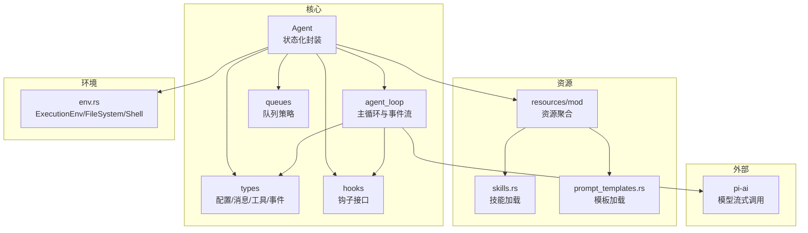
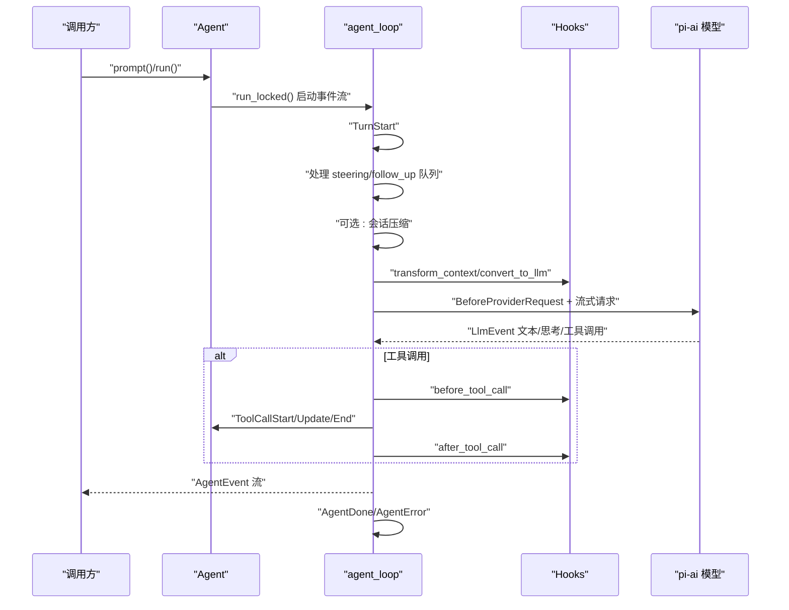
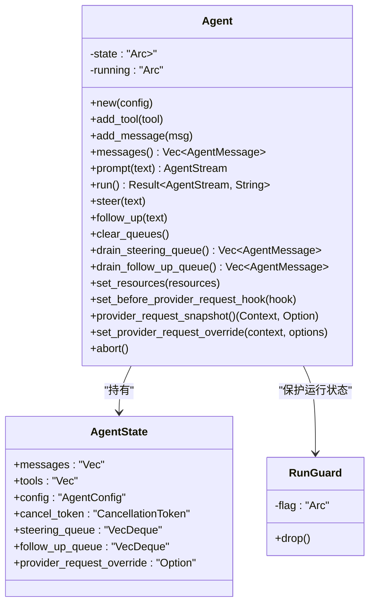
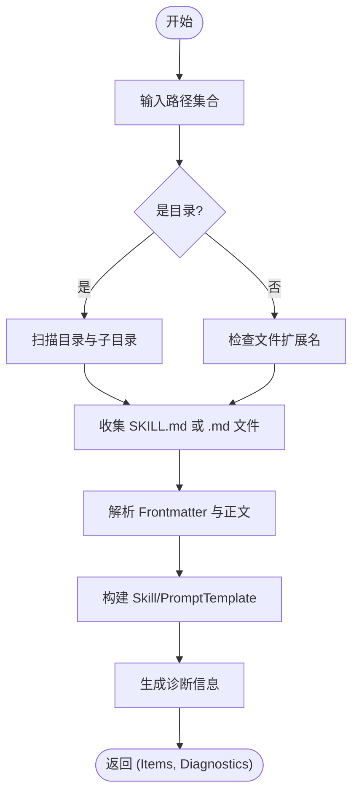
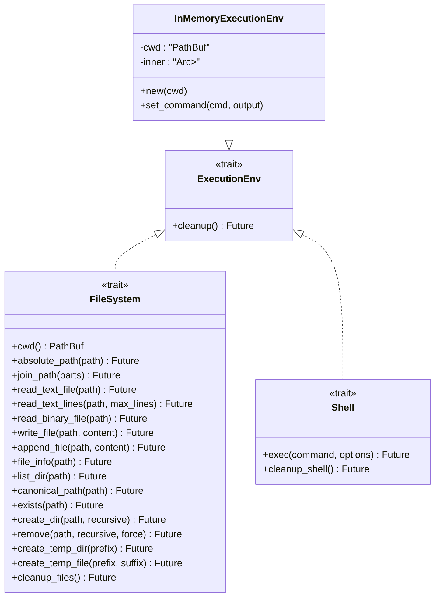
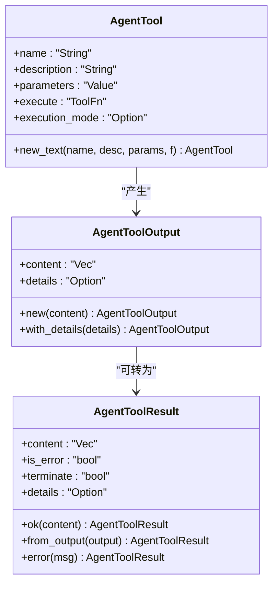
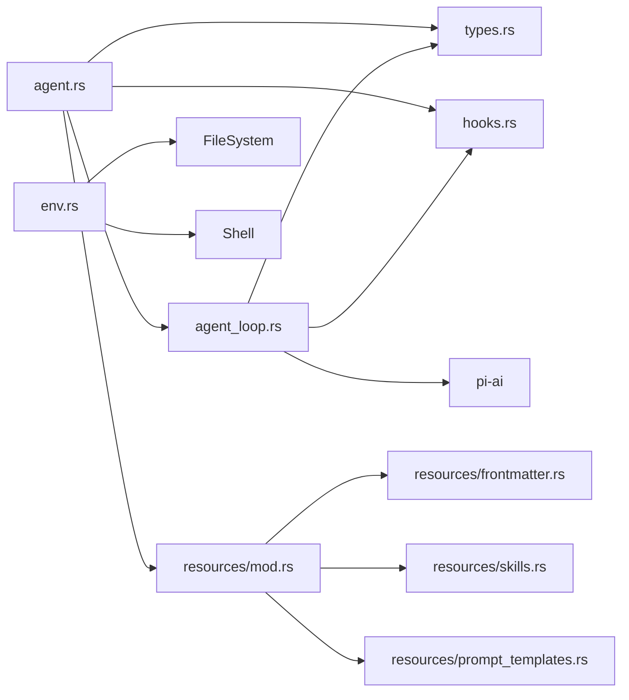

# Agent 运行时系统

<cite>
**本文引用的文件**
- [lib.rs](file://crates/pi-agent-core/src/lib.rs)
- [agent.rs](file://crates/pi-agent-core/src/agent.rs)
- [agent_loop.rs](file://crates/pi-agent-core/src/agent_loop.rs)
- [types.rs](file://crates/pi-agent-core/src/types.rs)
- [env.rs](file://crates/pi-agent-core/src/env.rs)
- [hooks.rs](file://crates/pi-agent-core/src/hooks.rs)
- [queues.rs](file://crates/pi-agent-core/src/queues.rs)
- [resources/mod.rs](file://crates/pi-agent-core/src/resources/mod.rs)
- [resources/skills.rs](file://crates/pi-agent-core/src/resources/skills.rs)
- [resources/prompt_templates.rs](file://crates/pi-agent-core/src/resources/prompt_templates.rs)
- [Cargo.toml](file://crates/pi-agent-core/Cargo.toml)
- [loop_example.rs](file://crates/pi-agent-core/examples/loop_example.rs)
</cite>

## 目录
1. [简介](#简介)
2. [项目结构](#项目结构)
3. [核心组件](#核心组件)
4. [架构总览](#架构总览)
5. [详细组件分析](#详细组件分析)
6. [依赖关系分析](#依赖关系分析)
7. [性能考虑](#性能考虑)
8. [故障排查指南](#故障排查指南)
9. [结论](#结论)
10. [附录：使用示例与最佳实践](#附录使用示例与最佳实践)

## 简介
本文件面向 Agent 运行时系统的开发者与使用者，系统性阐述 Agent 结构体的状态化设计、生命周期管理、配置体系（AgentConfig）、资源管理（AgentResources）与执行环境抽象（ExecutionEnv）。文档同时覆盖消息传递机制（AgentMessage）、工具接口（AgentTool）与结果处理（AgentToolResult），并给出初始化流程、状态转换、资源清理过程的可视化说明。最后提供并发安全、内存管理与性能优化策略，并附带可直接参考的代码示例路径。

## 项目结构
pi-agent-core 是一个以“状态化 + 流式事件”为核心的 Agent 运行时库，围绕 Agent 核心类型与事件流展开，通过 hooks 提供可插拔的扩展点，通过资源模块加载技能与提示词模板，通过 env 抽象文件系统与 Shell 执行环境，通过 compaction 模块实现会话压缩与节流。

图表来源
- [lib.rs:1-47](file://crates/pi-agent-core/src/lib.rs#L1-L47)
- [agent.rs:1-282](file://crates/pi-agent-core/src/agent.rs#L1-L282)
- [agent_loop.rs:1-860](file://crates/pi-agent-core/src/agent_loop.rs#L1-L860)
- [types.rs:1-657](file://crates/pi-agent-core/src/types.rs#L1-L657)
- [hooks.rs:1-162](file://crates/pi-agent-core/src/hooks.rs#L1-L162)
- [queues.rs:1-10](file://crates/pi-agent-core/src/queues.rs#L1-L10)
- [resources/mod.rs:1-12](file://crates/pi-agent-core/src/resources/mod.rs#L1-L12)
- [resources/skills.rs:1-246](file://crates/pi-agent-core/src/resources/skills.rs#L1-L246)
- [resources/prompt_templates.rs:1-166](file://crates/pi-agent-core/src/resources/prompt_templates.rs#L1-L166)
- [env.rs:1-466](file://crates/pi-agent-core/src/env.rs#L1-L466)

章节来源
- [lib.rs:1-47](file://crates/pi-agent-core/src/lib.rs#L1-L47)
- [Cargo.toml:1-23](file://crates/pi-agent-core/Cargo.toml#L1-L23)

## 核心组件
- Agent：状态化封装，持有 AgentState（消息、工具、配置、取消令牌、队列等），对外暴露 prompt/run/steer/follow_up 等方法，内部通过 agent_loop::run_loop 驱动事件流。
- AgentState：包含消息列表、工具列表、AgentConfig、CancellationToken、两个队列（steering/follow_up）以及可选的 provider 请求覆盖。
- AgentConfig：集中配置项，如模型、系统提示、最大轮次、流式选项、思考级别、工具执行模式、队列模式、钩子、资源、压缩配置等。
- AgentResources：技能与提示模板集合，支持来源标记与诊断信息。
- ExecutionEnv/FileSystem/Shell：抽象执行环境，提供文件读写、目录操作、临时文件、命令执行等能力；InMemoryExecutionEnv 提供内存态实现用于测试与沙箱。
- AgentMessage：统一的消息类型，涵盖用户文本、助手回复、工具结果、系统提示、压缩摘要、Bash 执行、自定义消息等。
- AgentTool/AgentToolResult：工具接口与结果封装，支持同步/异步执行、更新回调、错误与终止语义。
- Hooks：在请求前、工具调用前后、回合结束判断、下一轮准备、上下文变换、LLM 转换等阶段注入逻辑。

章节来源
- [agent.rs:14-282](file://crates/pi-agent-core/src/agent.rs#L14-L282)
- [types.rs:116-657](file://crates/pi-agent-core/src/types.rs#L116-L657)
- [env.rs:35-466](file://crates/pi-agent-core/src/env.rs#L35-L466)
- [hooks.rs:12-162](file://crates/pi-agent-core/src/hooks.rs#L12-L162)

## 架构总览
Agent 的运行由 agent_loop 驱动，按回合推进：先处理 steering/follow_up 队列，再进行会话压缩（可选），随后上下文变换与 LLM 调用，根据 StopReason 决定是否进入工具调用阶段，工具调用支持串行或并行，期间通过钩子进行拦截与后置处理，最终生成 AgentEvent 流返回给调用方。

图表来源
- [agent.rs:195-282](file://crates/pi-agent-core/src/agent.rs#L195-L282)
- [agent_loop.rs:153-860](file://crates/pi-agent-core/src/agent_loop.rs#L153-L860)
- [hooks.rs:70-162](file://crates/pi-agent-core/src/hooks.rs#L70-L162)

## 详细组件分析

### Agent 状态化设计与生命周期
- 状态封装：Agent 使用 Arc<RwLock<AgentState>> 将内部状态暴露为共享可变视图，确保多任务安全访问。
- 生命周期控制：
  - 运行标志：running AtomicBool 防止并发重复启动 prompt/run。
  - 取消令牌：CancellationToken 支持外部 abort 中断当前回合。
  - 队列：steering/follow_up 两个 VecDeque，配合 QueueMode 控制一次性或批量注入。
- 初始化与替换：
  - new(config) 创建空状态。
  - with_messages(config, messages) 快速注入初始消息。
  - replace_messages 替换消息列表。
- 事件流：run_locked 包装 agent_loop::run_loop 为异步流，逐个 yield AgentEvent。

图表来源
- [agent.rs:39-282](file://crates/pi-agent-core/src/agent.rs#L39-L282)

章节来源
- [agent.rs:53-282](file://crates/pi-agent-core/src/agent.rs#L53-L282)

### AgentConfig 配置系统
- 关键字段：
  - model：推理模型定义
  - system_prompt：系统提示
  - max_turns：回合上限
  - stream_options：流式选项（含取消令牌）
  - thinking_level：思考级别（Off/Medium/XHigh 等）
  - tool_execution：工具执行模式（串行/并行）
  - steering_mode/follow_up_mode：队列注入模式
  - hooks：钩子集合
  - resources：AgentResources
  - compaction：会话压缩配置
- 默认值：new(model) 提供与基准一致的默认行为。

章节来源
- [types.rs:407-443](file://crates/pi-agent-core/src/types.rs#L407-L443)

### AgentResources 资源管理机制
- 结构：skills、prompt_templates 两个向量组成。
- 加载：
  - load_skills/load_sourced_skills：从路径或目录加载技能，支持 .md 文件与忽略规则。
  - load_prompt_templates/load_sourced_prompt_templates：从路径或目录加载模板。
- 来源标记与诊断：SourceTag 与 ResourceDiagnostic/Sourced* 类型用于追踪来源与错误信息。

图表来源
- [resources/skills.rs:9-168](file://crates/pi-agent-core/src/resources/skills.rs#L9-L168)
- [resources/prompt_templates.rs:8-127](file://crates/pi-agent-core/src/resources/prompt_templates.rs#L8-L127)

章节来源
- [resources/mod.rs:1-12](file://crates/pi-agent-core/src/resources/mod.rs#L1-L12)
- [resources/skills.rs:1-246](file://crates/pi-agent-core/src/resources/skills.rs#L1-L246)
- [resources/prompt_templates.rs:1-166](file://crates/pi-agent-core/src/resources/prompt_templates.rs#L1-L166)

### ExecutionEnv 执行环境抽象
- 接口：
  - FileSystem：路径解析、读写、目录遍历、存在性、临时文件/目录、清理等。
  - Shell：命令执行、清理。
  - ExecutionEnv：组合 FileSystem 与 Shell，并提供统一 cleanup。
- InMemoryExecutionEnv：内存态实现，便于测试与无副作用场景，支持命令注册与状态模拟。

图表来源
- [env.rs:35-99](file://crates/pi-agent-core/src/env.rs#L35-L99)
- [env.rs:101-438](file://crates/pi-agent-core/src/env.rs#L101-L438)

章节来源
- [env.rs:1-466](file://crates/pi-agent-core/src/env.rs#L1-L466)

### AgentMessage 消息传递机制
- 统一枚举封装多种消息类型，保证上下文一致性与可序列化。
- 典型类型：UserText、Assistant、ToolResult、SystemPrompt、CompactionSummary、BashExecution、Custom、BranchSummary。
- 在 AgentState 中维护顺序列表，作为后续上下文组装的基础。

章节来源
- [types.rs:300-353](file://crates/pi-agent-core/src/types.rs#L300-L353)

### AgentTool 工具接口设计与 AgentToolResult 结果处理
- AgentTool：
  - 字段：name/description/parameters/execute/execution_mode
  - execute 类型：Arc<dyn Fn(...) -> Future<Output=Result<AgentToolOutput,...>> + Send + Sync>
  - 工具工厂：new_text 提供便捷构造，自动包装字符串输出为 ContentBlock。
- AgentToolOutput/AgentToolResult：
  - 输出：content + details
  - 结果：content/is_error/terminate/details，支持 error/ok/from_output 辅助构造。
- 更新回调：ToolUpdateCallback 支持工具执行过程中的增量更新。

图表来源
- [types.rs:357-405](file://crates/pi-agent-core/src/types.rs#L357-L405)
- [types.rs:118-184](file://crates/pi-agent-core/src/types.rs#L118-L184)

章节来源
- [types.rs:116-405](file://crates/pi-agent-core/src/types.rs#L116-L405)

### 初始化流程、状态转换与资源清理
- 初始化：
  - 创建 AgentConfig 并设置 system_prompt/max_turns 等。
  - 通过 Agent::new(config) 构造 Agent。
  - 可选：Agent::with_messages 注入初始对话。
- 状态转换：
  - prompt()/run() -> TurnStart -> BeforeProviderRequest -> LlmEvent* -> ToolCall*/AgentDone/AgentError。
  - 队列驱动：steering/follow_up 在回合开始与结束时注入。
- 资源清理：
  - InMemoryExecutionEnv 提供 cleanup_files/cleanup_shell 清理。
  - CancellationToken 支持 abort 主动中断。

章节来源
- [agent.rs:53-282](file://crates/pi-agent-core/src/agent.rs#L53-L282)
- [agent_loop.rs:153-860](file://crates/pi-agent-core/src/agent_loop.rs#L153-L860)
- [env.rs:89-99](file://crates/pi-agent-core/src/env.rs#L89-L99)

## 依赖关系分析
- 内部依赖：
  - agent.rs 依赖 agent_loop.rs、types、resources、hooks。
  - agent_loop.rs 依赖 types、hooks、compaction、pi-ai 的流式接口。
  - resources/* 依赖 frontmatter 解析与 ignore 遍历。
  - env.rs 依赖标准库与 futures。
- 外部依赖：
  - pi-ai：提供模型流式调用与上下文转换。
  - tokio-util：CancellationToken。
  - async-stream/futures：异步流与并发控制。

图表来源
- [lib.rs:1-47](file://crates/pi-agent-core/src/lib.rs#L1-L47)
- [agent.rs:1-12](file://crates/pi-agent-core/src/agent.rs#L1-L12)
- [agent_loop.rs:1-24](file://crates/pi-agent-core/src/agent_loop.rs#L1-L24)
- [resources/mod.rs:1-12](file://crates/pi-agent-core/src/resources/mod.rs#L1-L12)
- [env.rs:1-6](file://crates/pi-agent-core/src/env.rs#L1-L6)

章节来源
- [Cargo.toml:6-18](file://crates/pi-agent-core/Cargo.toml#L6-L18)

## 性能考虑
- 并发与锁粒度：
  - 使用 Arc<RwLock<...>> 降低锁竞争，仅在需要修改时写锁。
  - 工具执行采用 FuturesUnordered 并行，结合钩子串行准备，平衡吞吐与一致性。
- 流式处理：
  - LLM 与工具更新均以事件流形式产出，避免大对象堆积。
- 压缩与节流：
  - 会话压缩（tokens 估算、摘要、保留最近消息）减少上下文开销。
- 队列模式：
  - QueueMode::OneAtATime 降低单轮负载，All 则适合批量化注入。
- 取消与超时：
  - CancellationToken 与 max_turns 提供可控的退出路径。

[本节为通用指导，无需特定文件引用]

## 故障排查指南
- 常见错误来源：
  - Agent 运行中再次调用 prompt()/run()：触发 panic（RunGuard 保护）。
  - run() 继续条件不满足：当 messages 为空或最后一条为 Assistant 时返回错误。
  - LLM 流未结束即 Done：yield AgentError。
  - 工具未知或执行失败：ToolResult.is_error=true 或 error() 构造。
- 调试建议：
  - 订阅 AgentEvent 流，关注 BeforeProviderRequest/LlmEvent/ToolCall*。
  - 使用 abort() 主动中断长耗时回合。
  - 检查 hooks 返回值与错误链路。

章节来源
- [agent.rs:177-243](file://crates/pi-agent-core/src/agent.rs#L177-L243)
- [agent_loop.rs:358-448](file://crates/pi-agent-core/src/agent_loop.rs#L358-L448)

## 结论
Agent 运行时系统以状态化与事件流为核心，通过清晰的配置、资源与环境抽象，提供了高扩展性的智能体运行框架。借助 hooks 与队列策略，可在不侵入主循环的前提下实现灵活的业务编排；通过压缩与流式处理，兼顾性能与稳定性。建议在生产环境中结合队列模式、压缩配置与取消令牌，形成稳健的运行策略。

[本节为总结，无需特定文件引用]

## 附录：使用示例与最佳实践
- 示例程序：loop_example 展示了如何注册模型、创建 Agent、添加工具、订阅事件流并打印最终消息。
- 最佳实践：
  - 使用 AgentConfig::new(model) 初始化，按需设置 thinking_level/tool_execution/queue 模式。
  - 通过 Agent::with_messages 注入初始上下文，避免手动 add_message。
  - 工具实现中提供 ToolUpdateCallback，以便实时反馈进度。
  - 对于长会话启用 CompactionConfig，合理设置 reserve_tokens/keep_recent_tokens。
  - 使用 abort() 与 max_turns 防止无限循环。

章节来源
- [loop_example.rs:1-123](file://crates/pi-agent-core/examples/loop_example.rs#L1-L123)
- [types.rs:407-443](file://crates/pi-agent-core/src/types.rs#L407-L443)