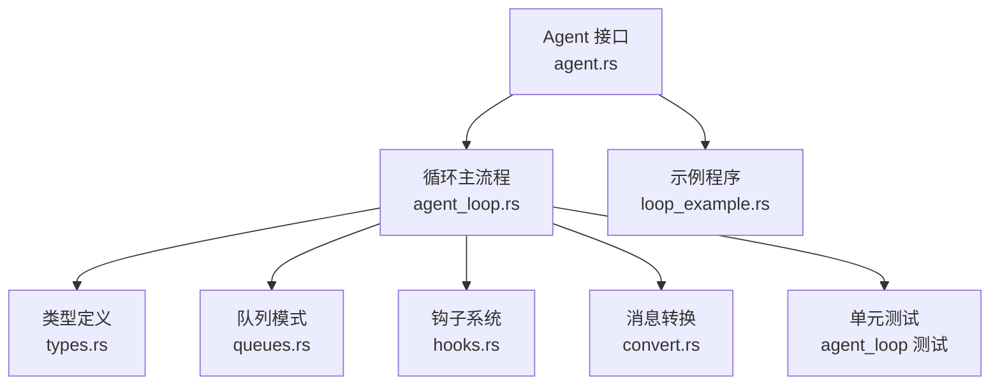
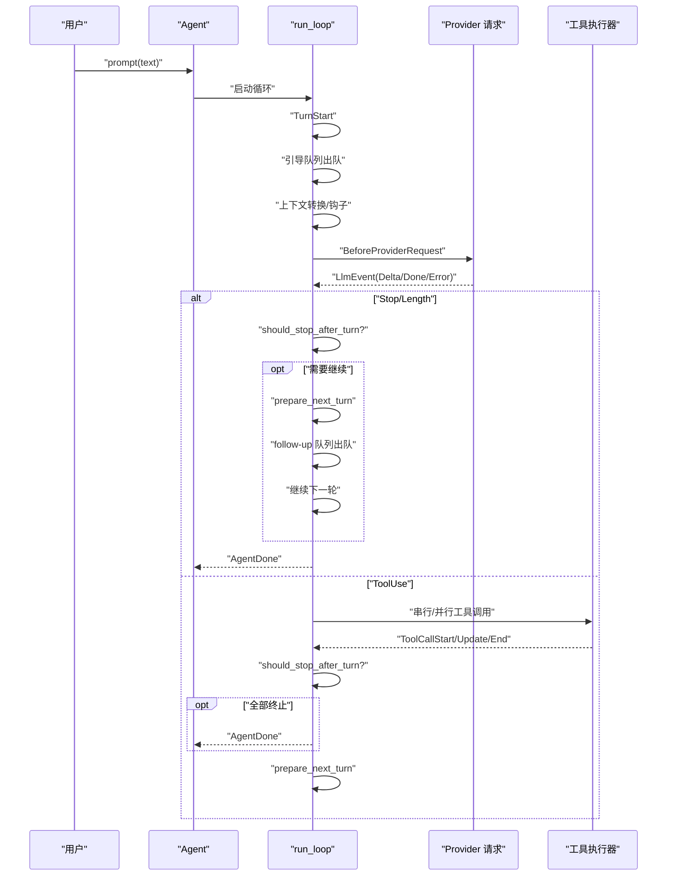
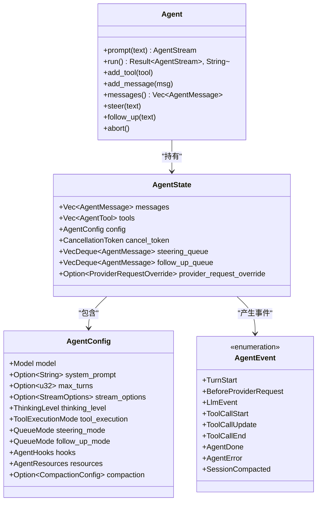
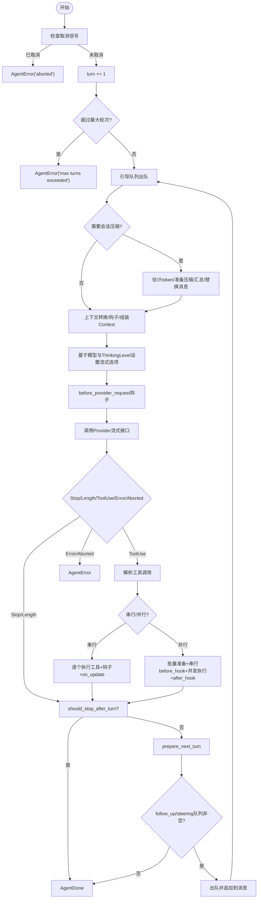
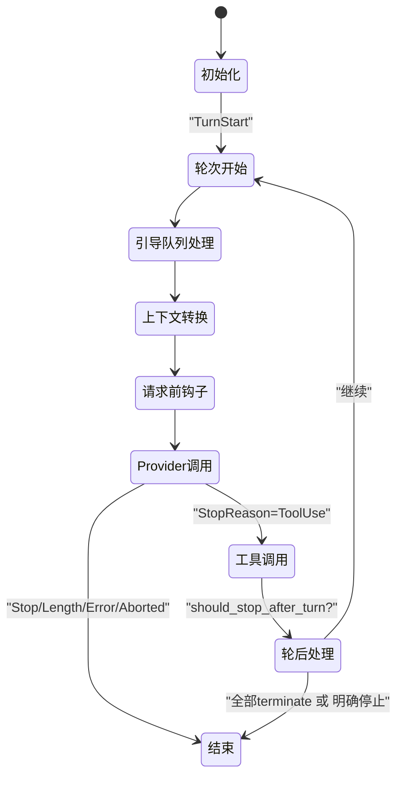
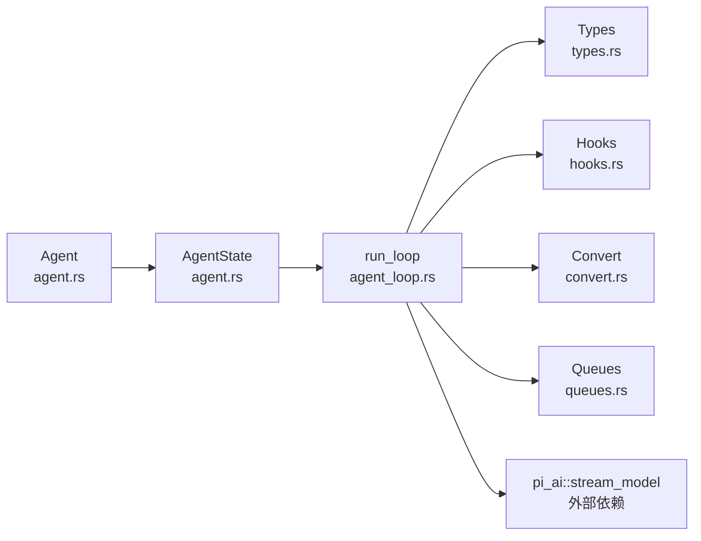

# AgentLoop 循环算法

<cite>
**本文引用的文件**
- [agent_loop.rs](file://crates/pi-agent-core/src/agent_loop.rs)
- [agent.rs](file://crates/pi-agent-core/src/agent.rs)
- [types.rs](file://crates/pi-agent-core/src/types.rs)
- [queues.rs](file://crates/pi-agent-core/src/queues.rs)
- [hooks.rs](file://crates/pi-agent-core/src/hooks.rs)
- [convert.rs](file://crates/pi-agent-core/src/convert.rs)
- [loop_example.rs](file://crates/pi-agent-core/examples/loop_example.rs)
- [agent_loop 测试](file://crates/pi-agent-core/tests/agent_loop.rs)
</cite>

## 目录
1. [简介](#简介)
2. [项目结构](#项目结构)
3. [核心组件](#核心组件)
4. [架构总览](#架构总览)
5. [详细组件分析](#详细组件分析)
6. [依赖关系分析](#依赖关系分析)
7. [性能考量](#性能考量)
8. [故障排查指南](#故障排查指南)
9. [结论](#结论)
10. [附录](#附录)

## 简介
本文件面向 AgentLoop 循环算法，系统性阐述其核心设计与实现细节，覆盖多轮对话处理、工具调用循环、消息队列与事件分发、状态管理、停止条件与并发执行策略等。文档同时提供算法流程图、状态转换图与类图，并给出使用示例与最佳实践，帮助读者在不深入源码的情况下也能高效理解与应用该算法。

## 项目结构
AgentLoop 所在模块位于 pi-agent-core，核心文件如下：
- agent_loop.rs：循环主流程与事件分发
- agent.rs：Agent 对外接口与状态封装
- types.rs：类型定义（ThinkingLevel、QueueMode、ToolExecutionMode、AgentEvent 等）
- queues.rs：队列模式（QueueMode）的出队策略
- hooks.rs：钩子系统（生命周期钩子与上下文）
- convert.rs：消息到 LLM 上下文的转换
- loop_example.rs：示例程序
- agent_loop 测试：行为验证与边界条件测试

图表来源
- [agent.rs:1-282](file://crates/pi-agent-core/src/agent.rs#L1-L282)
- [agent_loop.rs:153-860](file://crates/pi-agent-core/src/agent_loop.rs#L153-L860)
- [types.rs:11-114](file://crates/pi-agent-core/src/types.rs#L11-L114)
- [queues.rs:4-9](file://crates/pi-agent-core/src/queues.rs#L4-L9)
- [hooks.rs:12-162](file://crates/pi-agent-core/src/hooks.rs#L12-L162)
- [convert.rs:95-155](file://crates/pi-agent-core/src/convert.rs#L95-L155)
- [loop_example.rs:1-123](file://crates/pi-agent-core/examples/loop_example.rs#L1-L123)
- [agent_loop 测试:1-433](file://crates/pi-agent-core/tests/agent_loop.rs#L1-L433)

章节来源
- [agent.rs:1-282](file://crates/pi-agent-core/src/agent.rs#L1-L282)
- [agent_loop.rs:153-860](file://crates/pi-agent-core/src/agent_loop.rs#L153-L860)
- [types.rs:11-114](file://crates/pi-agent-core/src/types.rs#L11-L114)
- [queues.rs:4-9](file://crates/pi-agent-core/src/queues.rs#L4-L9)
- [hooks.rs:12-162](file://crates/pi-agent-core/src/hooks.rs#L12-L162)
- [convert.rs:95-155](file://crates/pi-agent-core/src/convert.rs#L95-L155)
- [loop_example.rs:1-123](file://crates/pi-agent-core/examples/loop_example.rs#L1-L123)
- [agent_loop 测试:1-433](file://crates/pi-agent-core/tests/agent_loop.rs#L1-L433)

## 核心组件
- AgentLoop 主循环：驱动一轮又一轮的思考-工具调用-输出生成-状态更新，贯穿整个会话生命周期。
- 队列模式（QueueMode）：支持“全部”和“逐条”的队列出队策略，分别用于引导（steering）与后续请求（follow-up）。
- 思维级别（ThinkingLevel）：控制模型推理预算与努力程度，影响流式选项中的思考配置。
- 工具执行模式（ToolExecutionMode）：串行或并行执行工具调用，支持每个工具的覆盖优先级。
- 钩子系统（AgentHooks）：在关键节点注入自定义逻辑，如上下文转换、请求前调整、工具前后处理、回合结束判定与下一轮准备。
- 消息与事件（AgentMessage、AgentEvent）：统一承载用户输入、助手输出、工具结果、会话压缩摘要、事件通知等。

章节来源
- [agent_loop.rs:153-860](file://crates/pi-agent-core/src/agent_loop.rs#L153-L860)
- [types.rs:11-114](file://crates/pi-agent-core/src/types.rs#L11-L114)
- [hooks.rs:12-162](file://crates/pi-agent-core/src/hooks.rs#L12-L162)
- [convert.rs:9-89](file://crates/pi-agent-core/src/convert.rs#L9-L89)

## 架构总览
AgentLoop 的运行时由 Agent 封装状态，通过 run_loop 驱动每一轮循环。循环内部按阶段顺序执行：输入处理（引导队列、上下文转换、请求前钩子）、思考生成（构建上下文与流式选项）、工具调用（串行或并行）、输出生成（写入消息、触发停止条件与下一轮准备）、状态更新（消息队列、思维级别、模型与流选项）。事件通过异步流逐段产出，供上层消费。

图表来源
- [agent.rs:177-208](file://crates/pi-agent-core/src/agent.rs#L177-L208)
- [agent_loop.rs:162-856](file://crates/pi-agent-core/src/agent_loop.rs#L162-L856)
- [hooks.rs:70-86](file://crates/pi-agent-core/src/hooks.rs#L70-L86)

## 详细组件分析

### AgentLoop 循环阶段与处理逻辑
- 输入处理
  - 引导队列（steering_queue）：在构建上下文前先出队，支持实时干预。
  - 会话压缩（可选）：估算 token、准备压缩、汇总并替换旧消息，减少上下文开销。
  - 上下文转换：可选 transform_context 钩子；可选 convert_to_llm 钩子；最终组装 Context。
  - 请求前钩子：before_provider_request 可修改 Context 或流式选项。
- 思考生成
  - 基于模型能力与 ThinkingLevel 设置流式选项中的思考配置。
  - 调用 Provider 流式接口，逐段产出事件。
- 工具调用
  - 串行模式：逐个执行工具，支持 before_tool_call 与 after_tool_call 钩子，支持 on_update 回调。
  - 并行模式：批量准备后并发执行，仅在 before_tool_call 钩子阶段串行化，其余阶段并行。
- 输出生成
  - 写入 ToolResult 到消息队列；根据 stop_reason 与钩子决定是否继续。
  - 若全部 ToolResult 标记 terminate，则直接完成。
- 状态更新
  - should_stop_after_turn：允许业务逻辑决定是否提前结束。
  - prepare_next_turn：允许动态调整 messages、thinking_level、model、stream_options。

章节来源
- [agent_loop.rs:184-352](file://crates/pi-agent-core/src/agent_loop.rs#L184-L352)
- [agent_loop.rs:354-397](file://crates/pi-agent-core/src/agent_loop.rs#L354-L397)
- [agent_loop.rs:449-560](file://crates/pi-agent-core/src/agent_loop.rs#L449-L560)
- [agent_loop.rs:562-856](file://crates/pi-agent-core/src/agent_loop.rs#L562-L856)

### 队列模式（QueueMode）选择策略
- All：一次性取出所有消息，适合批量注入。
- OneAtATime：每次只取一条消息，适合逐步引导或避免上下文膨胀。
- 使用场景：
  - Steering（引导）：默认 OneAtATime，确保逐步注入，便于实时干预。
  - Follow-up（后续）：默认 OneAtATime，保证后续请求有序进入。

章节来源
- [types.rs:85-114](file://crates/pi-agent-core/src/types.rs#L85-L114)
- [queues.rs:4-9](file://crates/pi-agent-core/src/queues.rs#L4-L9)
- [agent_loop.rs:186-190](file://crates/pi-agent-core/src/agent_loop.rs#L186-L190)
- [agent_loop.rs:425-432](file://crates/pi-agent-core/src/agent_loop.rs#L425-L432)

### 思维级别（ThinkingLevel）控制机制
- Off：关闭思考。
- Minimal/Low/Medium/High/XHigh：对应不同预算 token，映射到流式选项的思考配置。
- 仅当模型具备推理能力（reasoning=true）时生效；否则强制禁用思考。
- 在每轮开始时根据当前 ThinkingLevel 动态设置流式选项。

章节来源
- [types.rs:13-52](file://crates/pi-agent-core/src/types.rs#L13-L52)
- [agent_loop.rs:282-306](file://crates/pi-agent-core/src/agent_loop.rs#L282-L306)

### 停止条件判断
- 自然停止：模型返回 Stop 或 Length，随后调用 should_stop_after_turn 钩子确认是否继续。
- 显式终止：若 ToolResult 全部标记 terminate，则直接完成。
- 异常终止：模型返回 Error、Aborted，或流未产生 Done 即结束。
- 轮次上限：超过 max_turns 抛错并退出。

章节来源
- [agent_loop.rs:399-449](file://crates/pi-agent-core/src/agent_loop.rs#L399-L449)
- [agent_loop.rs:844-849](file://crates/pi-agent-core/src/agent_loop.rs#L844-L849)
- [agent_loop.rs:170-180](file://crates/pi-agent-core/src/agent_loop.rs#L170-L180)

### 并发处理与工具调用循环
- 串行模式（Sequential）
  - 逐个发出 ToolCallStart，执行工具，等待 ToolCallEnd。
  - 支持 on_update 回调，边执行边推送 ToolCallUpdate。
  - before_tool_call 与 after_tool_call 钩子在每个工具上串行执行。
- 并行模式（Parallel）
  - 先批量发出 ToolCallStart，再串行执行 before_tool_call 钩子。
  - 并发执行工具，完成后统一发出 ToolCallEnd。
  - after_tool_call 钩子在每个工具完成后异步应用。
- 优先级：若任一工具声明 Sequential 执行模式，则整轮采用串行以满足约束。

章节来源
- [types.rs:54-83](file://crates/pi-agent-core/src/types.rs#L54-L83)
- [agent_loop.rs:465-479](file://crates/pi-agent-core/src/agent_loop.rs#L465-L479)
- [agent_loop.rs:482-560](file://crates/pi-agent-core/src/agent_loop.rs#L482-L560)
- [agent_loop.rs:675-830](file://crates/pi-agent-core/src/agent_loop.rs#L675-L830)

### 消息队列处理与事件分发
- AgentState 维护：
  - messages：历史消息列表
  - steering_queue/follow_up_queue：引导与后续请求队列
  - cancel_token：取消令牌
- 事件类型：
  - TurnStart、BeforeProviderRequest、LlmEvent、ToolCallStart/Update/End、AgentDone、AgentError、SessionCompacted
- 事件分发：run_loop 通过异步流逐段产出事件，上层可订阅并消费。

章节来源
- [agent.rs:14-27](file://crates/pi-agent-core/src/agent.rs#L14-L27)
- [types.rs:456-491](file://crates/pi-agent-core/src/types.rs#L456-L491)
- [agent_loop.rs:153-182](file://crates/pi-agent-core/src/agent_loop.rs#L153-L182)

### 类图：AgentLoop 关键类型与关系

图表来源
- [agent.rs:14-282](file://crates/pi-agent-core/src/agent.rs#L14-L282)
- [types.rs:407-443](file://crates/pi-agent-core/src/types.rs#L407-L443)
- [types.rs:456-491](file://crates/pi-agent-core/src/types.rs#L456-L491)

### 算法流程图：单轮循环

图表来源
- [agent_loop.rs:162-856](file://crates/pi-agent-core/src/agent_loop.rs#L162-L856)

### 状态转换图：AgentLoop 生命周期

图表来源
- [agent_loop.rs:162-856](file://crates/pi-agent-core/src/agent_loop.rs#L162-L856)

## 依赖关系分析
- Agent 依赖 AgentState 与 run_loop，负责消息注入与运行状态管理。
- run_loop 依赖 types（事件、枚举）、hooks（钩子）、convert（上下文转换）、queues（队列模式）、pi_ai（Provider 流式接口）。
- 钩子系统提供扩展点，避免在核心循环中硬编码业务逻辑。
- 队列模式与工具执行模式共同决定并发策略与顺序约束。

图表来源
- [agent.rs:1-282](file://crates/pi-agent-core/src/agent.rs#L1-L282)
- [agent_loop.rs:1-24](file://crates/pi-agent-core/src/agent_loop.rs#L1-L24)

章节来源
- [agent.rs:1-282](file://crates/pi-agent-core/src/agent.rs#L1-L282)
- [agent_loop.rs:1-24](file://crates/pi-agent-core/src/agent_loop.rs#L1-L24)

## 性能考量
- 会话压缩：在进入每轮前评估 token 数量，必要时进行摘要压缩，降低上下文成本。
- 思维级别：合理设置 ThinkingLevel，避免过度预算导致延迟与成本上升。
- 队列模式：引导与后续默认 OneAtATime，有助于控制上下文增长速度。
- 工具执行：并行模式提升吞吐，但需注意资源竞争与钩子串行化带来的瓶颈。
- 取消与超时：通过 CancellationToken 实现快速中断，避免无效轮次。

章节来源
- [agent_loop.rs:47-97](file://crates/pi-agent-core/src/agent_loop.rs#L47-L97)
- [agent_loop.rs:282-306](file://crates/pi-agent-core/src/agent_loop.rs#L282-L306)
- [agent_loop.rs:465-479](file://crates/pi-agent-core/src/agent_loop.rs#L465-L479)

## 故障排查指南
- 最大轮次超限：检查 max_turns 配置，确认 should_stop_after_turn 钩子逻辑。
- 未知工具：工具名称不存在时会返回错误内容并继续，检查工具注册与名称匹配。
- Provider 错误：保留原始错误信息并终止，检查模型配置与网络连接。
- 中途取消：调用 abort 后立即产生错误事件，确认取消时机与并发安全。
- 上下文为空或最后一条为 Assistant：调用 run() 前确保消息有效且以 UserText 结尾。

章节来源
- [agent_loop 测试:231-273](file://crates/pi-agent-core/tests/agent_loop.rs#L231-L273)
- [agent_loop 测试:194-228](file://crates/pi-agent-core/tests/agent_loop.rs#L194-L228)
- [agent_loop 测试:355-384](file://crates/pi-agent-core/tests/agent_loop.rs#L355-L384)
- [agent_loop 测试:335-352](file://crates/pi-agent-core/tests/agent_loop.rs#L335-L352)
- [agent.rs:223-243](file://crates/pi-agent-core/src/agent.rs#L223-L243)

## 结论
AgentLoop 通过清晰的阶段划分、灵活的钩子扩展、严谨的状态管理与事件分发，实现了高可扩展的多轮对话与工具调用循环。其并发策略与队列模式使系统既能保持响应性又能满足复杂业务需求。配合会话压缩与思维级别控制，可在性能与质量之间取得平衡。

## 附录

### 使用示例与最佳实践
- 示例程序展示了如何注册模型、添加工具、发起对话并消费事件。
- 最佳实践建议：
  - 明确 max_turns，避免无限循环。
  - 合理设置 ThinkingLevel，结合模型能力与成本预算。
  - 使用 OneAtATime 控制引导与后续注入节奏。
  - 在工具执行中使用 on_update 提供进度反馈。
  - 通过 should_stop_after_turn 与 prepare_next_turn 实现业务决策与动态调整。

章节来源
- [loop_example.rs:1-123](file://crates/pi-agent-core/examples/loop_example.rs#L1-L123)
- [agent_loop 测试:132-191](file://crates/pi-agent-core/tests/agent_loop.rs#L132-L191)