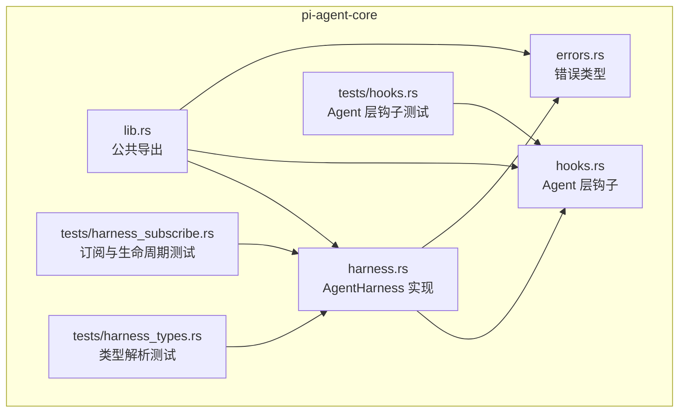
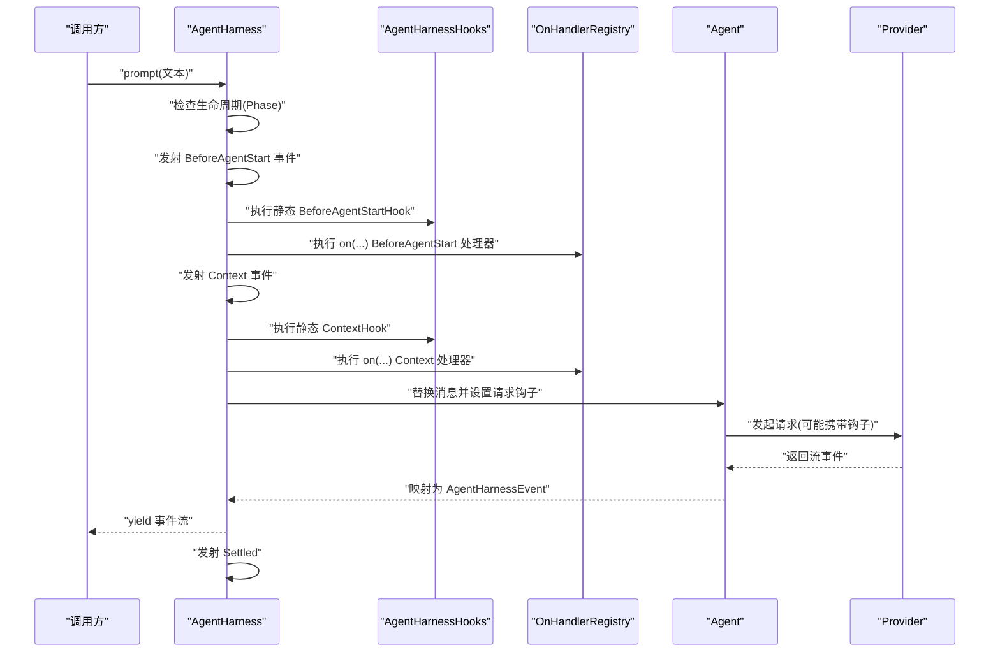
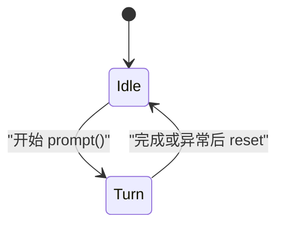
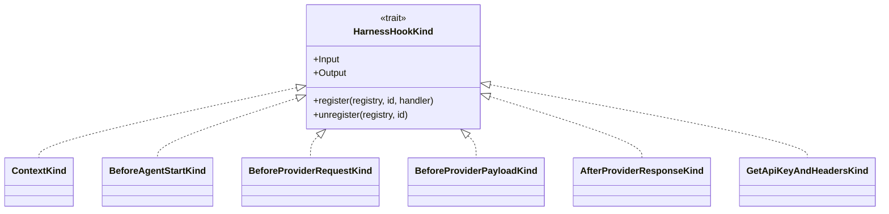
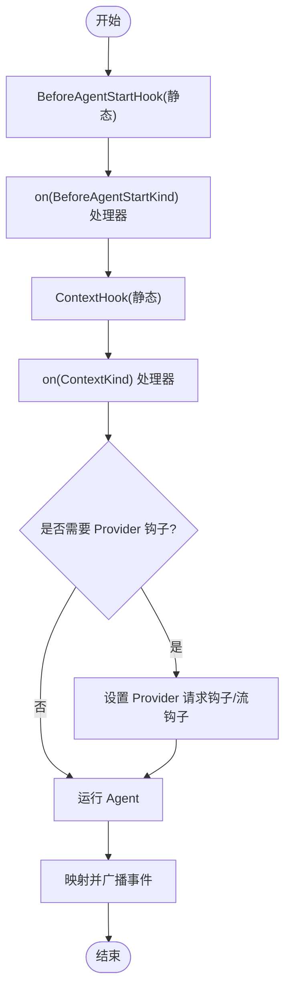
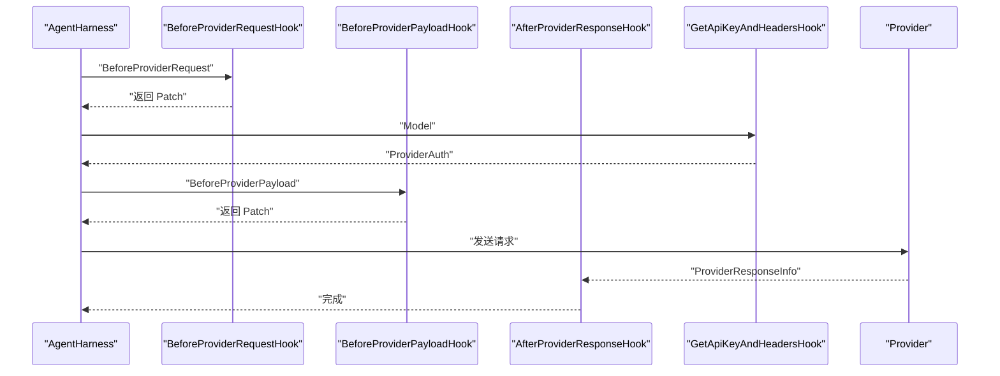
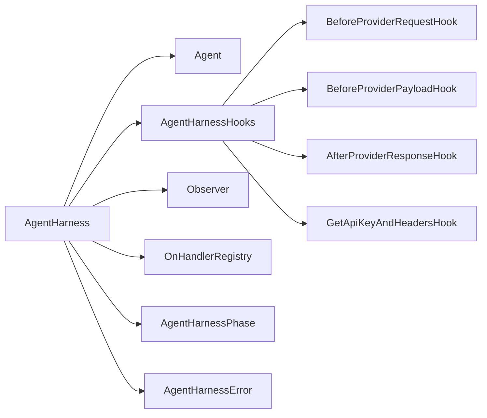

# Harness 钩子系统

<cite>
**本文档引用的文件**
- [harness.rs](file://crates/pi-agent-core/src/harness.rs)
- [hooks.rs](file://crates/pi-agent-core/src/hooks.rs)
- [errors.rs](file://crates/pi-agent-core/src/errors.rs)
- [lib.rs](file://crates/pi-agent-core/src/lib.rs)
- [harness_subscribe.rs](file://crates/pi-agent-core/tests/harness_subscribe.rs)
- [hooks.rs（测试）](file://crates/pi-agent-core/tests/hooks.rs)
- [harness_types.rs](file://crates/pi-agent-core/tests/harness_types.rs)
</cite>

## 目录
1. [简介](#简介)
2. [项目结构](#项目结构)
3. [核心组件](#核心组件)
4. [架构总览](#架构总览)
5. [详细组件分析](#详细组件分析)
6. [依赖关系分析](#依赖关系分析)
7. [性能考量](#性能考量)
8. [故障排查指南](#故障排查指南)
9. [结论](#结论)
10. [附录](#附录)

## 简介
本文件面向 Harness 钩子系统，系统性阐述 AgentHarness 的包装器设计、钩子系统的扩展机制与事件监听架构。重点覆盖：
- AgentHarness 的生命周期管理（AgentHarnessPhase）
- 钩子类型分类（HarnessHookKind）
- 观察者订阅模式（Observer）
- 各类钩子的具体用途与执行顺序：BeforeAgentStartHook、BeforeProviderPayloadHook、ContextHook 等
- 参数传递与返回值处理
- 异步钩子处理、错误传播与性能优化
- 扩展指南、自定义钩子实现与最佳实践
- 完整的代码示例路径（通过“章节来源”定位）

## 项目结构
本系统位于 pi-agent-core crate 中，核心文件如下：
- 主要实现：crates/pi-agent-core/src/harness.rs
- Agent 层钩子：crates/pi-agent-core/src/hooks.rs
- 错误类型：crates/pi-agent-core/src/errors.rs
- 公共导出：crates/pi-agent-core/src/lib.rs
- 测试用例：crates/pi-agent-core/tests 下的相关测试



图表来源
- [harness.rs:1-986](file://crates/pi-agent-core/src/harness.rs#L1-L986)
- [hooks.rs:1-162](file://crates/pi-agent-core/src/hooks.rs#L1-L162)
- [errors.rs:1-231](file://crates/pi-agent-core/src/errors.rs#L1-L231)
- [lib.rs:1-47](file://crates/pi-agent-core/src/lib.rs#L1-L47)

章节来源
- [harness.rs:1-986](file://crates/pi-agent-core/src/harness.rs#L1-L986)
- [hooks.rs:1-162](file://crates/pi-agent-core/src/hooks.rs#L1-L162)
- [errors.rs:1-231](file://crates/pi-agent-core/src/errors.rs#L1-L231)
- [lib.rs:1-47](file://crates/pi-agent-core/src/lib.rs#L1-L47)

## 核心组件
- AgentHarness：封装 Agent 并提供钩子与事件流能力，负责生命周期管理与事件广播。
- AgentHarnessHooks：静态配置的钩子集合，支持 BeforeAgentStartHook、ContextHook、BeforeProviderRequestHook、BeforeProviderPayloadHook、AfterProviderResponseHook、GetApiKeyAndHeadersHook。
- HarnessHookKind：类型级标记接口，用于 on(...) 注册不同类型的钩子处理器。
- Observer：全量事件观察者，通过 subscribe 订阅。
- AgentHarnessEvent：Harness 层事件枚举，映射 AgentEvent 并扩展会话与工具调用等事件。
- AgentHarnessPhase：生命周期状态（Idle/Turn/Compaction/BranchSummary），受 RAII 保护在作用域结束时重置。

章节来源
- [harness.rs:190-202](file://crates/pi-agent-core/src/harness.rs#L190-L202)
- [harness.rs:225-233](file://crates/pi-agent-core/src/harness.rs#L225-L233)
- [harness.rs:25-33](file://crates/pi-agent-core/src/harness.rs#L25-L33)
- [harness.rs:274-283](file://crates/pi-agent-core/src/harness.rs#L274-L283)
- [harness.rs:148-188](file://crates/pi-agent-core/src/harness.rs#L148-L188)

## 架构总览
Harness 钩子系统采用“包装器 + 链式钩子 + 观察者”的三层架构：
- 包装器层：AgentHarness 封装 Agent，注入钩子与事件流。
- 钩子链层：静态钩子（AgentHarnessHooks）与动态钩子（on(...)）按类型组合，形成链式调用。
- 观察者层：Observer 提供全量事件订阅，SubscriptionGuard 提供 RAII 取消订阅。



图表来源
- [harness.rs:520-677](file://crates/pi-agent-core/src/harness.rs#L520-L677)
- [harness.rs:716-825](file://crates/pi-agent-core/src/harness.rs#L716-L825)

## 详细组件分析

### AgentHarness 生命周期管理（AgentHarnessPhase）
- 状态机：Idle → Turn（执行 prompt 期间）→ Idle（完成后自动重置）。
- RAII 保护：内部使用 PhaseResetOnDrop，在作用域结束时将 Phase 回退到 Idle，确保异常情况下也能恢复。
- 并发安全：通过 Arc<Mutex<AgentHarnessPhase>> 管理共享状态。



图表来源
- [harness.rs:196-212](file://crates/pi-agent-core/src/harness.rs#L196-L212)
- [harness.rs:542-572](file://crates/pi-agent-core/src/harness.rs#L542-L572)

章节来源
- [harness.rs:196-212](file://crates/pi-agent-core/src/harness.rs#L196-L212)
- [harness.rs:542-572](file://crates/pi-agent-core/src/harness.rs#L542-L572)
- [harness_types.rs:127-139](file://crates/pi-agent-core/tests/harness_types.rs#L127-L139)

### 钩子类型分类（HarnessHookKind）
HarnessHookKind 是类型级标记接口，用于 on(...) 的类型安全注册。系统内置以下类型：
- ContextKind：输入 HarnessContext，输出 HarnessContext
- BeforeAgentStartKind：输入 HarnessContext，输出 HarnessContext
- BeforeProviderRequestKind：输入 BeforeProviderRequest，输出 BeforeProviderRequestPatch
- BeforeProviderPayloadKind：输入 BeforeProviderPayload，输出 BeforeProviderPayloadPatch
- AfterProviderResponseKind：输入 ProviderResponse，输出 ()
- GetApiKeyAndHeadersKind：输入 Model，输出 ProviderAuth



图表来源
- [harness.rs:274-293](file://crates/pi-agent-core/src/harness.rs#L274-L293)
- [harness.rs:295-393](file://crates/pi-agent-core/src/harness.rs#L295-L393)

章节来源
- [harness.rs:274-293](file://crates/pi-agent-core/src/harness.rs#L274-L293)
- [harness.rs:295-393](file://crates/pi-agent-core/src/harness.rs#L295-L393)

### 观察者订阅模式（Observer）
- Observer：接收 AgentHarnessEvent 的函数对象，通过 subscribe 注册。
- SubscriptionGuard：RAII 守护，drop 时自动取消订阅。
- OnHandlerRegistry：按类型维护 on(...) 注册的处理器列表，支持克隆快照用于分发。

```mermaid
classDiagram
class Observer {
+call(event : &AgentHarnessEvent)
}
class SubscriptionGuard {
-drop_fn : Option<FnOnce()>
+drop()
}
class OnHandlerRegistry {
+next_id : u64
+context : Vec<OnHandlerEntry>
+before_agent_start : Vec<OnHandlerEntry>
+before_provider_request : Vec<OnHandlerEntry>
+before_provider_payload : Vec<OnHandlerEntry>
+after_provider_response : Vec<OnHandlerEntry>
+get_api_key_and_headers : Vec<OnHandlerEntry>
+clone_for_dispatch()
}
class OnHandlerEntry {
+id : u64
+func : Fn(Input) -> HarnessHookFuture<Output>
}
Observer <.. SubscriptionGuard : "drop 移除订阅"
OnHandlerRegistry --> OnHandlerEntry : "维护处理器列表"
```

图表来源
- [harness.rs:235-241](file://crates/pi-agent-core/src/harness.rs#L235-L241)
- [harness.rs:395-415](file://crates/pi-agent-core/src/harness.rs#L395-L415)
- [harness.rs:242-251](file://crates/pi-agent-core/src/harness.rs#L242-L251)
- [harness.rs:259-271](file://crates/pi-agent-core/src/harness.rs#L259-L271)

章节来源
- [harness.rs:235-241](file://crates/pi-agent-core/src/harness.rs#L235-L241)
- [harness.rs:395-415](file://crates/pi-agent-core/src/harness.rs#L395-L415)
- [harness.rs:242-251](file://crates/pi-agent-core/src/harness.rs#L242-L251)
- [harness.rs:259-271](file://crates/pi-agent-core/src/harness.rs#L259-L271)

### 静态钩子与动态钩子链
- 静态钩子（AgentHarnessHooks）：在构造时注入，如 BeforeAgentStartHook、ContextHook、BeforeProviderRequestHook、BeforeProviderPayloadHook、AfterProviderResponseHook、GetApiKeyAndHeadersHook。
- 动态钩子（on(...)）：运行时注册，按类型追加到链路末尾，先执行静态钩子，再依次执行 on(...) 处理器。
- 执行顺序：
  1) BeforeAgentStartHook（静态）→ on(ContextKind) 处理器
  2) ContextHook（静态）→ on(ContextKind) 处理器
  3) 若存在 Provider 钩子，则设置 Provider 请求钩子与流钩子
  4) 运行 Agent，映射事件并广播



图表来源
- [harness.rs:594-642](file://crates/pi-agent-core/src/harness.rs#L594-L642)
- [harness.rs:655-674](file://crates/pi-agent-core/src/harness.rs#L655-L674)

章节来源
- [harness.rs:594-642](file://crates/pi-agent-core/src/harness.rs#L594-L642)
- [harness.rs:655-674](file://crates/pi-agent-core/src/harness.rs#L655-L674)

### Provider 钩子链与流钩子
- BeforeProviderRequestHook：对请求上下文与流选项进行补丁化修改。
- BeforeProviderPayloadHook：对请求负载进行补丁化修改。
- AfterProviderResponseHook：对响应状态与头信息进行后处理。
- GetApiKeyAndHeadersHook：根据模型动态提供认证信息。
- make_provider_request_hook：将静态与动态钩子整合为 Agent 的 before_provider_request 钩子。
- make_stream_hooks：将静态与动态钩子整合为 ProviderStreamHooks 的 on_payload/on_response。



图表来源
- [harness.rs:716-825](file://crates/pi-agent-core/src/harness.rs#L716-L825)
- [harness.rs:827-902](file://crates/pi-agent-core/src/harness.rs#L827-L902)

章节来源
- [harness.rs:716-825](file://crates/pi-agent-core/src/harness.rs#L716-L825)
- [harness.rs:827-902](file://crates/pi-agent-core/src/harness.rs#L827-L902)

### 事件监听与生命周期测试
- subscribe：注册全量事件观察者，返回 SubscriptionGuard。
- on(...)：按类型注册处理器，返回 SubscriptionGuard。
- 生命周期测试验证：phase 在 Turn 期间为 Turn，结束后回到 Idle；abort 清空队列并返回结果。

章节来源
- [harness.rs:440-457](file://crates/pi-agent-core/src/harness.rs#L440-L457)
- [harness.rs:459-482](file://crates/pi-agent-core/src/harness.rs#L459-L482)
- [harness_subscribe.rs:41-70](file://crates/pi-agent-core/tests/harness_subscribe.rs#L41-L70)
- [harness_subscribe.rs:126-165](file://crates/pi-agent-core/tests/harness_subscribe.rs#L126-L165)
- [harness_subscribe.rs:167-209](file://crates/pi-agent-core/tests/harness_subscribe.rs#L167-L209)

### Agent 层钩子（AgentHooks）
- 位置：hooks.rs（Agent 层，非 Harness 层）
- 类型：BeforeProviderRequestHook、BeforeToolCallHook、AfterToolCallHook、ShouldStopAfterTurnHook、PrepareNextTurnHook、TransformContextHook、ConvertToLlmHook
- 用途：在 Agent 内部对请求上下文、工具调用、停止条件、下一轮准备、上下文转换与消息转换进行控制。

章节来源
- [hooks.rs:12-21](file://crates/pi-agent-core/src/hooks.rs#L12-L21)
- [hooks.rs:70-86](file://crates/pi-agent-core/src/hooks.rs#L70-L86)

## 依赖关系分析
- AgentHarness 依赖 Agent、AgentHarnessHooks、Observer、OnHandlerRegistry、AgentHarnessPhase。
- AgentHarnessHooks 与 OnHandlerRegistry 组合形成钩子链。
- Provider 钩子通过 make_provider_request_hook 与 make_stream_hooks 注入到 Agent 的 Provider 请求与流处理中。
- 错误类型 AgentHarnessError 用于统一错误传播。



图表来源
- [harness.rs:225-233](file://crates/pi-agent-core/src/harness.rs#L225-L233)
- [harness.rs:25-33](file://crates/pi-agent-core/src/harness.rs#L25-L33)
- [harness.rs:15-17](file://crates/pi-agent-core/src/harness.rs#L15-L17)
- [errors.rs:183-197](file://crates/pi-agent-core/src/errors.rs#L183-L197)

章节来源
- [harness.rs:225-233](file://crates/pi-agent-core/src/harness.rs#L225-L233)
- [harness.rs:25-33](file://crates/pi-agent-core/src/harness.rs#L25-L33)
- [errors.rs:183-197](file://crates/pi-agent-core/src/errors.rs#L183-L197)

## 性能考量
- 异步钩子：所有钩子均返回 HarnessHookFuture，避免阻塞事件流。
- 钩子链开销：静态钩子与 on(...) 处理器按顺序执行，注意不要引入重型同步操作。
- 事件广播：emit 宏在每次事件时复制观察者列表，建议减少不必要的观察者数量。
- Provider 钩子：仅在需要时才设置钩子，避免无谓的负载与响应处理。
- 并发安全：使用 Arc<Mutex<...>> 保护共享状态，注意锁粒度与持有时间。

## 故障排查指南
- 常见错误码（AgentHarnessError）：Busy、InvalidState、InvalidArgument、Session、Hook、Auth、Compaction、BranchSummary、Unknown。
- 错误传播：钩子返回 Err 时，系统会发出 Error 事件并结束当前轮次。
- 生命周期冲突：若 Phase 非 Idle，prompt 会直接返回 Busy 错误并结束。
- 认证失败：GetApiKeyAndHeadersHook 返回错误时，会在钩子链中被转换为字符串错误并传播。

章节来源
- [errors.rs:154-181](file://crates/pi-agent-core/src/errors.rs#L154-L181)
- [harness.rs:543-568](file://crates/pi-agent-core/src/harness.rs#L543-L568)
- [harness.rs:747-757](file://crates/pi-agent-core/src/harness.rs#L747-L757)

## 结论
Harness 钩子系统通过包装器设计实现了对 Agent 的灵活扩展，结合静态与动态钩子链、观察者模式与生命周期管理，提供了强大的事件驱动能力。其异步钩子与错误传播机制保证了在复杂场景下的稳定性与可观测性。建议在生产环境中遵循最小必要钩子原则，合理拆分钩子职责，并利用观察者进行端到端监控。

## 附录

### 钩子类型与用途速查
- BeforeAgentStartHook：在生成上下文前对 HarnessContext 进行预处理。
- ContextHook：对 HarnessContext 进行最终调整。
- BeforeProviderRequestHook：对请求上下文与流选项进行补丁化修改。
- BeforeProviderPayloadHook：对请求负载进行补丁化修改。
- AfterProviderResponseHook：对响应状态与头信息进行后处理。
- GetApiKeyAndHeadersHook：根据模型动态提供认证信息。
- Agent 层钩子（AgentHooks）：在 Agent 内部对请求上下文、工具调用、停止条件、下一轮准备、上下文转换与消息转换进行控制。

章节来源
- [harness.rs:60-73](file://crates/pi-agent-core/src/harness.rs#L60-L73)
- [hooks.rs:70-86](file://crates/pi-agent-core/src/hooks.rs#L70-L86)

### 执行顺序与参数传递
- 执行顺序：静态钩子 → on(...) 处理器（同类型内按注册顺序）
- 参数传递：每个钩子接收对应类型的输入，返回 Option<补丁/新值>，None 表示不变更
- 返回值处理：补丁通过 apply_stream_options_patch 等函数合并生效

章节来源
- [harness.rs:594-642](file://crates/pi-agent-core/src/harness.rs#L594-L642)
- [harness.rs:716-825](file://crates/pi-agent-core/src/harness.rs#L716-L825)
- [harness.rs:904-929](file://crates/pi-agent-core/src/harness.rs#L904-L929)

### 异步钩子处理与错误传播
- 异步：所有钩子返回 HarnessHookFuture，使用 await 执行
- 错误传播：钩子返回 Err 时，系统发出 Error 事件并结束当前轮次
- 认证错误：GetApiKeyAndHeadersHook 的错误会被转换为字符串错误并传播

章节来源
- [harness.rs:595-603](file://crates/pi-agent-core/src/harness.rs#L595-L603)
- [harness.rs:747-757](file://crates/pi-agent-core/src/harness.rs#L747-L757)

### 扩展指南与最佳实践
- 自定义钩子实现
  - 使用 HarnessHookKind 对应的类型注册：on::<ContextKind>(handler)、on::<BeforeAgentStartKind>(handler) 等
  - handler 接收 Input，返回 HarnessHookFuture<Output>，返回 Ok(None) 表示不变更
- 钩子链组织
  - 将通用逻辑放入静态钩子，将特定场景逻辑放入 on(...) 处理器
  - 保持钩子职责单一，避免在钩子中做重型 I/O
- 观察者使用
  - 使用 subscribe 订阅全量事件，使用 SubscriptionGuard 自动清理
  - 避免在观察者中进行阻塞操作
- 错误处理
  - 在钩子中捕获并转换错误，避免抛出未处理异常
  - 使用 AgentHarnessError.code 选择合适的错误码

章节来源
- [harness.rs:459-482](file://crates/pi-agent-core/src/harness.rs#L459-L482)
- [harness.rs:440-457](file://crates/pi-agent-core/src/harness.rs#L440-L457)
- [errors.rs:154-181](file://crates/pi-agent-core/src/errors.rs#L154-L181)

### 代码示例（路径）
- 注册观察者并订阅事件
  - [harness_subscribe.rs:41-70](file://crates/pi-agent-core/tests/harness_subscribe.rs#L41-L70)
- 注册 on(...) 处理器并验证链式执行
  - [harness_subscribe.rs:92-124](file://crates/pi-agent-core/tests/harness_subscribe.rs#L92-L124)
- 生命周期与 Phase 管理
  - [harness_subscribe.rs:126-165](file://crates/pi-agent-core/tests/harness_subscribe.rs#L126-L165)
- Agent 层钩子示例（工具调用前后钩子）
  - [hooks.rs（测试）:59-110](file://crates/pi-agent-core/tests/hooks.rs#L59-L110)
- Agent 层钩子示例（转换消息与上下文）
  - [hooks.rs（测试）:230-308](file://crates/pi-agent-core/tests/hooks.rs#L230-L308)
  - [hooks.rs（测试）:310-388](file://crates/pi-agent-core/tests/hooks.rs#L310-L388)