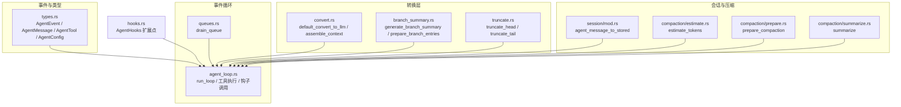
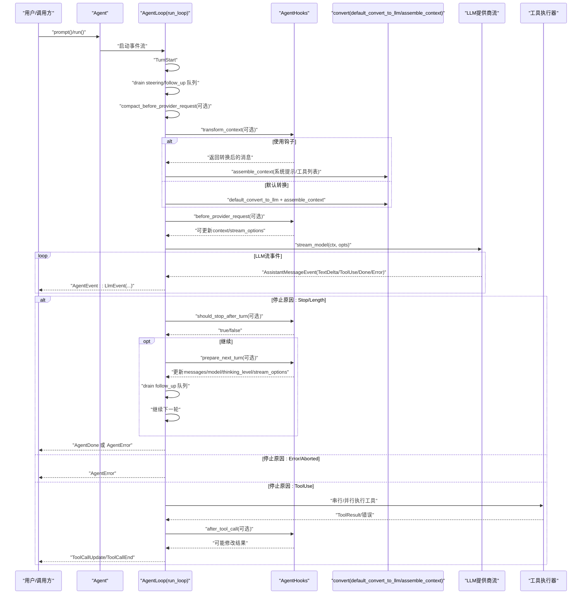
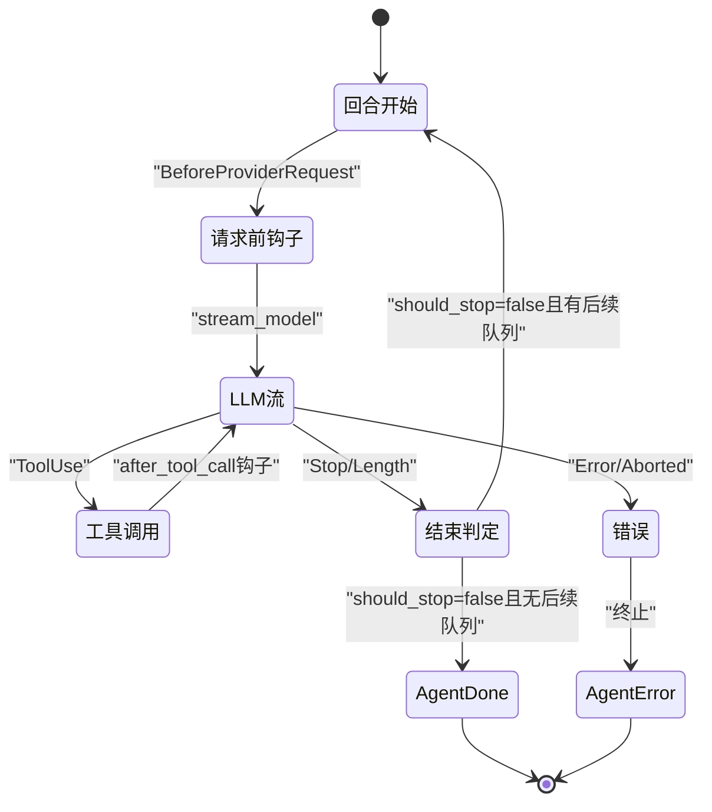
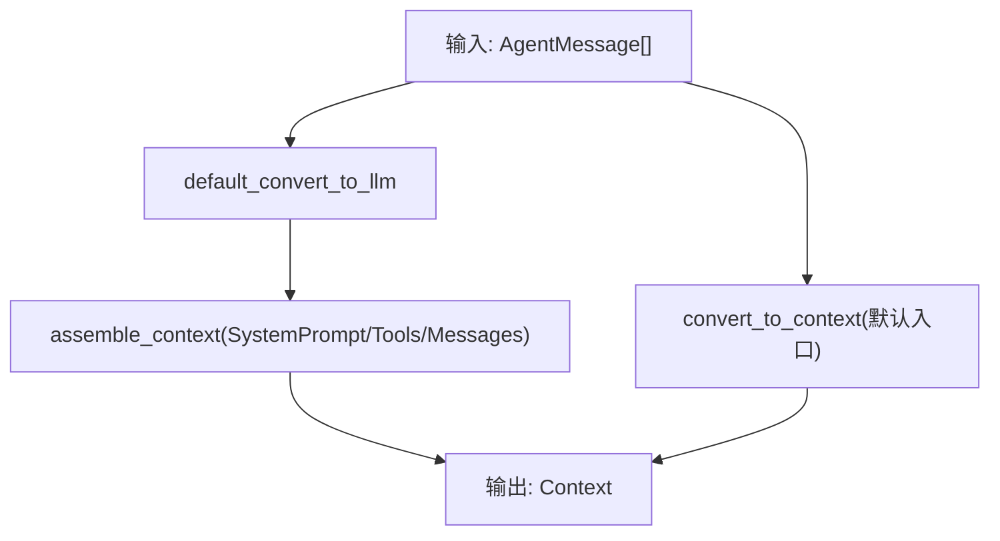
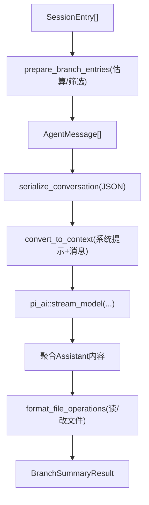
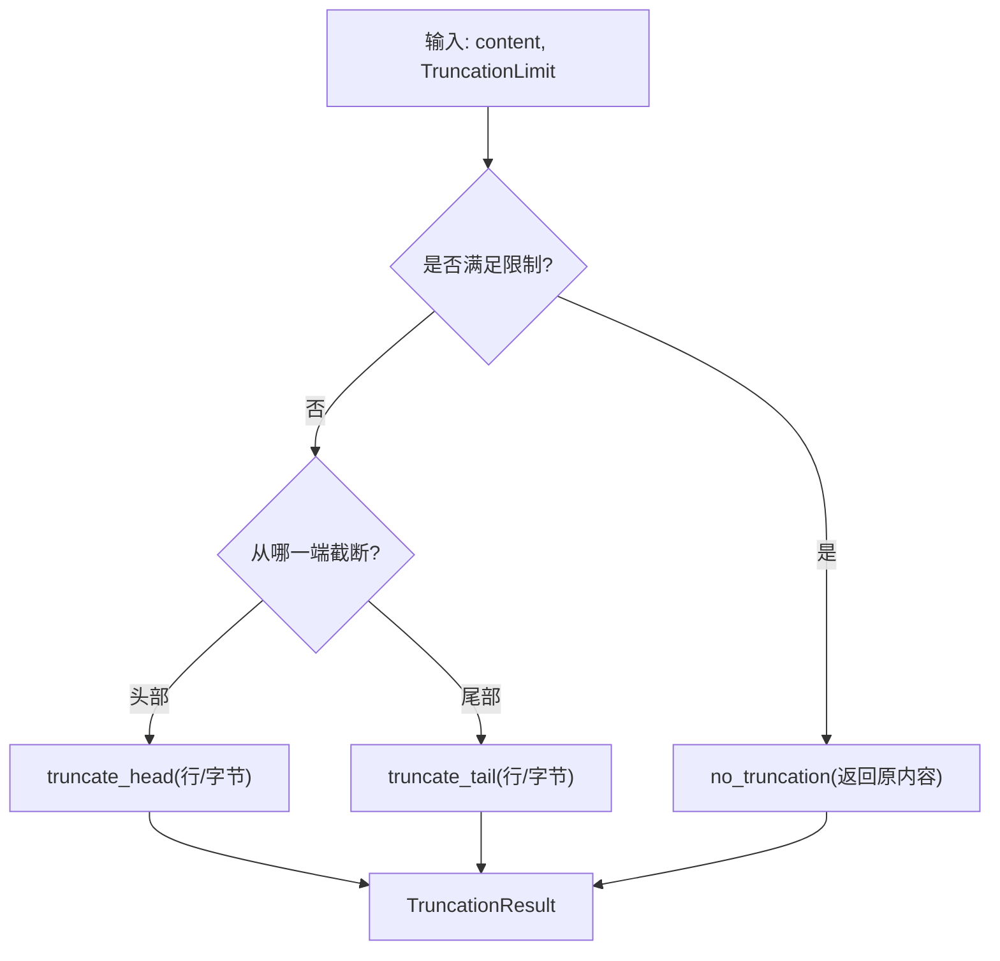
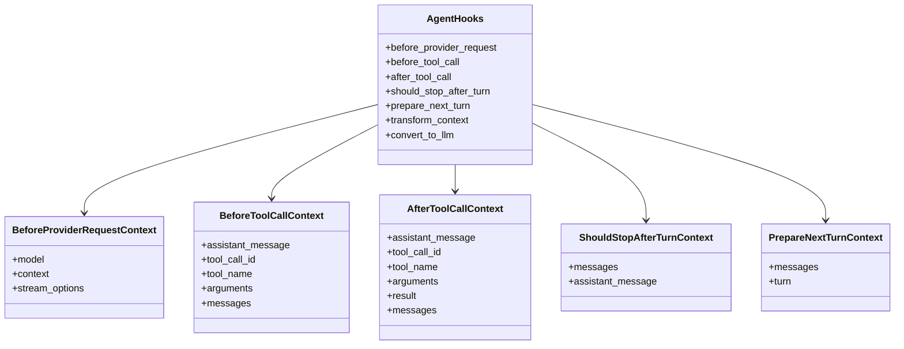
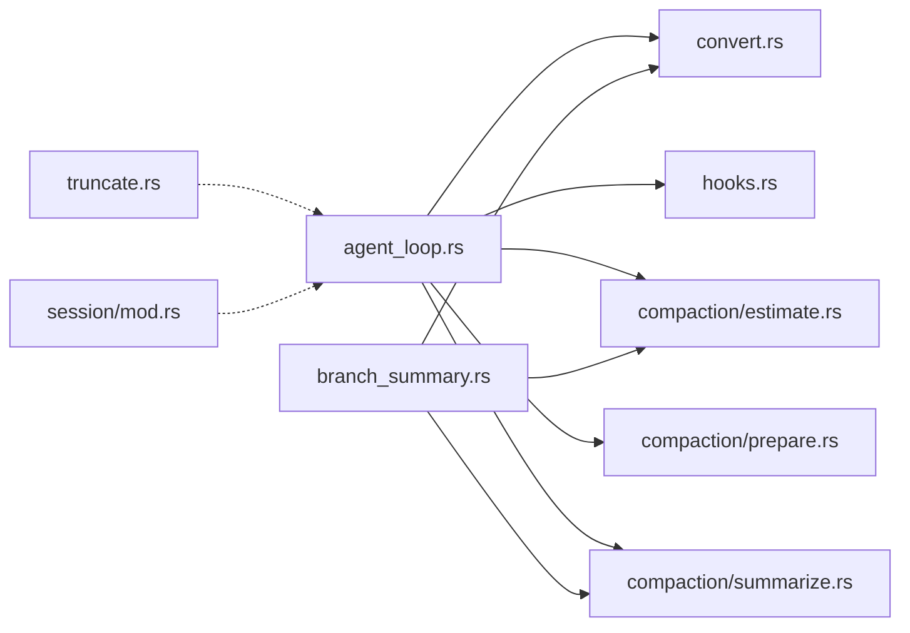

# 事件流处理

<cite>
**本文引用的文件**
- [lib.rs](file://crates/pi-agent-core/src/lib.rs)
- [types.rs](file://crates/pi-agent-core/src/types.rs)
- [agent_loop.rs](file://crates/pi-agent-core/src/agent_loop.rs)
- [hooks.rs](file://crates/pi-agent-core/src/hooks.rs)
- [convert.rs](file://crates/pi-agent-core/src/convert.rs)
- [branch_summary.rs](file://crates/pi-agent-core/src/branch_summary.rs)
- [truncate.rs](file://crates/pi-agent-core/src/truncate.rs)
- [queues.rs](file://crates/pi-agent-core/src/queues.rs)
- [session/mod.rs](file://crates/pi-agent-core/src/session/mod.rs)
- [compaction/estimate.rs](file://crates/pi-agent-core/src/compaction/estimate.rs)
- [compaction/prepare.rs](file://crates/pi-agent-core/src/compaction/prepare.rs)
- [compaction/summarize.rs](file://crates/pi-agent-core/src/compaction/summarize.rs)
- [agent_loop 测试](file://crates/pi-agent-core/tests/agent_loop.rs)
</cite>

## 目录
1. [简介](#简介)
2. [项目结构](#项目结构)
3. [核心组件](#核心组件)
4. [架构总览](#架构总览)
5. [详细组件分析](#详细组件分析)
6. [依赖关系分析](#依赖关系分析)
7. [性能考量](#性能考量)
8. [故障排查指南](#故障排查指南)
9. [结论](#结论)
10. [附录：使用示例与调试技巧](#附录使用示例与调试技巧)

## 简介
本文件面向事件流处理系统，聚焦于 AgentEvent 的事件模型设计、事件转换机制与流式数据处理架构。文档深入解释事件生命周期、事件类型分类、事件处理器实现模式，并覆盖 branch_summary 的分支摘要生成、truncate 的文本截断算法、convert 的格式转换功能。同时提供背压处理、错误恢复与性能优化策略，阐述事件流的消费模式、生产者-消费者架构与异步处理机制，以及事件序列化、反序列化与版本兼容性处理方式。

## 项目结构
pi-agent-core 提供了事件驱动的智能体循环（Agent Loop），围绕 AgentEvent 事件流组织消息、工具调用、上下文转换与会话持久化。关键模块如下：
- 事件与类型：AgentEvent、AgentMessage、AgentTool、AgentConfig 等定义在 types.rs 中
- 事件循环：agent_loop.rs 实现主循环、钩子扩展点与事件产出
- 钩子系统：hooks.rs 定义请求前、工具调用前后、上下文转换等扩展点
- 上下文转换：convert.rs 将 AgentMessage 转换为 LLM 可消费的 Context
- 分支摘要：branch_summary.rs 生成分支摘要并注入会话
- 文本截断：truncate.rs 提供行数/字节限制的截断策略
- 队列控制：queues.rs 控制“全部入队/逐个出队”的队列行为
- 会话存储：session/mod.rs 提供消息到持久化结构的映射
- 压缩与估算：compaction/* 模块负责 token 估算、压缩准备与摘要生成

图示来源
- [types.rs:454-496](file://crates/pi-agent-core/src/types.rs#L454-L496)
- [agent_loop.rs:153-800](file://crates/pi-agent-core/src/agent_loop.rs#L153-L800)
- [convert.rs:9-155](file://crates/pi-agent-core/src/convert.rs#L9-L155)
- [branch_summary.rs:168-274](file://crates/pi-agent-core/src/branch_summary.rs#L168-L274)
- [truncate.rs:45-157](file://crates/pi-agent-core/src/truncate.rs#L45-L157)
- [queues.rs:4-9](file://crates/pi-agent-core/src/queues.rs#L4-L9)
- [session/mod.rs:21-125](file://crates/pi-agent-core/src/session/mod.rs#L21-L125)
- [compaction/estimate.rs:4-54](file://crates/pi-agent-core/src/compaction/estimate.rs#L4-L54)
- [compaction/prepare.rs:8-48](file://crates/pi-agent-core/src/compaction/prepare.rs#L8-L48)
- [compaction/summarize.rs:6-110](file://crates/pi-agent-core/src/compaction/summarize.rs#L6-L110)
- [hooks.rs:12-21](file://crates/pi-agent-core/src/hooks.rs#L12-L21)

章节来源
- [lib.rs:1-47](file://crates/pi-agent-core/src/lib.rs#L1-L47)
- [types.rs:454-496](file://crates/pi-agent-core/src/types.rs#L454-L496)

## 核心组件
- AgentEvent：事件流的核心枚举，涵盖回合开始、请求前、LLM 事件、工具调用开始/更新/结束、完成/错误、会话压缩等阶段事件
- AgentMessage：会话中可被转换为 LLM 上下文的消息载体，支持用户文本、助手消息、工具结果、系统提示、压缩摘要、Bash 执行、自定义消息、分支摘要等
- AgentTool：工具抽象，包含名称、描述、参数、执行函数与执行模式；支持同步/异步执行与更新回调
- AgentConfig：配置项，包含模型、系统提示、最大回合、流选项、思考级别、工具执行模式、队列模式、钩子、资源与压缩设置
- AgentStream：事件流类型别名，基于异步 Stream<Item=AgentEvent>
- AgentHooks：钩子集合，允许在请求前、工具调用前后、上下文转换、回合推进、停止判断等节点注入逻辑

章节来源
- [types.rs:454-496](file://crates/pi-agent-core/src/types.rs#L454-L496)
- [types.rs:300-353](file://crates/pi-agent-core/src/types.rs#L300-L353)
- [types.rs:355-405](file://crates/pi-agent-core/src/types.rs#L355-L405)
- [types.rs:407-443](file://crates/pi-agent-core/src/types.rs#L407-L443)
- [types.rs:493-495](file://crates/pi-agent-core/src/types.rs#L493-L495)
- [hooks.rs:12-21](file://crates/pi-agent-core/src/hooks.rs#L12-L21)

## 架构总览
事件流以 AgentLoop 为中心，按回合推进：每回合从队列中收集消息，进行上下文转换与请求前钩子，随后通过 LLM 提供商的流接口消费事件，遇到工具调用时进入工具执行阶段（串行或并行），并在工具执行前后分别触发钩子。循环根据停止条件与后续队列决定是否继续或结束。

图示来源
- [agent_loop.rs:153-800](file://crates/pi-agent-core/src/agent_loop.rs#L153-L800)
- [convert.rs:9-155](file://crates/pi-agent-core/src/convert.rs#L9-L155)
- [hooks.rs:70-86](file://crates/pi-agent-core/src/hooks.rs#L70-L86)

## 详细组件分析

### AgentEvent 事件模型与生命周期
- 事件类型
  - 回合控制：TurnStart
  - 请求阶段：BeforeProviderRequest
  - LLM 事件：LlmEvent(封装来自提供商的事件)
  - 工具调用：ToolCallStart/ToolCallUpdate/ToolCallEnd
  - 结束与错误：AgentDone、AgentError
  - 会话压缩：SessionCompacted
- 生命周期
  - 每回合开始产生 TurnStart
  - 构建上下文前可插入 transform_context 与 before_provider_request 钩子
  - 流式消费 LLM 事件，期间可产生 ToolCallStart/Update/End
  - 根据 stop_reason 决定是否继续或结束
  - 工具执行后写入 ToolResult 并参与后续回合

图示来源
- [agent_loop.rs:182-448](file://crates/pi-agent-core/src/agent_loop.rs#L182-L448)
- [types.rs:456-491](file://crates/pi-agent-core/src/types.rs#L456-L491)

章节来源
- [types.rs:454-496](file://crates/pi-agent-core/src/types.rs#L454-L496)

### 事件转换机制与上下文组装
- default_convert_to_llm：将 AgentMessage 映射为 LLM Message 列表，过滤/转换系统提示、工具结果、Bash 执行、自定义消息与分支摘要
- assemble_context：合并系统提示（优先配置，其次消息中的系统提示）、工具列表与消息列表，形成最终 Context
- convert_to_context：默认转换入口，组合上述两步
- bash_execution_to_text：将 Bash 执行结果转为人类可读文本，支持取消、退出码、截断与完整输出路径提示

图示来源
- [convert.rs:9-155](file://crates/pi-agent-core/src/convert.rs#L9-L155)

章节来源
- [convert.rs:9-184](file://crates/pi-agent-core/src/convert.rs#L9-L184)

### 分支摘要生成（branch_summary）
- 收集分支条目：从会话条目中定位旧叶到目标叶的路径，计算共同祖先并提取被放弃的分支条目
- 准备条目：估算 token，按预算逆序选取消息，保留压缩/分支摘要等关键消息
- 生成摘要：构建对话上下文，调用 LLM 生成结构化摘要，附加读取/修改文件清单
- 注入会话：将摘要作为 BranchSummary 消息写回会话

图示来源
- [branch_summary.rs:168-274](file://crates/pi-agent-core/src/branch_summary.rs#L168-L274)
- [branch_summary.rs:127-166](file://crates/pi-agent-core/src/branch_summary.rs#L127-L166)
- [branch_summary.rs:434-442](file://crates/pi-agent-core/src/branch_summary.rs#L434-L442)

章节来源
- [branch_summary.rs:79-125](file://crates/pi-agent-core/src/branch_summary.rs#L79-L125)
- [branch_summary.rs:168-274](file://crates/pi-agent-core/src/branch_summary.rs#L168-L274)

### 文本截断算法（truncate）
- 截断策略
  - truncate_head：从头部截断，优先按行数，再按字节数；首行超限直接判定为字节截断
  - truncate_tail：从尾部截断，优先按行数，再按字节数；末行可能部分截断
  - truncate_line：单行字符数超限时截断并追加省略标记
- 结果结构 TruncationResult：包含原始/输出统计、截断标志与原因、首行超限标志等

图示来源
- [truncate.rs:45-157](file://crates/pi-agent-core/src/truncate.rs#L45-L157)
- [truncate.rs:168-187](file://crates/pi-agent-core/src/truncate.rs#L168-L187)

章节来源
- [truncate.rs:5-33](file://crates/pi-agent-core/src/truncate.rs#L5-L33)

### 事件处理器实现模式（钩子）
- AgentHooks：提供 before_provider_request、before_tool_call、after_tool_call、should_stop_after_turn、prepare_next_turn、transform_context、convert_to_llm 等扩展点
- 钩子类型：统一为异步 Future 包装的闭包，支持可选返回值与错误传播
- 典型用法
  - before_provider_request：可替换 context 或 stream_options
  - before_tool_call：可阻断工具调用并给出原因
  - after_tool_call：可修改工具结果（内容/错误/终止标志）
  - transform_context：在上下文转换前对消息进行预处理
  - convert_to_llm：完全接管消息到 LLM 消息的转换
  - should_stop_after_turn / prepare_next_turn：控制循环终止与下一轮准备

图示来源
- [hooks.rs:12-21](file://crates/pi-agent-core/src/hooks.rs#L12-L21)
- [hooks.rs:88-161](file://crates/pi-agent-core/src/hooks.rs#L88-L161)

章节来源
- [hooks.rs:12-21](file://crates/pi-agent-core/src/hooks.rs#L12-L21)

### 会话存储与序列化
- agent_message_to_stored：将 AgentMessage 映射为持久化结构 StoredAgentMessage，排除系统提示与压缩摘要
- 支持类型：User、Assistant、ToolResult、BashExecution、Custom、BranchSummary
- 用于 JSONL/内存存储等场景

章节来源
- [session/mod.rs:21-125](file://crates/pi-agent-core/src/session/mod.rs#L21-L125)

### 压缩与令牌估算
- estimate_tokens：按消息类型估算 token，优先使用助手消息的 usage.total_tokens，否则按内容块估算
- prepare_compaction：在超过保留令牌阈值时，选择需要压缩的历史消息与需保留的最近消息，避免孤立工具结果
- summarize：对待压缩消息进行摘要生成，作为 CompactionSummary 写回会话

章节来源
- [compaction/estimate.rs:4-54](file://crates/pi-agent-core/src/compaction/estimate.rs#L4-L54)
- [compaction/prepare.rs:8-48](file://crates/pi-agent-core/src/compaction/prepare.rs#L8-L48)
- [compaction/summarize.rs:6-110](file://crates/pi-agent-core/src/compaction/summarize.rs#L6-L110)

## 依赖关系分析
- 模块耦合
  - agent_loop.rs 依赖 convert.rs 进行消息到上下文转换，依赖 hooks.rs 执行扩展点，依赖 compaction/* 进行历史压缩
  - branch_summary.rs 依赖 convert.rs 与 compaction/* 的估算与摘要能力
  - truncate.rs 与 session/mod.rs 独立但可被上层流程复用
- 外部依赖
  - pi_ai::stream_model 提供 LLM 流式接口，AgentLoop 通过该接口消费 AssistantMessageEvent
- 循环依赖
  - 未发现直接循环依赖；各模块职责清晰，通过类型与函数边界交互

图示来源
- [agent_loop.rs:1-30](file://crates/pi-agent-core/src/agent_loop.rs#L1-L30)
- [convert.rs:1-10](file://crates/pi-agent-core/src/convert.rs#L1-L10)
- [branch_summary.rs:1-8](file://crates/pi-agent-core/src/branch_summary.rs#L1-L8)
- [truncate.rs:1-3](file://crates/pi-agent-core/src/truncate.rs#L1-L3)
- [session/mod.rs:1-10](file://crates/pi-agent-core/src/session/mod.rs#L1-L10)

章节来源
- [lib.rs:1-47](file://crates/pi-agent-core/src/lib.rs#L1-L47)

## 性能考量
- 令牌估算与压缩
  - 使用 estimate_tokens 与 prepare_compaction 在接近上下文窗口上限时进行压缩，减少后续 LLM 调用成本
  - keep_recent_tokens 确保关键上下文不被过度压缩
- 工具执行模式
  - ToolExecutionMode::Sequential 保证顺序一致性，适合有副作用或互斥资源的工具
  - ToolExecutionMode::Parallel 并发执行多个工具，提升吞吐
- 队列模式
  - QueueMode::All 一次性清空队列，QueueMode::OneAtATime 逐个处理，影响响应延迟与并发度
- 流式处理
  - LLM 事件按流式到达，事件边到边处理，降低整体延迟
- 资源与系统提示
  - convert_to_context 将技能注入系统提示，有助于减少重复信息，提高上下文利用效率

[本节为通用性能建议，无需特定文件引用]

## 故障排查指南
- AgentError 事件
  - 来源于 LLM 流结束但未收到 Done、提供商错误、中止信号、工具未知或执行失败等情况
  - 建议检查钩子返回值、工具参数与执行函数、队列状态与令牌预算
- 最大回合限制
  - 当达到 max_turns 时，循环发出 AgentError 并终止；确认配置或钩子逻辑
- 会话状态校验
  - run() 要求最后一条消息为 UserText；若为 Assistant 将报错
- 工具调用阻断
  - before_tool_call 返回 block=true 时，工具不会执行，直接以错误结果写入 ToolResult
- 流中断与取消
  - cancel 令牌触发时，AgentLoop 发出 AgentError("aborted")

章节来源
- [agent_loop.rs:162-180](file://crates/pi-agent-core/src/agent_loop.rs#L162-L180)
- [agent_loop.rs:380-389](file://crates/pi-agent-core/src/agent_loop.rs#L380-L389)
- [agent_loop.rs:435-448](file://crates/pi-agent-core/src/agent_loop.rs#L435-L448)
- [agent_loop 测试:230-273](file://crates/pi-agent-core/tests/agent_loop.rs#L230-L273)
- [agent_loop 测试:386-416](file://crates/pi-agent-core/tests/agent_loop.rs#L386-L416)

## 结论
本事件流处理系统以 AgentEvent 为核心，结合 hooks 的可插拔扩展、convert 的上下文转换、branch_summary 的分支摘要与 truncate 的文本截断，构建了高内聚、低耦合的智能体循环。通过队列模式与工具执行模式的灵活配置，系统在延迟与吞吐之间取得平衡；借助压缩与令牌估算，有效控制上下文规模。测试覆盖了典型场景，包括工具调用、更新事件、错误与中止等，为生产环境提供了可靠的参考实现。

[本节为总结性内容，无需特定文件引用]

## 附录：使用示例与调试技巧
- 使用示例
  - 单轮文本响应：注册测试提供商，构造 AgentConfig，调用 agent.prompt 并收集 AgentEvent，断言存在 AgentDone
  - 工具调用：添加 AgentTool，触发 ToolUse，断言 ToolCallStart/Update/End 与 ToolResult
  - 更新事件先于结束：验证 ToolCallUpdate 在 ToolCallEnd 之前出现
  - 未知工具：触发不存在的工具名，应产生错误内容的 ToolResult 并继续
  - 最大回合：配置 max_turns，超过后应产生 AgentError("max turns")
  - 无限回合：max_turns=None 时，循环持续直到自然停止
  - 中止：调用 agent.abort()，事件流应返回 AgentError("aborted")
  - 提供商错误：模拟 Provider Error 事件，确保错误消息透传
  - run() 校验：最后消息必须为 UserText，否则报错
- 调试技巧
  - 使用钩子：在 before_provider_request 中打印 context 与 stream_options，确认上下文正确
  - 工具更新：在工具执行函数中通过 on_update 回调发送中间结果，观察 ToolCallUpdate
  - 日志与断点：在 AgentLoop 关键节点（TurnStart、BeforeProviderRequest、ToolCall*）设置断点
  - 压缩验证：开启压缩配置，观察 SessionCompacted 事件与后续消息长度变化
  - 截断验证：对长输出使用 truncate_head/tail，核对 TruncationResult 字段

章节来源
- [agent_loop 测试:46-76](file://crates/pi-agent-core/tests/agent_loop.rs#L46-L76)
- [agent_loop 测试:78-130](file://crates/pi-agent-core/tests/agent_loop.rs#L78-L130)
- [agent_loop 测试:132-191](file://crates/pi-agent-core/tests/agent_loop.rs#L132-L191)
- [agent_loop 测试:193-228](file://crates/pi-agent-core/tests/agent_loop.rs#L193-L228)
- [agent_loop 测试:230-273](file://crates/pi-agent-core/tests/agent_loop.rs#L230-L273)
- [agent_loop 测试:275-332](file://crates/pi-agent-core/tests/agent_loop.rs#L275-L332)
- [agent_loop 测试:334-352](file://crates/pi-agent-core/tests/agent_loop.rs#L334-L352)
- [agent_loop 测试:354-384](file://crates/pi-agent-core/tests/agent_loop.rs#L354-L384)
- [agent_loop 测试:386-432](file://crates/pi-agent-core/tests/agent_loop.rs#L386-L432)