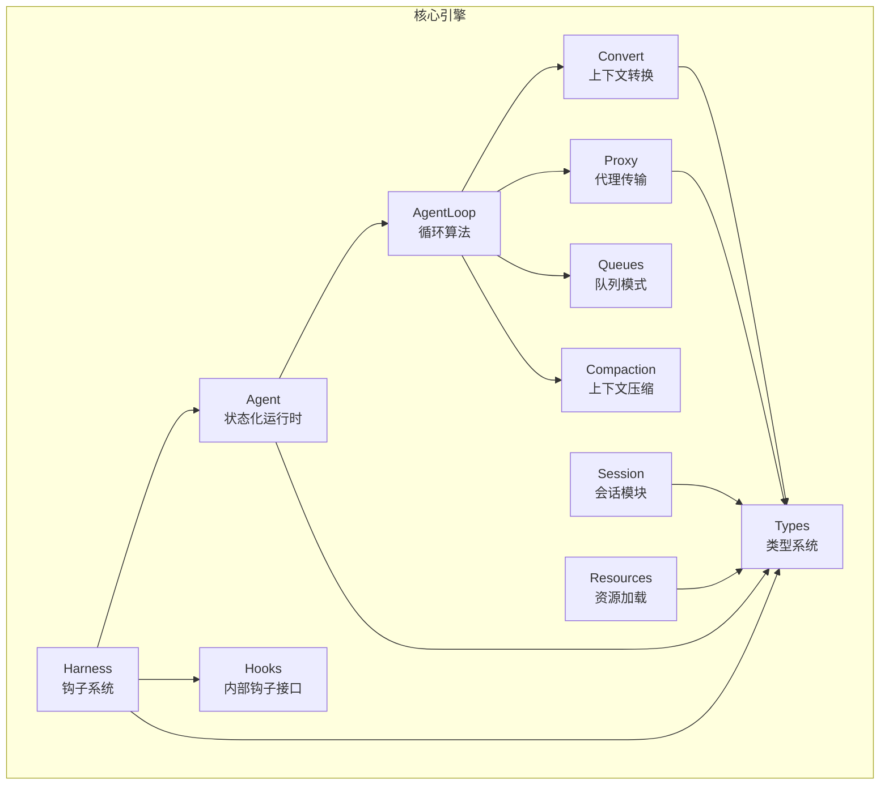
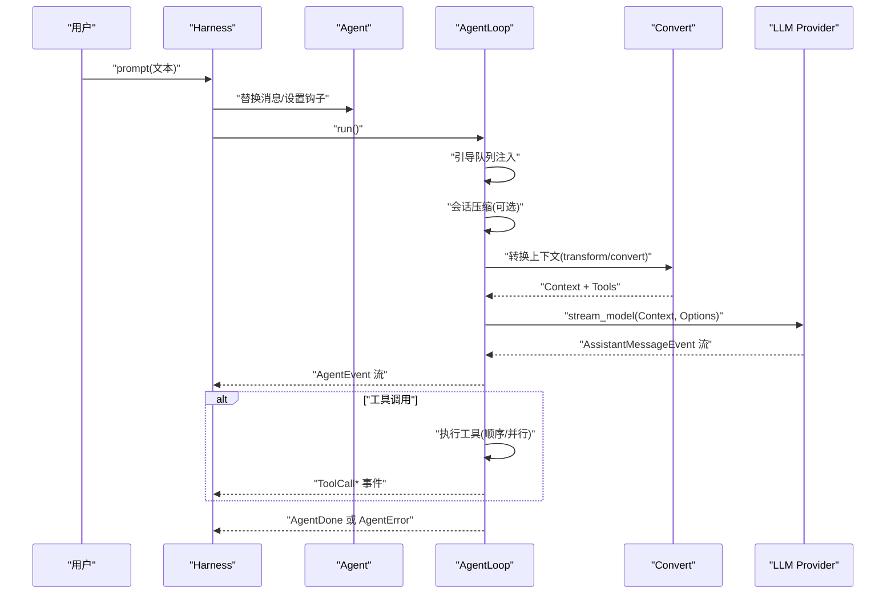
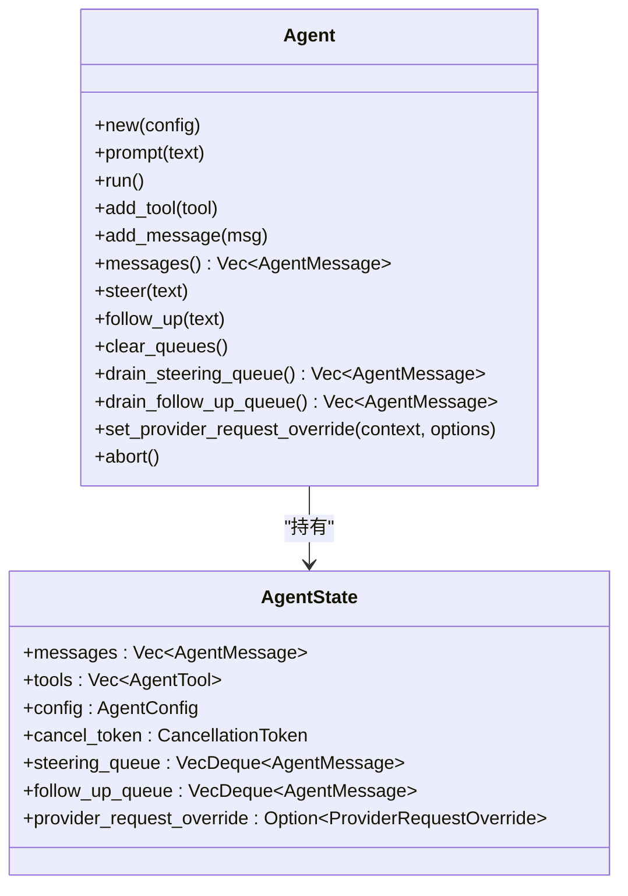
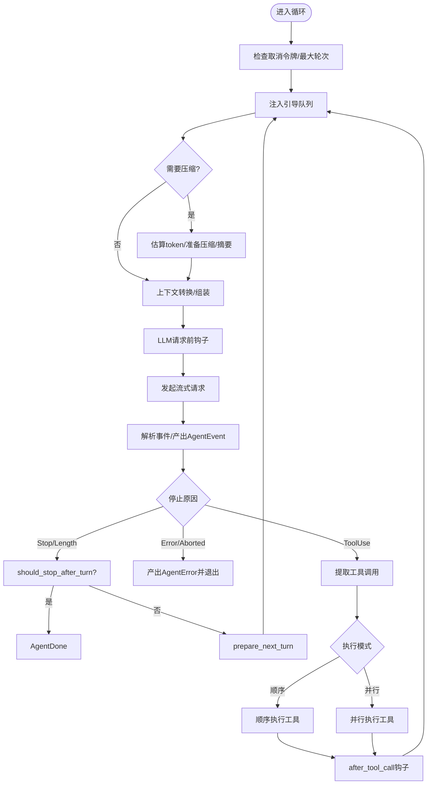
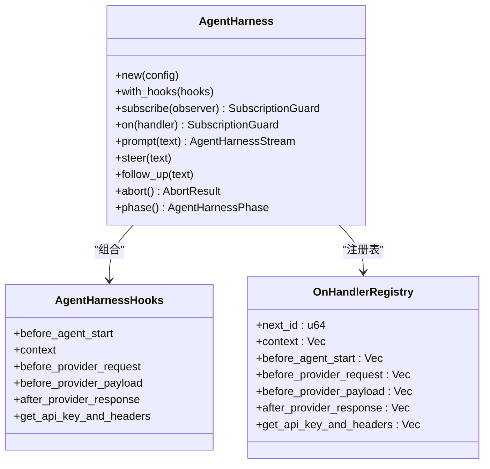
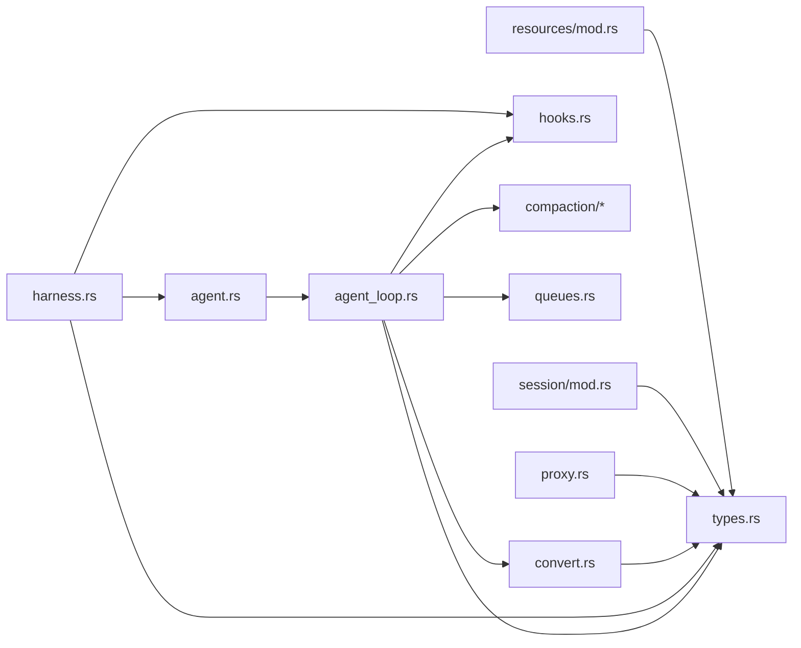

# 代理核心架构

<cite>
**本文档引用的文件**
- [lib.rs](file://crates/pi-agent-core/src/lib.rs)
- [agent.rs](file://crates/pi-agent-core/src/agent.rs)
- [agent_loop.rs](file://crates/pi-agent-core/src/agent_loop.rs)
- [harness.rs](file://crates/pi-agent-core/src/harness.rs)
- [hooks.rs](file://crates/pi-agent-core/src/hooks.rs)
- [types.rs](file://crates/pi-agent-core/src/types.rs)
- [convert.rs](file://crates/pi-agent-core/src/convert.rs)
- [proxy.rs](file://crates/pi-agent-core/src/proxy.rs)
- [queues.rs](file://crates/pi-agent-core/src/queues.rs)
- [session/mod.rs](file://crates/pi-agent-core/src/session/mod.rs)
- [resources/mod.rs](file://crates/pi-agent-core/src/resources/mod.rs)
- [compaction/mod.rs](file://crates/pi-agent-core/src/compaction/mod.rs)
- [Cargo.toml](file://crates/pi-agent-core/Cargo.toml)
- [loop_example.rs](file://crates/pi-agent-core/examples/loop_example.rs)
- [agent_loop.rs 测试](file://crates/pi-agent-core/tests/agent_loop.rs)
- [harness 类型测试](file://crates/pi-agent-core/tests/harness_types.rs)
</cite>

## 目录
1. [简介](#简介)
2. [项目结构](#项目结构)
3. [核心组件](#核心组件)
4. [架构总览](#架构总览)
5. [详细组件分析](#详细组件分析)
6. [依赖关系分析](#依赖关系分析)
7. [性能考量](#性能考量)
8. [故障排查指南](#故障排查指南)
9. [结论](#结论)
10. [附录](#附录)

## 简介
本文件面向 pi-agent-core 核心引擎，系统性阐述其设计理念与实现模式，重点覆盖以下方面：
- Agent 状态化运行时：以共享状态与原子标志确保并发安全与可中断性
- AgentLoop 循环算法：事件驱动的多轮对话与工具调用流水线
- Harness 钩子系统：在关键节点注入外部逻辑（认证、请求补丁、上下文转换）
- 事件驱动与异步处理：基于流式事件与 Future 的非阻塞执行模型
- 工具调用机制：顺序与并行两种执行模式，支持增量更新回调
- 组件交互、数据流与生命周期管理：从用户输入到最终响应的完整链路
- 关键设计决策、性能优化策略与扩展点：如会话压缩、思维令牌预算、代理传输层
- 并发处理、错误恢复与资源管理：取消令牌、队列模式、错误类型与诊断

## 项目结构
pi-agent-core 采用按功能域划分的模块化组织方式，核心模块如下：
- agent：Agent 运行时与消息队列管理
- agent_loop：循环算法与事件编排
- harness：对外钩子与事件桥接
- hooks：Agent 内部钩子接口定义
- types：类型系统与配置项
- convert：消息到 LLM 上下文的转换
- proxy：代理传输层（SSE/JSON 流解析）
- queues：队列模式与出队策略
- session/resources/compaction：会话持久化、资源加载与上下文压缩
- examples/tests：示例与测试用例

**图表来源**
- [lib.rs:1-47](file://crates/pi-agent-core/src/lib.rs#L1-L47)
- [agent.rs:1-282](file://crates/pi-agent-core/src/agent.rs#L1-L282)
- [agent_loop.rs:1-860](file://crates/pi-agent-core/src/agent_loop.rs#L1-L860)
- [harness.rs:1-986](file://crates/pi-agent-core/src/harness.rs#L1-L986)
- [hooks.rs:1-162](file://crates/pi-agent-core/src/hooks.rs#L1-L162)
- [types.rs:1-657](file://crates/pi-agent-core/src/types.rs#L1-L657)
- [convert.rs:1-315](file://crates/pi-agent-core/src/convert.rs#L1-L315)
- [proxy.rs:1-431](file://crates/pi-agent-core/src/proxy.rs#L1-L431)
- [queues.rs:1-10](file://crates/pi-agent-core/src/queues.rs#L1-L10)
- [session/mod.rs:1-126](file://crates/pi-agent-core/src/session/mod.rs#L1-L126)
- [resources/mod.rs:1-12](file://crates/pi-agent-core/src/resources/mod.rs#L1-L12)
- [compaction/mod.rs:1-6](file://crates/pi-agent-core/src/compaction/mod.rs#L1-L6)

**章节来源**
- [lib.rs:1-47](file://crates/pi-agent-core/src/lib.rs#L1-L47)

## 核心组件
- Agent：封装 AgentState（消息、工具、配置、取消令牌、引导队列）与运行控制，提供 prompt/run 接口与并发保护
- AgentLoop：主循环，负责上下文构建、钩子调用、LLM 请求、工具调用、会话压缩与事件产出
- Harness：对外钩子入口，桥接 Agent 事件与外部观察者，支持订阅与 on(...) 注册
- Hooks：Agent 内部钩子（请求前、工具前后、停止判断、下一轮准备、上下文转换）
- Types：统一的数据类型、枚举（思考级别、执行模式、队列模式）、事件与工具结果
- Convert：将 AgentMessage 转换为 LLM 消息，并组装 Context
- Proxy：将代理事件流解析为 AssistantMessageEvent
- Queues：队列模式（全部/逐个）出队策略
- Session/Resources/Compaction：会话存储、资源加载与上下文压缩

**章节来源**
- [agent.rs:14-282](file://crates/pi-agent-core/src/agent.rs#L14-L282)
- [agent_loop.rs:153-860](file://crates/pi-agent-core/src/agent_loop.rs#L153-L860)
- [harness.rs:225-678](file://crates/pi-agent-core/src/harness.rs#L225-L678)
- [hooks.rs:12-162](file://crates/pi-agent-core/src/hooks.rs#L12-L162)
- [types.rs:11-657](file://crates/pi-agent-core/src/types.rs#L11-L657)
- [convert.rs:5-315](file://crates/pi-agent-core/src/convert.rs#L5-L315)
- [proxy.rs:12-431](file://crates/pi-agent-core/src/proxy.rs#L12-L431)
- [queues.rs:4-10](file://crates/pi-agent-core/src/queues.rs#L4-L10)
- [session/mod.rs:1-126](file://crates/pi-agent-core/src/session/mod.rs#L1-L126)
- [resources/mod.rs:1-12](file://crates/pi-agent-core/src/resources/mod.rs#L1-L12)
- [compaction/mod.rs:1-6](file://crates/pi-agent-core/src/compaction/mod.rs#L1-L6)

## 架构总览
pi-agent-core 采用“状态化 Agent + 事件驱动循环 + 可插拔钩子”的架构。Agent 持有共享状态与取消令牌；AgentLoop 在每轮中按序执行：
1) 引导队列注入（steering/follow_up）
2) 会话压缩（可选）
3) 上下文转换钩子（transform/convert）
4) LLM 请求前钩子（认证、请求补丁）
5) 发起 LLM 流式请求
6) 解析 LLM 事件，生成 AgentEvent
7) 若出现工具调用，则执行工具（顺序或并行），支持增量更新
8) 根据停止条件决定是否继续或结束

**图表来源**
- [harness.rs:520-678](file://crates/pi-agent-core/src/harness.rs#L520-L678)
- [agent.rs:195-282](file://crates/pi-agent-core/src/agent.rs#L195-L282)
- [agent_loop.rs:153-860](file://crates/pi-agent-core/src/agent_loop.rs#L153-L860)
- [convert.rs:95-155](file://crates/pi-agent-core/src/convert.rs#L95-L155)

## 详细组件分析

### Agent 状态化运行时
- 设计要点
  - 使用 Arc<RwLock<AgentState>> 管理共享状态，确保多任务安全访问
  - 使用 AtomicBool + CancellationToken 实现运行中检查与安全中断
  - 提供 steering/follow_up 队列，支持队列模式（全部/逐个）
  - 对外暴露 prompt/run 接口，内部通过 run_locked 包装为异步流
- 生命周期
  - 初始化：创建 AgentState，包含空消息、工具列表、配置、取消令牌
  - 运行：run_locked 将 AgentLoop 的事件流包装为 Box<Stream>
  - 中断：abort 触发取消令牌，AgentLoop 在关键点检测并返回错误事件
- 关键接口路径
  - [Agent::new:54-67](file://crates/pi-agent-core/src/agent.rs#L54-L67)
  - [Agent::prompt/run:213-243](file://crates/pi-agent-core/src/agent.rs#L213-L243)
  - [Agent::run_locked:195-208](file://crates/pi-agent-core/src/agent.rs#L195-L208)
  - [Agent::abort:277-281](file://crates/pi-agent-core/src/agent.rs#L277-L281)

**图表来源**
- [agent.rs:14-82](file://crates/pi-agent-core/src/agent.rs#L14-L82)
- [agent.rs:39-42](file://crates/pi-agent-core/src/agent.rs#L39-L42)

**章节来源**
- [agent.rs:14-282](file://crates/pi-agent-core/src/agent.rs#L14-L282)

### AgentLoop 循环算法
- 核心流程
  - 每轮开始：turn++，检测取消令牌与最大轮次
  - 引导注入：根据队列模式从 steering/follow_up 出队并注入消息
  - 会话压缩：估算 token，准备压缩，调用 summarize，写入 CompactionSummary
  - 上下文转换：transform_context → convert_to_llm(default_convert_to_llm) → assemble_context
  - LLM 请求前钩子：before_provider_request（认证、请求补丁）
  - 发起流式请求，逐事件产出 AgentEvent
  - 停止条件：Stop/Length 判断 should_stop_after_turn，否则 prepare_next_turn
  - 工具调用：顺序或并行执行，支持 before/after 钩子与增量更新
- 并发与异步
  - FuturesUnordered 支持并行工具执行
  - mpsc::unbounded 传递工具更新
  - select! 合并工具执行 future 与更新通道
- 错误处理
  - LLM 流异常、工具执行错误、未知工具、循环超限等均映射为 AgentError

**图表来源**
- [agent_loop.rs:153-860](file://crates/pi-agent-core/src/agent_loop.rs#L153-L860)

**章节来源**
- [agent_loop.rs:1-860](file://crates/pi-agent-core/src/agent_loop.rs#L1-L860)

### Harness 钩子系统
- 设计目标
  - 在 Agent 运行期间注入外部逻辑，如认证、请求补丁、上下文增强
  - 提供统一的事件桥接，将 AgentEvent 映射为 HarnessEvent
  - 支持订阅与 on(...) 注册，多处理器按注册顺序执行
- 生命周期与事件
  - BeforeAgentStart/Context：初始化阶段
  - BeforeProviderRequest/BeforeProviderPayload/AfterProviderResponse：LLM 请求阶段
  - ToolCall/ToolResult：工具调用阶段
  - SessionCompact/ModelUpdate/ThinkingLevelUpdate/ToolsUpdate/QueueUpdate/SavePoint/Abort/Settled/Error：会话与状态事件
- 认证与请求补丁
  - get_api_key_and_headers：动态注入 API Key 与 Headers
  - before_provider_request/before_provider_payload：对 Context 与 Payload 进行补丁
- 并发与清理
  - 使用 Mutex 保护观察者与处理器注册表
  - SubscriptionGuard 在 drop 时自动移除监听器

**图表来源**
- [harness.rs:225-482](file://crates/pi-agent-core/src/harness.rs#L225-L482)
- [harness.rs:242-271](file://crates/pi-agent-core/src/harness.rs#L242-L271)

**章节来源**
- [harness.rs:1-986](file://crates/pi-agent-core/src/harness.rs#L1-L986)

### 工具调用机制
- 执行模式
  - 全局：ToolExecutionMode::Parallel/Sequential
  - 单工具：可覆盖全局模式
- 顺序执行
  - 先 before_tool_call（可阻断）
  - 再执行工具（支持 ToolUpdateCallback 增量更新）
  - 最后 after_tool_call（可修改内容/标记终止）
- 并行执行
  - 先批量 before_tool_call（顺序）
  - 再 FuturesUnordered 并行执行
  - 最后批量 after_tool_call（顺序）
- 更新与事件
  - 工具执行过程中通过回调产生 ToolCallUpdate
  - 结束后产生 ToolCallEnd 与 ToolResult 消息

**章节来源**
- [agent_loop.rs:482-800](file://crates/pi-agent-core/src/agent_loop.rs#L482-L800)
- [types.rs:56-83](file://crates/pi-agent-core/src/types.rs#L56-L83)

### 事件驱动与异步处理
- AgentEvent：TurnStart、BeforeProviderRequest、LlmEvent、ToolCall*、AgentDone、AgentError、SessionCompacted
- AgentHarnessEvent：在 AgentEvent 基础上增加上下文与会话相关事件
- 异步模型
  - AgentLoop 产出异步流
  - 工具执行使用 select! 合并 future 与更新通道
  - 取消令牌贯穿全链路，确保快速中断

**章节来源**
- [types.rs:456-491](file://crates/pi-agent-core/src/types.rs#L456-L491)
- [harness.rs:148-188](file://crates/pi-agent-core/src/harness.rs#L148-L188)

### 数据流与生命周期
- 输入：用户文本 → AgentMessage::UserText → 注入消息队列
- 处理：AgentLoop 每轮构建 Context → 发起 LLM 请求 → 解析事件 → 工具调用（如有）
- 输出：AgentEvent → HarnessEvent → 观察者回调
- 存储：Session 模块负责消息持久化与元数据管理

**章节来源**
- [session/mod.rs:21-126](file://crates/pi-agent-core/src/session/mod.rs#L21-L126)
- [convert.rs:95-155](file://crates/pi-agent-core/src/convert.rs#L95-L155)

## 依赖关系分析
- 内部依赖
  - agent 依赖 agent_loop、convert、hooks、types
  - agent_loop 依赖 convert、hooks、compaction、queues、types、pi-ai
  - harness 依赖 agent、hooks、types、pi-ai
  - convert 依赖 types、resources
  - proxy 依赖 pi-ai、serde、reqwest
- 外部依赖
  - futures、tokio-util、async-stream、serde、serde_json、thiserror、reqwest 等

**图表来源**
- [Cargo.toml:6-18](file://crates/pi-agent-core/Cargo.toml#L6-L18)
- [lib.rs:1-47](file://crates/pi-agent-core/src/lib.rs#L1-L47)

**章节来源**
- [Cargo.toml:1-23](file://crates/pi-agent-core/Cargo.toml#L1-L23)
- [lib.rs:1-47](file://crates/pi-agent-core/src/lib.rs#L1-L47)

## 性能考量
- 会话压缩
  - 通过 estimate/prepare/summarize 在上下文过长时进行压缩，减少 token 使用
  - 保留最近消息与摘要信息，平衡上下文长度与历史保留
- 工具执行模式
  - 并行执行提升吞吐，顺序执行保证一致性与可预测性
  - 支持单工具覆盖全局模式，满足特定工具的串行需求
- 流式处理
  - LLM 与工具更新均为流式，降低延迟与内存占用
- 取消与中断
  - 取消令牌贯穿所有异步操作，确保快速响应中断
- 代理传输
  - Proxy 层将代理事件流解析为 AssistantMessageEvent，支持 JSON 流修复与增量拼接

**章节来源**
- [agent_loop.rs:47-97](file://crates/pi-agent-core/src/agent_loop.rs#L47-L97)
- [agent_loop.rs:482-800](file://crates/pi-agent-core/src/agent_loop.rs#L482-L800)
- [proxy.rs:254-431](file://crates/pi-agent-core/src/proxy.rs#L254-L431)

## 故障排查指南
- 常见错误类型
  - AgentHarnessError：忙碌状态、无效状态、未知错误
  - AgentError：循环超限、LLM 错误、工具执行错误、未知工具
- 排查步骤
  - 检查 AgentHarness::phase 是否处于 Idle
  - 确认 Agent::run 前消息队列不为空且最后一条为 UserText
  - 查看 AgentEvent::AgentError 的具体错误信息
  - 验证 before_provider_request 钩子是否正确设置 API Key 与 Headers
  - 检查工具参数与 ToolExecutionMode 设置
- 资源与诊断
  - 使用 AgentResources 加载技能与模板，结合 SourceTag 进行溯源
  - Session 模块提供消息持久化与元数据，便于回放与审计

**章节来源**
- [harness.rs:710-714](file://crates/pi-agent-core/src/harness.rs#L710-L714)
- [types.rs:118-184](file://crates/pi-agent-core/src/types.rs#L118-L184)
- [session/mod.rs:21-126](file://crates/pi-agent-core/src/session/mod.rs#L21-L126)

## 结论
pi-agent-core 通过“状态化 Agent + 事件驱动循环 + 可插拔钩子”实现了高内聚、低耦合的代理核心引擎。其设计在保证并发安全与可中断性的前提下，提供了灵活的扩展点与强大的工具调用能力。借助会话压缩、流式处理与代理传输层，系统在性能与可用性之间取得良好平衡。建议在生产环境中充分利用钩子系统进行认证与请求补丁，在工具层面选择合适的执行模式，并通过会话模块进行持久化与可观测性建设。

## 附录
- 示例与测试
  - [loop_example.rs:1-123](file://crates/pi-agent-core/examples/loop_example.rs#L1-L123)
  - [agent_loop.rs 测试:1-200](file://crates/pi-agent-core/tests/agent_loop.rs#L1-L200)
  - [harness 类型测试:1-86](file://crates/pi-agent-core/tests/harness_types.rs#L1-L86)