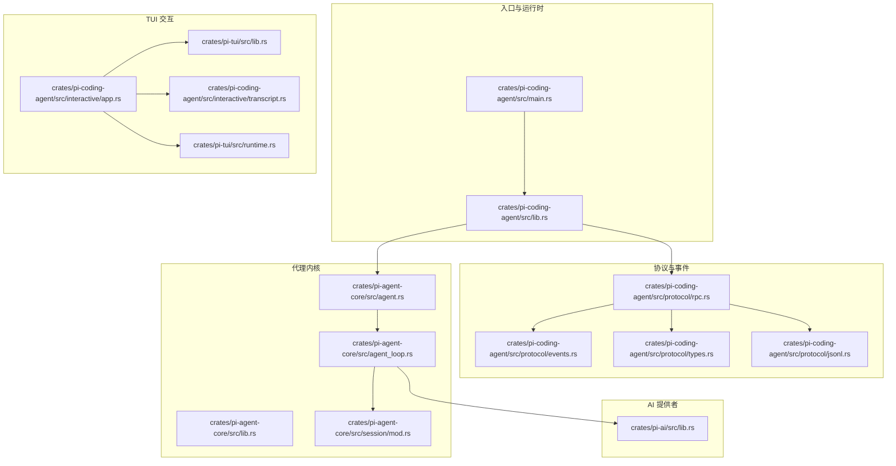
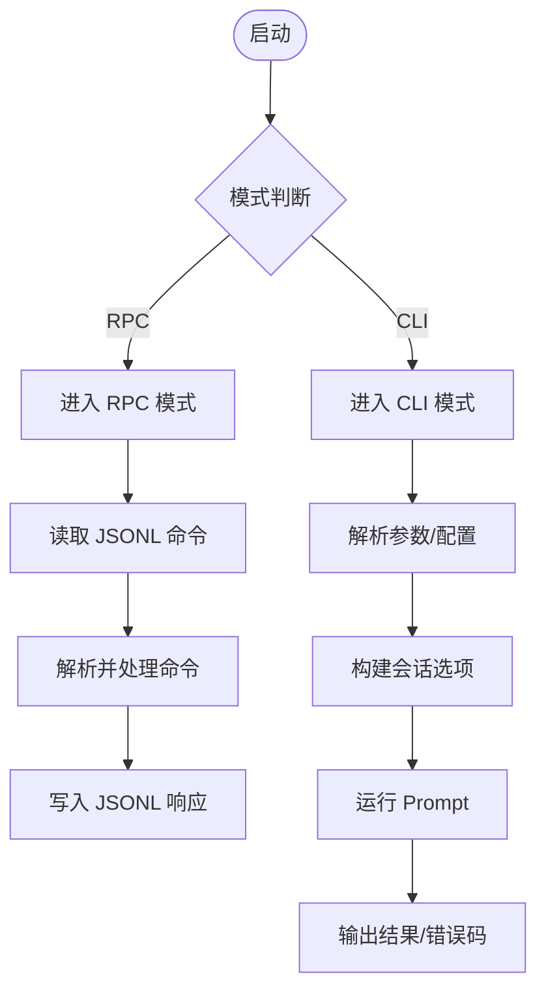
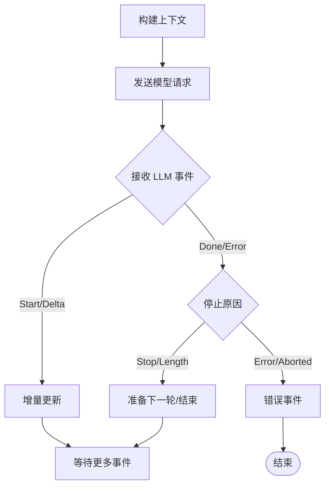
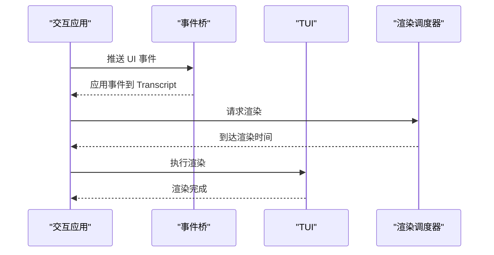
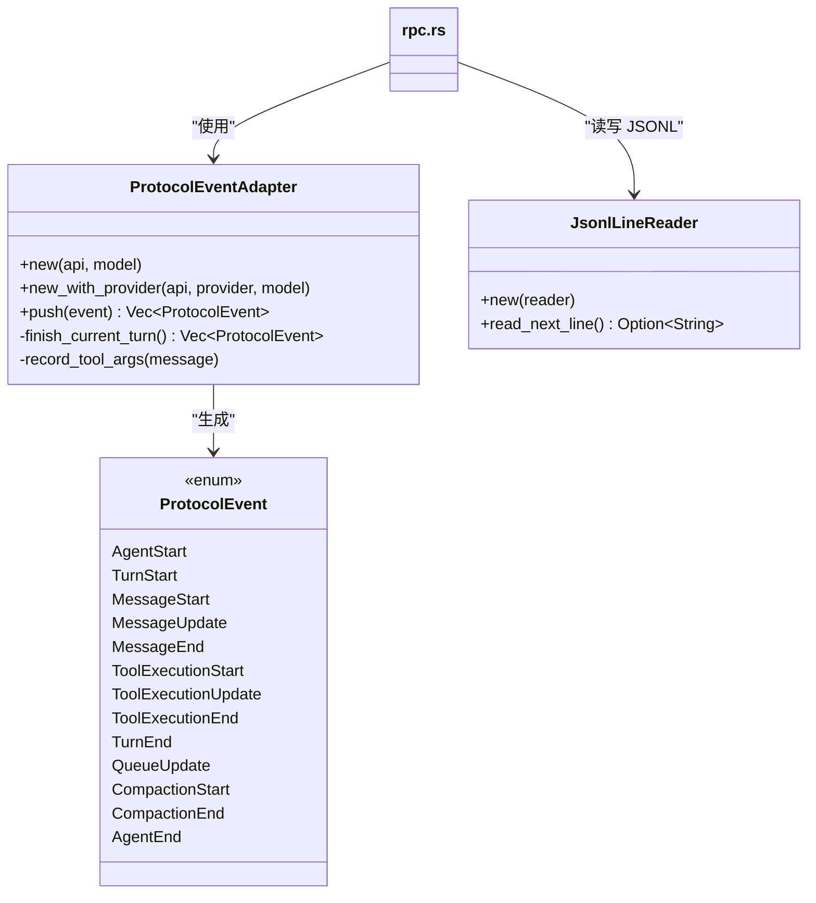
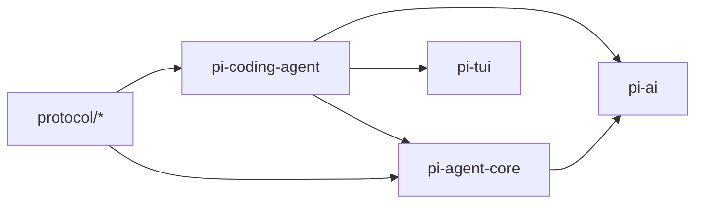

# 数据流设计

<cite>
**本文档引用的文件**
- [main.rs](file://crates/pi-coding-agent/src/main.rs)
- [lib.rs](file://crates/pi-coding-agent/src/lib.rs)
- [app.rs](file://crates/pi-coding-agent/src/interactive/app.rs)
- [events.rs](file://crates/pi-coding-agent/src/protocol/events.rs)
- [rpc.rs](file://crates/pi-coding-agent/src/protocol/rpc.rs)
- [jsonl.rs](file://crates/pi-coding-agent/src/protocol/jsonl.rs)
- [types.rs](file://crates/pi-coding-agent/src/protocol/types.rs)
- [agent.rs](file://crates/pi-agent-core/src/agent.rs)
- [agent_loop.rs](file://crates/pi-agent-core/src/agent_loop.rs)
- [lib.rs](file://crates/pi-agent-core/src/lib.rs)
- [lib.rs](file://crates/pi-ai/src/lib.rs)
- [lib.rs](file://crates/pi-tui/src/lib.rs)
- [runtime.rs](file://crates/pi-tui/src/runtime.rs)
- [transcript.rs](file://crates/pi-coding-agent/src/interactive/transcript.rs)
- [mod.rs](file://crates/pi-agent-core/src/session/mod.rs)
</cite>

## 目录
1. [引言](#引言)
2. [项目结构](#项目结构)
3. [核心组件](#核心组件)
4. [架构总览](#架构总览)
5. [详细组件分析](#详细组件分析)
6. [依赖关系分析](#依赖关系分析)
7. [性能考虑](#性能考虑)
8. [故障排查指南](#故障排查指南)
9. [结论](#结论)

## 引言
本文件面向 Pi-Rust 系统，聚焦“数据流设计”，系统性阐述从用户输入到最终输出的完整数据流路径与处理机制。重点覆盖以下方面：
- 用户输入采集与预处理（CLI、RPC、交互式 TUI）
- Agent 事件流：Turn 生命周期、工具调用、上下文压缩
- AI 响应流：模型请求构建、流式事件、工具执行
- TUI 更新流：事件适配、转录更新、渲染调度
- 异步数据处理、事件传播与状态同步
- 数据转换、格式化与序列化策略
- 关键数据结构、消息传递模式与错误传播机制
- 数据一致性、性能优化与内存管理建议

## 项目结构
Pi-Rust 采用多 crate 分层组织，围绕“编码代理”“AI 提供者”“TUI 交互”三大领域划分模块，形成清晰的职责边界与数据流通道。



**图表来源**
- [main.rs:1-60](file://crates/pi-coding-agent/src/main.rs#L1-L60)
- [lib.rs:1-352](file://crates/pi-coding-agent/src/lib.rs#L1-L352)
- [rpc.rs:1-579](file://crates/pi-coding-agent/src/protocol/rpc.rs#L1-L579)
- [events.rs:1-310](file://crates/pi-coding-agent/src/protocol/events.rs#L1-L310)
- [types.rs:1-268](file://crates/pi-coding-agent/src/protocol/types.rs#L1-L268)
- [jsonl.rs:1-72](file://crates/pi-coding-agent/src/protocol/jsonl.rs#L1-L72)
- [agent.rs:1-282](file://crates/pi-agent-core/src/agent.rs#L1-L282)
- [agent_loop.rs:1-860](file://crates/pi-agent-core/src/agent_loop.rs#L1-L860)
- [lib.rs:1-47](file://crates/pi-agent-core/src/lib.rs#L1-L47)
- [lib.rs:1-19](file://crates/pi-ai/src/lib.rs#L1-L19)
- [lib.rs:1-61](file://crates/pi-tui/src/lib.rs#L1-L61)
- [runtime.rs:1-60](file://crates/pi-tui/src/runtime.rs#L1-L60)
- [transcript.rs:1-229](file://crates/pi-coding-agent/src/interactive/transcript.rs#L1-L229)
- [mod.rs:1-126](file://crates/pi-agent-core/src/session/mod.rs#L1-L126)

**章节来源**
- [main.rs:1-60](file://crates/pi-coding-agent/src/main.rs#L1-L60)
- [lib.rs:1-352](file://crates/pi-coding-agent/src/lib.rs#L1-L352)

## 核心组件
- 编码代理（pi-coding-agent）：负责 CLI/RPC 入口、参数解析、资源加载、会话控制与协议事件适配。
- 代理内核（pi-agent-core）：定义 Agent、事件、工具、上下文转换、循环执行与会话存储。
- AI 提供者（pi-ai）：统一模型注册、流式事件与响应类型。
- TUI 交互（pi-tui）：终端渲染、输入处理、渲染调度与主题样式。
- 协议与事件（protocol/*）：JSONL 序列化、RPC 命令/响应、协议事件适配器。

**章节来源**
- [lib.rs:1-352](file://crates/pi-coding-agent/src/lib.rs#L1-L352)
- [lib.rs:1-47](file://crates/pi-agent-core/src/lib.rs#L1-L47)
- [lib.rs:1-19](file://crates/pi-ai/src/lib.rs#L1-L19)
- [lib.rs:1-61](file://crates/pi-tui/src/lib.rs#L1-L61)

## 架构总览
Pi-Rust 的数据流自上而下分为三层：
- 表层（用户接口层）：CLI、RPC、交互式 TUI
- 中层（协议与事件层）：命令解析、事件适配、JSONL 流
- 内层（代理与 AI 层）：Agent 循环、工具调用、模型请求与流式响应

```mermaid
sequenceDiagram
participant U as "用户"
participant CLI as "CLI/RPC 入口"
participant PROTO as "协议/事件"
participant AG as "Agent"
participant LOOP as "AgentLoop"
participant AI as "AI 提供者"
participant TUI as "TUI 渲染"
U->>CLI : 输入提示/命令
CLI->>PROTO : 解析参数/命令
PROTO->>AG : 构建会话选项/触发 Prompt
AG->>LOOP : 启动循环
LOOP->>AI : 构建上下文并请求模型
AI-->>LOOP : 流式事件文本/思考/工具调用
LOOP-->>PROTO : 生成协议事件
PROTO-->>CLI : JSONL 输出或交互式事件
CLI-->>TUI : 更新转录/渲染
TUI-->>U : 实时显示结果
```

**图表来源**
- [main.rs:1-60](file://crates/pi-coding-agent/src/main.rs#L1-L60)
- [rpc.rs:1-579](file://crates/pi-coding-agent/src/protocol/rpc.rs#L1-L579)
- [events.rs:1-310](file://crates/pi-coding-agent/src/protocol/events.rs#L1-L310)
- [agent.rs:1-282](file://crates/pi-agent-core/src/agent.rs#L1-L282)
- [agent_loop.rs:1-860](file://crates/pi-agent-core/src/agent_loop.rs#L1-L860)
- [lib.rs:1-19](file://crates/pi-ai/src/lib.rs#L1-L19)
- [transcript.rs:1-229](file://crates/pi-coding-agent/src/interactive/transcript.rs#L1-L229)

## 详细组件分析

### 组件一：CLI/RPC 入口与运行时
- CLI 主入口根据参数选择运行模式（打印、JSON、RPC），并读取 stdin 作为输入源。
- 运行时负责参数解析、配置加载、模型选择、资源装载、会话目标解析与 Prompt 构造。
- RPC 模式通过标准输入/输出以 JSONL 协议与外部客户端通信，支持队列推进与状态查询。



**图表来源**
- [main.rs:1-60](file://crates/pi-coding-agent/src/main.rs#L1-L60)
- [lib.rs:83-334](file://crates/pi-coding-agent/src/lib.rs#L83-L334)
- [rpc.rs:39-98](file://crates/pi-coding-agent/src/protocol/rpc.rs#L39-L98)

**章节来源**
- [main.rs:1-60](file://crates/pi-coding-agent/src/main.rs#L1-L60)
- [lib.rs:83-334](file://crates/pi-coding-agent/src/lib.rs#L83-L334)
- [rpc.rs:1-579](file://crates/pi-coding-agent/src/protocol/rpc.rs#L1-L579)

### 组件二：Agent 事件流与工具调用
- Agent 封装消息、工具、配置与取消令牌；提供 prompt/skill/template 调用与队列推进。
- AgentLoop 定义完整的对话循环：队列驱动（引导/后续）、上下文压缩、钩子扩展、模型请求、工具调用（串行/并行）、停止条件与下一步准备。
- 事件类型覆盖 Turn 开始、Provider 请求前、LLM 事件、工具开始/更新/结束、会话压缩、Agent 结束/错误。

```mermaid
sequenceDiagram
participant AG as "Agent"
participant LOOP as "AgentLoop"
participant HOOK as "钩子"
participant AI as "AI 提供者"
participant TOOLS as "工具集"
AG->>LOOP : prompt()/run()
LOOP->>HOOK : transform_context/convert_to_llm
LOOP->>AI : stream_model(context, options)
AI-->>LOOP : LLM 事件流
LOOP->>TOOLS : 工具调用串行/并行
TOOLS-->>LOOP : 工具结果/更新
LOOP-->>AG : 事件流Turn/Tool/Llm/Agent
```

**图表来源**
- [agent.rs:1-282](file://crates/pi-agent-core/src/agent.rs#L1-L282)
- [agent_loop.rs:1-860](file://crates/pi-agent-core/src/agent_loop.rs#L1-L860)
- [lib.rs:1-19](file://crates/pi-ai/src/lib.rs#L1-L19)

**章节来源**
- [agent.rs:1-282](file://crates/pi-agent-core/src/agent.rs#L1-L282)
- [agent_loop.rs:1-860](file://crates/pi-agent-core/src/agent_loop.rs#L1-L860)

### 组件三：AI 响应流与上下文转换
- 上下文转换：支持默认转换与钩子覆盖；可注入思维配置（ThinkingConfig）与取消令牌。
- 流式事件：统一 AssistantMessageEvent（Start/Delta/Done/Error）；根据 StopReason 决定后续（继续/终止/错误）。
- 工具调用：从 AssistantMessage 的内容块中提取工具调用，按模式执行并产出 ToolResult。



**图表来源**
- [agent_loop.rs:251-378](file://crates/pi-agent-core/src/agent_loop.rs#L251-L378)
- [lib.rs:1-19](file://crates/pi-ai/src/lib.rs#L1-L19)

**章节来源**
- [agent_loop.rs:251-378](file://crates/pi-agent-core/src/agent_loop.rs#L251-L378)

### 组件四：TUI 更新流与渲染调度
- 交互应用维护 Transcript（用户/助手/工具/错误/系统）与渲染状态，接收 UI 事件并更新转录。
- RenderScheduler 控制最小渲染间隔与强制刷新，避免过度重绘。
- 输入泵（InputPump）从标准输入异步读取字符流，解耦 UI 与 I/O。



**图表来源**
- [app.rs:1-800](file://crates/pi-coding-agent/src/interactive/app.rs#L1-L800)
- [transcript.rs:1-229](file://crates/pi-coding-agent/src/interactive/transcript.rs#L1-L229)
- [runtime.rs:1-60](file://crates/pi-tui/src/runtime.rs#L1-L60)

**章节来源**
- [app.rs:1-800](file://crates/pi-coding-agent/src/interactive/app.rs#L1-L800)
- [transcript.rs:1-229](file://crates/pi-coding-agent/src/interactive/transcript.rs#L1-L229)
- [runtime.rs:1-60](file://crates/pi-tui/src/runtime.rs#L1-L60)

### 组件五：协议事件适配与 JSONL 序列化
- ProtocolEventAdapter 将 AgentEvent 映射为协议事件（Turn/Message/Tool/Compaction/Agent），并维护当前助手消息与工具参数。
- JSONL 工具提供行级序列化与异步读取，确保跨进程/管道稳定传输。



**图表来源**
- [events.rs:1-310](file://crates/pi-coding-agent/src/protocol/events.rs#L1-L310)
- [types.rs:1-268](file://crates/pi-coding-agent/src/protocol/types.rs#L1-L268)
- [jsonl.rs:1-72](file://crates/pi-coding-agent/src/protocol/jsonl.rs#L1-L72)
- [rpc.rs:1-579](file://crates/pi-coding-agent/src/protocol/rpc.rs#L1-L579)

**章节来源**
- [events.rs:1-310](file://crates/pi-coding-agent/src/protocol/events.rs#L1-L310)
- [types.rs:1-268](file://crates/pi-coding-agent/src/protocol/types.rs#L1-L268)
- [jsonl.rs:1-72](file://crates/pi-coding-agent/src/protocol/jsonl.rs#L1-L72)

### 组件六：会话存储与消息映射
- 会话存储支持 JSONL 文件与内存存储；消息映射函数将 AgentMessage 转换为持久化格式（用户/助手/工具/自定义/分支摘要）。
- 存储字段包含内容、用量、成本、停止原因与时间戳，便于统计与导出。

**章节来源**
- [mod.rs:21-125](file://crates/pi-agent-core/src/session/mod.rs#L21-L125)

## 依赖关系分析
- pi-coding-agent 依赖 pi-agent-core（Agent、事件、会话）、pi-ai（模型流式）、pi-tui（交互渲染）。
- pi-agent-core 依赖 pi-ai 的类型与流式接口，并通过钩子扩展行为。
- 协议层独立于具体 UI，既支持 CLI/打印模式，也支持 RPC/TUI。



**图表来源**
- [lib.rs:1-352](file://crates/pi-coding-agent/src/lib.rs#L1-L352)
- [lib.rs:1-47](file://crates/pi-agent-core/src/lib.rs#L1-L47)
- [lib.rs:1-19](file://crates/pi-ai/src/lib.rs#L1-L19)
- [lib.rs:1-61](file://crates/pi-tui/src/lib.rs#L1-L61)

**章节来源**
- [lib.rs:1-352](file://crates/pi-coding-agent/src/lib.rs#L1-L352)
- [lib.rs:1-47](file://crates/pi-agent-core/src/lib.rs#L1-L47)

## 性能考虑
- 异步与背压：AgentLoop 使用流式事件与取消令牌，避免阻塞；RPC 模式通过 JSONL 行级处理降低缓冲压力。
- 并行工具执行：在支持的模型与工具组合下，工具调用可并行执行以缩短总延迟。
- 上下文压缩：基于令牌估算与摘要生成，在 Turn 前自动压缩历史消息，减少上下文长度。
- 渲染节流：RenderScheduler 限制渲染频率，结合强制刷新策略平衡流畅度与 CPU 占用。
- 内存管理：消息与事件在循环中逐步累积，必要时由压缩钩子或自动压缩清理冗余内容。

[本节为通用指导，无需特定文件来源]

## 故障排查指南
- RPC 命令解析失败：检查命令 JSON 结构与字段类型，确认命令名称在支持列表中。
- 图像输入不支持：RPC 模式当前不支持图像负载，需移除 images 字段。
- 流式冲突：当 Agent 正在流式时，prompt 需指定 streamingBehavior（steer/followUp）。
- Agent 错误事件：关注 AgentError 事件与 StopReason，定位模型错误或超限问题。
- TUI 渲染异常：检查 RenderScheduler 的最小间隔设置与强制刷新标志，确认输入泵未阻塞。

**章节来源**
- [rpc.rs:54-98](file://crates/pi-coding-agent/src/protocol/rpc.rs#L54-L98)
- [rpc.rs:342-454](file://crates/pi-coding-agent/src/protocol/rpc.rs#L342-L454)
- [agent_loop.rs:399-448](file://crates/pi-agent-core/src/agent_loop.rs#L399-L448)

## 结论
Pi-Rust 的数据流设计以“协议事件适配”为核心，贯穿 CLI/RPC/TUI 多入口，通过 AgentLoop 实现稳定的事件驱动循环与工具执行，配合 JSONL 序列化实现跨进程可靠通信。该架构在异步处理、事件传播与状态同步方面具备良好扩展性，同时通过上下文压缩与渲染调度保障性能与用户体验。未来可在工具并行策略、钩子扩展与会话持久化方面进一步优化。