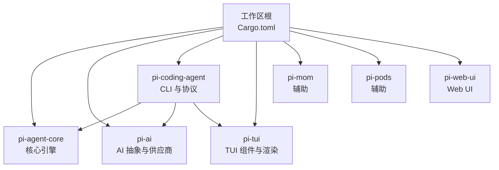
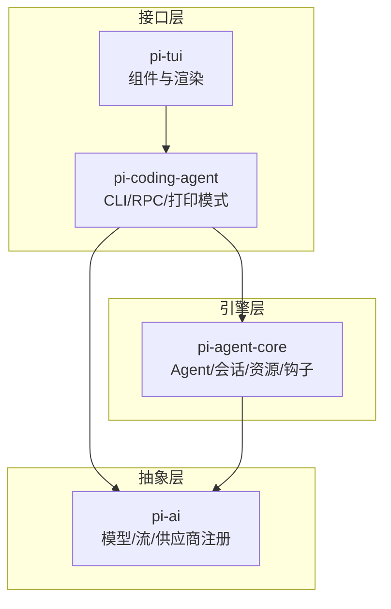
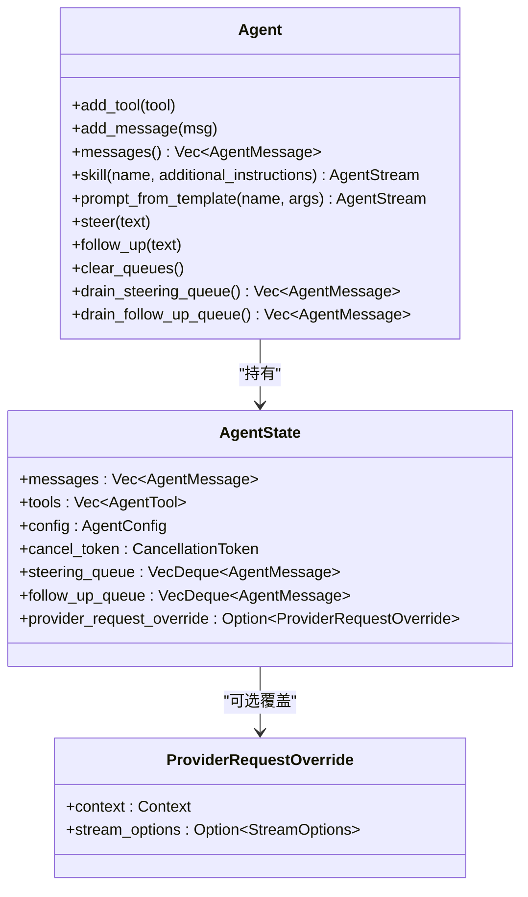
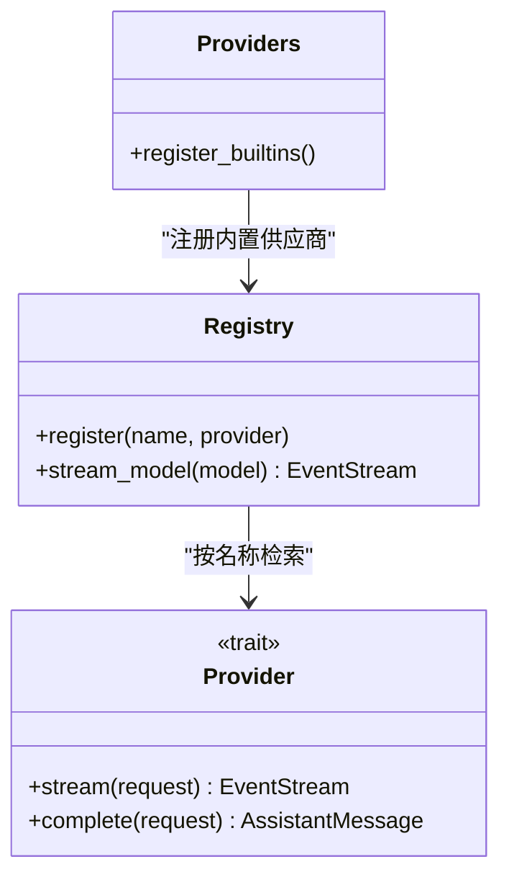
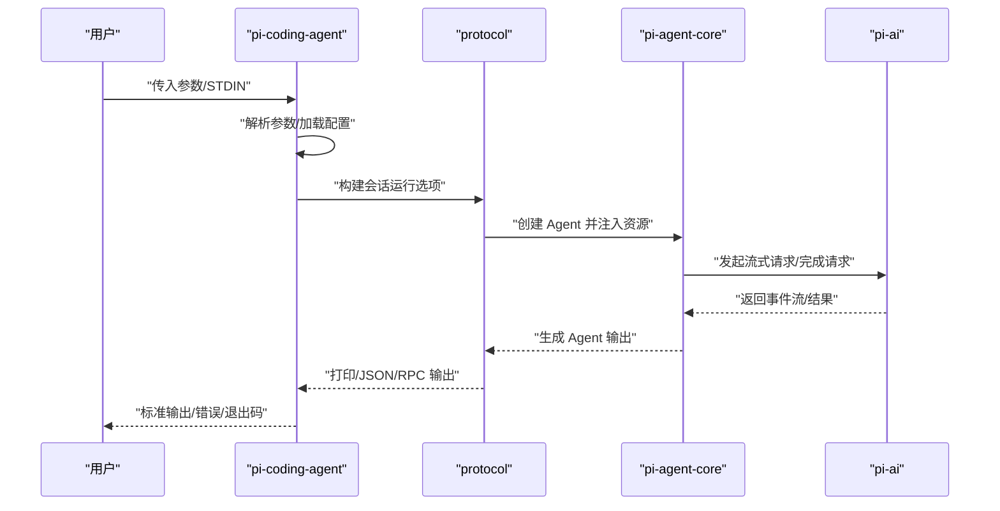
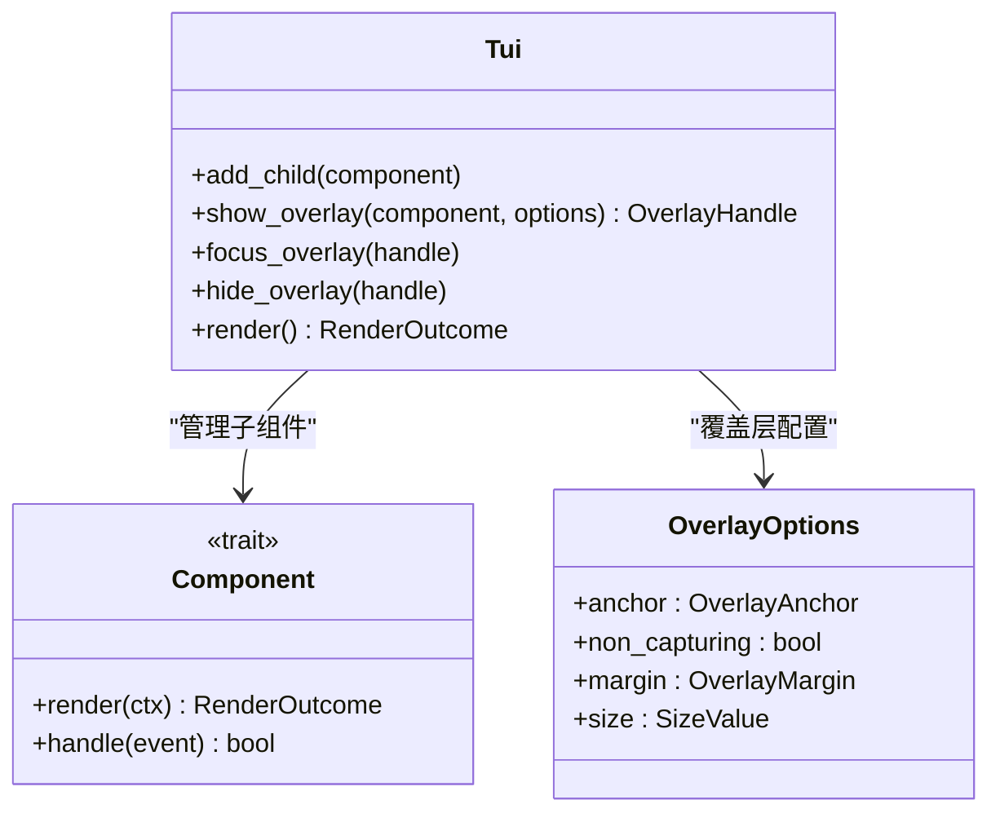
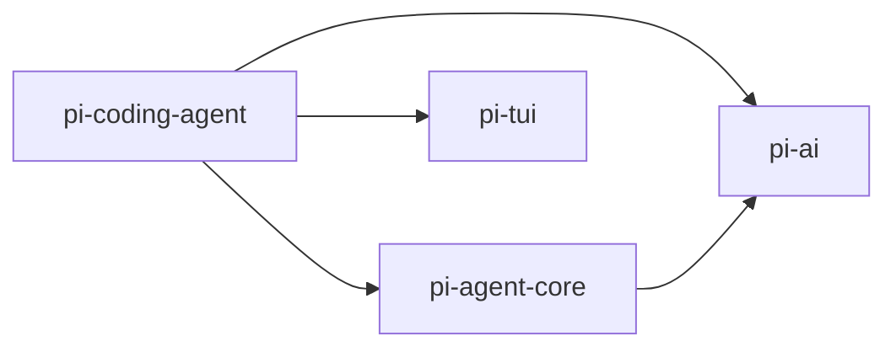
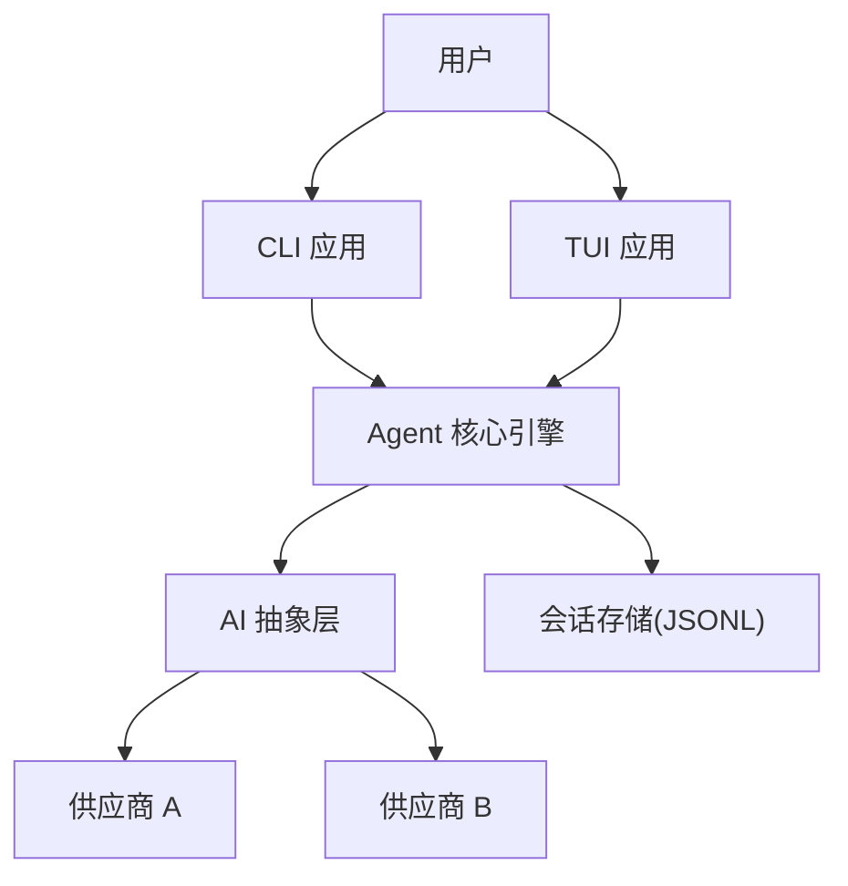
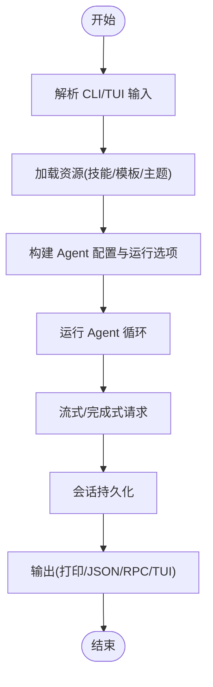

# 核心架构

<cite>
**本文引用的文件**
- [Cargo.toml](file://Cargo.toml)
- [main.rs](file://src/main.rs)
- [pi-agent-core/Cargo.toml](file://crates/pi-agent-core/Cargo.toml)
- [pi-agent-core/src/lib.rs](file://crates/pi-agent-core/src/lib.rs)
- [pi-agent-core/src/agent.rs](file://crates/pi-agent-core/src/agent.rs)
- [pi-agent-core/src/session/mod.rs](file://crates/pi-agent-core/src/session/mod.rs)
- [pi-agent-core/src/resources/mod.rs](file://crates/pi-agent-core/src/resources/mod.rs)
- [pi-ai/Cargo.toml](file://crates/pi-ai/Cargo.toml)
- [pi-ai/src/lib.rs](file://crates/pi-ai/src/lib.rs)
- [pi-ai/src/providers/mod.rs](file://crates/pi-ai/src/providers/mod.rs)
- [pi-coding-agent/Cargo.toml](file://crates/pi-coding-agent/Cargo.toml)
- [pi-coding-agent/src/lib.rs](file://crates/pi-coding-agent/src/lib.rs)
- [pi-coding-agent/src/main.rs](file://crates/pi-coding-agent/src/main.rs)
- [pi-coding-agent/src/protocol/mod.rs](file://crates/pi-coding-agent/src/protocol/mod.rs)
- [pi-tui/Cargo.toml](file://crates/pi-tui/Cargo.toml)
- [pi-tui/src/lib.rs](file://crates/pi-tui/src/lib.rs)
- [pi-tui/src/tui.rs](file://crates/pi-tui/src/tui.rs)
- [pi-tui/src/components/mod.rs](file://crates/pi-tui/src/components/mod.rs)
</cite>

## 目录
1. [引言](#引言)
2. [项目结构](#项目结构)
3. [核心组件](#核心组件)
4. [架构总览](#架构总览)
5. [详细组件分析](#详细组件分析)
6. [依赖关系分析](#依赖关系分析)
7. [性能考量](#性能考量)
8. [故障排查指南](#故障排查指南)
9. [结论](#结论)
10. [附录](#附录)

## 引言
本架构文档面向 Pi-Rust 项目，聚焦于核心引擎与关键子系统的协作方式。Pi-Rust 采用多 crate 工作区组织，围绕以下目标展开：以 pi-agent-core 为核心引擎驱动智能体行为与会话持久化；通过 pi-ai 提供统一的 AI 模型与供应商抽象；以 pi-coding-agent 提供 CLI 与交互式体验；以 pi-tui 实现终端用户界面与组件化渲染。本文从系统边界、组件交互、数据流、集成模式、技术决策与约束、基础设施与可扩展性、安全与监控等维度进行系统化阐述。

## 项目结构
Pi-Rust 采用 Rust 工作区（workspace）组织，顶层 Cargo.toml 声明成员 crate，包含核心引擎、AI 抽象层、CLI 与 TUI 子系统及辅助 crate。顶层入口 main.rs 当前为空实现，实际运行由各 crate 的二进制入口承担。

图表来源
- [Cargo.toml:1-12](file://Cargo.toml#L1-L12)

章节来源
- [Cargo.toml:1-12](file://Cargo.toml#L1-L12)
- [main.rs:1-4](file://src/main.rs#L1-L4)

## 核心组件
- pi-agent-core：提供 Agent 生命周期、工具注册、消息队列、钩子机制、会话存储与资源加载等能力，是系统的核心执行引擎。
- pi-ai：提供模型注册表、事件流、消息类型、供应商适配器（Anthropic、OpenAI、Google、Bedrock、Mistral、DeepSeek 等），屏蔽底层差异。
- pi-coding-agent：提供 CLI 解析、打印模式、交互模式、RPC 模式、会话运行器、内置工具集与资源加载，连接用户输入与核心引擎。
- pi-tui：提供终端组件库、输入处理、渲染策略、主题与虚拟终端支持，支撑交互式 TUI 应用。

章节来源
- [pi-agent-core/src/lib.rs:1-47](file://crates/pi-agent-core/src/lib.rs#L1-L47)
- [pi-ai/src/lib.rs:1-19](file://crates/pi-ai/src/lib.rs#L1-L19)
- [pi-coding-agent/src/lib.rs:1-352](file://crates/pi-coding-agent/src/lib.rs#L1-L352)
- [pi-tui/src/lib.rs:1-61](file://crates/pi-tui/src/lib.rs#L1-L61)

## 架构总览
Pi-Rust 采用“引擎 + 抽象 + 接口 + 界面”的分层架构：
- 引擎层：pi-agent-core 负责智能体状态机、消息编排、工具调用与钩子扩展。
- 抽象层：pi-ai 定义统一的模型、消息与流接口，并通过注册表集中管理供应商实现。
- 接口层：pi-coding-agent 提供 CLI、打印模式、RPC 模式与会话运行器，作为用户与引擎的桥梁。
- 界面层：pi-tui 提供组件化 TUI 渲染与输入处理，支持交互式编辑与对话展示。

图表来源
- [pi-coding-agent/src/lib.rs:83-334](file://crates/pi-coding-agent/src/lib.rs#L83-L334)
- [pi-agent-core/src/agent.rs:146-200](file://crates/pi-agent-core/src/agent.rs#L146-L200)
- [pi-ai/src/providers/mod.rs:17-61](file://crates/pi-ai/src/providers/mod.rs#L17-L61)
- [pi-tui/src/tui.rs:52-103](file://crates/pi-tui/src/tui.rs#L52-L103)

## 详细组件分析

### pi-agent-core：核心引擎
- 角色定位：承载 Agent 状态、消息队列、工具集合、钩子扩展与会话持久化。
- 关键职责：
  - Agent 状态管理与并发控制（读写锁、取消令牌）。
  - 用户引导与后续消息队列（steering/follow_up）。
  - 资源注入（技能、提示模板）与内部 prompt 组装。
  - 与 pi-ai 的上下文转换与流式输出对接。
  - 会话元数据与 JSONL 存储桥接。
- 设计要点：
  - 使用原子布尔位与运行守卫避免重复运行。
  - 通过 ProviderRequestOverride 支持对上游请求的上下文与流选项覆盖。
  - 会话消息到存储格式的映射，过滤系统提示与压缩摘要等特殊消息类型。

图表来源
- [pi-agent-core/src/agent.rs:14-67](file://crates/pi-agent-core/src/agent.rs#L14-L67)
- [pi-agent-core/src/agent.rs:24-27](file://crates/pi-agent-core/src/agent.rs#L24-L27)

章节来源
- [pi-agent-core/src/agent.rs:146-200](file://crates/pi-agent-core/src/agent.rs#L146-L200)
- [pi-agent-core/src/session/mod.rs:21-126](file://crates/pi-agent-core/src/session/mod.rs#L21-L126)
- [pi-agent-core/src/resources/mod.rs:1-12](file://crates/pi-agent-core/src/resources/mod.rs#L1-L12)

### pi-ai：AI 抽象与供应商集成
- 角色定位：统一模型、消息、流与供应商接口，提供注册表与事件流。
- 关键职责：
  - 模型注册与查询、成本计算、上下文构建。
  - 事件流封装与 SSE/HTTP 流解析。
  - 多供应商适配（Anthropic、OpenAI、Google、Bedrock、Mistral、DeepSeek 等）。
- 设计要点：
  - 注册表集中管理供应商实例，启动时一次性注册内置供应商。
  - 通过 StreamOptions 与 ProviderResponseInfo 抽象流式响应。
  - 与 pi-agent-core 的 Context/StreamOptions 对接，确保上下文与流配置一致。

图表来源
- [pi-ai/src/providers/mod.rs:17-61](file://crates/pi-ai/src/providers/mod.rs#L17-L61)
- [pi-ai/src/lib.rs:10-19](file://crates/pi-ai/src/lib.rs#L10-L19)

章节来源
- [pi-ai/src/lib.rs:1-19](file://crates/pi-ai/src/lib.rs#L1-L19)
- [pi-ai/src/providers/mod.rs:1-61](file://crates/pi-ai/src/providers/mod.rs#L1-L61)

### pi-coding-agent：CLI 架构与协议
- 角色定位：用户入口与协议编排，负责参数解析、资源加载、会话运行与模式切换。
- 关键职责：
  - CLI 参数解析与帮助/版本输出。
  - 打印模式、JSON 模式与 RPC 模式的路由。
  - 内置工具集与资源加载（技能、模板、主题）。
  - 会话运行器：打开/继续/分支会话，设置系统提示与思考层级。
- 设计要点：
  - 默认包含内置工具集，支持过滤与禁用。
  - 通过 protocol::session_runner 将用户意图转化为 Agent 资源与运行选项。
  - 主入口根据是否为 RPC 模式选择不同执行路径。

图表来源
- [pi-coding-agent/src/lib.rs:83-334](file://crates/pi-coding-agent/src/lib.rs#L83-L334)
- [pi-coding-agent/src/main.rs:1-60](file://crates/pi-coding-agent/src/main.rs#L1-L60)
- [pi-coding-agent/src/protocol/mod.rs:1-7](file://crates/pi-coding-agent/src/protocol/mod.rs#L1-L7)

章节来源
- [pi-coding-agent/src/lib.rs:1-352](file://crates/pi-coding-agent/src/lib.rs#L1-L352)
- [pi-coding-agent/src/main.rs:1-60](file://crates/pi-coding-agent/src/main.rs#L1-L60)
- [pi-coding-agent/src/protocol/mod.rs:1-7](file://crates/pi-coding-agent/src/protocol/mod.rs#L1-L7)

### pi-tui：TUI 系统设计
- 角色定位：终端 UI 组件库与渲染调度，提供输入处理、主题与组件集合。
- 关键职责：
  - 组件体系：文本、编辑器、列表、设置项、Markdown、图像等。
  - 输入处理：按键绑定、组合键、释放事件识别与缓冲。
  - 渲染策略：全量重绘、差分重绘、无变化检测与表面类型（内联/清屏）。
  - 主题与颜色：深浅主题、ANSI 彩色与宽度计算。
- 设计要点：
  - Tui 结构管理子组件与覆盖层，支持焦点切换与覆盖层生命周期。
  - RenderStrategy 与 RenderOutcome 用于优化渲染性能。
  - 与虚拟终端协议集成，支持 Kitty/iTerm2 图像编码与超链接。

图表来源
- [pi-tui/src/tui.rs:52-200](file://crates/pi-tui/src/tui.rs#L52-L200)
- [pi-tui/src/components/mod.rs:1-26](file://crates/pi-tui/src/components/mod.rs#L1-L26)

章节来源
- [pi-tui/src/lib.rs:1-61](file://crates/pi-tui/src/lib.rs#L1-L61)
- [pi-tui/src/tui.rs:1-200](file://crates/pi-tui/src/tui.rs#L1-L200)
- [pi-tui/src/components/mod.rs:1-26](file://crates/pi-tui/src/components/mod.rs#L1-L26)

## 依赖关系分析
- 工作区依赖：顶层声明成员 crate，保证统一工具链与版本。
- crate 间依赖：
  - pi-coding-agent 依赖 pi-agent-core、pi-ai、pi-tui。
  - pi-agent-core 依赖 pi-ai 与若干通用库（异步、序列化、HTTP 客户端等）。
  - pi-tui 依赖 crossterm、pulldown-cmark 等终端与渲染库。
- 第三方库与版本：
  - 异步运行时与流：tokio、futures、async-stream。
  - 序列化：serde、serde_json、serde_yaml。
  - HTTP 客户端：reqwest（rustls TLS）。
  - 其他：uuid、time、regex、image、dirs 等。

图表来源
- [pi-coding-agent/Cargo.toml:13-15](file://crates/pi-coding-agent/Cargo.toml#L13-L15)
- [pi-agent-core/Cargo.toml:7-18](file://crates/pi-agent-core/Cargo.toml#L7-L18)
- [pi-tui/Cargo.toml:6-14](file://crates/pi-tui/Cargo.toml#L6-L14)

章节来源
- [Cargo.toml:1-12](file://Cargo.toml#L1-L12)
- [pi-coding-agent/Cargo.toml:1-27](file://crates/pi-coding-agent/Cargo.toml#L1-L27)
- [pi-agent-core/Cargo.toml:1-23](file://crates/pi-agent-core/Cargo.toml#L1-L23)
- [pi-ai/Cargo.toml:1-21](file://crates/pi-ai/Cargo.toml#L1-L21)
- [pi-tui/Cargo.toml:1-14](file://crates/pi-tui/Cargo.toml#L1-L14)

## 性能考量
- 异步与并发：
  - 使用 tokio 运行时与异步流处理，降低阻塞风险。
  - Agent 状态使用读写锁与原子布尔位，避免重复运行与竞态。
- 渲染优化：
  - TUI 采用差分重绘与行宽检测，减少终端刷新开销。
  - RenderStrategy 与 RenderSurface 控制渲染粒度与清屏策略。
- I/O 与网络：
  - reqwest 启用 rustls TLS 与流式 JSON，提升网络效率。
  - 会话存储采用 JSONL，便于增量写入与回放。
- 可扩展性：
  - 通过钩子与供应商注册表实现横向扩展，新增模型或供应商无需修改核心逻辑。
  - CLI 模式解耦（打印/JSON/RPC），便于在不同运行环境中复用核心引擎。

## 故障排查指南
- 常见问题与定位：
  - CLI 模式不支持：当使用 rpc 模式但未通过流式二进制入口时，会返回不支持模式错误。
  - 缺少提示词：若未提供有效提示且 STDIN 为空，将返回缺少提示错误。
  - API 密钥解析失败：认证阶段诊断信息会输出到标准错误，检查配置与环境变量。
  - TUI 行宽超限：当某行宽度超过最大宽度时，抛出行过宽错误，需调整布局或截断策略。
- 建议排查步骤：
  - 检查 CLI 参数与资源加载日志输出。
  - 在交互模式下逐步缩小问题范围，优先验证模型与供应商连通性。
  - 查看 TUI 渲染异常时的行宽与终端能力检测结果。

章节来源
- [pi-coding-agent/src/lib.rs:129-133](file://crates/pi-coding-agent/src/lib.rs#L129-L133)
- [pi-coding-agent/src/lib.rs:149-150](file://crates/pi-coding-agent/src/lib.rs#L149-L150)
- [pi-coding-agent/src/lib.rs:174-187](file://crates/pi-coding-agent/src/lib.rs#L174-L187)
- [pi-tui/src/tui.rs:39-50](file://crates/pi-tui/src/tui.rs#L39-L50)

## 结论
Pi-Rust 通过清晰的分层与模块化设计，实现了从 CLI 到 TUI 的完整用户交互闭环，并以 pi-agent-core 为核心引擎串联 AI 抽象与会话持久化。该架构在可扩展性、可维护性与跨平台终端渲染方面具备良好基础，适合进一步引入更多供应商与工具，同时保持核心逻辑稳定。

## 附录
- 系统上下文图（概念性）

- 数据流流程（概念性）
