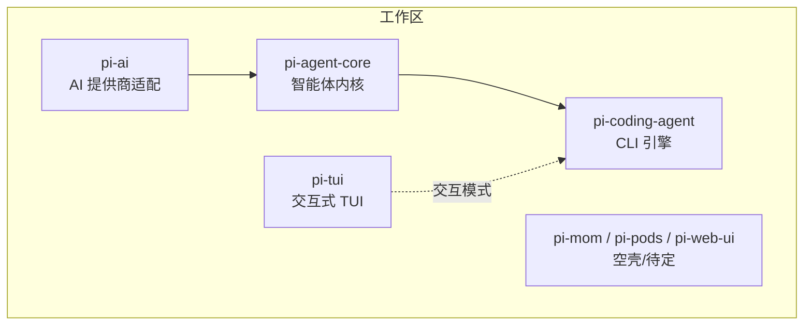
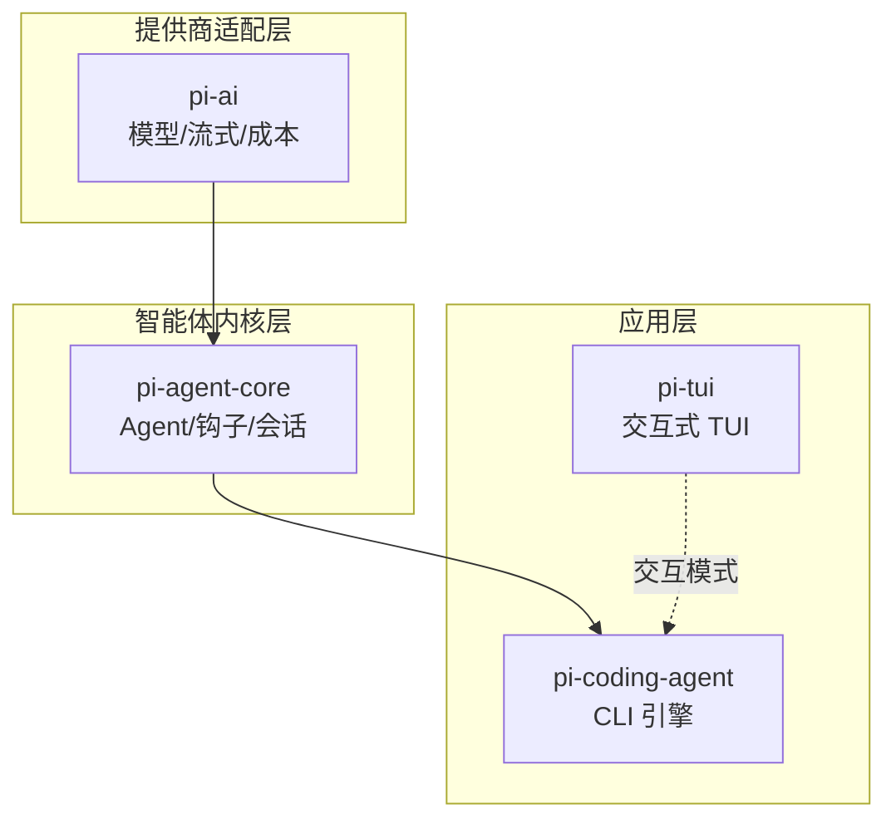
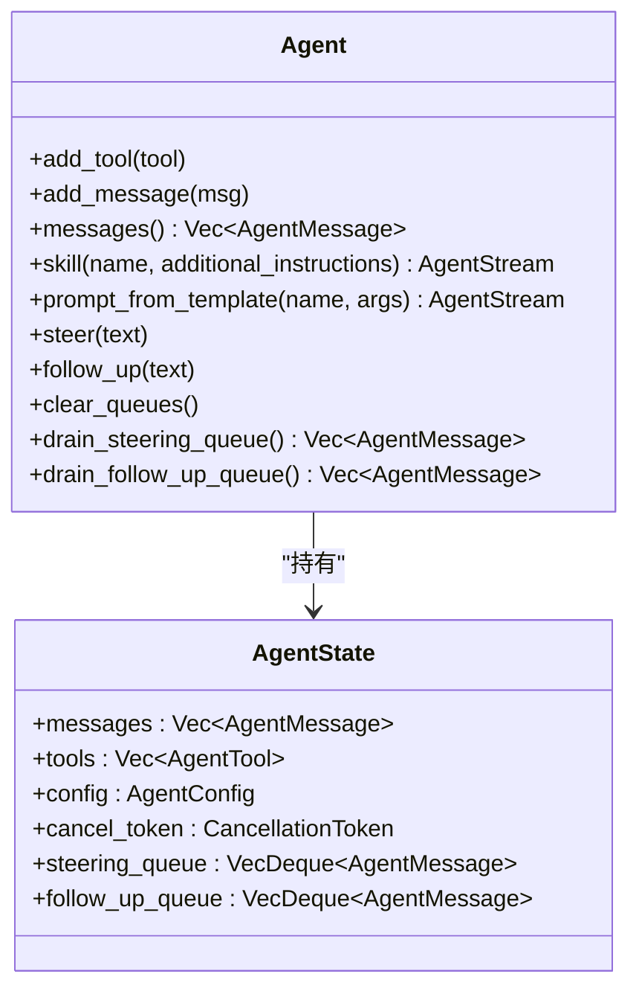
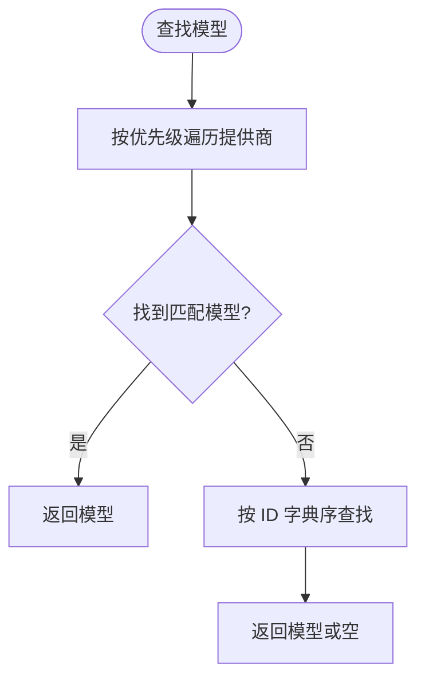
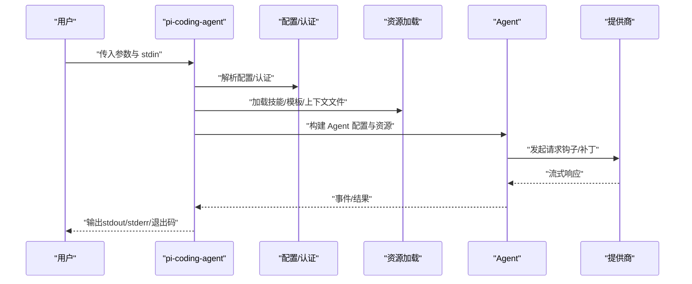
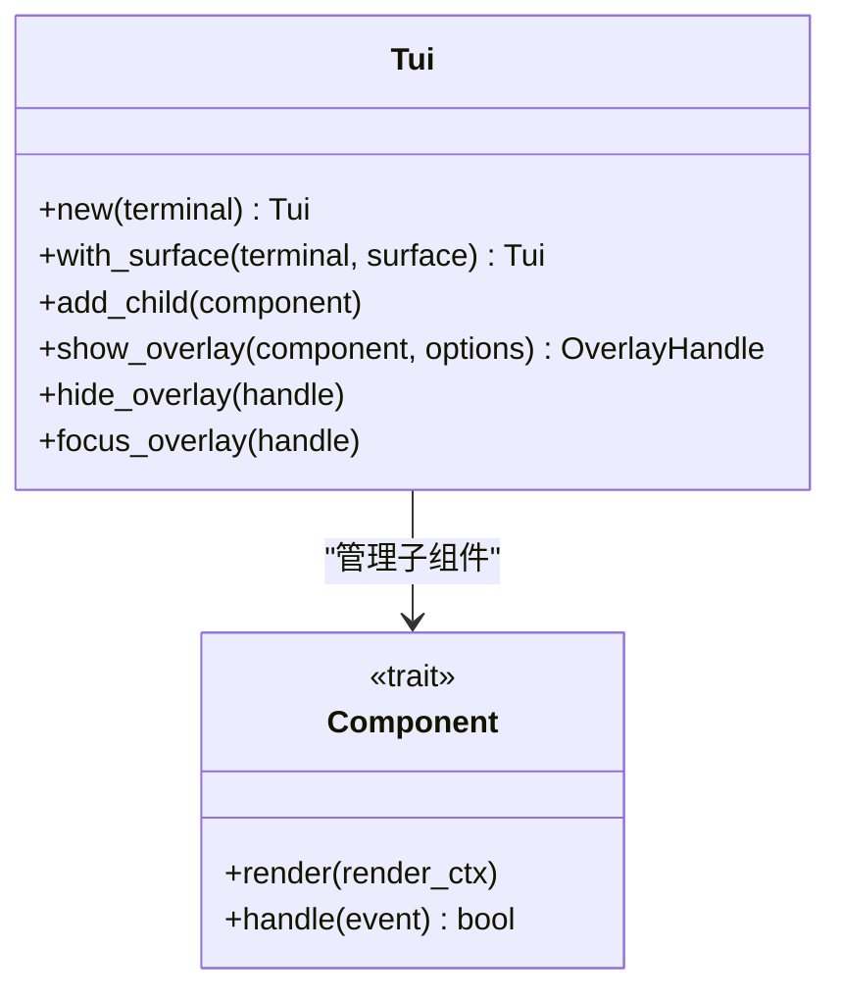
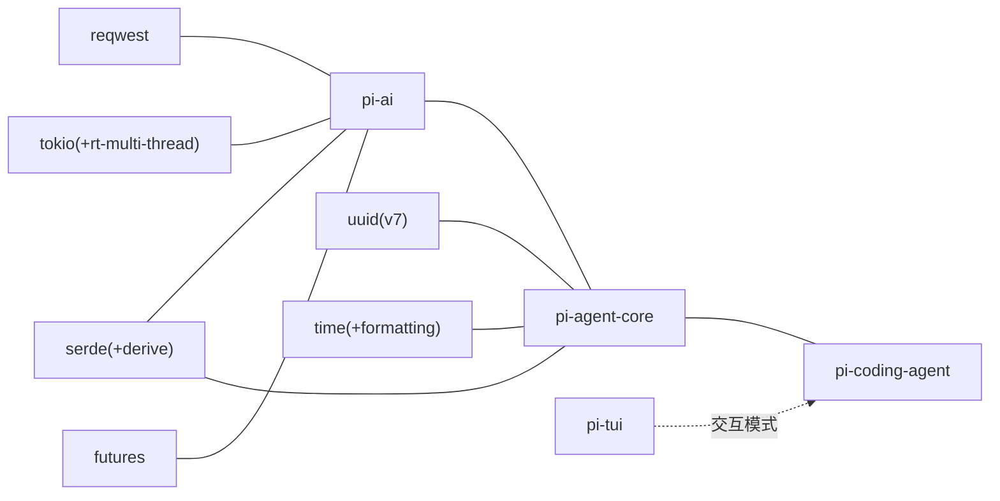

# 系统概览

<cite>
**本文档引用的文件**
- [Cargo.toml](file://Cargo.toml)
- [src/main.rs](file://src/main.rs)
- [ROADMAP.md](file://ROADMAP.md)
- [crates/pi-agent-core/Cargo.toml](file://crates/pi-agent-core/Cargo.toml)
- [crates/pi-agent-core/src/lib.rs](file://crates/pi-agent-core/src/lib.rs)
- [crates/pi-agent-core/src/agent.rs](file://crates/pi-agent-core/src/agent.rs)
- [crates/pi-ai/Cargo.toml](file://crates/pi-ai/Cargo.toml)
- [crates/pi-ai/src/lib.rs](file://crates/pi-ai/src/lib.rs)
- [crates/pi-ai/src/models.rs](file://crates/pi-ai/src/models.rs)
- [crates/pi-coding-agent/Cargo.toml](file://crates/pi-coding-agent/Cargo.toml)
- [crates/pi-coding-agent/src/lib.rs](file://crates/pi-coding-agent/src/lib.rs)
- [crates/pi-coding-agent/src/main.rs](file://crates/pi-coding-agent/src/main.rs)
- [crates/pi-tui/src/lib.rs](file://crates/pi-tui/src/lib.rs)
- [crates/pi-tui/src/tui.rs](file://crates/pi-tui/src/tui.rs)
</cite>

## 目录
1. [简介](#简介)
2. [项目结构](#项目结构)
3. [核心组件](#核心组件)
4. [架构总览](#架构总览)
5. [详细组件分析](#详细组件分析)
6. [依赖分析](#依赖分析)
7. [性能考量](#性能考量)
8. [故障排查指南](#故障排查指南)
9. [结论](#结论)
10. [附录](#附录)

## 简介
Pi-Rust 是将上游 TypeScript 单体仓库“pi”以 Rust 语言进行现代化移植的多包工作区（monorepo）。其总体目标是在保留原功能对齐的前提下，充分利用 Rust 的内存安全、并发模型与生态工具链，构建高性能、可扩展且工程化友好的 AI 编辑与交互系统。系统围绕“智能体内核 + 多模态 AI 提供商适配 + 编辑型 CLI + 交互式 TUI”的分层设计展开，逐步补齐插件系统与周边能力。

- 核心价值主张
  - 功能对齐：在 Rust 中完整复刻 pi 的关键能力，确保会话与资源格式互通。
  - 现代化工程：采用异步运行时、类型安全与零拷贝数据处理，提升稳定性与性能。
  - 可扩展性：通过分层模块与钩子机制，支持多提供商、多工具与交互扩展。
  - 开发体验：完善的测试矩阵、持续集成检查与交互式 TUI，降低使用门槛。

- 应用场景
  - 在终端中进行代码编辑、搜索、修改与批量操作的 AI 辅助工作流。
  - 交互式对话与工具调用，结合上下文文件与技能模板，完成复杂任务编排。
  - 作为 RPC/JSON 流模式的后端服务，对接上层应用或 IDE 扩展。

- 系统边界
  - 上游边界：与 TypeScript 版本的功能对齐，保持会话 JSONL 互通。
  - 下游边界：当前重点完成核心引擎与 CLI/TUI，插件系统与周边能力（如导出/分享/包管理）在后续里程碑推进。

**章节来源**
- [ROADMAP.md:11-21](file://ROADMAP.md#L11-L21)
- [ROADMAP.md:44-50](file://ROADMAP.md#L44-L50)

## 项目结构
工作区采用多 crate 设计，按职责划分为：
- pi-agent-core：智能体内核与会话持久化、资源与钩子机制的核心库。
- pi-ai：AI 提供商适配、模型注册表、流式事件与成本计算。
- pi-coding-agent：CLI 引擎与交互入口，负责参数解析、资源加载、会话控制与工具执行。
- pi-tui：交互式文本用户界面，提供组件化渲染、输入处理与主题样式。
- pi-mom/pi-pods/pi-web-ui：空壳 crate，范围尚未确定，可能承担周边能力或实验性 UI。

**图表来源**
- [Cargo.toml:1-12](file://Cargo.toml#L1-L12)
- [ROADMAP.md:44-50](file://ROADMAP.md#L44-L50)

**章节来源**
- [Cargo.toml:1-12](file://Cargo.toml#L1-L12)
- [ROADMAP.md:44-50](file://ROADMAP.md#L44-L50)

## 核心组件
- 智能体内核（pi-agent-core）
  - 提供 Agent 抽象、消息队列、工具注册、钩子系统与会话持久化接口。
  - 支持“引导队列”和“跟进队列”，便于外部驱动与多轮对话编排。
  - 通过 Provider 请求钩子与资源注入，实现对不同提供商的统一适配。

- AI 提供商适配（pi-ai）
  - 维护模型注册表与提供商映射，支持按优先级查找模型。
  - 提供流式事件抽象与成本计算工具，便于统计与优化。

- 编辑型 CLI（pi-coding-agent）
  - 解析命令行参数，加载配置与资源，选择模型与认证信息。
  - 支持打印模式、JSON 模式与交互模式；在交互模式下可接入 TUI。
  - 封装会话打开/继续/分支等生命周期管理。

- 交互式 TUI（pi-tui）
  - 提供组件化 UI 构建、输入事件处理、覆盖层管理与主题样式。
  - 支持增量渲染策略与硬件光标，优化终端渲染性能。

**章节来源**
- [crates/pi-agent-core/src/lib.rs:1-47](file://crates/pi-agent-core/src/lib.rs#L1-L47)
- [crates/pi-ai/src/lib.rs:1-19](file://crates/pi-ai/src/lib.rs#L1-L19)
- [crates/pi-coding-agent/src/lib.rs:1-352](file://crates/pi-coding-agent/src/lib.rs#L1-L352)
- [crates/pi-tui/src/lib.rs:1-61](file://crates/pi-tui/src/lib.rs#L1-L61)

## 架构总览
系统采用“提供商适配层 → 智能体内核层 → CLI/TUI 层”的分层架构。其中：
- pi-ai 为所有提供商的统一抽象与模型注册中心。
- pi-agent-core 负责智能体状态、钩子与会话持久化。
- pi-coding-agent 作为 CLI 引擎，协调资源、会话与工具，并在需要时进入交互模式。
- pi-tui 在交互模式下提供可视化与输入体验。

**图表来源**
- [ROADMAP.md:44-50](file://ROADMAP.md#L44-L50)
- [crates/pi-ai/src/lib.rs:10-19](file://crates/pi-ai/src/lib.rs#L10-L19)
- [crates/pi-agent-core/src/lib.rs:18-46](file://crates/pi-agent-core/src/lib.rs#L18-L46)
- [crates/pi-coding-agent/src/lib.rs:15-32](file://crates/pi-coding-agent/src/lib.rs#L15-L32)
- [crates/pi-tui/src/lib.rs:20-61](file://crates/pi-tui/src/lib.rs#L20-L61)

## 详细组件分析

### 智能体内核（pi-agent-core）
- 设计要点
  - 使用共享状态与原子标志位保证并发安全，避免重复运行。
  - 通过钩子系统在请求发送前进行参数与头部补丁，增强可扩展性。
  - 支持“引导/跟进”队列，便于外部驱动与多轮对话编排。

**图表来源**
- [crates/pi-agent-core/src/agent.rs:39-200](file://crates/pi-agent-core/src/agent.rs#L39-L200)

**章节来源**
- [crates/pi-agent-core/src/agent.rs:14-200](file://crates/pi-agent-core/src/agent.rs#L14-L200)

### AI 提供商适配（pi-ai）
- 设计要点
  - 模型注册表通过静态 JSON 生成，提供 O(1) 查找与跨提供商检索。
  - 提供流式事件抽象与成本计算函数，便于统一处理不同提供商的响应。

**图表来源**
- [crates/pi-ai/src/models.rs:6-14](file://crates/pi-ai/src/models.rs#L6-L14)

**章节来源**
- [crates/pi-ai/src/models.rs:1-110](file://crates/pi-ai/src/models.rs#L1-L110)

### 编辑型 CLI（pi-coding-agent）
- 设计要点
  - 参数解析与模式切换：帮助、版本、列出模型、打印模式、JSON 模式与交互模式。
  - 资源加载与上下文文件发现，支持技能与模板的动态装载。
  - 会话目标解析：支持打开、继续、分支与按 ID 定位会话。

**图表来源**
- [crates/pi-coding-agent/src/main.rs:1-60](file://crates/pi-coding-agent/src/main.rs#L1-L60)
- [crates/pi-coding-agent/src/lib.rs:83-334](file://crates/pi-coding-agent/src/lib.rs#L83-L334)

**章节来源**
- [crates/pi-coding-agent/src/main.rs:1-60](file://crates/pi-coding-agent/src/main.rs#L1-L60)
- [crates/pi-coding-agent/src/lib.rs:83-334](file://crates/pi-coding-agent/src/lib.rs#L83-L334)

### 交互式 TUI（pi-tui）
- 设计要点
  - 组件化渲染与覆盖层管理，支持焦点切换与键盘事件处理。
  - 渲染策略包含全量重绘与差分渲染，减少终端刷新开销。
  - 主题与颜色等级检测，适配不同终端能力。

**图表来源**
- [crates/pi-tui/src/tui.rs:52-200](file://crates/pi-tui/src/tui.rs#L52-L200)
- [crates/pi-tui/src/lib.rs:20-61](file://crates/pi-tui/src/lib.rs#L20-L61)

**章节来源**
- [crates/pi-tui/src/tui.rs:1-200](file://crates/pi-tui/src/tui.rs#L1-L200)
- [crates/pi-tui/src/lib.rs:1-61](file://crates/pi-tui/src/lib.rs#L1-L61)

## 依赖分析
- 工作区成员与版本
  - 工作区统一使用 2024 年版 Rust，成员 crate 明确声明相互依赖关系。
  - 关键外部依赖：Tokio（异步运行时）、Futures（异步组合）、Serde（序列化）、Reqwest（HTTP 客户端）等。

- 依赖关系图
  - pi-ai 依赖 Tokio/Futures/Reqwest/Serde 等，提供模型与流式能力。
  - pi-agent-core 依赖 pi-ai 与 Tokio-util/Async-stream/UUID 等，提供智能体内核。
  - pi-coding-agent 依赖 pi-agent-core/pi-ai/pi-tui 与大量工具库，提供 CLI 引擎。
  - TUI 作为可选依赖，仅在交互模式下接入。

**图表来源**
- [crates/pi-ai/Cargo.toml:6-18](file://crates/pi-ai/Cargo.toml#L6-L18)
- [crates/pi-agent-core/Cargo.toml:6-18](file://crates/pi-agent-core/Cargo.toml#L6-L18)
- [crates/pi-coding-agent/Cargo.toml:6-22](file://crates/pi-coding-agent/Cargo.toml#L6-L22)

**章节来源**
- [Cargo.toml:1-12](file://Cargo.toml#L1-L12)
- [crates/pi-ai/Cargo.toml:1-21](file://crates/pi-ai/Cargo.toml#L1-L21)
- [crates/pi-agent-core/Cargo.toml:1-23](file://crates/pi-agent-core/Cargo.toml#L1-L23)
- [crates/pi-coding-agent/Cargo.toml:1-27](file://crates/pi-coding-agent/Cargo.toml#L1-L27)

## 性能考量
- 异步与并发
  - 使用 Tokio 多线程运行时与 Futures 组合，提升 I/O 密集型场景吞吐。
  - 智能体内核采用读写锁与原子布尔位，避免重复运行与竞态条件。

- 数据与网络
  - 通过 Serde 与 JSON 流式处理，减少中间拷贝与内存占用。
  - Reqwest 使用 rustls TLS 与流式响应，降低延迟与带宽消耗。

- 终端渲染
  - TUI 采用差分渲染策略与硬件光标，减少重绘与闪烁。
  - 主题与颜色等级检测，避免不必要的 ANSI 转义开销。

- 成本与可观测性
  - 模型成本按“每百万 token”计算，便于预算控制与审计。
  - 钩子与诊断信息可用于定位瓶颈与异常。

**章节来源**
- [crates/pi-agent-core/src/agent.rs:14-200](file://crates/pi-agent-core/src/agent.rs#L14-L200)
- [crates/pi-ai/src/models.rs:47-54](file://crates/pi-ai/src/models.rs#L47-L54)
- [crates/pi-tui/src/tui.rs:14-37](file://crates/pi-tui/src/tui.rs#L14-L37)

## 故障排查指南
- 常见问题定位
  - CLI 参数错误：检查帮助与版本输出逻辑，确认缺少必要提示。
  - 资源加载失败：核对技能/模板/上下文文件路径与权限。
  - 会话打开/继续失败：确认会话目标解析与目录权限。
  - TUI 渲染异常：检查终端能力与颜色等级检测，尝试禁用颜色或降级渲染。

- 错误处理与诊断
  - 智能体内核提供统一错误类型与错误码，便于上层捕获与恢复。
  - TUI 提供明确的渲染错误类型，包含行宽超限等诊断信息。

**章节来源**
- [crates/pi-coding-agent/src/lib.rs:101-150](file://crates/pi-coding-agent/src/lib.rs#L101-L150)
- [crates/pi-agent-core/src/lib.rs:23-34](file://crates/pi-agent-core/src/lib.rs#L23-L34)
- [crates/pi-tui/src/tui.rs:39-50](file://crates/pi-tui/src/tui.rs#L39-L50)

## 结论
Pi-Rust 以 Rust 重构了“pi”的核心能力，形成“提供商适配 + 智能体内核 + CLI/TUI”的清晰分层。通过现代异步运行时、类型安全与模块化设计，系统在性能、可维护性与可扩展性方面具备显著优势。当前已完成 M0–M11 的核心目标，剩余工作集中在插件系统与周边能力完善。建议在后续迭代中继续强化提供商覆盖、交互 polish 与生态扩展，以达成全面对齐与产品化目标。

## 附录
- 路线图与里程碑
  - 已完成：M0–M11，覆盖提供商广度、内核 harness、资源输入与交互体验。
  - 待完成：M12 插件系统（Rust trait + Lua）、M13 周边能力（导出/分享/包管理）。
  - 风险与补丁：Vertex provider 缺失、部分 provider 内部钩子覆盖不足等。

**章节来源**
- [ROADMAP.md:24-81](file://ROADMAP.md#L24-L81)