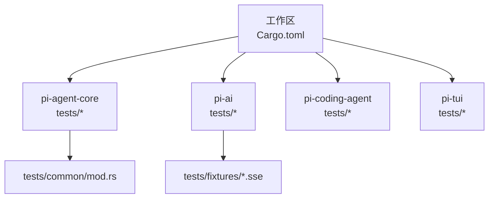
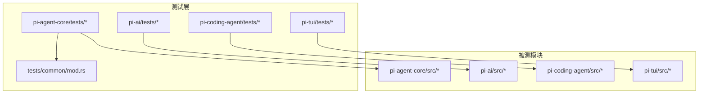
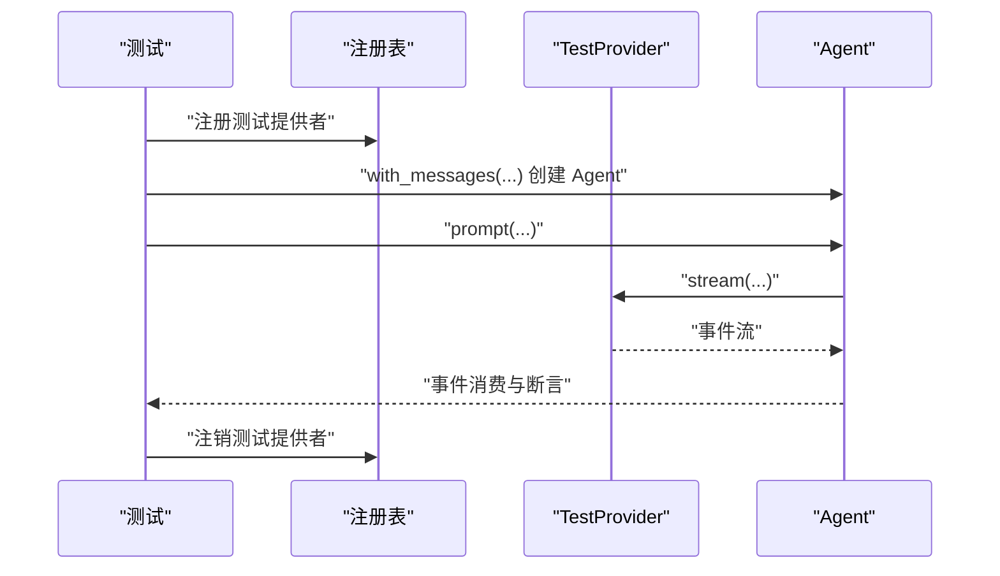
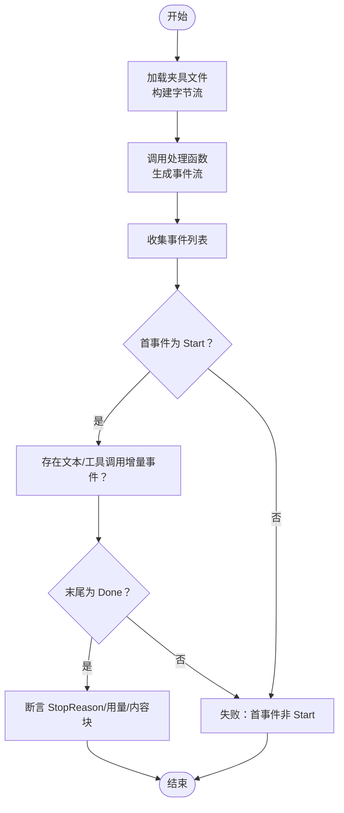
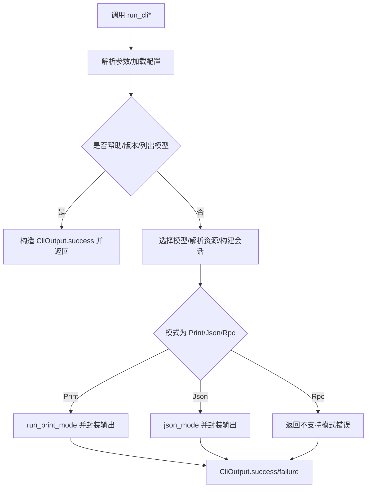
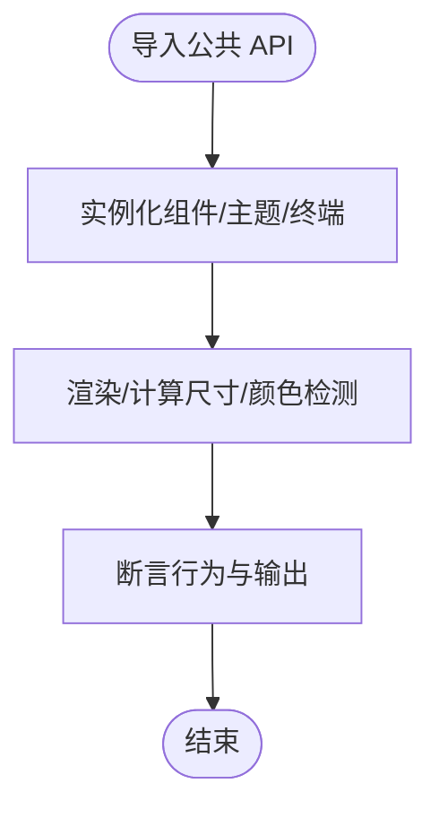
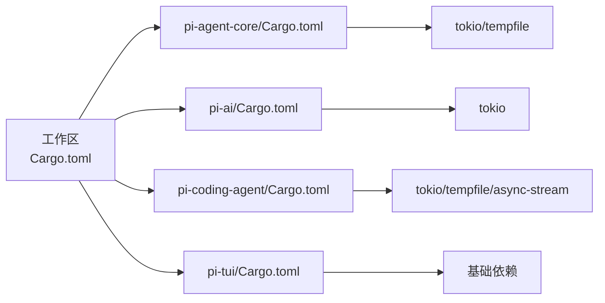

# 单元测试

<cite>
**本文引用的文件**
- [Cargo.toml](file://Cargo.toml)
- [pi-agent-core/Cargo.toml](file://crates/pi-agent-core/Cargo.toml)
- [pi-ai/Cargo.toml](file://crates/pi-ai/Cargo.toml)
- [pi-coding-agent/Cargo.toml](file://crates/pi-coding-agent/Cargo.toml)
- [pi-tui/Cargo.toml](file://crates/pi-tui/Cargo.toml)
- [pi-agent-core/src/lib.rs](file://crates/pi-agent-core/src/lib.rs)
- [pi-ai/src/lib.rs](file://crates/pi-ai/src/lib.rs)
- [pi-coding-agent/src/lib.rs](file://crates/pi-coding-agent/src/lib.rs)
- [pi-tui/src/lib.rs](file://crates/pi-tui/src/lib.rs)
- [pi-agent-core/tests/common/mod.rs](file://crates/pi-agent-core/tests/common/mod.rs)
- [pi-agent-core/tests/agent_hydration.rs](file://crates/pi-agent-core/tests/agent_hydration.rs)
- [pi-agent-core/tests/session_jsonl.rs](file://crates/pi-agent-core/tests/session_jsonl.rs)
- [pi-ai/tests/openai_responses.rs](file://crates/pi-ai/tests/openai_responses.rs)
- [pi-ai/tests/fixtures/openai-responses-text-tool.sse](file://crates/pi-ai/tests/fixtures/openai-responses-text-tool.sse)
- [pi-coding-agent/tests/public_api.rs](file://crates/pi-coding-agent/tests/public_api.rs)
- [pi-tui/tests/public_api.rs](file://crates/pi-tui/tests/public_api.rs)
</cite>

## 目录
1. [引言](#引言)
2. [项目结构](#项目结构)
3. [核心组件](#核心组件)
4. [架构总览](#架构总览)
5. [详细组件分析](#详细组件分析)
6. [依赖关系分析](#依赖关系分析)
7. [性能考量](#性能考量)
8. [故障排查指南](#故障排查指南)
9. [结论](#结论)
10. [附录](#附录)

## 引言
本文件面向 Pi-Rust 项目的单元测试，系统梳理各 crate 的测试组织方式、命名与实现模式、测试夹具与模拟对象的使用、覆盖率分析方法、断言策略与错误处理测试，并提供可复用的最佳实践与常见问题排查建议。目标是帮助开发者在不深入源码的前提下，快速理解并高效编写高质量的单元测试。

## 项目结构
Pi-Rust 采用工作区（workspace）组织多 crate，每个 crate 可独立运行测试。测试文件通常位于对应 crate 的 tests 目录下，部分 crate 提供公共测试工具模块（如 pi-agent-core 的 tests/common），用于共享模拟与夹具。

图表来源
- [Cargo.toml:1-12](file://Cargo.toml#L1-L12)
- [pi-agent-core/tests/common/mod.rs:1-214](file://crates/pi-agent-core/tests/common/mod.rs#L1-L214)
- [pi-ai/tests/fixtures/openai-responses-text-tool.sse:1-28](file://crates/pi-ai/tests/fixtures/openai-responses-text-tool.sse#L1-L28)

章节来源
- [Cargo.toml:1-12](file://Cargo.toml#L1-L12)

## 核心组件
- 测试组织与命名
  - 每个 crate 的测试文件按功能命名，如 session_jsonl.rs、openai_responses.rs、public_api.rs 等，便于定位与维护。
  - 公共测试工具集中于 tests/common，提供可复用的模拟与夹具，避免重复代码。
- 测试运行与并发
  - 使用 tokio::test 运行异步测试；同步测试使用 #[test]。
  - 部分测试依赖临时文件（tempfile），确保隔离性与可清理性。
- 断言策略
  - 常见断言包括：事件序列匹配、消息内容与结构断言、错误信息包含性断言、文件内容断言等。
- 错误处理测试
  - 通过构造异常路径（如无更多脚本回合、缺失头信息）验证错误分支与错误消息。

章节来源
- [pi-agent-core/tests/common/mod.rs:1-214](file://crates/pi-agent-core/tests/common/mod.rs#L1-L214)
- [pi-agent-core/tests/agent_hydration.rs:1-42](file://crates/pi-agent-core/tests/agent_hydration.rs#L1-L42)
- [pi-agent-core/tests/session_jsonl.rs:1-77](file://crates/pi-agent-core/tests/session_jsonl.rs#L1-L77)
- [pi-ai/tests/openai_responses.rs:1-103](file://crates/pi-ai/tests/openai_responses.rs#L1-L103)
- [pi-coding-agent/tests/public_api.rs:1-57](file://crates/pi-coding-agent/tests/public_api.rs#L1-L57)
- [pi-tui/tests/public_api.rs:1-116](file://crates/pi-tui/tests/public_api.rs#L1-L116)

## 架构总览
下图展示了测试层与被测模块的关系：测试通过公共夹具或直接构造输入，驱动被测逻辑，再对输出进行断言。

图表来源
- [pi-agent-core/src/lib.rs:1-47](file://crates/pi-agent-core/src/lib.rs#L1-L47)
- [pi-ai/src/lib.rs:1-19](file://crates/pi-ai/src/lib.rs#L1-L19)
- [pi-coding-agent/src/lib.rs:1-352](file://crates/pi-coding-agent/src/lib.rs#L1-L352)
- [pi-tui/src/lib.rs:1-61](file://crates/pi-tui/src/lib.rs#L1-L61)
- [pi-agent-core/tests/common/mod.rs:1-214](file://crates/pi-agent-core/tests/common/mod.rs#L1-L214)

## 详细组件分析

### pi-agent-core 测试体系
- 公共夹具（tests/common）
  - 提供 TestProvider 实现 ApiProvider 接口，按队列回放脚本化事件，支持文本与工具调用两类回合。
  - 提供便捷构造器：text_turn、tool_use_turn、faux_model、faux_text_turn 等。
  - 适用于需要稳定、可预测的外部模型响应的场景。
- 典型测试模式
  - 注册/注销测试提供者：通过注册表注入自定义 Provider，测试结束后清理。
  - 事件流断言：消费 Agent 的事件流，断言事件类型、内容与停止原因。
  - 文件持久化断言：基于临时目录与 JSONL 存储，断言头部、条目与叶子节点追踪。
- 关键流程时序（注册表注入与事件消费）

图表来源
- [pi-agent-core/tests/common/mod.rs:19-93](file://crates/pi-agent-core/tests/common/mod.rs#L19-L93)
- [pi-agent-core/tests/agent_hydration.rs:10-41](file://crates/pi-agent-core/tests/agent_hydration.rs#L10-L41)

章节来源
- [pi-agent-core/tests/common/mod.rs:1-214](file://crates/pi-agent-core/tests/common/mod.rs#L1-L214)
- [pi-agent-core/tests/agent_hydration.rs:1-42](file://crates/pi-agent-core/tests/agent_hydration.rs#L1-L42)
- [pi-agent-core/tests/session_jsonl.rs:1-77](file://crates/pi-agent-core/tests/session_jsonl.rs#L1-L77)

### pi-ai 测试体系
- 夹具与数据准备
  - 使用 fixtures 目录存放外部 SSE 数据，测试通过读取文件构建 Bytes 流，模拟真实网络事件。
  - 提供模型构造器与事件流处理器，验证事件序列与聚合结果。
- 典型测试模式
  - 基于夹具的端到端事件流断言：检查 Start、TextDelta、ToolcallDelta、Done 等事件链路。
  - 完整流式聚合测试：对事件流执行 complete，断言消息内容与用量统计。
  - 内置提供者注册测试：验证内置 API 是否正确注册。
- 流程图（事件流处理与断言）

图表来源
- [pi-ai/tests/openai_responses.rs:34-75](file://crates/pi-ai/tests/openai_responses.rs#L34-L75)
- [pi-ai/tests/fixtures/openai-responses-text-tool.sse:1-28](file://crates/pi-ai/tests/fixtures/openai-responses-text-tool.sse#L1-L28)

章节来源
- [pi-ai/tests/openai_responses.rs:1-103](file://crates/pi-ai/tests/openai_responses.rs#L1-L103)
- [pi-ai/tests/fixtures/openai-responses-text-tool.sse:1-28](file://crates/pi-ai/tests/fixtures/openai-responses-text-tool.sse#L1-L28)

### pi-coding-agent 测试体系
- 公共 API 可发现性测试
  - 覆盖 CLI 参数解析、打印模式选项、运行时选项、错误类型与帮助文本等符号的可用性。
- 典型测试模式
  - 结构体字段断言：验证默认值与派生行为。
  - 函数/方法调用断言：验证返回值与副作用。
- 流程图（CLI 输出封装）

图表来源
- [pi-coding-agent/src/lib.rs:83-334](file://crates/pi-coding-agent/src/lib.rs#L83-L334)
- [pi-coding-agent/tests/public_api.rs:29-57](file://crates/pi-coding-agent/tests/public_api.rs#L29-L57)

章节来源
- [pi-coding-agent/src/lib.rs:1-352](file://crates/pi-coding-agent/src/lib.rs#L1-L352)
- [pi-coding-agent/tests/public_api.rs:1-57](file://crates/pi-coding-agent/tests/public_api.rs#L1-L57)

### pi-tui 测试体系
- 公共 API 可发现性测试
  - 覆盖组件、主题、终端能力、图像渲染、自动补全等公共符号的可用性与基本行为。
- 典型测试模式
  - 组件渲染与尺寸断言：验证容器渲染行数、终端尺寸等。
  - 主题与颜色断言：验证主题模式与颜色级别检测。
  - 图像协议编码与删除断言：验证 Kitty/iTerm2 编码与清理。
- 流程图（公共 API 可用性）

图表来源
- [pi-tui/src/lib.rs:1-61](file://crates/pi-tui/src/lib.rs#L1-L61)
- [pi-tui/tests/public_api.rs:14-116](file://crates/pi-tui/tests/public_api.rs#L14-L116)

章节来源
- [pi-tui/src/lib.rs:1-61](file://crates/pi-tui/src/lib.rs#L1-L61)
- [pi-tui/tests/public_api.rs:1-116](file://crates/pi-tui/tests/public_api.rs#L1-L116)

## 依赖关系分析
- 工作区与 crate 依赖
  - 工作区成员包含多个 crate，彼此通过 path 依赖相互引用。
  - 各 crate 在 dev-dependencies 中引入 tokio、tempfile 等测试相关依赖，保证测试环境一致性。
- 测试耦合与内聚
  - 测试内部耦合集中在公共夹具（如 pi-agent-core 的 tests/common），降低重复代码，提高内聚性。
  - 外部依赖通过模拟对象（如 TestProvider）隔离，避免真实网络请求与外部状态。

图表来源
- [Cargo.toml:1-12](file://Cargo.toml#L1-L12)
- [pi-agent-core/Cargo.toml:20-23](file://crates/pi-agent-core/Cargo.toml#L20-L23)
- [pi-ai/Cargo.toml:19-21](file://crates/pi-ai/Cargo.toml#L19-L21)
- [pi-coding-agent/Cargo.toml:24-27](file://crates/pi-coding-agent/Cargo.toml#L24-L27)
- [pi-tui/Cargo.toml:1-14](file://crates/pi-tui/Cargo.toml#L1-L14)

章节来源
- [Cargo.toml:1-12](file://Cargo.toml#L1-L12)
- [pi-agent-core/Cargo.toml:1-23](file://crates/pi-agent-core/Cargo.toml#L1-L23)
- [pi-ai/Cargo.toml:1-21](file://crates/pi-ai/Cargo.toml#L1-L21)
- [pi-coding-agent/Cargo.toml:1-27](file://crates/pi-coding-agent/Cargo.toml#L1-L27)
- [pi-tui/Cargo.toml:1-14](file://crates/pi-tui/Cargo.toml#L1-L14)

## 性能考量
- 异步测试与并发
  - 使用 tokio::test 运行异步测试，注意避免不必要的阻塞与死锁；合理拆分测试以缩短执行时间。
- 临时文件与 I/O
  - 使用 tempfile 创建隔离的测试文件，减少磁盘争用；及时清理，避免测试间互相影响。
- 模拟对象与外部依赖
  - 通过模拟对象替代真实网络请求，显著降低测试延迟与外部依赖风险。
- 断言粒度
  - 将复杂断言拆分为多个小断言，有助于定位问题并减少单次测试的执行时间。

## 故障排查指南
- 注册表未清理导致的“无更多脚本回合”
  - 现象：Provider 返回错误事件，提示无更多脚本回合。
  - 处理：确保测试结束时调用注销接口，避免污染其他测试。
- JSONL 文件头缺失导致的打开失败
  - 现象：打开已存在文件时报错，提示首行不是有效会话头。
  - 处理：确保先写入标准头，再追加条目；或使用正确的初始化流程。
- SSE 夹具格式错误
  - 现象：事件流处理失败或断言不通过。
  - 处理：核对夹具文件格式与事件顺序，确保与处理函数期望一致。
- CLI 输出断言失败
  - 现象：帮助文本、默认选项或错误信息不符合预期。
  - 处理：检查默认值与派生实现，必要时调整断言条件。

章节来源
- [pi-agent-core/tests/common/mod.rs:32-48](file://crates/pi-agent-core/tests/common/mod.rs#L32-L48)
- [pi-agent-core/tests/session_jsonl.rs:62-76](file://crates/pi-agent-core/tests/session_jsonl.rs#L62-L76)
- [pi-ai/tests/openai_responses.rs:34-75](file://crates/pi-ai/tests/openai_responses.rs#L34-L75)
- [pi-coding-agent/tests/public_api.rs:29-57](file://crates/pi-coding-agent/tests/public_api.rs#L29-L57)
- [pi-tui/tests/public_api.rs:14-116](file://crates/pi-tui/tests/public_api.rs#L14-L116)

## 结论
Pi-Rust 的单元测试体系以“公共夹具 + 模拟对象 + 夹具文件”的组合为核心，覆盖了异步事件流、文件持久化、公共 API 可用性等多个维度。通过规范化的命名与组织方式、清晰的断言策略与错误处理测试，以及合理的性能与故障排查实践，能够有效保障代码质量与可维护性。建议在新增测试时遵循现有模式，优先使用公共夹具与模拟对象，确保测试的稳定性与可重复性。

## 附录

### 测试覆盖率分析与提升
- 覆盖率工具
  - 使用 cargo-tarpaulin 或类似工具在 CI 中收集覆盖率报告，关注未覆盖的分支与路径。
- 提升策略
  - 为错误分支补充断言（如缺失头、无脚本回合、无效参数等）。
  - 对复杂流程（如事件流聚合、CLI 分支）拆分测试，增加边界条件与异常路径覆盖。
  - 利用夹具文件覆盖多种外部响应形态，提升事件流断言的覆盖面。

### 测试数据准备策略
- 夹具文件
  - 将外部数据（如 SSE）放入 fixtures 目录，测试中读取并转换为事件流，确保数据稳定且可复现。
- 临时文件
  - 使用 tempfile 创建隔离的测试文件，断言文件内容与结构，测试后自动清理。
- 模拟对象
  - 在公共夹具中实现最小可用的 Provider/服务接口，按需注入到被测逻辑，避免真实依赖。

### 模拟对象最佳实践
- 保持最小接口实现：仅实现测试所需的接口方法，避免过度模拟。
- 显式控制状态：通过队列或状态字段控制返回值与事件序列，便于断言。
- 清理与隔离：测试结束后注销或重置模拟对象，避免跨测试干扰。

### 断言策略与错误处理测试
- 断言策略
  - 事件流：断言首尾事件类型与顺序，断言关键字段（如用量、停止原因、内容块类型）。
  - 文件与结构：断言文件头、条目数量与内容片段，断言结构体字段与派生行为。
- 错误处理
  - 构造异常路径（如无脚本回合、缺失头、无效参数），断言错误消息与错误码。
  - 对外部依赖失败场景进行模拟，验证降级与错误传播。