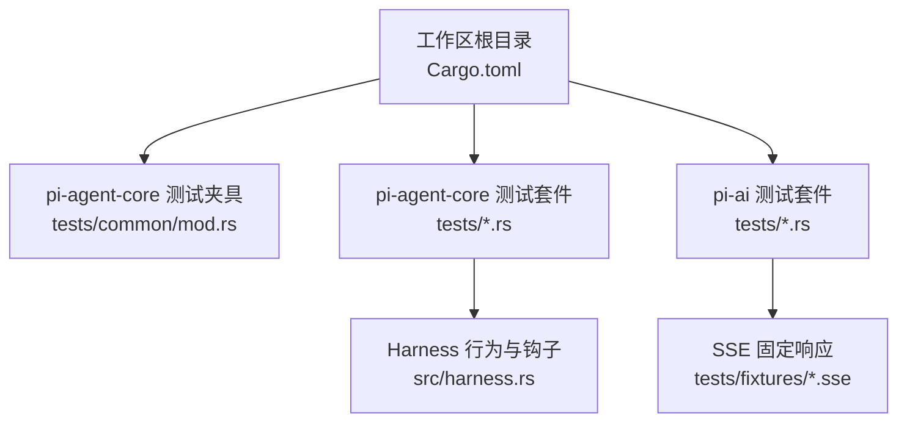
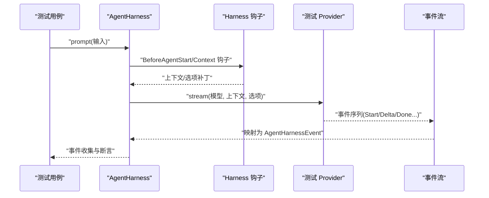
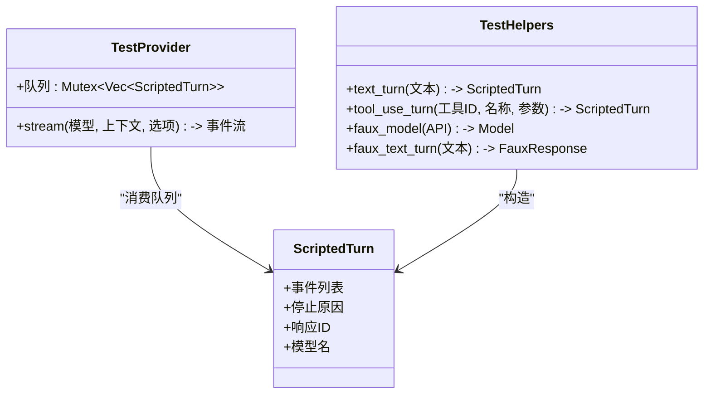
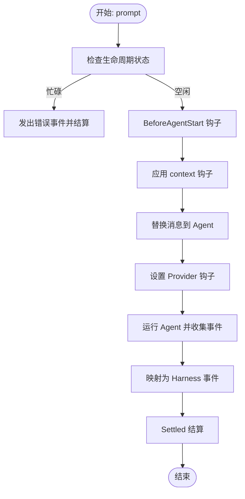
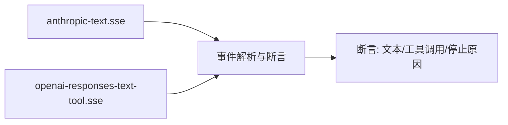
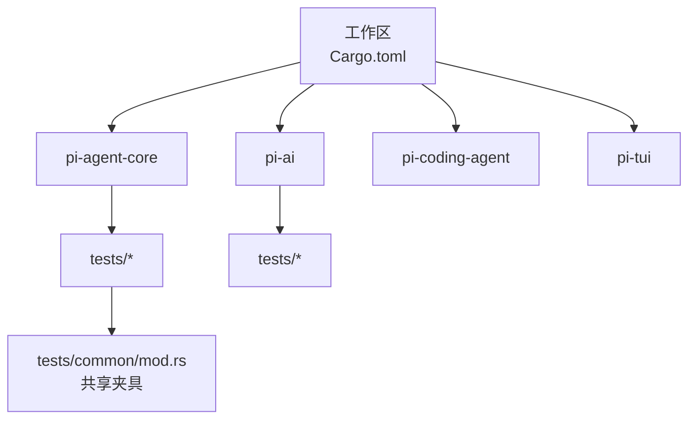

# 测试工具与辅助

<cite>
**本文引用的文件**
- [crates/pi-agent-core/tests/common/mod.rs](file://crates/pi-agent-core/tests/common/mod.rs)
- [crates/pi-agent-core/src/harness.rs](file://crates/pi-agent-core/src/harness.rs)
- [crates/pi-agent-core/tests/m9_harness.rs](file://crates/pi-agent-core/tests/m9_harness.rs)
- [crates/pi-agent-core/tests/harness_types.rs](file://crates/pi-agent-core/tests/harness_types.rs)
- [crates/pi-ai/tests/fixtures/anthropic-text.sse](file://crates/pi-ai/tests/fixtures/anthropic-text.sse)
- [crates/pi-ai/tests/fixtures/openai-responses-text-tool.sse](file://crates/pi-ai/tests/fixtures/openai-responses-text-tool.sse)
- [crates/pi-ai/tests/faux.rs](file://crates/pi-ai/tests/faux.rs)
- [crates/pi-ai/tests/request_building.rs](file://crates/pi-ai/tests/request_building.rs)
- [Cargo.toml](file://Cargo.toml)
</cite>

## 目录
1. [引言](#引言)
2. [项目结构](#项目结构)
3. [核心组件](#核心组件)
4. [架构总览](#架构总览)
5. [详细组件分析](#详细组件分析)
6. [依赖关系分析](#依赖关系分析)
7. [性能考量](#性能考量)
8. [故障排除指南](#故障排除指南)
9. [结论](#结论)
10. [附录](#附录)

## 引言
本文件面向 Pi-Rust 项目的测试工具与辅助功能，系统性梳理测试夹具（fixture）与共享测试数据的组织方式、测试辅助函数与宏的实现模式、测试数据管理策略、测试环境配置最佳实践（含容器化与 CI/CD），并提供可直接复用的工具使用示例与调试方法。目标是帮助开发者快速搭建稳定、可维护且高性能的测试体系。

## 项目结构
Pi-Rust 采用多 crate 的工作区布局，测试主要集中在各 crate 的 tests 目录中；同时在 pi-agent-core 提供了通用的测试夹具模块，便于跨测试共享。

图表来源
- [Cargo.toml:1-12](file://Cargo.toml#L1-L12)
- [crates/pi-agent-core/tests/common/mod.rs:1-214](file://crates/pi-agent-core/tests/common/mod.rs#L1-L214)
- [crates/pi-agent-core/src/harness.rs:1-800](file://crates/pi-agent-core/src/harness.rs#L1-L800)
- [crates/pi-ai/tests/fixtures/anthropic-text.sse:1-23](file://crates/pi-ai/tests/fixtures/anthropic-text.sse#L1-L23)
- [crates/pi-ai/tests/fixtures/openai-responses-text-tool.sse:1-28](file://crates/pi-ai/tests/fixtures/openai-responses-text-tool.sse#L1-L28)

章节来源
- [Cargo.toml:1-12](file://Cargo.toml#L1-L12)

## 核心组件
- 测试夹具与共享数据
  - 在 pi-agent-core 的 tests/common/mod.rs 中提供了可复用的测试夹具：脚本化对话回合（ScriptedTurn）、测试 Provider（TestProvider）、常用构造器（如文本回合、工具调用回合）、以及模型与响应对象的构建辅助函数。这些夹具用于模拟真实 Provider 的事件流，确保测试在可控、可重复的输入下运行。
- 测试辅助函数与宏
  - 在 pi-agent-core 的 harness 模块中实现了 AgentHarness，支持事件订阅、钩子注册、请求前/负载/响应阶段的补丁机制等。测试通过注册钩子与观察者，验证事件流转与参数变更是否按预期生效。
- 测试数据管理
  - 在 pi-ai 的 tests/fixtures 下存放了标准 SSE 响应片段，用于验证不同 Provider 的事件解析与转换逻辑。这些固定响应作为“契约式测试”的输入，保证跨版本兼容性。
- 测试类型与默认值校验
  - 在 pi-agent-core/tests/harness_types.rs 中对 CLI 解析、默认配置等进行断言，确保行为与基线一致。

章节来源
- [crates/pi-agent-core/tests/common/mod.rs:1-214](file://crates/pi-agent-core/tests/common/mod.rs#L1-L214)
- [crates/pi-agent-core/src/harness.rs:1-800](file://crates/pi-agent-core/src/harness.rs#L1-L800)
- [crates/pi-ai/tests/fixtures/anthropic-text.sse:1-23](file://crates/pi-ai/tests/fixtures/anthropic-text.sse#L1-L23)
- [crates/pi-ai/tests/fixtures/openai-responses-text-tool.sse:1-28](file://crates/pi-ai/tests/fixtures/openai-responses-text-tool.sse#L1-L28)
- [crates/pi-agent-core/tests/harness_types.rs:1-86](file://crates/pi-agent-core/tests/harness_types.rs#L1-L86)

## 架构总览
下图展示了测试夹具、Harness 钩子与 Provider 的交互关系，以及事件流在测试中的传播路径。

图表来源
- [crates/pi-agent-core/src/harness.rs:520-677](file://crates/pi-agent-core/src/harness.rs#L520-L677)
- [crates/pi-agent-core/tests/common/mod.rs:32-93](file://crates/pi-agent-core/tests/common/mod.rs#L32-L93)
- [crates/pi-agent-core/tests/m9_harness.rs:144-212](file://crates/pi-agent-core/tests/m9_harness.rs#L144-L212)

## 详细组件分析

### 测试夹具与共享数据（pi-agent-core/tests/common）
- 脚本化回合（ScriptedTurn）
  - 以事件列表与停止原因描述一次完整的对话回合，便于在测试中重现特定的 Provider 行为。
- 测试 Provider（TestProvider）
  - 实现 ApiProvider 接口，从队列中顺序弹出回合并逐事件发出，最后补充 Done 事件；当队列耗尽时返回错误消息，便于测试边界条件。
- 辅助构造器
  - 文本回合与工具调用回合的构造器，生成符合事件流规范的初始状态与增量内容，简化测试准备。
- 模型与响应对象
  - 提供 Faux 模型与 Faux 响应的便捷构造，适配不同 Provider 的事件风格。

图表来源
- [crates/pi-agent-core/tests/common/mod.rs:11-214](file://crates/pi-agent-core/tests/common/mod.rs#L11-L214)

章节来源
- [crates/pi-agent-core/tests/common/mod.rs:1-214](file://crates/pi-agent-core/tests/common/mod.rs#L1-L214)

### Harness 钩子与事件流（pi-agent-core/src/harness）
- 生命周期与事件
  - AgentHarness 将 Agent 的内部事件映射为更丰富的 Harness 事件，覆盖启动前、上下文、Provider 请求前后、工具调用、会话压缩/分支树、资源/工具/队列更新、保存点、中止、结算等。
- 钩子与补丁
  - 支持 before_agent_start、context、before_provider_request、before_provider_payload、after_provider_response、get_api_key_and_headers 等钩子；通过 Patch/StreamOptionsPatch/HeaderPatch 等结构对上下文与请求选项进行细粒度修改。
- 观察者与订阅
  - 提供 subscribe 与 on 注册机制，允许测试在不侵入主流程的前提下捕获事件并断言。

图表来源
- [crates/pi-agent-core/src/harness.rs:520-677](file://crates/pi-agent-core/src/harness.rs#L520-L677)
- [crates/pi-agent-core/src/harness.rs:680-708](file://crates/pi-agent-core/src/harness.rs#L680-L708)

章节来源
- [crates/pi-agent-core/src/harness.rs:1-800](file://crates/pi-agent-core/src/harness.rs#L1-L800)

### 测试数据与固定响应（pi-ai/tests/fixtures）
- SSE 固定响应
  - anthropic-text.sse 与 openai-responses-text-tool.sse 提供标准事件序列，用于验证不同 Provider 的事件解析、工具调用参数拼接、停止原因等。
- 使用场景
  - 在测试中注册对应的 Provider，基于固定响应断言事件流与最终消息内容，避免对外部服务的依赖。

图表来源
- [crates/pi-ai/tests/fixtures/anthropic-text.sse:1-23](file://crates/pi-ai/tests/fixtures/anthropic-text.sse#L1-L23)
- [crates/pi-ai/tests/fixtures/openai-responses-text-tool.sse:1-28](file://crates/pi-ai/tests/fixtures/openai-responses-text-tool.sse#L1-L28)

章节来源
- [crates/pi-ai/tests/fixtures/anthropic-text.sse:1-23](file://crates/pi-ai/tests/fixtures/anthropic-text.sse#L1-L23)
- [crates/pi-ai/tests/fixtures/openai-responses-text-tool.sse:1-28](file://crates/pi-ai/tests/fixtures/openai-responses-text-tool.sse#L1-L28)

### 典型测试用例与工具使用示例

- 使用测试夹具与 Harness 钩子
  - 示例：在 m9_harness.rs 中，通过注册 before_agent_start/context 钩子，向上下文中注入用户消息；随后断言事件序列包含 BeforeAgentStart、Context、BeforeProviderRequest 与 AgentDone。
  - 示例：在 before_provider_request 钩子中，对上下文与 StreamOptions 进行补丁（如温度、API Key、Headers），并断言最终 Provider 收到的上下文与选项已合并生效。
  - 示例：在 get_api_key_and_headers 与 before_provider_request 组合中，验证多次调用的 Header 合并与删除策略。
  - 示例：在 before_provider_payload/after_provider_response 钩子中，验证 Provider 层的 payload 处理与响应信息透传。

- 使用固定 SSE 响应
  - 示例：在 faux.rs 中，注册 FauxProvider 并基于固定响应断言事件流（文本/工具调用/完成）。

- 类型与默认值校验
  - 示例：在 harness_types.rs 中，断言 ThinkingLevel、ToolExecutionMode、QueueMode 的 CLI 解析结果与 AgentConfig 默认值。

章节来源
- [crates/pi-agent-core/tests/m9_harness.rs:144-559](file://crates/pi-agent-core/tests/m9_harness.rs#L144-L559)
- [crates/pi-ai/tests/faux.rs:1-193](file://crates/pi-ai/tests/faux.rs#L1-L193)
- [crates/pi-agent-core/tests/harness_types.rs:1-86](file://crates/pi-agent-core/tests/harness_types.rs#L1-L86)

## 依赖关系分析
- 工作区成员
  - 工作区包含多个 crate，测试分布在各自目录中，彼此通过公共类型与接口耦合（如 pi_ai 的 Model/Context/StreamOptions 与 pi-agent-core 的 Agent/Harness）。
- 测试间共享
  - pi-agent-core/tests/common/mod.rs 为其他测试提供统一的夹具与辅助函数，降低重复代码与维护成本。

图表来源
- [Cargo.toml:1-12](file://Cargo.toml#L1-L12)
- [crates/pi-agent-core/tests/common/mod.rs:1-214](file://crates/pi-agent-core/tests/common/mod.rs#L1-L214)

章节来源
- [Cargo.toml:1-12](file://Cargo.toml#L1-L12)

## 性能考量
- 事件流与异步处理
  - 测试中大量使用异步事件流（如 EventStream、StreamExt.collect）。建议在长链路测试中限制最大轮次或超时，避免无界等待。
- 钩子与补丁开销
  - 多个钩子串联执行可能带来额外开销。建议仅在必要时注册钩子，并尽量在补丁层做最小化修改。
- 固定响应与外部依赖
  - 使用固定 SSE 响应可显著减少网络抖动带来的不确定性，提升测试稳定性与速度。
- 并发与资源
  - 对于需要并发执行的测试（如多工具调用），注意共享状态的互斥访问（如 Mutex），避免竞态。

## 故障排除指南
- 常见问题
  - 生命周期冲突：Harness 在 Turn 阶段不可重入。若重复触发 prompt 导致 Busy 错误，需等待 Settled 或使用 abort 清理队列。
  - 钩子未生效：确认钩子注册顺序与补丁类型（Patch/StreamOptionsPatch/HeaderPatch）正确，且补丁作用域覆盖到 Provider 请求阶段。
  - Provider 未收到期望参数：核对 get_api_key_and_headers 与 before_provider_request 的合并逻辑，确保 HeaderPatch 的 Merge/清空策略符合预期。
  - 固定响应不匹配：检查 SSE 事件序列与断言点，确保事件顺序与停止原因一致。
- 调试建议
  - 使用 subscribe 订阅所有事件，输出事件序列以便定位问题发生阶段。
  - 在钩子中打印上下文与选项快照，验证补丁是否按序应用。
  - 对长链路测试增加超时与最大轮次限制，避免无限等待。

章节来源
- [crates/pi-agent-core/src/harness.rs:520-677](file://crates/pi-agent-core/src/harness.rs#L520-L677)
- [crates/pi-agent-core/tests/m9_harness.rs:249-456](file://crates/pi-agent-core/tests/m9_harness.rs#L249-L456)

## 结论
Pi-Rust 的测试体系通过“共享夹具 + Harness 钩子 + 固定响应”的组合，实现了高可读性、强可控性的测试方案。借助统一的事件映射与补丁机制，测试能够精确验证复杂交互流程；通过固定响应与最小化外部依赖，提升了稳定性与性能。建议在后续扩展中持续完善夹具覆盖面与断言粒度，并在 CI/CD 中引入并行化与超时保护，进一步提升测试效率。

## 附录
- 测试数据组织与版本控制建议
  - 将固定响应置于 tests/fixtures 目录，命名清晰、按 Provider/场景分类；配合 Git LFS 或二进制附件管理大文件。
  - 对关键响应进行回归测试，确保升级 Provider 后事件语义保持一致。
- 测试环境配置最佳实践
  - 使用 Docker 容器隔离外部服务依赖，结合 docker-compose 编排测试环境；在 CI/CD 中缓存依赖与构建产物，缩短流水线时间。
  - 对于需要真实密钥的测试，使用环境变量注入并在 CI 中启用受限权限与安全存储。
- 工具使用示例索引
  - 使用测试夹具与 Harness 钩子：参见 [crates/pi-agent-core/tests/m9_harness.rs:144-559](file://crates/pi-agent-core/tests/m9_harness.rs#L144-L559)
  - 使用固定 SSE 响应：参见 [crates/pi-ai/tests/faux.rs:1-193](file://crates/pi-ai/tests/faux.rs#L1-L193)
  - 类型与默认值校验：参见 [crates/pi-agent-core/tests/harness_types.rs:1-86](file://crates/pi-agent-core/tests/harness_types.rs#L1-L86)